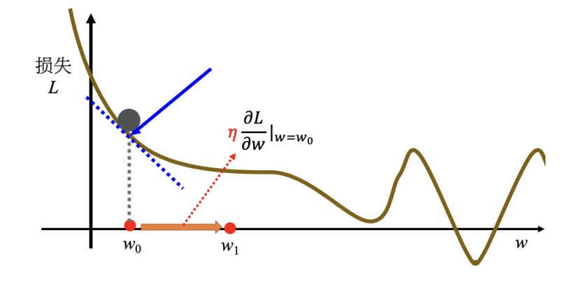
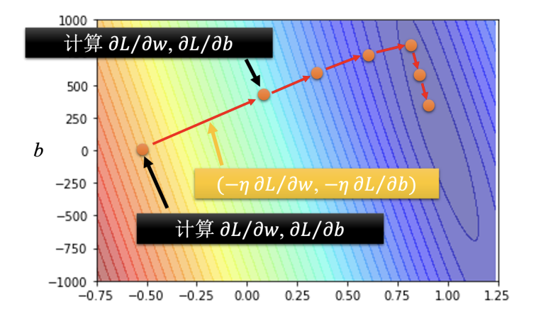
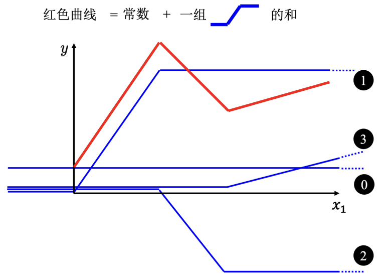
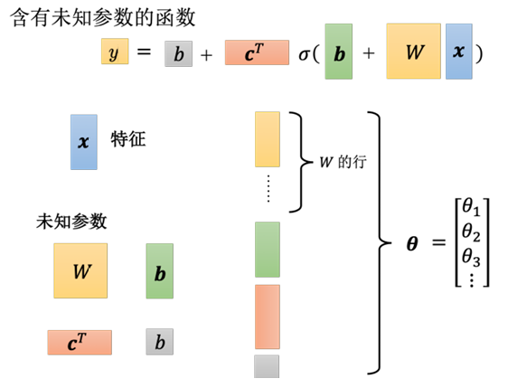
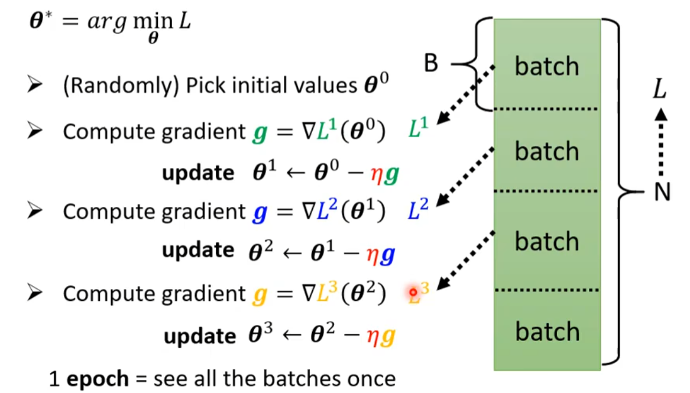
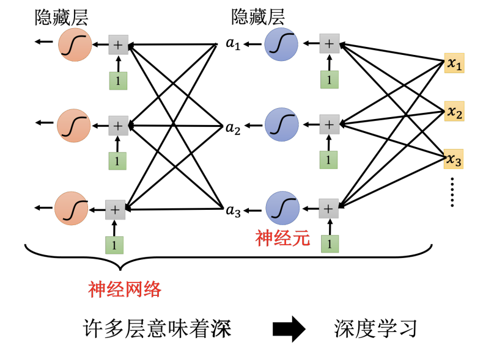
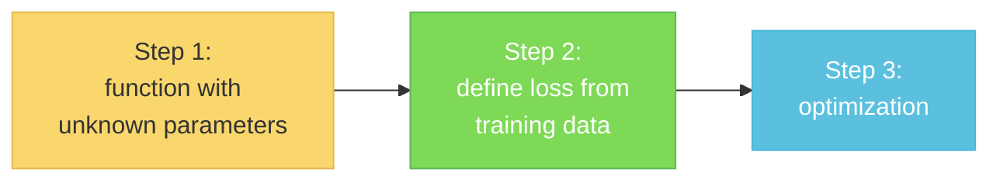

# Chapter1. Machine Learning

- Regression (回归): The function outputs a scalar.
- Classification（分类）: Given options (classes), the function outputs the correct one.
- Structured Learning: create something with structure (image, document)

## 1. How to find a function?

### 1.1 Function with Unknown Parameters

**Model**: $y=b+wx_1$, where $w$ and $b$ are unknown parameters (learned from data)

### 1.2 Define Loss from Training Data

Loss:

$$
L = \frac{1}{N}\sum_n{e_n}
$$

- Loss is a function of parameters. $L (b, w)$
- Loss: how good a set of value is.

$$
\begin{align}
e &= |y-\hat{y}| \quad L \text{ is mean absolute error(MAS)} \\
e &= (y-\hat{y})^2 \quad L \text{ is mean square error(MSE)}
\end{align}
$$

If $y$ and $\hat{y}$ are both probability distributions, then we can use <u>cross entropy交叉熵</u>

### 1.3 Optimization

Find $w^*,b^*=\arg{\min_{w,b}{L}}$ by using *Gradient Descent*

- (Randomly) Pick an initial value $w^0,b^0$
- Compute $\dfrac{\partial{L}}{\partial{w}}|_{w=w_0}\quad \dfrac{\partial{L}}{\partial{b}}|_{b=b_0}$

$$
\begin{align}
w^1 &\leftarrow w^0 - \eta \dfrac{\partial{L}}{\partial{w}}|_{w=w_0}\\
b^1 &\leftarrow b^0 - \eta \dfrac{\partial{L}}{\partial{b}}|_{b=b_0}
\end{align}
$$

    - 斜率的大小决定了移动步伐的大小
    - **学习率**（learning rate）$\eta$ 也会影响步伐大小，被称作**超参数**（hyperparameters）
- Update $w$ and $b$ iteratively

## 1.2 Linear Model

线性模型（linear model）：把输入的特征 $x$ 乘上一个权重 $w$，再加上一个偏置 $b$ 得到预测的结果

### 1.2.1 Piecewise Linear Curve

可以用 ==Sigmoid function== 来逼近 Hard Sigmoid :

$$
y=c\frac{1}{1+e^{-(b+w x_1)}}=c \text{ sigmoid}(b+wx_1)
$$

#### Step 1: Function

New model with more features :

$$
\begin{align}
y = b+wx_1 &\rightarrow
y = b + \sum_{i}\text{sigmoid}(b_i+w_ix_1)
\\
y = b+\sum_{j}w_jx_j &\rightarrow y = b+\sum_{i}c_i\text{ sigmoid}(b_i+\sum_j w_{ij}x_j)
\end{align}
$$

用线性代数来表示，可以得到 :

$$
\boldsymbol{r} = \boldsymbol{b}+ \boldsymbol{W} \boldsymbol{x}
$$

进一步代入式子 :

$$
a_i = \text{sigmoid}(r_i)=\frac{1}{1+e^{-r_1}}\Rightarrow
\boldsymbol{a} = \sigma(\boldsymbol{r})
$$

最终可以得到函数 :

$$
y= b+\boldsymbol{c^T}\boldsymbol{a}
$$

#### Step 2: Loss

Loss is a function of parameters : $L(\theta) = \dfrac{1}{N}\sum_{i}e_i$

#### Step 3: Optimization

Find $\theta^{*}=\arg{\min_{\theta}{L}}$, where $\theta = \begin{bmatrix}  \theta_1 \\ \theta_2 \\ \theta_3 \\ \vdots \end{bmatrix}$

- (Randomly) Pick an initial value $\theta^0$
- Compute ==gradient==:  $g =\begin{bmatrix} \dfrac{\partial{L}}{\partial{\theta_1}}|_{\theta=\theta^0} \\ \dfrac{\partial{L}}{\partial{\theta_2}}|_{\theta=\theta^0} \\ \vdots \end{bmatrix}$ or $g = \nabla L(\theta^0)$ 
- Update $\theta$ :

$$
\begin{align}
\begin{bmatrix}  \theta_1^1 \\ \theta_2^1  \\ \vdots \end{bmatrix}
&\leftarrow
\begin{bmatrix}  \theta_1^0 \\ \theta_2^0 \\ \vdots \end{bmatrix}
-\begin{bmatrix} \eta\dfrac{\partial{L}}{\partial{\theta_1}}|_{\theta=\theta^0} \\ \eta\dfrac{\partial{L}}{\partial{\theta_2}}|_{\theta=\theta^0} \\ \vdots \end{bmatrix}
\\
\theta^1 &\leftarrow \theta^0 - \eta g
\end{align}
$$

!!! tip

    实际使用梯度下降的时候，会把 $N$ 笔数据随机分成多个的==批量（batch）==

    

    把所有的 batch 看过一次，称为一个==回合（epoch）==，每一次更新参数叫做一次==更新 (update)==

### 1.2.2 More Variety of Models

#### Activation Function

ReLU (Rectified Linear Unit，修正线性单元) :

$$
c\cdot \max(0,b+wx_1)
$$

- 可以用两个 ReLU 函数之和来表示 hard sigmoid

#### Deep Learning

迭代公式：

$$
a'=\sigma(b'+W'a) \Leftarrow a=\sigma(b+Wx)
$$

图中 Sigmoid 和 ReLU 被称作 neuron（神经元），构成 neural network（神经网络）

### 1.2.3 Framework of ML

Training data: $\{(x^1,\hat{y}^1),(x^2,\hat{y}^2),\dots,(x^N,\hat{y}^N)\}$
Training:

Testing data: $\{x^{N+1},x^{N+2},\dots,x^{N+M}\}$
