# Chapter10. Self-Supervised Learning

==自监督学习==是一种无标注的学习方式：

- 假设有未标注的文章数据，则可将一篇文章 $x$ 分为两部分：模型的输入 $x'$ 和模型的标签 $x''$
- 将 $x'$ 输入模型并让它输出 $\hat{y}$，让 $\hat{y}$ 尽可能地接近它的标签 $x''$ （学习目标）

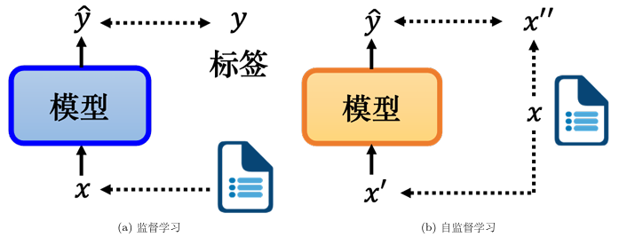

!!! tip "一些题外话"

    Self-supervised model 大多都是以电视节目《芝麻街》的角色命名

    - ELMo：Embeddings from Language Modeling，是最早的自监督学习的模型，名称来自《芝麻街》的红色小怪兽Elmo
    - BERT：Bidirectional Encoder Represen tation from Transformers，名称来自《芝麻街》的另一个角色 Bert； 
    - ERNIE：
        - 有两个不同的模型一个 Enhanced Representation through Knowledge Integration
        - 另一个模型是 Enhanced Language Representation with Informative Entities
        - 名称来自 Bert 最好的朋友 Ernie； 
    - Big Bird：Transformers for Longer Sequences，名称来自《芝麻街》的黄色大鸟BigBird

---

## 10.1 BERT

BERT 是一个 Transformer 的编码器，常用于自然语言处理，下面介绍训练方式。

- **Masking token prediction**
    - 将 mask 对应的输出通过**线性变换**和 **softmax**，最终输出结果

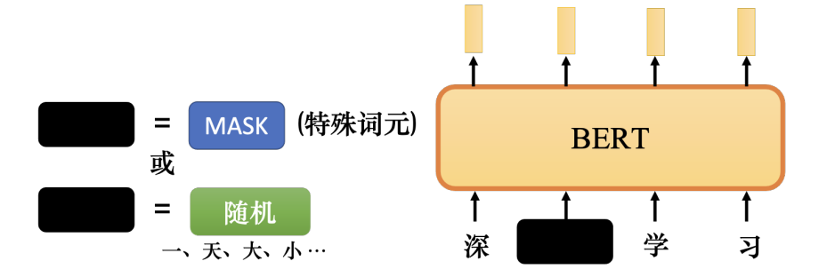

- **Next Sentence Prediction**
    - 将 \[CLS\] 的输出乘以线性变换. 用来预测两个句子是不是相接的
    - 但后来的研究发现，下一句预测对 BERT 将要完成的任务并没有真正的帮助
    - 研究发现，句序预测（判断两个相连句子的前后关系）具有一定作用

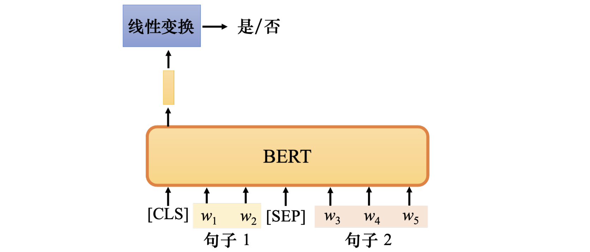

### 10.1.1 Usage of BERT

- 让 BERT 学会通用语言能力的过程称为==预训练(pre-train)==
- 在已经预训练好的 BERT 上，使用某个具体任务的标注数据继续训练的过程称为==微调(fine-tuning)==，经过微调的 BERT 能够解决各种**下游任务（downstream task）**

!!! info "如何评价一个预训练模型？"

    GLUE（General Language Understanding Evaluation）

    - 语言可接受性语料库（theCorpusofLinguisticAcceptabil ity，CoLA）
    - 斯坦福情感树库（the Stanford Sentiment Treebank，SST-2）
    - 微软研究院释义语料库（theMicrosoft Research Paraphrase Corpus，MRPC）
    - 语义文本相似性基准测试（the Semantic Textual Similarity Benchmark，STSB）
    - Quora 问题对（the Quora Question Pairs， QQP）
    - 多类型自然语言推理数据库（the Multi-genre Natural Language Inference corpus， MNLI）
    - 问答自然语言推断（Qusetion-answering NLI，QNLI）
    - 识别文本蕴含数据集（the Recognizing Textual Entailment datasets，RTE）
    - Winograd 自然语言推断（Winograd NLI， WNLI）

    将 BERT 分别在 GLUE 的九个任务上进行微调，计算平均准确率

#### Fine-tuning

**Case1: sentiment analysis**

- 仅关注\[CLS\]对应的输出向量，用于判断句子的情感
- <u>Semi-supervised(半监督)</u>：预训练的阶段是 self-supervised，微调时使用了标注的资料

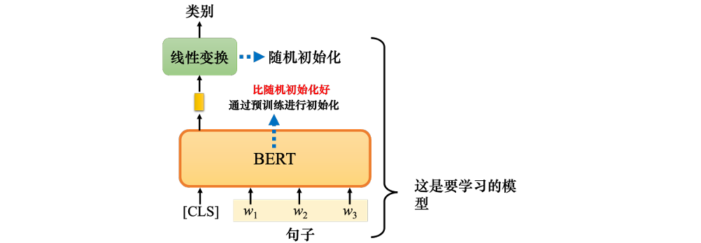

**Case2: POS tagging**

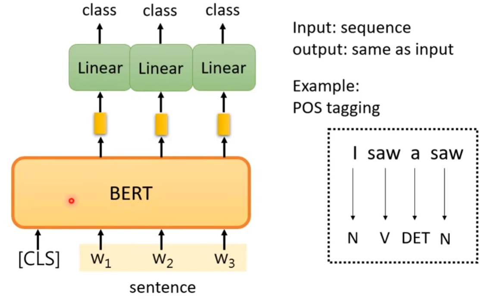

**Case3: NLI**

- 自然语言推理（Natural Language Inference，NLI）
- 输入两个语句：前提（premise）和假设（hypothesis），判断是否可以从前提中推断出假设，即前提与假设是否矛盾

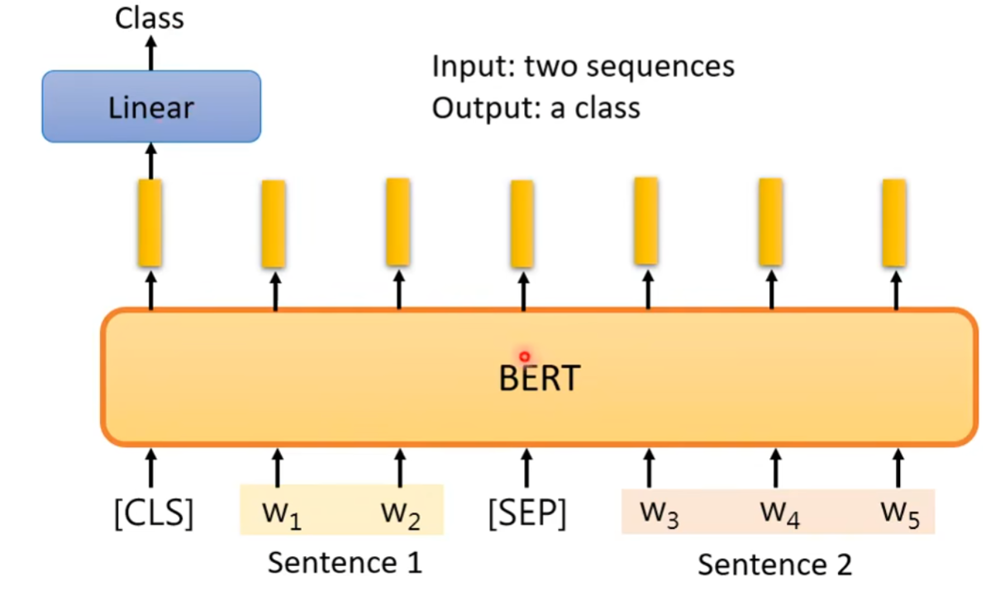

**Case4: Extraction-based QA**

- BERT 是一个 Transformer decoder，所以它可以输入很长的序列，但是自注意力的运算量很高，序列长度主要受计算量限制

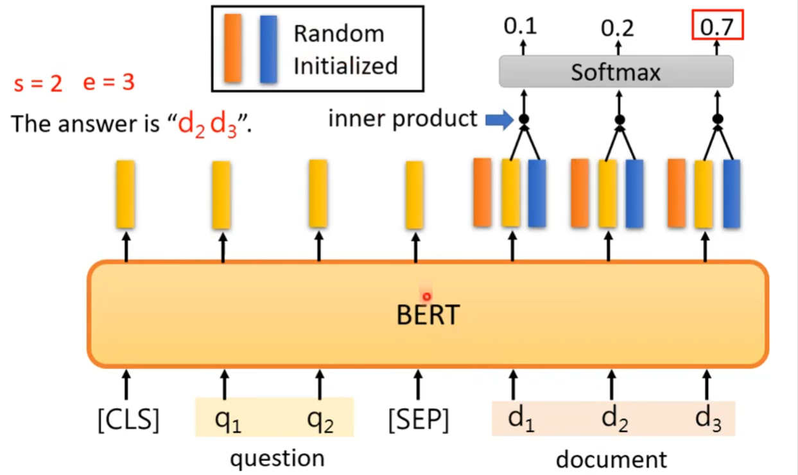

#### Seq2Seq Model

BERT 通过预训练得到的 decoder，下面讲解如何预训练 Seq2Seq model

- 通过损坏 encoder 的 input，让 decoder 学习如何还原损坏前的结果
    - MASS：像 BERT 一样遮住一段内容
    - BART：用各种方式弄坏句子（掩码，删除，乱序，旋转......）

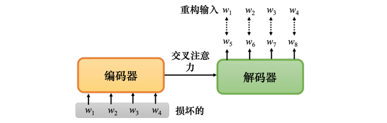

---

### 10.1.2 Why does BERT work?

向 BERT 输入一串文字时，每个文字都有一个对应的输出向量，这个向量称为**嵌入**

- BERT 能够考虑上下文，因此同一个字在不同句子里的 embedding 不同

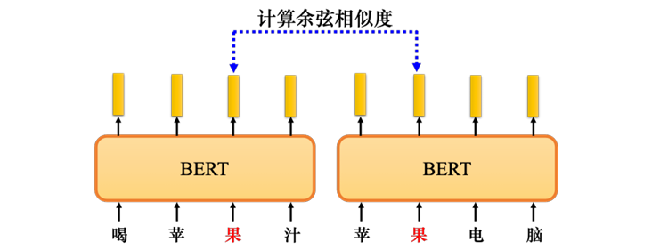

"You shall know a word by the company it keeps." -- John Rupert Firth

- 类似 CBOW 的思想，根据 $w_2$ 的上下文预测空白处的内容
- BERT 得到的 embedding 被称为**语境化的词嵌入（contextualized word embedding）**

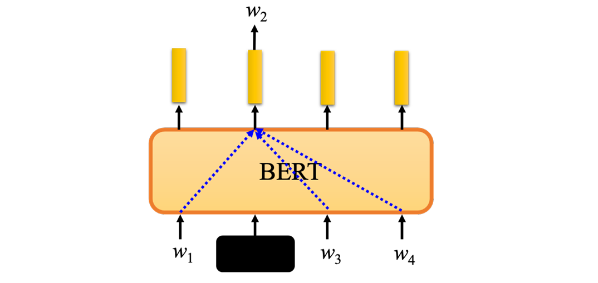

---

### 10.1.3 Variants of BERT

**多语言 BERT（multi-lingual BERT）**

- 利用多种语言预训练出的 BERT，对它而言**不同的语言的差异不大**
- 如果用英文问答数据训练它，它会自动学习如何做中文问答

!!! info "跨语言迁移（Zero-shot Cross-lingual Transfer）"

    - 多语言 BERT 在经过 104 种语言的填空题预训练后，仅通过英文问答数据（SQuAD）微调，就能自动学会做中文问答
    - **语义对齐（Alignment）**
        - 多语言 BERT 将**意思相同**的不同语言单词映射到相近的向量空间
            - 示例：兔子和 rabbit、跳和 jump、鱼和 fish、游和 swim 的嵌入接近
        - 验证指标：**平均倒数排名（MRR）** —— 值越高，跨语言对齐越好。
        - 谷歌 104 语言模型的 MRR 极高，表明模型**忽略语言差异，只关注语义**
    - **语言信息的保留（Language Information）：**
        - 尽管语义对齐，mBERT 并没有完全抹杀语言信息
        - **语言向量（Language Vector）：** 研究发现，所有中文嵌入的平均值与所有英文嵌入的平均值之差，构成了“中文与英文的差距”。将这个“蓝色向量”加到英文句子的嵌入上，mBERT 会产生类似中文的输出。

---

## 10.2 GPT

==Generative Pre-trained Transformer==：predict next token

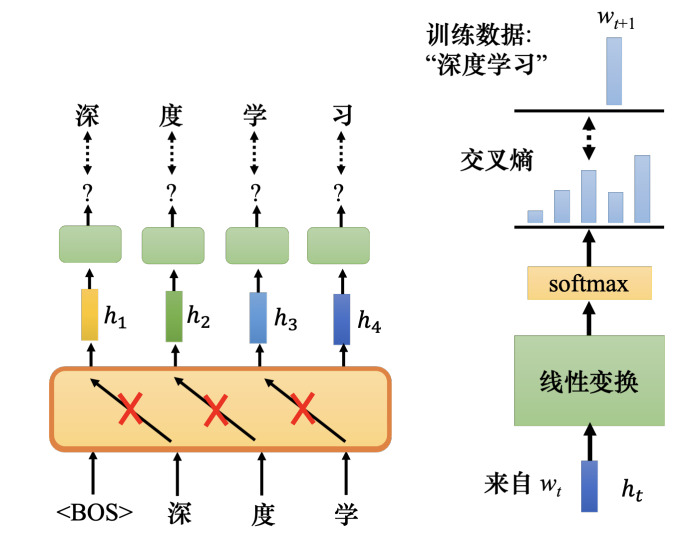

- **模型基础**：GPT 建立在 **Transformer Decoder** 基础上，采用了 Masked Attention 机制，确保在预测某个词元时只能看到之前的上下文，无法窥视未来的信息
- **训练任务**：与 BERT 的“填空题”（Masked Language Modeling）不同，GPT 的核心任务是**预测下一个词元（Next Token Prediction）**
    - 给定起始符 `<BOS>`，模型预测第一个词（如“深”）；
      将 `<BOS>` 和“深”作为输入，预测下一个词（如“度”），以此类推
    - 这种机制赋予了 GPT 强大的**生成能力**，使其能够通过不断预测后续词元来生成完整的文章（例如著名的<u>“独角兽”假新闻生成案例</u>）

!!! info "In-Context Learning"

    由于 GPT 模型参数量巨大，对其进行全量微调（Fine-tuning）成本极高

    - 因此 GPT 系列采用了独特的“**上下文学习**”能力
    - **无需梯度下降**更新参数，仅通过输入格式引导模型完成任务

    | 学习类型                  | 定义     | 操作方式                        | 效果                                                 |
    | :-------------------- | :----- | :-------------------------- | :------------------------------------------------- |
    | 小样本学习 (Few-shot)  | $k$ 很小 | 输入任务描述 + **多个**示例          | GPT-3 在 42 个任务测试中，平均正确率随模型规模增大而提升（从 20%+ 提升至 50%+） |
    | 单样本学习 (One-shot)  | $k=1$  | 输入任务描述 + **1 个**示例（输入/输出对） | 通过一个例子让模型理解任务逻辑                                    |
    | 零样本学习 (Zero-shot) | $k=0$  | 仅输入任务描述（如“把英语翻译成法语”），不提供范例  | 模型具备一定的通用理解能力，但正确率相对较低                             |

自监督学习不仅限于 NLP，同样广泛应用于 CV 和语音（Speech）领域

- **计算机视觉 (CV)：** 典型模型包括 **SimCLR** 和 **BYOL**
    - 其原理类似：通过图像的某种变形或遮挡，让模型预测原始信息。
- **语音 (Speech)：**
    *   **语音版 BERT：** 类似填空题，遮盖一段声音信号，让模型猜测被遮盖的部分。
    *   **语音版 GPT：** 预测接下来会出现的声音信号。
    *   **评估基准：** 类似于 NLP 的 GLUE 基准，语音领域有 **SUPERB** 基准（包含 10 个任务），用于评估模型对语音内容、说话人身份、情感语调等多维度信息的理解能力。
