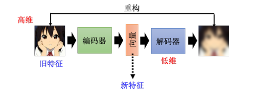
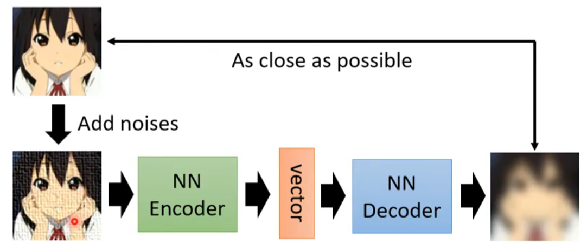
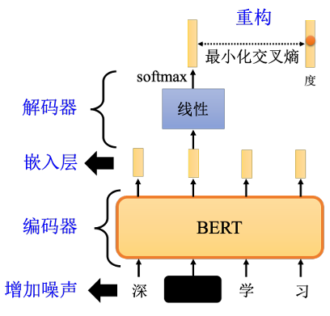
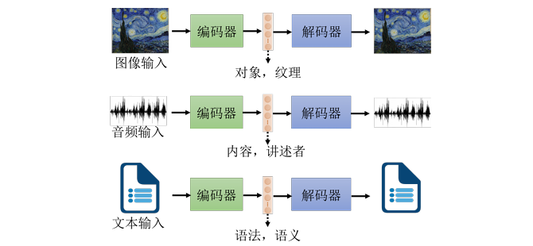
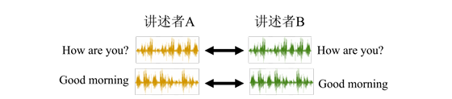
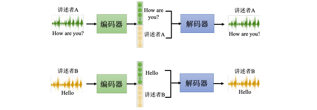
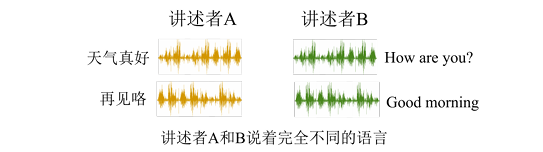
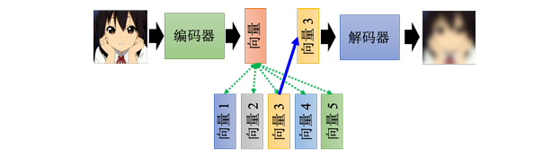

# Chapter11. Auto-encoder

## 11.1 Concept of Auto-encoder

自编码器包含两个网络：

- **编码器（Encoder）**：把高维输入压缩成低维表示（embedding / representation / code）
- **解码器（Decoder）**：根据这个表示，尽可能还原原始输入

核心目标是做**重构（reconstruction）**：

1. 编码器输入一张图片 $x$，输出一个低维向量 $z$
2. 解码器根据 $z$ 生成重构结果 $\hat{x}$
3. 训练时希望 $x$ 和 $\hat{x}$ 尽可能接近

!!! tip

    - Auto-encoder 和 [Cycle GAN](Chapter8.md) 在“经过转换后再还原原输入”这个直觉上有些相似，不过这里的重点不是做跨域翻译，而是学习一个有**压缩性的中间表示**
    - 编码器输出的 $z$ 常被称为：embedding, representation, code

Encoder 的 input 通常是一个高维向量，而 output 通常是一个低维向量，叫做 ==瓶颈（bottleneck）==
因此，自编码器做的事情也可以理解为：

- 把高维数据压缩成低维表示
- 再从低维表示中恢复主要信息
这件事也可以看作一种**降维（dimensionality reduction）**

---

## 11.2 Why Auto-encoder Works

**真实数据虽然表面维度很高，但实际变化可能没有那么复杂。**

- 比如一张 $3\times 3$ 的图像，表面上需要 9 个数来描述，但并非所有的组合都是我们需要的图片，这类图片可能只有集中特定的组合，因此<u>可以用更低的维度表示这些模式</u>
- 所以编码器做的不是“无损压缩任意矩阵”，而是：
    - 利用真实数据分布本身的结构性，**把复杂的输入变成更简单的表示**

!!! info "Historical Note"

    - 自编码器并不是新概念，Hinton 在 2006 年的 Science 工作中已经讨论过相关思路
    - 当时常配合RBM（Restricted Boltzmann Machine） 做逐层预训练
        - 这里的“预训练”更偏向当年深层网络的训练流程；
          和后来自监督学习语境中的 pre-train / fine-tune 不是完全同一个侧重点
        - 早期有人认为编码器和解码器结构应当对称，但现在已经很少使用这种限制了

---

## 11.3 Denoising Auto-encoder

它和普通的 Auto-encoder区别在于：

- Encoder 看到的输入是**加噪后的数据**
- Decoder 要还原的是**加噪前的原始数据**

BERT 也可以被看作一种 Denoising Auto-encoder

- 解码器不一定要是线性层，也可以把中间某层的输出当作 embedding，将后面的层视为解码器

---

## 11.4 Feature Disentanglement

自编码器可应用于**特征解耦（feature disentanglement）**，
解耦是指<u>把一堆本来纠缠在一起的东西解开</u>

Auto-encoder 学到的 embedding 包含了很多信息，当我们通常不知道 embedding 的不同维度对应了哪些因素，因此特征解耦想做的是：

- 在训练自编码器的同时，知道 embedding 的哪些维度代表了哪些信息
- 例如前半部分表示“内容”，后半部分表示“说话人特征”

!!! example "Speech Conversion"

    如果要训练一个语音转换的模型，把 A 的声音转换成 B 的声音

    

    - 收集 A 跟 B 念相同句子的录音（显然不切实际），然后用来训练自监督模型

    假设收集到很多人的声音信号，使用这些数据训练一个自编码器，同时又做了特征解耦

    

    - 可以知道 embedding 的哪些维度代表了语音的内容，哪些维度代表了讲述者的特征
    - 这样就可以用 A 的声音念 B 说的话，用 B 的声音念 A 说的话

      

---

## 11.5 Discrete Latent Representation

隐表征不一定非得是连续实数向量，自编码器还可以用于**离散隐表征**。

- 可以考虑的形式包括：<u>二进制向量、独热向量（one-hot）、其他离散形式</u>
- 这样更容易解释每一维表示什么，有时甚至可用于**无监督分类**

**向量量化变分自编码器（vector quantized variational autoencoder）**

它的运作的原理是：

1. 编码器先输出一个**连续向量**
2. 准备一个**码本**（code book，即一排向量）
3. 计算编码器的输出和码本中各个向量的**相似度**
4. 选出**最相近的码本向量**并作为解码器的输入
于是，解码器输入不再有无穷多种可能，而只会落在码本中的有限个向量上。

!!! tip

    这样的操作类似 self-attention 的计算，即把 encoder 的输出作为 query，而码本的向量同时作为 key 和 value，选择 code book 中的一个向量输入 decoder 中

    - 训练的过程会同时学习**解码器，编码器和码本**
    - 可以获得**离散的隐表征**，即解码器的输入一定是码本中的向量

    如果把 VQ-VAE 用在语音识别上，其中 code book 学习到的就是最基本的发音规则，比如英文的音标或者中文的拼音。码本中的每一个向量就对应一个发音。

!!! question "Can Latent Code Be Text?"

    嵌入能不能是**一段文字**？
    如果可以做到<u>文章 -> 嵌入 -> 原文</u>，那么嵌入很可能是**文章摘要**

    当实际训练存在问题：

    - 编码器和解码器可能会“私下发明暗号”，这段文字未必是人类能理解的摘要
    - 需要**加入判别器**，或者**迫使编码器输出“像人写的句子”**

---

## 11.6 Other Applications

### 1. Decoder as Generator

- 把训练好的解码器单独拿出来
- 输入一个向量
- 输出一张图片 / 一段数据
这和生成器（generator）的工作方式很像。

### 2. Compression

- 编码器：压缩；解码器：解压缩
但这是**有损压缩**：
- 因为重构结果通常不可能与输入完全一致
- 所以会像 JPEG 一样存在失真
