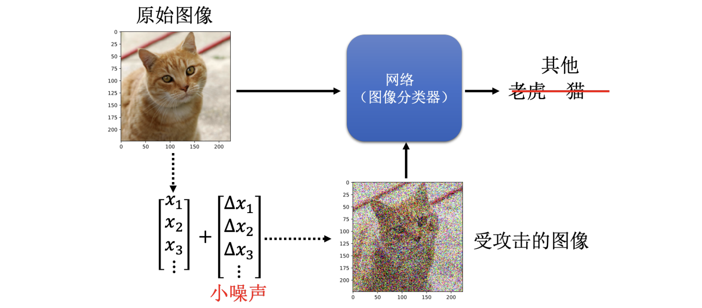
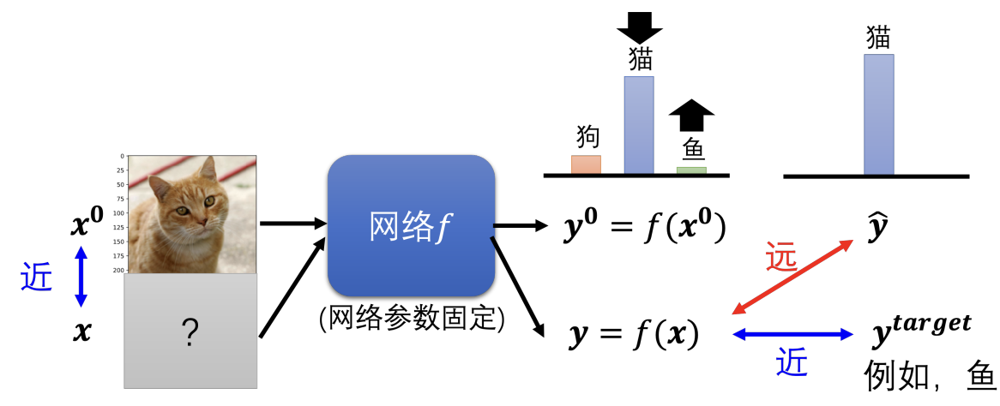
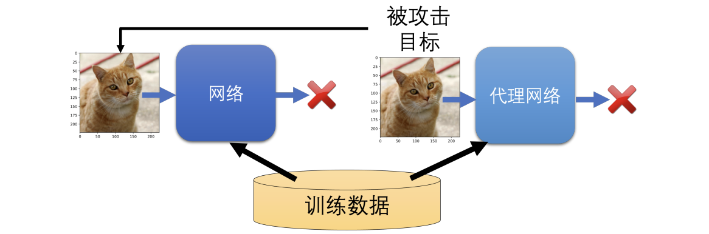
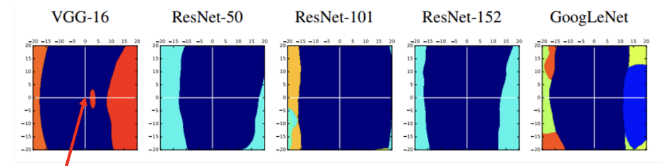
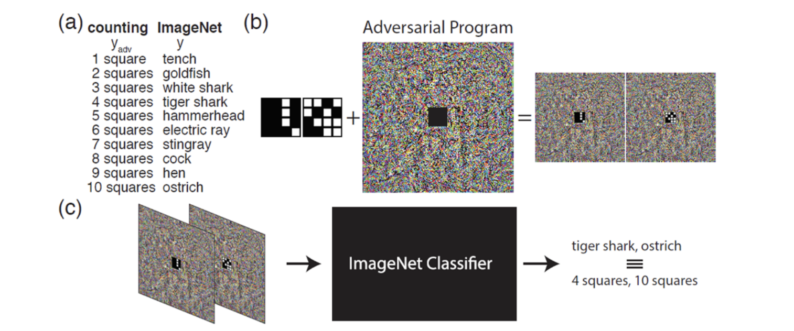
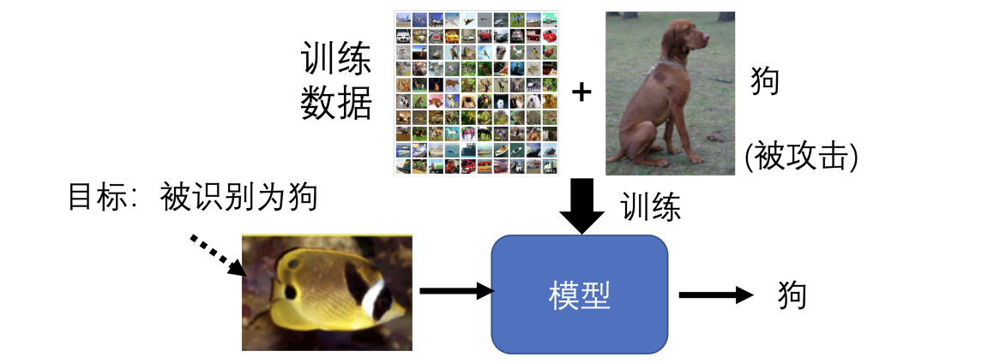
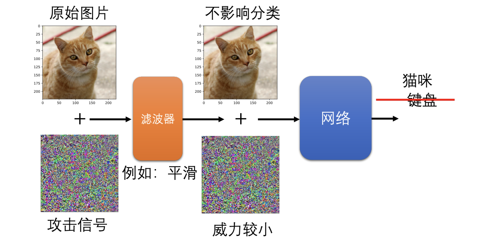
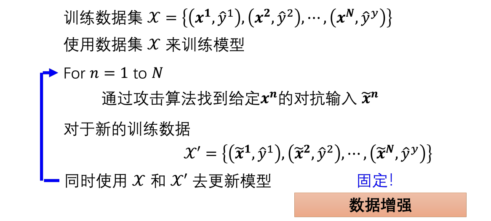

# Chapter12. Adversarial Attack

## 12.1 Introduction

**Example of Attack**
以图像分类为例：

- 原始图像输入模型，输出正确类别
- 在图像上加入一个很小的扰动后，人眼几乎看不出差异
- 但模型的输出却可能**完全改变**

攻击分为两类：

1. **无目标攻击（untargeted attack）**
   让输出不再是原来的正确类别
2. **有目标攻击（targeted attack）**
   让错误的输出变成<u>攻击者指定的类别</u>

---

## 12.2 How to Attack a Network

设：

- 原始图片为 $x_0$，攻击后图片为 $x$
- 网络输出为 $y=f(x)$，正确标签为 $\hat{y}$
攻击的目标：找到一个与 $x_0$ 非常接近，但能让模型出错的 $x$

### Untargeted Attack

无目标攻击可以写成一个优化问题：

$$
x^* =\arg \min L(x)
$$

其中损失被设计成让输出与正确标签差得越远越好，这里用交叉熵 $e(\cdot,\cdot)$ 符号表示：

$$
L(x)=-e(y,\hat{y})
$$

### Targeted Attack

若目标类别记为 $y_{\text{target}}$，则损失的形式为：

$$
L(x)=-e(y,\hat{y})+e(y,y_{\text{target}})
$$

直观上就是：<u>远离正确答案的同时靠近攻击目标</u>

### Constraint on Perturbation

攻击不能太夸张，即 $x$ 和 $x^0$ 不能差距过大，因此还要加一个限制：

$$
d(x_0,x)\le \epsilon
$$

教材举了两种常见距离：

1. $L_2$ - norm 

$$
d(x_0,x) = \|x-x_0\|_2 = \sum_i (\Delta x_i)^2
$$

2. $L_\infty$ - norm

$$
d(x_0,x) = \|x-x_0\|_\infty = \max_i |\Delta x_i|
$$

两者的主要区别：

- $L_2$ 看整体的改动量
- $L_\infty$ 看“某个像素改得最大有多大”
通常若想符合“<u>人眼不容易察觉</u>”，$L_\infty$ 往往更常被拿来约束最大局部改动。

### Optimization

如果暂时忽略约束 $d(x_0,x)\le \epsilon$，那么问题就和普通优化非常像：

- 固定模型参数，把 $x$ 当成可优化变量
- 以 $x_0$ 为初始值，对 $x$ 做梯度下降
加入约束后，只需在每次更新后：
- 检查新的 $x$ 是否超出允许范围
- 若超出，就把它“拉回”约束集合内

---

## 12.3 Fast Gradient Sign Method

FGSM（Fast Gradient Sign Method，快速梯度符号法）的核心特点：**只更新一次**
若用下式表示梯度：

$$
g=\nabla_x L(x_0)
$$

则 FGSM 的更新可以写成：

$$
x = x_0 - \epsilon \cdot \text{sign}(g)
$$

其中：

$$
\text{sign}(g_i)=
\begin{cases}
1, & g_i>0 \\
-1, & g_i<0
\end{cases}
$$

直观理解：

- 不管梯度绝对值大小
- 只看每一维该往正方向还是负方向改
- 每一维都直接走到允许步长的上限

!!! info

    在 $L_\infty$ 约束下，这种一步走到“边界角落”的策略简单且有效
    做多步迭代通常效果会更好，但实现更复杂，而且要处理“出界后拉回”的问题。

---

## 12.4 White-box and Black-box Attack

### White-box Attack

白盒攻击假设攻击者知道：

- 模型结构
- 模型参数
- 损失函数
- 梯度
因此可以直接梯度攻击。

### Black-box Attack

目标模型的内部细节未知，如果知道目标模型的 training data：

- 训练一个 ==代理网络（surrogate model）==
- 让它模仿被攻击模型生成 attack objects
- 对代理网络做攻击，并将这种攻击迁移到目标模型上

若不了解训练数据，也可以往目标系统里输入一些样本，并记录输入与输出，最终用这些输入输出的资料对去训练一个代理模型。

教材总结的一个重要现象是：

- 黑盒攻击仍然可能相当成功
- 尤其在无目标攻击里更容易成功

!!! question "Why Does Transfer Happen?"

    

    - 不同模型在某些“脆弱方向”上可能很相似
    - 一个模型容易被某方向扰动骗过，别的模型往往也会沿类似方向出错

    也有观点（ [Adversial Example Are Not Bugs, They Are Features](https://arxiv.org/abs/1905.02175)）认为 data 是 adversarial 可以成功的主要原因

==One pixel attack==：修改一个像素点，即可实现攻击
==Universal Adversarial Attack==：对多种图像采用同一种有效的攻击方式

---

## 12.5 Other Attack Cases

### 1. Other Modalities

不仅图像会被攻击，语音系统也会被攻击：

- 加入人耳难以觉察的小噪声，就可能让伪造语音被判成真实语音

### 2. Real-world Attack

现实世界攻击不再是“往内存里的图片加噪声”，而是<u>直接改现实物体</u>

- 佩戴特制眼镜，欺骗人脸识别系统
- 篡改路标，误导自动驾驶系统

这里比数字空间更难，因为还要考虑：

- 视角变化
- 摄像头分辨率
- 打印颜色与现实材料差异

### 3. Adversarial Reprogramming

==对抗性重编程（adversarial reprogramming）== 的想法非常有意思：

- 不只是让模型“识别错误”，而是让现有模型去完成一个它原本没打算做的任务

- 这里以数方块数量为例，具体的方法是把要数方块的图片嵌入在噪声中，并且图片周围加入噪声，再把加噪声的图片输入到图像分类器里面，原来的图像分类器就会输出想要的结果

### 4. Backdoor Attack

还有一种更隐蔽的做法是 ==后门攻击（backdoor attack）==：

- 在训练阶段就埋下触发条件
- 平时模型表现正常，只有看到特定触发样本时，才会产生指定错误

!!! bug

    在训练集中加入看起来“正常”的特殊数据误导模型

    

    后门攻击的危险之处在于：

    - 训练数据表面上看起来“正常”，模型在绝大多数样本上也“正常”
    - 但攻击者一旦提供触发样本，模型就会暴露后门

---

## 12.6 Passive Defense

被动防御：不改原模型，而是在模型前面加一个滤波器（filter）

- 具体操作：滤波器通过对输入做**平滑 / 模糊化**，就可以有效削弱攻击噪声
- 有效原因：能成功攻击的噪声往往比较“特定”，轻微平滑可能破坏这种精确结构

被动防御的一些变体：

- Image Compression: 图像先压缩再解压缩
- Generator: 用生成模型重画输入
- Randomization：随机化防御（缩放、平移、贴到背景上等）

!!! bug "Passive Defence 的弱点："

    - 对正常样本可能带来副作用，影响实际结果
    - 如果攻击者知道了防御方式，就能把这层防御一并纳入攻击的过程

---

## 12.7 Active Defense

此处主要介绍<u> 对抗训练（adversarial training）</u>

- 使用原始数据 $X$ 和被攻击后的样本 $\tilde{X}$ 一同训练模型

可以把流程概括为：

1. 先拿训练样本 $X$ 生成对抗样本 $\tilde X$
2. 对抗样本 $\tilde X$ 仍然配原来的正确标签 $Y$
3. 原始样本与对抗样本混合训练

也可以把这种方法看成一种**数据增强（data augmentation）**

- 能增强模型的鲁棒性，有时还能防止过拟合，改善泛化表现
- 但挡不住新攻击，生成数据和训练模型的计算成本非常高
