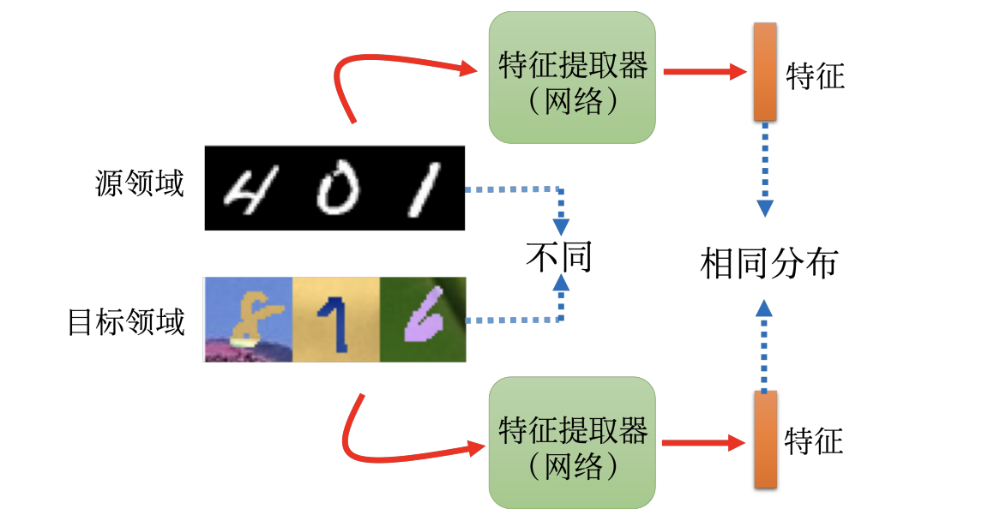
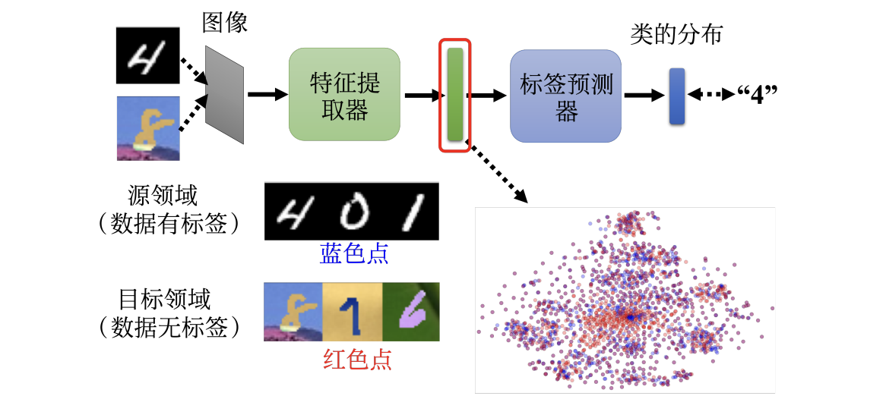
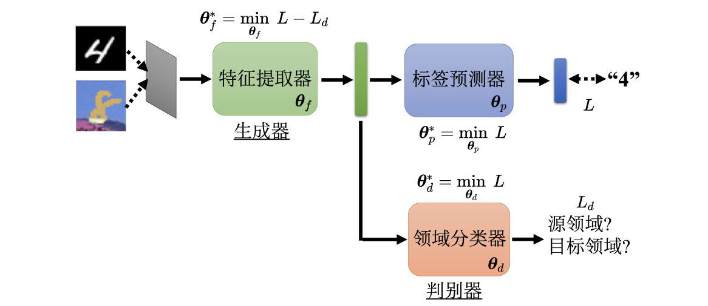
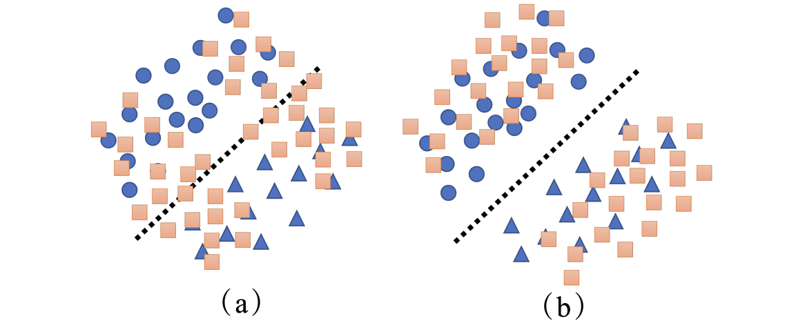

# Chapter13. Transfer Learning

实际应用中许多任务的标注成本非常高，目标任务往往拿不到足够多的训练数据，这时可以使用迁移学习来获得训练数据，本章主要介绍<u>领域自适应（domain adaptation）</u>和<u>领域泛化（domain generalization）</u>

---

## 13.1 Domain Shift

**领域偏移**：训练数据和测试数据的分布不一致，导致在训练集上学到的模型，测试时效果明显下降

1. **输入分布变化**：e.g.训练的数据和测试的数据分布不同
2. **输出分布变化**：e.g.训练时的输出均匀分布，和测试时的输出分布不均匀
3. **输入输出关系变化**：e.g.同一图片在训练和测试时对应的标签不同

- 训练数据所在领域：==源领域（source domain）
- 测试数据所在领域：==目标领域（target domain）==
如果源领域与目标领域不一致，就需要想办法把源领域学到的知识迁移到目标领域。

---

## 13.2 Domain Adaptation

**领域自适应**侧重于解决<u>特征空间和类别空间一致，但特征分布不一致</u>的情况

- 对目标领域有一定了解，但目标领域的标注不充分
- 如何让源领域训练出来的模型适应目标领域

不同情况对应的 domain adaption 方式不同：

1. **目标领域有很多有标注数据**
   直接在目标领域训练模型即可
2. **目标领域只有少量有标注数据**
   在源领域训练好的模型上做 fine-tuning（注意训练轮数，**避免过拟合**）
3. **目标领域有大量无标注数据**
   实际中非常常见的设定，下面重点讨论

!!! tip

    少量目标领域标签做微调时，要特别注意**过拟合**。
    缓解的思路包括：调小学习率、别在少量目标样本上迭代过多次等。

### Domain-invariant Feature

最基本的想法是训练一个 ==特征提取器（feature extractor）==：

- 源领域和目标领域的原始输入不同，但特征提取器可以提取共同的特征，得到基本相同的特征分布
- 利用特征提取器，可以在源领域训练一个模型直接用在目标领域上

一个图像分类器可拆成两部分：

1. **特征提取器（feature extractor）**
   输入图像，通过多层神经网络提取图像特征，最终输出**特征映射（可以看作一个向量）**
2. **标签预测器（label predictor）**
   分析输入的特征向量，判断其对应的类别

### Domain-adversarial Training

通过**领域对抗训练（domain adversarial training）**，可以得到领域无关的表示

训练 feature extractor 和 label predictor 的方式如图

- 图中蓝色的点表示<u>源领域图片的特征</u>，红色的点表示<u>目标领域图片的特征</u>
- 目标领域都是无标签的数据，通过领域对抗训练，使得两种特征的分布尽可能相近

为了实现这一目标，引入==领域分类器（domain classifier）==

- Domain classifier：判断特征**来自源领域还是目标领域**
- Feature extractor：想办法骗过领域分类器，并产生可以让标签预测器输出正确预测的向量

如图，整个结构里有三组参数：

- 标签预测器参数：$\theta_p$
- 领域分类器参数：$\theta_d$
- 特征提取器参数：$\theta_f$
由于源领域数据是有标签的，计算交叉熵作为损失 $L$，最终各个参数的优化目标如下：
- Label Predictor：让源领域有标签样本分类尽可能正确

$$
\theta_p^*=\min_{\theta_p} L
$$

- Domain Classifier：让领域判断尽可能正确

$$
\theta_d^*=\min_{\theta_d} L_d
$$

- Feature Extractor：既要帮助分类，又要骗过领域分类器

$$
\theta_f^*=\min_{\theta_f}(L-L_d)
$$

!!! info

    这个结构可以类比成 GAN：

    - 特征提取器类似生成器
    - 领域分类器类似判别器

### Limitations

==Pure alignment==：只做“源领域和目标领域特征分布对齐”还不够

- 目标领域无标签样本应该与源领域**整体分布接近**，但它们还应该**远离分类边界**
- 否则可能出现一种坏情况：特征已经对齐，但目标领域的样本集中在边界附近，**实际分类并不稳定**

让目标领域的数据**远离决策边界（decision boundary）** 最简单的做法：

- 把很多无标注的图片先丢到特征提取器，再丢到标签预测器
    - 输出的结果集中在某个类别上：离边界远
    - 如果输出的结果每一个类别非常地接近：离边界近
除了上述方法，还可以使用<u> DIRT-T、最大分类器差异（maximum classifier discrepancy）</u>等方法。
==Label Set Mismatch==：源领域和目标领域的类别集合不同
- 这时如果强行完全对齐，就可能把本来不同的类混在一起
==Testing Time Training==：目标领域样本非常少，无法和源领域对齐
- 可参考论文“Test-Time Training with Self-Supervision for Generalization under Distribution Shifts”

---

## 13.3 Domain Generalization

**领域泛化（domain generalization）** ：对目标领域几乎一无所知，但希望模型在未知领域上有效

- 与领域自适应相比，区别在于：
    - 领域自适应：至少看到了目标领域无标签数据
    - 领域泛化：训练时根本不知道未来测试领域长什么样
- Many To One	
    - 数据集来自多个领域（照片、素描、水彩 ...），测试时面对一个全新领域（例如卡通风格）
    - 因为训练阶段已经见过很多风格差异，模型更有机会学到“跨领域都稳定”的特征
- One To Many 
    - 训练时只有一个领域，但测试时可能遇到各种陌生领域
    - 通过数据增强，人为制造多种“伪领域”，让模型在训练阶段就见到更多变化
