# Chapter14. Reinforcement Learning

强化学习（Reinforcement Learning，RL）处理的是这样一类问题：

- 给定输入以后，**最佳输出未知**
- 机器通过与环境互动得到奖励（reward）
- 目标不是拟合某个标准答案，而是让长期获得的奖励总和最大

与监督学习相比：

- 监督学习：给定输入 $x$，训练数据直接告诉模型标准答案 $y$
- 强化学习：给定观测 $s$，模型需要自己尝试动作 $a$，再通过环境反馈判断动作好坏

---

## 14.1 Basic Concepts

强化学习的核心结构包含两个对象：

- **智能体（agent / actor）**：根据环境给出的观测决定动作
- **环境（environment）**：接收智能体的动作，更新状态，并给出新的观测与奖励

!!! tip "How it works"

    - 基本互动流程：
        1. Environment 给出 observation
        2. Actor 根据 observation 做出 action
        3. Environment 根据 action 发生改变
        4. Environment 给出 reward，作为 action 好坏的反馈
    - **最终目标**：<u>Find an actor maximizing expected reward</u>.

### Applications

强化学习常见应用包括：

1. **玩电子游戏**
    - Observation：游戏画面
    - Action：左移、右移、开火等操作
    - Reward：游戏分数
    - Return：一整局游戏得到的总分
2. **下围棋**
    - Observation：棋盘上黑子和白子的位置
    - Action：下一步落子位置
    - Reward：通常只有终局才有奖励，赢为 $+1$，输为 $-1$

!!! note

    围棋这类任务的奖励非常稀疏（sparse reward），中间动作大多没有即时反馈，因此需要更好的**评价方法、价值网络或启发式设计**。

---

## 14.2 RL Framework

强化学习也可以套进机器学习的三步框架：

1. Define a function with unknown parameters
2. Define loss
3. Optimization
区别在于：强化学习的资料不是一开始固定好的，<u>而是智能体在训练过程中不断与环境互动收集来的</u>。

### 14.2.1 Step1: Function with Unknown

在强化学习里面，Actor 通常是一个网络，称为 ==策略网络（policy network）==

- **Input**：环境给出的 observation，可以是向量、矩阵或游戏画面
    - 如果输入是图像，可以用 CNN；
    - 如果需要考虑过去一段时间的观测序列，可以用 RNN 或 Transformer
- **Output**：每个动作对应一个分数或概率
- **Parameters**：策略网络参数 $\theta$

策略网络不会总是选择分数最高的动作，而是把输出看成一个概率分布，再根据概率**随机采样**：

- 这样可以让同一状态下的动作带有随机性
- 随机性有助于探索（exploration）
- 如果永远选择当前最优动作，可能永远尝试不到更好的动作

### 14.2.2 Step2: Define Loss

强化学习中的两个概念：

- **奖励（reward）**：某一步动作立即得到的反馈，记作 $r_t$
- **回报（return）**：一整个 episode 中所有奖励的总和
从游戏开始到结束的完整互动过程称为**回合（episode）**，若一场游戏互动 $T$ 次，则回报可写为：

$$
R=\sum_{t=1}^{T} r_t
$$

- 训练目标是**让回报越大越好**。若想写成“最小化损失”的形式，可以把负回报当作损失

### 14.2.3 Step3: Optimization

在一场游戏中，把状态和动作组合起来得到的序列称为 ==轨迹（trajectory）==：

$$
\tau = \{s_1,a_1,s_2,a_2,\cdots,s_t,a_t\}
$$

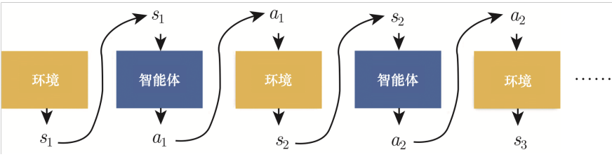

轨迹的总回报为：

$$
R(\tau)=\sum_{t=1}^{T}r_t
$$

- 强化学习的优化目标是找到一组参数 $\theta$，通过梯度上升（gradient ascent）最大化回报。

困难在于：

- Actor 的动作通常来自随机采样，同一个 $s_t$ 不一定产生同一个 $a_t$
- Environment 和 reward 可能是黑盒，不一定可微
- 同一个动作在不同智能体或不同阶段下，好坏可能不同

因此不能像普通监督学习一样，直接对环境和奖励做端到端反向传播。

---

## 14.3 Policy Gradient

把 Actor 在某个状态下采取某个动作看成一个分类问题：

- 输入：状态 $s$
- 标签：动作 $a$
- 损失：策略网络输出与目标动作之间的交叉熵 $e$

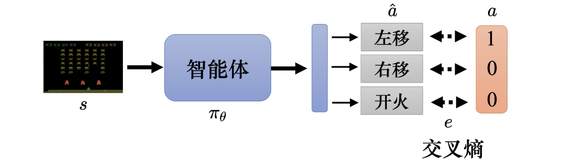

如果希望 Actor 在状态 $s$ 下采取动作 $a$，就最小化交叉熵：

$$
L=e
$$

如果希望 Actor 不采取动作 $a$，就最大化交叉熵，等价于最小化负交叉熵：

$$
L=-e
$$

更一般地，每一个 state-action pair 都可以配一个分数 $A_n$，表示这个动作在该状态下的好坏程度：

$$
L=\sum_n A_n e_n
$$

其中：

- $A_n>0$：希望模型更倾向于采取这个动作
- $A_n<0$：希望模型更不倾向于采取这个动作
- $|A_n|$ 越大，更新力度越强

接下来的关键问题就是：如何定义 $A$。

---

## 14.4 Evaluating Actions

### 14.4.1 Immediate Reward

最直观的做法是直接用即时奖励评价动作：

$$
A_t=r_t
$$

- 如果 $r_t>0$，说明动作好；如果 $r_t<0$，说明动作不好。

但这个版本太短视：

- 一个动作可能当下没有奖励，但会为未来奖励做准备
- 一个动作可能当下有奖励，但长期看会导致坏结果

==Delayed reward==：为了长期收益，智能体可能需要先执行一些暂时没有奖励的动作。

### 14.4.2 Cumulative Reward

为了考虑长期影响，可以把从时间点 $t$ 开始的未来奖励全部加起来：

$$
G_t=\sum_{i=t}^{N}r_i
$$

例如：

$$
\begin{align}
G_1&=r_1+r_2 + r_3+\cdots+r_N \\
G_2&=r_2+r_3+\cdots+r_N \\
G_3 &= r_3 + \dots + r_N
\end{align}
$$

此时令：

$$
A_t=G_t
$$

这样，某个动作虽然没有即时奖励，但只要它帮助后续拿到高分，也会被视为好动作。

### 14.4.3 Discounted Cumulative Reward

把很久以后的奖励全部归功于当前动作也不合理，因此加入 ==折扣因子（discount factor）== $\gamma$：

$$
G'_t=\sum_{i=t}^{N}\gamma^{i-t}r_i
$$

展开为：

$$
G'_t=r_t+\gamma r_{t+1}+\gamma^2r_{t+2}+\cdots
$$

其中 $0<\gamma<1$，常见取值如 $0.9$ 或 $0.99$

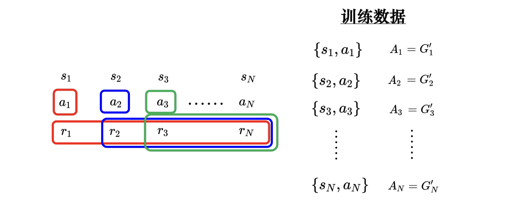

直观理解：

- 越接近当前动作的奖励，权重越大
- 越远的未来奖励，权重越小
- $\gamma$ 越大，模型越重视长期收益

### 14.4.4 Discounted Reward Minus Baseline

!!! bug

    只用 $G'_t$ 还有一个问题：如果所有动作的回报都是正的，模型会鼓励所有动作，即使某些动作相对来说很差。

因此可以减去一个 ==基线（baseline）== $b$：$A_t=G'_t-b$

- 高于平均水平的动作得到正评价；低于平均水平的动作得到负评价，**更新会更稳定**

策略梯度的大致流程：

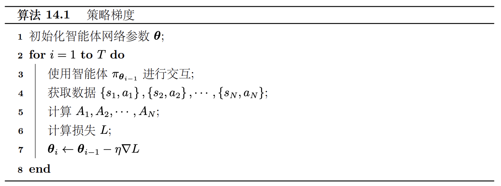

!!! tip

    强化学习耗时的一个关键原因是：每更新一次策略，旧策略收集的数据就可能不再适合新策略，因此需要重新和环境互动收集数据。

    
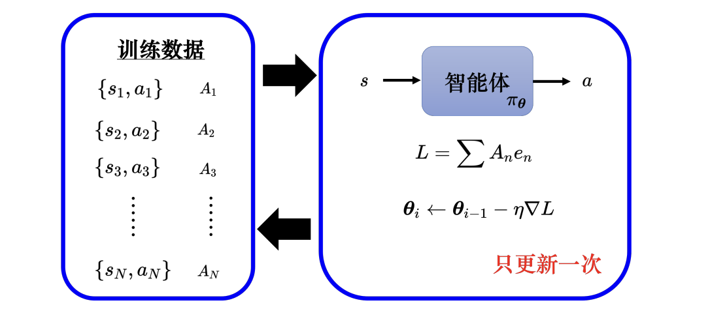

---

## 14.5 On-policy, Off-policy and Exploration

!!! bug "强化学习非常耗时"

    - 如果收集数据的智能体跟被训练的智能体是同一个智能体，当智能体更新以后，就要重新去收集数据，，异策略学习（off-policy learning）可以解决该问题。
        - 由于 $\pi_{\theta_i}$ 跟 $\pi_{\theta_{i-1}}$ 收集的数据不同，不能使用 $\pi_{\theta_{i-1}}$ 的收集数据来评估 $\pi_{\theta_i}$ 接下来会得到的奖励

    
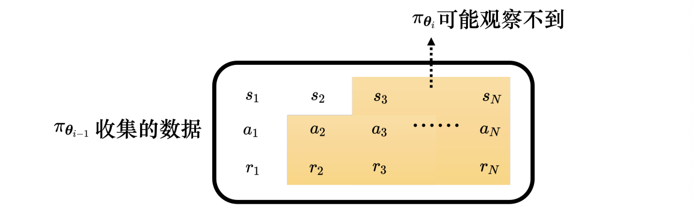

### On-policy Learning

==同策略学习==（on-policy learning）：与环境互动、收集数据的智能体，就是正在被训练的智能体。
策略梯度就是 on-policy 方法：

- 用 $\pi_{\theta_{i-1}}$ 收集数据 $\rightarrow$ 用这些数据更新 $\pi_{\theta_{i-1}}$ $\rightarrow$ 更新后得到新策略 $\pi_{\theta_i}$ $\rightarrow$ 再重新收集数据
- 缺点是样本效率低，训练很花时间。

### Off-policy Learning

==异策略学习==（off-policy learning）：与环境互动的智能体和正在训练的智能体可以不同

- 旧数据可以反复使用
- 不必每更新一次参数就重新采样
- 样本效率通常更高

### Exploration

探索（exploration）非常重要，如果某个动作从未被尝试过，就无法知道它到底好不好。

- 常见增强探索的方法：
    - 使用随机采样，而不是总选概率最大的动作
    - 增大策略输出分布的熵（entropy）
    - 在参数或动作上加入噪声

!!! tip

    强化学习训练好不好，和采样质量关系很大。探索不足时，模型可能很早卡在一个局部策略里。

---

## 14.6 Actor-Critic

Actor-Critic 把强化学习拆成两个网络：

- **Actor**：策略网络，决定要采取什么动作
- **Critic**：价值网络，评价当前状态或状态-动作对的好坏
Critic 也称为==价值函数（value function）==，可以用 $V^{\pi_\theta}(s)$ 来表示
- 它表示在策略 $\pi_\theta$ 下，智能体看到状态 $s$ 后，未来能得到的折扣累积奖励的期望 $G''$
- 价值函数与观察的智能体（actor）以及环境状态有关

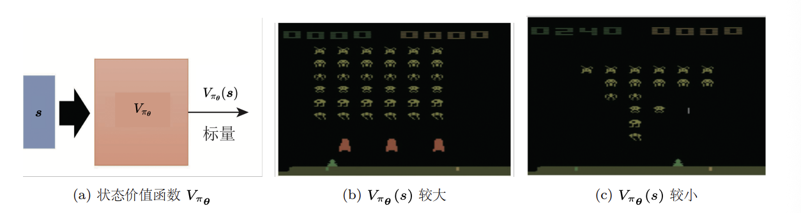

> 下面介绍 Critic 的两种常用的训练方法

### Monte Carlo

蒙特卡洛（Monte Carlo，MC） 方法：玩完整个 episode，再用实际得到的回报训练 Critic

如果在状态 $s_a$ 后实际得到折扣累积奖励 $G'_a$，就希望：

$$
V^{\pi_\theta}(s_a)\approx G'_a
$$

- 估计直接来自完整采样结果
- 需要等一整局结束才能更新
- 不适合特别长或不会结束的任务

### Temporal-Difference

时序差分（Temporal-Difference，TD）： 不需要等完整 episode 结束，只要有一笔转移资料 $\{s_t,a_t,r_t,s_{t+1}\}$ 就能训练 $V^{\pi_\theta}(s)$

- 根据价值函数之间的关系：

$$
V^{\pi_\theta}(s_t)=r_t+\gamma V^{\pi_\theta}(s_{t+1})
$$

- 因此训练时希望：

$$
V^{\pi_\theta}(s_t)-\gamma V^{\pi_\theta}(s_{t+1})\approx r_t
$$

MC 和 TD 都合理，但背后的假设不同：

- MC 更相信完整采样到的实际结果
- TD 会利用相邻状态价值之间的递推关系

### How to Train Actor Using Critic 

智能体跟环境互动得到一堆状态-动作对，比如 $s_1$ 执行 $a_1$ 得到一个分数 $A_1$，可令 $A_1 = G'_1 − b$

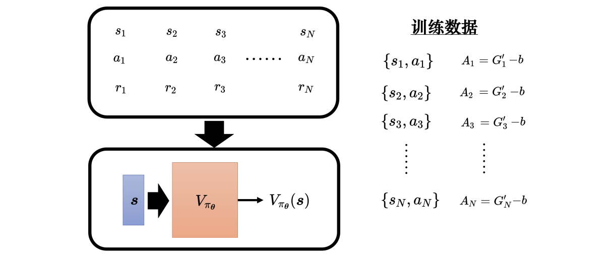

学习出 Critic $V^{\pi_{\theta}}$ 后，给定一个状态 $s$，其可以产生分数 $V^{\pi_{\theta}}(s)$，基线 $b$ 可设成 $V^{\pi_{\theta}}(s)$，因此 $A$ 可设成 $G' − V^{\pi_{\theta}}$

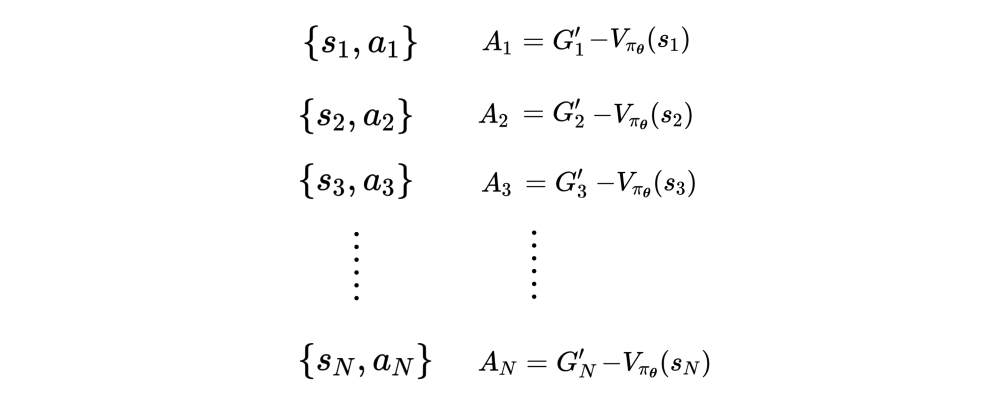

$A_t$ 代表 $\{s_t , a_t\}$ 的好坏，智能体看到某一个画面 $s_t$ 以后，接下来再继续玩游戏，游戏有随机性，每次得到的奖励都不太一样，$V^{\pi_\theta}(s_t)$ 是一个期望值

- Actor 的输出是动作的空间上的概率分布，给每一个动作一个分数，按照这个分数去做采样。
- 有些动作被采样到的概率高，有些动作被采样到的概率低，但每一次采样出来的动作，并不保证一定要是一样的，可以计算出不同的累积奖励。

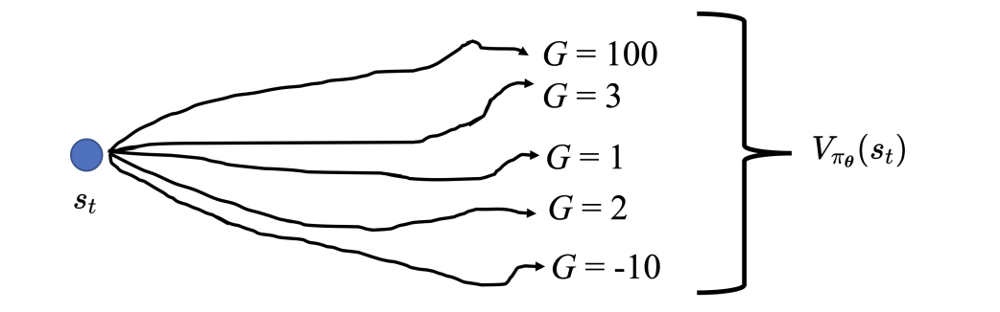

!!! bug

    $G'_t$ 是一个采样的结果，它是执行 $a_t$ 以后，一直玩到游戏结束的结果，而 $V^{\pi_\theta}$ 是很多个可能性平均以后的结果。用一个采样减掉平均，其实不太准，这个采样可能特别好或特别坏。所以其实可以用平均去减掉平均，即 Advantage Actor-Critic

---

## 14.7 Advantage Actor-Critic

!!! abstract "Background"

    - 训练出 Critic 后，可以把 baseline 设成价值函数：

    $$
    b=V^{\pi_\theta}(s_t)
    $$

    - 于是动作评价可以写成：

    $$
    A_t=G'_t-V^{\pi_\theta}(s_t)
    $$

    - 含义：
        - $G'_t$：在 $s_t$ 执行动作 $a_t$ 后，实际采样到的未来回报
        - $V^{\pi_\theta}(s_t)$：在 $s_t$ 按照当前策略随机行动时，未来回报的平均水平

    如果 $A_t>0$，说明 $a_t$ 比当前策略平均会采取的动作更好；如果 $A_t<0$，说明 $a_t$ 比平均动作更差。

但 $G'_t$ 是**单次采样结果，方差较大**。于是可以用 TD 的想法，把 $G'_t$ 换成：$r_t+\gamma V^{\pi_\theta}(s_{t+1})$

- 得到 ==优势 Actor-Critic（Advantage Actor-Critic，A2C）==：

$$
A_t=r_t+\gamma V^{\pi_\theta}(s_{t+1})-V^{\pi_\theta}(s_t)
$$

这表示：

- 在 $s_t$ 执行 $a_t$ 后，先得到即时奖励 $r_t$
- 接着到达 $s_{t+1}$，未来期望价值为 $V^{\pi_\theta}(s_{t+1})$
- 再减去原本状态 $s_t$ 的平均价值，得到该动作相对于平均动作的优势

Actor-Critic 的训练技巧

- Actor 和 Critic 都是一个网络，Actor 的输入是游戏画面，其输出是每一个动作的分数。Critic 的输入是游戏画面，输出是一个数值，代表接下来会得到的累积奖励。
- 图中两个网络的输入相同，所以这两个网络应该可以共用参数，假设输入非常复杂（比如游戏画面），前面几层都需要使用 CNN，**所以 Actor 和 Critic 可以共用前面几个层**

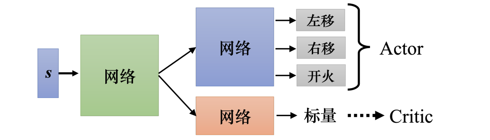

---

## 14.8 Other RL Methods

除了策略梯度和 Actor-Critic，还有许多强化学习方法：

- **DQN（Deep Q-Network）**：直接用 Critic 估计动作价值，并选择价值高的动作
- **Rainbow**：整合多种 DQN 改进方法
- **Imitation Learning**：通过模仿专家行为辅助学习
- **Visual Reinforcement Learning**：直接根据图像观测学习控制策略

强化学习的核心难点可以总结为：

- 奖励可能稀疏且延迟
- 采样成本高
- 训练数据分布会随策略改变
- 探索和利用（exploration vs. exploitation）需要平衡
- 价值估计常常存在高方差或偏差
