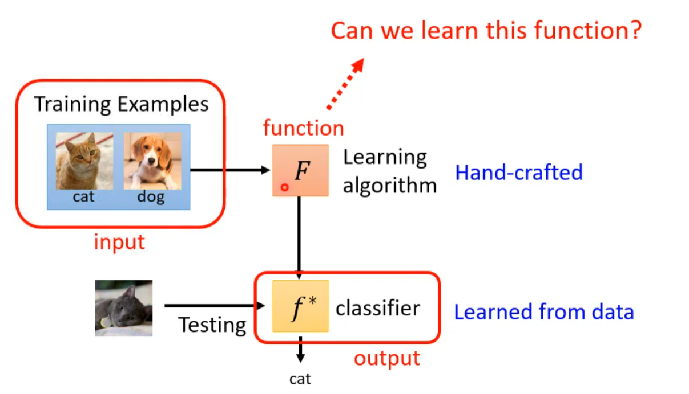
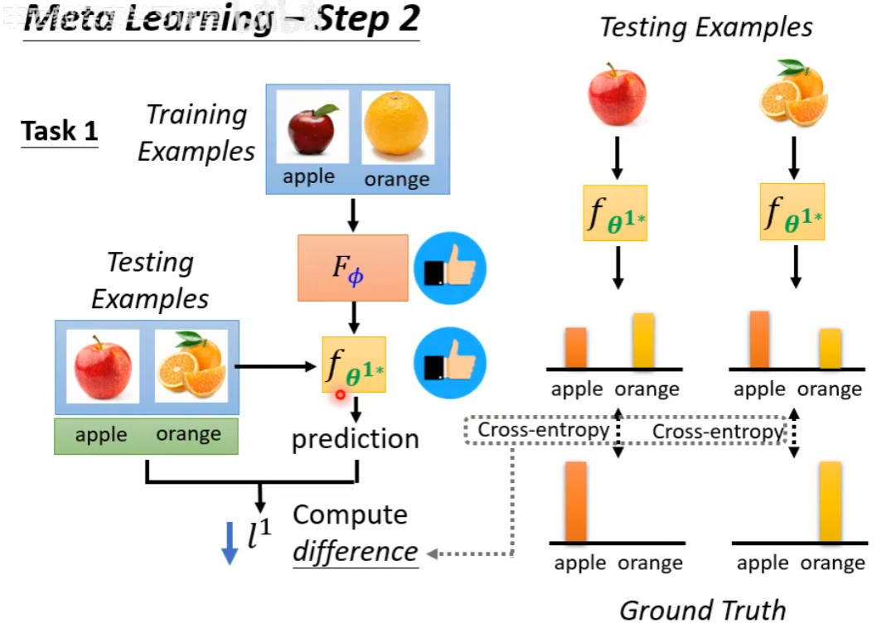
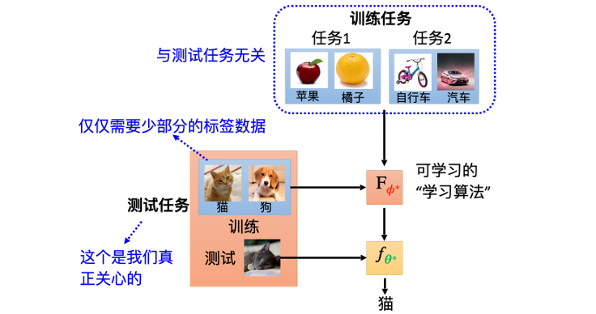
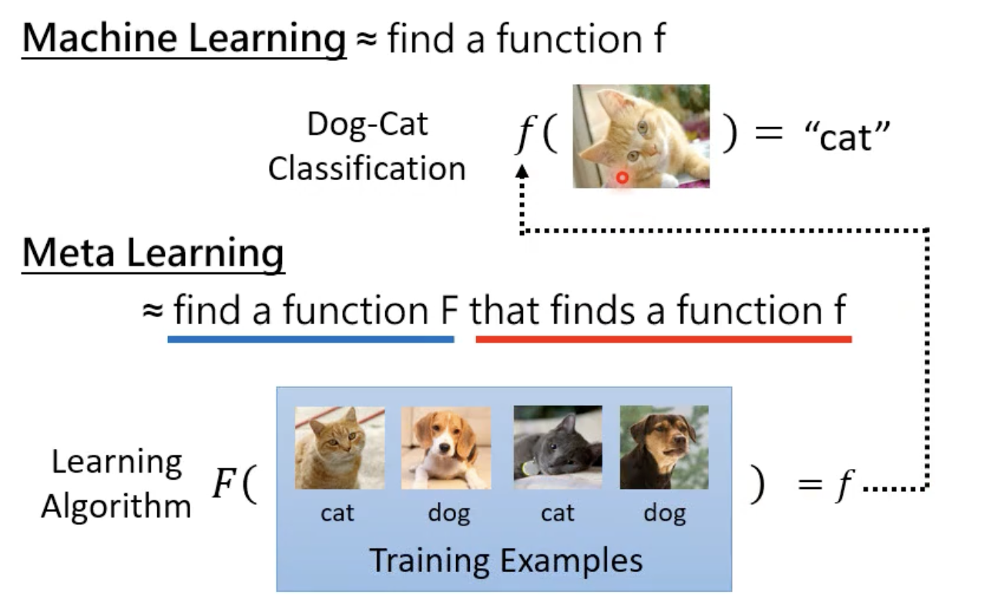
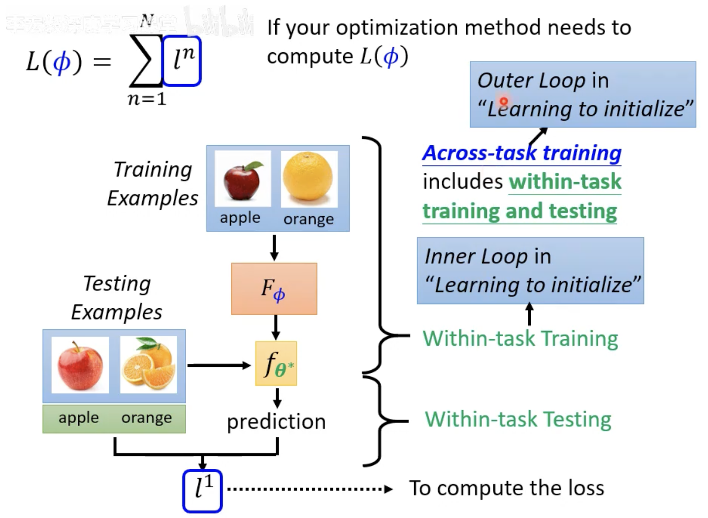
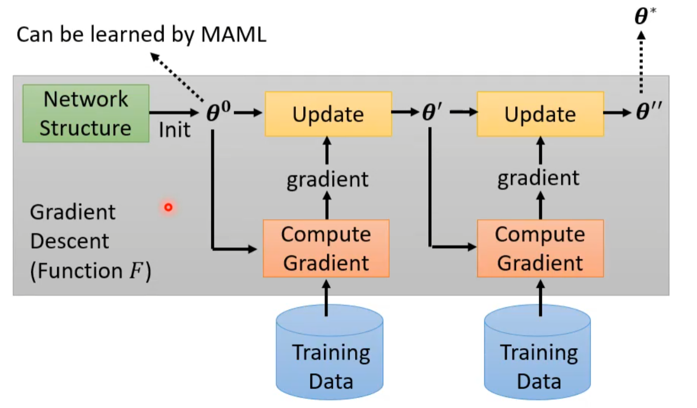
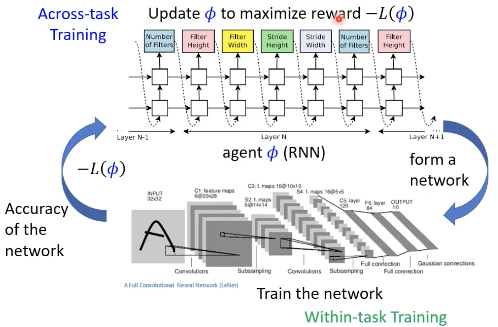
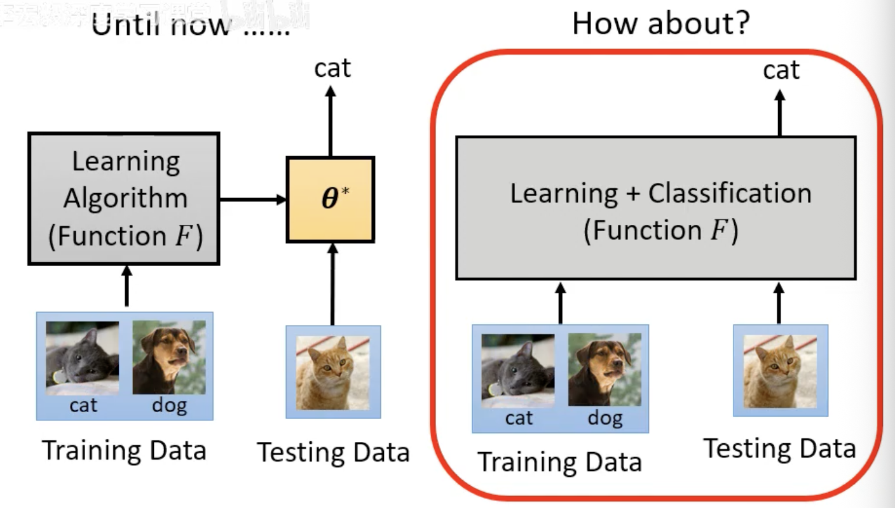

# Chapter15. Meta Learning

!!! info

    - 元学习（Meta Learning）直译就是 ==learning to learn==，也就是让机器学习“如何学习”。

    - 在普通深度学习中，很多东西依赖人工经验：
        - 网络架构怎么设计
        - 参数如何初始化
        - 学习率、batch size 等超参数怎么选
        - optimizer 或数据增强策略如何设置

    - 元学习希望把这些原本由人决定的部分，也变成可以从数据中学出来的东西。

---

## 15.1 Three Steps of Meta Learning

元学习也可以类比机器学习的三步框架：

1. Define a function with unknown parameters
2. Define loss
3. Optimization
区别在于，元学习中的“函数”是**学习算法本身**。

### Step 1: Learning Algorithm with Unknown Parameters

!!! question "What is learnable in a learning algorithm?"

    - 普通机器学习要找的是一个函数 $f$：

    $$
    f: x \rightarrow y
    $$

    - 元学习要找的是一个学习算法 $F$：

    $$
    F: D_{\text{train}} \rightarrow f
    $$

    - 也就是说：
        - $F$ 的输入不是单个样本，而是一个**训练数据集**
        - $F$ 的输出不是预测结果，而是一个**训练好的模型** $f$
        - $f$ 再拿去处理测试样本，并输出预测结果

元学习的目标就是找到一个好的 $F$，让它面对新任务时，也能快速产生效果好的模型。

设 Learning Algorithm 为 $F_\phi$，其中 $\phi$ 表示 learnable components
不同元学习方法会选择学习不同的对象：

- 学习模型初始化参数
- 学习 optimizer
- 学习 learning rate
- ......
普通机器学习中，$\theta$ 是模型参数；元学习中，$\phi$ 是学习算法的参数。

### Step2: Define Meta Loss

普通机器学习用**训练样本**定义损失；元学习用一批**训练任务**定义损失，每个任务拆成两部分：

- **Support set**：任务内的训练数据
- **Query set**：任务内的测试数据

对于第 $n$ 个任务：

1. 将 support set 输入 $F_\phi$
2. 得到该任务上的模型 $f_{\theta_n^*}$
3. 在 query set 上评估 $f_{\theta_n^*}$
4. 得到该任务的损失 $l_n$

把所有训练任务的损失加起来：

$$
L(\phi)=\sum_{n=1}^{N}l_n \text{, where } N \text{ is the number of the training tasks}
$$

- 这个 $L(\phi)$ 衡量的是：当前学习算法 $F_\phi$ 在一批任务上的**学习能力**。

!!! tip

    元学习训练时会用训练任务中的 query set 计算损失。这里的 query set 不是最终测试任务的数据，而是训练阶段已知任务内部的测试部分。

### Step3: Optimization

最终目标是找到：

$$
\phi^*=\arg\min_{\phi}L(\phi)
$$

- 优化方法可以是：梯度下降、强化学习、进化算法、其他黑盒优化方法

得到 $\phi^*$ 后，就得到一个学出来的学习算法：$F_{\phi^*}$

- 测试时，给它一个新任务的 support set，它就能输出该任务上的模型，再用这个模型处理新任务的 query set

---

## 15.2 Meta Learning vs. Machine Learning

!!! question "Meta Learning and Few-shot Learning"

    -  ==少样本学习（few-shot learning）== 指的是：模型只看少量样本，就要学会完成新任务。

    - 两者关系：Few-shot Learning 指的是期待机器只看几个样例，比如每个类别都只给他三张图片，它就可以学会做分类。而我们想要达到 Few-shot Learning 中的算法通常就是用 Meta Learning 得到的 Learning Algorithm

### Target

- 机器学习要找的是模型：$D_{\text{train}}\rightarrow f_\theta$
- 元学习找的是学习算法：$\{T_1,T_2,\cdots,T_N\}\rightarrow F_\phi$，其中每个任务包含 support set 和 query set

### Training Data

机器学习是在单一任务内训练（==Within-task Training==），训练单位是**样本**：

$$
L(\theta)=\sum_{k=1}^{K}e_k
$$

元学习是跨多个任务训练（==Across-task Training==），训练单位是**任务**：

$$
L(\phi)=\sum_{n=1}^{N}l_n
$$

!!! info "Support & Query"

    在元学习文献中常用：

    - **Support**：一个任务内部用于学习的资料
    - **Query**：一个任务内部用于评估的资料

    可以类比成：

    - support set 类似普通机器学习里的训练集
    - query set 类似普通机器学习里的测试集

    但注意：训练阶段的 query set 是可以用来更新元学习算法的，因为元学习的训练对象是整个学习算法，而不是某个具体任务的最终模型。

### Inner Loop and Outer Loop

在很多元学习方法中会看到：

- ==Inner loop==：在单个任务内部，用 support set 训练模型
- ==Outer loop==：跨多个任务，用 query loss 更新学习算法参数 $\phi$

!!! note

    元学习也会过拟合。普通机器学习过拟合到训练样本，元学习可能过拟合到训练任务。解决思路也类似：收集更多训练任务、做任务级数据增强、使用验证任务选择超参数。

---

## 15.3 Instance-based Meta-learning Algorithms

### Learning to Initialize

**Learning to initialize**，这里介绍两种算法：

- ==MAML==（Model-Agnostic Meta-Learning，模型无关元学习）
- ==Reptile==

**训练目标**：

- 普通训练中，模型参数 $\theta_0$ 往往随机初始化；但初始化会显著影响最终训练效果。
- MAML 希望学出一个初始化 $\phi$，**最大化模型对超参数的敏感性**
    - 遇到新任务的数据（样本发生微小变化），模型的损失函数能快速下降（即拥有最大的梯度）

!!! info "How MAML Trains"

    MAML 在训练时采用了**双层循环**机制，也就是“**两次求梯度**”：

    每个任务 $T_n$ 从同一个初始化参数 $\phi$ 出发：

    1. **第一次求梯度（内循环 / 任务适应）**
        - 用 support set 做一次或几次梯度下降
        - 得到该任务适配后的参数 $\theta_n'$
    2. **第二次求梯度（外循环 / 元更新）**
        - 用 query set 评估 $\theta_n'$
        - 用所有任务的 query loss 更新 $\phi$

    若只写一步 inner update：

    $$
    \theta_n'=\phi-\alpha\nabla_\phi L_{T_n}^{\text{support}}(\phi)
    $$

    元学习损失为：

    $$
    L(\phi)=\sum_n L_{T_n}^{\text{query}}(\theta_n')
    $$

    更新目标：

    $$
    \phi^*=\arg\min_\phi \sum_n L_{T_n}^{\text{query}}(\theta_n')
    $$

| 学习方法           | 核心做法                      | 与 MAML 的关系/区别                                                |
| :------------- | :------------------------ | :----------------------------------------------------------- |
| 自监督学习 (如 BERT) | 用海量无标签数据做代理任务（如填空题）进行预训练。 | 目的相同（找好初始参数），手段不同。自监督靠大量数据，MAML 靠大量不同的任务。                    |
| 多任务学习          | 把所有任务的数据混在一起训练，找一个通用的初始化。 | MAML 的基线方法。区别在于 MAML 会严格区分任务的边界，模拟“快速适应新任务”的过程，而不是简单地把数据大杂烩。 |
| 迁移学习/域适应       | 将在源任务学到的知识迁移到新任务或新领域。     | MAML 本质上可以看作是一种基于分类问题的迁移学习，都是希望学过的东西能举一反三。                   |

MAML 有两个直观假设：

- 初始化参数离每个任务最终的结果都不远
- 从该初始化参数出发，通过少量梯度更新就能快速适应新任务

!!! info

    MAML 被称为 model-agnostic，是因为它不绑定特定模型结构；只要模型可以用梯度下降训练，就可以尝试套用 MAML。

### Learning to Optimize

元学习不只可以学习初始化参数，还可以学习很多原本由人工设计的部分。

- 普通 optimizer 如 SGD、Adam 是人为设计的；元学习可以尝试学习一个 optimizer，让它根据训练任务自动决定如何更新参数。

### Learn Network Architecture

把网络架构看成 $\phi$，元学习就变成==神经网络架构搜索（Neural Architecture Search，NAS）==
**NAS 的目标**：

$$
\phi^*=\arg\min_\phi L(\phi)
$$

- 如果架构选择不可微，可以用强化学习或进化算法搜索；
- 如果想直接用梯度下降，则需要把架构搜索设计成可微问题。

### Learn Data Processing

元学习也可以学习数据处理策略，例如：

- 自动数据增强
- 自动决定样本权重
- 自动设计采样策略

样本权重本身并没有唯一答案：

- 难样本可能更值得关注
- 但太靠近边界的样本也可能是噪声或错标样本

### Beyond Gradient Descent

更进一步，可以尝试让一个网络直接读入 support set 和 query sample，然后直接输出 query sample 的答案。这类方法弱化了“先训练、再测试”的分界，经常被称为==learning to compare== 或 ==metric-based approach==。

核心想法是：**与其显式训练一个分类器，不如直接学习样本之间如何比较、如何匹配。**

---

## 15.4 Applications

### Few-shot Image Classification

元学习最常见的评测任务是少样本图像分类。

- ==N-way K-shot classification==：每个任务中有 $N$ 个类别，每个类别只有 $K$ 个样本
- 训练时需要准备很多个 $N$ -way $K$ -shot 任务，让模型学会如何从少量样本中快速分类d

!!! tip "Omniglot"

    Omniglot 是少样本学习里常用的数据集，它包含 1623 个字符类别，每个字符有 20 个样本

    构造任务的方式：

    1. 从字符集合中随机选 $N$ 个类别
    2. 每个类别采样 $K$ 个样本作为 support set
    3. 再采样一些样本作为 query set
    4. 得到一个 $N$-way $K$-shot 任务

    通常会把字符类别分成训练类别和测试类别：

    - 训练类别用来制造训练任务
    - 测试类别用来制造测试任务

    这样可以检验模型是否真的学会了“快速学习新类别”，而不是只记住训练类别。
