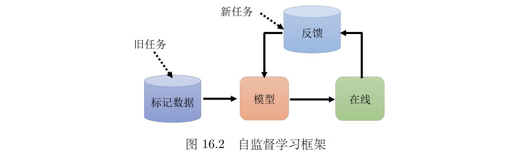
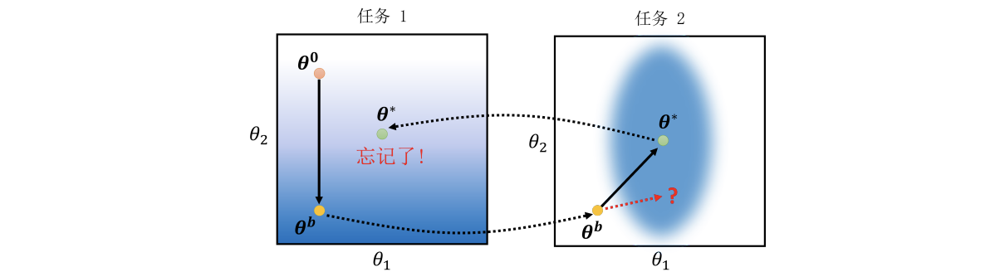
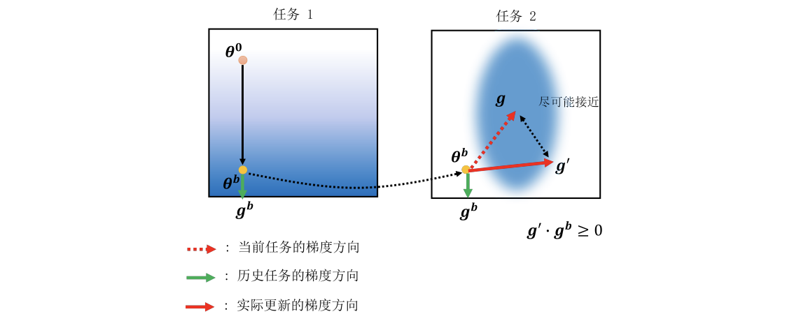

# Chapter16. Lifelong Learning

---

## 16.1 Catastrophic Forgetting

!!! info "Basic Concepts"

    - 终身学习（Lifelong Learning，LLL）：让模型像人一样持续学习新任务，同时不要把旧任务忘掉。
        - 也常被称为**持续学习（continuous learning）**、**无止尽学习（never-ending learning）**、**增量学习（incremental learning）**
    - 可用于搭建自监督学习架构

    

终身学习最核心的问题是 ==灾难性遗忘（catastrophic forgetting）==：

- 模型先学会任务 1
- 再继续训练任务 2
- 任务 2 表现变好，但任务 1 表现大幅下降
这说明模型并不是“多学了一个技能”，而是**新任务的训练把旧任务相关的参数覆盖掉了**。

### Examples

注意，这里所谓“不同任务”不一定是语音识别、图像识别、翻译这种差异巨大的任务。在目前终身学习的论文中，不同任务可能只是：

- 同一个分类任务的不同资料分布
- 同一批数字经过不同排列
- 同一任务在不同 domain 上的数据
也就是说，即使任务之间很相似，模型依次学习时也可能严重遗忘。

!!! example

    假设模型先学习噪声较大的手写数字识别，再学习噪声较小的手写数字识别。

    模型在任务 1 上原本准确率为 90%，学习任务 2 后，任务 2 准确率从 96% 提升到 97%，但任务 1 准确率可能从 90% 掉到 80%。

    这就是灾难性遗忘：新任务学得更好了，但旧任务被明显破坏。

!!! example "bAbi Example"

    自然语言 QA **bAbi benchmark** 中有 20 个子任务

    若模型依次学习这 20 个任务：

    - 没学任务 5 时，任务 5 准确率接近 0
    - 学到任务 5 后，准确率可以达到 100%
    - 继续学习后续任务后，任务 5 准确率很快暴跌

    但如果把 20 个任务一起训练，模型其实有能力同时掌握多个任务。因此问题不是模型容量完全不够，而是**顺序训练的过程破坏了旧任务能力**。

#### Multitask Learning

==多任务学习（multitask learning）== 是把所有任务的数据放在一起训练。

- 这种方法通常可以作为终身学习的上界：
    - 如果模型连多任务学习都做不好，说明模型容量或任务本身可能有问题
    - 如果多任务学习能做好，但终身学习做不好，说明问题主要来自顺序训练和遗忘
- 但多任务学习不适合直接替代终身学习：
    1. **训练成本太高**：如果已经学了 999 个任务，现在要学第 1000 个任务，就需要把前 999 个任务的数据一起拿出来重新训练。任务越多，训练成本越大。
    2. **旧数据可能不可用**：真实应用中，历史数据可能因为隐私、存储或业务原因无法长期保存。
    3. **模型上线后需要持续更新**：模型上线后会收到用户反馈和新数据，我们希望用新数据高效更新模型，而不是每次都从头训练
- 也可以为每个任务单独训练一个模型，但这也有问题：
    - 模型数量会越来越多，存储和部署成本高
    - 任务之间可能有共通知识，完全拆开会浪费可迁移的信息

---

## 16.2 Evaluation of Forgetting

终身学习通常会准备一串任务：$T_1,T_2,\cdots,T_T$，模型按顺序学习这些任务。每学完一个任务，就在所有任务上测试一次，得到一个准确率矩阵 $R_{i,j}$（模型学完任务 $i$ 后，在任务 $j$ 上的准确率）

- 平均准确率公式衡量的是<u>学完所有任务后，模型整体能做多少任务</u>，表示如下：

$$
\text{ACC}=\frac{1}{T}\sum_{i=1}^{T}R_{T,i}
$$

- 另一个常用指标是反向迁移（backward transfer，BWT），衡量<u>学习后续任务对旧任务的影响</u>：

$$
\text{BWT}=\frac{1}{T-1}\sum_{i=1}^{T-1}(R_{T,i}-R_{i,i})
$$

---

## 16.3 Solutions

!!! question "Why Forgetting Happens"

    可以从**参数空间**理解灾难性遗忘，为了简化考虑，假设模型只有两个参数：$\theta=(\theta_1,\theta_2)$

    

    任务 1 和任务 2 各自有不同的损失地形：

    - 如图所示，如果颜色越偏蓝色，代表损失越小，反之越大
    - 在某一任务上表现好的参数区域，记作该任务的低损失区域

    训练过程可能是：

    1. 从随机参数 $\theta_0$ 开始训练任务 1
    2. 得到任务 1 上表现好的参数 $\theta^b$
    3. 继续从 $\theta^b$ 出发训练任务 2
    4. 梯度下降把参数推到任务 2 的低损失区域 $\theta^*$

    问题在于：$\theta^*$ 在任务 2 上很好，但 $\theta^*$ 不一定还在任务 1 的低损失区域里

### Selective Synaptic Plasticity

==选择性的突触可塑性==，也被称作**基于正则的方法**（regularization-based methods），其核心思想是：

- 有些参数对旧任务很重要，不能乱动；有些参数对旧任务不重要，可以用来适应新任务

假设学完旧任务后的参数是 $\theta^b$，新任务的损失为 $L(\theta)$，在损失函数中加入一个限制项：

$$
L'(\theta)=L(\theta)+\lambda\sum_i b_i(\theta_i-\theta^b_i)^2
$$

其中

- $\theta_i$ ：学习新任务时，第 $i$ 个参数当前的值
- $b_i$：第 $i$ 个参数对旧任务的重要性
- $\lambda$：控制“保留旧知识”和“学习新任务”之间的权衡

如何决定 $b_i$？直观方法是看参数附近的损失变化：

- 如果轻微改变 $\hat{\theta}_i$，旧任务损失几乎不变，说明这个参数不太重要，$b_i$ 可以小
- 如果轻微改变 $\hat{\theta}_i$，旧任务损失快速变大，说明这个参数很重要，$b_i$ 应该大
实际研究中有多种方式，例如用 Fisher information、梯度大小或参数对损失的敏感性来衡量。

### Gradient Episodic Memory

==梯度回合记忆==（GEM，基于梯度的方法）：不直接限制参数，而是限制梯度更新方向

训练时会根据新任务的损失得到梯度，但这个梯度可能会让旧任务损失上升，导致遗忘。GEM 的想法是：<u>保存少量旧任务样本或旧任务信息，计算旧任务对应的梯度方向并调整当前梯度</u>。

- 新的梯度方向需要满足大于等于 0，否则很难朝最优解方向优化。
