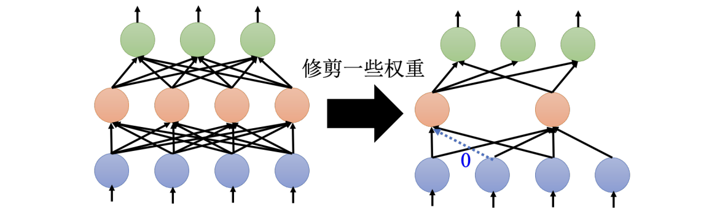
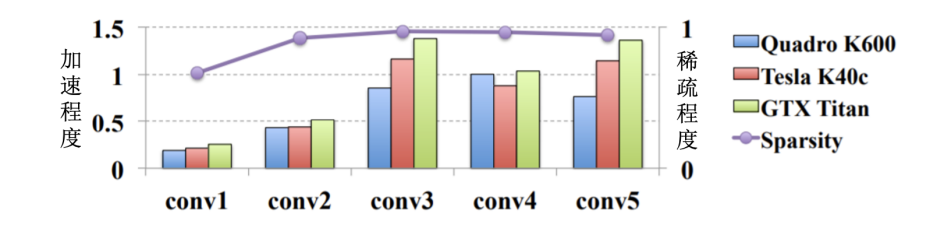
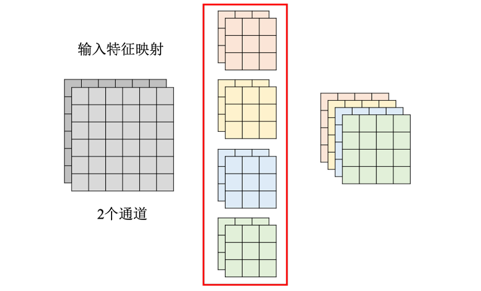
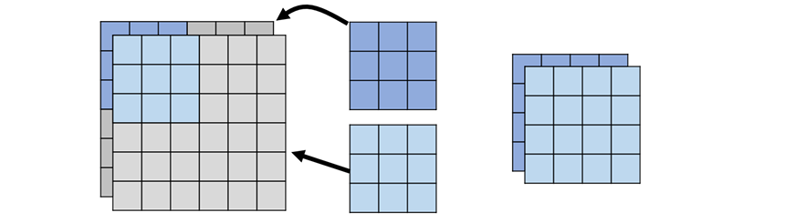
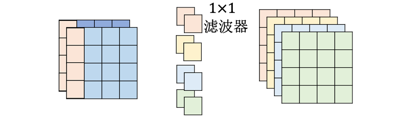
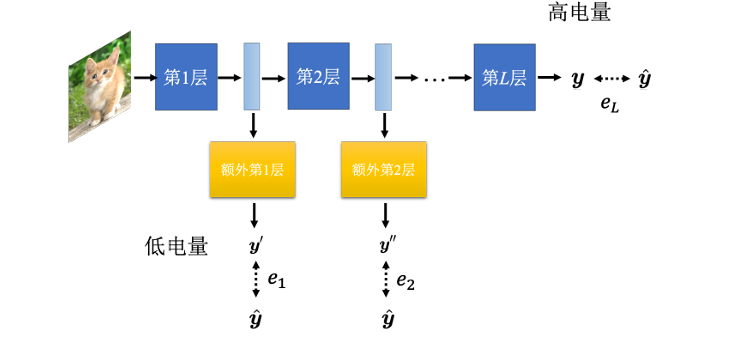
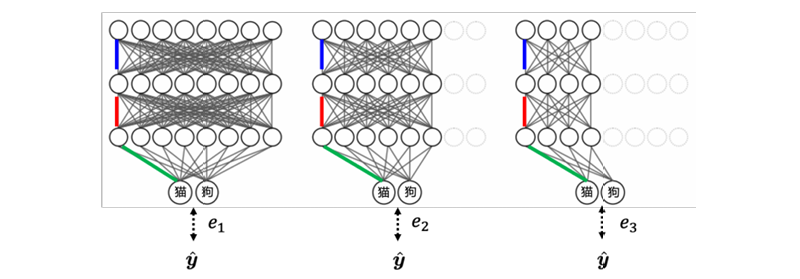

# Chapter17. Network Compression

网络压缩（Network Compression）关注的问题是：

- 能不能把很大的模型变小
- 能不能减少参数量、计算量和存储空间
- 能不能在模型变小后，仍然保持接近原模型的性能

这类技术在大模型和边缘设备中尤其重要。例如 BERT、GPT 这类模型参数量巨大，如果直接部署到智能手表、手机、车载设备等 edge device 上，通常会遇到：

- 内存不够
- 计算力不足
- 推理延迟过高
- 电量消耗过大

!!! question "Why Edge Inference?"

    为什么不把数据传到云端，让云端模型推理后再传回设备？

    主要有两个原因：

    - **延迟（latency）**：自驾车、实时语音交互等任务不能等待云端往返
    - **隐私（privacy）**：手表、手机、医疗设备上的数据可能不适合传到云端

本章主要介绍五种偏软件层面的网络压缩方法：

1. Network Pruning
2. Knowledge Distillation
3. Parameter Quantization
4. Network Architecture Design
5. Dynamic Computation

---

## 17.1 Network Pruning

==网络剪枝（network pruning）== 的想法是：大网络中很多参数或神经元可能没有真正发挥作用，可以把这些“不重要”的部分剪掉。
**剪枝的基本流程**：

1. 先训练一个大的网络，衡量每个参数、神经元或通道的重要性
2. 删除不重要的部分，对剩下的小网络做 fine-tuning
3. 重复剪枝和微调，直到网络足够小

### Evaluation

剪枝的关键问题是：怎么判断某个参数或神经元重不重要？
常见直觉包括：

- **参数绝对值**：$|w|$ 越小，可能越不重要
- **神经元激活频率**：输出长期接近 0 的神经元可能不重要
- **对 loss 的影响**：移除后 loss 上升越小，说明越不重要
- **梯度或敏感度**：参数变化对输出或损失影响越小，越适合剪掉
最简单的方法是按参数绝对值排序，然后剪掉绝对值最小的一部分参数。

### Pruning

通常一般不会一次性剪掉大量参数，而是采用迭代式剪枝：

1. 剪掉一小部分参数，例如 10%
2. 微调剩余网络，让准确率恢复
3. 重复第一步和第二步
这样做的原因是：一次剪太多会让模型性能大幅崩掉，微调可能无法恢复，逐步剪枝更容易找到一个性能和大小之间的平衡

#### Weight & Neuron Pruning 

剪枝可以按不同粒度进行，最常见的是：

- **权重剪枝（weight pruning）**
- **神经元 / 通道剪枝（neuron or channel pruning）**
权重剪枝以单个参数为单位，如果某个权重不重要，就把它剪掉，常见做法是把该权重设为 0，这样可以剪掉非常多参数，并且疏程度（sparsity）可以很高。

!!! bug

    - 网络形状会变得不规则
    - 不规则稀疏结构在 PyTorch / GPU 上不一定好加速
    - 即使 95% 参数变成 0，也可能没有明显推理加速

     

### Lottery Ticket Hypothesis

!!! question "一个自然的问题是：既然最后要小网络，为什么不一开始就训练小网络？"

    常见观察是：

    - 直接训练小网络，效果往往不如“大网络训练后剪枝得到的小网络”
    - 大网络更容易被优化
    - 大网络中可能包含一些“容易训练的子网络”

==彩票假说（Lottery Ticket Hypothesis）== 用来解释为什么大网络更容易训练。

- 一个大网络可以看作很多子网络的组合
- 每个子网络都有自己的初始化参数
- 其中少数子网络抽到了“幸运初始化”
- 只要有一个幸运子网络能训练好，大网络就能表现好

#### What Makes a Ticket Good?

后续研究发现，好的初始化可能不只是数值大小本身，参数的**正负号**更重要。

- 例如，剪枝后留下的原始初始化参数为：$0.9,\ 3.1,\ -9.1,\ 8.5$
- 有研究发现，只保留符号也可能训练得起来：$+\alpha,\ +\alpha,\ -\alpha,\ +\alpha$
这说明在某些情况下参数符号可能携带重要结构信息，精确数值未必是最关键的

#### Controversy

彩票假说很有影响力，但并不是完全定论。
也有研究指出：

- 直接训练小网络有时也能达到剪枝网络的效果
- 彩票假说现象可能依赖学习率、剪枝方式和具体任务
- 在较大学习率或结构化剪枝下，现象可能不明显

!!! tip

    对彩票假说的稳妥理解是：它提供了一种解释大网络可训练性的视角，但不能简单当成所有剪枝现象的唯一原因。

---

## 17.2 Knowledge Distillation

==知识蒸馏（knowledge distillation）== 的目标是：让小模型学习大模型的行为。

- 大模型称为 **Teacher Network**
- 小模型称为 **Student Network**

基本流程：

1. 先训练一个性能好的 teacher
2. 把训练数据输入 teacher，得到 teacher 的输出分布
3. 用 teacher 的输出分布作为训练目标
4. 训练 student 去模仿 teacher

### Why Distillation Works

普通监督学习使用 hard label：

$$
\text{label}=[1,0,0,\cdots,0]
$$

例如一张图片是数字 1，普通训练会告诉模型：

- 数字 1 的概率应该是 1，其他类别概率都应该是 0

知识蒸馏使用 teacher 给出的 ==soft label==：

$$
[0.7,0.2,0.1,\cdots]
$$

这类 soft label 包含更多信息：

- 哪些类别最可能，哪些错误类别与正确类别相似，teacher 对不同类别的相对判断

!!! example

    对一张像“1”的图片，teacher 可能输出：<u>1：0.7、7：0.2、9：0.1</u>

    这告诉 student：这张图主要像 1，但也有点像 7 和 9。这个信息比“答案就是 1”更有效。

知识蒸馏有用的原因：

- teacher 的输出分布提供了类别间关系
- student 学到的不只是标签，而是 teacher 的判断方式
- 对小模型来说，soft target 往往比 hard target 更容易学习

如果 teacher 是多个模型的集成，也可以把集成输出作为蒸馏目标：

- 训练多个模型
- 平均它们的输出
- 让一个 student 模仿这个平均输出
这样可以把 ensemble 的效果压缩进一个小模型中。

### Temperature Softmax

蒸馏时常用一个技巧：在 Softmax 中加入 ==温度（temperature）==，具体公式如下：

$$
\begin{align}
p_i&=\frac{\exp(y_i)}{\sum_j \exp(y_j)} \\
p_i^{(T)}&=\frac{\exp(y_i/T)}{\sum_j \exp(y_j/T)}
\end{align}
$$

- 当 $T>1$ 时，输出分布会更平滑，原本接近 0 的类别也会得到一些概率，类别之间的相似性信息更容易被 student 学到

!!! warning

    温度不能无限大。如果 $T$ 太大，所有类别概率会过于接近，student 反而学不到有效区分信息。

### Distillation Loss

实际训练中，student 可以同时学习 hard label 和 teacher soft label：

$$
L=(1-\alpha)L_{\text{hard}}+\alpha L_{\text{soft}}
$$

其中：

- $L_{\text{hard}}$：student 与真实标签之间的交叉熵
- $L_{\text{soft}}$：student 与 teacher 输出分布之间的距离
- $\alpha$：控制两者权重

常见的 soft loss 可以用 KL divergence：

$$
L_{\text{soft}}=\text{KL}(p_T^{\text{teacher}}\|p_T^{\text{student}})
$$

也可以不只模仿最终输出，而是模仿中间层表示：

- student 的第 3 层模仿 teacher 的第 6 层
- student 的第 6 层模仿 teacher 的第 12 层

这类做法可以给 student 更多训练信号。

---

## 17.3 Parameter Quantization

==参数量化（parameter quantization）== 的目标是：用更少的 bit 存储参数。

- 常规模型可能采用 FP32（32-bit 存一个参数）或者 FP16（16-bit 存一个参数），但是通过量化后可以使用：INT8（8-bit）、INT4（4-bit ）以及，Binary（1-bit）。这样的方式对模型性能没有明显损耗，有时还能防止过拟合。

### Weight Clustering

**权重聚类**（weight clustering）是更进一步的压缩方法

1. 把所有权重按数值分成若干群
2. 每一群用一个代表值表示
3. 每个参数只需要记录自己属于哪一群

例如把参数分成 4 群：

- group 0：代表值 $-0.4$
- group 1：代表值 $0.1$
- group 2：代表值 $0.6$
- group 3：代表值 $1.2$
此时每个参数只需要存一个 group id

### Huffman Encoding

权重聚类后，还可以用**哈夫曼编码**（Huffman encoding）进一步压缩

- 出现频率高的符号，用短编码
- 出现频率低的符号，用长编码

如果某些 group 出现特别频繁，哈夫曼编码可以进一步减少平均 bit 数

### Binary Weight

极端情况下，可以让权重只有两种取值：

$$
w\in\{-1,+1\}
$$

- 这种模型也被称为 binary weight network \ binary network \ binarized neural network
- 此时每个权重存储只需要 1 bit

二值网络的存储极小，某些运算可以用位运算加速，而且由于模型容量受限，可能有一定正则化效果。但同时模型的表达能力受到强限制，训练通常更困难，并非所有任务都能保持性能。

---

## 17.4 Network Architecture Design

另一类压缩思路是：从网络架构本身减少参数量。

### Standard Convolution

假设卷积层输入有 $I$ 个通道，输出有 $O$ 个通道，卷积核大小为 $k\times k$。

- 标准卷积中每个 filter 的大小是 $k\times k\times I$，一共有 $O$ 个 filter
- 因此参数量为：$k\times k\times I\times O$

### Depthwise Separable Convolution

==深度可分离卷积（depthwise separable convolution）== 把标准卷积分成两步：

1. Depthwise Convolution
2. Pointwise Convolution

#### Depthwise Convolution

深度卷积中：输入有几个 channel，就有几个 filter，每个 filter 只处理一个 channel

- 如果输入有 $I$ 个通道，卷积核大小为 $k\times k$，参数量为 $k\times k\times I$
- 缺点是：无法获得跨通道的信息之间的关系

#### Pointwise Convolution

点卷积使用 $1\times1$ 卷积来混合通道信息

- 如果输入有 $I$ 个通道，输出有 $O$ 个通道，则参数量为 $I\times O$
- 因此深度可分离卷积总参数量为：$k\times k\times I+I\times O$

### Parameter Ratio

和标准卷积相比，参数比例为：

$$
\frac{k\times k\times I+I\times O}{k\times k\times I\times O}
=\frac{1}{O}+\frac{1}{k\times k}
$$

当 $O$ 很大时，$\frac{1}{O}$ 可以忽略，主要约为：

$$
\frac{1}{k^2}
$$

- 若 $k=3$，参数量约变成原来的 $\dfrac{1}{9}$
- 若 $k=2$，参数量约变成原来的 $\dfrac{1}{4}$

!!! info

    Depthwise convolution 负责同一通道内的空间模式，pointwise convolution 负责跨通道的信息整合。

### Low-rank Approximation

低秩近似（low-rank approximation）也是通过“把一层拆成两层”来减少参数。

假设原本有一层全连接网络，其输入维度为 $N$，输出维度为 $M$，那么它的参数量为 $M\times N$

- 在 $N$ 和 $M$ 中间插入一个维度为 $K$ 的线性层，不加激活函数
- 第一层是 $N×K$，第二层是 $K×M$，参数量变为 $K\times (M+N)$

$$
x\rightarrow Vx\rightarrow U(Vx),\quad
\text{其中 }
V\in\mathbb{R}^{K\times N},\quad U\in\mathbb{R}^{M\times K}
$$

- 本质上是把 $W\approx UV$，但 $W$ 的表达能力被限制在较低秩的结构里，不再能表示任意矩阵

---

## 17.5 Dynamic Computation

前几种方法是把网络固定地变小，==动态计算（dynamic computation）== 的目标不同：

- 让同一个网络根据设备资源或样本难度，**动态决定使用多少计算量**。

这样做动机如下：

1. **不同设备资源不同**：手表、手机、服务器计算能力不同，希望同一个模型能适应不同资源环境
2. **同一设备状态不同**：例如手机电量充足时可以多算，手机快没电时可以少算
3. **不同样本难度不同**：简单样本不需要跑完整个深网络；困难样本需要更多层、更宽网络或更多计算

### Dynamic Depth

让网络可以提前输出结果，做法如下：

- 在中间层后面接上额外分类器
- 每一层都可以产生一个预测结果
- 简单样本可以早停，困难样本继续往后跑

- 训练时，可以让每个出口都接近真实标签：$L=e_1+e_2+\cdots+e_L$
    - 其中 $e_i$ 表示第 $i$ 个出口输出与标准答案的交叉熵，$L$ 代表出口数量或层数
- 推理时：
    - 如果前面出口已经足够有信心，就提前输出
    - 如果不确定，就继续计算后续层

### Dynamic Width

==动态宽度（dynamic width）== 让同一个网络使用不同数量的神经元或通道。
例如一个网络可以支持 100% 宽度，75% 宽度，以及 50% 宽度

这些不是三个完全独立的网络，而是共享权重的同一个网络：

- 宽网络使用所有通道；窄网络只使用前一部分通道
训练时，可以让不同宽度都输出结果，并把所有损失加起来：$L=e_1+e_2+e_3$
- 这样同一个模型可以在不同计算预算下运行。

---

## 17.6 Summary

本章介绍的方法并不互斥，实际压缩模型时常常组合使用：

1. 先设计轻量架构，例如 depthwise separable convolution
2. 用大模型对小模型做 knowledge distillation
3. 对训练好的小模型做 pruning
4. 对剪枝后的模型做 quantization
5. 部署时加入 dynamic computation

不同方法解决的问题略有不同：

| 方法 | 主要减少 | 关键思想 | 风险 |
| :--- | :--- | :--- | :--- |
| Pruning | 参数量 / 计算量 | 删除不重要参数或结构 | 非结构化剪枝不一定加速 |
| Distillation | 模型规模 | 小模型模仿大模型 | teacher 错误也会被学到 |
| Quantization | 存储 / 计算精度 | 用更少 bit 表示参数 | 量化误差 |
| Architecture Design | 参数量 / FLOPs | 从结构上减少冗余 | 表达能力受限 |
| Dynamic Computation | 平均计算量 | 简单样本少算，困难样本多算 | 训练和部署更复杂 |
