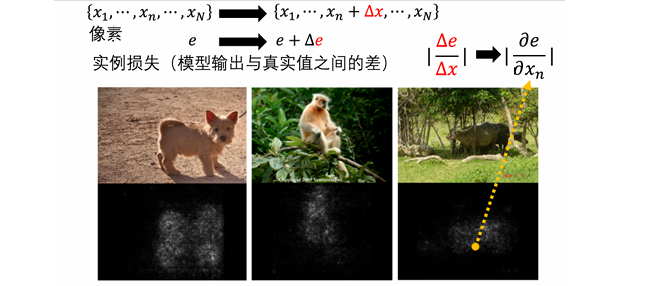
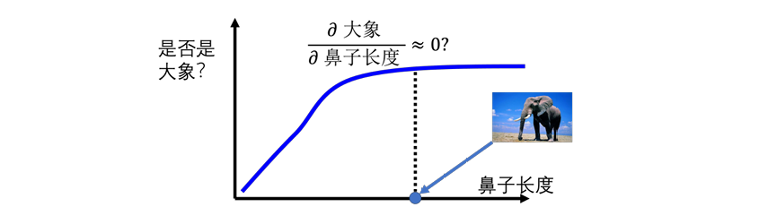
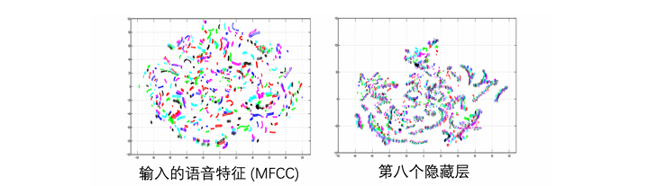
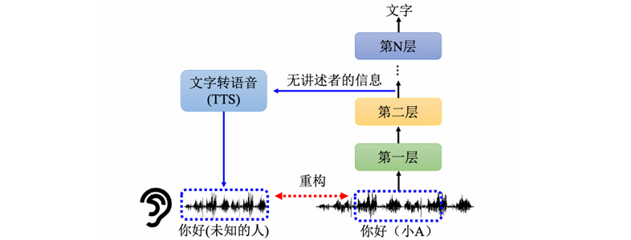
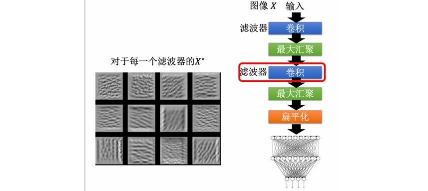
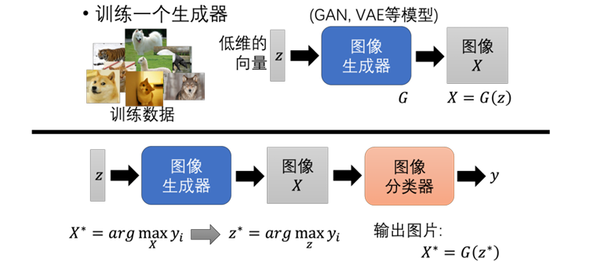

# Chapter18. Explainable Artificial Intelligence

可解释性人工智能（eXplainable Artificial Intelligence，XAI）研究的是：

- 模型为什么给出这个答案
- 模型到底看了输入的哪些部分
- 模型内部表示学到了什么信息
- 模型整体上认为某个类别应该长什么样子

!!! tip

    - 深度学习模型通常表现很强，但也常常像黑盒：

    $$
    x \rightarrow \text{model} \rightarrow y
    $$

        - 我们知道输入和输出，却不一定知道中间为什么会这样决策。
    - XAI 的目标是让强大的黑盒模型在关键场景中也能**被检查、被质疑、被信任**。

---

## 18.1 Why Explainability Matters

模型得到正确答案，不代表它真的学到了我们期待它学的东西。

- 机器学习的模型表现出很高的分类准确率，但可能实际利用的是数据集中的偏差、背景、文字水印或其他捷径。一旦环境变化，模型就可能**失效**。

!!! info "Real-world Scenarios"

    很多真实场景中，模型必须给出理由：

    1. **金融**：银行用模型判断是否放贷，用户有权知道被拒绝的原因
    2. **医疗**：模型给出疾病判断，医生需要知道模型依据了哪些症状或影像区域
    3. **法律**：模型辅助判断假释风险，需要检查模型是否存在偏见或歧视
    4. **自动驾驶**：车辆突然急刹，需要知道是因为看到行人还是模型误判

可解释性还可以帮助模型改进：

- 找出模型错误依赖的特征
- 检查数据集是否有 bias
- 判断模型有没有学到任务真正需要的规律

---

## 18.2 Interpretability of Decision Tree

==决策树（decision tree）==是一个相对容易解释的模型：
<u>每个节点问一个问题，根据答案往左或往右走，当你走到叶子节点时得到最终判断</u>

我们可以沿着路径读出决策规则，因此单棵决策树有比较好的可解释性。

但是决策树也不是万能答案：

- 特征很多时，树会变得非常复杂
- 节点太多时，人也很难理解完整规则
- 实际比赛和工业中常用的是 random forest / boosted trees，而不是单棵树
    - 单棵树可以解释，而一整片森林就很难解释

---

## 18.3 Goal of XAI

为了解释比如决策树、随机森林的意义，我们首先应该定义可解释性的目标是什么。一个常见误解是：好的解释必须完整说明**整个模型的全部运作机制**，但这通常不现实，也未必必要。

1970 年哈佛大学教授做的一个心理学实验：有人在图书馆插队复印，只要给出一个“理由”，即使理由很空泛，别人接受插队的概率也会大幅上升。

- 这说明人类在很多时候需要的是：
  一个能被理解的理由、一个能让人接受的解释、一个足以支持信任或质疑的证据
- 所以在 XAI 中，解释常常有一定主观性：
    - 对人来说合理的解释，未必等于模型真实的内部机制
    - 解释方法常常是在黑盒行为和人类理解之间搭桥

!!! warning

    可解释性结果不能盲目信任。解释本身也是一种模型或算法，也可能误导人。

---

XAI 常分为两大类：==局部解释==（local explanation）和==全局解释==（global explanation）

## 18.4 Local Explanation

局部解释针对某一个具体输入：

- 给模型一张猫的图片，模型说这是猫。问题是：<u>这张图片中的哪些部分让模型认为它是猫？</u>

局部解释关心：

- 某个样本为什么被这样分类
- 输入的哪些部分最关键
- 如果改变某部分，输出会不会变化

### Occlusion

最直接的局部解释方法是 ==遮挡法（occlusion）==。

假设输入可以拆成许多部分：

- 这部分可以是图片中的像素或区域、文本中的 token、音频中的时间片段、时间序列中的时间点

$$
x=(x_1,x_2,\cdots,x_n)
$$

遮挡法的做法：

1. 把原始输入 $x$ 输入模型，得到输出
2. 依次遮挡或删除某个部分 $x_i$
3. 再次输入模型，观察输出变化
4. 如果遮挡 $x_i$ 后输出大幅改变，说明 $x_i$ 很重要

### Using Gradient

#### Saliency Map

另一种常见方法是使用梯度得到 ==显著图（saliency map）==。

假设输入是一张图片：

$$
x=(x_1,x_2,\cdots,x_N)
$$

其中 $x_i$ 是第 $i$ 个像素。若模型的损失为 $e$，可以计算 $\dfrac{\partial e}{\partial x_i}$

- 如果轻微改变 $x_i$ 会让损失大幅变化，则 $x_i$ 很重要
- 如果改变 $x_i$ 几乎不影响损失，则 $x_i$ 不重要
因此可以用梯度大小表示重要性：

$$
S_i=\left|\frac{\partial e}{\partial x_i}\right|
$$

- 把所有像素的重要性 $S_i$ 画出来，就得到 saliency map

#### SmoothGrad

!!! question

    如果模型判断一张图是马，但 saliency map 最亮的位置在图片角落的水印，而不是马身上，说明模型可能学到了数据集偏差。

原始 saliency map 往往噪声很多，于是可以使用 ==SmoothGrad==。

**做法**：

1. 对原始输入加入多组随机噪声

   $$
   x^{(m)}=x+\epsilon^{(m)}
   $$

2. 分别计算每个 noisy input 的 saliency map
3. 把这些 saliency map 平均

**公式写作**：

$$
S_{\text{smooth}}(x)=\frac{1}{M}\sum_{m=1}^{M}S(x+\epsilon^{(m)})
$$

- 这样可以**减少**随机噪声，让重要区域更**集中**。

#### Gradient Saturation

梯度方法有一个重要问题：==梯度饱和（gradient saturation）==

教材用大象鼻子的例子说明：

- 鼻子越长，越像大象
- 但长到一定程度后，再变长也不会让“大象概率”继续明显增加
- 此时梯度可能接近 0

如果只看梯度，会误以为鼻子长度不重要。但实际上鼻子长度显然是判断大象的重要特征。因此梯度小不一定代表特征不重要，也可能代表**模型已经处在饱和区域**。

#### Integrated Gradients

为了解决梯度饱和问题，可以使用 ==积分梯度（integrated gradients）==

- 衡量的是从“没有信息的输入”变成当前输入的过程中，每个维度**累计贡献**了多少
- 它不是只看当前点的梯度，而是从一个 baseline $x'$ 逐渐走到输入 $x$，沿途累计梯度：

$$
IG_i(x)=(x_i-x_i')\int_0^1
\frac{\partial F(x'+\alpha(x-x'))}{\partial x_i}d\alpha
$$

- 其中：
    - $x'$：baseline，例如全黑图片； $x$：原始输入
    - $F(\cdot)$：模型对目标类别的输出

### Representation Visualization

除了看输入哪些部分重要，也可以看模型内部**如何处理输入**。
假设某一层隐藏表示是一个高维向量：

$$
h\in\mathbb{R}^{100}
$$

- 高维向量不容易直接观察，可以用 PCA、T-SNE 或 UMAP 等降维方法把它投影到**二维**，然后把不同样本的隐藏表示画在**平面**上。

!!! example "Speech Example"

    在语音识别中：

    - 原始声音特征可能无法清楚区分“内容相同但说话人不同”的样本
    - 经过多层神经网络后，隐藏表示可能按语义内容聚集
    - 说明模型逐渐去除了说话人差异，保留了语音内容

    

    这种可视化可以帮助我们理解：

    - 哪一层开始形成类别结构
    - 模型是否学到了说话内容
    - 模型是否还保留 speaker information 或 noise information

### Probing

==探针==（probing）：训练一个分类器检查某层表示中是否包含某种信息。

- 以 BERT 为例，假设取出某一层的 token embedding 训练一个 POS classifier，如果这个 classifier 准确率高，说明该层 embedding 中包含较多词性信息；也可以训练 NER classifier 用来检查这一层是否包含人名、地名、组织名等信息。

!!! warning "Be Careful with Probes"

    使用 probing 时要小心：

    - 如果 probe 太弱，准确率低不代表表示中没有信息
    - 如果 probe 太强，可能自己学会任务，而不是证明原表示已经编码了信息
    - probe 的训练质量、模型容量和数据集都会影响结论

### Generative Probing

探针不一定是分类器，也可以是生成模型。

例如语音模型中，可以把某层隐藏表示输入到 TTS 模型，让它重建声音：

$$
h^{(l)}\rightarrow \text{TTS}\rightarrow \hat{x}
$$

如果重建出的声音：

- 内容还在，但说话人信息消失，说明该层可能去除了 speaker information
- 噪声消失，说明该层可能过滤了噪声
- 内容也消失，说明该层表示已经不适合还原原始语音

这种方法可以帮助分析不同层负责保留或丢弃哪些信息。

---

## 18.5 Global Explanation

全局解释不针对某个特定输入，而是分析整个模型：

- 对这个模型而言，什么样的东西叫做猫？

全局解释关心：

- 某个 filter 想检测什么模式
- 某个类别在模型心中长什么样
- 模型整体学到的特征是什么

!!! info "Feature Map"

    - 以 CNN 为例，假设某个 filter 的 feature map 为：$a_{ij}^{(k)}(X)$
        - 其中 $X$ 为输入图片，$k$ 为第 $k$ 个 filter，$a_{ij}^{(k)}$ 是该 filter 在位置 $(i,j)$ 的激活值

    - 为了知道这个 filter 喜欢什么模式，可以直接优化输入图片：

    $$
    X^*=\arg\max_X\sum_{i,j}a_{ij}^{(k)}(X)
    $$

        - 也就是说，可以用梯度上升法找到 $X^*$，让这个 filter 的总激活越大越好。

在 MNIST 这类任务中，浅层或中层 filter 往往会学到：横线、竖线、斜线以及局部笔画

这说明 CNN 的中间层可能在检测**数字的基本笔画结构**。

### Class Visualization

既然模型能将图片分类为某个类别 $c$，那么什么样的图片能让模型最确信它是类别 $c$？

- **固定模型参数不动，把输入图片当作可优化变量**，通过梯度上升让类别的输出分数最大化：

$$
X^*=\arg\max_Xy_c(X)
$$

- **问题**：直接这样优化，得到的图片往往是人眼看不懂的高频噪声。因为模型学到的判别特征可能是一些人眼不敏感的 pattern（比如某种特定频率的纹理），这些 pattern 在数学上确实能让分数变大，但对人类毫无可读性。

为了让生成出来的图片更像人类能理解的图片，可以加入**正则化（regularization）**：

$$
X^*=\arg\max_X \left(y_c(X)-\lambda R(X)\right)
$$

加入 $R(X)$ 的目的是让生成的图片**同时满足人类对"自然图片"的先验认知**：

| 正则化方法                   | 作用           |
| ----------------------- | ------------ |
| $\|X\|_2^2$（L2 范数）      | 限制像素值不要过大    |
| 限制图像变化剧烈程度              | 避免高频噪声       |
| 相邻像素平滑性                 | 让图片更"连续"     |
| Total variation penalty | 抑制相邻像素间的剧烈跳变 |

!!! note

    这些正则项本质上是**强加的人类先验**。我们看到的"解释"并不是模型的"真实想法"，而是**在人类审美约束下的近似**。正则化越强，图片越好看，但可能离模型真正的决策依据越远。

### Generative Models

直接优化像素空间自由度太大，优化会陷入**高频噪声**。

- 更好的方式是先训练一个**生成器**（如 GAN 或 VAE）来约束搜索空间

!!! info "Train"

    1. **Step 1**：训练一个生成模型 （如 GAN 或 VAE）

       $$
       X=G(z)
       $$

        - $z$：低维 latent vector
        - $G$：GAN / VAE 等生成模型，只生成"看起来像真实图片"的内容，比随机像素更合理
    2. **Step 2**：不再优化 $X$，而是优化 $z$

    $$
    z^*=\arg\max_z y_c(G(z))
    $$

        - 分类器 $y_c$ 对 $G(z)$ 输出的图片做分类
        - 梯度可以**回传到 $z$**，用梯度上升更新 $z$
        - $z$ 的维度远低于像素空间，搜索空间小得多
    3. **Step 3**：得到最终解释图片

    $$
    X^*=G(z^*)
    $$

    把这个**图像生成器和图像分类器接在一起即可**。
    图像生成器输入是 $z$，输出 $G(z)$ 是一张图片，分类器把这个图片当做输入，输出分类的结果。

这样做的好处是：

- $G(z)$ 通常更像真实图片
- 搜索空间被限制在生成模型学到的 image manifold 上
- 生成出的解释更容易被人理解

缺点是：

- 解释结果依赖生成器质量
- 如果生成器本身有 bias，解释也会有 bias
- 生成器限制了模型可能真正依赖的非自然模式

---

## 18.6 LIME

除了直接解释模型内部，还可以用**简单模型**去近似黑盒模型。
==LIME==（Local Interpretable Model-agnostic Explanations）的想法是：

- 用一个可解释模型，在某个输入附近局部模仿黑盒模型
- 这个局部区域内的行为是可以用线性模型去模仿的，所以它叫局部的可解释性
