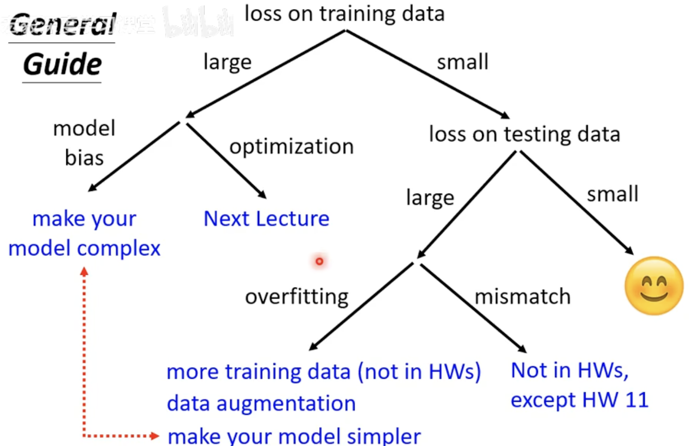
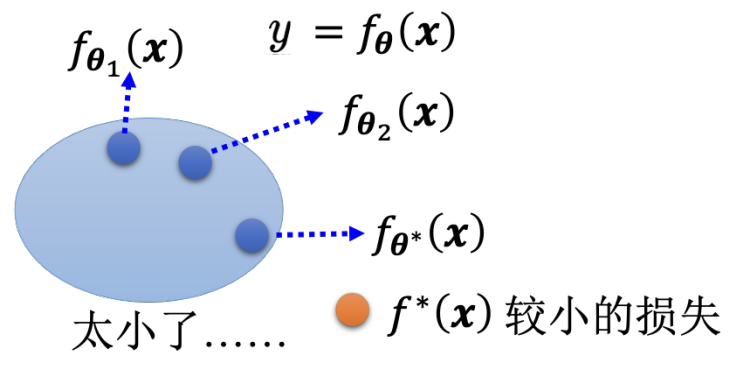
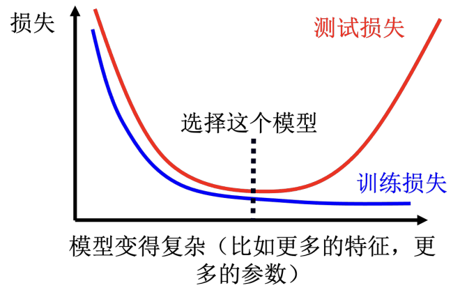
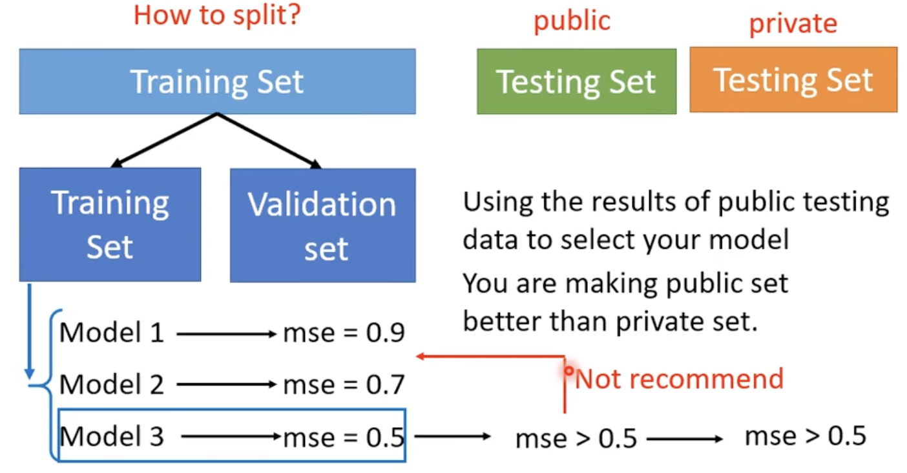
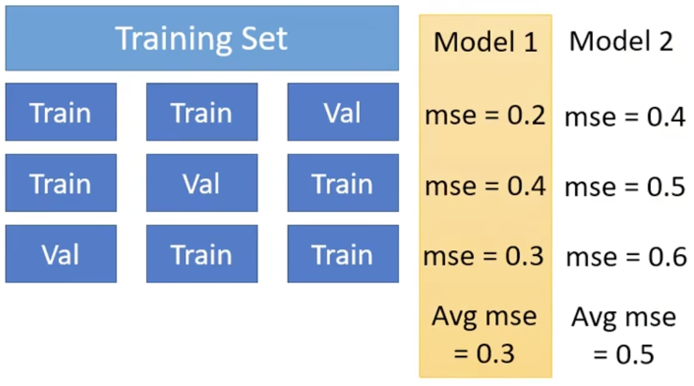

# Chapter2. General Guide

## 2.1 Model Bias

Find a needle in a haystack, but <u>there is no needle</u>

- 模型过于简单
- Solution: redesign model to make it more *flexible*

## 2.2 Optimization Issue

A needle is in a haystack, <u>just cannot find it</u>.

!!! tip "Model Bias v.s. Optimization Issue"

    - Gaining the insights from comparison
    - Start from shallower networks (or other models), which are easier to optimize
    - If deeper networks do not obtain smaller loss on **training data**, then there is optimization issue.

Solution: More powerful optimization technology

## 2.3 Overfitting

*Small loss* on training data, *large loss* on testing data
**Solution**:

1. More training data (e.g. Data augmentation)
2. Use constrained model
    - Less parameters, sharing parameters
    - Less features
    - early stopping, regularization, dropout method ...

## 2.4 Cross Validation

Bias-Complexity Trade-off

选取在 <u>validation set</u> 上表现最好的模型

!!! info "How to split"

    N-fold Cross Validation
    假设 $N=3$ ，训练集被切成 3 等份，拿其中一份当作验证集，另外两份当训练集，这件事情要重复 3 次

    

    最终选择在三种情况下平均表现最好的 model

## 2.5 Missmatch

- Your training and testing data have different distributions.
