# Chapter3. Deep Learning Basics

## 3.1 Local Minimum and Saddle Point

### 1. Critical Point

**临界点**（critical point）：梯度为零的点

- 局部极小值（local minimum）
- 鞍点（saddle point）

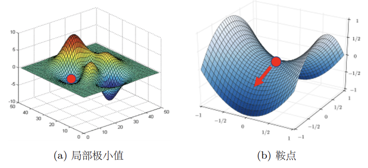

### 2. Determine the type of a critical point

#### Tayler series appoximation

$L (\theta)$ around $\theta=\theta'$ can be approximated below: 

$$
L(\theta)\approx L(\theta')+(\theta-\theta')^Tg +\frac{1}{2}(\theta-\theta')^TH(\theta-\theta')
$$

- Gradient $g$ is a <u>vector</u>, $g=\nabla L(\theta')\quad g_i = \dfrac{\partial L (\theta')}{\partial(\theta_i)}$
- Hessian $H$ is a <u>matrix</u>, $H_{ij}=\dfrac{\partial^2}{\partial\theta_i \partial \theta_j}L(\theta '')$

位于 critical point 时 $g=0$，原式可简化为 

$$
L(\theta)\approx L(\theta')+\frac{1}{2}(\theta-\theta')^TH(\theta-\theta')=L(\theta')+v^THv
$$

1. ==Local minimum== : For all = $v$, $v^THv>0$ 
    - $H$ is positive definite, all eigen values are positive.
2. ==Local maximum== : For all = $v$, $v^THv<0$ 
    - $H$ is negative definite, all eigen values are negative.
3. ==Saddle point== : Sometimes $v^THv>0$, sometimes $v^THv<0$ 

<u>可以通过计算 Hessian matrix（海森矩阵）来判断临界点的类型</u>

!!! example

    假设有神经网络 $y = w_1 w_2 x$，且训练集只有一组数据 $(1,1)$

    
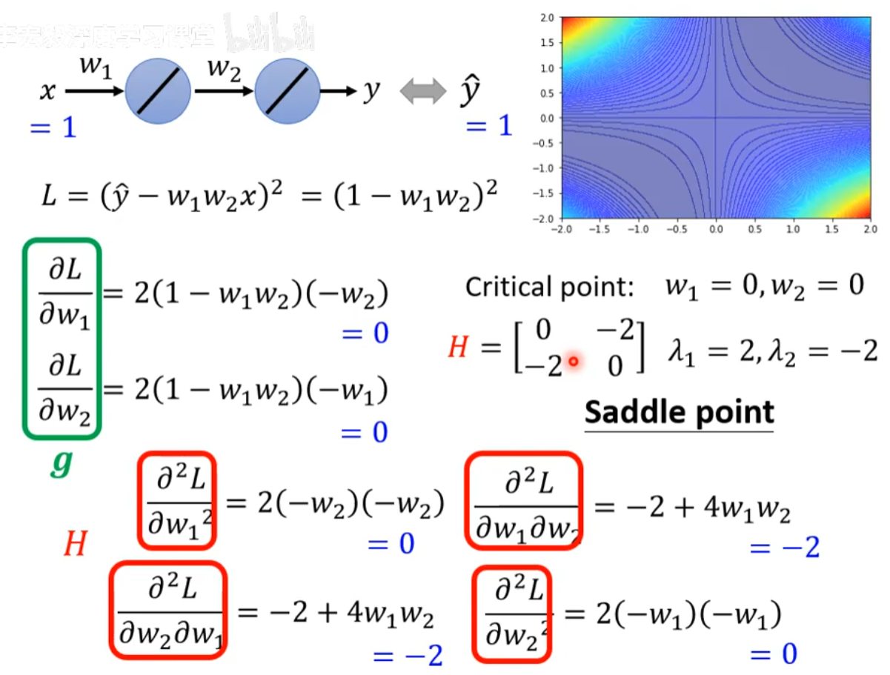

#### Update Direction

$H$ may tell us *parameter update direction*.

令 $u$ 为 $H$ 的特征向量，$\lambda$ 为 $H$ 的特征值，对于优化问题，可令 $u = \theta-\theta'$，可得：

$$
u^T H u = u^T(\lambda u) = \lambda \|u\|^2
$$

并且

$$
L(\theta)\approx L(\theta')+\frac{1}{2}(\theta-\theta')^TH(\theta-\theta')=L(\theta')+u^THu = L(\theta') + \lambda \|u\|^2
$$

1. 假如 $\lambda >0$，则 $L(\theta) > L(\theta')$ 且 $\theta = \theta' + u$，说明按 $u$ 的方向更新 $\theta$，会增加损失
2. 假如 $\lambda <0$，则 $L(\theta) < L(\theta')$ ，按 $u$ 的方向更新 $\theta$，会减小损失

!!! bug

    由于计算 Hessian Matrix 需要计算二次微分以及特征值，计算量太大，因此很少用这种方法来逃离鞍点。

#### Saddle Point v.s. Local Minimum

低纬度数中的 saddle point，在高纬度中可以转化为 local minimum

| (a) 一维误差表面                                                          | (b) 二维误差表面                                                          | (c) 复杂误差表面                                                          |
| ------------------------------------------------------------------- | ------------------------------------------------------------------- | ------------------------------------------------------------------- |
| 
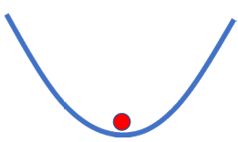
 | 
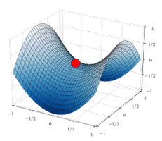
 | 
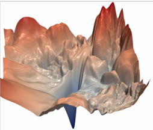
 |
**Minimum ratio（最小值比例）**:

$$
\text{Minimum ratio} = \frac{\text{Number of Positive Eigen values}}{\text{Number of Eigen values}}
$$

可见 local minimum 的数量并不多，大部分情况下遇到 critical point 其实都是 saddle point

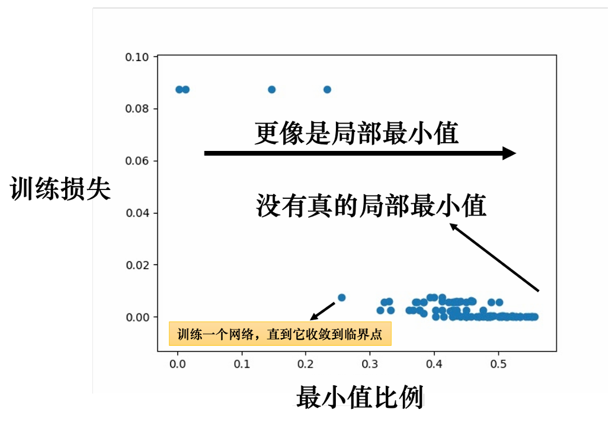

---

## 3.2 Batch and Momentum

shuffle：随机打乱有很多不同的做法，一个常见的做法是在每一个 epoch 开始之前重新划分 batch，也就是说，每个 epoch 的批量的数据都不一样

### 1. The Effect of Batch Size

**批量梯度下降法（Batch Gradient Descent，BGD）**：

- Use <u>full batch</u> when updating parameters
- Long time for cooldown, but powerful.

**随机梯度下降法（Stochastic Gradient Descent，SGD）**：

- Use <u>one sample</u> when updating parameters
- Short time for cooldown, but noisy.

#### Parallel Computation

!!! tip "并行计算"

    现代 CPU 可以提供并行计算，因此需要将其纳入考虑范围

    
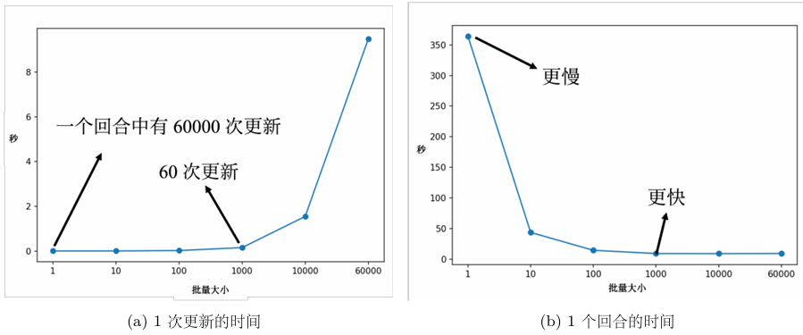

    存在并行计算时，large batch size 效率更高，一个 epoch 花的时间比较少（less updates）

#### Small Batch v.s. Large Batch

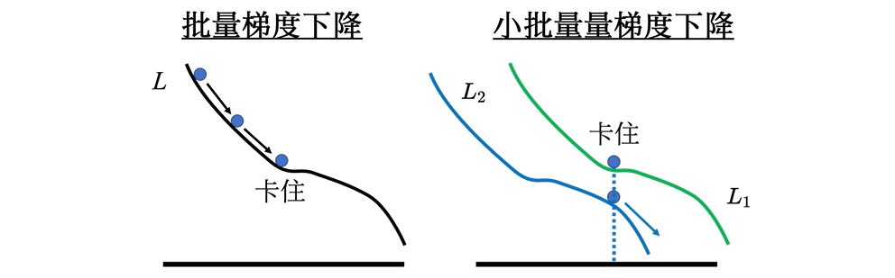
  

- Smaller batch size has better performance.
- "Noisy" update is better for training.

即使训练准确率相近，但**小批量在测试集上表现更好**（大批量更容易**过拟合**）

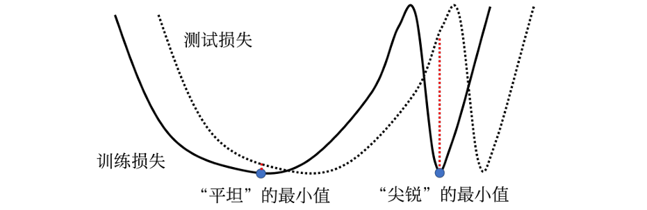
  

| Local Minimum | 几何特征                 | 泛化能力 | 原因                |
| ------------- | -------------------- | ---- | ----------------- |
| Good          | 宽阔“盆地”（flat minima）  | ✅ 强  | 训练/测试损失函数差异对其影响小  |
| Bad           | 狭窄“峡谷”（sharp minima） | ❌ 弱  | 损失函数微小变化 → 测试损失剧增 |

### 2. Momentum Method

Movement : <u>movement of last step</u> minus <u>gradient</u> at pres ent.

1. Staring at $\theta^0$
2. Movement $m^0=0$
3. Compute gradient $g^0$
4. Movement $m^1= \lambda m^0 -\eta g^0$
5. Move to $\theta^1 = \theta^0 + m^1$
6. Compute gradient $g^1$
7. Movement $m^2 = \lambda m^1-\eta g^1$
8. Move to $\theta ^2 = \theta^1 +m^2$

因此 movement 的迭代过程如下：

$$
\begin{align}
m^0&=0 \\
m^1&= \lambda m^0 -\eta g^0 \\
m^2 &= \lambda m^1 -\eta g^1 \\
&\vdots
\end{align}
$$

动量有可能带来的好处：

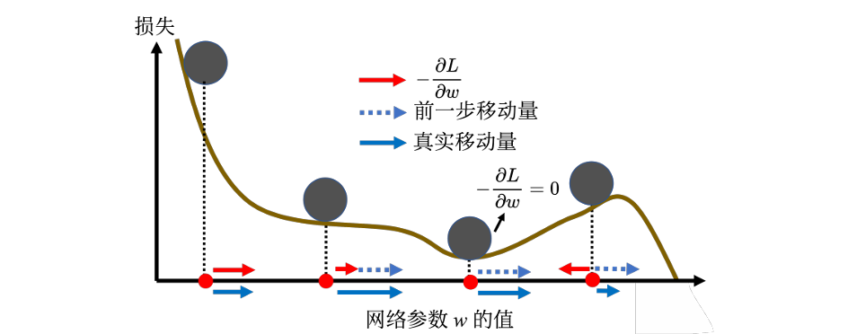
  

---

## 3.3 Adaptive Learning Rate

Training can be difficult even without critical points.

- Learning rate cannot be ==one-size-fits-all==

要走到一个临界点其实是比较困难的，多数时候训练在还没有走到临界点的时候就已经停止

### 1. Adagrad (Adaptive Gradient)

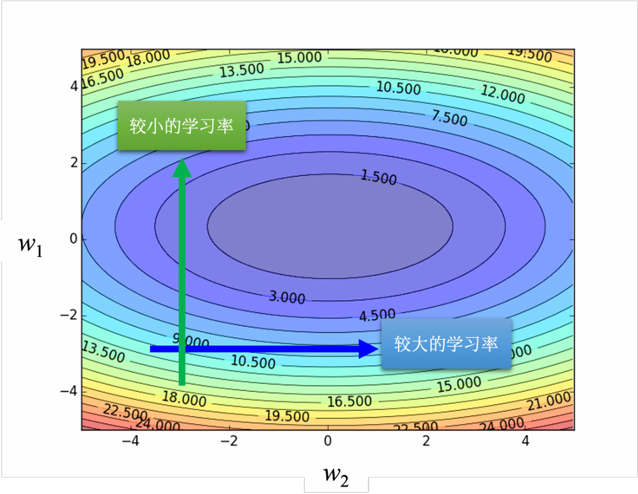

更新参数 $\theta^i_t$ 的过程为：

$$
\theta^i_{t+1} \leftarrow \theta^i_t-\frac{\eta}{\sigma^i_t} g^i_t \quad\text{where }g_i^t=\frac{\partial L}{\partial \theta _i}|_{\theta=\theta^t}
$$

- 其中 $\dfrac{\eta}{\sigma^i_t}$ 被称为 ==parameter dependent（参数相关）==
参数相关的一个常见的类型是算梯度的**均方根（root mean square）**

第 $t+1$ 次更新第 $i$ 个参数的时候：

$$
\theta^i_{t+1} \leftarrow \theta^i_t-\frac{\eta}{\sigma^i_t} g^i_t \quad \sigma_t^i = \sqrt{\frac{1}{t+1} \sum^t_{j=0}(g_j^i)^2}
$$

- 可以通过斜率的大小自动调整 learning rate 的大小

### 2. RMSProp

!!! tip

    RMSprop（Root Mean Squared propagation）没有论文，Geoffrey Hinton 在 Coursera 上开过深度学习的课程，他的课程里面讲了RMSprop，如果要引用，需要引用对应视频的链接。

First step:

$$
\sigma_0^i =\sqrt{(g_0^i)^2}=|g_0^i|
$$

Second step:

$$
\theta^i_{2} \leftarrow \theta^i_1-\frac{\eta}{\sigma^i_1} g^i_1 \quad \sigma_1^i = \sqrt{\alpha(\sigma_0^i)+(1-\alpha)(g_1^i)^2}
$$

${t+1}_{\text{th}}$ step:

$$
\theta^i_{t+1} \leftarrow \theta^i_t-\frac{\eta}{\sigma^i_t} g^i_t \quad \sigma_t^i = \sqrt{\alpha(\sigma_{t-1}^i)+(1-\alpha)(g_t^i)^2}
$$

### 3. Adam

最常用的优化的策略或者优化器（optimizer）是Adam（Adaptive moment estimation）

!!! info "Adam: RMSProp + Momentum"

    Adam 其使用动量作为参数更新方向，并且能够自适应调整学习率。PyTorch 里面已经写好了 Adam 优化器，这个优化器里面有一些超参数需要人为决定，但是往往用PyTorch预设的参数就足够好了。

---

## 3.4 Learning Rate Scheduling

$$
\theta^i_{t+1} \leftarrow \theta^i_t-\frac{\color{red}{\eta^t}}{\sigma^i_t} g^i_t
$$

==Learning rate decay==

- Also called <u>learning rate annealing</u> (学习率退火)
- As the training goes, we are closer to the destination, so we reduce the learning rate.
==Warm up==
- Increase, and then decrease.
- At the beginning, the estimate of $\sigma_i^t$ has large variance.

---

## 3.5 Summary of Optimization

**(Vanilla) Gradient Descent**

$$
\theta^i_{t+1}\leftarrow \theta^i_t -\eta g^i_t
$$

**Various Improvements**

$$
\theta^i_{t+1}\leftarrow \theta^i_t -\frac{\eta}{\sigma^i_t} m^i_t
$$

!!! question

    Q：动量 $m^i_t$ 考虑了过去所有的梯度，均方根 $\sigma^i_t$ 考虑了过去所有的梯度，一个放在分子，一个放在分母，并且它们都考虑过去所有的梯度，不就是正好抵消了吗？ 

    A：$m^i_t$ 和 $\sigma^i_t$ 在使用过去所有梯度的方式是不一样的，动量是直接把所有的梯度都加起来，所以它有考虑方向，它有考虑梯度的正负。但是均方根不考虑梯度的方向，只考虑梯度的大小，计算 $\sigma^i_t$ 的时候，都要把梯度取一个平方项，把平方的结果加起来，所以只考虑梯度的大小，不考虑它的方向，所以动量跟 $\sigma^i_t$ 计算出来的结果并不会互相抵消

---

## 3.6 Classification

### 1. Classification and Regression

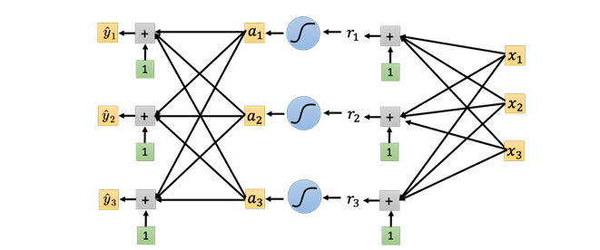

### 2. Classification with softmax

Regression:

$$
y = b + \boldsymbol{c}^T \sigma(\boldsymbol{b}+W\boldsymbol{x})
$$

Classification:

$$
\begin{align}
\boldsymbol{y}&=\boldsymbol{b'}+W' \sigma({\boldsymbol{b}+W \boldsymbol{x}}) \\
\boldsymbol{y'}&=softmax(\boldsymbol{y})
\end{align}
$$

Soft-max:

$$
y'_i = \frac{\exp{y_i}}{\sum_j \exp{y_i}}\quad \text{where } 0<y'_i<1,\sum_i y'_i=1
$$

### 3. Loss of Classification

Loss function 仍然定义为 $L=\frac{1}{N}\sum_n e_n$
Error 有多种定义方式：

1. Mean Square Error (MSE): 

$$
e = \sum_i(\hat{y_i}-y'_i)^2
$$

2. Cross-entropy: 

$$
e = -\sum_i \hat{y_i} \cdot \ln{y'_i}
$$

交叉熵的优势：

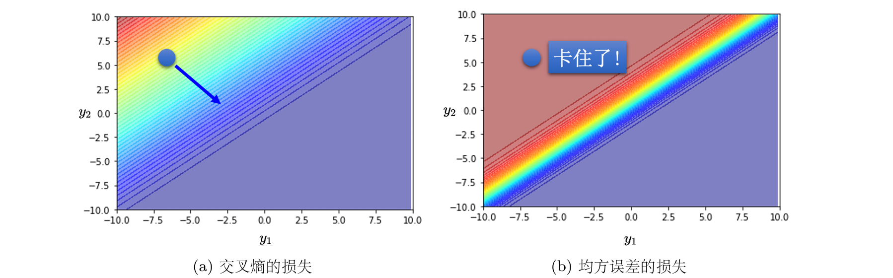

- **Minimizing cross-entropy** is equivalent to **maximizing likelihood**.

---

## 3.7 Batch Normalization

!!! info "Feature Normalization"

    
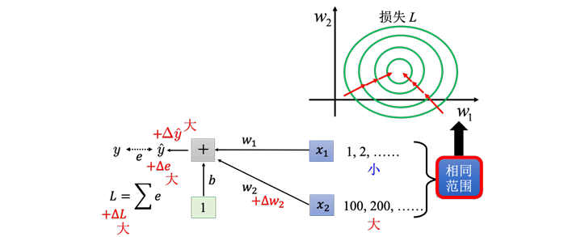

    - 制造比较好的 error face，以便训练模型

==Z-score normalization（Z值归一化）==，也称为标准化（standardization）

假设 $x^1$ 到 $x^R$ 是所有的特征向量，用 $x_i^r$ 表示第 $r$ 个向量的第 $i$ 个元素，令

$$
m_i = \sum_j x_j^i, \sigma_i = \sqrt{\frac{\sum_j(m_i-x_j^i)^2}{N}}
$$

有下式

$$
\tilde{x}_i^r \leftarrow \frac{x_i^r - m_i}{\sigma_i}
$$

### 1. Consider Deep Learning

$\tilde{x}$ 代表归一化的特征，$\tilde{x}$ 通过 $W^1$ 得到 $\boldsymbol{z}$ 后，同样需要对这些特征做*归一化*

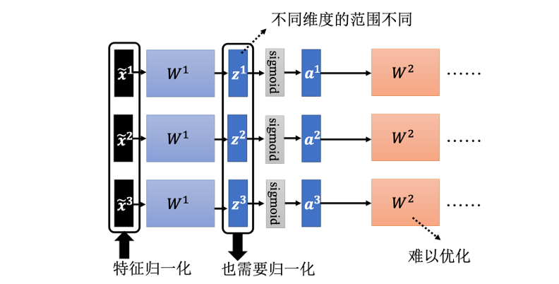

如果数据量过大，可以采用==批量归一化==，在一个批量上做特征归一化作为近似

- 在做批量归一化的时候，往往还会做如下操作

$$
\hat{z}^i = \gamma \odot \tilde{z}^i + \beta
$$

    其中，$\odot$ 代表逐元素的相乘；$\beta,\gamma$ 为网络的参数，需要另外学习

### 2. Inference-time Batch Normalization

- 测试时不能依赖当前 batch 的统计量
- 利用训练中每一个 batch 的 $\mu,\sigma$，更新**移动平均值**（moving average）

$$
\bar{\mu} \leftarrow p \bar{\mu}+(1-p)\mu^t
$$

    其中 $\bar{\mu}$ 是当前累积的移动平均均值，$\mu^t$ 是第 $t$ 个 batch 的均值

- 测试阶段使用 $\bar{\mu},\bar{\sigma}$ 进行归一化操作

### 3. Internal Covariate Shift

此处讨论批量归一化为什么有用

!!! info

    - 协变量偏移（covariate shift），训练集和预测集样本分布不一致的问题叫做==协变量偏移==现象
    - 在深度神经网络中，**每一层的输入分布会随着前面层参数的更新而不断变化**。这种变化被称为“==内部协变量偏移(internal covariate shift)==”。

    
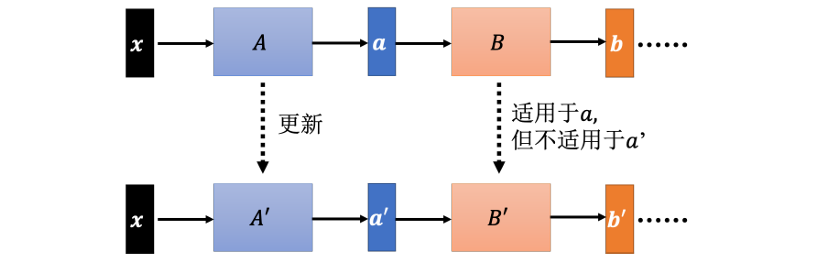

- “内部协变量偏移”**可能不是 BN 有效的根本原因**，甚至可能不是一个主要问题
- 批量归一化可以改变误差表面，让误差表面比较不崎岖
