# Chapter4. Convolutional Neural Network

以一张 $100\times100$ 的图片为例，tensor（张量）里有 $100\times 100 \times 3$ 个数字

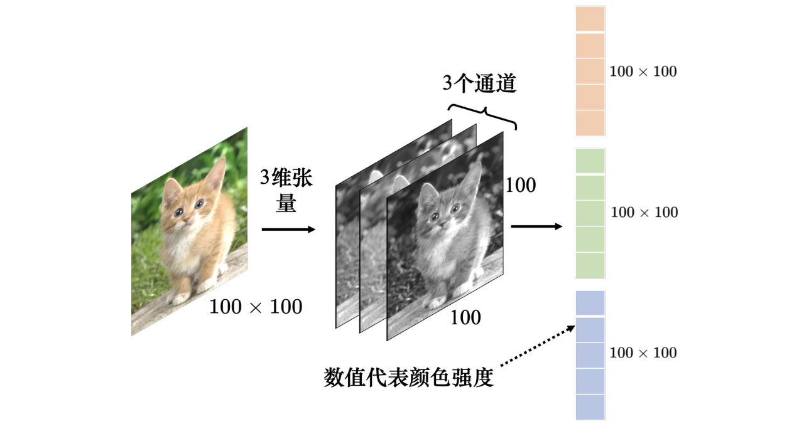

- 向量中每一纬存放的数值是该像素点在该通道（channel）下的颜色强度

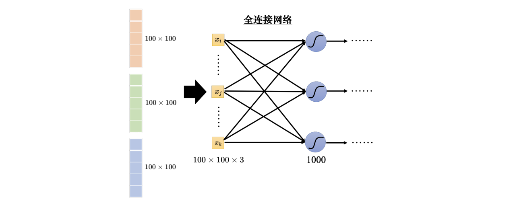

- 假设使用 Fully Connected Network，会导致产生非常大的计算量

!!! tip

    针对图像识别，可以从图像本身的特性出发，进行一些观察。

---

## 4.1 Convolutional Layer

### 1. Neuron Version

#### Receptive Field

!!! tip

    Need to see the whole image? NO!!

    
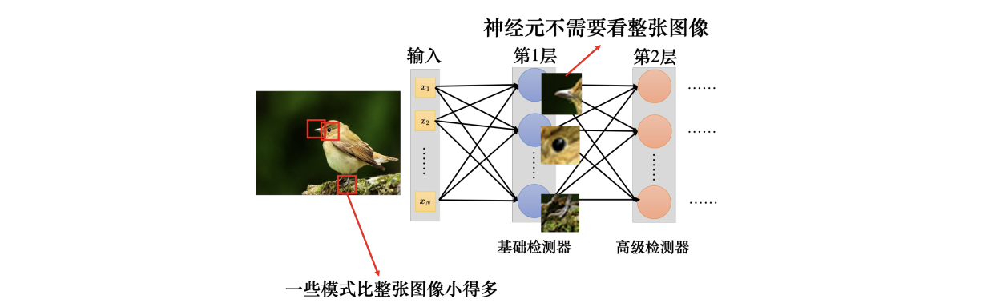

    Some ==patterns== are much smaller than the whole image

CNN 会设定一个区域，即==感受野（receptive field）==，每个 neuron 对应其特定的 receptive field

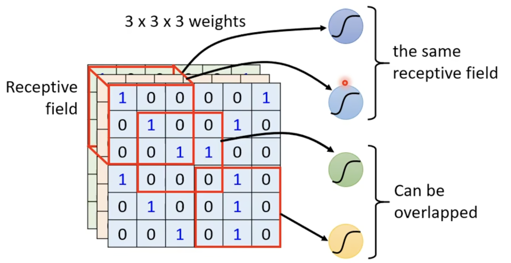

**Typical setting of receptive field**

- Each receptive field has a set of neurons.

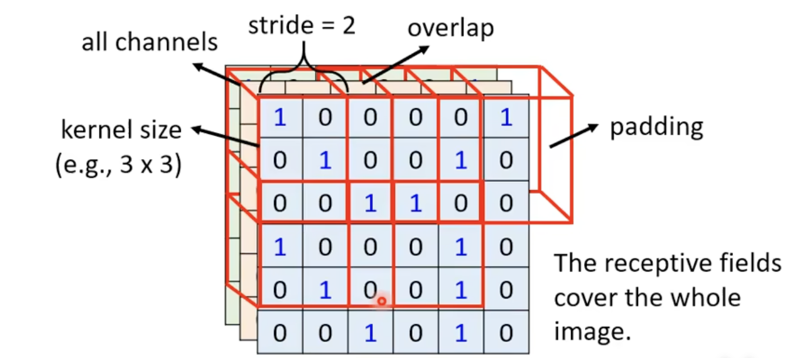

- padding：填充 0 来补全多余部分
- kernel size 通常为 $3 \times 3$
- stride：通常为 $1$ 或 $2$，使得 receptive field 彼此有重叠部分

#### Parameter Sharing

!!! tip

    The same pattern appear in different regions.

    
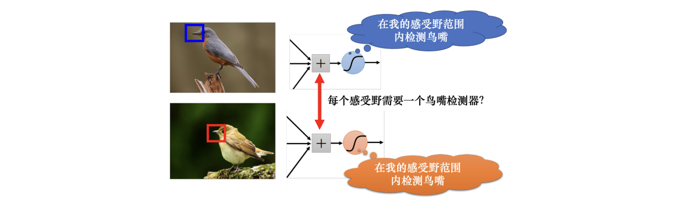

    同样的视觉模式（如鸟嘴）可能出现在图像不同位置，因此无需为每个区域单独设置检测神经元，可通过 **参数共享（parameter sharing）** 简化模型

==Parameter sharing==：不同神经元采用相同的权重

- Convolution: Each filter convolves over the input image.

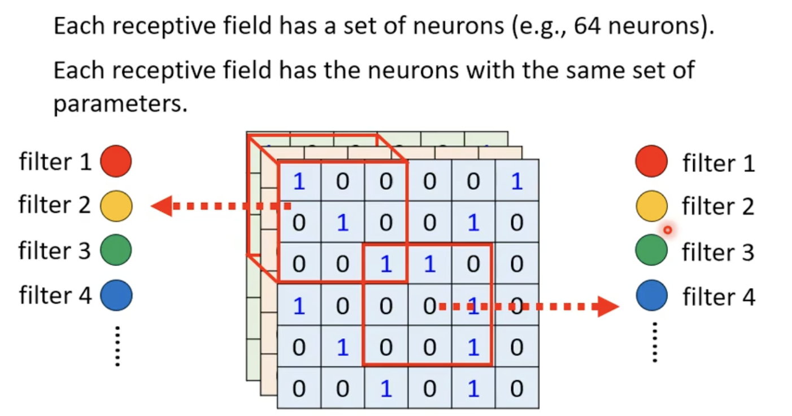

通过让不同感受野中对应位置的神经元共享同一组参数（即==滤波器 filter==），实现参数复用，从而大幅减少模型参数量

### 2. Filter Version

==Convolutional layer 卷积层== = receptive field + parameter sharing

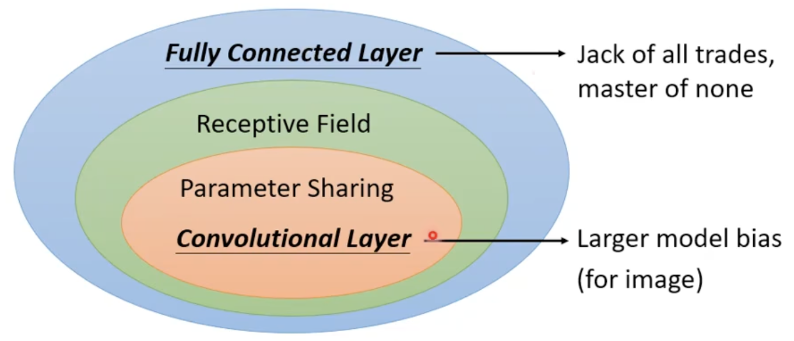

- CNN 适用于影像相关的任务

**Another version of explaining CNN**

- 一个卷积层内有一排滤波器，每个都是一个 $3\times3\times \text{channel}$

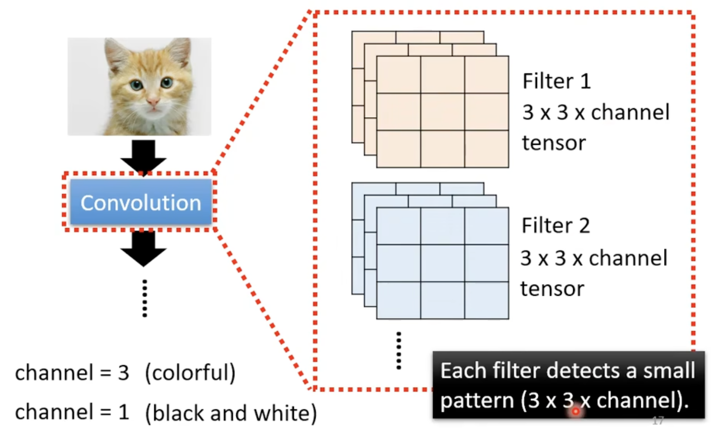

- 将 Filter 和图像做矩阵运算，最终得到 ==Feature Map（特征映射）==
    - 假设卷积层里面有 $64$ 个滤波器，产生的特征映射就有 $64$ 组数字
    - Feature Map 可以看成一张新的图像，图像有 $64$ 个通道，每个通道就对应一个滤波器

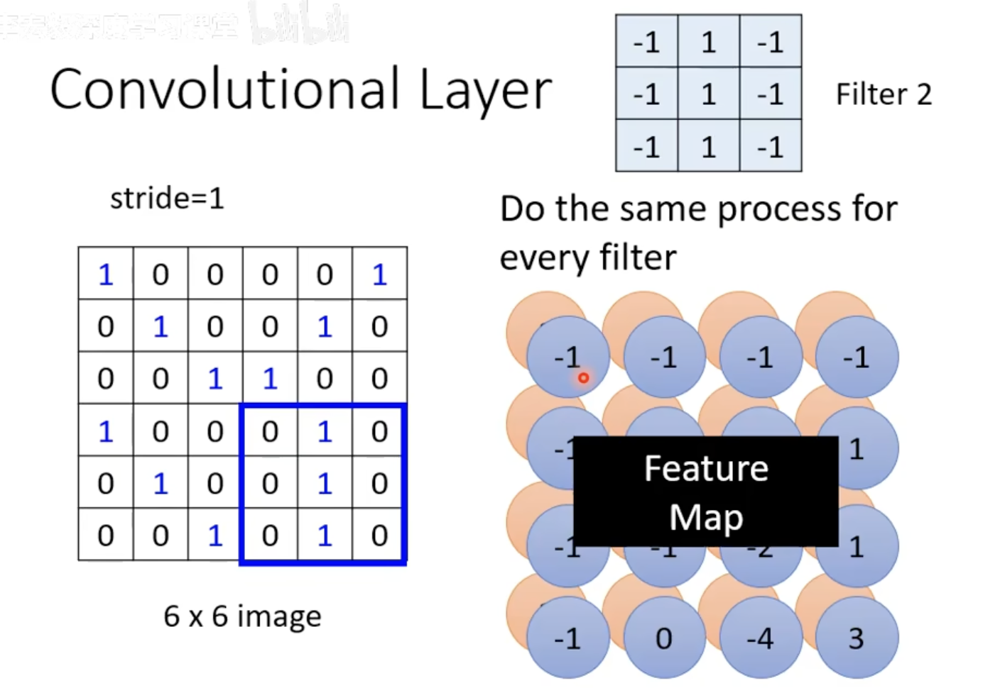

- 第 $2$ 层的卷积里面也有一组滤波器，滤波器的大小为 $3\times3\times 64$
    - 滤波器的高度就是它要处理的图像的通道 (此处为 $64$)

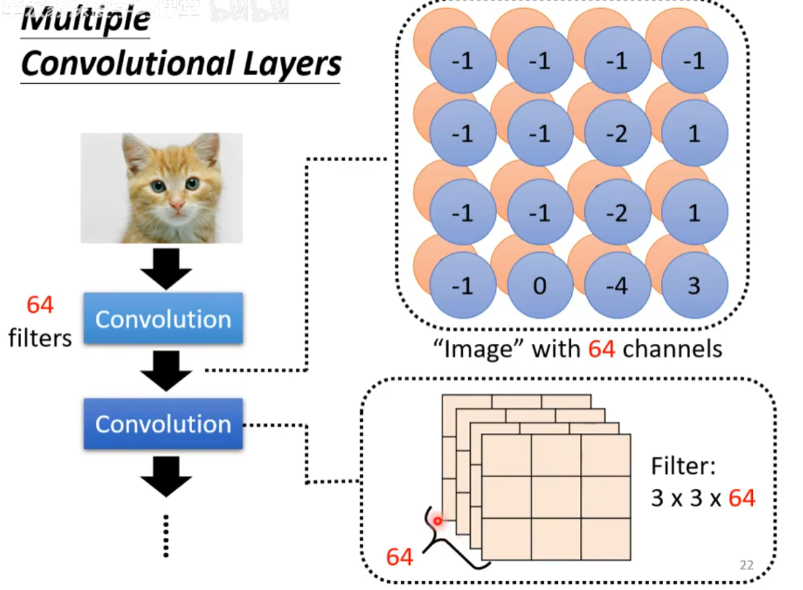

!!! question "如果滤波器的大小一直为 3 × 3，是否会看不到较大范围的 pattern？"

    如图所示，如果在第 2 层卷积层滤波器的大小是 3 × 3，那么对应了第 1 个卷积层中 5 × 5 的范围。因此网络叠得越深，看的范围就会越来越大。

    
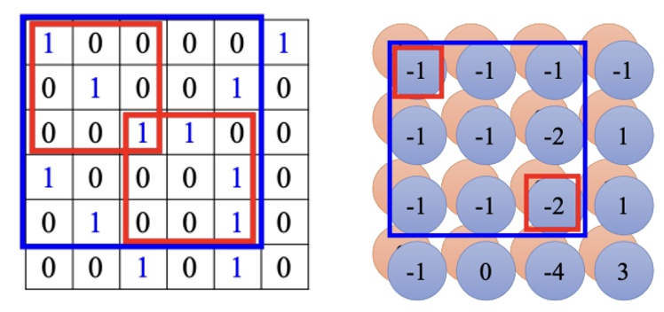

---

## 4.2 Pooling

*Subsampling* the pixels will not change the object.

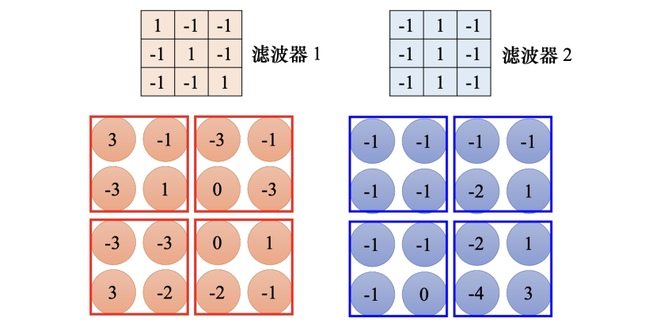

- Max pooling: 取每一组的最大值
- Mean pooling: 取每一组的平均值

---

### 4.3 The whole CNN

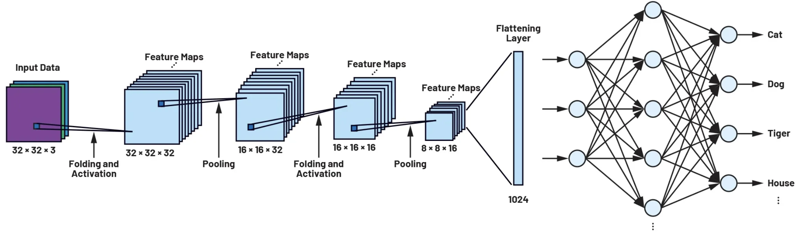

1. 特征提取
    - 卷积层 (Convolution)
    - 池化层 (Pooling): 并非所有网络都需要 pooling，这取决于应用的领域以及输入的数据特征
2. 转换与分类
    - Flatten: 处理后的数据通常是多维的，将这些多维数据拉直成一个**一维的长向量**，以便输入到神经网络中  
    - Fully Connected Layers: 根据提取到的特征进行综合判断，计算出这张图属于各个类别的得分
    - Softmax: 将全连接层给出的原始分数转换成**概率值**
