# Chapter5. Recurrent Neural Network

> 此章节很多概念和 [NLP 中 RNN 章节](../NLP/RNN.md) 的内容重复，故部分内容不再赘述

---

## 5.1 One-hot code

用向量来表示单词

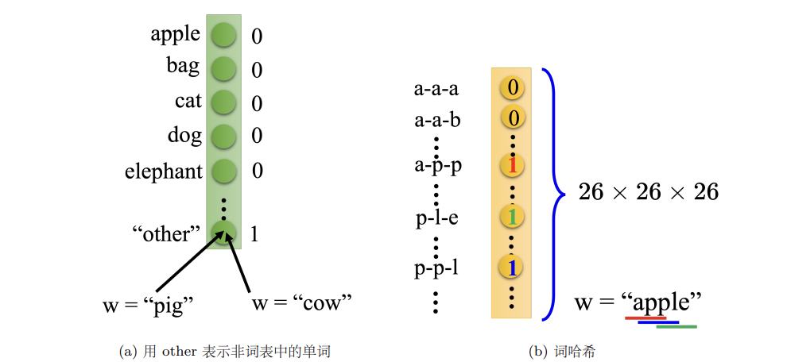

---

## 5.2 Structure of RNN

隐藏层的输出会被存到==记忆元（memory cell）==，下一次输入时，神经元会考虑输入以及记忆元里的值（hidden state）。

- 当前时刻的隐状态使用与上一时刻隐状态**相同**的定义，所以隐状态的计算是循环的（recurrent），基于循环计算的隐状态神经网络被称为**循环神经网络**。

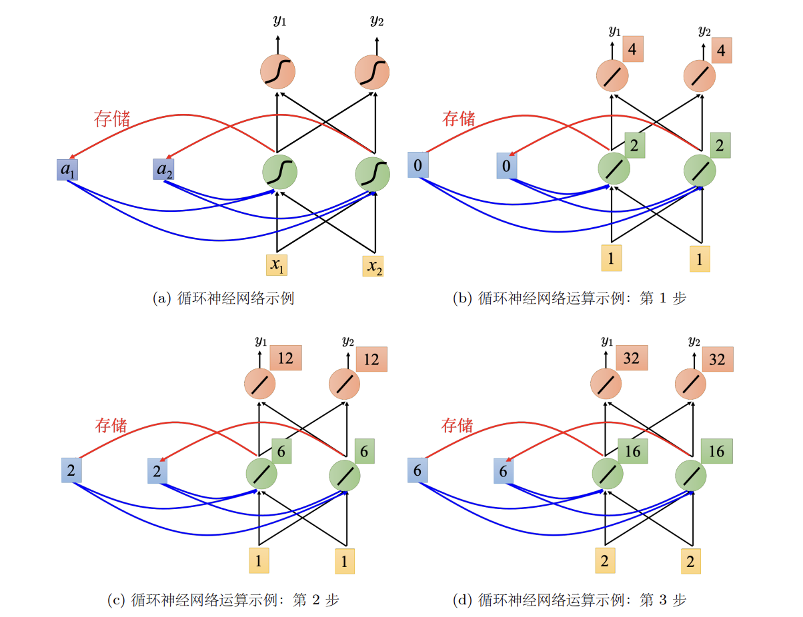

---

## 5.3 Other RNN

### 1. Elman Network & Jordan Network

- 机制：Jordan 网络反馈的是输出层值（作为下一时刻的输入存入记忆元），而 Elman 网络反馈的是隐藏层值。
- 可解释性：Elman 网络的隐藏层状态缺乏直接的目标约束，难以调控其学习内容；Jordan 网络因反馈源为有明确目标的输出层，使得记忆元存储的信息更具确定性和可解释性。

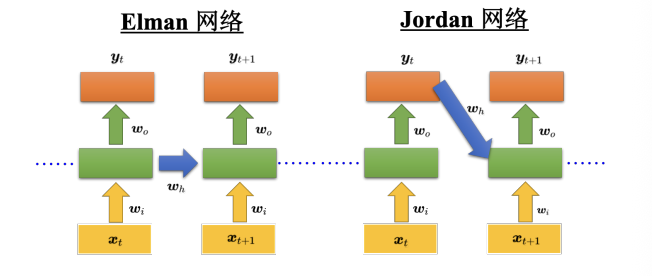

### 2. Bidirectional-RNN

Bi-RNN 由两个独立的 RNN 层组成，它们并行处理相同的输入序列：

- **正向隐藏层 (Forward Layer):** 按照 $x_1, x_2, \dots, x_n$ 的顺序读取，捕捉从过去到未来的上下文信息
- **逆向隐藏层 (Backward Layer):** 按照 $x_n, x_{n-1}, \dots, x_1$ 的顺序读取，捕捉从未来回到过去的上下文信息
- **输出层 (Output Layer):** 在每一个时间步 $t$，系统将正向网络和逆向网络的隐藏层状态（Hidden States）同时输入到输出层，合并产生最终结果 $y_t$

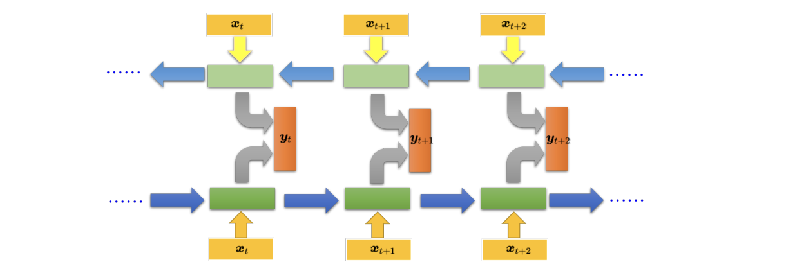

### 3. LSTM

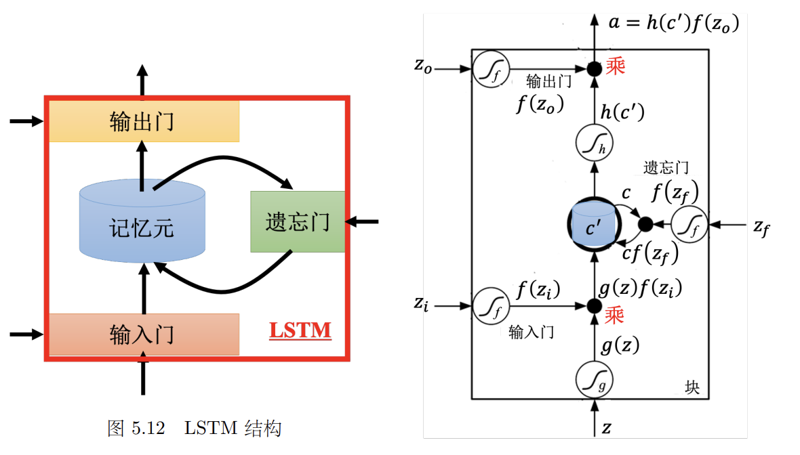

一个 LSTM 单元在每个时刻接收 4 个信号输入，最终产生 1 个输出 $a$：

1. **$z$：** 想要写入记忆元的新信息（候选值）
2. **$z_i$：** 控制**输入门** (Input Gate) 的信号
3. **$z_f$：** 控制**遗忘门** (Forget Gate) 的信号
4. **$z_o$：** 控制**输出门** (Output Gate) 的信号

所有门的开关程度都由 **Sigmoid 函数** $f(\cdot)$ 决定，输出值在 $0$ 到 $1$ 之间：

- **1** 代表完全打开（通过）；**0** 代表完全关闭（截断）

| **门控名称** | **对应信号** | **功能描述**                    | **直觉提醒**             |
| -------- | -------- | --------------------------- | -------------------- |
| **输入门**  | $f(z_i)$ | 决定当前时刻的新信息 $g(z)$ 是否能写入记忆元。 | 控制“进”                |
| **遗忘门**  | $f(z_f)$ | 决定记忆元中原有的值 $c$ 是否保留。        | **1=保留，0=遗忘**（与直觉相反） |
| **输出门**  | $f(z_o)$ | 决定更新后的记忆内容 $c'$ 是否能输出到外界。   | 控制“出”                |
**数学运算流程**
第一步 ：更新记忆元状态 $c'$
记忆元的新状态由“新输入”和“旧记忆”加权相加得到：

$$
c' = g(z)f(z_i) + cf(z_f)
$$

- $g(z)\cdot f(z_i)$：新信息 $\times$ 输入门开关程度
- $c\cdot f(z_f)$：旧信息 $\times$ 遗忘门保留程度
第二步：计算最终输出 $a$
将更新后的状态 $c'$ 经过处理后，通过输出门：

$$
a = h(c')f(z_o)
$$

- $h(c')$：对状态进行非线性变换
- $f(z_o)$：控制最终有多少信息能被“读”出来

??? example "LSTM 运算示例"

    
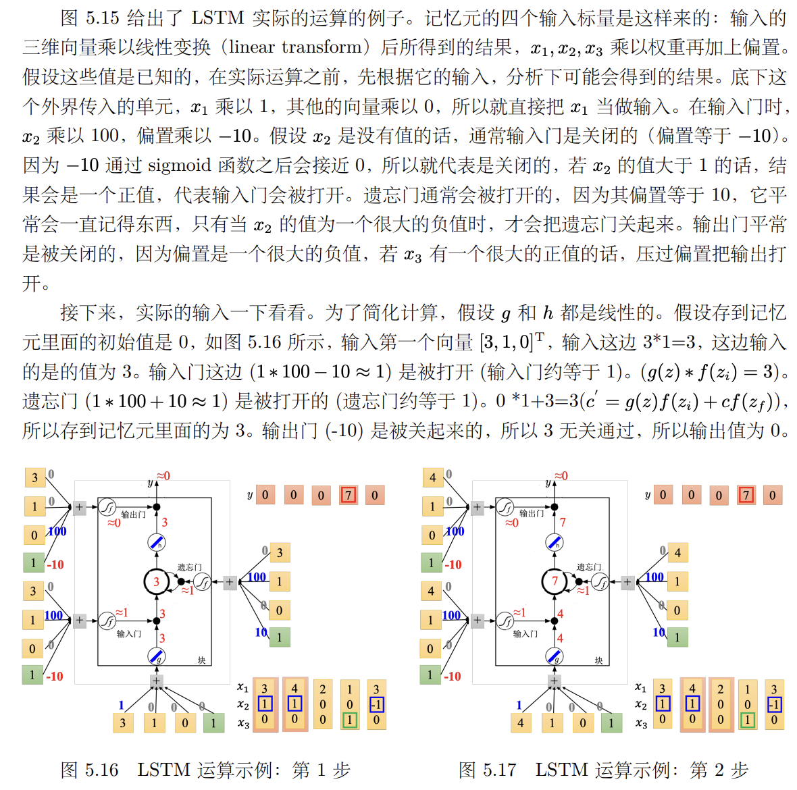

    
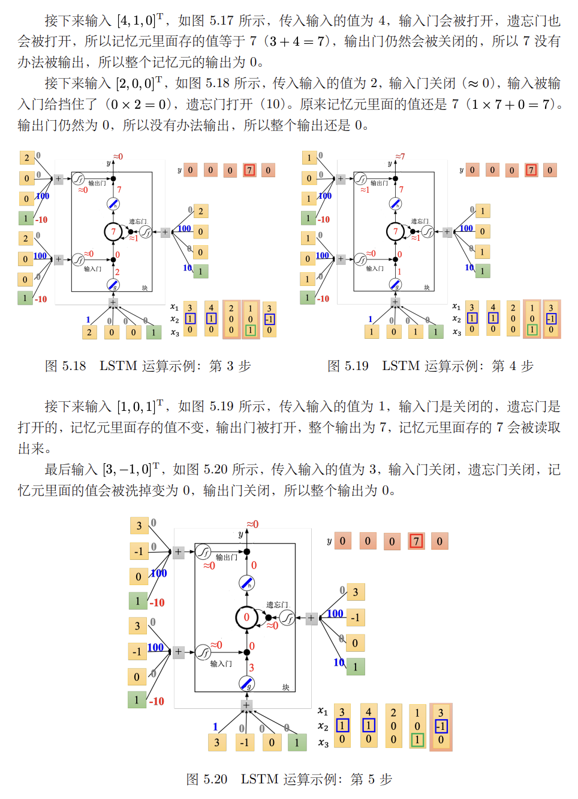

### 4. Principle of LSTM

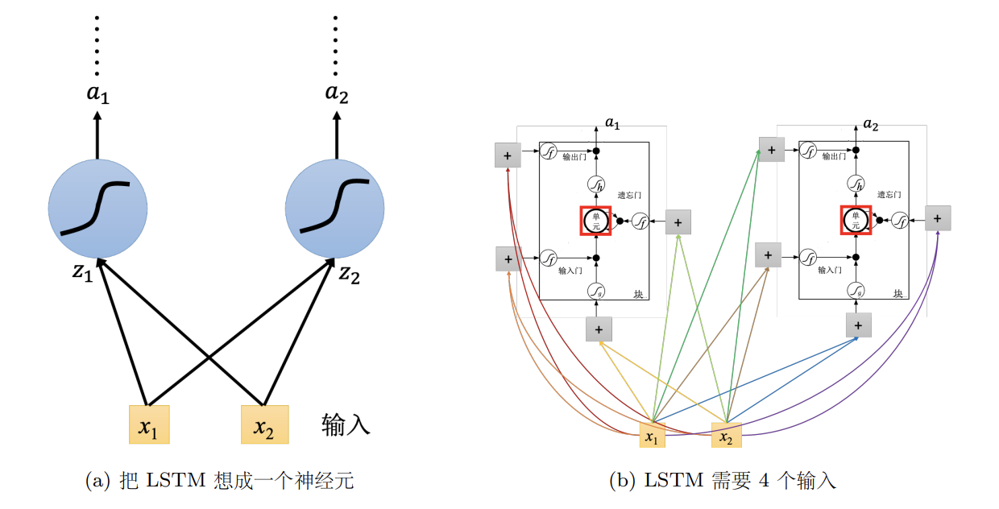

- 把 LSTM 当作一个神经元，将其替换原有的神经元即可
- 假设用的神经元的数量一样，LSTM 需要的参数量是一般神经网络的四倍

---

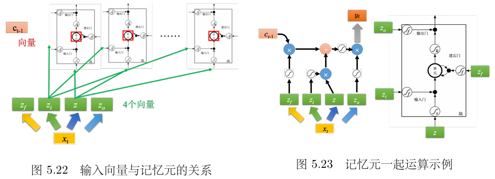

实际计算并不是一个一个处理 LSTM 单元，而是把整排 LSTM 看作一个**向量**

- **矩阵变换**：输入向量 $x_t$ 通过四个不同的线性变换（乘以四个矩阵），生成四个向量 $z, z_i, z_f, z_o$
- **维度对应**：这些向量的每一个维度，分别对应到这一排 LSTM 中的某一个具体单元
- **公式表达**（记忆元状态更新）：

$$
c_t = \sigma(z_f) \odot c_{t-1} + \sigma(z_i) \odot \tanh(z)
$$

    这里所有的运算都是**按元素相乘**，这意味着同一层内的记忆元是同时更新的

---

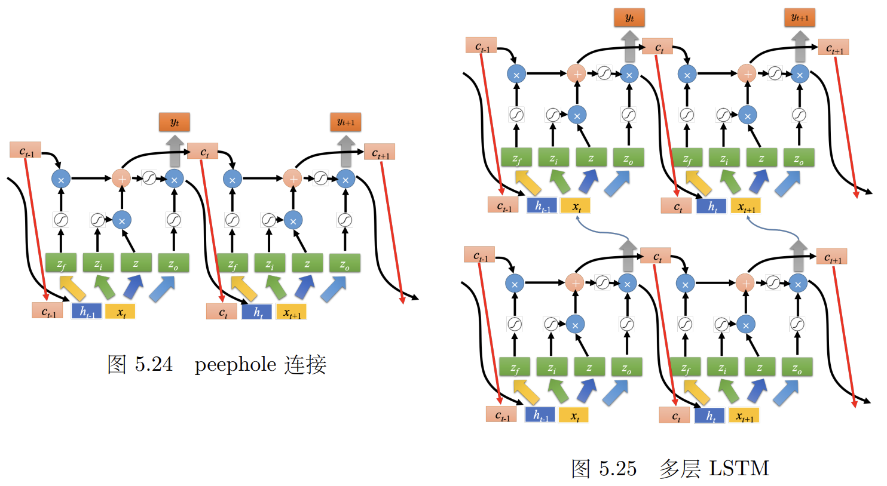

Peephole Connection：允许门直接查看记忆元内部的值 $c$

- 控制门的时候，同时参考 $x_t$（当前输入）、$h_{t-1}$（上一刻输出）和 $c_{t-1}$（旧记忆）
- 相当于把这三个向量拼在一起：$[x_t, h_{t-1}, c_{t-1}]$，然后再进行矩阵运算

门控循环单元（Gated Recurrent Unit，GRU）是 LSTM 的简化版本，它只有两个门。其性能跟 LSTM 差不多，少了 1/3 的参数，不容易过拟合。

---

## 5.5 How RNN Learns

> RNN is difficult to train

### Loss Function

对于句子中的每一个单词（即每一个时间点 $t$），需要计算模型输出 $y^t$ 与真实标签（参考向量）$\hat{y}^t$ 之间的**交叉熵（Cross-Entropy）**

- 假设槽（Slot）的总数量为 $N$，公式如下：

$$
l^t = -\sum_{i=1}^{N} \hat{y}_i^t \log(y_i^t)
$$

    - $\hat{y}_i^t$：真实标签在第 $i$ 个维度上的值（如果是“目的地”槽，则该维度为 1，其余为 0）
    - $y_i^t$：模型预测该单词属于第 $i$ 个槽的概率
- RNN 当前的状态依赖于之前的输入，所以不能孤立地看待每个单词。我们需要将整个序列（长度为 $T$）中所有时间点的损失累加起来，最终得到 loss：

$$
L = \sum_{t=1}^{T} l^t = -\sum_{t=1}^{T} \sum_{i=1}^{N} \hat{y}_i^t \log(y_i^t)
$$

### Gradient Descent

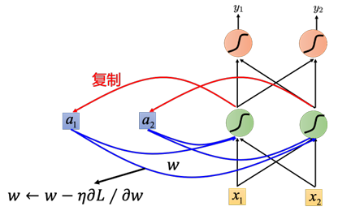

- 更新神经网络里的参数 $w$，就是计算关于 $w$ 的偏导数，使用梯度下降（$w \leftarrow \eta \frac{\partial{L}}{\partial{w}}$）
- CNN为了计算方便，在反向传播的基础上采用了**随时间反向传播（BackPropagation Through Time，BPTT）**

RNN 的训练曲线往往剧烈抖动

- 当参数位于平坦区域时，梯度很小，你可能会调大**学习率**以加快进度。
- 但如果梯度瞬间暴增，巨大的梯度乘以较大的学习率，会让参数更新步长过大，导致模型训练崩溃

!!! tip "梯度裁剪 (Gradient Clipping)"

    - **原理**：给梯度设置一个阈值
    - **操作**：如果计算出的梯度大于某个值（如 15），就强制让它等于 15。

---

## 5.6 Gradient Vanishing & Exploding

在普通的 RNN 中，每一时刻的记忆都会被新的输入**完全覆盖**或通过**乘法**不断累积

- **梯度消失**：如果权重小于 1，经过多次乘法，梯度会迅速趋近于 0，导致模型无法学习长距离的依赖关系
- **梯度爆炸**：反之，如果权重大于 1，梯度会瞬间膨胀，导致模型训练崩溃

LSTM 解决梯度消失的关键在于：**从“乘法”变为了“加法”**

- RNN：

$$
h_t = \sigma(W \cdot h_{t-1} + \dots)
$$

    - 旧记忆 $h_{t-1}$ 每次都要乘以权重 $W$，梯度在反向传播时也会连乘 $W$，极易消失。
- LSTM 的：引入Cell State：

$$
c_t = f_t \odot c_{t-1} + i_t \odot \tilde{c}_t
$$

    关键是**加号（+）**，梯度的传递是通过加法路径流动的。只要**遗忘门（Forget Gate）** $f_t$ 保持开启（接近 1），旧的记忆就能几乎无损地传递下去。

!!! note

LSTM **不能**直接解决梯度爆炸。由于 LSTM 的内部路径变得平滑，它的整体梯度可能会保持在较大的水平。因此，训练 LSTM 时通常需要：

> 1. 更小的学习率
> 2. 配合**梯度裁剪（Gradient Clipping）**

GRU 将 LSTM 的输入门和遗忘门合并为一个**更新门**。当它决定记住新的信息时，会自动清除旧的信息。

- **参数更少**：训练速度快，不容易过拟合。
- **性能相近**：在很多任务上，GRU 的表现与 LSTM 旗鼓相当。

**单位矩阵（Identity Matrix）初始化 + ReLU**

- 将 RNN 的转移权重 $W$ 初始化为单位矩阵 $I$，那么在没有任何输入的情况下，$h_t = h_{t-1}$
- 这意味着梯度在反向传播时，乘以的是 1，**梯度既不会消失也不会爆炸**。
- **对比**：
    - 通常 RNN 用 Sigmoid/Tanh，因为它们能把值限制在一定范围，防止爆炸，但极易导致消失
    - 配合单位矩阵初始化后，ReLU 性能会比较好

---

## 5.7 Other Applications

### Many-to-One Sequence

**关键术语抽取（key term extraction**）

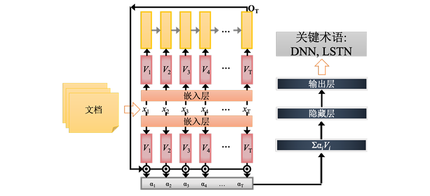

使用包含<u>文档序列及其对应词级标签</u>（Ground Truth）的数据集来训练模型

1. **输入表示与特征嵌入**
   将文档序列作为输入，输入数据经过**嵌入层**处理，完成词嵌入
2. **序列编码与上下文提取**
   嵌入向量序列被送入 RNN，在处理完整个文档序列后，提取**最后一个时间步的隐藏层状态**。该状态向量被视为<u>整个输入序列的聚合表示</u>，蕴含了文档的全局语义信息。
3. **注意力机制与分类输出**
   经过注意力加权后的特征向量随后被送至**前馈神经网络**，最终通过输出层得到结果

### Many-to-Many Sequence

**语音识别（speech recognition）**
一般处理声音信号的方式：每隔一小段时间选取一段声音信号，并用用向量表示。

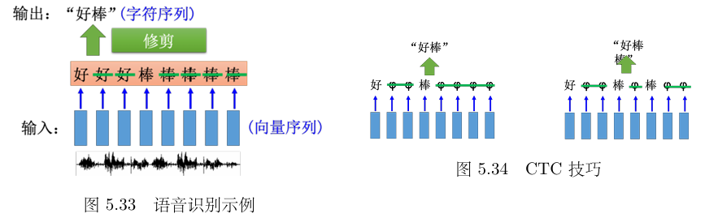

- 两个输入的时间间隔很小，会造成**多个向量对应到同一个字符**
- 识别结果为“好好好棒棒棒棒棒”
- 对结果采用==修剪（trimming）==，即去重，最终得到“好棒”。但这样会有一个严重的问题，因为它没有识别“好棒棒”。

!!! tip "solution: CTC"

    引入占位符：**Null（记作 $\phi$ 或 Blank）**，作为“分隔符”和“填充物”

    假设输入是一段音频，模型在每一个时间点都会给出一个概率分布。可以从中选出一条得分最高的路径。

    - **原始路径：** H H $\phi$ I I I $\phi$ S
    - **第一步（去重）：** H $\phi$ I $\phi$ S
    - **第二步（去空）：** H I S（删掉所有的 $\phi$）

    最终得到的 `HIS` 就是识别结果。这种机制让模型不需要知道 "H" 具体是在第几毫秒结束的，它只需要在合适的时候“跳”出那个字符即可。

### Sequence-to-Sequence

Seq2Seq 的核心架构分为两部分：

- **编码阶段 (Encoder)**：
    - RNN 读入整个输入序列（如“机器学习”）
    - **关键点**：在最后一个时间点，RNN 的**记忆元 (Memory Cell)** 或隐藏层向量会存储整个输入序列的“语义精髓”
- **解码阶段 (Decoder)**：
    - 从编码器的最终状态开始，机器逐个“吐出”字符
    - **自回归属性**：将当前时间点生成的字符作为下一个时间点的输入，循环往复，直到生成结束

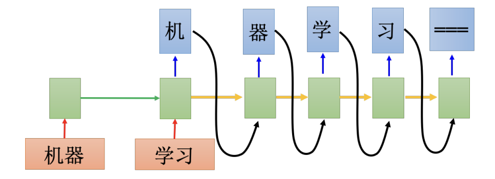

**断句符号 (Stop Token)**
为了防止机器无限制地生成字符，模型必须学会**何时停止**

- **方法**：在词表中加入一个特殊的“断”符号（如 `===` 或 `<EOS>`）。
- **逻辑**：如果模型预测下一个符号是“断”，则停止解码过程。这一机制通过训练数据自动习得。
