# Chapter6. Self-attention

## 6.1 Vector Set as Input

### Text

- 为了让计算机处理文字，必须先将词汇转化为向量：

 **独热编码 (One-hot Encoding)**

- 维度等于词典大小，对应位置为 1，其余为 0
- 语义关联**无**，任何两个词的距离都相等（正交）

**词嵌入 (Word Embedding)**

- 将词映射到一个低维的实数连续向量空间
- 语义关联**强**，语义相近的词（如猫、狗）在空间中靠得更近

### Sound

语音是连续的波形，不能直接丢给模型。处理方式是：

1. **取窗 (Windowing)：** 截取一段极短的时间（如 **25 ms**），这一段被称为一“帧”
2. **步长 (Stride/Hop)：** 窗口每次向右移动一小段距离（如 **10 ms**）
3. **向量化：** 每一帧通过特征提取变成一个向量

### Graph

Graph is also a set of vectors (consider each **node** as a **vector**)

- 与文本序列不同，图结构中的向量之间存在**复杂的连接关系**，而不仅仅是前后的顺序关系

---

## 6.2 What is the output？

- Each vector has a label. (focus of this chapter)

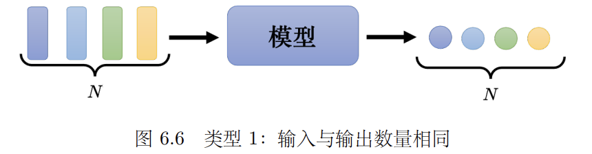

- The whole sequence has a label.

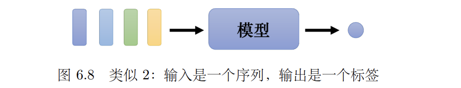

- Model decides the number of labels itself. ==seq2seq==

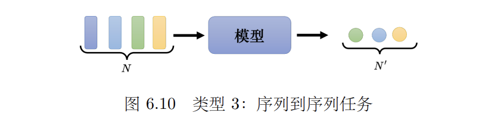

---

## 6.3 Self-attention Model

- 读入整个序列的数据，输入向量的数量**等于**输出向量的数量

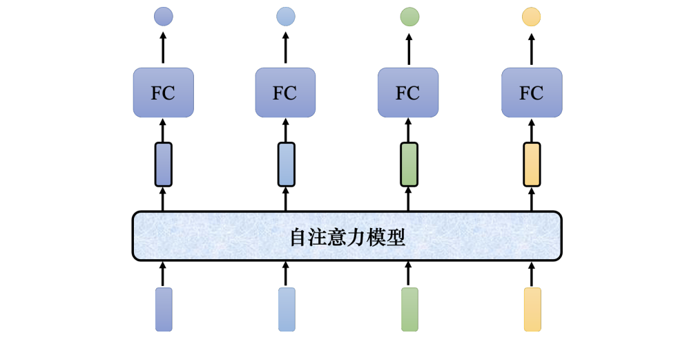

**内部结构**：

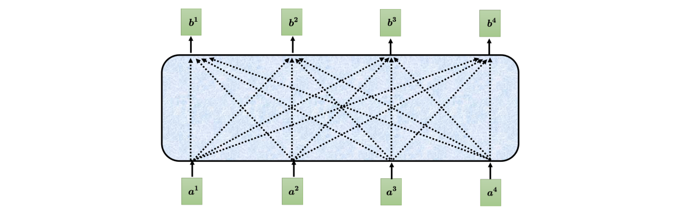

- $a^1、a^2、a^3、a^4$ 可能是整个网络的输入，也可能是某个 hidden layer的输出
- $b^1、b^2、b^3、b^4$ 是考虑整个输入的序列 $a^1、a^2、a^3、a^4$ 产生出来的

### How to calculate?

流程图如下：

 
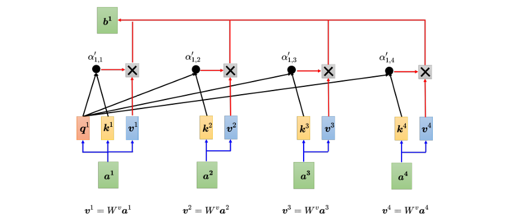

首先计算向量间的关联程度，用 $\alpha$ 表示两个向量之间的关联程度

- 采用**Dot-product**（点乘）计算两个向量的内积
假设计算 $a^i$ 和其他向量 $a^j (j=1,2,\dots)$ 的关联程度，首先得到： 

$$
q^i=W^q a^i,\quad k^j=W^k a^j\quad(j=1,2,\dots)
$$

然后计算得出：

$$
\alpha_{i,j}=q^i \cdot k^j \quad(j=1,2,\dots)
$$

最后通过 softmax，得到:

$$
\alpha'_{i,j} = \frac{\exp(\alpha_{i,j})}{\sum_k \exp(\alpha_{i,k})}
$$

!!! info

    除了点积之外，还可以采用**相加(Additive)**计算

    $$
    \alpha_{i,j} =  W \tanh( W^q a^i +  W^k a^j)
    $$

将所有的 $a^i$ 乘上一个矩阵 $W^v$，得到 $v^i = W^v a^i$，最终

$$
b^i = \sum_j a'_{i,j}v^j
$$

- 和 $a_i$ 关联性最大的向量对结果 $b^i$ 的影响最大
- $b^1$ 到 $b^n$ 的结果是并行 (parallel)计算得出的

!!! tip "Parallel"

    
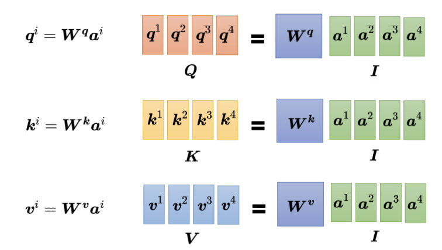

    - 只有 $W^q,W^k,W^v$ 是需要学习的参数

    
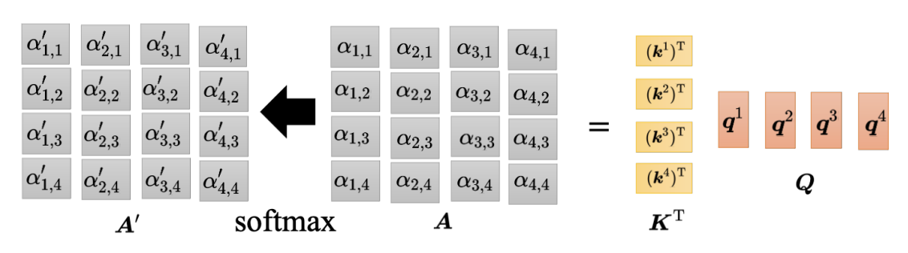

    - $A'$ 被称为 Attention Matrix

    
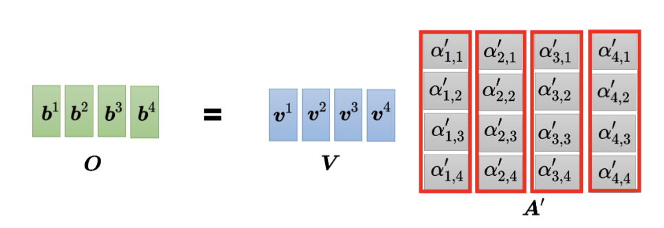

---

## 6.4 Multi-head Self-attention

- 通常使用多个 $q$ 来捕捉不同种类的相关性，计算方式和之前相同
- 然后乘上一个矩阵得到最终的 $b^i$:

$$
\boldsymbol{b^i} = \boldsymbol{W^O} \begin{bmatrix} \boldsymbol{b^{i,1}}  \\ \boldsymbol{b^{i,2}}  \\ \vdots \end{bmatrix}
$$

| 计算 $b^{i, 1}$                                                       | 计算 $b^{i, 2}$                                                       |
| ------------------------------------------------------------------- | ------------------------------------------------------------------- |
| 
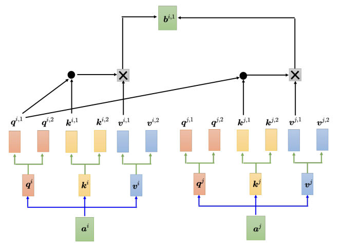
 | 

 |

---

## 6.5 Positional Encoding

- No position information in self-attention
- Each position has a unique positional vector $e^i$
    - 给每个 $a^i$ 加上一个 $e^i$ 后再计算
- **hand-crafted**
    - 在原始的Transformer论文中，位置编码是使用正弦和余弦函数公式计算出来的
    - 目前仍在研究各种不同的位置编码

---

## 6.6 Truncated Self-attention

在做语音识别时，处理声音信号后可能会得到一个很长的向量。

- 在做自注意力的时候，有时没有必要让自注意力考虑一整个句子，只需要考虑一个小范围就好，这样就可以加快运算的速度

---

## 6.7 Self-attention & CNN

A image can also be considered as a **vector set**.

- 一张分辨率为 5 × 10 的图像可以表示为一个大小为 5 × 10 × 3 的张量，3 代表 RGB 这 3 个通道（channel），每一个位置的像素可看作是一个三维的向量，<u>整张图像是 5 × 10 个向量</u>

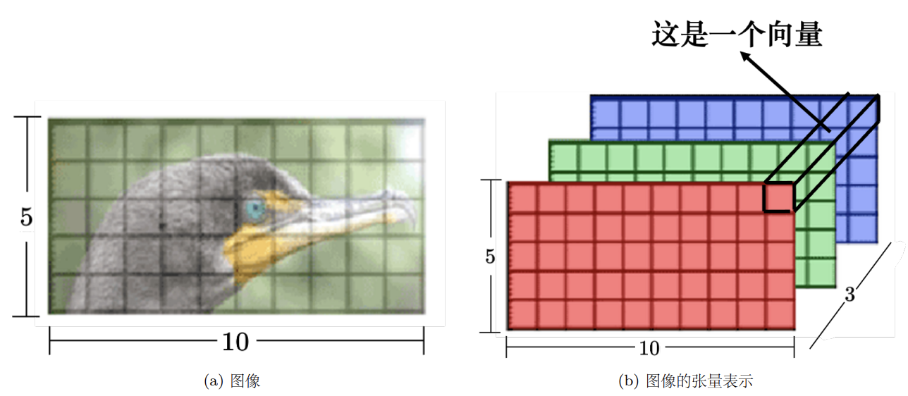

CNN: self-attention that can only attends in a receptive field.

- 感受野是人为划定的因素
Self-attention: CNN with learnable receptive field
- 感受野是机器自己学习出来的

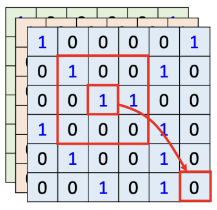

- 论文 “On the Relationship between Self-attention and Convolutional Layers” 用数学的方式严谨地告诉我们，**卷积神经网络就是自注意力的特例**。

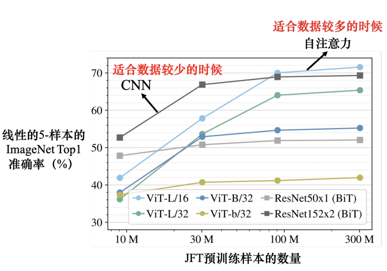

---

## 6.8 Self-attention & RNN

**RNN局限性**：

- 长距离依赖困难：如果最右边的输出需要考虑最左边的输入，必须依靠记忆机制一路传递。如果记忆丢失，信息就会“遗忘”
- 无法并行化：计算第 $n$ 个输出必须等待第 $n−1$ 个输出的结果，导致训练速度慢

**Self-attention优势**：

- 全局视野：序列中的每一个向量在产生时都考虑了整个输入序列（无论距离多远）。“天涯若比邻”，不需要像 RNN 那样一步步传递记忆。
- 高度并行化：所有输出向量是同时并行产生的。计算第 $n$ 个向量不需要等待前一个结果，因此在处理速度和效率上远超 RNN

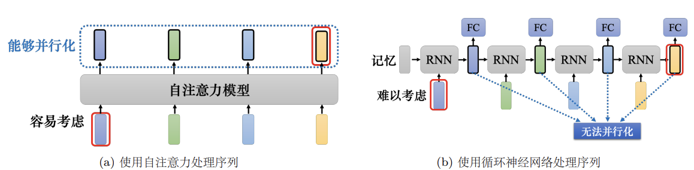

**Self-attention for Graph**

- Consider **edge**: only attention to connected nodes
- This is one type of ==Graph Neural Network (GNN)==

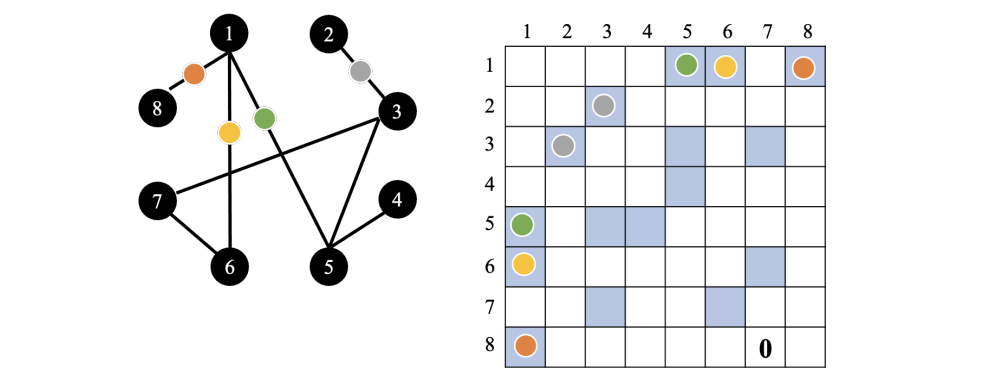

