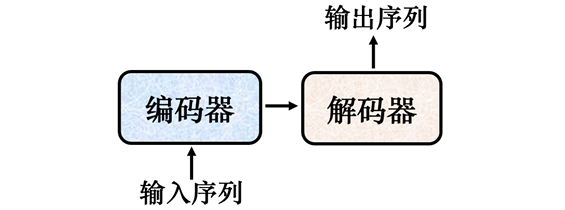
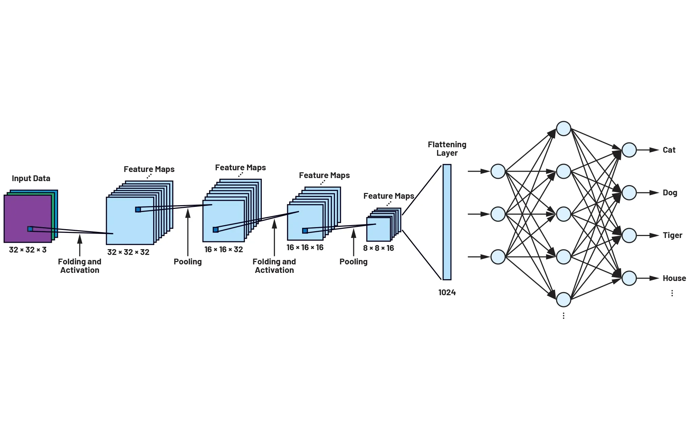
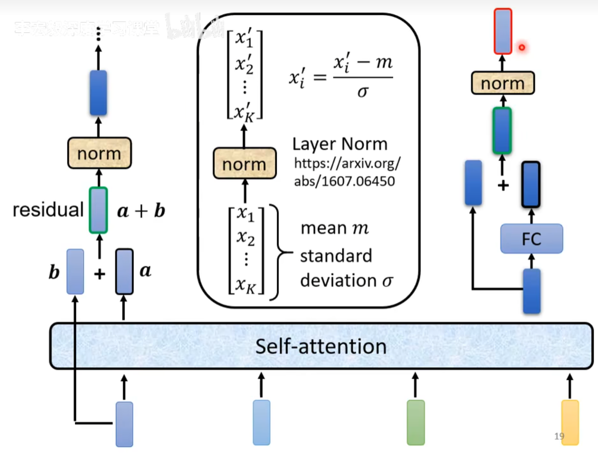
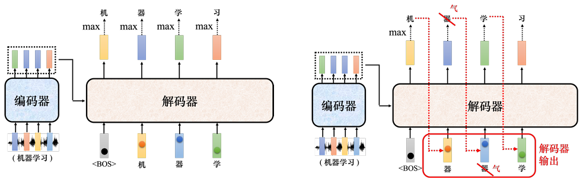
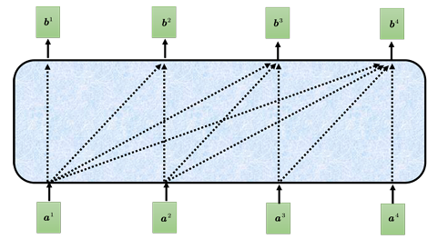
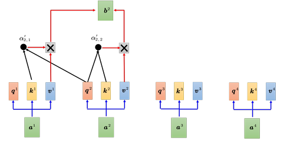
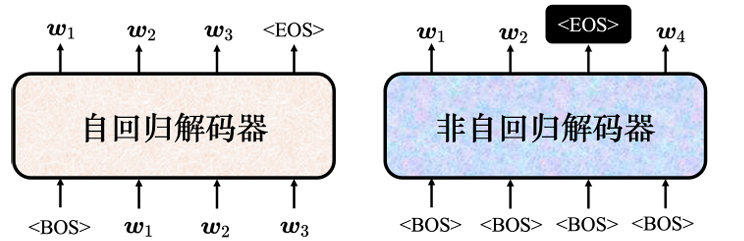
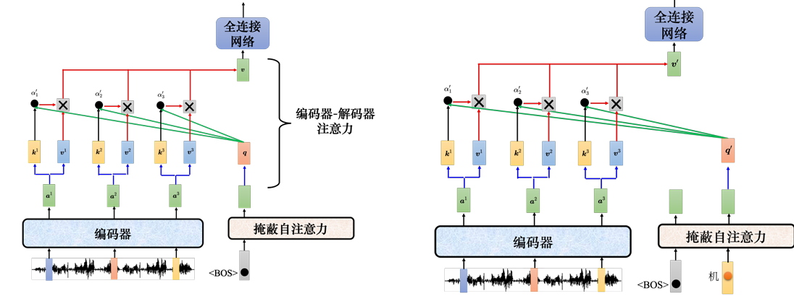
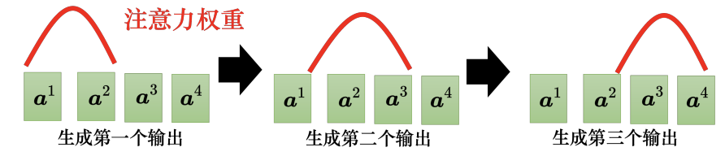
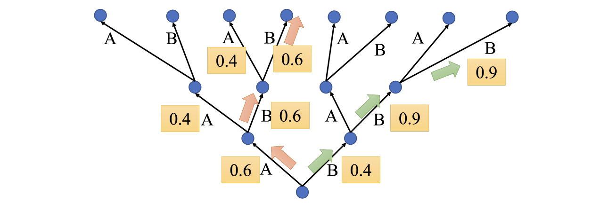

# Chapter7. Transformer

## 7.1 Seq2Seq Model

Input a sequence, output a sequence. The output length is determined by model.

- **编码器 (Encoder)**：
  读取并理解整个输入序列，在处理完所有输入后，编码器将整个序列的语义信息“压缩”成一个固定维度的向量。
- **解码器 (Decoder)**：
  接收编码器生成的上下文向量，并以此为初始状态，开始逐个生成目标序列。在每一步，解码器会根据当前的状态和上一步生成的词，预测下一个最有可能出现的词。这个过程会一直持续，直到生成一个特殊的结束标记。

---

## 7.2 Transformer

### 7.2.1 Encoder

原始的 Transformer 中关于 ==Encoder== 内部的计算机制：

1. Input 的内容先通过 **multi-head attention**
2. 再进行**残差连接（residual connection）**，即 self-attention 的输出和输入相加，得到新的向量  
3. 新生成的向量进行**层归一化（layer normalization）**
4. 归一化后的向量通过 **fully connected network**
5. 得到的结果再进行 residual connection 以及 layer normalization
6. 最后的结果即为 output

### 7.2.2 Decoder

#### Autoregressive Decoder

此处介绍常见的 Decoder 类型为==自回归（autoregressive）解码器==

- 要让 decoder 产生输出，输入一个特殊符号\<BOS\>表示开始，即 Begin Of Sequence
- 要让 decoder 停止运作，需要输出一个特别的符号\<EOS\>表示结束，即 End Of Sequence
- 输入向量采用 one-hot 编码，然后经过 softmax 处理，作为 decoder 的输入
- 输出向量表示每一个字作为下一个字出现的概率

!!! info "Masked self-attention"

    对 decoder而言，在计算 $b_n$ 的时候，$a_{n+1}, a_{n+2},\dots$ 还未得出，因此只能考虑其**左边的数据**

    | 掩蔽自注意力示例                                                            | 掩蔽自注意力具体计算过程                                                         |
    | ------------------------------------------------------------------- | -------------------------------------------------------------------- |
    | 

 | 

 |

#### Non-autoregressive Decoder

==非自回归（autoregressive）解码器==是直接输入一整个序列，然后一次性输出结果。

How to decide the output length for NAT decoder?

1. Another predictor for output length (e.g. 分类器classifier)
2. Output a very long sequence, ignore tokens after END

### 7.2.3 Encoder-Decoder Attention

==Cross-attention（交叉注意力机制）==是连接编码器跟解码器之间的桥梁

- Encoder 中的最终输出向量和矩阵 $W_k$ 和 $W_v$ 相乘，作为 $\boldsymbol{k}$ 和 $\boldsymbol{v}$
- Decoder 中的向量在经过 masked self-attention，residual connection 和 normalization 后，和矩阵 $W_q$ 相乘，作为 $\boldsymbol{q}$
- 三者再次进行 attention 的计算，这就是 cross-attention 计算的全过程

---

## 7.3 How to train transformer

衡量标准：**交叉熵 (Cross Entropy)**

* 每一次输出都会计算模型预测的概率分布与标准答案（独热向量）之间的交叉熵
* 训练目标：让所有输出的**交叉熵总和最小**

!!! note "Teacher Forcing"

    Use the <u>ground truth</u> as the input of decoder

    - 在训练 Decoder 时，不把模型自己预测（可能出错）的结果作为下一次的输入，而是直接把 **标准答案（Ground Truth）** 作为下一次的输入
    - 这样可以让模型在训练初期更稳定、更快速地学习，因为它总是基于正确的上下文来进行下一步预测

### 7.3.1 Copy Mechanism

**复制机制（copy mechanism）**：让模型直接从 input 中“复制”部分信息作为 output

- 有效解决了未登录词的问题，即在训练数据中从未出现过、模型无法生成的罕见词汇
- 通过指针网络（pointer network）或复制网络（copy network）等技术，模型可以在生成摘要的过程中，动态决定是从自身的词汇表中生成新词，还是将输入文本中的特定片段直接“复制”过来

### 7.3.2 Guided Attention

!!! bug

    在标准的模型训练中，模型有时会学到一些莫名其妙的行为，导致输出结果不可用。

    - **漏字现象**：在语音合成中，输入“发财”，模型可能只输出了“财”，把“发”给漏了
    - **原因**：这通常是因为训练数据中这种极短的样本很少，模型没能学会如何处理

**引导注意力(Guided Attention)**

- 利用我们对任务本身的先验知识，（比如语音合成必须从左读到右），强制规范模型的注意力走向，防止模型“跳字”或“乱序”，从而保证输出的完整性和准确性。

### 7.3.3 Beam Search

- The red path is Greedy Decoding.
- The green path is the best one. 

!!! bug

    在论文 “[The Curious Case Of Neural Text Degeneration](https://arxiv.org/abs/1904.09751)”中指出，在做**完成句子**（sentence completion，机器先读一段句子，然后输出句子的后半段）的任务时，如果用束搜索，模型会不断输出重复的话。
    Randomness is needed for decoder when generating sequence in some tasks (e.g., sentence completion, TTS)

### 7.3.4 Optimizing Evaluation Metrics

在序列生成任务（如机器翻译）中，存在一个显著的矛盾：

- **测试时：** 使用 **BLEU 分数**，在生成**完整句子**后，与标准答案进行整体比较得出的质量评分
- **训练时：** 使用 **交叉熵损失**。它是针对**每一个词汇**单独计算并最小化误差。

一个直观的想法是：直接将损失函数设为 `-BLEU`，通过最小化 loss 来最大化 BLEU。但 BLEU 分数的计算过程涉及离散操作，是**不可微**的。因此无法使用标准的反向传播算法来计算梯度并更新模型参数。

!!! note "solution"

    为了解决不可微优化问题，引入强化学习框架：

    - **角色定义：** 将**解码器**视为强化学习中的**智能体**。
    - **机制转换：** 将原本无法微分的**损失函数**转化为强化学习的**奖励**。
    - **原理：** 通过智能体与环境交互产生的奖励信号来指导模型训练，从而绕过梯度无法回传的问题，直接优化序列级别的指标。

### 7.3.5 Scheduled Sampling

训练时，解码器输入的是标准答案；测试时，输入却是模型“自己生成”的输出。

- 这会产生**曝光偏差（Exposure bias）**。由于模型在训练中从未见过错误输入，一旦测试时生成一个错误词，就会产生连锁反应，影响输出结果。
- 可以在训练阶段的 input 中混入一些错误输出，让模型具备更强的鲁棒性
