# Chapter8. Generative Model

## 8.1 Generative adversarial network

### 8.1.1 Generator

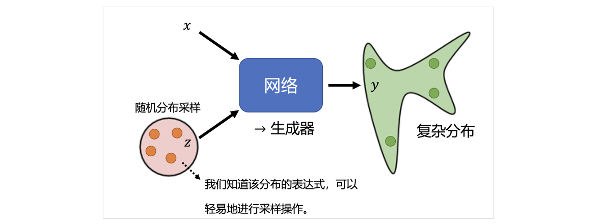

==生成器（generator）==：将随机变量 $z$ 与原始输入 $x$ 一同输入到模型中，其中变量 $z$ 是从随机分布中采样得到

- 随机分布的要求："Simple Distribution"，即知道分布的表达式

!!! question "Why distribution？"

    The same input has different outputs. **Especially for the tasks need "creativity".**

    
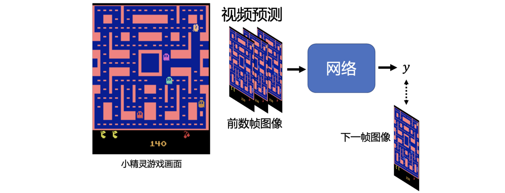

    在训练模型预测游戏的下一帧图像时，模型会同时学习左转和右转的数据，并试图用一个唯一的答案拟合所有数据，这会导致模型在输出时表现为“同时向左和向右转”
    **结果**：<u>向左走的像素 + 向右走的像素 -> 中间的模糊重影 / 角色看起来像是静止不动甚至消失</u>

    在引入 $z$ 后输出逻辑发生变化：$y=f (x, z)$，给定 $x$ ，配合不同的 $z$ ，可以输出不同的 $y$

### 8.1.2 Discriminator

在 GAN 的架构中，还需要一个用来判断图片质量的==判别器（Discriminator）==

- 它通常是一个神经网络（CNN 或者 Transformer）
- 输入与输出：
    - 输入：一张图片（可能是真实的，也可能是生成的）
    - 输出：一个标量数值（数值越大代表图片越像真实的）

!!! info "Why called &quot;adversarial&quot;?"

    这是 2014 年 Ian Goodfellow 提出的概念。之所以叫“对抗”，是因为我们将这两个网络拟人化为敌人：

    - **生成器（generator）**试图最小化判别器的成功率（让判别器把假图当真图）
    - **判别器（discriminator）**试图最大化自己的成功率（准确区分真假）

---

## 8.2 How to train

- Initialize generator and discriminator
- In each training iteration:
    1. Fix generator $G$, and update discriminator $D$
       Discriminator learns to assign high scores to real objects and low scores to generated objects
    2. Fix discriminator $D$, and update generator $G$

    
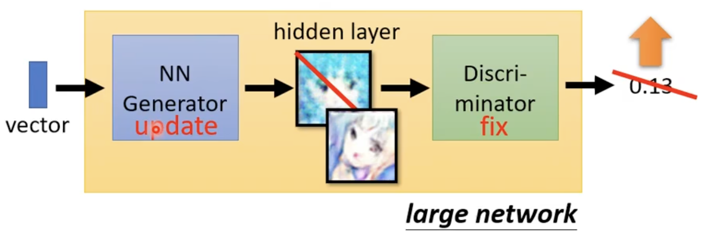

        Generator learns to "fool" the discriminator

    3. Repeat training generator and discriminator

---

## 8.3 Theory behind GAN

GAN 的目标：让生成的数据分布 $P_G$ 尽可能接近真实的数据分布 $P_{\text{data}}$

$$
G^*=\arg{\min_G{Div(P_G,P_{data})}}
$$

- 本质：不是生成单个样本，而是**学习整个数据分布**

理论上，如果想让两个分布接近，需要定义一个““距离”来评估 divergence, 但：

- 真实图片分布非常复杂，生成器产生的分布也非常复杂；
- 往往只能采样（sample），无法直接写出解析公式；
所以很难直接计算差异，**GAN 不直接算分布差异，而是用判别器（Discriminator）间接估计差异**

!!! abstract "训练 Discriminator"

     训练 Discriminator过程的数学表达式如下：

    - **Training**：

    $$
    D^*=\arg{\max_D{V(D,G)}}
    $$

    - **Object function** for $D$:

    $$
    V(D,G)=E_{y\sim P_{data}}[\log{D(y)}] + E_{y\sim P_G}[\log{(1-D(y))}]
    $$

        - 从 $P_{data}$ ​中采样 $y$，并计算 $\log D(y)$，然后**取平均值**
        - 从生成数据分布 $P_{G}$ ​ 中采样 $y$，并计算 $\log (1-D(y))$，然后**取平均值**
        - 理想情况近似于**数学期望**，$E_{y∼P}​[f (y)]=\int f (y) P (y) dy$

    !!! info "Object function"

        $V (D, G)$ 本质上是在**最大化负交叉熵**，这个行为和**最小化交叉熵损失**等价。
        因此，训练 Discriminator 的目标和 binary classifier（最小化交叉熵）完全一样。

        当判别器训练到<u>最优</u>时，Object function 其实和 **JS 散度(Jensen-Shannon Divergence)** 有关
        The maximum objective value is related to JS Divergence

        Divergence 的计算方式有多种，可以参考 [f-GAN 的论文](https://arxiv.org/abs/1606.00709)

因此，最终的式子可以写成

$$
G^*=\arg{\min_G{\max_D{V(D,G)}}}
$$

生成器需要寻找合适的参数，使得 divergence 最小

---

## 8.4 WGAN

!!! bug "JS divergence 在 GAN 训练早期会失灵"

    In most cases, $P_G$ and $P_{data}$ are not overlapped.

    1. The nature of data
       Both $P_{data}$ and $P_G$ are low-d manifold in high-dim space. The overlap can be ignored.
    2. Sampling
       Even though $P_{data}$ and $P_G$ have overlap. If you do not have enough sampling ......

     如果两个分布没有重叠，JS 散度计算出的值永远是 $\log 2$

     判别器此时很容易区分真样本和假样本，但这并不代表生成器学到了什么，反而意味着：
     <u>判别器太强；生成器拿不到有效梯度；训练容易停滞、不稳定</u>

==Wasserstein distance==，又叫 **Earth Mover’s Distance（推土机距离）**

- 可以把分布想成两堆土：
    - P：一堆土现在在这里
    - Q：目标是把这堆土搬成另一种形状，放到那里
- 那 Wasserstein 距离就是：**把 P 变成 Q 所需要付出的最小“搬运成本”**
    - Using the "moving plan" with <u>the smallest average distance</u> to define the distance

Evaluate<u> Wasserstein distance</u> between $P_{data}$ and $P_G$

$$
\max_{D\in1-Lipschitz }\{  E_{y\sim P_{data}}[D(y)] - E_{y\sim P_G}[D(y)]  \}
$$

- **1-Lipschitz**：确保函数足够平滑，同时斜率不能太夸张（否则会出现极端情况）

!!! question "How to satisfy 1-Lipschitz ?"

    1. Original WGAN: weight
    每次更新完判别器参数后，强行把参数裁剪到某个区间里
    2. Improved WGAN: gradient penalty
    在 data 和 G 中各取一个点做插值，取一个中心点，让它的梯度范数接近 1
    3. Spectral Normalization (SNGAN): keep gradient norm smaller than 1 everywhere

---

## 8.5 Training GAN

**Why GAN is hard to train?**

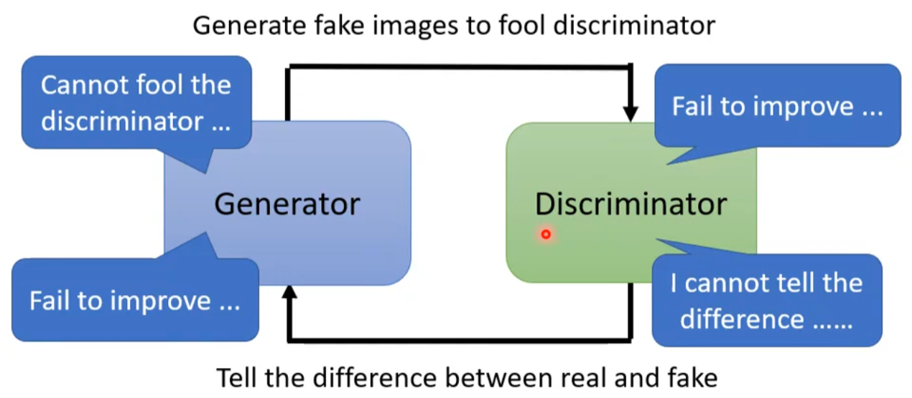

- 两个网络是绑在一起成长的：
    - 判别器学得好，生成器才知道该往哪改
    - 生成器学得好，判别器才有有挑战性的假样本可学
- 只要其中一方出问题，另一方也会跟着出问题

!!! bug "GAN for sequence generation"

    
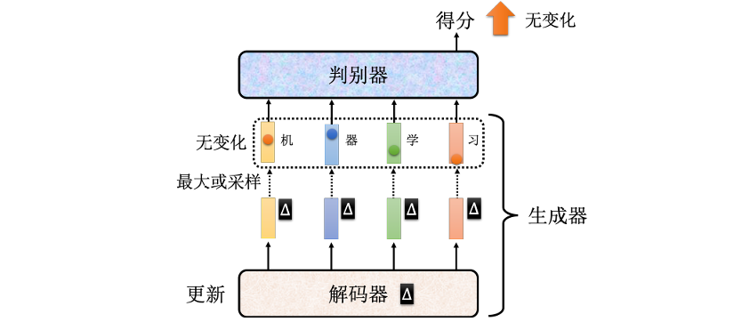

    - 文字生成会遇到一个严重的问题：**离散输出导致梯度传不回去**
        - 生成器参数发生微小变化，但最终输出没变，<u>很难得到平滑的梯度</u>
        - 因此不能像图像 GAN 那样依靠靠反向传播训练生成器
    - [ScratchGAN](https://arxiv.org/abs/1905.09922)：通过调节超参数，以及一些训练技巧，就可以不需要预训练，从随机的初始化参数开始训练生成器，最终得到可以产生文字的生成器。

---

## 8.6 Evaluation of Generation

### Quality

Quality of image:

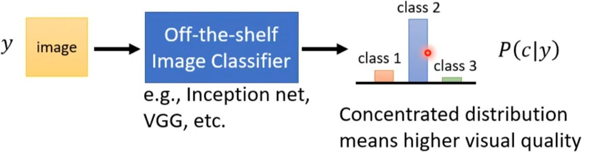

- 将生成内容传输到一个现有的分类器中，观察结果的分布状况

### Diversity

**Mode Collapse**

- 生成器虽然能生成“看起来不错”的图片，但来来回回只会生成少数几种图片

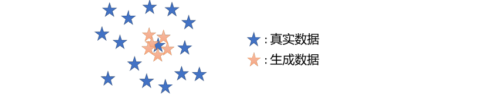

**Mode Dropping**

- 生成器能覆盖真实分布的一部分，但覆盖不了全部

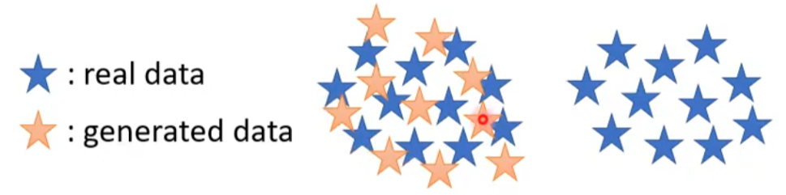

### Evaluation

**Inception score (IS)**:

- Good quality, large diversity -> Large IS

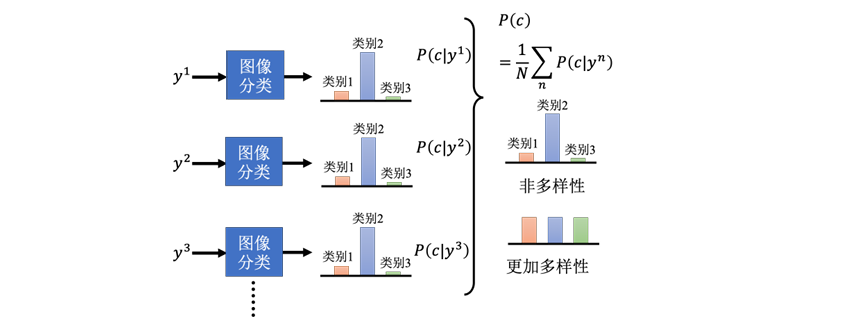

- 看**单张图**时，希望分类结果**越集中越好**
- 看**一批图**时，希望平均后的类别分布**越分散越好

**Fréchet Inception Distance (FID)**

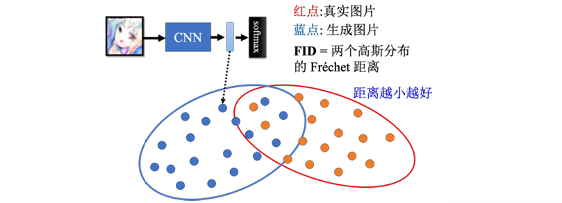

1. 把真实图片送进 Inception 网络
2. 取 softmax 之前的一层隐藏向量，当作图片特征
3. 把生成图片也送进去，取同样的特征
4. 于是得到两堆高维特征点：真实图片和生成图片
5. 假设这两堆特征分别近似服从高斯分布
6. 计算这两个高斯分布之间的 Fréchet Distance，得到 FID 分数

!!! bug

    假设生成器没有真正学会“生成新图”，而只是把训练集图片背下来了，或者再次基础上做调整。那它输出的图和真实数据分布会非常像，FID 可能会很低，看上去很好。
    但这其实不是真正意义上的生成，**本质上还是在“抄**”，但简单检测未必抓得出来。

---

## 8.7 Conditional Generation

**Text-to-image（文生图）**

- 额外给生成器一个条件 $x$，得到 $(x, z) \rightarrow G \rightarrow y$ 
- 其中 $x$ 是人为给的条件；$z$ 是随机性来源；$y$ 是生成结果

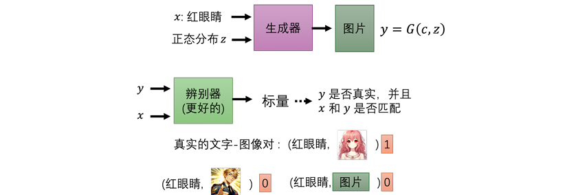

- 如何得到 $x$ ：将一段文字作为 RNN / Transformer 编码器的输入，将得到向量作为生成器的输入 
- 训练数据：需要额外加入<u>负样本（真实图片 + 错误条件）</u>，让判别器学会检查“是否和条件匹配”

**Image-to-image translation（图像翻译，pix2pix）**

- 如果只用普通监督学习，常常会得到“平均正确但视觉上模糊”的结果
- 如果只用 GAN，图片可能很真实，但不会忠于输入的条件
- GAN + supervised learning 可以获得更好的结果

---

## 8.8 Cycle GAN

传统的监督学习需要成对的数据，但在现实中，获取这类数据成本极高或根本不存在。

- **目标：** 在只有 $x$ domain 和 $y$ domain 的独立样本集，而没有一一对应关系的情况下，训练网络实现从 $x$ 到 $y$ 的转换
- **普通 GAN 的局限性：** 如果只使用一个生成器 $G$ 和一个判别器 $D$，生成器可能会为了“骗过”判别器而忽略输入 $x$ 的特征，输出一张与输入完全无关但符合 $y$ 域分布的图片。

为了强化输入与输出之间的联系，CycleGAN 引入了**循环一致性（Cycle Consistency）**

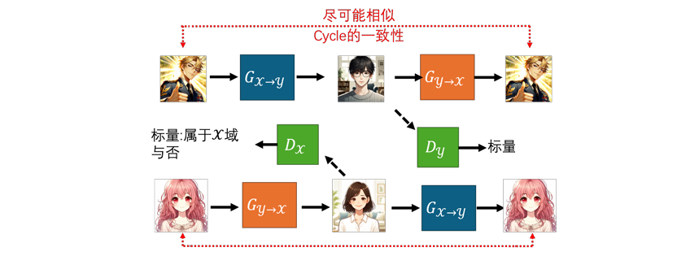

1. **网络架构**
   CycleGAN 实际上由两套 GAN 组成，包含三个核心组件（双向训练时为四个）：
    - **生成器 $G_{X \to Y}$：** 学习将 $x$ 域图片转换为 $y$ 域
    - **生成器 $G_{Y \to X}$：** 学习将 $y$ 域图片还原回 $x$ 域
    - **判别器 $D_Y$：** 判断图片是否属于 $y$ 域
    - **判别器 $D_X$（双向时）：** 判断图片是否属于 $x$ 域
2. **循环一致性原理**

$$
x \xrightarrow{G_{X \to Y}} \hat{y} \xrightarrow{G_{Y \to X}} \hat{x}
$$

- 经过两次转换后的输出 $\hat{x}$ 必须与原始输入 $x$ <u>尽可能接近</u>（即两者的向量距离最小化）
- 这迫使生成器 $G_{X \to Y}$ 在转换风格时必须保留原始输入的重要特征，否则第二个生成器将无法还原
- **网络“懒惰”特性：** 在实际训练中，神经网络倾向于寻找最简单的转换路径。为了满足循环一致性，它通常只改变风格（如纹理、颜色），而保留原始图片的几何结构。
