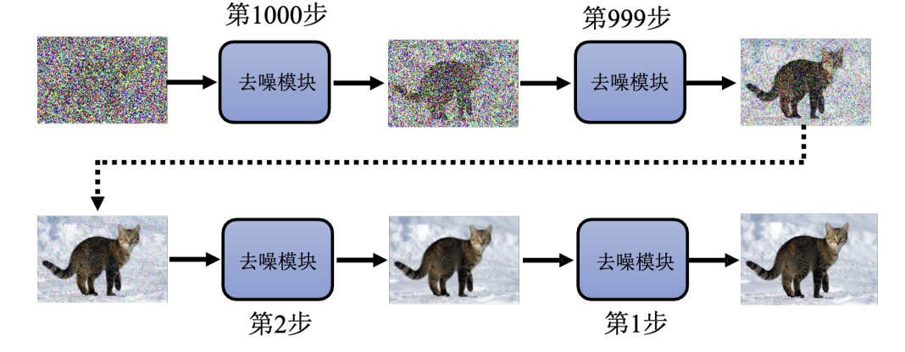
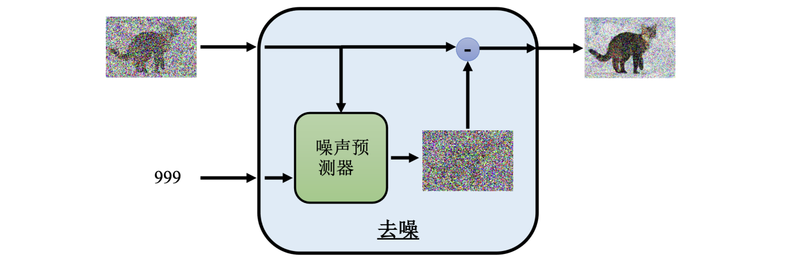
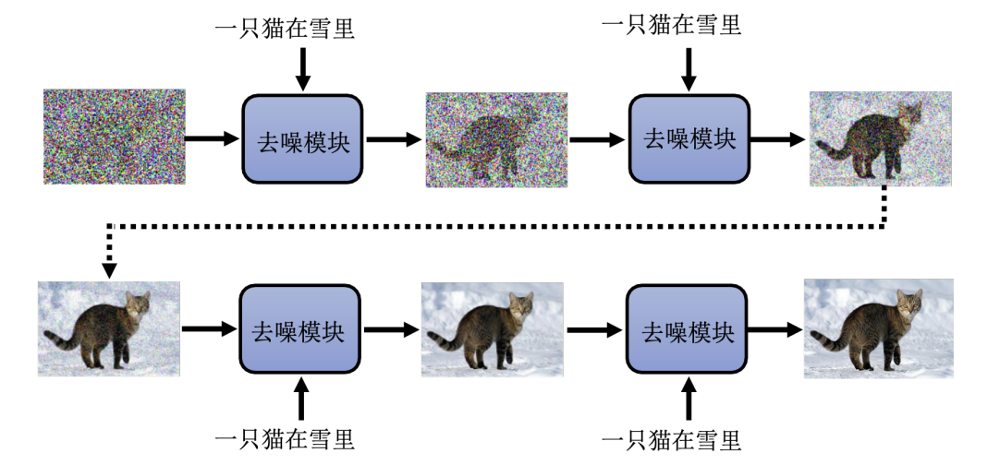
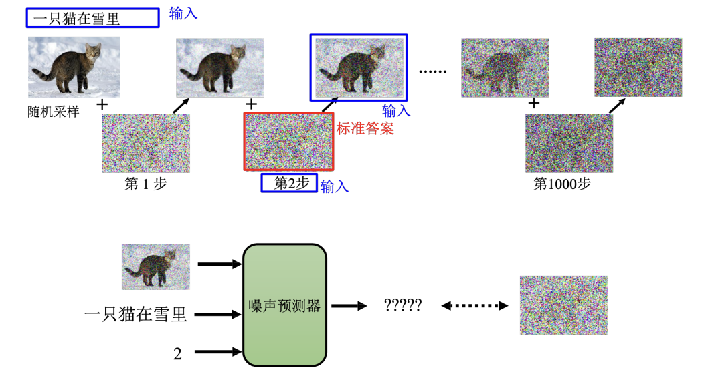

# Chapter9. Diffusion Model

## 1. Definition

- **定义**：扩散模型是一种运用了物理热力学扩散思想的生成模型。
* **代表模型**：去噪扩散概率模型（DDPM）
* **典型应用**：DALL-E、Google Imagen、Stable Diffusion 等主流图像生成系统均基于此原理

## 2. Generate Image

扩散模型生成图片的过程被称为**逆过程**，其核心思想类似于米开朗基罗的名言：“塑像就在石头里，我只是把不需要的部分去掉”。

1. **采样噪声**
    - 从高斯分布中采样一个向量，其维度与目标图片大小一致（如 256×256）
    - 此时得到的是一张纯噪声图片
2. **逐步去噪**
    - 利用**去噪模块**反复处理图片
    - 输入纯噪声图 $\rightarrow$ 滤掉部分噪声（出现模糊轮廓） $\rightarrow$ 继续去噪 $\rightarrow$ 得到清晰图片

## 3. Noise Reduction

去噪模块的核心是一个**噪声预测器(noise predictor)**

* **input**：
    1. 当前带有噪声的图片
    2. **时间步/步骤 ID**：告知模型当前处于去噪的哪个阶段（噪声严重程度）
* **output**：预测图片中包含的**噪声**（而非直接输出去噪后的图片）
* 模型预测出噪声的样子，用输入图片 **减去** 预测出的噪声 = 去噪后的结果

!!! question "为什么不直接输出去噪后的图片？"

     **难度差异**：直接生成一张清晰的图片（如带噪声的猫）难度极大，相当于让模型学会“画画”；而预测噪声（随机纹理）相对简单。因此，预测噪声是更优的策略。

## 4. Model Training

为了训练噪声预测器，需要构造“带噪图片”与“真实噪声”的成对数据

- **前向过程（扩散过程）**：
    1. 从数据集中取出一张清晰图片
    2. 人为地、逐步地向图片中加入高斯噪声
    3. 随着步骤增加，图片逐渐变得无法辨认，最终变成纯噪声
* **训练数据构造**：
    * **输入**：加入噪声后的图片 + 当前步骤 ID
    * **标签（标准答案）**：该步骤中加入的具体噪声
* **训练目标**：让网络学会根据图片和步骤 ID，准确预测出被加入的噪声

## 5. Text to Image

若要让模型根据文字描述生成图片（如 Midjourney, Stable Diffusion），需引入文本信息

- **数据准备**：需要海量的 **“图片-文字”成对数据**
    - 数据来源示例：LAION 数据集（包含 58.5 亿张图片），支持多语言（中/英等）描述
- **模型改进**：
    - **推理阶段**：去噪模块除了接收“带噪图片”和“步骤 ID”外，额外接收**文字描述**作为输入。模型根据文字指引去除噪声
    - **训练阶段**：噪声预测器接收三个输入：
        1. 加噪后的图片
        2. 步骤 ID
        3. **对应的文字描述**
- 模型学习在特定文字描述下，图片应该去除什么样的噪声

