# Model Compression and Data-Efficient Fine-tuning

!!! bug

    - 大模型的部署瓶颈不只在训练，很多时候**推理成本更高**。
    - 现代模型越来越大，问题变成：如何在尽量不牺牲性能的前提下，更便宜、更高效、更公平地部署模型？

---

# Part I: Model Compression

模型压缩的核心目标是：**降低存储、显存、计算或推理延迟，同时尽量保留原模型性能**
主要方法有三类：

1. **Quantization（量化）**
    - 模型结构不变，但把参数或激活值从高精度表示压到低精度表示
    - 例如 FP32 $\to$ FP16 / INT8 / INT4
2. **Pruning（剪枝）**
    - 删除模型中不重要的参数、头、层或子模块
    - 剩下的参数通常保持原值不变
3. **Distillation（蒸馏）**
    - 用一个小模型（Student）学习大模型（Teacher）的行为
    - 小模型的几乎所有参数都会重新训练

!!! info "Why is this even possible?"

    - 大模型通常是**过参数化（Overparameterized）** 的
    - 过参数化意味着模型中存在一定冗余：不是每一个参数、每一位精度、每一个模块都同等重要，这也带来了优化的空间。

---

## 1. Quantization

### 1.1 Post-Training Quantization

==Post-Training Quantization==：先用正常精度训练模型，再在训练结束后压缩权重精度
例如：

- 先训练一个 65B 参数模型
- 训练完成后，把 FP16 / FP32 权重映射到 INT8 / INT4
- 推理时用低精度权重减少显存占用

### 1.2 Floating Point Numbers

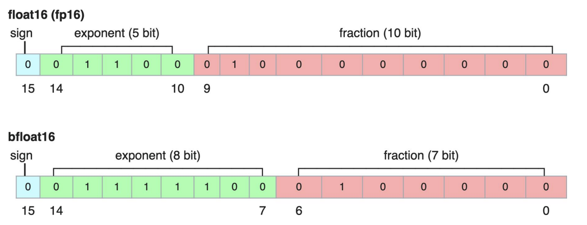

浮点数一般可以写成：

$$
(-1)^s M 2^E
$$

- $s$：符号位（Sign bit）
- $M$：尾数 / 小数部分（Fractional part）
- $E$：指数部分（Exponential part）
降低精度的本质，就是减少这些部分占用的 bit 数，但数值表达范围和精度都会下降

### 1.3 INT8 Quantization

一种最直观的 INT8 量化方法是 ==Absolute Maximum Quantization==

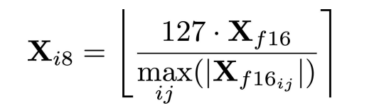

假设输入向量为：

$$
[0.5, 20, -0.0001, -0.01, -0.1]
$$

最大绝对值为 $20$，希望把数值缩放到 $[-127, 127]$：

$$
\text{round}(\frac{127}{20}x)
$$

所以得到：

$$
[3, 127, 0, 0, -1]
$$

!!! warning

    量化不是“免费压缩”。如果原始数值分布里存在极端 outlier，那么普通线性缩放会让大量小数值被压到 0，导致信息损失。

### 1.4 Model-Aware Quantization

#### 1.4.1 GOBO

GOBO 的动机是：BERT 每一层的权重往往近似服从高斯分布

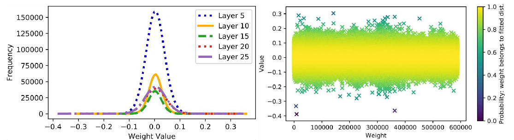

- 大多数权重集中在分布主体区域，只有极少数权重位于尾部
- 对主体区域（regular values）的 $99.9\%$ 权重量化到<u>少量 bucket 中</u>
- 对尾部的少量数据（outliers）不量化，保留高精度

#### 1.4.2 LLM.int8

LLM.int8 进一步针对 Transformer LLM 的结构特点进行优化

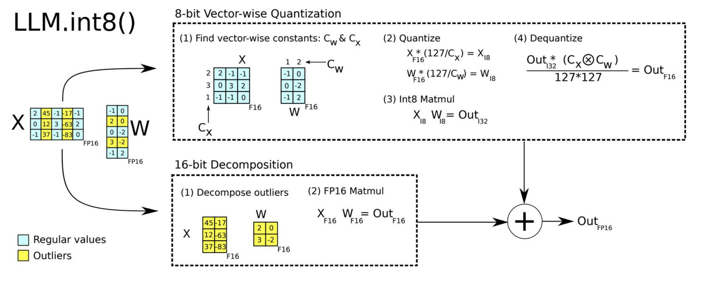

- Transformer LLM 中约 $95\%$ 的参数参与矩阵乘法
    - 小模型上量化开销可能抵消收益
    - 大模型上量化能显著降低推理显存，甚至让 175B 级模型在单卡上推理成为可能

!!! bug "Hardware Concerns"

    量化方法必须考虑硬件和框架支持。

    - 不是所有 bit 宽都被硬件支持，比如 INT3 通常不友好
    - PyTorch 也只原生支持部分数据类型
    - 一些极端量化方法需要专门的硬件加速器，否则理论压缩不能转化为实际加速

### 1.5 Quantization-Aware Training

在训练过程中模拟量化误差，让模型提前适应低精度

#### 1.5.1 Binarized Neural Networks

这种方法压缩率很高，但表达能力和训练稳定性都会受到明显影响

- 权重只有 $-1$ 或 $1$，激活值也被二值化
- 反向传播过程也要处理离散化问题

#### 1.5.2 ZeroQuant

使用 ==Layer-by-Layer Quantization-Aware Distillation==

- 初始化一个和原模型结构相同的量化网络
- 逐层训练量化网络
- 让每一层的输出尽量模仿全精度模型对应层的输出
重点不是只让最终预测相似，而是**让中间表示也接近**。

#### 1.5.3 QLoRA

QLoRA 的核心思想是：**基础模型量化存储，只训练小规模适配参数**

- 将大模型权重量化到 4-bit
- 使用 LoRA 训练低秩增量矩阵
- 使用 GPU memory paging 避免 OOM

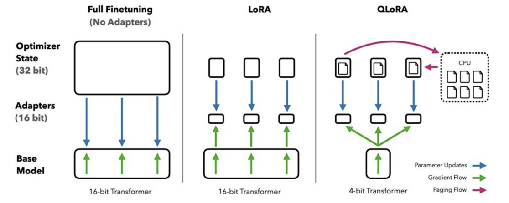

---

## 2. Pruning

Remove parameters from the model after training

### 2.1 Pruning vs Quantization

| 方法           | 核心操作       | 参数数量   | 参数数值   |
| ------------ | ---------- | ------ | ------ |
| Quantization | 降低 bit 精度  | 不变     | 近似改变   |
| Pruning      | 把部分参数置零或删除 | 减少有效参数 | 剩余参数不变 |

### 2.2 Unstructured Pruning

Unstructured Pruning（非结构化剪枝）：删除的只是零散的权重，而不是完整模块

#### 2.2.1 Magnitude Pruning

==Magnitude Pruning== 是最简单的剪枝策略：

- 假设小权重对输出影响较小
- 找到绝对值最小的 $X\%$ 参数，并将这些参数置零

#### 2.2.2 Lottery Ticket Hypothesis

Training a **pruned randomly-initialized** networks can be **better** than training the **full randomly-initialized** network

- 大模型像一堆“彩票”，训练前就包含一些潜在的好的子结构；剪枝是在寻找这些中奖子网络

!!! tip "Pruning"

    **这些百分比表示剪枝后网络中剩余权重的比例**

    
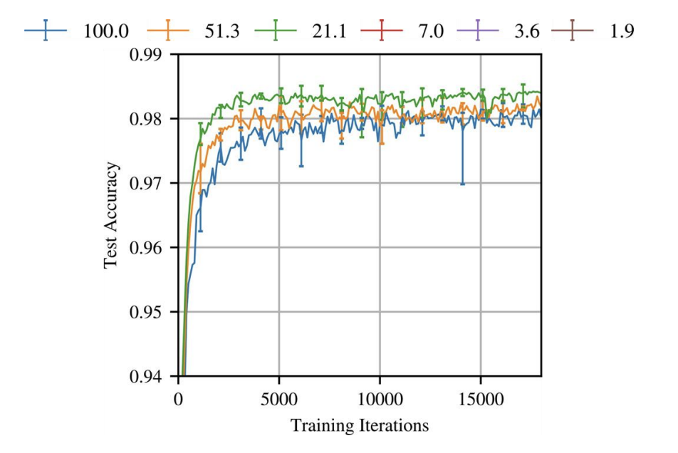

    - 剪枝训练：**先训练一个大网络，找出“不重要”的连接并删去；然后只训练剩下的子网络** 
    - 在 Lottery Ticket Hypothesis 里，关键在于找出一个带着“好初始化”的子网络，也就是 **winning ticket**。Frankle 和 Carbin 的论文指出，随机初始化的大网络里可能包含某些子网络；这些子网络单独训练时，可以在相近训练步数内达到接近原网络的测试准确率。

#### 2.2.3 Wanda

Wanda 是面向 LLM 的剪枝方法，它和前面 Lottery Ticket 那类“剪枝后再训练”的思路不一样，目标是：**不重新训练、不做权重更新，直接判断哪些权重可以删掉**。

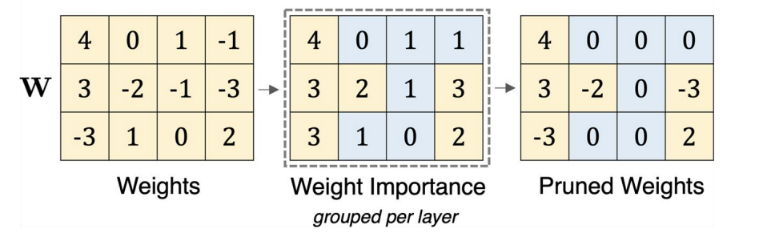

- 传统剪枝常用一个很简单的标准：$S=|W|$
    - 也就是：**权重绝对值越大，越重要；权重绝对值越小，越可以剪掉**
    - 但在 LLM 里，这个判断不够好。因为一个权重是否重要，不只取决于它自己大不大，还取决于<u>它连接的那个输入特征是否经常被激活</u>

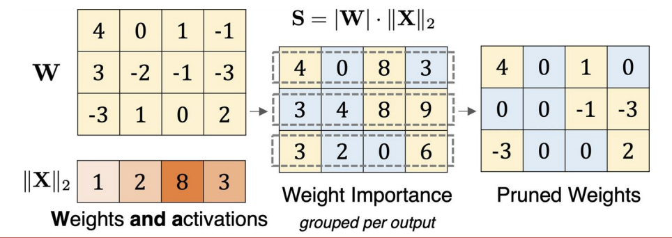

- Wanda 采用的标准：$S=|W| \cdot ||X||_2$ 
    - 把权重幅值和对应输入激活的范数相乘，作为重要性分数
    - **按每个输出神经元分别剪枝**：每一行分别计算重要性，然后保留最重要的若干个权重

#### 2.2.4 Problem with Unstructured Pruning

非结构化稀疏不一定带来真实加速

- 参数虽然变成 0，但矩阵形状没有变
- 普通 GPU 对稀疏矩阵乘法支持有限
- 如果没有专门稀疏硬件或 kernel，跳过零值的管理成本可能超过收益

!!! warning

    剪枝论文里的“参数量减少”不等于线上系统里的“推理变快”。真正有用的剪枝需要和硬件、kernel、batch size、内存访问模式一起评估。

### 2.3 Structured Pruning

Structured Pruning 删除完整组件，而不是零散权重

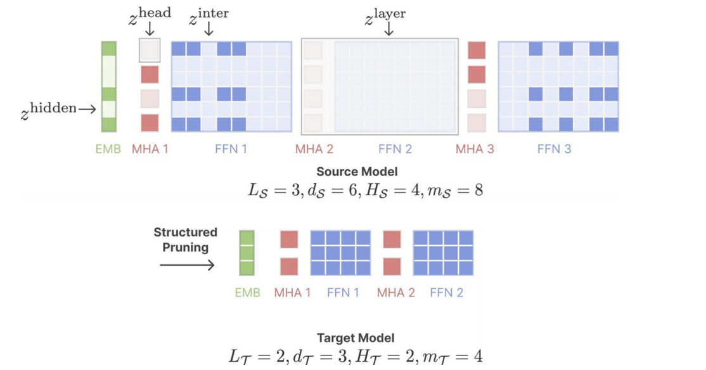

可剪的结构包括：

- Attention heads
- Feed-forward hidden dimensions
- Transformer layers
- Self-attention 或 FFN 子模块

#### 2.3.1 Coarse-to-Fine Structured Pruning

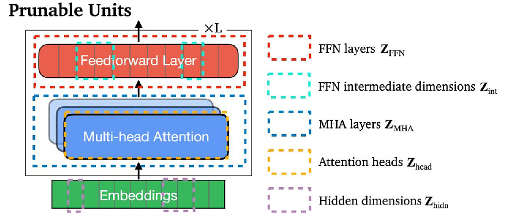

Transformer 每层主要有两类组件：

- Self-attention
- Feed-forward network
Coarse-to-Fine (CoFi) 的做法是学习 mask：
- **Coarse masks**：控制整个 self-attention 或 feed-forward 是否关闭
- **Fine masks**：控制具体 attention head 或 hidden dimension 是否关闭

!!! info "CoFi 训练流程"

    1. 已有一个预训练 / 微调后的 Transformer
    2. 给不同结构单元加 mask，训练时学习这些 mask
    3. 逐渐提高目标稀疏率
    4. Mask 接近 0 的结构被剪掉，得到一个更小、更快的结构化模型
    5. 再微调剪枝后的子模型

#### 2.3.2 Pruning with Forward Passes

!!! question

    大模型做结构化剪枝时，如果还要反向传播、算梯度、保存中间激活，显存压力会非常大。能不能只做前向推理，不算梯度，也判断出哪些模块该剪？

    - ==Bonsai== ：**gradient-free structured pruning**，剪枝阶段不需要反向传播；只通过 forward pass 评估不同子模型的表现，来估计模块重要性

Bonsai 会生成一些被扰动的子模型，评估这些子模型在任务上的表现，然后用收集到的数据建立一个简单线性模型来估计模块重要性；之后迭代地删除最不重要的模块。

1. **随机关掉一些模块，看模型表现变差多少。**  
    - 例如关掉某些 attention heads、某些 FFN dimensions，然后在验证集或校准集上跑一遍前向传播，计算 PPL 或任务指标
2. **用回归模型估计每个模块的重要性。**  
    - 如果某个模块一被关掉，模型 PPL 经常明显变差，说明这个模块重要；
    - 如果关掉后影响很小，说明它可以被剪掉

---

## 3. Distillation

Train **one model (the “student”)** to replicate the behavior of another model (the “teacher”)

### 3.1 Distillation vs Quantization vs Pruning

| 方法           | 核心操作       | 参数数量   | 参数数值   |
| ------------ | ---------- | ------ | ------ |
| Quantization | 降低 bit 精度  | 不变     | 近似改变   |
| Pruning      | 把部分参数置零或删除 | 减少有效参数 | 剩余参数不变 |
| Distillation | 重新训练小模型    | 通常减少   | 几乎全部改变 |

!!! tip "Weak Supervision"

    - Pseudo-labels are targets generated for unlabeled text 
        - We can train on pseudo-labels as though they are labels 
    - This idea is old and used in many ideas 
        - Self-training (Yarowski 1995) 
        - Co-training (Blum and Mitchell 1998) 
        - Meta Pseudo Labels (Pham et al 2020)

### 3.2 Hard Targets vs Soft Targets

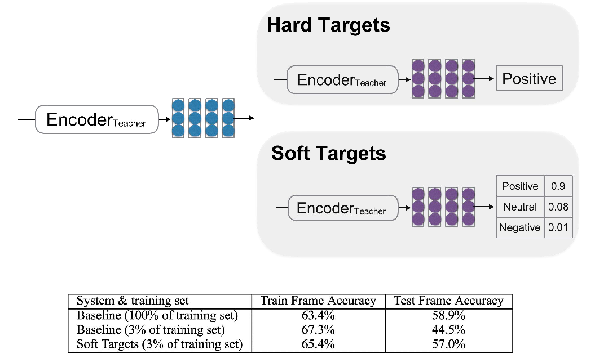

普通监督学习使用 hard target：

- 正确类别为 1；其他类别为 0
蒸馏更关注 soft target：
- Teacher 输出完整概率分布；Student 学习这个分布，而不是只学习最终标签

### 3.3 Sequence-Level Distillation

序列生成任务中，蒸馏可以分为两类：

1. **Word-level distillation**
    - 每个时间步匹配 Teacher 的词分布
2. **Sequence-level distillation**
    - 直接最大化 Student 生成 Teacher 输出序列的概率
对于机器翻译、摘要等任务，sequence-level distillation 往往更自然，因为最终评估的是整段序列。

#### DistilBERT

DistilBERT 的设计：使用 BERT 一半的层数，以及约 $60\%$ 的参数量

- 用 BERT 的交替层（alternating layers）初始化 Student
- 同时使用监督损失和蒸馏损失
    - 监督损失实际上用处不大
- 加入 Teacher / Student hidden states 的余弦相似度
    - 让小模型的中间表示、注意力模式也尽量接近大模型

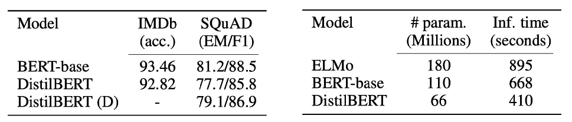

### 3.4 Synthetic Data and Self-Instruct

Self-Instruct 使用模型自己生成指令数据，再用这些伪标注数据训练模型遵循指令

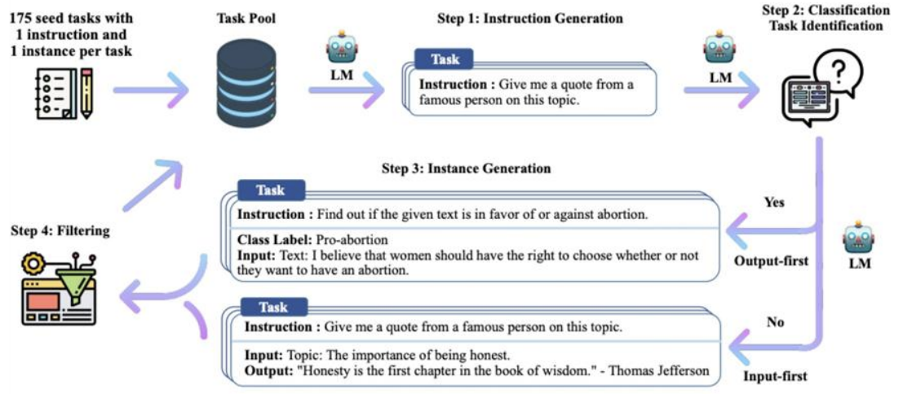

这本质上也是蒸馏：

- Teacher 生成 instruction / response
- Student 在这些合成数据上训练
- 目标是把通用 LM 转成 instruction-following model

### 3.5 Prompt2Model

1. 输入：Prompt   
    - 这个 Prompt 包含了**任务描述**以及**可选的示例**
    - 这意味着用户不需要写复杂的代码或准备大规模数据集
2. 核心处理过程：Prompt Model
    - 它接收到 Prompt 后，会自动执行三个步骤来获取资源并训练模型：
    1. **Retrieve Data（检索数据）**：
       系统会根据你的 Prompt，去现有的公开数据集中寻找与这个任务相关的数据
    2. **Generate Data（生成数据）**：
       如果现成的数据不够，系统会利用强大的大语言模型（如 GPT-4）根据 Prompt 自动生成新的训练数据
    3. **Retrieve Pretrained model（检索预训练模型）**：
       系统会选择一个合适的、较小的预训练模型作为基础，而不是直接使用那个巨大的、昂贵的生成式大模型。
3. 输出：可部署的模型
    - 经过上述步骤，系统最终输出的是一个**Deployment-ready model**

To be done

---

# Part II: Data-Efficient Fine-tuning

预训练模型下游适配有两个典型问题：

1. **数据稀缺**
    - 每个下游任务都收集大量标注数据成本很高
2. **模型太大**
    - 如果每个任务都保存一份完整 fine-tuned model，存储成本会随任务数线性增长

==Data-Efficient Fine-tuning== 的核心目标是：用更少标注数据、更少可训练参数，把大模型适配到下游任务。

---

## 4. Parameter-Efficient Fine-tuning

==Parameter-Efficient Fine-tuning (PEFT)== 不为每个任务复制完整模型，而是冻结大部分预训练参数，只训练少量任务相关参数。

### 4.1 Adapter

Adapter 在 Transformer 层内部插入小型子模块。

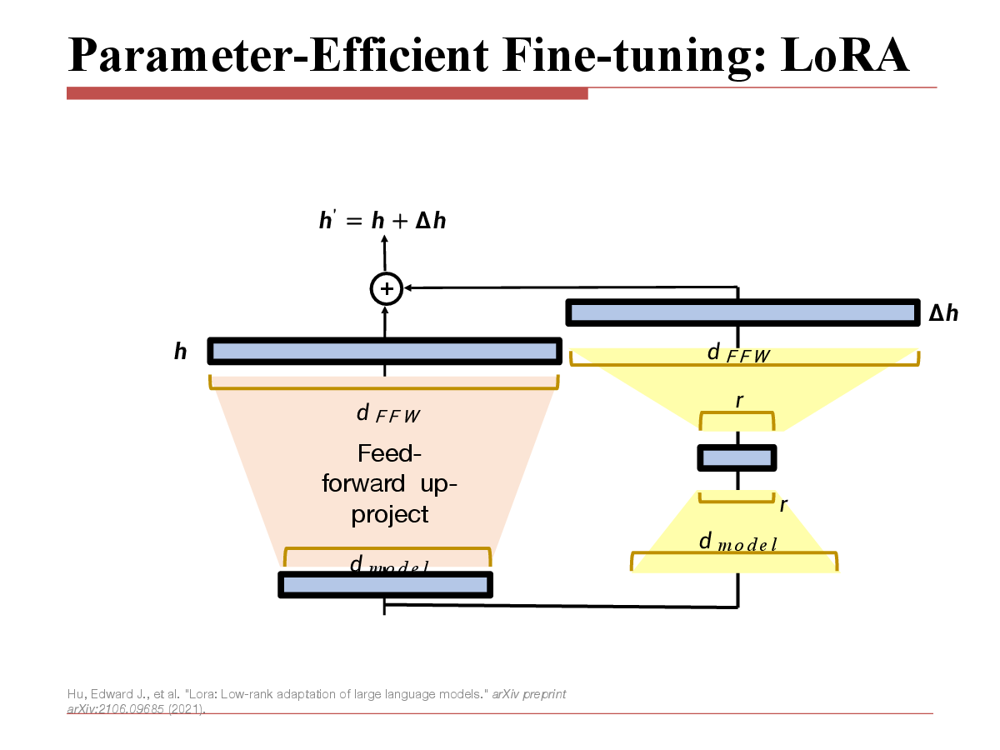

原始隐藏表示为 $h$，Adapter 学习一个增量：

$$
h' = h + \Delta h
$$

结构上通常是：

- Down-project：把隐藏维度压低
- Nonlinearity：引入非线性
- Up-project：映射回原隐藏维度
- Residual：把增量加回原表示

训练时：

- 原 PLM 参数冻结
- 只更新 Adapter 参数

### 4.2 LoRA

==LoRA (Low-Rank Adaptation)== 的核心假设是：下游任务需要的权重变化 $\Delta W$ 是低秩的。

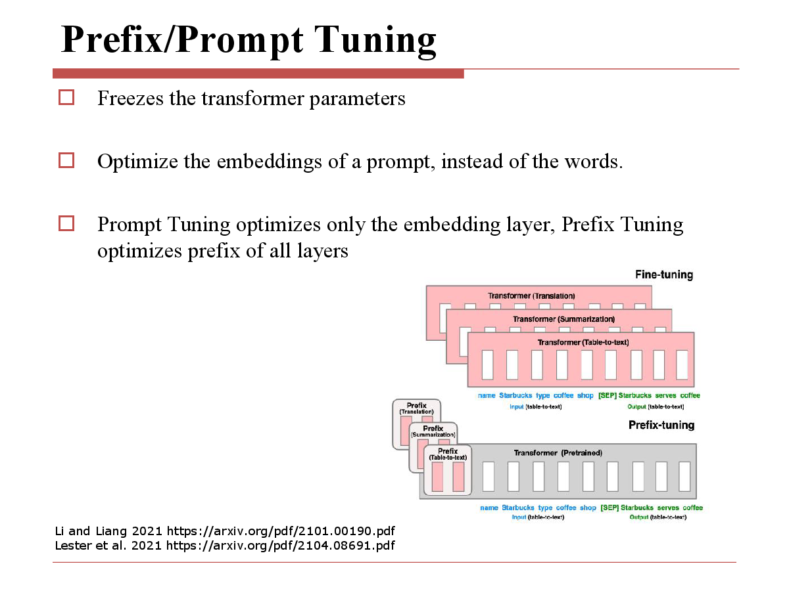

原本 fine-tuning 会直接更新：

$$
W' = W + \Delta W
$$

LoRA 不直接学习完整 $\Delta W$，而是分解成两个小矩阵：

$$
\Delta W = BA
$$

其中：

- $A \in \mathbb{R}^{r \times d}$
- $B \in \mathbb{R}^{d \times r}$
- $r \ll d$

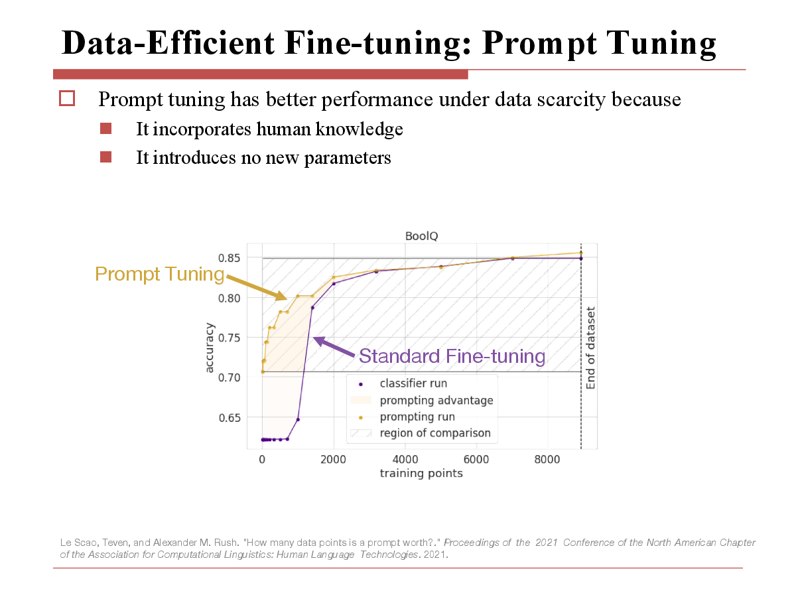

!!! abstract

    LoRA 的优势是训练参数少、显存占用低、不同任务可以只保存不同的 LoRA 权重。推理时也可以把 $\Delta W$ 合并回原权重。

### 4.3 Prefix Tuning / Prompt Tuning

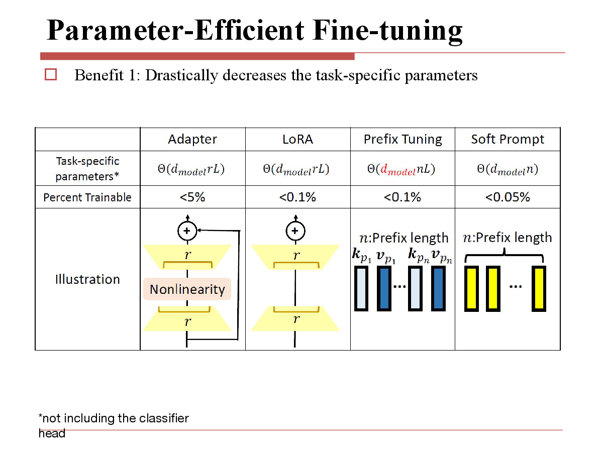

两者都冻结 Transformer 主体参数，但优化对象不同：

- **Prompt Tuning**：只优化输入 embedding 层中的 soft prompt
- **Prefix Tuning**：为每一层都优化 prefix 表示

它们优化的是连续向量，不一定对应真实自然语言 token。

---

## 5. Prompt Tuning

Prompt Tuning 把分类任务改写成语言模型更熟悉的 cloze-style 任务。

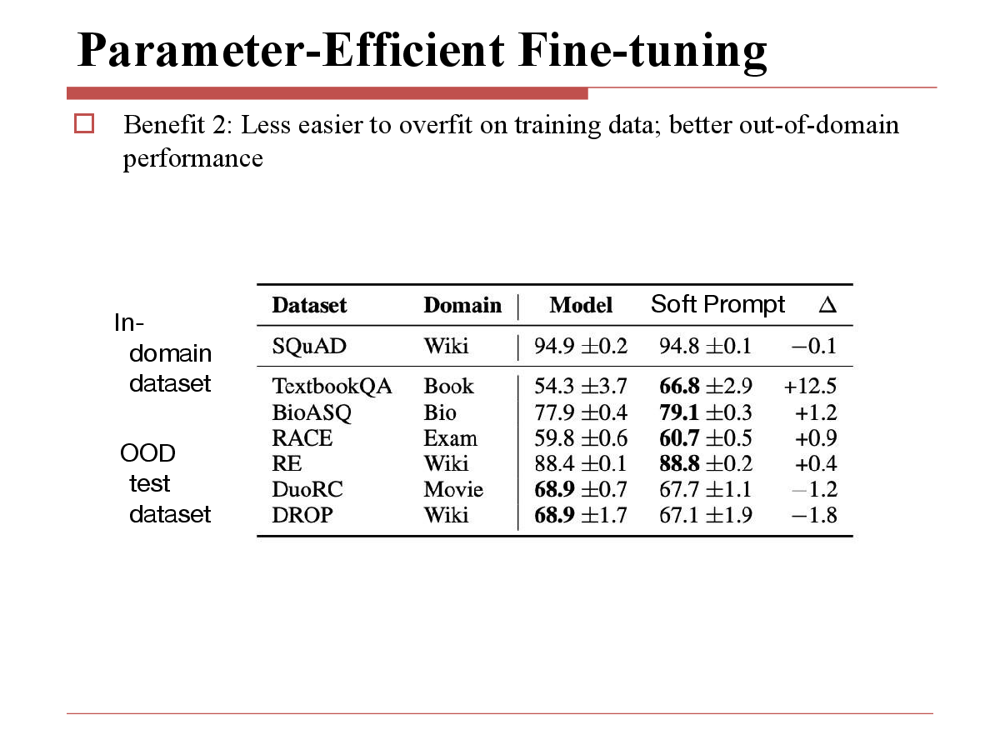

例如自然语言推理：

- 输入：Premise + Hypothesis
- Prompt：`? [MASK],`
- Verbalizer：把 `[MASK]` 的词映射成标签，比如 `yes / maybe / no`

相比标准 fine-tuning：

- 不一定需要额外 classifier head
- 更直接利用预训练阶段学到的语言建模能力
- 在小数据场景下通常更稳

!!! info "Why prompt tuning helps under data scarcity?"

    Prompt 把人类先验知识写进输入格式里。模型不需要从少量样本中重新学习“这个任务该怎么问”，而是把任务转化成它预训练时已经熟悉的问题形式。

---

## 6. Benefits of PEFT

### 6.1 Fewer Task-Specific Parameters

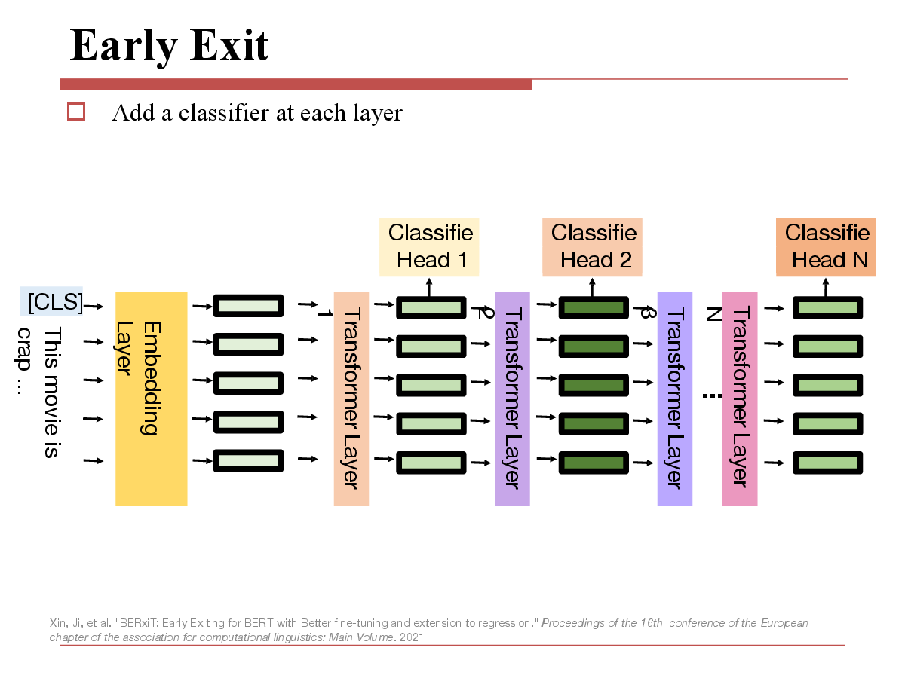

每个任务只需要保存小规模参数：

- Adapter weights
- LoRA weights
- Soft prompt / prefix vectors

这比每个任务保存一整个 BERT / LLM 副本便宜得多。

### 6.2 Less Overfitting

PEFT 可训练参数少，模型更难在小数据上把训练集记死。

- 对小数据集更友好
- Out-of-domain performance 往往更好
- 适合标注数据少但底座模型强的场景

### 6.3 Lower Training Cost

可训练参数少意味着：

- 梯度显存更少
- 优化器状态更少
- 训练更快
- 更容易在消费级 GPU 上完成微调

---

## 7. Early Exit

==Early Exit== 的目标是降低推理时间。

它在每一层或若干层后面加一个 classifier head：

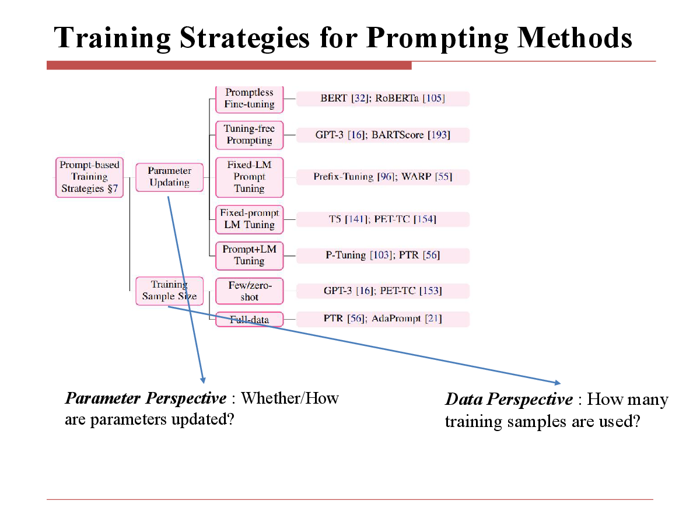

推理时：

- 先经过浅层 Transformer
- 中间 classifier 输出预测和置信度
- 如果置信度足够高，就提前返回结果
- 如果不够高，继续进入更深层

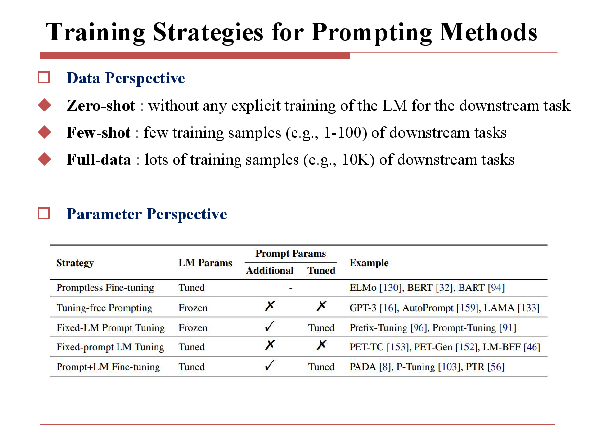

!!! note

    Early Exit 不是压缩参数，而是利用样本难度差异：简单样本不需要跑完整个模型，困难样本才使用全部层数。

---

## 8. Training Strategies for Prompting Methods

Prompting 方法可以从两个角度分类：

### 8.1 Data Perspective

- **Zero-shot**：没有下游任务显式训练样本
- **Few-shot**：只有少量样本，例如 1-100 条
- **Full-data**：有较多样本，例如 10K 条

### 8.2 Parameter Perspective

- **No update**：只写 prompt，不更新模型参数
- **Prompt / Prefix update**：只更新 prompt 或 prefix 向量
- **PEFT update**：更新 Adapter / LoRA 等小模块
- **Full fine-tuning**：更新整个模型

选择策略时主要看三个因素：

- 底座模型是否足够强
- 标注样本是否足够多
- 训练和部署资源是否允许更新大量参数

---

## 9. Semi-Supervised Learning: PET

==Pattern-Exploiting Training (PET)== 结合了 prompt tuning 和半监督学习。

场景：

- 有少量 labeled data
- 有大量 unlabeled data

### Step 1: Train Prompted PLMs

用不同 prompt 和 verbalizer 在少量标注数据上训练多个模型。

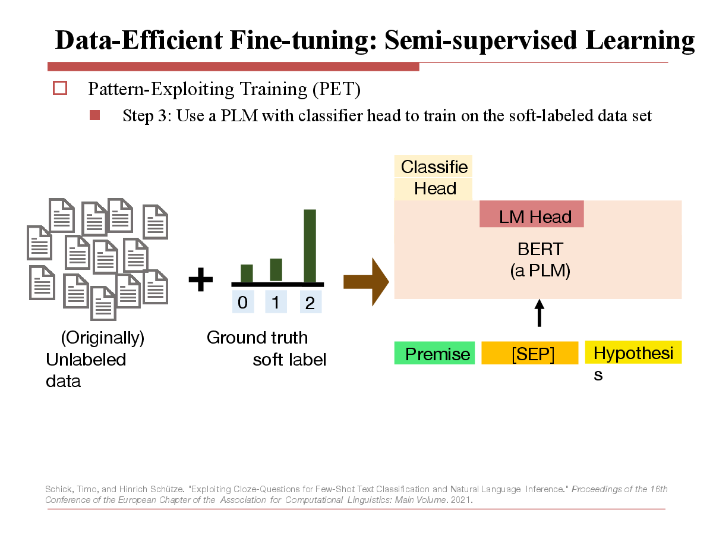

例如同一个 NLI 任务可以设计不同模板：

- `Premise ? [MASK], Hypothesis`
- `"Premise" ? [MASK]. "Hypothesis"`

不同 verbalizer 也可以把标签映射到不同词：

- entailment $\to$ `yes` / `true`
- neutral $\to$ `maybe` / `inconclusive`
- contradiction $\to$ `no` / `false`

### Step 2: Label Unlabeled Data

把未标注数据输入这些 prompt-tuned 模型，得到预测分布。

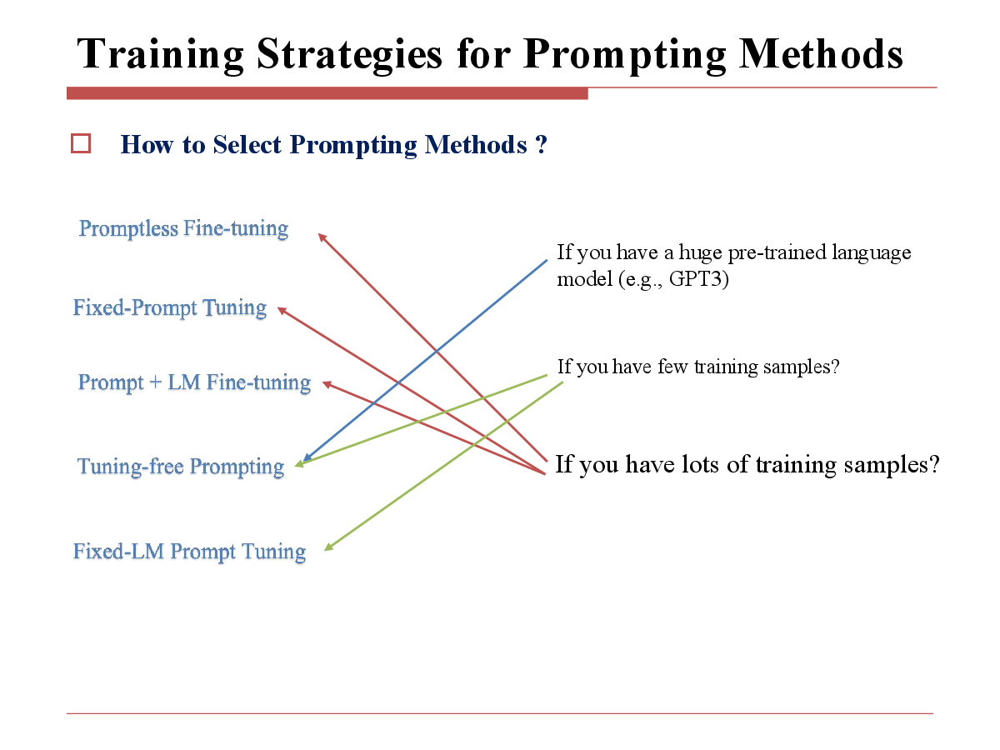

多个模型的预测可以集成，形成 soft labels。

### Step 3: Train Final Classifier

用 soft-labeled dataset 训练一个带 classifier head 的 PLM。

!!! abstract

    PET 的核心是：用 prompt 从少量标注数据中激活 PLM 的先验知识，再把这个能力扩展到大量未标注数据，最后用伪标签训练标准分类模型。

---

## 10. How to Select Prompting Methods?

可以按资源条件做一个粗略判断：

1. **有很强的大模型，但没有标注数据**
    - 优先尝试 zero-shot prompting
2. **有很强的大模型，只有少量样本**
    - 尝试 few-shot prompting / prompt tuning
3. **模型需要服务多个任务，且存储成本敏感**
    - 使用 Adapter、LoRA、Prompt Tuning 等 PEFT 方法
4. **模型很大，GPU 显存有限**
    - 优先考虑 QLoRA
5. **推理延迟是瓶颈**
    - 考虑量化、结构化剪枝或 Early Exit
6. **有大量未标注数据但标注很少**
    - 考虑 PET / pseudo-labeling / semi-supervised learning

!!! tip

    压缩和微调方法不是互斥的。实际系统中经常组合使用：例如 **QLoRA 微调 + INT8 推理 + Early Exit**，分别解决训练显存、部署显存和推理延迟问题。
