# Natural Language Generation and Neural Machine Translation

## 1. Natural Language Generation

Natural Language Generation refers to any setting in which we generate (i.e. write) *new text*.

!!! info "NLG 的主要子领域与应用"

    - **Machine Translation**：
      根据源语言的意思，用目标语言“重新写出”一句话
    - **(Abstractive) Summarization：**
        - **Extractive**：像用荧光笔画重点，直接摘抄原句
        - **Abstractive**：机器先读懂全文，然后用**自己的话**概括。这是典型的 NLG 过程
    - **Dialogue：**
        - **Chit-chat**：像 Siri 或陪伴型机器人
        - **Task-based**：为了完成特定目标（如“订一张去杭州的机票”）而生成回复。
    - **Creative Writing**：包括写故事、写诗、写歌词
    - **Freeform Question Answering**：
      机器在理解问题后，**组织语言生成**完整回答，而不是简单地从知识库里“抠”出一个片段
    - **Image Captioning**：
      跨模态的应用。机器观察一张图片，然后生成一段文字来描述图中的内容

---

## 2. Language Modeling Fundamentals

### 2.1 RNN-LM

==Language Modeling==: the task of <u>predicting the next word</u>, given the words so far 

$$
P (y_t​∣y_1​,\dots, y_{t−1}​)
$$

- A system that produces this probability distribution is called a **Language Model**

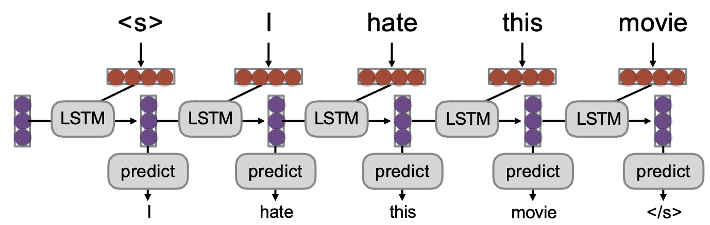

- If that system is an RNN, it’s called a ==RNN-LM==

==Conditional Language Modeling==: the task of predicting the next word, given the words so far, and also <u>some other input x</u>

$$
P (y_t​∣y_1​,\dots, y_{t−1}​|x)
$$

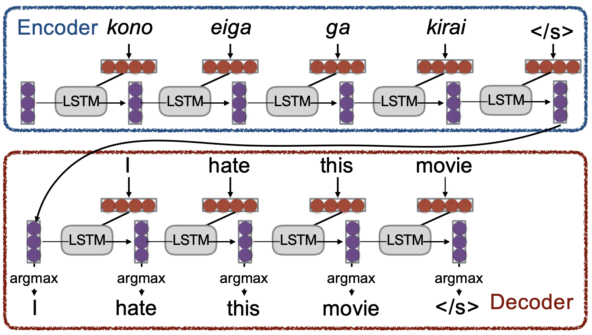

**Examples of conditional language modeling tasks**: 

- Machine Translation (x=source sentence, y=target sentence) 
- Summarization (x=input text, y=summarized text) 
- Dialogue (x=dialogue history, y=next utterance)

### Training a (conditional) RNN-LM

Example: Neural Machine Translation

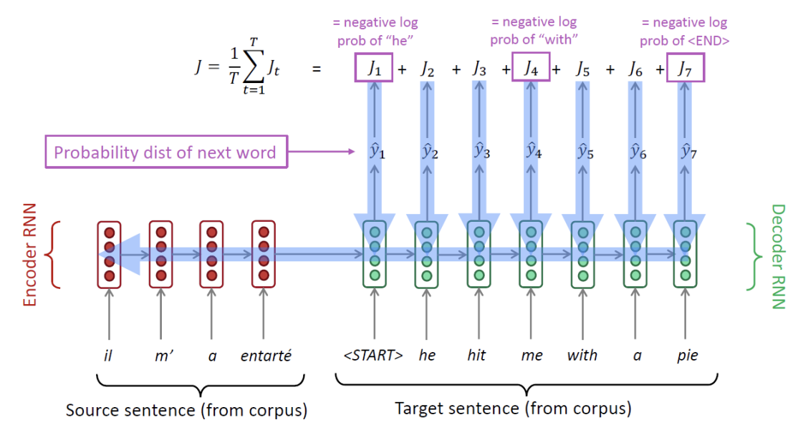

1. 编码器-解码器结构
    - 模型由两部分组成：**Encoder RNN** 和 **Decoder RNN**
    - encoder 首先接收并处理来自语料库的源语言句子（图中的法语 "il m' a entarté"）
    - 随后 decoder 根据编码器的信息逐步处理目标语言句子
      在每一个时间步 $t$，解码器都会输出下一个词的**概率分布（Probability dist of next word）**，表示为 $y^{​t}​$
2. 损失函数
    - 在解码器的每一步，模型会计算预测结果与真实情况之间的误差
    - 具体来说，第 $t$ 步的损失 $J_t$ ​ 是真实的那个词（如 "he", "with"）的**负对数概率（negative log prob）**

$$
J = \frac{1}{T} \sum_{t=1}^T J_t
$$

3. 核心训练技巧：==Teacher Forcing==（教师强制） 
    - 实际测试或使用时，解码器必须将上一步预测出来的词作为下一步的输入
    - 但是在训练阶段，无论解码器实际上预测出了什么内容，我们都会将语料库中真实的目标句子（gold / reference target sentence）喂给解码器作为下一步的输入
    - 这样做可以防止早期的预测错误导致后续所有的训练都偏离正轨

### 2.2 How to Pass Hidden State

如何将 Encoder 对源句子理解后压缩成的全局信息（即最终的隐藏状态），有效地交接给 Decoder，以便指导解码器生成目标文本

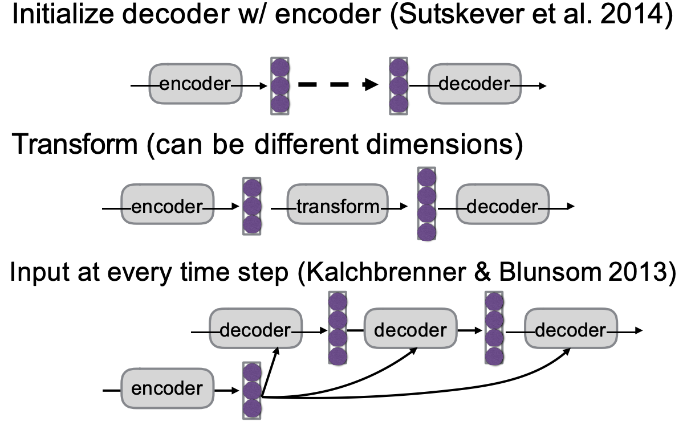

1. **Initialize decoder w/ encoder**：
    - 将编码器最后一步输出的隐藏状态，直接“**复制**”过来，作为解码器第一步的初始隐藏状态
2. **Transform**：
    - 有时编码器和解码器的网络容量或结构不一致（比如两者的隐藏状态维度不同）
    - 在两者之间加入一个“转换操作”（通常是一个线性映射/矩阵乘法），将编码器的隐藏状态转换成解码器需要的维度，然后再传递过去
3. **Input at every time step**：
    - 上述的第一种方法仅在解码最开始时传递一次信息，随着解码句子变长，早期传递的信息可能会被遗忘
    - 将编码器的最终隐藏状态**强制喂给解码器的每一个时间步**。这样可以确保解码器在生成每一个词时，都能看到源句子的完整上下文

---

## 3. The Generation Problem

**The Generation Problem**：We have a model of $P (Y|X)$, how do we use it to generate a sentence?

1. Argmax（最大化概率）：试图生成具有最高总概率的句子
2. Sampling（采样）：根据模型给出的概率分布，随机生成一个句子

### 3.1 Decoding

#### 3.1.1 Sampling-based decoding

==Pure sampling==: 

- On each step t, <u>randomly sample</u> from the probability distribution $P_t$ To obtain your next word. 
==Top-n sampling*==: 
- On each step t, randomly sample from $P_t$, restricted to <u>just the top-n most probable words </u> (truncate the probability distribution)
- $n=1$ is greedy search, $n=V$ is pure sampling 
    - Increase $n$ to get more diverse/risky output 
    - Decrease $n$ to get more generic/safe output

#### 3.1.2 Greedy decoding 

- On each step, take the <u>most probable word</u> (i.e. argmax). Use that as the next word, and feed it as input on the next step. Keep going until you produce \<END\>(or reach some max length) 
- Due to lack of backtracking, output can be *poor*

#### 3.1.3 Beam search decoding

- A search algorithm which aims to <u>find a high-probability sequence</u> (not necessarily the optimal sequence, though) by tracking multiple possible sequences at once.

!!! tip "Core idea"

    
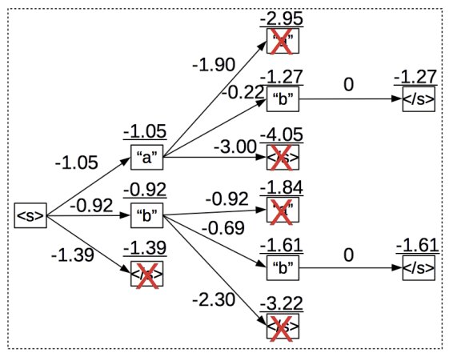

    - 在解码的每一步，同时**跟踪**前 $k$ 个概率最高的局部序列，这里的 $k$ 被称为==束大小（Beam Size）==。
    - 束大小 $k$ 的设置非常关键：
        - $k$ 如果太小，会遇到和贪心解码一样的语法和逻辑错误问题；
        - $k$ 如果太大，会增加计算成本，并且在机器翻译任务中容易生成过短的翻译，而在对话系统中则容易生成过于平庸、泛泛的回复。

#### 3.1.4 Softmax Temperature

!!! note

    softmax temperature is **not a decoding algorithm**! 
    It’s a technique you can apply at test time, in conjunction with a decoding algorithm (such as beam search or sampling)

- On timestep $t$, the LM computes a probability distribution $P_t$ by applying the softmax function to a vector of scores $𝑠 \in 𝑅^{|V|}$

$$
P_t(w)=\frac{\exp{(s_w)}}{\sum_{w' \in V}\exp{(s_{w'})}}
$$

- 在 softmax 中引入温度参数 $\tau$

$$
P_t(w)=\frac{\exp{(s_w/\tau)}}{\sum_{w' \in V}\exp{(s_{w'}/\tau)}}
$$

- 调整 $\tau$ 可以改变模型输出的概率分布：
    - 提高温度会让分布变得*更均匀（uniform）*，从而使输出**更多样化**
    - 降低温度则会让分布变得*更尖锐（spiky）*，使得输出**更少样化**

### 3.2 Ensembling

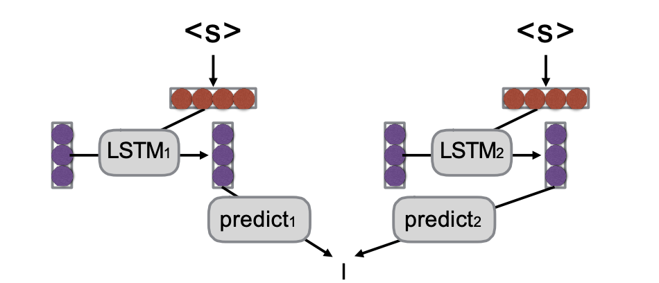

Benefits：

1. **错误互补（Multiple models make somewhat uncorrelated errors）**
   由于初始化或训练数据的微小差异，不同的模型在预测时往往会犯彼此不相关的错误。通过将它们结合起来，模型之间可以相互纠正，从而减少整体的错误率。
2. **缓解预测的不确定性（Models tend to be more uncertain when they are about to make errors）**
   当一个单独的模型即将做出错误预测时，它往往表现出较高的不确定性。集成多个模型可以有效对齐和中和这种不确定性，提高预测的信心和准确度。
3. **平滑个体特质（Smooths over idiosyncrasies of the model）**
   每个训练出来的模型可能会带有一些它特有的偏差或局限性。集成操作可以平滑掉单一模型的特殊性质，使最终的生成结果更加稳定和鲁棒。

---

## 4. Evaluation

### 4.1Human Evaluation

Ask a human to do evaluation

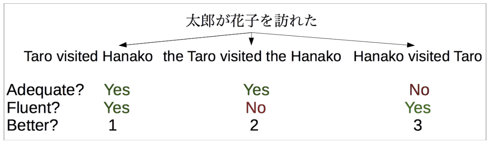

- Final goal, but slow, expensive, and sometimes inconsistent

### 4.2 BLEU

机器翻译中最常用的自动评估指标

- 通过计算生成的序列与参考答案（Reference）之间的 **n-gram（连续的 n 个词）重叠度**来打分
- 包含**长度惩罚项（Brevity penalty）**，防止模型通过生成过短的句子来获得高分

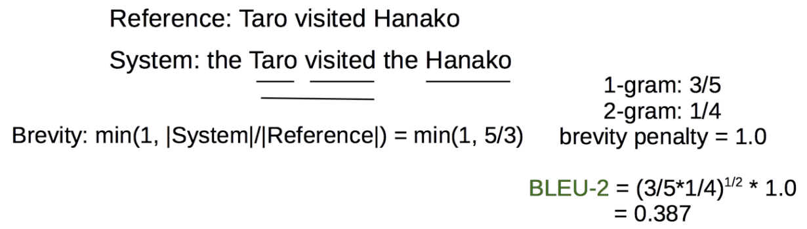

- Pros: Easy to use, good for measuring system improvement 
- Cons: Often doesn’t match human eval, bad for comparing very different systems

### 4.3 METEOR

Like BLEU in overall principle, with many other tricks: 

- consider paraphrases(同义词替换)
- reordering(词序的重排), 
- function word/content word difference(功能词与实词的差异)
Pros: Generally **significantly better** than BLEU, esp. for high-resource languages 
Cons: Requires **extra resources** for new languages (although these can be made automatically), and more complicated

### 4.4 Perplexity

在不进行实际文本生成（即不运行解码算法）的情况下，直接计算模型在**留出测试集（held-out set）** 上预测真实词汇的困惑度

- Pros: Naturally solves multiple-reference problem! 
- Cons: Doesn’t consider <u>decoding or actually generating output</u>. 
- May be reasonable for problems with lots of ambiguity

---

## 5. Neural Machine Translation

Machine Translation (MT) is the task of translating a sentence 𝑥 from one language (the source language) to a sentence 𝑦 in another language (the target language).

### 5.1 Brief History of MT

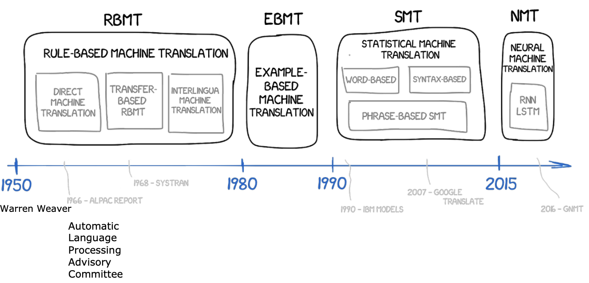

**Ruled Based Machine Translation**, 1950 年代起

- 早期的机器翻译在很大程度上受到冷战的驱动，主要任务例如将俄语翻译成英语。
- 几乎完全是基于规则，依赖于庞大的双语词典，通过查字典的方式将源语言的单词生硬地映射和替换为目标语言的对应词汇。

**Example-Based Machine Translation**, 1980 年代起

- 到了 1980 年代，领域内引入了基于实例的翻译方法（Example-Based Machine Translation），通过寻找和套用语料库中已有的相似翻译实例来进行翻译。

### 5.2 SMT

1990s-2010s: ==Statistical Machine Translation==:

$$
argmax_yP(x|y)P(y)
$$

1. $P (y)$ ：目标句子 $y$ 在目标语言中出现的概率
    - 判断一句话 $y$ 长得像不像一句通顺、地道的目标语言
    - 它的主要任务是**保证翻译结果的流畅度**
2. $P(x|y)$：如果要表达 $y$ 这个意思，那么有多大可能性会说出 $x$ 这句话？
    - $P(x|y)$ 越高，说明目标句子 $y$ 包含的词汇和语义能够覆盖并解释源句子 $x$ 
    - 它负责确了翻译的**准确性**

!!! info

    在翻译过程中，通常已知源句子 $x$ 求目标句子 $y$（即：$P(y|x)$，已知原文 $x$，译文是 $y$ 的概率）

    但直接计算 $P(y|x)$ 非常困难，因为对于同一个 $x$，可能的 $y$ 有无穷多种组合。

    于是，利用**贝叶斯公式**将其转换：

    $$
    P(y|x) = \frac{P(x|y)P(y)}{P(x)}
    $$

    当我们寻找最好的 $y$ 时（即 $\arg\max$），分母 $P(x)$ 是常数（原文已经固定了），所以可以忽略。于是问题变成了最大化分子：

    $$
    \arg\max_y P(x|y)P(y)
    $$

#### Learning alignment

Question: How to learn translation model $P(x|y)$ from the parallel corpus? 

- Break it down further: we actually want to consider $P (x, a|y)$
- Where 𝑎 is the ==alignment==, <u>alignment is the correspondence between particular words in the translated sentence pair</u>.

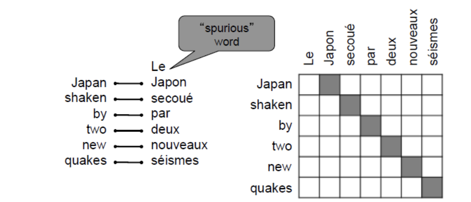

**Alignment is complex** 

1. 一对多对齐（One-to-many）
2. 多对一对齐（Many-to-one)
3. 多对多对齐 / 短语对齐（Many-to-many）

### 5.3 NMT

- Neutral Machine Translation (NMT) is a way to do Machine Translation with *a single neural network* 
- The neural network architecture is called **sequence-to-sequence** and it involves **two RNNS**.

!!! info

    Neural Recurrent Sequence Models

    - 最基础的语言模型，核心任务是预测下一个词（Token）
    - 核心公式：$P(Y) = P(Y_1) \cdot P(Y_2|Y_1) \cdot P(Y_3|Y_1, Y_2) \dots$

    Sequence to Sequence

    
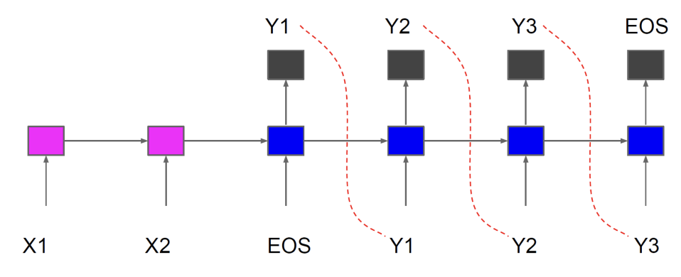

    - 学习将一个输入序列映射到一个输出序列：$X_1, X_2, \text{EOS} \rightarrow Y_1, Y_2, Y_3, \text{EOS}$
    - Encoder/Decoder framework (decoder by itself just neural LM) 
    - Theoretically **any sequence length** for input/output works

#### V1: Encoder-decoder

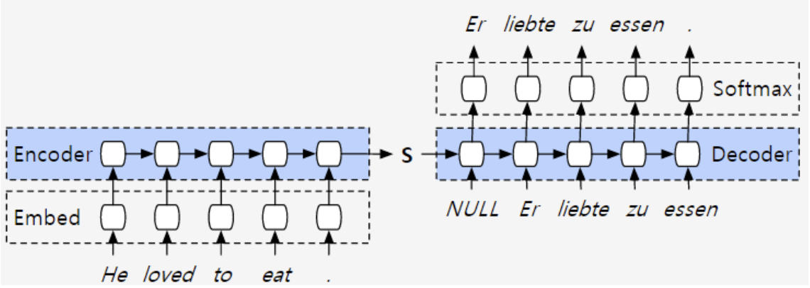

- The encoder spits out a hidden state. 
- This hidden state is then supplied to the decoder, which generates the sentence in language B

#### V2: Attention based encoder-decoder

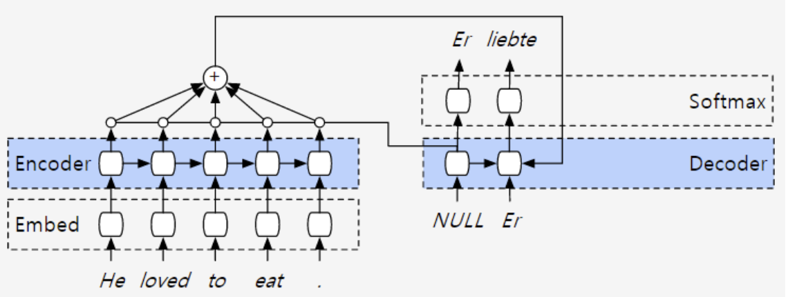

- The encoder query each output asking how relevant they are to the current computation on the decoder side

### V3: Bi-directional encoder layer

引入双向 LSTM + Attention，解码器（Decoder）准备生成下一个单词时，它会去评估生成的**包含了全局上下文的双向状态向量**

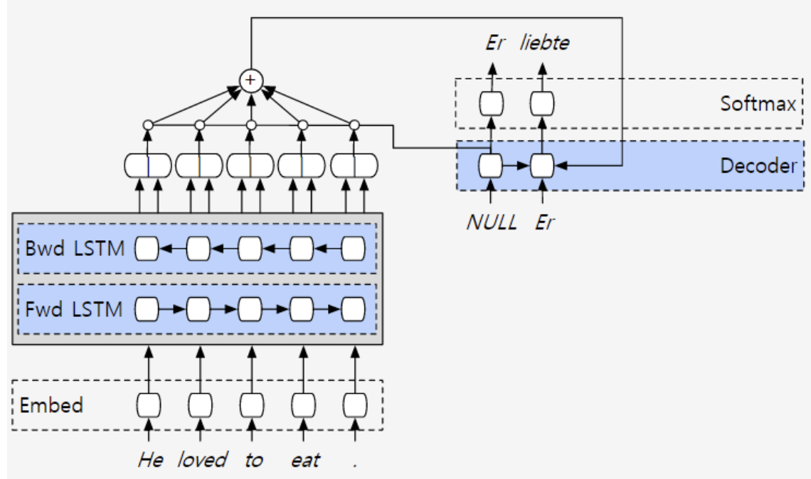

- We would like the annotation of each word to summarize not only the preceding words, but also the following words

### V4: "The deep is for deep learning"

- 就像 CNN 能从像素边缘逐步提取到人脸轮廓一样，深层 RNN 能够提取**层次化的语义特征（Hierarchical Features）**。底层网络可能只关注词法和短语搭配，而越往高层，网络提取的信息就越抽象，能够理解复杂的句法结构和深层语义逻辑。
- 右侧的 Decoder 同样进行了深度堆叠，以匹配编码器的复杂度

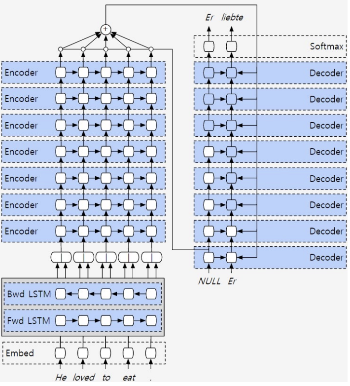

### V5: Parallelization

- To begin computation at one of the nodes, all of the nodes pointing toward you must already have been computed. 
- A layer $i + 1$ can start its computation before layer $i$ is fully finished.

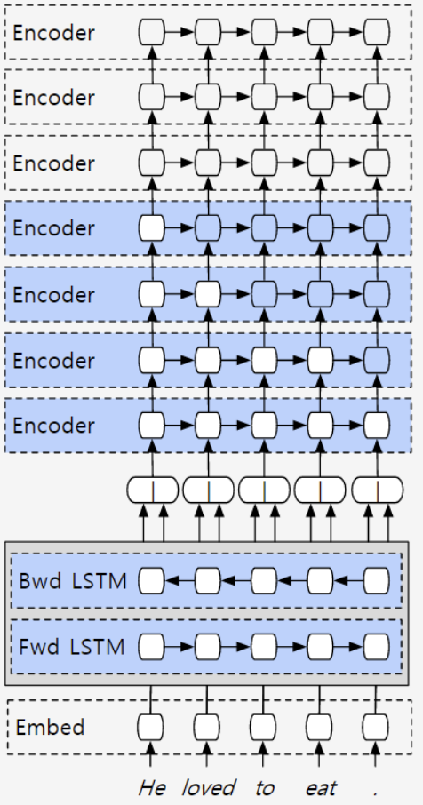

### V6: Residuals are the new hotness

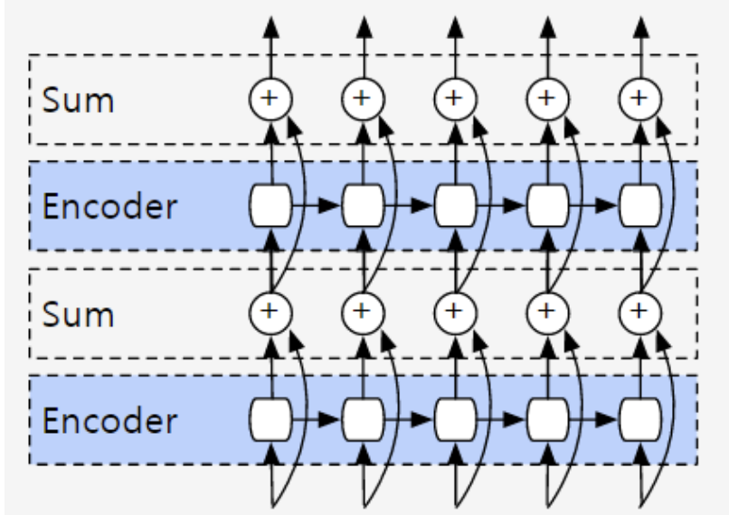

!!! bug "Vanishing Gradients"

    网络一旦变得极深，在反向传播更新参数时，误差信号（梯度）在经过层层传递后会呈指数级衰减，最终趋近于零。这就是经典的**梯度消失**问题。

    - One solution for vanishing gradients is residual networks. 
    - The idea of a layer computing an identity function

用数学公式表达就是： 

$$
\text{输出} = \text{Encoder}(x) + x
$$

- 在反向传播求导时，即使 Encoder 内部的梯度衰减为 $0$，梯度依然可以“无损”地传导回上一层（因为 $x$ 对 $x$ 的导数是 $1$）
- 如果模型在训练中发现某一层是“多余”的，这层最好是不对数据做任何改变（即输出等于输入）。对于传统的神经网络，要精确学出一个“什么都不做”的变换矩阵是非常困难的，但让残差部分为 $0$ 很容易做到
