# Recurrent Neural Networks

**Variants of Neural Networks**： 

- Convolutional Neural Network (CNN) 
- ==Recurrent Neural Network (RNN)== <u>Neural Network with Memory</u>

!!! info "Basic structure of RNN"

    Given function :

    $$
    f:h',y=f(h,x)
    $$

    
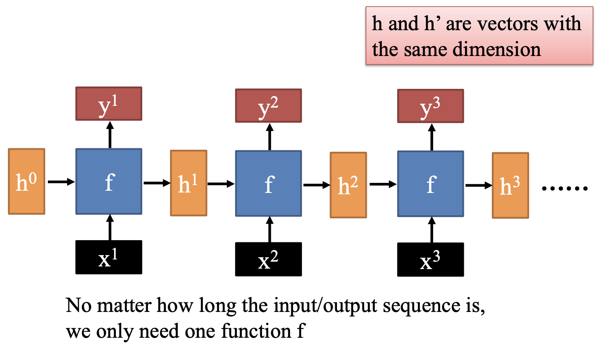

    
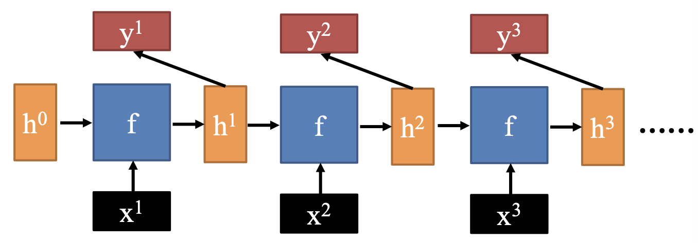

RNN最核心的适用场景是*序列数据（Sequential Data）*

- 这类数据的共同特征是：数据点之间存在时间或顺序上的依赖关系，即当前时刻的数据状态往往依赖于前一个或多个时刻的状态。

---

## 1. Naïve RNN

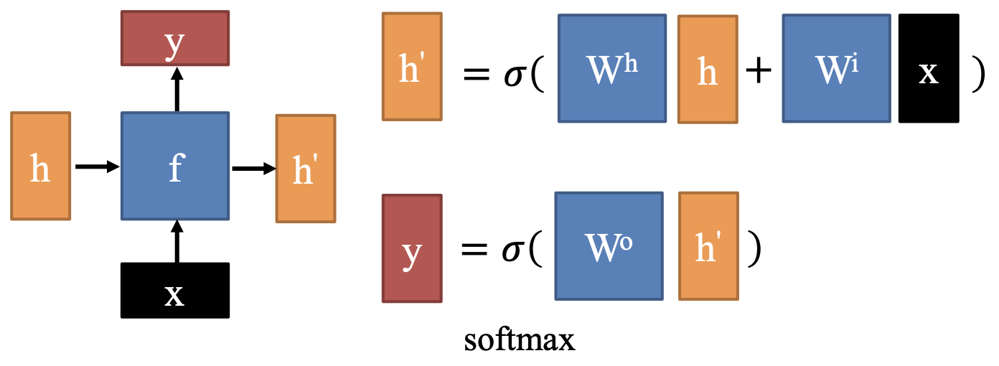

RNN 的主要问题：

- **梯度消失与梯度爆炸 (Vanishing & Exploding Gradients)**
    - **梯度消失**：序列较长时，反向传播的过程中梯度会连乘多次。如果激活函数的导数小于 $1$，或者权重矩阵的特征值小于 $1$，梯度会随着时间步的增加呈指数级衰减，最终趋近于 $0$
        - 后果：网络前面的层的参数几乎得不到更新，模型“忘记”了很久以前的输入信息。
        - E.g.，在处理长句子时，它可能无法关联句首的主语和句尾的谓语。
    - **梯度爆炸**：如果连乘项大于 $1$，梯度会呈指数级增长，导致数值溢出（变成 NaN），模型参数剧烈震荡，无法收敛
- **记忆能力有限 (Limited Memory Capacity)**
    - 标准 RNN 的有效“记忆窗口”非常短。它通常只能记住最近几个时间步的信息，对于需要跨越几十甚至上百个时间步的依赖关系，标准 RNN 表现极差。

---

## 2. LSTM

==Long Short-Term Memory==：引入独立的 **“细胞状态” c**，作为长期记忆的载体

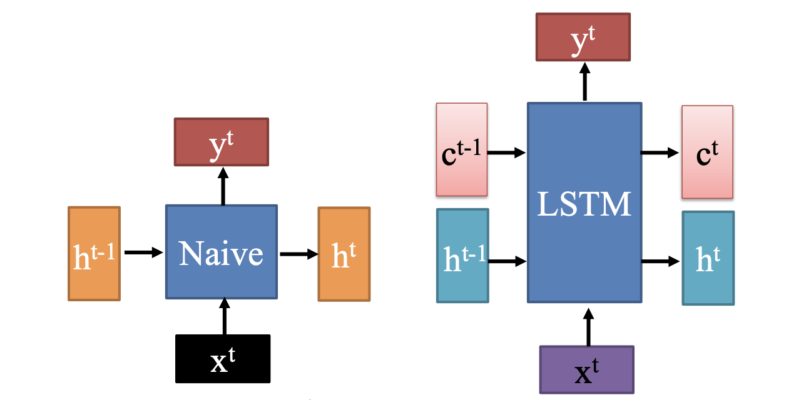

- 细胞状态 $c$ 变化缓慢 → 长期记忆通道
    - $c^t$ 是基于 $c^{t-1}$ “加上一些东西”（通过门控机制控制加减）
    - 缓解了梯度消失，梯度可以沿着 $c$ 直接传递多个时间步而不被连乘衰减
- 隐藏状态 $h$ 变化较快 → 短期响应与输出
    - $h^t$ 是根据当前输入 $x^t$、前一隐藏状态 $h^{t-1}$ 和当前细胞状态 $c^t$ 计算得出
    - 它可以剧烈变化，用于响应当前输入并生成输出 $y^t$

### 2.1 How to Update

LSTM 的核心在于通过**四个关键变量**来控制信息流：

1. **候选细胞状态（Candidate Cell State）**

    $$
    z = \tanh\left( W \begin{bmatrix} x^t \\ h^{t-1} \end{bmatrix} \right)
    $$

    - $W$：权重矩阵（合并了输入和隐藏状态的权重）
    - $\begin{bmatrix} x^t \\ h^{t-1} \end{bmatrix}$：将输入和前一隐藏状态拼接成一个向量
    - $\tanh$：激活函数，输出范围 $[-1, 1]$，表示“可能写入细胞状态的新内容”
    此处的 z 是“原材料”，是否被写入、写入多少，由后面的门控制。

2. **输入门（Input Gate）**

    $$
    z^i = \sigma\left( W^i \begin{bmatrix} x^t \\ h^{t-1} \end{bmatrix} \right)
    $$

    - $\sigma$：sigmoid 函数，输出范围 $[0, 1]$
    - 控制“有多少新信息要写入细胞状态”
    - 值接近 1 → 全部写入；接近 0 → 不写入
3. **遗忘门（Forget Gate）**

    $$
    z^f = \sigma\left( W^f \begin{bmatrix} x^t \\ h^{t-1} \end{bmatrix} \right)
    $$

    - 控制“保留多少旧的细胞状态”
    - 值接近 1 → 完全保留；接近 0 → 完全遗忘
4. **输出门（Output Gate）**

     $$
     z^o = \sigma\left( W^o \begin{bmatrix} x^t \\ h^{t-1} \end{bmatrix} \right)
     $$

    - 控制“从细胞状态中提取多少信息作为新的隐藏状态 $h^t$”

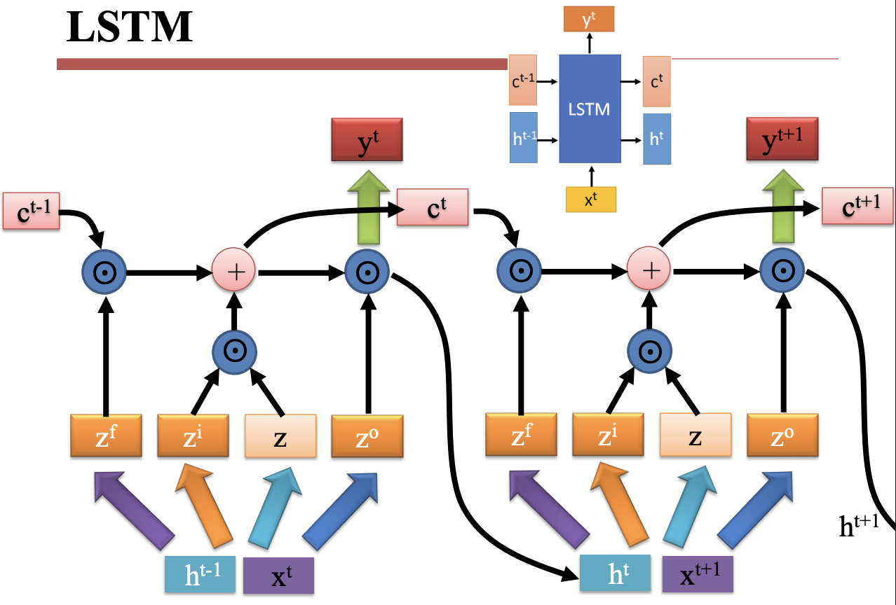

**迭代公式**：

$$
\begin{align}
c^t &= z^f \odot c^{t-1} + z^i \odot z \\
h^t &=z^o \odot \tanh{c^t} \\
y^t &=\sigma(W'h^t)
\end{align}
$$

### 2.2 GRU

LSTM 的高效在于少数关键设计：

- 遗忘门（核心）
- 输出门激活函数（稳定性保障）
- 细胞状态加法更新（隐含前提）

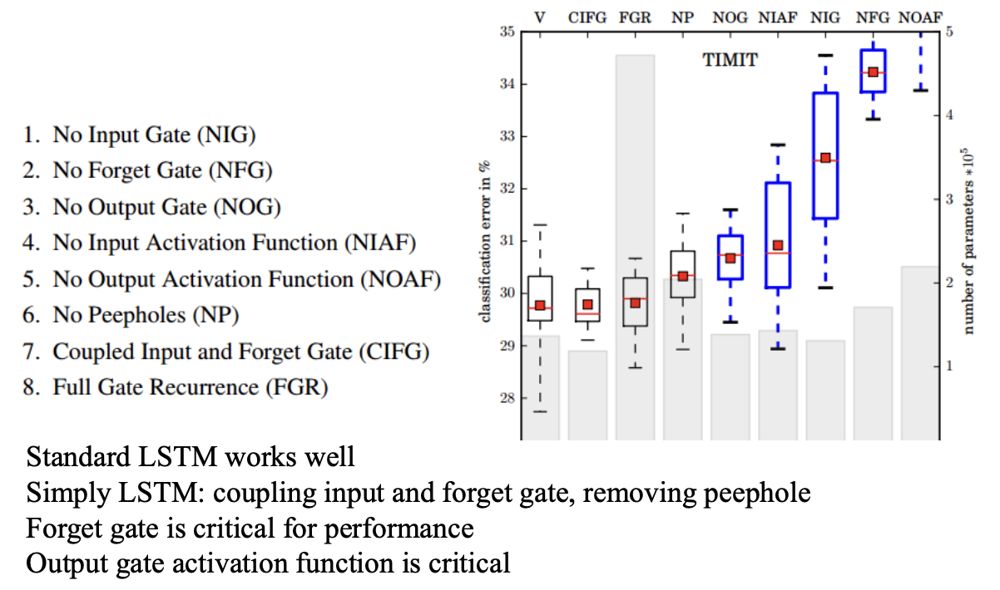

这提供了简化思路：CIFG + NP ≈ 标准 LSTM 性能 
    → GRU（只有两个门：重置门 + 更新门，本质是耦合的输入/遗忘门）

==Gated Recurrent Unit==

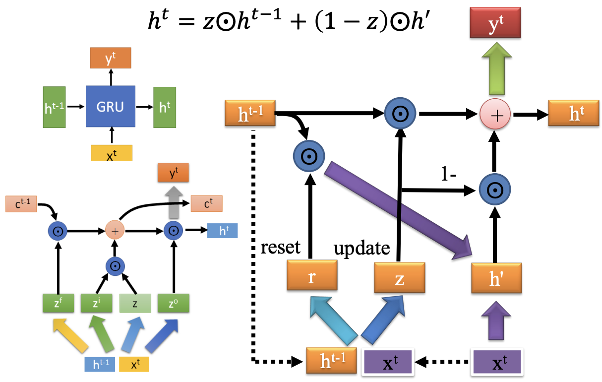

1. 利用当前输入 $x^t$ 和上一时刻隐藏状态 $h^{t−1}$ 计算两个门：

$$
r = \sigma(W^r \begin{bmatrix} x^t \\ h^{t-1} \end{bmatrix}) \quad , \quad z = \sigma(W^z \begin{bmatrix} x^t \\ h^{t-1} \end{bmatrix})
$$

    - **重置门** (Reset Gate, $r$)：
        - 决定忽略多少过去的信息
        - 如果 $r\approx 0$，则“重置”历史，只关注当前输入
    - **更新门** (Update Gate, $z$)：
        - 决定保留多少过去的信息
        - 平衡“旧记忆”与“新候选值”的权重
2. 计算候选隐藏状态 ( $h'$ )

$$
h' = \tanh(W^h \begin{bmatrix} x^t \\ r \odot h^{t-1} \end{bmatrix})
$$

    - $H^{t-1}$ 先被重置门 $r$ 调制 
      → 如果 $r\approx0$，则忽略过去；如果 $r\approx 1$，则完整使用
    - 然后用 $\tanh$ 激活，生成“新候选状态”
3. 最终隐藏状态更新 ( $h^t$ )

$$
h^t = z \odot h^{t-1} + (1 - z) \odot h'
$$

    - $z$ 越大 → 越多保留旧状态 $h^{t-1}$
    - $z$ 越小 → 越多采用新候选 $h'$
    - 相当于一个“软切换”：在“记住过去”和“接受新知”之间动态平衡

### Nested LSTM

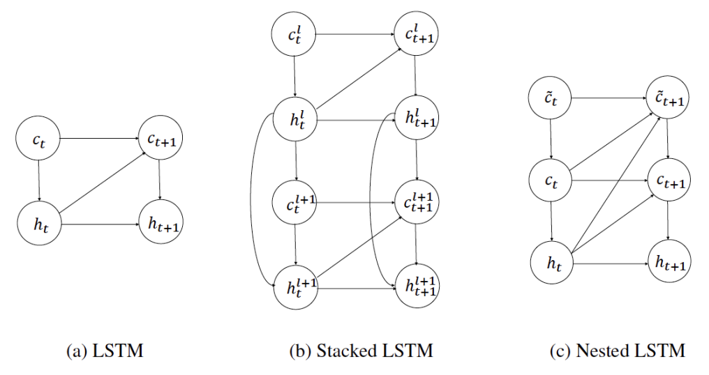

| 特性      | (a) 标准 LSTM | (b) Stacked LSTM               | (c) Nested LSTM          |
| ------- | ----------- | ------------------------------ | ------------------------ |
| 层数      | 1           | ≥2                             | 1（但含嵌套子结构）               |
| 状态变量    | $c, h$      | $c^l, h^l$ (每层独立)              | $c̃, c, h$（三层嵌套）         |
| 层间通信    | 无           | 单向（$h^l → \text{input}^{l+1}$） | 多向（$c̃↔c↔h$，跨层直连）        |
| 时间传递路径  | $c→c, h→h$  | 每层内 $c^l→c^l, h^l→h^l$         | $c̃→c̃, c→c, h→h$ + 跨层跳转 |
| 表达能力    | 基础          | 强（深度抽象）                        | 极强（动态控制+多尺度记忆）           |
| 参数量     | 少           | 中~多                            | 多                        |
| 训练稳定性   | 高           | 中                              | 低（需技巧）                   |
| 实际应用广泛度 | 高           | 非常高                            | 低（研究型）                   |

---

## 3. RNN for NLP

### 3.1 Long-distance Dependencies

NLP 本质上是处理**序列数据（Sequential Data）**，其层级结构如下：

- Words in sentences
- Characters in word
- Sentences in discourse
- ...

**RNNs 擅长捕捉长距离依赖（Long-distance Dependencies）**

1. Agreement in number, gender, etc. (数与性的一致)
    - 模型需要记住句首的主语特征，以便在句尾生成正确的代词或动词形式，即使中间隔了很长的修饰语
    - Example:
        - **He** does not have very much confidence in **himself**.
        - **She** does not have very much confidence in **herself**.
2. Selectional preference (选择偏好)
    - 词语之间的搭配不仅受语法约束，还受语义逻辑约束。模型需要理解名词之间的语义兼容性
    - Example:
        - The **reign** has lasted as long as the life of the **queen**.
        - The **rain** has lasted as long as the life of the **clouds**.
3. What is the referent of "it"? (代词指代消解)
    - The **trophy** would not fit in the brown suitcase because it was too **big**.
    - The trophy would not fit in the brown **suitcase** because it was too **small**.

### 3.2 Unrolling in Time

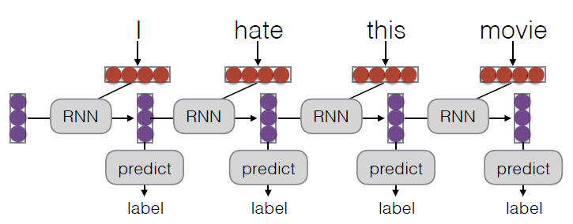

**What Can RNNs Do?**

- **Represent a sentence**
    - 逐个读取句子中的单词，每一步都会更新隐藏状态。直到读取完**整个句子**后才输出一个最终的向量
    - 用途：句子分类 (Sentence Classification)
- **Represent a context within a sentence**
    - 每读入一个单词，**立刻**就根据当前的输入和之前的记忆产生一个输出。即为每一个位置计算“到目前为止的上下文表示”
    - 用途：标注 (Tagging)，语言模型 (Language Modeling)，解析 (Parsing）

### 3.3 What can LSTMs Learn?

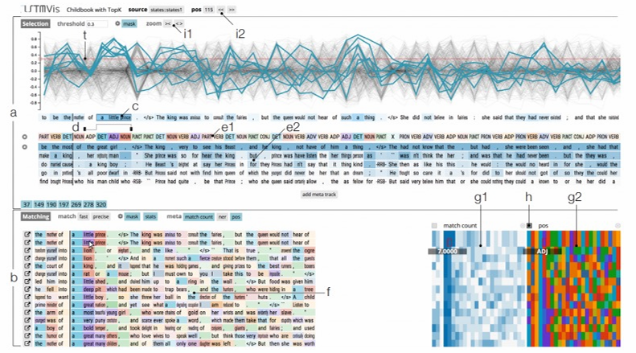

1. 结构与句法模式 (Syntax & Structure)
   图中 a 部分展示了神经元激活程度的变化
    - **长程依赖：** 某些神经元会在括号开始时被激活，直到括号结束才关闭；或者在一段引号内容的起始和结束点产生剧烈波动
    - **计数能力：** LSTM 能够学习到句子的长度或者结构的对称性
    - **词性识别：** 如图中标记的 `ADJ`（形容词）、`NOUN`（名词）等颜色块，某些神经元专门负责识别特定的词性序列
2. 局部模式匹配 (Pattern Matching)
   b 部分展示了 **"Matching" 功能**：
    - 当它看到类似 "the mother of..."、"the king of..." 这种结构时，特定的神经元组合会以非常相似的方式激活
    - LSTM 能够识别并记住**短语模板**或常见的语言习惯
3. 语义与上下文关联 (Semantic Context)
   右下角的彩色矩阵（g1, h, g2部分）代表了神经元的激活状态：
    - **状态聚类**：相似语义的词（例如都是关于“皇室”的词：king, queen, prince）会激活相似的神经元模式
    - **预测能力**：通过这些激活状态，模型能推断出接下来的词大概率是什么类别

### 3.4 Encoder-Decoder Model

**上层：编码器 (Encoder)**

- **任务**：逐个读取源语言，负责“读懂”输入序列
- **结果**：编码器将整句话压缩成一个固定长度的向量（**Context Vector，上下文向量**）。这个向量包含了原句的所有语义信息。

**下层：解码器 (Decoder)**

- **任务：** 
    1. 接收编码器传来的 Context Vector 作为初始状态
    2. 逐个生成单词（图中是英语：_I hate this movie_）
    3. **自回归性：** 解码器在生成当前单词时，会参考前一个已经生成的单词。
- 当模型输出 `</s>`（End of Sentence）标记时，表示生成结束。

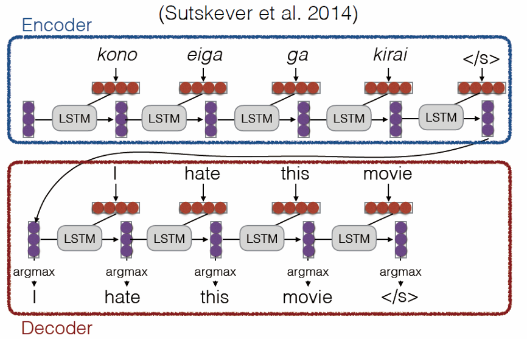

!!! tip

    - 在早期的神经网络中，输入和输出的长度必须是固定的。
    - Encoder-Decoder 打破了这种长度限制。编码器负责将变长的输入映射为一个固定维度的“思想向量”，解码器再根据这个向量展开成另一个变长的输出。
    - 弱点：**信息瓶颈 (Information Bottleneck)**。无论原句多长（比如 100 个词），最后都必须压缩成一个固定大小的向量。这会导致处理长句子时效果变差。为解决这个问题，下面将引出==注意力机制 (Attention Mechanism)==。

---

## 4. Attention

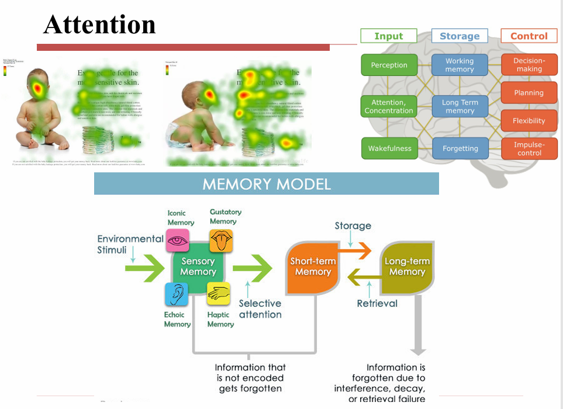

