# Deep Reinforcement Learning

!!! abstract

    1. Reinforcement Learning 和 Supervised Learning 最大的区别是：
        - <u>很多时候没有直接的标签 $y$，只有环境给出的稀疏 reward</u>。
    2. Agent 必须通过 **trial and error** 学会在当前状态下采取什么行动，目标不是让某一步看起来正确，而是让长期累计回报最大。

---

# Part I: Introduction of RL

## 1. Machine Learning Algorithms

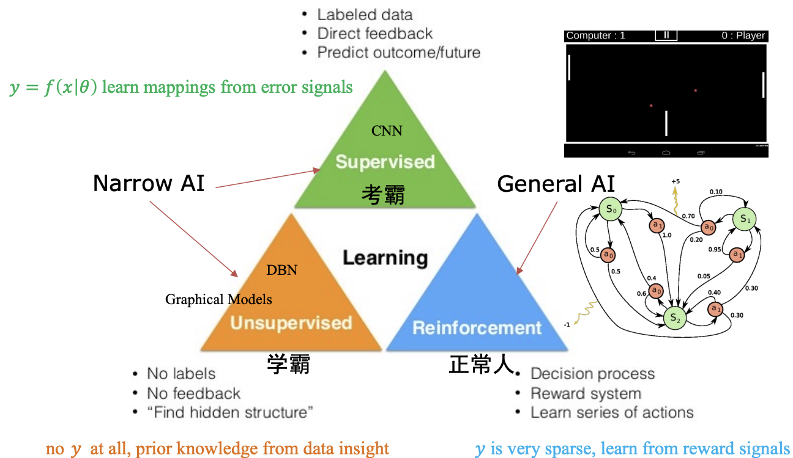

在监督学习中，我们通常学习一个映射：

$$
y=f(x;\theta)
$$

- 模型通过预测值和真实标签之间的 error signal 更新参数

但强化学习面对的问题更为复杂：

- 没有明确的 $y$，reward 可能非常稀疏
- 当前 action 的好坏，可能要过很多步之后才知道
- 数据分布由 agent 自己的行为决定

!!! info "RL in Humans"

    人类看起来可以通过很少的 trial and error 学会走路，但这背后可能不只是简单的反向传播：

    - **Hardware**：生物演化已经积累了大量运动结构和先验
    - **Imitation Learning**：人类可以观察别人走路
    - **Algorithms**：大脑可能使用了比普通 SGD 更适合连续交互的学习机制

## 2. Origins of RL

强化学习主要来自两个传统：

1. **思想假设：心理学中的行为主义**
    - learning by *trial and error*, or search and memory
    - Thorndike 的 **Law of Effect**
2. **模型求解：控制论中的最优控制理论**
    - Bellman equation
    - Markov Decision Process (MDP)
    - Policy iteration

## 3. Basic Concepts

强化学习关心的是：**个体如何在环境给予的奖励或惩罚刺激（Reward -- r）下，逐步形成能获得最大利益的习惯性行为（Actions -- a）**

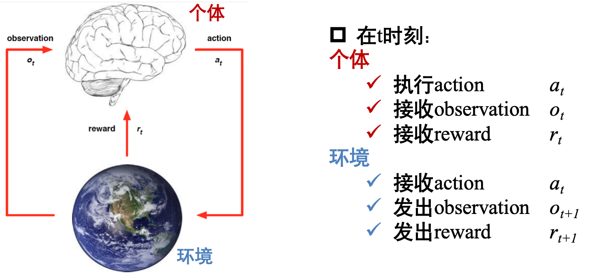

**Experience**：一系列 observation、action、reward 组成的交互历史：

$$
o_1,r_1,a_1,\dots,a_{t-1},o_t,r_t
$$

**State**：对 experience 的 summary：

$$
s_t=f(o_1,r_1,a_1,\dots,a_{t-1},o_t,r_t)
$$

- 如果环境是 fully observed 的，则可以认为：$s_t=f(o_t)$
- 也就是说，当前 observation 已经包含了做决策所需的全部信息

## 4. RL Taxonomy

强化学习方法可以从两个维度理解。

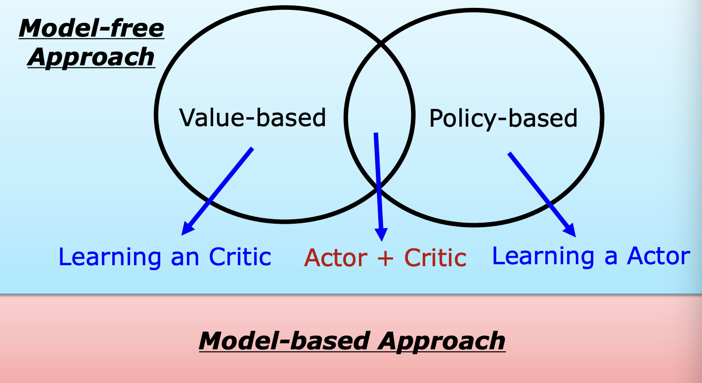

### 4.1 Model-based vs Model-free

- **免模型方法 (Model-free Approach)**：智能体不尝试理解环境运行的底层逻辑（即不预测下一个状态 $s'$ 或奖励 $r$），而是直接通过与环境的交互（试错）来学习。这是目前深度增强学习中最主流的方向。
- **有模型方法 (Model-based Approach)**：智能体先学习一个关于环境的模型，尝试模拟现实世界的运转逻辑，并利用这个模型进行规划（Planning）。

### 4.2 Value-based vs Policy-based

1. **Value-based RL**
    - 学习一个 critic / value function，用来估计某个状态或动作的长期回报
2. **Policy-based RL**
    - 学习一个 actor / policy，直接优化从 state 到 action 的映射
3. **Actor-Critic**
    - 同时学习 actor 和 critic
    - critic 负责评价，actor 负责行动

---

# Part II: Value-based RL

## 1. Q-Learning

Q-function 用来估计：在状态 $s$ 下采取 action $a$，之后按照策略 $\pi$ 行动，可以得到多少长期回报

$$
Q^\pi(s,a)=\mathbb{E}[r_{t+1}+\gamma r_{t+2}+\gamma^2r_{t+3}+\cdots|s_t=s,a_t=a]
$$

其中：

- $r_{t+1}$ 表示 $t+1$ 时刻得到的 reward
- $\gamma$ 是 discount factor，范围通常在 $[0,1]$；$\gamma$ 越大，agent 越重视长期回报

### 1.1 Bellman Equation

Q-function 满足 Bellman equation 的递归表示：

$$
Q^\pi(s,a)=\mathbb{E}_{s',a'}[r+\gamma Q^\pi(s',a')|s,a]
$$

最优价值函数定义为：

$$
Q^*(s,a)=\max_\pi Q^\pi(s,a)=Q^{\pi^*}(s,a)
$$

得到 $Q^*$ 后，最优策略可以直接写成：

$$
\pi^*(s)=\arg\max_a Q^*(s,a)
$$

最优 Bellman 方程为：

$$
Q^*(s,a)=\mathbb{E}_{s'}[r+\gamma\max_{a'}Q^*(s',a')|s,a]
$$

### 1.2 Value Iteration

核心思想：**通过不断改进某个状态下某个动作的价值评估，让 agent 学会如何最优行动**

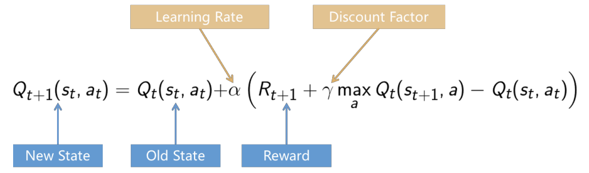

??? info "关于Q-learning 的公式"

    原公式可以改写成：

    $$
    Q_{\text{new}}=(1−\alpha) Q_{\text{old}}+\alpha\times \text{TD target}
    $$

    其中：

    $$
    \text{TD target}=r+\gamma \max_{\alpha'} Q (s', a')
    $$

    | 变量                |    数值 | 意思                                       |
    | ----------------- | ----: | ---------------------------------------- |
    | $Q (s, a)$        |   $2$ | 原本认为该动作的价值（此处可以理解为最终的期望）是 $2$            |
    | $r(R_{t+1})$      |     1 | 在 $s_t$ 状态做 $a_t$ 动作，立刻得了 $1$ 分          |
    | $\gamma$          | $0.9$ | 对未来的重视程度较高                               |
    | $\max Q (s', a')$ |   $3$ | 到了新状态 $s'(s_{t+1})$ 后，最好的动作 $a'$ 价值是 $3$ |
    | $\alpha$          | $0.5$ | 学习率是 $0.5$                               |
    先算目标值：

    $$
    r + \gamma \max{Q(s',a')}=1+0.9\times 3 = 3.7
    $$

    旧 $Q$ 值是 2，新目标是 $3.7$，说明原来低估了：

    $$
    3.7−2=1.7
    $$

    更新：

    $$
    Q_{\text{new}} = 2 + 0.5\times 1.7 =2.85
    $$

    所以这个格子的 Q 值从 **2 更新成 2.85**。

下面的伪代码展示了 Q-Learning 的循环迭代逻辑：

1. **初始化**：随机生成 Q 表的值
2. **选择并执行动作**：根据当前策略（通常是 $\epsilon$ -greedy）选择动作 $a$
3. **观察反馈**：获得奖励 $r$ 并进入新状态 $s'$
4. **计算并更新**：利用上述公式计算 TD 误差并更新 Q 表中对应的条目
5. **状态更替**：将新状态设为当前状态，重复上述过程直到任务结束

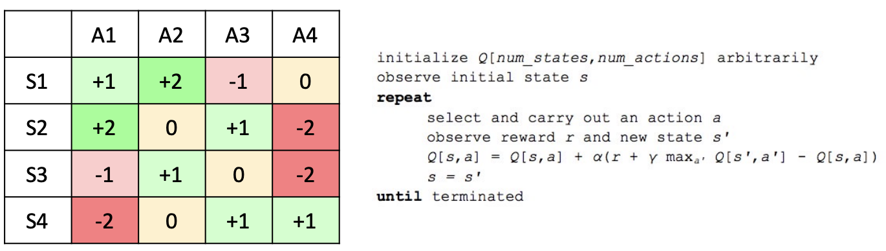

## 2. Deep Q-Network (DQN)

- 在 2013 年 DeepMind 发表 Deep QNetwork (DQN) 相关工作之前，强化学习 (Q-learning) 已经进入了瓶颈，主要原因是状态的维度灾难
- DQN 的基本思想：
  用深度神经网络近似 Q-function：

$$
Q(s,a;\mathbf{w})\approx Q^*(s,a)
$$

!!! note "Nature DQN"

    DeepMind 的 DQN 在 Atari Games 上展示了深度强化学习的潜力。
    它把 CNN 的表征能力和 Q-Learning 的长期决策能力结合起来，使 agent 可以直接从像素输入中学习玩游戏。

### 2.1 DQN Loss

DQN 的目标值为：

$$
y=r+\gamma\max_{a'}Q(s',a';\mathbf{w})
$$

loss 可以写成：

$$
L(\mathbf{w})=(y-Q(s,a;\mathbf{w}))^2
$$

也就是：

$$
L(\mathbf{w})=(r+\gamma\max_{a'}Q(s',a';\mathbf{w})-Q(s,a;\mathbf{w}))^2
$$

### 2.2 Why DQN is Unstable

在 DQN 之前，直接用深度神经网络做 Q-Learning 往往会失败，主要原因是不稳定：

1. **Reward 与 Q-value 的尺度未知**
    - 不同 Atari 游戏的分数尺度差异很大，比如一个游戏奖励可能经常是 1，另一个游戏一次可能给几百或几千分
    - 如果直接训练，TD error 可能非常大，梯度也会不稳定
2. **连续输入高度相关**
    - 戏画面是一帧接一帧来的，相邻图像差别很小。如果神经网络按时间顺序训练，相当于连续喂给模型大量相似样本，容易过拟合最近状态
3. **Q-value 细微变化会导致 policy 剧烈抖动**
    - 因为 action 由 $\arg\max_a Q(s,a)$ 决定
    - Q-value 排名一点点变化，就可能导致完全不同的 action

### 2.3 DeepMind's Solutions

DeepMind 提出了几个关键技巧：

1. **Reward Clipping / Normalization**
    - 将 reward 控制在合理范围内，避免 Q-value 尺度过大
2. **Experience Replay**
    - DQN 使用 experience replay，把经历 $(s, a, r, s')$ 存进 replay memory
    - 再随机抽 minibatch 训练，从而打散时间相关性，平滑数据分布变化
3. **Freeze Target Q-network**
    - 维护两个网络：online Q-network 和 target Q-network
    - Online 网络正常更新；target 网络隔一段时间才从 online 网络复制一次参数，中间保持不变，让学习过程更稳定
使用 target network 后：

$$
\begin{align}
y&=r+\gamma\max_{a'}Q(s',a';\mathbf{w}^{-}) \\
L(\mathbf{w})&=(r+\gamma\max_{a'}Q(s',a';\mathbf{w^-})-Q(s,a;\mathbf{w}))^2
\end{align}
$$

其中 $\mathbf{w}^{-}$ 表示 target Q-network 的参数。

### 2.4 Improvements after Nature DQN

Nature DQN 之后，DeepMind 和后续工作提出了很多改进：

- **Normalized DQN**
- **Prioritized Experience Replay**
    - 根据 transition 的 TD error / surprise 分配采样优先级
    - 让模型更频繁学习“它还没学好”的经验
- **Double DQN**
    - 缓解 $\max$ 操作导致的 Q-value overestimation
- **Dueling Network**
    - 将 state value 和 action advantage 分开建模
    - 适合很多 action 对结果影响不大的状态

---

# Part III: Policy-based RL

## 1. Policy

策略（Policy -- $\pi$）：个体的行为，是从 state 到 action 的映射

1. **Deterministic Policy**，确定性策略直接输出一个 action：

$$
a=\pi(s)
$$

2. **Stochastic Policy**，随机策略输出 action 的概率分布：

$$
\pi(a|s)=P(a|s)
$$

## 2. Robot in a Room

<u>最优策略不仅取决于目标位置，还强烈依赖环境模型和 reward structure。</u>

!!! info "假设"

    - 到达某个格子 reward 为 $+1$；到达危险格子 reward 为 $-1$
    - 每走一步有 step penalty，例如 $-0.04$
    - action 可能是随机的，例如选择 UP 时：80% 真正向上；10% 向左；10% 向右

### Environment Matters

如果 action 是确定性的：

- 选择 UP 就一定向上，最优策略通常是 shortest path
如果 action 是随机的：
- shortest path 可能会经过危险格子旁边，agent 需要考虑动作偏移带来的风险
- 最优策略可能会绕路，避开 $-1$ 附近的区域

### Reward Structure Matters

step penalty 会改变最优策略：

- 如果每步惩罚很大，例如 $-2$：agent 会更急于结束 episode，倾向 shortest path

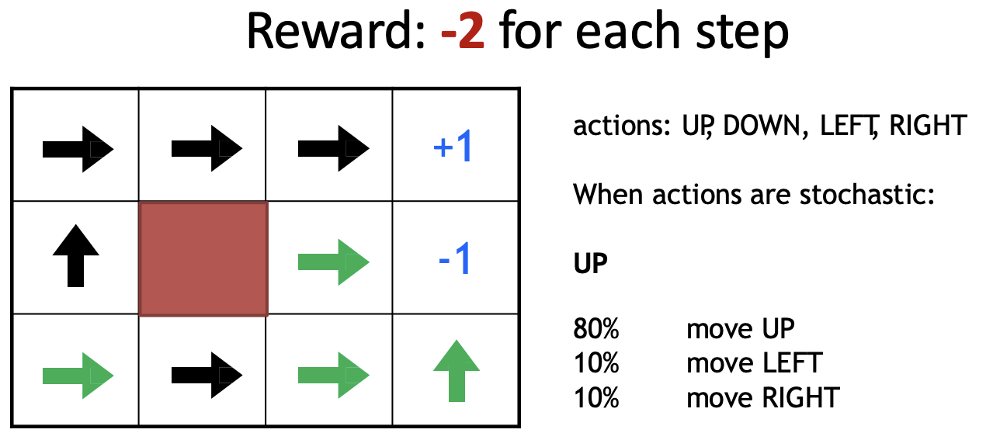

- 如果每步惩罚较小，例如 $-0.04$：agent 愿意绕路避险

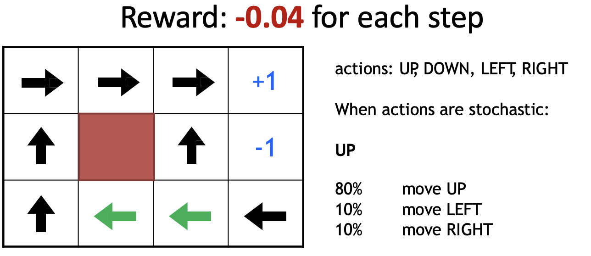

- 如果每步 reward 为正，例如 $+0.01$：agent 可能倾向于走更长路径

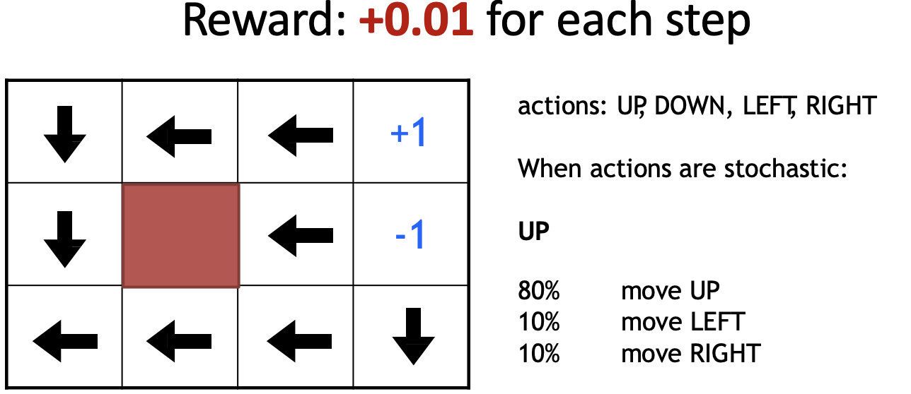

## 3. Policy Gradient

Actor 是一个神经网络：

- **Input**: the observation of machine represented <u>as a vector or a matrix</u>
- **Output**: each <u>action</u> corresponds to a neuron in output layer
    - action 可以通过概率采样，也可以取最大概率 action
    - 如果 action 是连续的，actor 也可以输出连续分布的参数，例如高斯分布的均值和方差

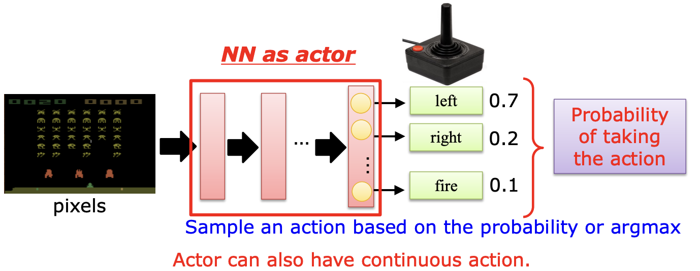

### 3.1 Goodness of an Actor

给定 actor $\pi(s)$ 神经网络参数 $\theta^\pi$，让它与环境交互得到一条 trajectory：

$$
\tau=(s_1,a_1,r_1,s_2,a_2,r_2,\dots,s_T,a_T,r_T)
$$

整条 trajectory 的总回报为：

$$
R(\tau)=\sum_{t=1}^{T}r_t
$$

因为 actor 本身可能是随机的，环境也可能是随机的，所以即使用同一个 actor，每次得到的 $R(\tau)$ 也可能不同。

因此我们优化的是期望回报：

$$
\bar{R}_{\theta^\pi}=\mathbb{E}_{\tau\sim p_\theta(\tau)}[R(\tau)]
$$

### 3.2 Policy Gradient Formula

神经网络的参数更新公式：

$$
\theta^{\pi'}\leftarrow \theta^\pi+\eta \nabla \bar{R}_{\theta^\pi},\quad \text{using } \theta^\pi\text{ to obtain} \{\tau^1,\tau^2,\dots,\tau^N\}
$$

Policy Gradient 的核心公式（对 $\theta$ 求偏导）：

$$
\nabla \bar{R}_{\theta^\pi}\approx \frac{1}{N}\sum_{n=1}^{N}R(\tau^n)\nabla\log P(\tau^n|\theta^\pi)
$$

trajectory 的概率可以分解为每一步 action 的概率，因此：

$$
\nabla \bar{R}_{\theta^\pi}\approx \frac{1}{N}\sum_{n=1}^{N}\sum_{t=1}^{T_n}R(\tau^n)\nabla\log P(a_t^n|s_t^n,\theta^\pi)
$$

### 3.3 Intuition

如果在 trajectory $\tau$ 中，agent 在状态 $s_t$ 采取了 action $a_t$：

- 当 $R(\tau)>0$：
    - 增加 $\pi_\theta(a_t|s_t)$，以后更可能采取这个 action
- 当 $R(\tau)<0$：
    - 减少 $\pi_\theta(a_t|s_t)$，以后更少采取这个 action

!!! warning

    - Policy Gradient 使用的是整条 trajectory 的 cumulative reward，而不是某一步 immediate reward。
    - 因为某个 action 的真正影响可能要很多步之后才体现出来。如果只看当前 $r_t$，会错误地惩罚“短期吃亏但长期有利”的 action。

---

# Part IV: Value + Policy

## 1. Critic

Actor 决定行动，而 critic 不直接决定 action。
Critic 的作用是：给定 actor $\pi$，**评价它在某个 state 下有多好**。

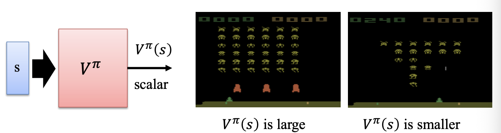

状态价值函数：

$$
V^\pi(s)=\mathbb{E}_{\pi}[r_t+\gamma r_{t+1}+\gamma^2r_{t+2}+\cdots|s_t=s]
$$

- 如果 $V^\pi(s)$ 很大，说明从这个状态出发，在当前策略下预期能获得较高回报。

## 2. How to Estimate $V^\pi(s)$

### 2.1 Monte-Carlo Approach

MC 方法：**让 critic 观察 actor 玩完整个 episode**

- 从看到状态 $s_t$ 开始，直到 episode 结束，累计得到的 reward 为：

$$
G_t=r_t+\gamma r_{t+1}+\gamma^2r_{t+2}+\cdots
$$

- 可以用 $G_t$ 作为 $V^\pi(s_t)$ 的监督信号：$V^\pi(s_t)\approx G_t$

优点：估计直观，不需要 bootstrapping
缺点：必须等 episode 结束，长 episode 中学习反馈太慢，方差较大

### 2.2 Temporal-Difference Approach

TD 方法不等到 episode 结束，而是利用一步之后的 value 进行更新：

$$
V^\pi(s_t)\approx r_t+\gamma V^\pi(s_{t+1})
$$

TD error：

$$
\delta_t=r_t+\gamma V^\pi(s_{t+1})-V^\pi(s_t)
$$

Critic 可以最小化：

$$
L=(r_t+\gamma V^\pi(s_{t+1})-V^\pi(s_t))^2
$$

!!! tip "MC vs TD"

    - **Monte-Carlo**：等到最后，用真实累计回报更新，bias 小但 variance 大
    - **Temporal-Difference**：边走边更新，使用当前 value 估计作为 bootstrap，bias 较大但 variance 较小

## 3. Actor-Critic

!!! bug

    回忆 REINFORCE 的梯度公式：

    $$
    \nabla \bar{R}_{\theta^\pi}\approx \frac{1}{N}\sum_{n=1}^{N}R(\tau^n)\nabla\log P(\tau^n|\theta^\pi)
    $$

    **问题**： 计算的是整条轨迹的总回报，方差极大。
    <u> 即使三个轨迹中 agent 的动作几乎一样，回报差异巨大 → 梯度估计抖动严重</u>

==Actor-Critic== 同时学习 policy 和 value function：

- Actor：$\pi_\theta(a|s)$，负责选择 action
- Critic：$V_\phi(s)$，负责评价 state 或 action 的好坏
基本流程：
1. Actor 与环境交互，采样 trajectory
2. Critic 根据 MC 或 TD 学习 $V^\pi(s)$
3. Actor 根据 critic 的评价更新策略

!!! note "Structure"

    
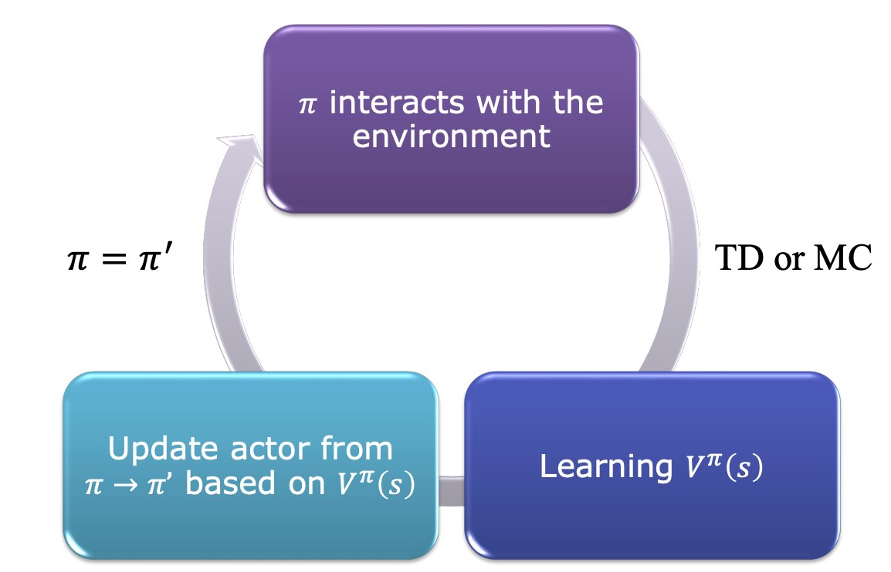

    Actor 和 critic 的网络参数可以部分共享：

    - 前面的 representation layers 共享，最后分出 policy head 和 value head。

## 4. Advantage Actor-Critic

直接用 $Q^\pi(s, a)$ 做评分有高方差问题（因为 $Q$ 值本身的尺度很大），因此引入 **Advantage Function**

- ==Advantage Function== 衡量的是：某个 action 比当前状态下的平均水平好多少

$$
A^\pi(s_t,a_t)=Q^\pi(s_t,a_t)-V^\pi(s_t)
$$

- 在 TD 形式中，可以用 TD error 近似 advantage：

$$
A^\pi(s_t,a_t)\approx r_t+\gamma V^\pi(s_{t+1})-V^\pi(s_t)
$$

!!! tip "Baseline"

    -  $V^\pi (s)$ 就是 baseline，它满足 $\mathbb{E}_{a~\pi}[\nabla_\theta \log\pi(a|s)\cdot b(s)]=0$
        - 而且只依赖于 $s$，不依赖于 $b (s$)，因此**不会改变梯度的期望方向**，但可以有效降低方差
        - baseline 是“参考线”，减去它后，梯度信号只反映"比参考好/差"，去掉了绝对值波动

### 4.1 Intuition

如果**Advantage Function**为正：

$$
\text{Advantage Function}= r_t- (\gamma V^\pi(s_{t})-V^\pi(s_{t+1})) >0
$$

- 说明实际拿到的 reward $r_t^n$ 比 critic 原本预期的结果更好 $\rightarrow$ 增加 $\pi_\theta(a_t|s_t)$

如果**Advantage Function**为负：

$$
\text{Advantage Function}= r_t- (\gamma V^\pi(s_{t})-V^\pi(s_{t+1})) <0
$$

- 说明结果比预期更差，advantage 为负：减少 $\pi_\theta(a_t|s_t)$

Policy Gradient 可以改写为：

$$
\nabla_\theta \bar{R}_{\theta}\approx \frac{1}{N}\sum_{n=1}^{N}\sum_{t=1}^{T_n}A^\pi(s_t^n,a_t^n)\nabla_\theta\log\pi_\theta(a_t^n|s_t^n)
$$

### 4.2 Entropy Regularization

Actor-Critic 常加入 entropy regularization：

$$
H(\pi(\cdot|s))=-\sum_a\pi(a|s)\log\pi(a|s)
$$

- 更大的 entropy 表示策略更随机，有助于 exploration
- 训练时可以鼓励 actor 保持一定随机性，避免过早陷入局部最优。

## 5. Asynchronous

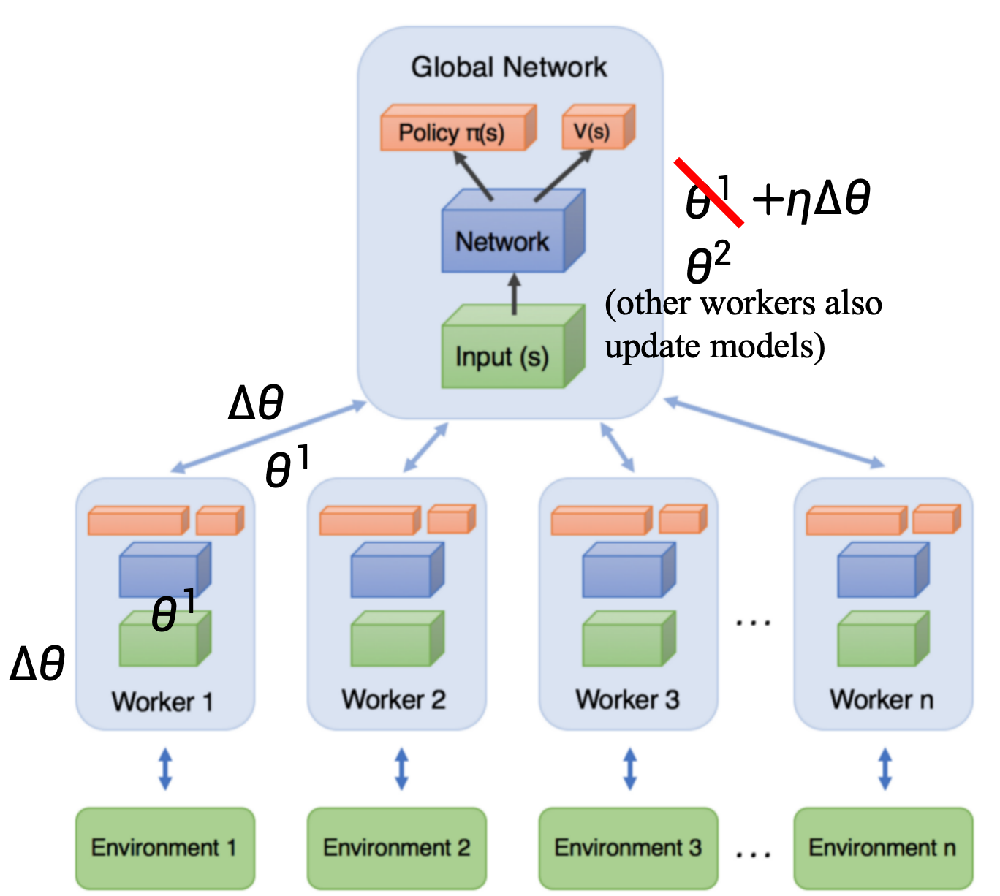

核心思想是同时运行多个 worker：

1. 每个 worker 复制一份 global parameters
2. worker 与自己的环境交互，采样数据
3. worker 在本地计算 actor 和 critic 的梯度
4. 将梯度异步更新到 global model
5. 其他 worker 也同时更新 global model

!!! info "Why Asynchronous"

    异步训练的好处：

    - 多个 worker 产生不同的数据，降低样本相关性
    - 不需要单一 replay memory 也能获得较丰富的经验
    - 提高采样效率
    - 多个 actor 同时探索，可以缓解局部最优问题
