# How to train your LLM

!!! bug

    LLM is too LARGE

    
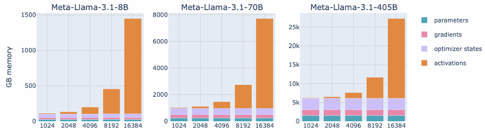

    训练 LLM 最大的困难不是不会写训练代码，而是模型、梯度、优化器状态、激活值加起来，单张 GPU 根本放不下。问题出在<u>显存和算力</u>，解决办法主要是**多卡切分**、**激活优化**和**量**化。

---

## Introduction

1. **Forward & Backward pass**
    - LLM weights → loss → backpropagation → gradients → optimizer
    - **训练比推理更吃显存**：推理只要保留前向所需内容，而训练还要额外保存：参数本身、梯度、优化器状态、反向传播要用到的激活值

    
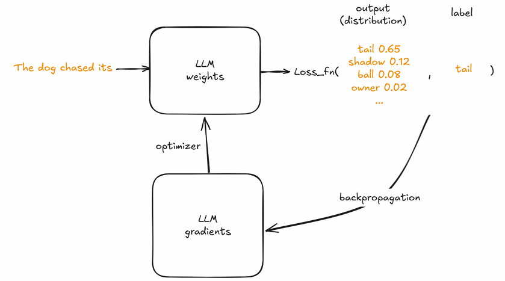

2. **Memory needed, assuming LLM is a 8B model**
    - 8B 大约是80 亿参数，如果一个参数用 32-bit = 4 bytes 存：

$$
8\times 10^9 \times 4 \text{ bytes} = 32\times 10^9 \text{ bytes} \approx 32 \text{ GB}
$$

    
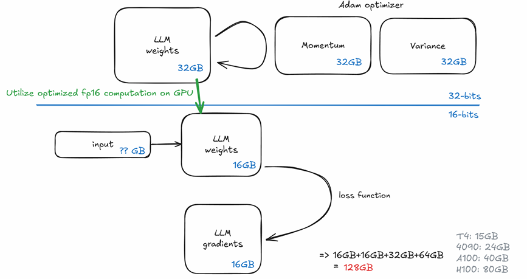

!!! info

    在主流的 **Adam 优化器 + 混合精度** 方案中，显存被分配到了以下两个区域：
    **A. 16-bit 区域（用于高速计算）**
    为了加快 GPU 运算速度，前向和反向传播使用 FP 16：

        1. LLM weights (16-bit)：16 GB，这是模型在计算时实际读取的参数
        2. LLM gradients (16-bit)：16 GB，反向传播产生的梯度，用于更新权重

    **B. 32-bit 区域（用于保证精度的 Master Copy）**
        为了避免舍入误差导致模型不收敛，Adam 优化器需要在后台维护一份高精度的“账本”： 

        3. LLM weights (32-bit)：32 GB，也叫 Master Weights，更新时会将梯度加到这里 
        4. Momentum (32-bit)：32 GB，Adam 的一阶动量
        5. Variance (32-bit)：32 GB，Adam 的二阶动量

3. **Activations**
    - 在长上下文训练时，**激活值经常才是占比最大的数据**
    - 训练时反向传播要依赖前向中间结果。如果每一层、每个 token 的中间张量都存下来，显存会随着<u>层数增加、batch 变大、序列变长</u>而迅速上涨

    
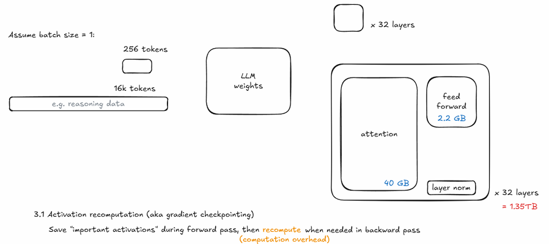

4. **batch size** 
    - batch size should be **large enough** to provide clear gradient. 
    - Generally 4-60M tokens per batch. 
    - (DeepSeekV3 uses batch size 1920 for 32K context, which is 61M tokens)

---

## Part I: parameters, gradients and optimizer states

### 1. How to leverage multiple GPUs? 

- We have to compute billions of optimization steps, with large batch size 
- The model may be too large to fit in a single GPU 
- The input can be long. Self-attention takes $O(N^2)$ memory.

所以只靠“把同一份模型复制到多张卡上做普通数据并行”通常不够，因为每张卡还是得各自保存一整份参数、梯度、优化器状态。

### 2. ZeRO

DeepSpeed- Zero Redundancy Optimizer (ZeRO)

#### ZeRO-1

**优化器状态（Optimizer States）** 通常占据了显存的大头
（例如 Adam 优化器需要为每个参数维护 32 位的 Master Weights、Momentum 和 Variance）

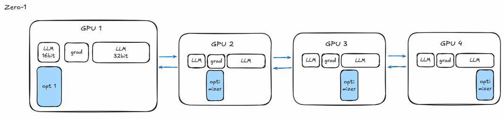

- ZeRO-1 将 FP32 的优化器状态切分成 $N$ 份（$N$ 为 GPU 数量），每个 GPU 只负责维护和更新其中的 $1/N$
- 更新完后，通过 All-gather 操作让所有 GPU 获得更新后的参数
- 显存占用大幅下降（约减少到原来的 1/4），且**不增加**额外的通信量

#### ZeRO-2

- **切分梯度**：每个 GPU 在反向传播计算出梯度后，只保留属于自己负责的那部分对应的梯度
- 使用 Reduce-scatter 来同步梯度，计算完后丢弃不需要的部分
- 进一步降低显存压力，通常能支持更大的 Batch Size

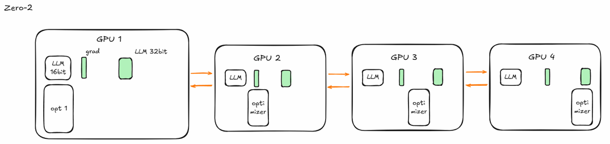

#### ZeRO-3

- **LLM 16-bit (参数)**：不再在每张卡上存储完整复本，而是**所有状态全部切分**
- 每个 GPU 只存储 $1/N$ 的参数、梯度和优化器状态
- 在**前向传播**时，当计算到某一层，GPU 会从其他卡 All-gather 拿到该层所需的参数，计算完立即释放；在**反向传播**时，同样按需获取参数
- 它允许在有限的显存下训练超大规模模型，但对网络带宽（如 NVLink）的要求极高

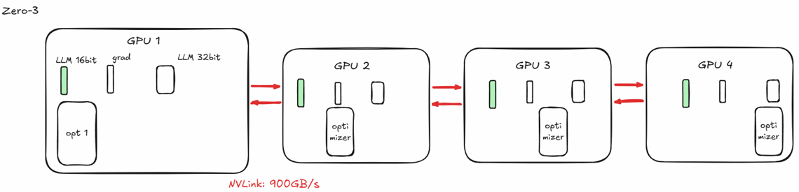

### 3. Memory Reduction

Training speed 

- Varies based on network bandwidth, model size, and specific hardware configuration.
- Generally, **it will not slow down by an order of magnitude**.

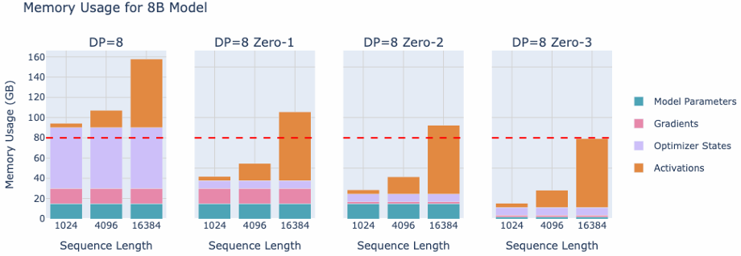

### 4. ZeRO-Offload

当 GPU 显存实在太小（比如只有一张 24 GB 的 4096），连 ZeRO-3 都无法解决问题时，就需要用到 **Offload**。它的核心逻辑是：**借用 CPU 的内存（System RAM）来存数据**

- 4.1 Optimizer Offload
    - 将最占空间的 **32-bit 优化器状态** 和 **梯度** 放在 CPU 内存里
    - GPU 只负责计算 FP16 的前向和反向，算完梯度后传给 CPU，CPU 在内存里完成复杂的 Adam 更新，再把更新后的权重传回 GPU
- 4.2 Param Offload
    - 做得更绝，**16-bit 模型参数** 也平时放在 CPU 里
    - 只有在计算到某一层时，才把该层的参数临时拉到 GPU，算完立刻踢出去
- 代价：<u>速度变慢</u>

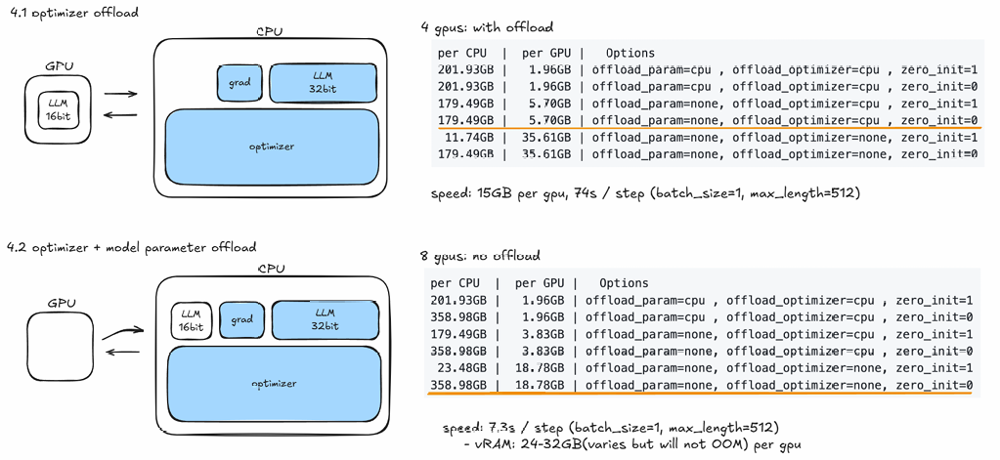

---

## Part II: activations

### 1. Kernel

此处指计算时的**算子**，越底层的语言性能越好

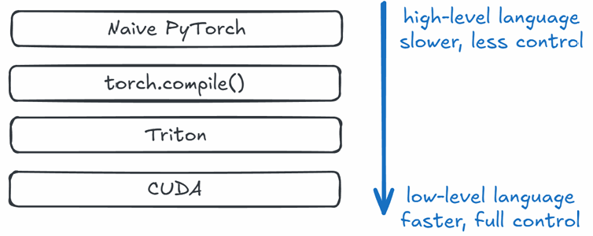

### 2. Flash Attention Algorithm

Faster training & less memory by optimized fetching from CPU RAM

- **标准 Attention**：$O(N^2)$
    在计算 $Q \times K^T$ 时，会生成一个大小为 $N \times N$ 的中间矩阵（Attention Score）  
- **Flash Attention**：Near $O(N)$
    它通过分块计算，不需要在显存中存储完整的矩阵，从而将空间占用降到了接近线性

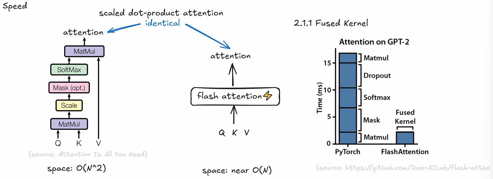

!!! info "Fused Kernel"

    传统的 PyTorch ：写代码调用 `softmax(QK^T / scale)V` 时，GPU 实际上是在做多次往返

    1. 计算 **MatMul**，结果写回显存（HBM）

    2. 从显存读出结果，做 **Mask**，再写回

    3. 从显存读出，做 **Softmax**，再写回

    4. ...以此类推

    <u>瓶颈： GPU 的计算速度极快，但读写显存（I/O）相对很慢。</u>

    Flash Attention 的实现：使用了一个 **Fused Kernel（融合算子）**

    - 它将 MatMul、Mask、Softmax、Dropout 等所有步骤**打包**成一个操作。

    - 数据被加载到 GPU 内部极快的 **SRAM**（高速缓存）后，在里面一口气完成所有计算，最后只把最终结果写回显存。

### 3. Liger Kernel

通过 **Triton**（OpenAI 开发的并行编程语言）重写 Transformer 模型中最耗显存和计算的部分，从而降低训练成本，提升模型效果

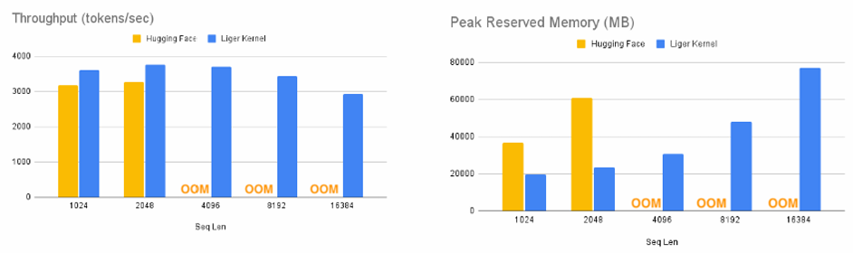

---

## Part III: Quantization

### 1. Lossy compression

通过降低模型参数的**精度**（高精度的浮点数压缩到低精度的整数），来减少模型的显存占用

- **Quantization Algorithm**：将 32 位的数据映射到更低位数的表示
- **Dequantization Algorithm**：数据平时以低精度存储在显存里（节省空间），但在计算时，会通过算法将其还原回高精度进行矩阵运算

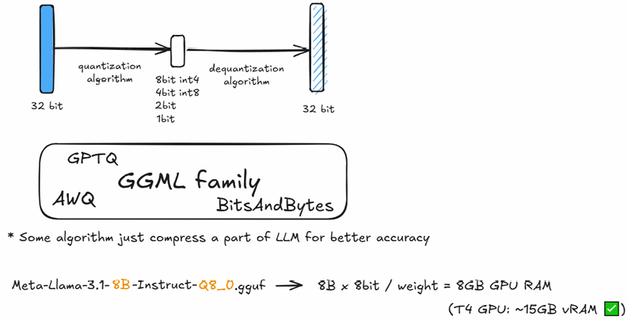

