# Transformers

## 1. Self-attention

!!! note "Attention（注意力机制）"

    最早的相关论文 [Attention is all you need.](https://arxiv.org/abs/1706.03762)
    李宏毅深度学习的笔记里有 [Self-attention](../DeepLearning/Chapter6.md) 的具体介绍

---

## 2. Attention Visualization

**直观的连线与权重表示** 

- 可视化图表通常通过将输入句子的单词排列在两侧（或上下），并在它们之间画线来展示关系。
- 线条的粗细或颜色的深浅代表了**注意力权重（Attention Weight**）的大小。线条越深或越粗，说明在编码当前词时，模型对另一个词的“关注度”越高、提取的信息越多。

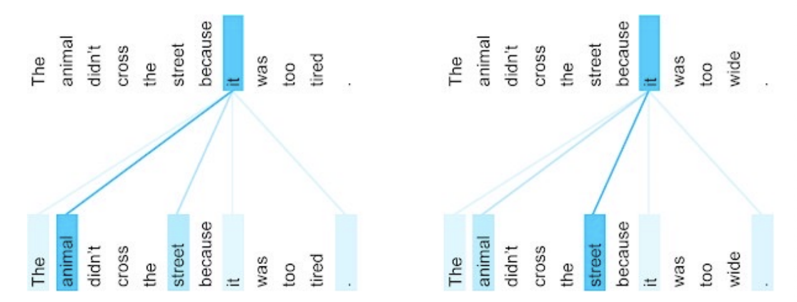

- 这是从一个经过英法翻译训练的 Transformer 模型的第 5 层到第 6 层的自注意力分布中截取的（展示了 8 个注意力头中的其中一个），这证明了模型能够根据上下文动态调整词向量的语义。

**Multi-head Attention 的协同作用**

- 包含多种颜色线条交织的复杂图表

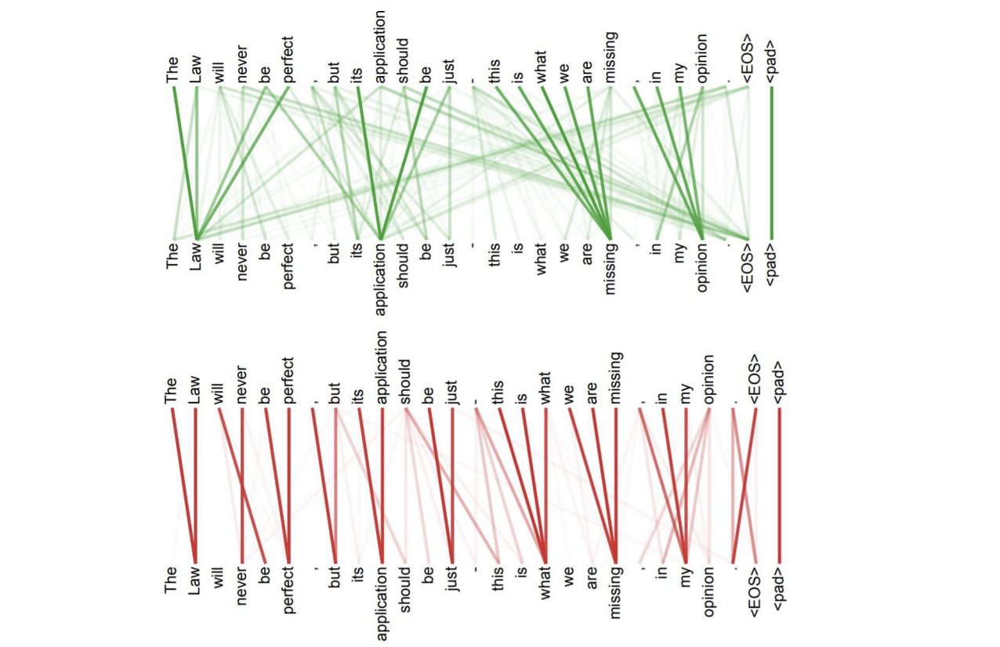

- 在这些图中，不同的颜色代表了模型中不同的注意力 **“头（Head）”**
- 多头机制的作用：它允许模型在同一时间，让不同的“头”去关注不同维度的语言特征，最终将这些信息综合起来得出结果。

---

## 3. Transformer

==Transformer 架构==是由 Vaswani 等人在 2017 年的经典论文《Attention is All You Need》中提出的一种具有里程碑意义的深度学习模型。它彻底抛弃了传统的 RNN 架构，**完全基于注意力机制（Attention）来构建端到端（Sequence-to-Sequence）模型**。这种设计不仅大幅提升了模型在翻译等任务上的表现，还因为主要依赖矩阵乘法，极大地提高了并行计算的速度。

!!! note "Seq2seq with Attention"

    
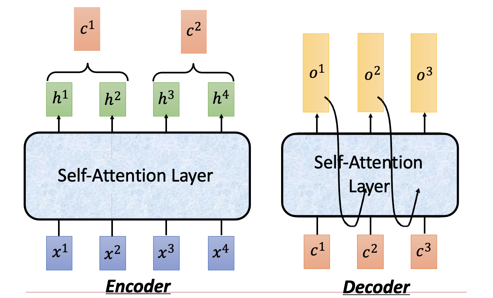

### 3.1 Transformer Architecture

整体架构为 ==Encoder-Decoder 架构==：

- Transformer 遵循 Seq2Seq 框架，分为编码器（Encoder）和解码器（Decoder）两部分。模型由多个相同的层堆叠而成（图中标记为 $N \times$），包含以下核心子模块：
    - 多头注意力层（Multi-Head Attention）
    - 前馈神经网络（Position-wise Feed-Forward Networks）
    - 残差连接与层归一化（Add & Norm / Layer Norm）

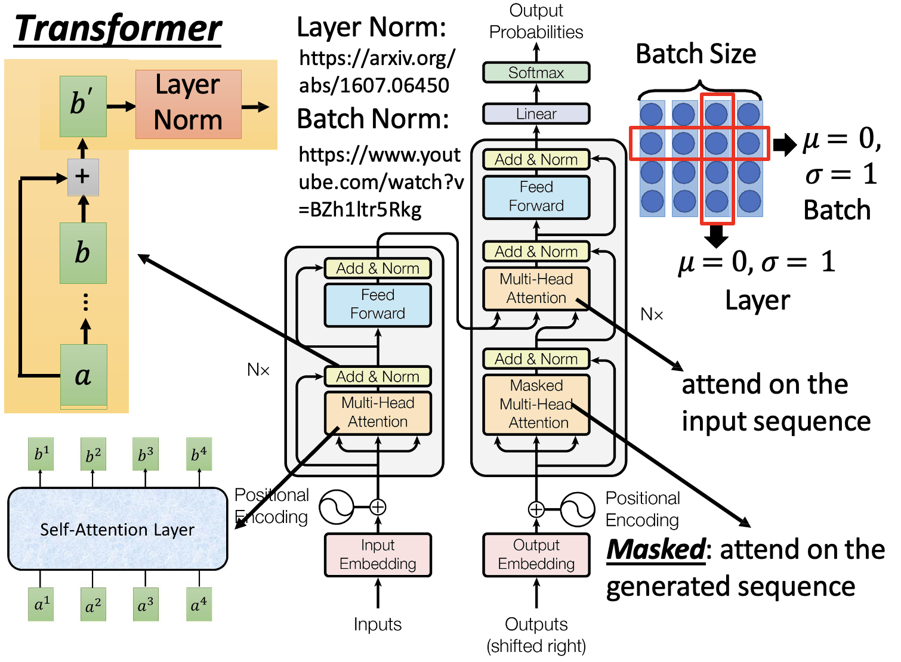

### 3.2 Attention Mechanism

!!! note "Self-Attention & Scaled Dot-Product"

    **注意力分数计算**

    - 通过权重矩阵 $W_q, W_k, W_v$ 将输入映射为三个独立的向量：
      查询向量（Query, $q_i$）、键向量（Key, $k_i$）和值向量（Value, $v_i$）
    - 将所有的 $q$、$k$、$v$ 拼接成矩阵 $Q, K, V$

    $$
    \text{Attention}(Q, K, V) = \text{softmax}(\frac{QK^T}{\sqrt{d_k}})V
    $$

    - ==缩放（Scaled）==：当向量维度变大时，点积的绝对值会急剧增加，导致 Softmax 函数进入梯度极小的区域。因此，Transformer 引入了缩放因子 $\frac{1}{\sqrt{d_k}}$（$d_k$ 是向量维度）来进行修正

在 Transformer 的编码器和解码器中，注意力机制在三个的地方发挥作用：

1. **Encoder 中的 Multi-Head Attention**：
    - Transformer 并行计算了多次注意力，这被称为“多头注意力”
    - 模型将输入映射到多个不同的线性子空间中（例如使用 $W_{q,1}​,W_{q,2}$），允许模型关注来自不同表示子空间的信息
    - 最终所有的 head 拼接在一起，并通过一个线性映射矩阵（$W_O$）输出
2. **Decoder 底部的 Masked Multi-Head Attention**：
    - 在训练时，虽然模型能看到完整的正确输出序列，但 Decoder 在预测第 $t$ 个词时解码器在生成序列时，不能“偷看”未来的词，所以必须加上掩码（Mask）
3. **Decoder 中部的 Multi-Head Attention (Cross-Attention)**：
    - Query 来源于 Decoder 上一步的输出，代表当前已经生成的语境和下一步的生成需求；Key 和 Value 则来源于 Encoder 的最终输出，代表源语言的全局上下文
    - Decoder 拿着当前的生成需求（$Q$），去源文本（$K, V$）中寻找最相关的线索

### 3.3 Add & Norm 

- **Add（残差连接）**：这里的黑线箭头就是一个跳跃连接（Skip Connection）
  输入 $a$ 在经过复杂的变换模块（绿色框 $b$）后，会和原始输入 $a$ 直接相加。这有效解决了[梯度消失](NLG_and_NMT.md)
- **Norm（层归一化）**：相加之后的结果会进入 Layer Norm 模块进行数据标准化，使其更利于网络训练

!!! warning "Layer Norm vs. Batch Norm"

    - **Batch Norm**（横向红框）：对一个 Batch 里所有样本的**同一个特征维度**求均值 $\mu=0$ 和标准差 $\sigma=1$。由于自然语言句子长度长短不一，如果在同一个特征维度上跨句子求均值，不仅没意义，大量无效填充（Padding）还会造成计算干扰。
    - **Layer Norm**（纵向红框）：是对**单个样本（单个词）的所有特征维度**求均值和标准差。不管句子多长，每个词都在自己的内部做标准化。

### 3.4 Positional Encoding

Original paper: each position has a unique positional vector $e^i$ (not learned from data) 

- In other words: each $x^i$ appends a one-hot vector $p^i$

下面介绍一种新型的位置编码方式：==RoPE==
**RoPE (Rotary Position Embedding, 旋转位置编码)**

1. **摒弃绝对位置相加**
    - 在最初的 Transformer 中，位置信息是通过生成**绝对位置向量**（Positional Encoding, PE），然后将其和输入向量直接相加
    - RoPE 采用**旋转矩阵相乘**来注入位置信息
2. **二维平面上的空间旋转**
    - **两两分组**：RoPE 将高维的词向量按顺序每两个维度分为一组，把它们看作是二维平面 $(x, y)$ 上的一个点或向量
    - **按位置旋转**：对于位置索引为 $m$ 的词，RoPE 会将它对应的二维向量旋转一个角度 $m\theta$。位置越靠后，旋转的角度就越大。公式表达为：

$$
\begin{pmatrix} x' \\ y' \end{pmatrix} = \begin{pmatrix} \cos m\theta & -\sin m\theta \\ \sin m\theta & \cos m\theta \end{pmatrix} \begin{pmatrix} x \\ y \end{pmatrix}
$$

!!! note "Benefits"

    **相对位置感知**

    - 在 Attention 中计算 Query 和 Key 之间的内积时，假设位置 $i$ 的词向量旋转了 $i\theta$，位置 $j$ 的词向量旋转了 $j\theta$，则**两者的内积只与夹角差 $(j-i)\theta$ 有关**
    - 这意味着模型可以感知到词语之间的**相对距离** $(j-i)$。这满足了 NLP 中<u>“词的相对位置比绝对位置更重要”</u>的直觉。

    **解决长序列外推问题**

    - 传统的位置编码在面对比训练时更长的序列时，表现往往会崩溃
    - 由于 RoPE 本质上是在二维平面上的周期性旋转，它对相对距离的表达更加稳定和平滑。这使得模型在面对极长的文本输入时，展现出了极其优秀的**外推（Extrapolation）能力**

---

## 4. Further Optimization

### 4.1 Transformers without Normalization

[Transformers without Normalization](https://arxiv.org/abs/2503.10622) (CVPR 2025)：
探讨如何移除 Transformer 架构中归一化层（Normalization）

- 研究表明，去除了归一化层并采用 DyT 的 Transformer 模型，在实际表现上能够**匹敌甚至超越**那些使用了归一化层的传统 Transformer

1. **核心发现：Layer Norm 本质上像 Tanh 函数**
   研究人员对视觉 Transformer（ViT）、语音模型（wav2vec 2.0）以及扩散 Transformer（DiT）中的层归一化（Layer Normalization, LN）进行了分析。他们发现，LN 在 Transformer 中产生的输入-输出映射关系，非常类似**缩放的双曲正切（scaled tanh）函数**。
    - 在较浅的网络层中，这种映射关系主要是**线性**的
    - 在更深的网络层中，映射会呈现出的“**S 型曲线**”，符合 tanh 函数的特征
2. 解决方案：**动态 Tanh 层（DyT）**
   基于这一发现，研究团队提出用==动态 Tanh 层==（Dynamic Tanh, 简称 DyT）取代常用的 Layer Norm 或 RMSNorm
    - **传统的 Transformer 模块**：
     输入数据 $x$ 会<u>先经过归一化操作</u>，再经过缩放与平移（scale & shift），然后才进入注意力机制（Attention）或前馈神经网络（FFN）
    - **Block with DyT**：
     移除了归一化步骤，让输入 $x$ 经过一个 $\tanh(ax)$ 函数，随后进行缩放与平移

### 4.2 MLP-Mixer

==MLP-Mixer== 是一种与 Transformer *截然不同*的模型架构，它的核心特点是**完全不使用**注意力机制，而是纯粹依赖**多层感知机（MLP）** 来构建网络。

!!! abstract

    MLP-Mixer 证明了即使不依靠复杂的自注意力机制，仅仅通过简单的全连接层在“空间（Patch）”和“特征（Channel）”两个维度上交替混合信息，也能构建出强大的深度学习架构。

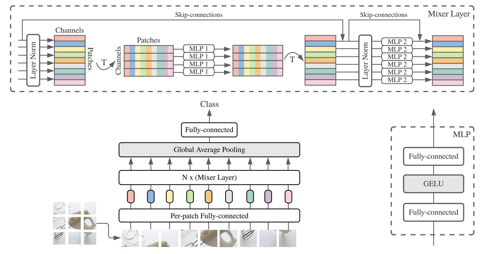

**1. 输入处理（Patches）**

- MLP-Mixer 先将输入分割成固定大小的多个**小块（Patches）**
- Patches 经过全连接层（Per-patch Fully-connected），被映射为特征向量

**2. 混合层（Mixer Layer）** 
模型的主体是由 $N$ 个 Mixer Layer 堆叠而成的。每个 Mixer Layer 主要包含两个交替的 MLP 模块，用于在不同维度上混合信息：

- **MLP1（跨 Patch 混合）**：
    - 模型通过 Layer Norm 和转置（T），将数据维度翻转
    - 在不同的 Patches 之间进行计算，整合不同空间位置（上下文）的信息
- **MLP2（跨通道混合）**：
    - 再次转置后，数据进入 MLP2
    - 在通道（Channels）维度上进行计算，整合每个位置内部的深层特征信息
- **Skip-connections**：与 Transformer 类似，这两种 MLP 操作的前后都加入了跳跃连接，以确保深层网络的梯度传递和有效训练。

### 4.3 Linear Attention

==线性注意力(Linear Attention)== 本质上是对传统 RNN 和传统自注意力机制（Self-Attention）的一种极限简化与融合

- Linear Attention is RNN without forget gate $f_{A,t}$
- Linear Attention is Self-attention without Softmax

在一个标准的 RNN 模型中，隐藏状态 $H_t$ 和输出 $y_t$ 定义如下：

- 状态更新：$H_t = f_{A,t}(H_{t-1}) + f_{B,t}(x_t)$ 
- 输出计算：$y_t = f_{C,t}(H_t)$

!!! tip "How to parallel"

    在标准的 RNN 中，$H_t$ 的计算非常复杂。为了实现并行，引入一个极端的简化操作：**去掉 RNN 的遗忘门/状态转换函数**，即假设 $f_{A,t}(H_{t-1}) = H_{t-1}$。此时，隐藏状态的更新变成了一个简单的累加过程：

    $$
    H_t = H_{t-1} + f_{B,t}(x_t)
    $$

    令 $D_t = f_{B, t}(x_t)$，则隐藏状态 $H_t$ 等于所有输入变换矩阵 $D$ 的累加：

    $$
    H_t = D_1 + D_2 + ... + D_t
    $$

    在上述基础上，引入**注意力机制**中的 Query ($q$)、Key ($k$)、Value ($v$) 概念：

    - $q_t=W_q x_t, k_t=W_k x_t,v_t=W_v x_t$
    - 并令 $f_{B, t}(x_t) = v_t k_t^T$, $f_{C,t}(H_t)=H_t q_t$，可以得到 $y_t$ 的计算公式：

    $$
    \begin{align}
    y_t &= (D_1 + D_2 + \dots + D_t) q_t \\
    &= v_1 a_{t,1} + v_2 a_{t,2} + \dots + v_t a_{t,t} \\
    &= a_{t,1}v_1 + a_{t,2}v_2 + \dots + a_{t,t}v_t
    \end{align}
    $$

### 4.4 Retention Network

RetNet 是在 Linear Attention 基础上提出的架构，它解决了 "Linear Attention never forget" 的缺陷，使模型能够更灵活地处理上下文

- 引入了一个**固定衰减因子 $\gamma$**。

$$
H_t = \gamma H_{t-1} + v_t k_t^T
$$

#### 4.4.1 Gated Retention Network

- 模型通过当前输入 $x_t$ **动态计算**出一个门控值 $\gamma_t$
- 具体公式为：$\gamma_t = \text{sigmoid}(W_{\gamma} x_t)$

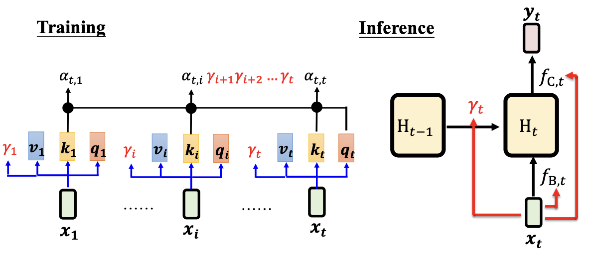

#### 4.4.2 More Variants

$$
H_t = G_t \odot H_{t-1} + v_t k_t^T
$$

- 引入**门控矩阵** $G_t$，符号 $\odot$ 表示逐元素相乘
- 模型在将新信息（$v_t k_t^T$）加入记忆之前，会先用 $G_t$ 对历史记忆 $H_{t-1}$ 进行筛选和过滤

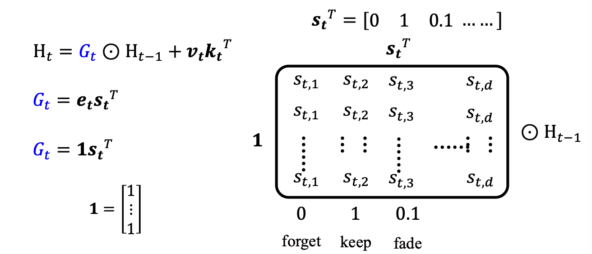

- 模型会为每一个维度生成一个控制向量 $s_t^T$，例如$s_t^T = [0, 1, 0.1, \dots]$
    - 0 代表 Forget：直接清零丢弃
    - 1 代表 Keep：100% 完整保留到下一步。
    - 0.1（介于 0 到 1 之间的值）代表 Fade：信息打折衰减

---

## 5. BERT and its variants

### 5.1 Pre-train Model

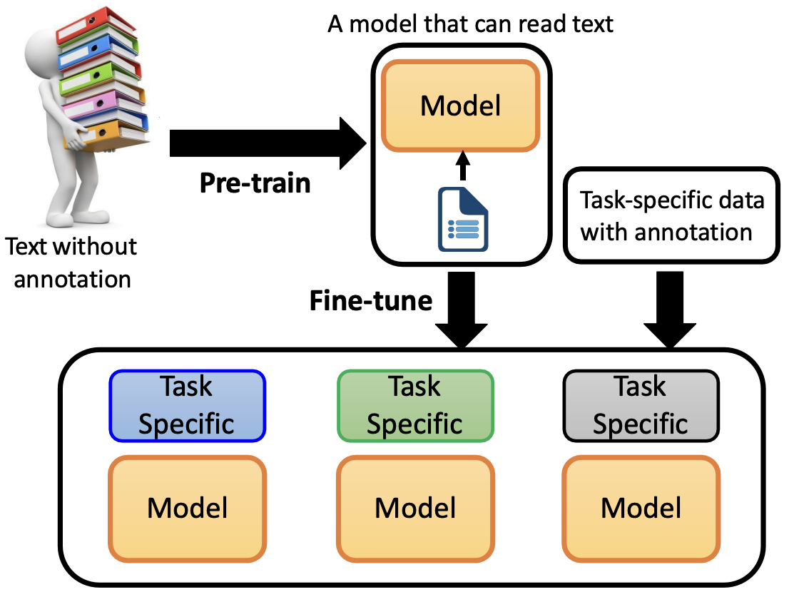

- Pre-train：采用无标注的数据，掌握基础语言能力
- Fine-tune：使用少量有标注的特定任务数据进行针对性训练，让模型适应具体需求
- Task Specific Model：同一个通用模型转化为多个解决不同问题的专用模型

#### 5.1.1 Word Representing

**Represent each token by a embedding vector**

1. 静态 Embedding（Word2vec、GloVe）
    - 每个 Token 对应固定的向量，通过“查表”获取
      The token with the same type has the same embedding.
    - 无法捕捉 Token 在不同语境中的语义变化，对生僻词/未登录词支持较差
2. 子词级 Embedding（FastText）
    - 将 Token 拆解为更小的子词单元
      如英文单词拆为字符/词根词缀，中文拆为部首/笔画，通过子词组合生成向量
    - 利用 Token 内部结构信息，增强模型的泛化能力
3. 字形结构 Embedding（CNN+汉字图像）
    - 将汉字视为图像，通过 CNN 提取特征（如笔画、部首），生成包含视觉信息的向量
    - 捕捉汉字的视觉结构关联，尤其适合处理生僻字、异体字

**Contextualized Word Embedding**

- 结合上下文，为同一个字生成不同的向量表示

#### 5.1.2 Different size of models

**Bigger model**

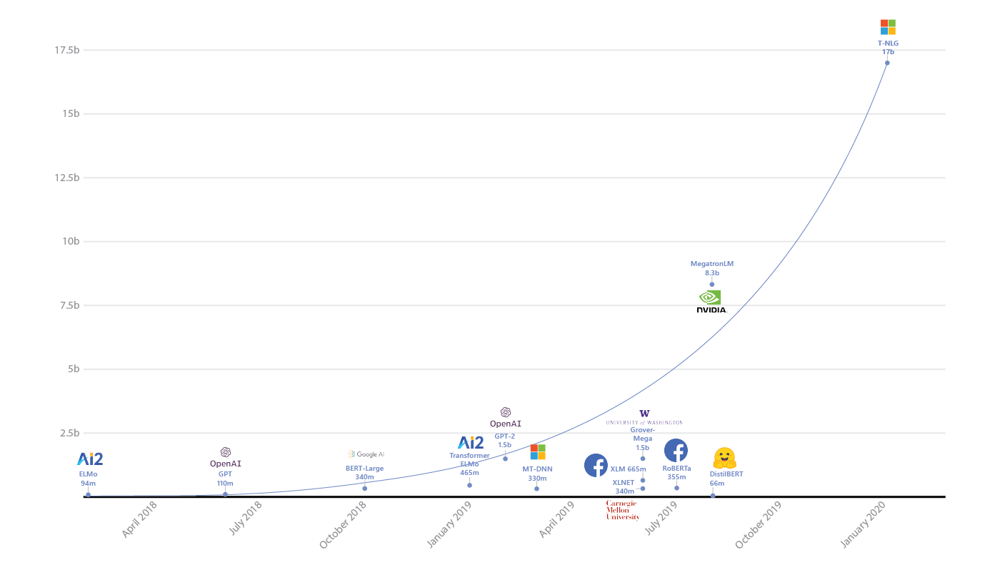

**Smaller Model**: using <u>network compression</u>

- Network Pruning：
  剪掉模型中不重要的连接，像修剪树枝一样，减少冗余
- Knowledge Distillation：
  让小模型模仿大模型的行为，用更小的体积实现类似的效果
- Parameter Quantization：
  降低参数精度，在不明显影响效果的前提下，大幅减小体积并提速
- Architecture Design：
  直接设计轻量级的网络结构，从源头上保证模型小巧高效。

### 5.2 How to fine-tune

**Pre-trained Model**

- 在海量通用数据（如维基百科、网页文本）上训练好的大模型（例如 BERT、GPT）
- 图底部的 $w_1, w_2, w_3, w_4$ 代表输入的单词或词向量。

**Task-specific Layer**

- 针对特定的自然语言处理任务（如情感分类、问答系统等）进行输出
- 原理：预训练模型本身只知道“语言知识”，不知道具体要做什么任务

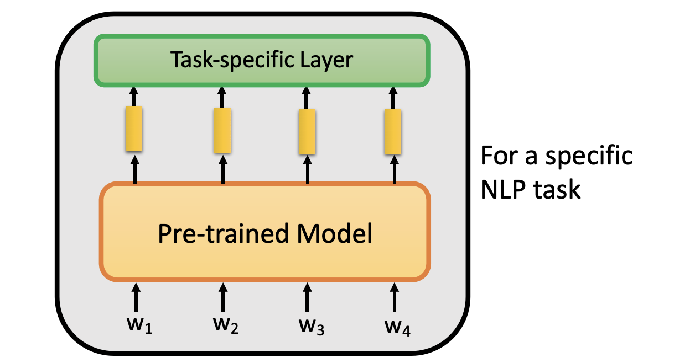

**数据流向**：<u>输入单词 -> 经过预训练模型提取特征 -> 进入特定任务层 -> 得到最终结果</u>

- 模型会在特定任务的数据集上继续训练（微调），以适应新任务

#### 5.2.1 Input

**Multiple sentences**
模型接收拼接后的完整序列（句子1 + 分隔符 + 句子2），对输入序列中的每个部分进行编码，输出包含上下文信息的特征表示

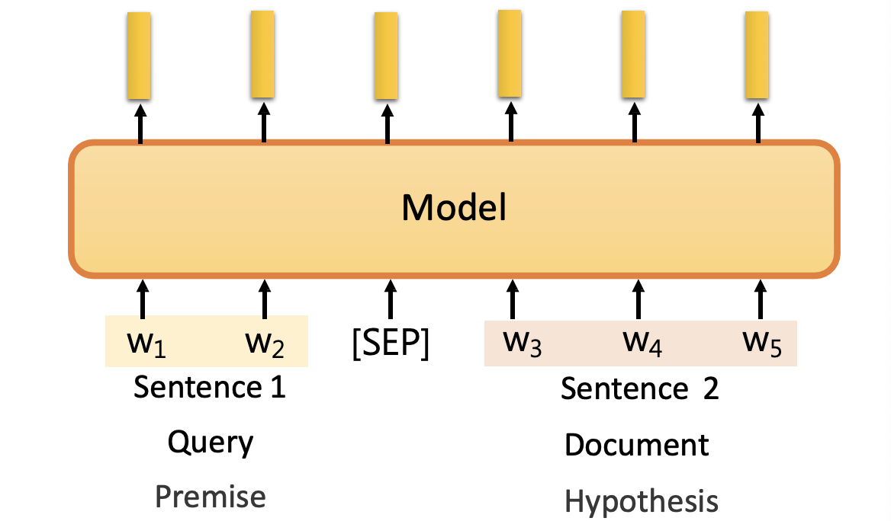

**句子拼接**

- Sentence1（左侧）：由单词 $w_1, w_2$ 组成
- Sentence2（右侧）：由单词 $w_3, w_4, w_5$ 组成
- \[SEP\]标记：一个特殊的分隔符，这是 BERT 等模型处理双句任务的标准格式

#### 5.2.2 Output

1. **One class**：最基础的输出模式

    
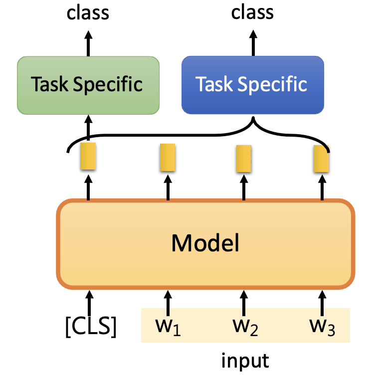

    - 模型只取输入序列中第一个 token（即 \[CLS\]）经过模型编码后的输出向量，将其送入分类器（Task Specific 层）
    - 因为 \[CLS\] 在预训练中聚合了整个句子的信息，所以适合做全局判断
    - 应用场景：情感分析、文本分类

!!! info "[CLS] 如何训练得出？"

    - **初始状态**：刚开始 [CLS] 向量是随机的
    - **训练机制**：
        - **输入**：[CLS] 和其他词一起输入
        - **交互**：通过 self- attention， [CLS] 会看整句话的内容并整理信息
        - **目标**：在训练时，强制要求模型只用 [CLS] 最终输出的那个向量来做预测
        - **结果**：为了能预测对，模型不断调整参数，让 [CLS] 整合句子的关键信息

2. **class for each token**
    - 模型关注序列中的每一个标记（包括 $w_1, w_2, w_3$）
    - 输入序列中的每个标记都对应一个输出向量，然后每个向量经过一个特定任务层，独立地预测一个类别
    - 应用场景：命名实体识别（识别句子中哪些词是人名、地名）、词性标注
3. **copy from input**
    - 模型的输出不是生成新的文本，而是直接从输入文本中复制一段连续的内容

    
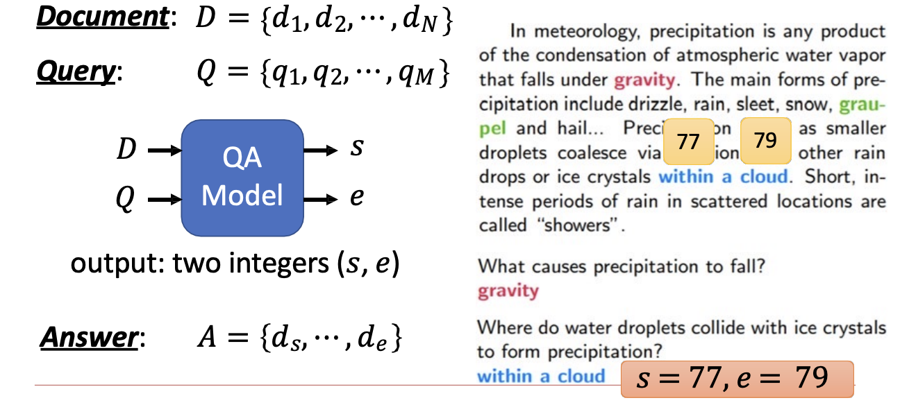

    - 如图，将文本内容分别和“起始向量”、“结束向量”求相似度（点积）
        - 橙色代表“起始向量”，蓝色代表“结束向量”
        - 结果通过 softmax 后，可以看到 $d_3$ 是结束位置的概率最大

    
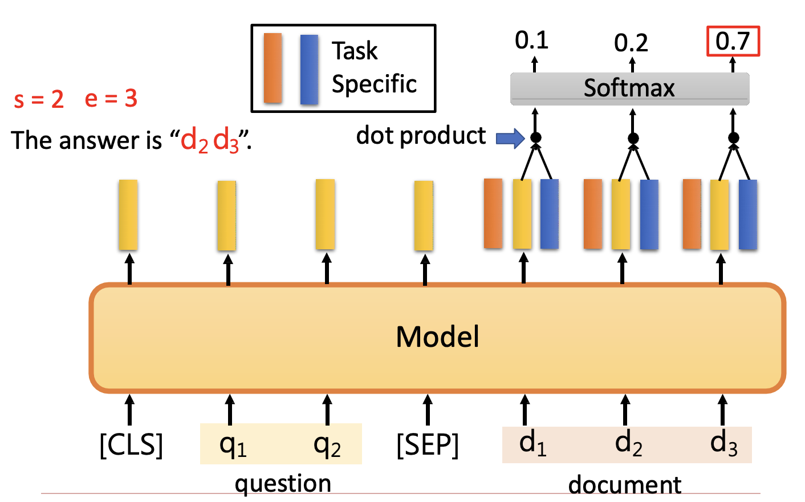

4. **General Sequence**
   Seq2Seq Model
    - 输入和输出是完全分离，解码器从零开始生成全新的输出序列

     
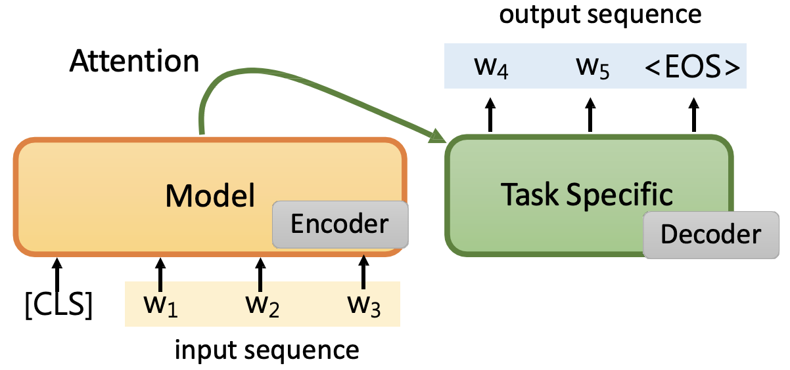

   =="Decoder-only"==，GPT 系列采用的架构

- 不再区分编码器和解码器，只有一个统一的模型
- 模型从左到右依次生成，生成 $w_3$ 后，把它作为输入的一部分，再去预测 $w_4$，以此类推

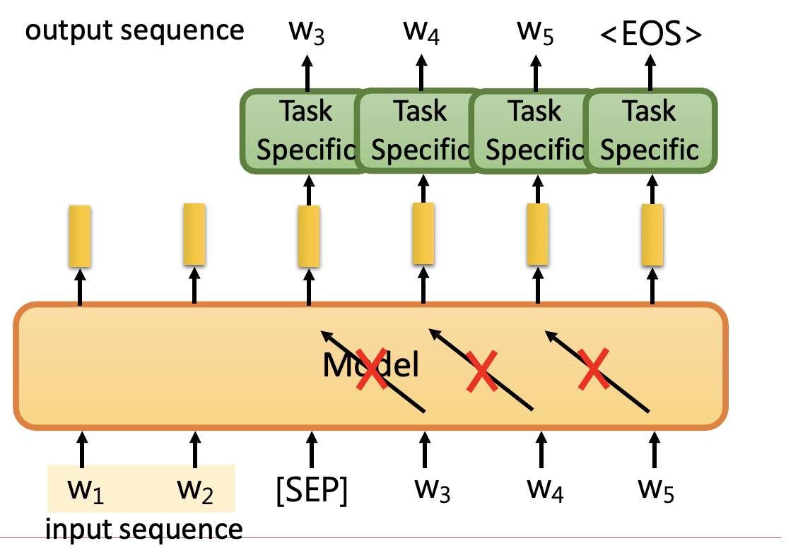

#### 5.2.3 Full Fine-tuning & Feature Extractor

##### Full Fine-tuning

整个模型（包括预训练层和任务特定层）都会在下游任务（Down-stream tasks）的数据上进行训练

- 操作方式：加载预训练的权重作为初始值，然后通过反向传播（Backpropagation）更新**所有**参数

##### Feature Extractor / Linear Probing

**把预训练模型作为一个固定的工具，用来提取输入数据的特征**

- **冻结** 预训练模型的所有参数，只对“任务特定层（Task-specific layer）”进行训练

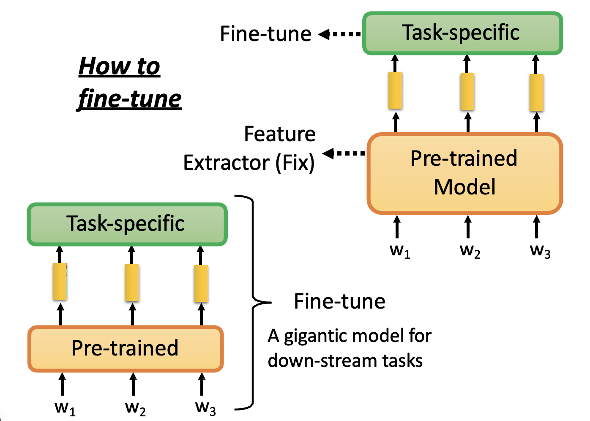

两者的折中方案： 使用 **PEFT (Parameter-Efficient Fine-Tuning)**

#### 5.2.4 Adapter-based Tuning

**参数高效微调 (PEFT, Parameter-Efficient Fine-Tuning)** 技术的一种早期代表方案

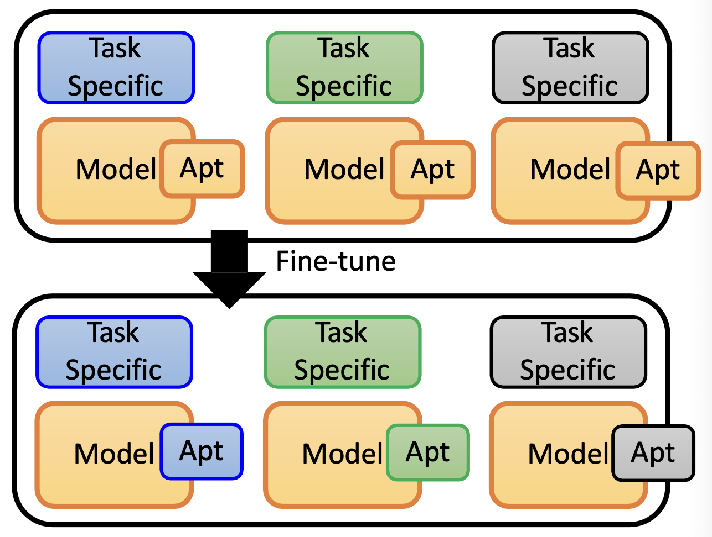

**冻结原始 pre-train model 的参数，只针对 Task Specific 和 Apt 模块进行参数更新**

- 存储成本低：adapter 文件很小
- 训练效率高：更新的参数量极少，训练时的梯度计算和显存压力显著减小
- 防止灾难性遗忘： 原始模型参数根本没动，它原本具备的通用知识得到保留

!!! info "Adapter"

    [Houlsby, et al., ICML’19](https://arxiv.org/abs/1902.00751)
    **在标准 Transformer 的每个子层之后都插入了一个 Adapter**：确保模型在处理完“注意力关系”和“特征变换”后，都能立即通过一个可学习的“补丁”来调整输出，使其适配下游任务。

    
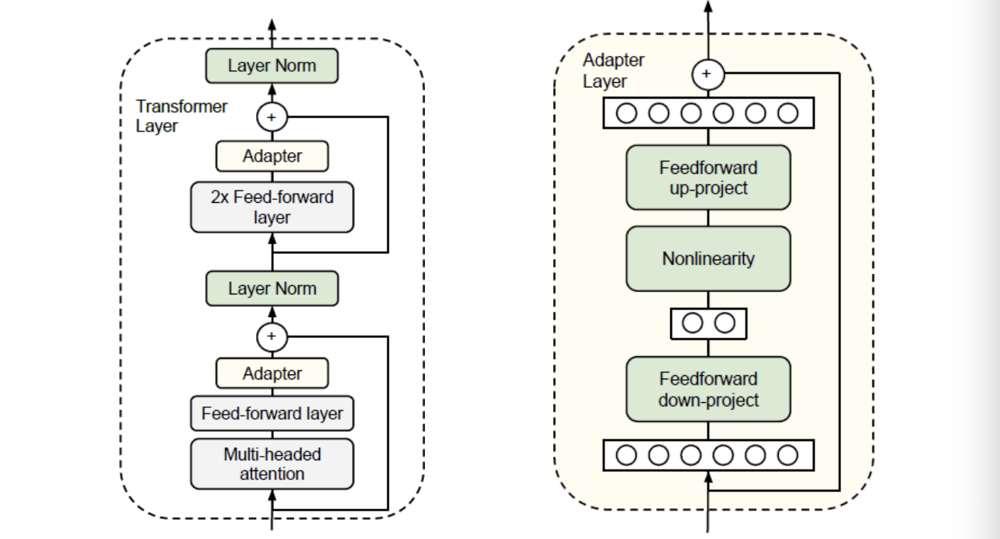

    Adapter 采用了==瓶颈（Bottleneck）结构==：

    - **Feedforward down-project：** 将高维的输入特征映射到一个极低维的空间
    - **Nonlinearity：** 通常使用 ReLU 或 GELU。如果没有这一层，两次投影就退化成了单一的线性变换，失去了模拟复杂特征的能力
    - **Feedforward up-project：** 将低维特征重新映射回原始维度，以便与主干网络的输出进行叠加
    - **Skip-connection：** 在训练初期，如果 Adapter 的权重接近于 0，通过残差连接，输出就等于输入。这意味着模型即使加了 Adapter，**起步表现至少也是预训练模型的水平**，不会因为新增层没练好而改坏了原有特征

但上述方法需要在训练的一开始就在模型中加入 adapter，这非常不灵活，因此现在很少采用这种做法。更为流行的**参数高效微调**方式是 ==LoRA (Low-Rank Adaptation)==

- 冻结原始预训练模型权重，**只额外训练一小组低秩矩阵**来近似需要的权重更新
- 在原有线性层权重 $W$ 上，不学习完整的 $\Delta W$，而是学习低秩分解 $BA$，大幅降低了训练的参数量

!!! info "LoRA"

    假设原来某一层是线性变换：

    $$
    Y=Wx
    $$

    全量微调会直接更新整个 $W$, 但LoRA 不这么做，而是冻结 $W$，只学习：

    $$
    W' = W + \Delta W,\quad \Delta W = BA
    $$

    其中：

    - $A$ 和 $B$ 是两个小矩阵，它们的中间秩 $r$ 很小，远小于原始维度
    - 所以 $\Delta W$ 虽然看起来和 $W$ 同形状，但本质是由一个**低秩结构**生成的

    这就是“low-rank”的含义。原论文的核心假设是：**下游任务适配所需的权重变化，往往具有较低的“内在秩”**，因此没必要为每层学习一个完整的满秩更新。

#### 5.2.5 Weighted Features

**加权特征融合 (Weighted Features)** 在早期的预训练语言模型（**ELMo**）中非常常见

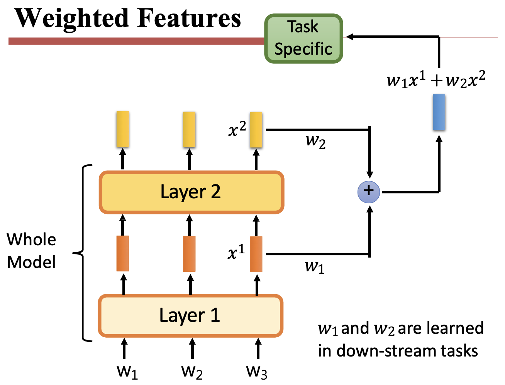

- $x^1$ 与 $x^2$： 分别代表第 1 层和第 2 层提取出来的特征向量（Embeddings）
- $w_1$ 与 $w_2$ (可学习权重)： 系统会为每一层分配一个权重，公式表达为

$$
Feature = w_1x^1 + w_2x^2
$$

    - 这里的 $w_1$ 和 $w_2$ 是在下游任务的训练过程中学习出来的，而不是预训练时确定的
- Task Specific：接收加权求和后的综合特征，进行分类、序列标注等最终任务

### 5.3 How to Pre-train

**Self-supervised Learning**：不依赖人工标签，而是从原始数据中自动构造训练目标

#### 5.3.1 Masking Input

- **BERT 采用的预训练方法：随机选一些 token，然后根据上下文预测原来的词**
    - 这种设计存在一个问题：<u>训练的情况和实际需要预测的情况存在偏差</u>
    - 原论文中，BERT 会先抽取 15% 的 token 作为预测目标；
    - 这些被选中的 token 里，80% 替换成 \[MASK\]，10% 换成随机词，10% 保持原词不变
- BERT 的思想和 CBOW 类似，但 BERT 采用了 **Transformer encoder**

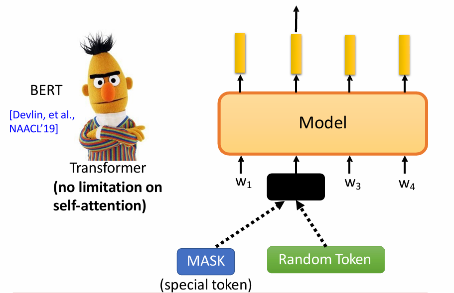

#### 5.3.2 Predict Next Token

==自回归语言模型（autoregressive language model）==

- OpenAI 在 GPT 早期论文里把这条路线称为 **generative pre-training**
- 即先在大量无标注文本上做语言模型训练，再迁移到下游任务

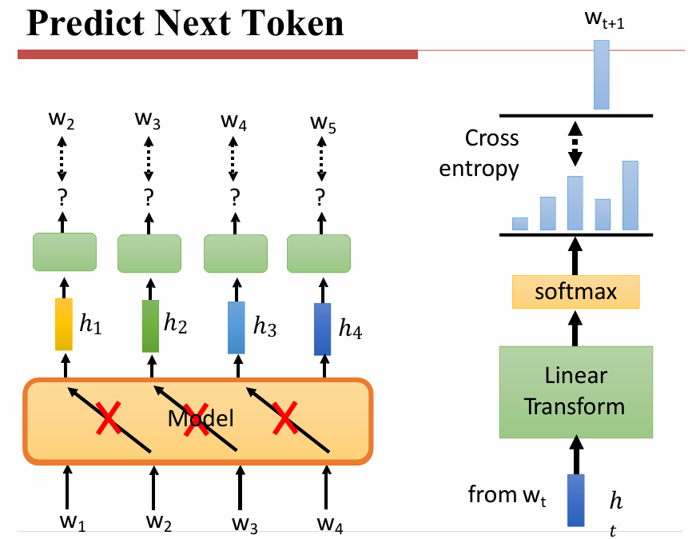

**训练过程**：

1. 模型先根据 $w_t$ 得到当前位置的隐藏状态 $h_t$
2. 经过一个线性层（Linear Transform）
3. 再经过 softmax，得到“下一个词是哪个”的概率分布
4. 然后用 **cross-entropy（交叉熵）** 去和真实的 $w_{t+1}$ ​ 比较，计算损失

#### 5.3.3 Predict Next Token - Bidirectional

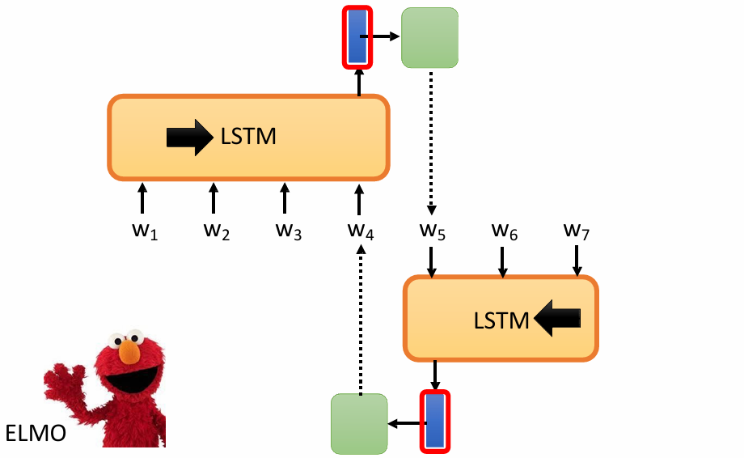

