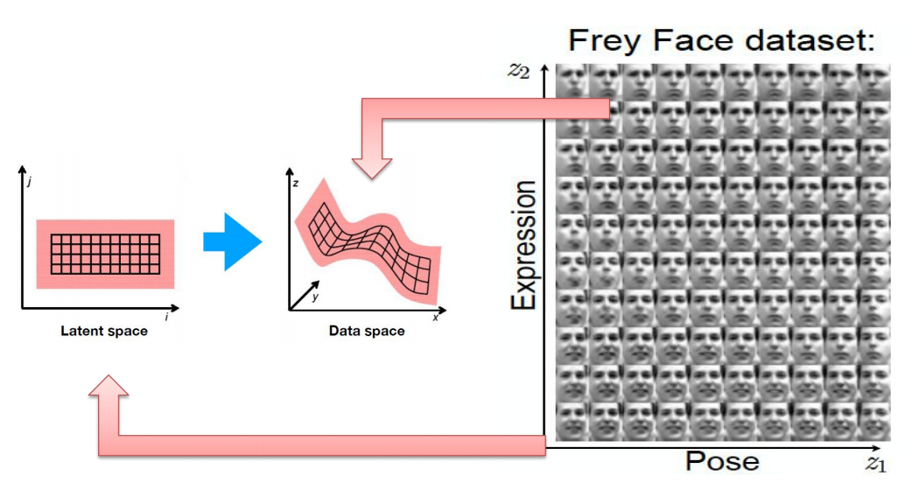
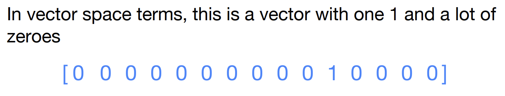
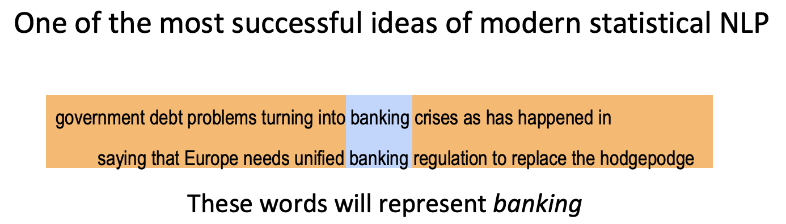
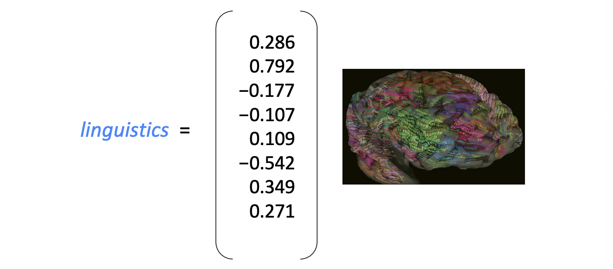
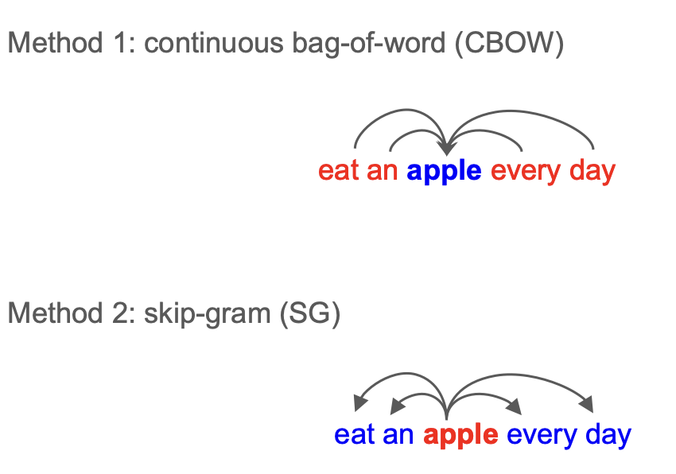
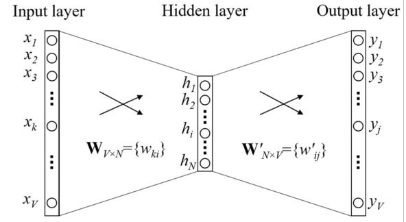
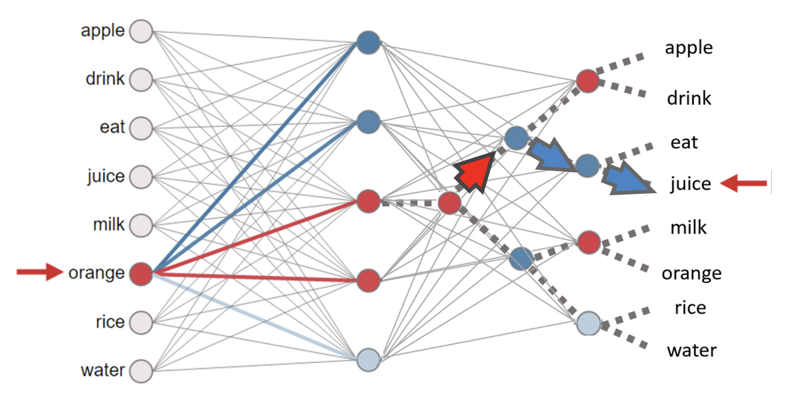
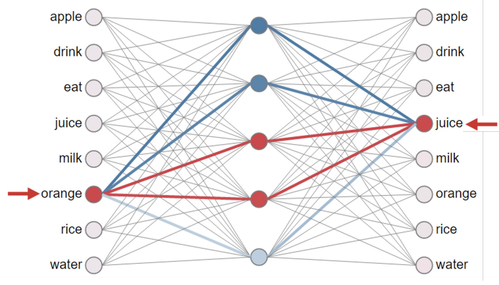
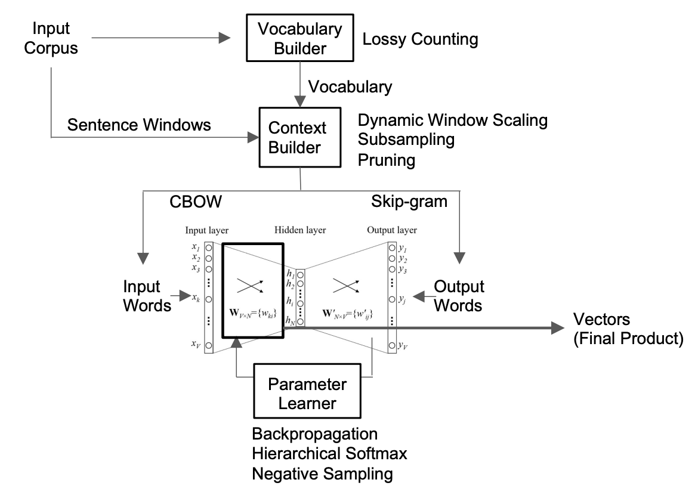
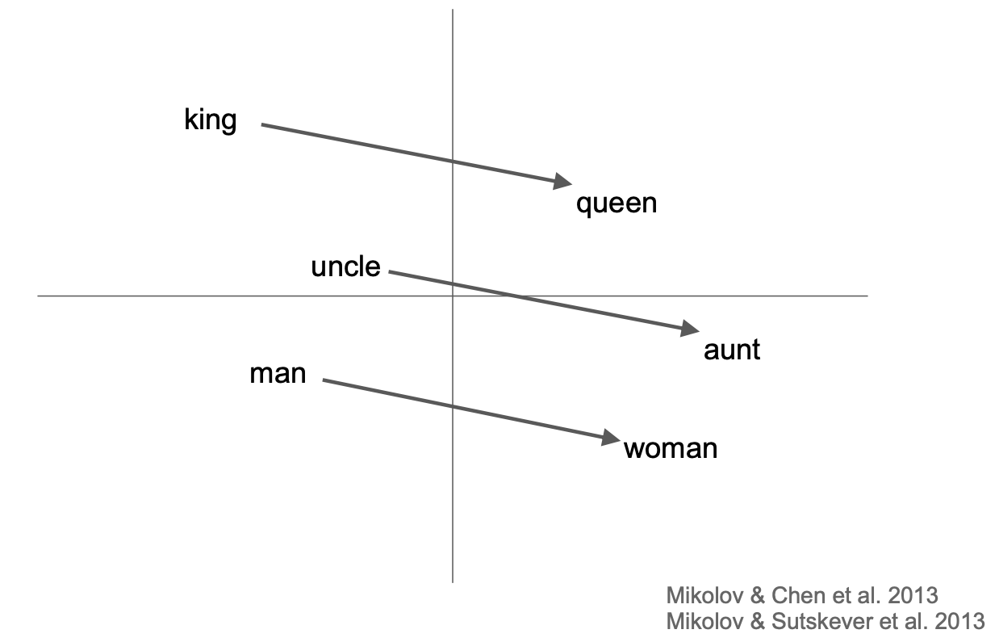

# Word Embedding

## 1. Manifold Assumption

==流形假设==：现实世界中的**高维数据**，实际上分布在嵌入于该高维空间中的**低维流形**上

右侧是一堆人脸照片

- 假设每张脸是 $20 \times 20$ 像素，那么每张脸就是一个 **400维空间** 里的一个点
- 假如在该维空间里随机选一个点，它看起来大概率是一个噪点而不是一个表情
- 虽然空间有 400 维，但脸的变化是有规律的：有的在改变**表情**，有的在改变**姿态**

左侧代表**隐空间（Latent Space）**

- **低维本质：** 尽管原始数据有 400 维，但决定这张脸看起来什么样的核心因素其实只有几个（图示中简化为 2 个维度）
- **内在坐标：** $z_1$ 代表 pose，$z_2$ 代表 expression；在这个低维空间里，数据点排列得非常整齐

**机器学习的目标**就是<u>通过降维，把高维的像素点变回低维的参数</u>

---

!!! info "How do we represent the meaning of a word?"

    在人类看来，词义是符号（能指）与概念（所指）的结合。
    但对于计算机，不能只给它“能指”（一串字符），我们需要找到一种方式，让它能捕捉到背后的“所指”（词与词之间的逻辑关系）

## 2. Discrete Representation

### Taxonomy

此处介绍==分类分级法（Taxonomy）==，以 WordNet 为例

1. **上位词** (Hypernyms / "is-a" relationship)
    - 查询 panda，WordNet 会返回熊猫的一系列“祖先”：
      carnivore（食肉目）$\to$ mammal（哺乳动物）$\to$ animal（动物）$\to$ entity（实体）
2. **同义词集** (Synonym sets / Synsets)
    - WordNet 把意思相近的词打成一个包（Synset），计算机通过看一个词和哪些词位于同一个包，来分辨它的具体含义

!!! bug "语义层面的问题"

    1. 缺乏细微差别 (Missing nuances)
    2. 新词需要不断补充，成本高
    3. 主观性
    4. 计算相似度难：离散系统中词和词只有“相同”和“不同”两种关系

### One-hot 

独热编码 (One-hot)：每个词被表示为一个极其巨大的向量，其中只有一个位置是 1，其余全是 0

!!! bug "数学层面的问题"

    1. 原子符号 (Atomic symbols)：在这种表示法下，词被看作是互不相关的“原子”
    2. 正交性问题 (The Orthogonality Problem)：从数学上看，任何两个独热向量的点积都是 0

---

## 3. Distributed Representations

**分布相似性表示（Distributional similarity based representations）**

- You can get a lot of value by representing a word by means of its <u>neighbors</u>

计算机不再把 banking 看作一个孤立的字符串，而是用周围这些高频出现的词来“代表”它

### Word Vector

Word meaning is defined in terms of vectors

- **稠密向量** (Dense Vector)：不同于独热编码，这里为每个词构建一个长度固定且每个位置都有具体数值的向量
- **预测能力：** 这些数值的选择标准是：该向量必须能够很好地预测出现在它上下文中的其他词 
- **递归性** (Recursive)：不仅用中心词向量去预测上下文词向量，而那些上下文词本身也是由向量表示的。它们在模型训练过程中相互影响、共同进化

!!! note "Directly learning low-dimensional word vectors"

    Relevant for this lecture & deep learning:

    - Learning representations by back-propagating errors (Rumelhart et al., 1986) 
    - A neural probabilistic language model (Bengio et al., 2003) 
    - NLP (almost) from Scratch (Collobert & Weston, 2008) 
    - A recent, even simpler and faster model: ==word2vec== (Mikolov et al. 2013)

---

## 4. word2vec

How do we select input and output words?

### word2vec model architecture

- 此处是 SG 模型

- **输入层 (Input Layer):**
    - 由 $V$ 个节点组成，其中 $V$ 代表词典的大小 
    - 输入是一个 **One-hot 向量**，即只有代表当前词的 $x_k$ 位置为 1，其余全为 0 
- **隐藏层 (Hidden Layer):**
    - 由 $N$ 个节点组成（$h_1$ 到 $h_N$），这个 $N$ 就是我们想要生成的**词向量维度**（通常是 100-300 维）
    - **关键点**：隐层没有激活函数（线性映射），它仅仅是输入向量与权重矩阵 $W$ 相乘后的结果 
- **输出层 (Output Layer):**
    - 同样由 $V$ 个节点组成，对应词典中的每一个词 
    - 输出结果 $y_j$ 经过 Softmax 处理后，代表在给定输入词的情况下，词典中每个词作为其上下文出现的**概率** 。

!!! tip "两个权重矩阵"

| **矩阵符号**              | **维度**       | **物理意义**                                             |
| --------------------- | ------------ | ---------------------------------------------------- |
| **$W_{V \times N}$**  | $V \times N$ | **输入词矩阵**。每一行 $w_{ki}$ 对应词典中第 $k$ 个词作为“中心词”时的向量表示    |
| **$W'_{N \times V}$** | $N \times V$ | **输出词矩阵**。每一列 $w'_{ij}$ 对应词典中第 $j$ 个词作为“上下文词”时的向量表示  |### 它是如何工作的？

> 工作原理：
>
> 1. **查找 (Lookup)：** 当 One-hot 向量输入时，乘法操作等同于直接从矩阵 $W$ 中**提取第 $k$ 行**。这就是该词目前的向量表示 $h$ 。
> 2. **投影 (Projection)：** 这个向量 $h$ 再与矩阵 $W'$ 相乘，计算它与词典中所有词的相似度（点积）。
> 3. **误差反传 (Backprop)：** 模型会比较预测的概率分布与实际上下文的分布，通过**反向传播**来更新 $W$ 和 $W'$ 中的数值

### Softmax

对于向量中的每一个元素 $z_i$，其 Softmax 值的计算公式为：

$$
\text{Softmax}(z_i) = \frac{e^{z_i}}{\sum_{j=1}^{V} e^{z_j}}
$$

- **归一化：** 所有输出分量都在 $(0, 1)$ 之间
- **总和为 1：** 所有输出分量的总和恒等于 1，输出可以被解释为该样本属于某一类别的概率

!!! bug "Training Generic Softmax is Intractable"

    当词典 $V$ 达到几十万甚至上千万（如 Google 1T 语料库）时，Softmax 分母中的求和操作 $\sum e^{z_j}$ 计算量巨大

#### Hierarchical Softmax

在 $V$ 个词中选一个 $\rightarrow$**树的二分类决策问题**（关注 hidden layer 和 output layer） 

- **树状路径：** 将所有单词组织成一棵二叉树（通常是霍夫曼树） 
    - 如图所示，要预测 juice，模型不再遍历全表，而是从根节点开始，沿着特定路径（图中虚线）进行一系列二分类判断
- **计算量大减：** 原本需要计算 $V$ 次，现在只需计算 $\log_2(V)$ 次 
- **训练逻辑：** 每一条路径上的内部节点都有自己的权重，模型通过调整这些权重来提高走到正确目标词的概率 

#### Negative Sampling

目前更主流、更简单的做法：**只更新“正确的那个”和“随机选的几个错误结果”** 

- **正样本**（Positive Sample）：比如输入 orange，正确的目标词是 juice
    - 模型必须更新这对组合，让它们的向量在空间里靠得更近
- **负样本**（Negative Samples）：模型随机从词典中选出 5-20 个不相关的词作为负样本
- **局部更新：** 每一轮训练模型**只更新这几个选中的词向量**
    - **拉近引力：** 强化 orange 与 juice 的联系
    - **排斥斥力：** 弱化 orange 与随机选出的那几个词的联系
- **核心优势：** 大幅降低了计算开销，实验证明这种“局部微调”可以让模型学到非常高质量的全局流形结构

### word2vec decomposed

1. **预处理阶段** ：
    - Vocabulary Builder：通过 Lossy Counting 等算法过滤掉出现频率极低的词，建立词典
2. **数据采样阶段** ：
    - Context Builder：通过滑动窗口截取上下文
    - 优化策略：使用 Dynamic Window Scaling（动态调整窗口大小）和 Subsampling（降低高频停用词如 "the" 的采样频率）来提升效率
3. **核心学习阶段 (Parameter Learner)** ：
    - 模型在 CBOW 或 Skip-gram 架构下运行    
    - 利用 Backpropagation 根据预测误差更新权重 
    - 使用 Hierarchical Softmax 或 Negative Sampling 来解决计算问题
4. **最终产物 (Final Product)** ：
    - 训练结束后，产出的 Vectors 就是可以在流形空间中计算语义相似度的稠密向量 

### Word Analogy

**语义关系可以转化为向量的加减运算** 

- **线性关系**：图中展示了“性别”这一维度在不同词对之间表现出高度的一致性
    - $\text{King} - \text{Man} + \text{Woman} \approx \text{Queen}$ 
    - $\text{Uncle} - \text{Man} + \text{Woman} \approx \text{Aunt}$ 
- **平移不变性**：连接“男性词”和“女性词”的向量在方向和长度上几乎是**平行且相等**的
    - 这意味着模型不仅学到了单个词的意思，还学到了词与词之间复杂的**逻辑关系**

---

## 5. Applications of Word Vectors

1. Word Similarity
2. Machine Translation
3. Part-of-Speech and Named Entity Recognition
4. Relation Extraction
5. Sentiment Analysis
6. Co-reference Resolution
7. Clustering
8. Semantic Analysis of Documents

---

## 6. Limitations

### Word Ambiguity

- **一个词一个向量：** 在 Word2Vec 模型中，每个单词（如 "Apple"）被分配了一个**唯一的、固定**的向量 
- **多义词困境：** 如果 "Apple" 同时代表“水果”和“科技公司”，模型会将这两层语义强行压缩到同一个坐标点上 
- **结果：** 最终的向量往往是多种语义的平均值，导致在特定语境下不够精准

### Debuggability

- **“黑盒”属性：** 词向量是高维空间里的稠密数字（如 300 维的浮点数） 
- **语义难以追踪：** 我们可以计算两个词很像，但很难解释向量里的第 42 维到底代表了什么具体的含义
- **调试困难：** 当模型预测出错时，很难通过直接修改向量数值来修复特定的语义错误

### Sequence

- **词袋效应：** Word2Vec 主要基于滑动窗口学习局部上下文，对于长距离的句子结构理解不足 
- **忽略语序：** 像 CBOW 架构在投影层会将上下文向量求和，这会导致“狗咬人”和“人咬狗”在输入层的信息几乎丢失了顺序差异 
- **缺乏动态性：** 它学习的是静态特征，无法根据句子中词语的排列顺序实时调整词义理解
