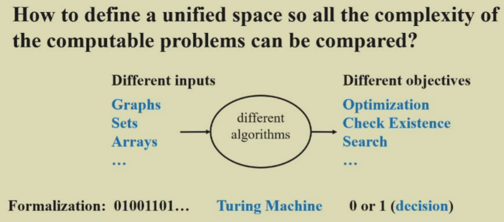

# NP-Completeness
## 10.1 Introduction
> [!info] 引入
> - 欧拉环问题：找到一条包含所有不重边的路径
> - 哈密顿环问题：找到一条包含所有不重顶点的路径
> - 单源无权最短路问题
> - 单源无权最长路问题
> 
> 其中，第一和第三个问题较为容易解决；但第二和第四个问题很难解决，且目前已知的算法的时间复杂度均超过了多项式(polynomial)级时间。

> [!info]
> <div style="text-align: center"></div>
> 
> - 图灵机是计算的通用模型，任何可计算问题都可以在图灵机上模拟
> - 假设所有的算法都在图灵机上运行，从而提供一个统一的计算模型

对于规模为$N$的数据，
- Easy 的问题：时间复杂度为 $O(N)$
- Hard 的问题：根本没法用渐进符号衡量，这一类问题称为**不可判定问题**(undecidable problem)
$$\underbrace{\underbrace{\text{decidable in poly}}_{P}  \leq \text{verify in poly}}_{PN} \leq \text{in exponential}\leq \text{undecidable}$$
---

## 10.2 Computational Model
### 1. Halting Problem
> [!question]
> 停机问题(halting problem)：是否存在一个程序P，它能够判断自身能在有限时间内结束或陷入死循环？

不行！下面给出证明：
> [!proof]
> 假设存在一个用于检查停机的程序，那么它应该也能够用于检查其自身。
> ```python
> def g():
> 	if halts(g):
> 		loop_forever()
> ```
> - 如果 `halts(g)` 返回 `True`，意味着函数 `g` 会在调用 `halts` 时停止。根据代码，`g` 会执行 `loop_forever()`，进入一个无限循环
> - 但如果 `halts(g)` 返回 `False`，表示 `g` 不会停止，这种情况下不会执行 `loop_forever()`，因此按照常理它应该能够停止。
> 
> 因此出现一自相矛盾的结果，说明不存在一个能够检查任意程序是否在有限时间内中止的程序。所以停机问题是一个**不可判定(non-deterministic)问题**。

### 2. Turing Machine
[图灵机](https://en.wikipedia.org/wiki/Turing_machine)(Turing machine)是与NP问题密切相关的一种计算理论模型，它用来模拟任何能够被数学家用算术方法来完成的计算（假设这个“数学家”有无穷的时间、精力、纸和笔，并且完全投入于计算工作）。
Components：
- **Infinite Memory**：1条被分为多个单元的一维纸带，每个单元存储一个符号（数据）
- **Scanner**：一个有限状态控制器，控制头根据当前状态以及控制头指向的符号来决定如何移动（指令）

图灵机的状态是一个有限集合，每个状态都有一个转移函数
- 转移函数的输入是当前状态和当前格子上的符号
- 输出是下一个状态、下一个格子上的符号和读写头的移动方向 

运算过程：
- 改变有限控制状态
- 擦除当前被控制头指向的单元上的符号，并写入新的符号
- 移动控制头（向左移(L)、向右移(R)或保持原位(S)），注意扫描器的每个控制头在每个状态下只能指向一个单元，并且每次最多移动一个单元
<div style="text-align: center">
    
</div>

图灵机的种类：
- **确定型(deterministic)图灵机**
	- 在每个阶段执行一条指令，随后根据当前指令的内容来选择下一条要进行的唯一的指令
- **非确定型(nondeterministic)图灵机**
	- 根据一个有限集合来自由选择下一步要执行的指令。并且若执行时存在能够找到解的步骤，那么它一定能够选择得到此解的正确指令
    - 可以对所有的可判定问题给出决策，但无法解决不可判定问题

---
## 10.3 Definition
### 1. P & NP
 **可判定(deterministic)问题**：可以用**确定性图灵机**解决的问题
- ==P==(polymonial-time，多项式时间)
	- **确定性**图灵机在多项式时间内能够解决的问题
- ==NP==(nondeterministic polynomial-time，非确定型多项式时间)
	- **确定性**图灵机在多项式时间内能够**验证**解的正确性的问题，或者**非确定性**图灵机在多项式时间内能够**解决**的问题。
		- Eg：可以很容易验证哈密顿环的解（只要遍历图上的所有点即可，线性复杂度），因此它是一个NP问题
	- 不是所有可判定问题都是 NP 问题
		- Eg：无法在多项式时间内证明一张图没有哈密顿环
	- $P \subseteq NP$
- ==NPH==(NP Hard, NP 困难问题 )
	- 如果问题 A 可以被**归约**(reduce) 到问题 B，那么问题 B 更难，并且若问题 A 是一个 NP 问题，那么问题 B 是一个**NP 困难问题**
- ==NPC==(NP Complete, NP 完全问题 )
	- NP 问题中最难的决定性问题
	- 满足性质：**任何 NP 问题能够在多项式时间内被归约 (reduce) 到 NP 完全问题**
> [!bug]
> 虽然 $P \subseteq NP$，当时我们不知道是否满足关系 $P \subset NP$，即 $P$ 与 $NP$ 是否相等，这仍然是未解决的七大难题之一。

### 2. NPH & NPC
**归约 (reduction) 过程**的符号化语言表述：
- 给定任何一个实例 $\alpha \in$ 问题 $A$，
	- $\alpha$ 是问题 A 的一个具体输入
- 如果能够找到一个程序 $R(\alpha) \rightarrow \beta \in$ 问题 $B$，满足 $T_R(N) = O(N^{k1})$
	- 即可以在多项式时间内把 $\alpha$ 转化为 B 问题的一个 $\beta$
- 且能通过另一个程序 $D(\beta)$ 在 $O(N^{k2})$ 得到解
	- 即 $\beta$ 可以在多项式时间内得到解
- 且对于 $\beta$ 的解等同于对 $\alpha$ 的解，那么：
<div style="text-align: center">
    
</div>

- ==NPH== (NP-Hard)：如果问题 A 可以被**归约**(reduce)到问题 B，那么问题 B 更难，并且如果问题 A 是一个 NP 问题，问题 B 就是一个 **NP 困难问题**
- ==NPC==(NP-Complete)：the hardest in NP
	- 性质：**任何** NP 问题能够在**多项式时间**内被归约(reduce)到 NPC 问题
        - 换句话说，如果能在多项式时间内解决**任何一个**NP问题，那么我们就能在多项式时间内解决**所有**NP问题，这意味着 $P = NP$
    -  $\text{NPC} = \text{NP} \cap \text{NP Hard}$
> [!bug] NPC 的证明
> 即使问题 A 是 NPC 问题，且问题 A 可以归约到问题 B，也不能说明问题 B 是 NPC 问题。因为不清楚 B 是不是 NP 问题，即使是的话也只能说明 B 是 NP Hard，即只能确定 B 的难度不低于 A，而无法判断 B 是不是 NPC 问题，
> - 正确的证明思路：证明一个 NPC 问题可以规约到这个 NP 问题，则该问题为 NPC

> [! abstract] 总结：P、NP、NP完全、NP困难问题之间的关系
> <div style="text-align: center"></div>
> 
> $H$ in $NP-H$ if for all $L$ in $NP$, $L\leq_p H$
> $C$ in $NP-C$ if $C$ in $NP-H$ and $C$ in $NP$

> [!example]
> 假设已知 Hamiltonian cycle problem 是一个 NPC 问题，证明 traveling salesman problem 也是一个 NPC 问题。
>> [!prove]
>> TSP 显然是 NP 问题
>> 接下来把图补全成一个完全图，新添加的 edge 的 cost 为 2，原有 edge 的 cost 为 1。我们要求 total cost 不大于 V。

### 3. co-NP
Complexity class co-NP = the set of languages $L$ such that $\overline{L}\in NP$.

**Four possibilities**:
<div style="text-align: center">
    
</div>

## 10.4 Examples
### Clique Problem to Vertex Cover Problem
> [!question]
> 假设我们已经知道**团问题**(clique problem)是 NPC 问题，请证明**顶点覆盖问题**(vertex cover problem)也是 NPC 问题。    
> - 团问题：给定无向图 $G = (V, E)$ 和整数 $K$，$G$ 是否存在一个（至少）包含 $K$ 个顶点的**完全子图（团）**
> - 顶点覆盖问题：给定无向图$G = (V, E)$和整数$K$，$G$是否存在一个顶点子集$V' \subseteq V$，使得$|V'| \le K$且$G$中的每条边上至少有一个顶点被包含在$V'$中（顶点覆盖）

先用抽象问题来描述：
- $\text{CLIQUE} = \{<G, K>:\ G \text{ is a graph with a clique of size }K\}$
- $\text{VERTEX-COVER} = \{<G, K>:\ G \text{ has a vertex cover of size }K\}$

我们需要证明两件事：
- $\text{VERTEX-COVER} \in NP$：
    - $\forall x = <G, K>$，令证书 $y$ 为顶点子集 $V' \subseteq V$ 
    - 归约算法为：
        - 检查是否满足$|V'| = K$
	    - 检查是否 $\forall \text{edge } (u, v)$，使得 $u \in V'$ 或 $v \in V'$
        - 时间复杂度：$O(N^3)$（遍历所有边（$N^2$）$\times$每条边至少检验其中一点是否在$V'$内（$N$））

- $\text{CLIQUE} \le_P \text{VERTEX-COVER}$，即证$G$有一个大小为$K$的**团**的充要条件为$\overline{G}$有一个大小为$|V| - K$的**顶点覆盖**
    - 充分性：
        - 令$(u, v)$为$\overline{E}$上的任意一边，可以得到以下结论
        - $u, v$中至少有一点不属于$V'$，且至少有一点属于$V - V'$
        - 每条在$\overline{G}$内的边，它的一个顶点在$V - V'$内
        - 因此大小为$|V| - K$的集合$V - V'$构成了$\overline{G}$的一个顶点覆盖
    - 必要性：
        - $\forall u, v \in V$，如果$(u, v) \notin E$，那么$u \in V'$或$v \in V'$，或两者皆满足
        - $\forall u, v \in V$，如果$u \notin V'$且$v \notin V'$，则$(u, v) \in E$
        - 所以$V - V'$是一个大小为$|V| - |V'| = K$的团


