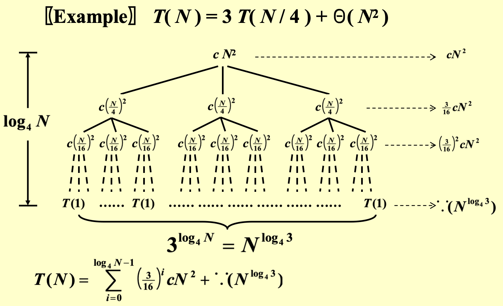

# Divide and Conquer
- 将问题分成(divide)一系列的子问题
- **递归**解决(conquer)这些子问题
- 将子问题的解合并起来(combine)，构成原问题的解 
General recurrence: 
$$
T(N) = aT(\dfrac{N}{b}) + f(N)
$$
## 7.1Examples
### Closest Points Problem
> [!question] 问题描述
> 在平面上给定 $N$ 个点，请找出距离最近的一对点

- 回顾<u>最大子序列之和</u>的解法：先将整个序列拆成两半，然后分别计算左半边子序列，右半边子序列，以及分界线中间区域子序列的最大和，最后取这3个结果中的最大者，作为该序列的最大子序列之和。这里借鉴这种解法来解决问题。

<div style="text-align: center"></div>

- 首先将整个区域一分为二，划分时确保两边的点的数目大致相等
- 这里三根两点间的连线对应三种情况：**左半边、中间和右半边**
- 其中左半边和右半边这两种情况可以递归解决，关键是如何处理**中间**的情况
	- 如果计算中间部分的时间复杂度是**线性**的，那么整个算法的时间复杂度为 $O(N \log N)$

> [!proof] 解释
> 对于时间复杂度的递推公式 $T(N) = aT(\dfrac{N}{b}) + f(N)$，$a = b = 2$，令 $f(N) = cN$，那么：
> $$\begin{align}T(N) & = 2T(\dfrac{N}{2}) + cN \notag \\& = 2[2T(\dfrac{N}{2^2}) + c\dfrac{N}{2}] + cN \notag \\& = 2^2 T(\dfrac{N}{2^2}) + 2cN \notag \\& = \dots \notag \\& = 2^k T(\dfrac{N}{2^k}) + kcN \notag \\& = N + cN \log N = O(N \log N) \notag \end{align}
> $$
> 此时整个算法的时间复杂度为 $O(N \log N)$
> 
> 如果 $f(N) = cN^2$，那么：            
> $$\begin{align}T(N) & = 2T(\dfrac{N}{2}) + cN^2 \notag \\& = 2[2T(\dfrac{N}{2^2}) + c\dfrac{N^2}{2^2}] + cN^2 \notag \\& = 2^2 T(\dfrac{N}{2^2}) + cN^2(1 + \dfrac{1}{2}) \notag \\ & = \dots \notag \\& = 2^k T(\dfrac{N}{2^k}) + cN^2(1 + \dfrac{1}{2} + \dots + \dfrac{1}{2^{k-1}}) \notag \\ & = O(N^2) \notag\end{align}$$

这里用到的分析方法是**代换法**(substitution)
- 如果考虑分隔线两边所有的点，那么时间复杂度就会来到了$O(N^2)$
- 一种可行的改进方法是：仅考虑距分隔线水平距离为 $\delta$ 内的点，其中 $\delta$ 为选定的常数。现在得到了一个位于中间部分，且宽度为 $2\delta$ 的区域，称为 $\delta$ 带($\delta$ -strip)。这个区域之外的点显然不会是最近点对的可能点

<div style="text-align: center"></div>  

> [!code] 代码实现
> ```cpp
> // points are in the strip
> for (i = 0; i < NumPointsInStrip; i++)
> 	for (j = i + 1; j < NumPointsInStrip; j++)
> 		if (Dist(Pi, Pj) < delta)
> 			delta = Dist(Pi, Pj);
> ```

- 如果确保$\delta$带内的点数为$O(\sqrt{N})$，那么计算中间情况的时间复杂度就是$O(\sqrt{N} \times \sqrt{N}) = O(N)$
- 最坏情况下 $\delta$ 带内包含了所有点，算法退回到 $O(N^2)$

**改进方法**：在确定垂直$\delta$带区域的基础上，再划分水平$\delta$带区域
- 根据点的y坐标，从y坐标最大的点开始往下遍历垂直$\delta$带内的每个点，对于每个点，仅计算位于该点下方且距离该点小于等于$\delta$的点和它之间的距离（划分水平$\delta$区域）
- 对于y坐标相同的点，它们将会被一起处理
- 对于正在被处理的点$p$，一定位于$2\delta \times \delta$的矩形区域内，如图所示：

<div style="text-align: center"></div>  

- 分隔线正好将矩形划分为2个方形L和R
- 在最坏情况下，每个点只需要考虑与其他 6 个点的距离
- 因此，即使所有的点都在垂直$\delta$带内，每个点的判断是常数次的，因此中间情况的时间复杂度是$O(N)$
> [!code]  代码实现
> ```cpp
> // points are in the strip
> // and sorted by y coordinates
> for (i = 0; i < NumPointsInStrip; i++)
> 	for (j = i + 1; j < NumPointsInStrip; j++)
> 		if (Dist_y(Pi, Pj) > delta)
> 	        break;
>         else if (Dist(Pi, Pj) < delta)
> 	        delta = Dist(Pi, Pj);       
>```

本题分治算法的时间复杂度为$T(N) = 2T(\dfrac{N}{2}) + O(N) = O(N \log N)$

## 7.2 Analysis
递推公式 $T(N) = aT(\dfrac{N}{b}) + f(N)$ 的三种求解方法：
- **代换(substitution)法**
- **递归树(recursive-tree)法**
- **主方法(master method)**

在分析时忽略以下细节：
- 不关心$\dfrac{N}{b}$是否是整数
- 对于较小的$n$，始终假定$T(n) = \Theta(1)$

### 1. Substitution
主要思路：
- 先**猜**一个结论（假设）
- 然后**代入**这个假设，用**归纳法**证明该结论的正确性

> [!example] 
> 已知 $T(N) = 2T(\lfloor \dfrac{N}{2} \rfloor) + N$，求 $T(N)$。
> - 先猜测$T(N) = O(N \log N)$
> - 再证明：
> 
>> [!proof] 证明
>> - 假设对于 $m < N$，该结论成立
>>    - 取 $m = \lfloor \dfrac{N}{2} \rfloor$，那么存在一个常数 $c > 0$，使得
>> $$T(\lfloor \dfrac{N}{2} \rfloor) \le c \lfloor \dfrac{N}{2} \rfloor \log \lfloor \dfrac{N}{2} \rfloor$$
>>- 将这个式子带入递推公式，得：
>>$$\begin{align}
>>      T(N) & = 2T(\lfloor \dfrac{N}{2} \rfloor) + N \notag \\
>>      & \le 2c \lfloor \dfrac{N}{2} \rfloor \log \lfloor \dfrac{N}{2} \rfloor + N \notag \\
>>      & \le cN(\log N - \log 2) + N \notag \\
>>      & \le cN \log N \quad \text{for}\ c \ge 1 \notag
>>      \end{align}$$
>- 不必在意$N = 1$的情况：前面的假设2已经“忽略”这种trivial case；或者也可以将$N = 2$作为base case，只要$c$足够大式子一定成立

> [!failure] 错误的猜测
> 如果猜测 $T(N) = O(N)$，那么会有以下证明：
> - 假设对于 $m < N$，该结论成立
> - 取 $m = \lfloor \dfrac{N}{2} \rfloor$，那么存在一个常数 $c > 0$，使得
> $$T(\lfloor \dfrac{N}{2} \rfloor) \le c \lfloor \dfrac{N}{2} \rfloor$$
> - 将这个式子带入递推公式，得：
> $$\begin{align}T(N) & = 2T(\lfloor \dfrac{N}{2} \rfloor) + N \notag \\& \le 2c \lfloor \dfrac{N}{2} \rfloor + N \notag \\& \le cN + N = O(N) \notag\end{align}$$        
> 
> 错误发生在最后一个不等式：我们得到了$cN + N = (c + 1)N$，在形式上它是错误的，因为预先假设正确的结论是$T(m) \le cm$。换句话说，必须证明出**精确的形式**(exact form)，**系数**也必须保持一致。

### 2. Recursive Trees
假如递推关系形如 $T(N) = aT(\dfrac{N}{b}) + f(N)$，
根据递推关系递归地来画一棵树，这棵树具有以下特征：
- 根节点为$f(N)$
- 一个节点有$a$个孩子，每个孩子节点为$f(\dfrac{N}{b})$
- 叶子节点为$T(1)$
- 树的高度为$\log_b N$
- 时间复杂度 = 所有节点之和 = 内部节点（对应合并操作的时间复杂度）之和 + 叶子节点（对于base case的时间复杂度）之和

> [!example]
> 已知$T(N) = 3T(\dfrac{N}{4}) + \Theta(N^2)$，求$T(N)$。
> 根据这个递推关系和递归树的特征，可以一层层地画出这棵树：
> <div style="text-align: center"></div>  
>     
> 对于这棵递归树，可以获得的信息有：
> 
> - 树的高度为$\log_4 N$
> - 第$i$层一共有$3^i$个节点，且节点之和为$(\dfrac{3}{16})^i cN^2$
> - 由以上两条信息，可以推得最后一层的节点（全是$T(1)$）之和为$3^{\log_4 N} = N^{\log_4 3} = \Theta(N^{\log_4 3})$
> 根据以上信息可以计算出 $T(N)$：
> $$\begin{align}
>         T(N) & = \sum\limits_{i=0}^{\log_4 N - 1}(\dfrac{3}{16})^i cN^2 + \Theta(N^{\log_4 3}) \notag \\
>         & < \sum\limits_{i=0}^{\infty}(\dfrac{3}{16})^i cN^2 + \Theta(N^{\log_4 3}) \notag \\
>         & = \dfrac{cN^2}{1 - \frac{3}{16}} + \Theta(N^{\log_4 3}) = O(N^2) \notag
>         \end{align}$$


> [!example] 
> 已知 $T(N) = T(\dfrac{N}{3}) + T(\dfrac{2N}{3}) + cN$，求 $T(N)$。
> <div style="text-align: center"></div>
> 
> - 这不是一个标准形式下的递推关系，因此画出来的递归树并不是一棵完全树（即不平衡），而且显然最右侧路径是最深的
> - 但可以确定以下信息：
>     - 树的高度为最右侧路径的高度。可以看到第$i$层中最右侧的节点为$c(N \cdot (\dfrac{2}{3})^i) = c(\dfrac{N}{(\frac{3}{2})^i})$，因此树高为$\log_{\frac{3}{2}} N$
>     - 每层节点和为$cN$
> 
> - 根据这些信息，可以猜测：$T(N) = O(N \log N)$，并用**代换法**来证明
> $$\begin{align}T(N) & = T(\dfrac{N}{3}) + T(\dfrac{2N}{3}) + cN \notag \\& \le d(\dfrac{N}{3}) \log (\dfrac{N}{3}) + d(\dfrac{2N}{3}) \log (\dfrac{2N}{3}) + cN \notag \\& = dN \log N - dN (\log_2 3 - \dfrac{2}{3}) + cN \notag \\& \le dN \log N \quad \text{for}\ d \ge \dfrac{c}{\log_2 3 - \frac{2}{3}} \notag\end{align}$$

### 3. Master Method
下面罗列了主方法(master theorem)的几种常用形式：

#### Form 1
令常数 $a, b \ge 1$，$f(N)$ 为关于 $N$ 的函数，$T(N) = aT(\dfrac{N}{b}) + f(N)$，那么：
1. 若对于常数 $\varepsilon > 0$，有 $f(N) = O(N^{\log_b a - \varepsilon})$ 成立，则 $T(N) = \Theta(N^{\log_b a})$
2. 若 $f(N) = \Theta(N^{\log_b a})$，则 $T(N) = \Theta(N^{\log_b a} \log N)$
3. 若对于常数 $\varepsilon > 0$，有 $f(N) = \Omega(N^{\log_b a + \varepsilon})$，且对于常数 $c < 1$ 和充分大的数 $N$，有 $af(\dfrac{N}{b}) < cf(N)$ 成立（正则条件(regularity condition)），那么 $T(N) = \Theta(f(N))$

> [!example]
> **例1**
> - 对于归并排序，$a = b = 2$，且合并操作是线性时间的，那么根据第2类情况，我们可以直接得到它的时间复杂度为 $T = O(N \log N)$
> 
> **例2**
> - 若 $a = b = 2, f(N) = N \log N$，我们无法用这种主定理得到合适的时间复杂度，因为：
> 	- 第1类：$N^{\log_b a - \varepsilon} = N^{1 - \varepsilon} < N \log N$，所以不符合第1类情况
> 	- 第2类：$N^{\log_b a} = N \ne N \log N$，所以不符合第2类情况
> 	- 第3类：$N^{\log_b a + \varepsilon} = N^{1 + \epsilon} > N \log N$（因为当 $N$ 足够大时，$N^{\varepsilon} > \log N(\varepsilon > 0)$，所以不符合第3类情况）

> [!proof] 可以用递归树来证明
> 先令 $N = b^k$，其中 $k$ 为整数
> <div style="text-align: center"></div>
> 
> 那么这棵树的节点之和为：$T(N) = \Theta(N^{log_b a}) + \sum\limits_{j = 0}^{\log_b N - 1}a^j f(\dfrac{N}{b^j})$
> 关键在于求和公式：
> **Case 1**
> - 此时 $f(N) = O(N^{\log_b a - \varepsilon})$，那么：
> $$\begin{align}\sum\limits_{j = 0}^{\log_b N - 1}a^j f(\dfrac{N}{b^j}) & = O(N^{\log_b a - \varepsilon} \sum\limits_{j = 0}^{\log_b N - 1} (b^{\varepsilon})^j) \notag \\ & = O(N^{\log_b a - \varepsilon} \dfrac{b^{\varepsilon \log_b N} - 1}{b^{\varepsilon} - 1}) \notag \\& = O(N^{\log_b a - \varepsilon } N^{\varepsilon}) \notag \\& = O(N^{\log_b a}) \notag\end{align}$$
> 所以$T(N) = T(N) = \Theta(N^{log_b a}) + O(N^{log_b a}) = \Theta(N^{log_b a})$

#### Form 2
- 若对于常数$\kappa < 1$，有$af(\dfrac{N}{b}) = \kappa f(N)$成立，则$T(N) = \Theta(f(N))$
- 若对于常数$K > 1$，有$af(\dfrac{N}{b}) = K f(N)$成立，则$T(N) = \Theta(N^{\log_b a})$
- 若$af(\dfrac{N}{b}) = f(N)$成立，则$T(N) = \Theta(f(N) \log_b N)$

这个形式虽然简单，但是能够计算的时间复杂度相当有限，一些能由前一种形式的主定理解决的问题，用这种形式的主定理无法解决；前一种形式的主定理无法解决的问题，这种形式的主定理更无法解决。

> [!example]
> 已知 $a = 4, b = 2, f(N) = N\log N$，能否用第二种形式的主定理计算时间复杂度？
> - 先计算 $af(\dfrac{N}{b}) = 4(\dfrac{N}{2}) \log (\dfrac{N}{2}) = 2 N \log N - 2N$
> - 显然找不到任何常数 $c$ 满足 $cf(N) = 2 N \log N - 2N$，因此无法用这种主定理计算
> - 然而，用前一种主定理是可以算出来的：发现$O(N^{\log_b a - \varepsilon}) = O(N^{2 - \varepsilon}) = f(N)$，符合第1类情况，那么时间复杂度为$T = O(N^2)$

#### Form 3
当$a \ge 1, b > 1, p \ge 0$时，方程
$$
T(N) = aT(\dfrac{N}{b}) + \Theta(N^k \log^p N)
$$
的解为
$$
T(N) = \begin{cases}O(N^{\log_b a}) & \text{if}\ a > b^k \\ O(N^k \log^{p+1}N) & \text{if}\ a = b^k \\ O(N^k \log^p N) & \text{if}\ a < b^k \end{cases}
$$

> [!example]
> **Case 1**
> 对于归并排序，$a = b = 2, p = 0, k = 1$，满足第2种情况（$a = b^1$），因此 $T(N) = O(N^k \log^{p+1} N) = O(N \log N)$。
> **Case 2**
> 假设某种分治算法中，对于每次递归，$a = 3, b = 2$，且合并操作的时间复杂度为 $O(N)$，即 $k = 1, p = 0$。
> 不难发现，它符合第1种情况，因此 $T(N) = O(N^{\log_2 3}) = O(N^{1.59})$。
>>  如果合并时间复杂度为 $O(N^2)$，那么 $T(N) = O(N^2)$。
> 
> **Case 3**
> 对于前两种形式没法计算的问题：$a = b = 2, f(N) = N \log N$（即 $k = p = 1$），该条件满足第2种情况，因此时间复杂度 $T(N) = O(N^k \log^{p+1} N) = O(N \log^2 N)$。


