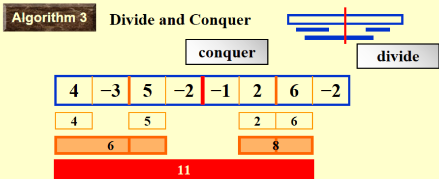

# CHAPTER 2. Algorithm Analysis
- 一个定义好的、计算机可执行的、解决某一问题的有限步骤
- 特征：
  * 输入 (input)：0 个或多个输入
  * 输出 (output)：**至少有 1 个**输出
  * 确定性 (definiteness)：每条指令都是明确的
  * 有限性 (finiteness)：算法需要在经过有限步后终止
  * 有效性 (effectiveness)：每条指令足够基本可行，原则上使用纸和笔便能表达出来。
- A **program** is written in some programming language, and <u>does not have to be finite</u>. (e. g. an operating system).
- An **algorithm** can be described by human languages, flow charts, some programming languages, or pseudocode.

## 1. What to Analyze
- Machine & compiler - dependent run times
==**时间空间复杂度**(Time & space complexities)== : machine and compiler **in**dependent

**Asumptions:**
-  指令按顺序执行
-  所有指令（运算）都消耗同一时间单元
-  数据规模是给定的，且有无限空间

**Two functions analyzed:**
- $T_{avg}(N)$ & $T_{worst}(N)$     N: 表示输入数据规模（可有多个输入规模）
~~~ c
void add(int a[][MAX_SIZE],
         int b[][MAX_SIZE],
         int c[][MAX_SIZE],
         int rows, int cols)
{
    int i,j;
    for(int i=0;i<row;i++){            /* rows+1 */
        for(int j=0;j<cols;j++){       /* rows*(cols+1) */
            c[i][j]=a[i][j]+b[i][j];   /* rows*cols */
        }
    }
}
~~~
-  $T(rows, cols) = 2rows*cols+2rows+1$

## 2. Asymptotic Notation
**（复杂度渐进记号）**
### 2.1 Definition 
- 大 $O$ 表示法 
  如果存在常数 $c$ 和 $n_0$ 使得当 $N\geq n_0$ 时 $T(N)\leq c\cdot f(N)$，则 $T(N) = O(f(N))$.
  - **渐进上界**，即 $T(N)$ 增长速度不快于 $f(N)$.

- 大 $\Omega$ 表示法 
  如果存在常数 $c$ 和 $n_0$ 使得当 $N\geq n_0$ 时 $T(N)\geq c\cdot g(N)$，则 $T(N) = \Omega(g(N))$.
  - **渐进下界**，即 $T(N)$ 增长速度不慢于 $f(N)$.

- 大 $\Theta$ 表示法 
  当且仅当 $T(N) = O(h(N))$ 且 $T(N) = \Omega(h(N))$，有 $T(N) = \Theta(h(N))$.
  - **渐进紧确界**，即 $T(N)$ 与 $h(N)$ 增长速度相同

> 小 $o$ 表示法 
> - 当 $T(N) = O(p(N))$ 且 $T(N)\ne \Theta(p(N))$ 时，$T(N) = o(p(N))$.
> - **非渐进紧确上界**，即 $T(N)$ 增长比 $p(N)$ 慢
> 小 $\omega$ 表示法 
> - 当 $T(N) = \Omega(q(N))$ 且 $T(N)\ne \Theta(q(N))$ 时，$T(N) = \omega(p(N))$.
> - **非渐进紧确下界**，$T(N)$ 增长比 $q(N)$ 快

###  2.2 Rules
> **<u>Make sure that N is sufficiently large.</u>**

* If $T_{1}(N)=O(f(N))$ and $T_{2}(N)=O(g(N))$ , then
  * $T_{1}(N)+T_{2}(N)=O( max(f(N), g(N)) )$.
  * $T_{1}(N)*T_{2}(N) = O(  f(N)* g(N) )$.

* If $T(N)$ is a polynomial of degree $k$, then $T(N) = \Theta(N^k)$.
* $log^kN=O(N)$ for any constant $k$.

### 2.3 General Rules
- **for loops** 
  - For 循环的运行时间不超过 **“循环体内部语句 × 迭代次数”**
  - 嵌套 for 循环要**逐次相乘**
- **if / else** 
  * 语句的运行时间**不超过**<u>判断时间+耗时最长的语句块</u>的运行时间
- **recursion**  
> **补充** : ==主定理==
>
> 假设有 $T(n) = aT(n/b)+f(n)$（$a\geq 1, b>1$），则：
>
> - 如果存在常数 $\epsilon > 0$ 有 $f(n) = O(n^{\log_ba-\epsilon})$，则 $T(n) = \Theta(n^{\log_ba})$
> - 如果 $f(n) = \Theta(n^{\log_ba})$ 则 $T(n) = \Theta(n^{\log_ba}\log n)$
> - 如果存在常数 $\epsilon > 0$ 有 $f(n) = \Omega(n^{\log_ba+\epsilon})$，同时存在常数 $c<1$ 使得对于充分大 $n$ 有 $af(n/b)\leq cf(n)$ 则 $T(N) = \Theta(f(n))$

## 3. Compare the Algorithms
#### Algorithm 1. $O(N^3)$
直接枚举开头结尾，并计算中间子序列和：
```c 
int MaxSubsequenceSum(const int a[], int N) {
    int res = 0;
    for (int i = 0; i < N; ++i) {
        for (int j = i; j < N; ++j) {
            int now = 0;
            for (k = i; k <= j; ++k) {
                now += a[k];
            }
            res = max(res, now);
        }
    }
    return res;
} 
```

#### Algorithm 2. $O(N^2)$
**cumulative sum** 同样枚举开头结尾，不过动态计算子序列和，省去最内层循环 
```c
int MaxSubsequenceSum(const int a[], int N) {
    int res = 0;
    for (int i = 0; i < N; ++i) {
        int now = 0;
        for (int j = i; j < N; ++j) {
            now += a[j];
            res = max(res, now);
        }
    }
    return res;
}
```

#### Algorithm 3. $O (NlogN)$
* 使用==分治算法==


```c
static int MaxSubSum(const int A[ ], int Left, int Right)
{
    int MaxLeftSum, MaxRightSum;
    int MaxLeftBorderSum, MaxRightBorderSum;
    int LeftBorderSum, RightBorderSum;
    int Center, i;

    // Base Case
    if (Left == Right)
        if (A[Left] > 0)
            return A[Left];
        else
            return 0;

    // 处理左右两半
    Center = (Left + Right) / 2;
    MaxLeftSum = MaxSubSum(A, Left, Center);
    MaxRightSum = MaxSubSum(A, Center + 1, Right);

    // 处理中间部分
    // 从中间开始左半部分
    MaxLeftBorderSum = 0;
    LeftBorderSum = 0;
    for (i = Center; i >= Left; i--)
    {
        LeftBorderSum += A[i];
        if (LeftBorderSum > MaxLeftBorderSum)
            MaxLeftBorderSum = LeftBorderSum; 
    }
    // 从中间开始右半部分
    MaxRightBorderSum = 0;
    RightBorderSum = 0;
    for (i = Center + 1; i <= Right; i++)
    {
        RightBorderSum += A[i];
        if (RightBorderSum > MaxRightBorderSum)
            MaxRightBorderSum = RightBorderSum; 
    }

    return Max3(MaxLeftSum, MaxRightSum, MaxLeftBorderSum + MaxRightBorderSum); // 自定义函数，比较3个数的大小
}
```

$$
\begin{align*}
T(N) &= 2 T(N/2)+cN,\quad T(1) = O(1) \\
&= 2\left(2T(N/2^2)+cN/2\right)+cN \\
&= 2^kO(1) + ckN\qquad\text{where }N/2^k=1 \\
&= O(N\log N)
\end{align*}
$$

#### Algorithm 4. $O(N)$
==**On-line Algorithm**==
~~~ c
int MaxSubsequenceSum(const int a[], int N) {
    int ThisSum, MaxSum, i;
    ThisSum = Maxsum = 0;
    for (i = 0; i < N; i++) {
        ThisSum += a[i];
        if(ThisSum > MaxSum){
            MaxSum = ThisSum;
        }else if(ThisSum < 0){
            ThisSum = 0;
        }
    }
    return MaxSum;
}
~~~

## 4. Checking Your Analysis
* When $T(N)=O(f(N))$, check if $\lim_{N \to \infty} \frac{T(N)}{f(N)} \approx \text{Constant}$
