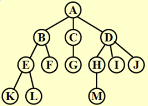
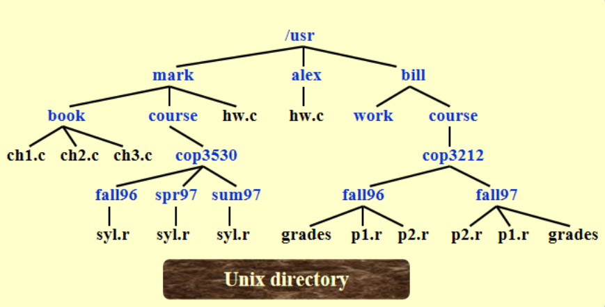
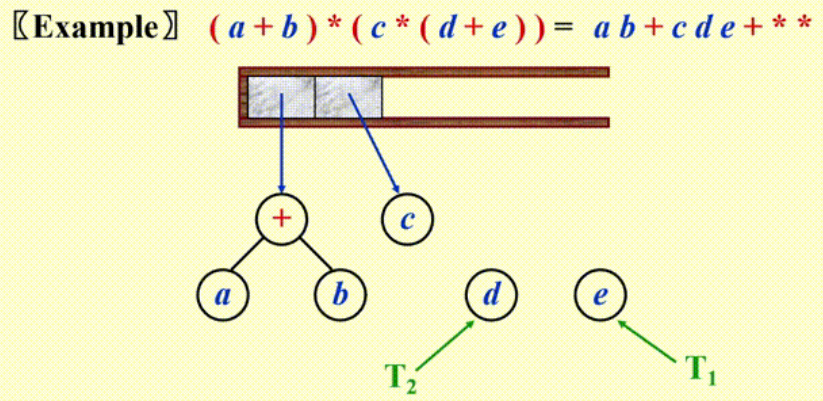
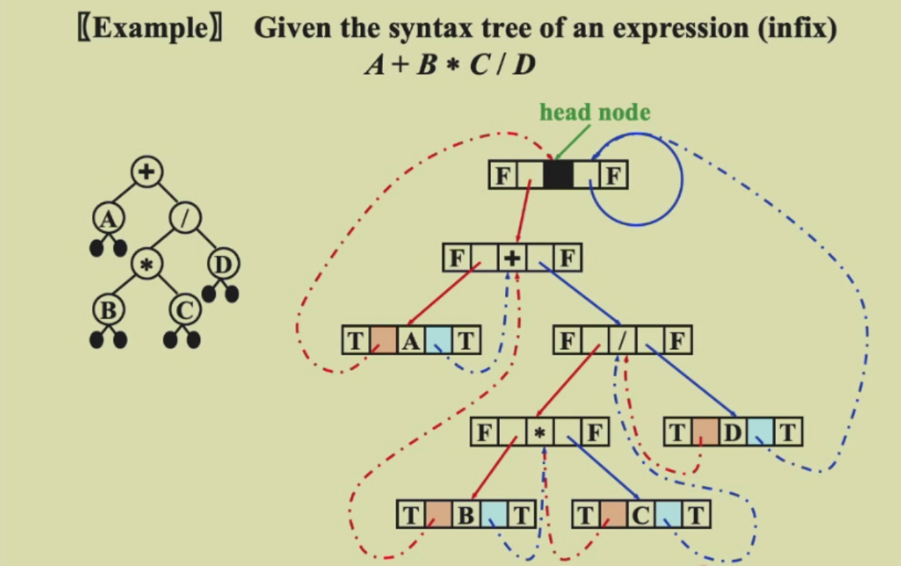

# CHAPTER 4. Trees
## 1. Preliminaries
### 1. Terminology
[Definition] A **tree** is a collections of nodes. The collection can be empty; otherwise, a tree consists of
1. A distinguished node **r**, called the **root ** **(根节点)**
2. And zero or more nonempty **subtrees** $T_{1}$, ... $T_{k}$, each of whose roots are connected by a directed **edge** from **r**.

>**Note:**
>* Subtrees must **not** connect together. Therefore every node in the tree is the root of some subtree.
>* There are $N-1$ edges in a tree with $N$ nodes.
>* Normally the root is drawn at the **top**.

| 术语                             | 解释                                                         |
| -------------------------------- | ------------------------------------------------------------ |
| **degree of a node**             | number of subtrees of the node                               |
| **degree of a tree**             | $max_{node\in tree}\{degree (node) \}$                        |
| **parent**                       | a node that has subtrees                                     |
| **children**                     | the roots of the subtrees of a parent                        |
| **siblings**                     | the children of the same parent                              |
| **leaf ( terminal node )**        | a node with degree 0 (no children)                           |
| **path from $n_{1}$ to $n_{k}$** | a (unique) sequence of nodes  $n_{1} ,n_{2}, \dots, n_{k}$ such that $n_{i}$ is the parent of $n_{i+1}$ for $1\leq i<k$ |
| **length of path**               | number of edges on the path                                  |
| **depth of $n_{i}$**             | length of the unique path from the root to the $n_{i}$, Depth (root) = 0 |
| **height of $n_{i}$**            | length of the longest path from $n_{i}$ to a leaf. $\text{Height (leaf) = 0}$ |
| **height (depth) of a tree**      | $\text{height (root) = depth (deepest leaf)}$                  |
| **ancestors of a node**          | all the nodes along the path from the node up to the root    |
| **descendants of a node**        | all the nodes in its subtrees                                |

### 2. Implementation
#### 2.1 List Representation

$( A ( B ( E ( K, L ), F ), C ( G ), D ( H ( M ), I, J ) ) )$

#### 2.2 FirstChild-NextSibling Representation

- 记录第一个子节点和下一个兄弟节点
- 因为一棵树的儿子顺序不定，所以一棵树的表示方式不唯一
```c
Struct TreeNode {
    ElementType Element;
    PtrToNode FirstChild;
    PtrToNode NextSibling;
};
Typedef struct TreeNode *PtrToNode;
```

#### 2.3 Application (File System)


* 列出文件
  ```c
  Static void ListDir (DirOfFile D, int Depth)
  {
      If (D is legitimate entry)
      {
          PrintName (D, Depth);
          If (D is a directory)
              For (each child C of D)
                  ListDir (C, Depth + 1);
      }
  }
  ```

* 计算目录大小
  ```c
  Static int SizeDir (DirOrFile D)
  {
      Int TotalSize;
      TotalSize = 0;
      If (D is a legitimate entry)
      {
          TotalSize = FileSize (D);
          If (D is a directory)
              For (each child C of D)
                  TotalSize += SizeDir (C);
      } // end if D is legal
      Return TotalSize;
  }
  ```

## 2. Binary Trees
- A binary tree is a tree in which no node can have more than two children.
- 每棵树都可以用二叉树来表示
  - 即通过 FirstChild-NextSibling 表示法
  - 将 FirstChild 视为左儿子，NextSibling 视为右儿子

### 1. Expression Trees (syntax trees)
- 先将 `中缀表达式 -> 后缀表达式`
- 然后类似 `后缀表达式求解` 的方法，遇到运算符时，将栈内的两个操作数弹出，与运算符构建一棵树，对应关系如下：
  - 左子树：栈顶下面的元素
  - 根节点：运算符
  - 右子树：栈顶元素

  将这棵树压入栈中，重复上述步骤直到遍历完整个表达式

### 1. Tree Traversals
#### 1.1 Preorder Traversal（前序遍历）
- ==根 -> 左 -> 右==
  ~~~ c
  Void preorder (tree_ptr tree)
  { if (tree) {
      Visit (tree);
      For (each child of tree)
          Preorder (tree);
    }
  }
  ~~~

#### 1.2 **Postorder Traversal（后序遍历）**
- ==左 -> 右 -> 根==
  ~~~ c
  Void postorder (tree_ptr tree)
  { if (tree) {
      For (each child of tree)
          Postorder (tree);
      Visit (tree);
    }
  }
  ~~~

#### 1.3 Level Order Traversal（层序遍历）
- ==从上到下，从左到右==
  ```c
  Void levelorder (tree_ptr tree) 
  {  enqueue (tree);
     While (queue is not empty) {
          Visit ( T = dequeue ( ) );
          For (each child C of T) 
              Enqueue (C);
    }
  }
  ```

#### 1.4 Inorder Traversal（中序遍历）
- ==左 -> 根 -> 右==   (只适用于二叉树)
- 迭代写法
  ~~~c
  Void iter_inorder (tree_ptr tree)  
  { if (tree) {     
      Inorder (tree->Left);     
      Visit (tree->Elelment);     
      Inorder (tree->Right);  
    } 
  }
  ~~~

- 非迭代写法
  ```C
  Void iter_inorder (tree_ptr tree) 
  {Stack S = Create_Stack (MAX_SIZE);
      For (;;) {
          For (; tree; tree = tree->Left)
              Push (tree, S);
          Tree = Top (S); Pop (S);
          If (! Tree) break;
          Visit (tree->Element);
          Tree = tree->Right; }
  }
  ```

> - 知道<u>前序或者后序遍历</u> + 中序遍历，可以确定唯一的一棵树
> - 知道<u>前序遍历 + 后序遍历</u>，一般情况下无法确定树的形状

### 2. Threaded Binary Trees
* 如果 `Tree->Left` 为空，将它指向**中序**遍历中的**前一个节点**
* 如果 `Tree->Right` 为空，将它指向**中序**遍历中的**后一个节点**
* 有一个**头节点**(head node)，使得*最左边*和*最右边*孩子分别指向这个节点的左右孩子

```c
// 结构声明
Typedef struct ThreadedTreeNode *PtrTo ThreadedNode;
Typedef struct PtrToThreadedNode ThreadedTree;
Struct ThreadedTreeNode
{
    Int LeftThread;      // if it is True, then Left
    TreadedTree Left;    // is a thread, not a child ptr
    ElementType Element;
    Int RightThread;     // if it is True, then Right
    ThreadedTree Right;  // is a thread, not a child ptr
}
```


### 3. Properties of Binary Trees
- The maximum number of nodes on **level $i$** is $2^{i-1}, i \geq 1$
  The maximum number of nodes in a binary tree of depth k is $2^{k}-1, k \geq 1 $.
- For any nonempty binary tree, $n_0 = n_2 + 1$ , where $n_0$ is the number of leaf nodes and $n_2$ the number of nodes of degree 2.

  > **Proof**  
  > $n = n_0 + n_1 + n_2$(1)    $E = n-1$ (2)    $E = n_1+2 n_2$ (3)

### 4. Complete Binary Tree
**完全二叉树**是所有叶节点都在<u>相邻的两层</u>上的二叉树
- 除了最后一层，每一层都是满的
- 最后一层的节点都靠**左**排列

- 第 i 层的节点数最多为 $2^{i-1}$
- 深度为 k 的二叉树最多有 $2^{k}-1$ 个节点
- $n_{0}$ 表示叶节点数，$n_{2}$ 表示 degree 为 2 的节点数，则 $n_{0}=n_{2}+1$
- 二叉树可以通过数组来表示
  - 根为 `tree[1]`
  - 节点 `tree[i]` 的左儿子为 `tree[2 i]`，右儿子为 ` tree[2 i+1]`
  - 完全二叉树的数组中元素全部分布在 1 ~ n 中
- 表达式树（expression tree）
  - 二叉树的一种，每个节点都是一个运算符，叶节点是操作数
  - 用于表示算术表达式

## 3. Binary Search Tree
### 1. Definition
- **二叉搜索树**是一种二叉树，它可以是空树，如果非空，则遵循以下性质：
  - 所有节点都有不同的 **key**（an integer）
  - 一个节点的**左子树**的所有节点的 key 都**小于**这个节点的 key
  - 一个节点的**右子树**的所有节点的 key 都**大于**这个节点的 key
  - 左子树和右子树也**都是**二叉搜索树
- 二叉搜索树的中序遍历是有序的

### 2. Operations
#### 2.1 Find
* 从 root 开始，如果 key 小于当前节点的 key，就往左子树找，否则往右子树找
* 直到找到 key 相等的节点，或者找到空节点

~~~c
Position Find (ElementType X, SearchTree T)
{
    If (T == NULL)
        Return NULL; // not found in an empty tree
    if (X < T->Element)  // if smaller than root
        Return Find (X, T->Left);  // search left subtree
    Else if (X > T->Element)  // if larger than root
        Return Find (X, T->Right);  // search right subtree
    Else  // if X == root
        Return T;  // found
}
~~~

* 时间复杂度 $T (N) = O (d)=O (\log n)$，空间复杂度 $S (N) = O (d)$

#### 2.2 Find Min
~~~c
Position FindMin (SearchTree T)
{
    If (T == NULL)
        Return NULL;  // not found in an empty tree
    Else if (T->Left == NULL)  // found left most
        Return T;
    Else
        Return FindMin (T->Left); // keep moving to left
}
~~~

#### 2.3 Find Max
~~~c
Position FindMax (SearchTree T)
{
    If (T != NULL)
        While (T->Right != NULL)
            T = T->Right;  // keep moving to find right most
    Return T;  // return NULL or the right most
}
~~~

#### 2.4 Insert 
- 从根节点开始，如果 key 小于当前节点的 key，就在左子树递归插入，大于就在右子树递归插入
- 直到找到空节点，然后插入
- 或者找到相同的 key，忽略
- 时间复杂度 $O (h)$，$h$ 为树的高度，即 $O (\log ⁡n)$

~~~c
SearchTree Insert (ElementType X, SearchTree T)
{
    If (T == NULL)  // Create and return a one-node tree
    {
        T = (SearchTree) malloc (sizeof (struct TreeNode));
        If (T == NULL)
            FatalError ("Out of space!!!");
        Else
        {
            T->Element = X;
            T->Left = T->Right = NULL;
        }
    }  // End create a one-node tree
    Else
    {
        if (X < T->Element)
            T->Left = Insert (X, T->Left);
        Else if (X > T->Element)
            T->Right = Insert (X, T->Right);
        // Else X is in the tree already, we'll do nothing
    }
    Return T; // Don't forget this line!!
}
~~~

#### 2.5 Delete
- Delete a leaf node: 直接删除即可
- Delete a degree 1 node: 直接删除，然后把儿子接上
- Delete a degree 2 node: 
  - 将该节点替换为**左子树的最大节点**，或**右子树的最小节点**
  - 递归删除左子树的最大值，或右子树的最小值
- 也可以使用 *lazy deletion*（删除不多的情况下），仅找到并标记删除，访问到时忽略这个节点

~~~c
// 这里删除度为 2 的节点时采用拿右子树最小节点替换的方法
SearchTree Delete (ElementType X, SearchTree T)
{
    Position TmpCell;
    If (T == NULL)
        Error ("Element not found");
    Else
    {
        if (X < T->ELement)  // Go left
            T->Left = Delete (X, T->Left);
        Else if (X > T->Element)  // Go right
            T->Right = Delete (X, T->Right);
        Else  // Found element to be deleted
        {
            If (T->Left && T->Right)  // Two children
            {  // Replace with smallest in right subtree
                TmpCell = FindMin (T->Right);
                T->Element = TmpCell->Element;
                T->Right = Delete (T->Element, T->Right);
            }  // End if 
            Else  // One or zero child
            {
                TmpCell = T;
                If (T->Left == NULL)  // Also handles 0 child
                    T = T->Right;
                Else if (T->Right == NULL)
                    T = T->Left;
                Free (TmpCell);  // End else 1 or 0 child
            }
        }
    } 
    Return T;
}
~~~
