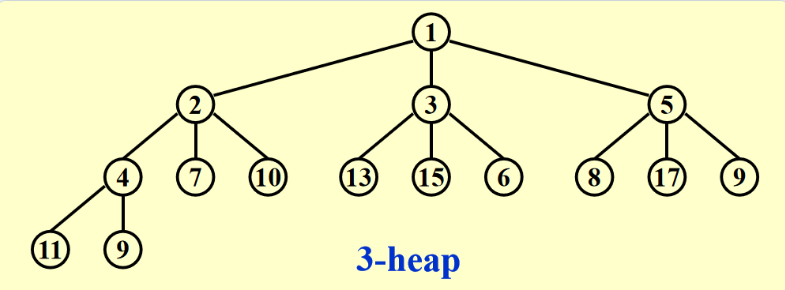

# CHAPTER 6. Priority Queues (Heaps)

## 1. ADT Model
**Operations**
~~~c
PriorityQueue Initialize (int MaxElements);
Void Insert (ElementType X, PriorityQueue H);
ELementType DeleteMin (PriorityQueue H);
ELementType FindMin (PriorityQueue H);
ELementType DeleteMax (PriorityQueue H);
ELementType FindMax (PriorityQueue H);
~~~

## 2. Binary Heap
### 2.1 Introduction
**Definition**: ***A binary tree*** with $n$ nodes and height $h$ is **complete** if its nodes correspond to the nodes numbered from $1$ to $n$ in the perfect binary tree of height $h$.
* 一个高度为 *h* 的完全二叉树的节点数 *n* 在 $2^h$ 和 $2^{h+1}−1$ 之间，$h=⌊logN⌋$

- 【Lemma】If a complete binary tree with **n nodes** is represented sequentially, then for any node with **index i**, \( $1 \leq i \leq n$ \), we have:
  1. $$ index \space of \space parent (i) = 
     \begin{cases} 
     \left\lfloor i/2 \right\rfloor & \text{if } i \neq 1 \\
     \text{None} & \text{if } i = 1 
     \end{cases} $$
  2. $$index \space of \space left\space child (i) = 
     \begin{cases} 
     2 i & \text{if } 2 i \leq n \\
     \text{None} & \text{if } 2 i > n 
     \end{cases} $$
  3. $$index \space of \space right\space child (i) = 
     \begin{cases} 
     2 i+1 & \text{if } 2 i+1 \leq n \\
     \text{None} & \text{if } 2 i+1 > n 
     \end{cases} $$
- 初始化
  ```c
  PriorityQueue Initiailize (int MaxElments)
  {
      PriorityQueue H;
      If (MaxElements < MinPQSize)
          Return Error ("Priority queue size is too small");
      H = (PriorityQueue) malloc (sizeof (struct HeapStruct));
      If (H == NULL)
          Return FatalError ("Out of Space!!!");
      // Allocate the array plus one extra for sentinel
      H->Elements = (ElementType * ) malloc ((MaxElements + 1) * sizeof (ElementType));
      If (H->Elements == NULL)
          Return FatalError ("Out of Space!!!");
      H->Capacity = MaxElements;
      H->Size = 0;
      H->Elements[0] = MinData;  // set the sentinel
      Return H;
  }
  ```

### 2.2 Heap Order Property
**[Definition]** 
* A **min tree 最小树** is a tree in which the key value in each node is **no larger** than the key values in its children
* A **min heap 最小堆** is a complete binary tree that is also a min tree.

### 2.3 Basic Heap Operations
#### 1. Insertion
- 先放到最后一个位置，然后和父节点比较，不满足条件则和父节点交换，直到满足
  > 这种技巧被称为“**上滤 (percolate up)**”

  ```c
  Void Insert (ElementType X, PriorityQueue H) {
      Int i;
      If (IsFull (H)) {
          Error ("Priority queue is full");
          Return;
      }
      For (i = ++H->Size; H->Elements[i/2] > X; i /= 2) {
          H->Elements[i] = H->Elements[i/2];
      }
      H->Elements[i] = X;
  }
  ```
* $T (N)=O (logN)$

####  2. DeleteMin
- 将最后一个叶节点放到根节点，然后和两个儿子比较，不满足则和最大（或最小）的儿子交换，直到满足

  > 这种技巧被称为“**下滤 (percolate down)**”

  ```c
  ElementType DeleteMin (PriorityQueue H) {
      Int i, Child;
      ElementType MinElement, LastElement;
      If (IsEmpty (H)) {
          Error ("Empty Heap");
          Return H->Elements[0];
      }
      MinElement = H->Elements[1];
      LastElement = H->Elements[H->Size--];
      for (i = 1; i * 2 <= H->size; i = Child) {
          Child = i * 2;
          if (Child != H->Size && H->Elements[Child + 1] < H->Elements[Child]) {
              Child++;
          }
          If (LastElement > H->Elements[Child]) {
              H->Elements[i] = H->Elements[Child];
          } else {
              Break;
          }
      }
      H->Elements[i] = LastElement;
      Return MinElement;
  }
  ```

####  3. Other operations
* $DecreaseKey ( P, ∆, H )$ 
  **Percolate up** 自下而上堆化（即这个元素可能会向上移动）
- $IncreaseKey ( P, ∆, H )$ 
  **Percolate down** 自上而下堆化（即这个元素可能会向下移动）
- $Delete ( P, H )$
  从堆中移除位置为 $P$ 的节点，可以运用 `DecreaseKey ()` 和 `DeleteMin ()` ，其中前者第二个参数令为 $\infty$，然后利用 `DeleteMin ()`
- $BuildHeap ( H )$
  * **Build Minheap**: 可将序列当作二叉树，然后从**最后一个非叶节点**开始，进行 `PercolateDown`，复杂度为 $O (N)$
  * **Build Maxheap**: 可将序列当作二叉树，然后从**最后一个非叶节点**开始，进行 `PercolateDown`，复杂度为 $O (N)$
  
## 3. D-Heaps

* `Insert ( )`: $O (\log_d N)$，`DeleteMin ( )`: $O (d\log_d N)$
