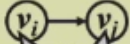
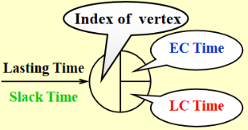
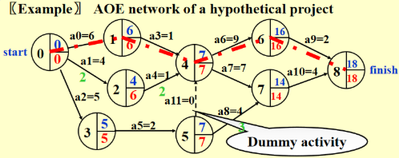
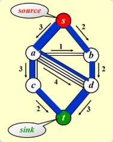
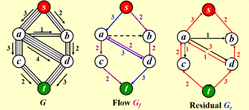
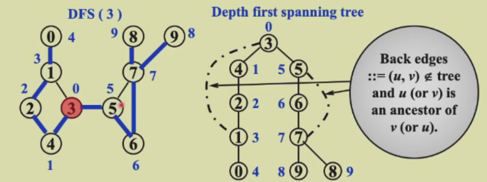

# CHAPTER 9. Graph Algorithm

## 1. Definitions
- **G (V, E)** where **G** is ***graph 图***,  **V = V (G)** is finite nonempty set of ***vertices 顶点***, and **E = E (G)** is finite set of ***edges 边***
- ***Undirected graph 无向图*** : $(v_i, v_j) = (v_j, v_i)$ ::= the same edge.
- ***Directed graph (digraph) 有向图*** : $<v_i, v_j> ::=$    $≠ <v_j, v_i>$

- **Restrictions**:
  1. ***Self loop 自环*** is illegal.
  2. ***Multigraph 多重图*** is not considered.
- ***Complete graph 完全图*** : a graph that has the maximum number of edges
- $v_i$ and $v_j$ are ***adjacent 邻接*** ；$v_i, v_j$ is **incident on** $v_i$ and $v_j$
- $v_i$ is ***adjacent** **to***  $v_j$ ； $v_j$ is ***adjacent from*** $v_i$  ； $<v_i, v_j>$ is **incident on** $v_i$ and $v_j$

- ***Subgraph 子图*** $G' \subset G$ ::= $V (G') \subseteq V (G) \space \&\& \space E (G') \subseteq E (G)$

- ***Path ($\subset G$) from $v_p$ to $v_q$*** ::= $\{v_p, v_{i 1}, v_{i 2}, \cdots, v_{in}, v_q\}$ such that $(v_p, v_{i 1}), (v_{i 1}, v_{i 2}), \cdots, (v_{in}, v_q)$ or $<v_p, v_{i1}>, \cdots, <v_{in}, v_q>$ belong to $E (G)$

- ***Length of a path*** ::=  number of edges on the path

- ***Simple path*** ::= $v_{i 1}, v_{i 2}, \cdots, v_{in}$ are distinct

- ***Cycle*** ::= simple path with $v_p = v_q$

- ***connected 联通***
  * **undirected Graph**
    * $v_i$ and $v_j$ in an undirected $G$ are ***connected*** if there is a path from $v_i$ to $v_j$ （联通指***存在路径***即可，不需要直接连接两点）
    * An undirected graph \(G\) is ***connected*** if every pair of distinct $v_i$ and $v_j$ are connected
    * (Connected) ***Component*** of an undirected G ::= the maximal connected subgraph***最大联通的图***
    * A **tree** is a graph that is ***connected 联通*** and ***acyclic 无环***

  * **directed Graph**
    * A **DAG** ::= ***a directed acyclic graph 有向无环图***
    * ***Strongly connected 强连通*** directed graph G : for every pair of $v_i$ and $v_j$ in $V (G)$, there exist directed paths from $v_i$ to $v_j$ and from $v_j$ and $v_i$. 
    * ***weakly connected 弱联通*** directed graph G :  the graph is connected without direction to the edges
    * ***Strongly connected component 强连通分量*** ::= the maximal subgraph that is strongly connected

- ***Degree (v)*** ::= number of edges incident to v. For a directed G, we have ***in - degree*** and ***out - degree***. 

### Representation of Graph

#### 1. 邻接矩阵 (adjacency matrix)

$$
Adj_mat[i][j] = 
\begin{cases} 
1 & \text{if } (v_i, v_j) \text{ or } <v_i, v_j> \in E (G) \\
0 & \text{otherwise}
\end{cases}
$$

#### 2. 邻接表 (adjacency lists)

.

#### 3. 邻接多重表 (adjacency multilist)

> 不作要求，了解即可

.

## 2. Topological Sort

- ***AOV Network*** : digraph G in which $V (G)$ represents ***activities*** and $E (G)$ represents ***precedence relations*** 

- $i$ is a predecessor of $j$ : there is a path from $i$ to $j$

- $i$ is an immediate ***predecessor 前任*** of j : $<i, j>$in $E (G)$

- Then $j$ is called a successor (***immediate successor 直接前任***) of $i$

- **Partial order 偏序** : a precedence relation which is both **transitive** ($i \to k, k\to j\Rightarrow i\to j$) , **irreflexive** ($i\to i$ is impossible ) and **anti-symmetric)**$((i→j)∧(j→i)⇒i=j)$

- Feasible **AOV network** must be a **DAG** (directed acyclic graph).

**[Definition]** A **topological order** is a linear ordering of the vertices of a graph such that, for any two vertices, $i$, $j$, if $i$ is a predecessor of  in$j$ the network then $i$ precedes $j$ in the linear ordering. 

* The topological orders may not be unique for a network.

~~~c
// version 1
Void Topsort (Graph G)
{
    Int Counter;
    Vertex V, W;
    For (Counter = 0; Counter < NumVertex; Counter++)
    {
        V = FindNewVertexOfDegreeZero (); // O (|V|)
        If (V == NotAVertex)
        {
            Error ("Graph has a cycle");
            Break;
        }
        TopNum[V] = Counter; // or output V
        For (each W adjacent from V)
            Indegreep[W]--;
    }
}
~~~

> * `FindNewVertexOfDegreeZero ()`：扫描 `Indegree[]` 数组，找到入度为 0 且未赋予拓扑序的顶点，如果没有找到顶点，那么表明图中出现了环
> * 每处理完一个顶点 V 后，就需要让从 V 出发与 V 邻接的顶点的入度 -1，相当于在图上移除了顶点 V 以及它的所有出边

* Time Complexity $T=O (|V|^2)$

~~~c
// version 2, using queue ADT
Void Topsort (Graph G)
{
    Queue Q;
    Int Counter = 0;
    Vertex V, W;

    Q = CreateQueue (NumVertex); 
    For (each vertex V)
        If (indegree[V] == 0) 
            Enqueue (V, Q);
    While (! IsEmpty (Q))
    {
        V = Dequeue (Q);
        TopNum[V] = ++Counter;  // assign next
        For (each W adjacent from V)
            If (--indegree[W] == 0)
                Enqueue (W, Q);
    } // end-while
    If (Counter != NumVertex)
        Error ("Graph has a cycle")
    DisposeQueue (Q); // free memery
}
~~~

> 将所有**未赋予拓扑序的、度为 0 的顶点**放入特殊的盒子（比如**队列**或 **栈*）里

* Time Complexity $T=O (|E|+|V|)$

## 3. Shortest Path Algorithms

Given a digraph $G = (V, E)$, and a cost function $c (e)$ for $e \in E (G)$. The length of a path $P$ from source to destination is $\sum_{e_i \in P} c (e_i)$ (also called ***带权路径长度 weighted path length***).

### 3.1 Single-Source Shortest-Path Problem

Given as input a weighted graph, $G = (V, E)$, and a distinguished vertex $s$, find the shortest weighted path from $s$ to every other vertex in $G$.

####  **1. Unweighted Shortest Paths**

- **Table[ i ]. Dist**: distance from $s$ to $v_i$ /* initialized to be $∞$ except for $s$ */
- **Table[ i ]. Known**: 1 if $v_i$ is checked; or 0 if not
- **Table[ i ]. Path**: for tracking the path /* initialized to be 0 */


**广度优先搜索 (breadth-first search, BFS)**

```c
Void Unweighted (Table T){
    Int CurrDist;
    Vertex V, W;
    For (CurrDist = 0; CurrDist < NumVertex; CurrDist++){
        For (each vertex V)
            If (! T[V]. Known && T[V]. Dist == CurrDist){
                T[V]. Known = true;
                For (each W adjacent to V)
                    If (T[W]. Dist == infinity){
                        T[W]. Dist = CurrDist + 1;
                        T[W]. Path = V;  // (*)
                    }// end-if Dist == Infinity
            } // end-if !Known &&Dist == CurrDist
    } // end-for CurrDist
}
```

* $T=O (|V|^2)$

```c
// version 2
Void Unweighted (Table T){
    // T is initialized with the source vertex S given
    Queue Q;
    Vertex V, W;
    Q = CreateQueue (NumVertex);
    MakeEmpty (Q);
    Enqueue (S, Q); // Enqueue the source vertex
    While (! IsEmpty (Q)){
        V = Dequeue (Q);
        T[V]. Known = true;  // not really necessary
        For (each W adjacent to V)
            If (T[W]. Dist == Infinity){
                T[W]. Dist = T[V]. Dist + 1;
                T[W]. Path = V;
                Enqueue (W, Q);
            } // end-if Dist == Infinity
    } // end-while
    DisposeQueue (Q); // free memory
}
```

#### 2. Dijkstra's Algorithm (for weighted shortest paths)

* 令 $S = \{s$ 和已找到最短路径的顶点 $v_i$ 的集合 $\}$
  对于 $\forall u \notin S$，定义 $\text{distance}[u] =$ 路径 $\{s \rightarrow (v_i \in S) \rightarrow u\}$ 的最小长度

  - Dijkstra 算法按阶段执行，在每个阶段中，挑选一个顶点 $v$，它是所有**未被标记**的顶点中 $d_v$**最短**的顶点（有多个最短则任意挑选）
  - 对于从顶点 $v$ 出发的邻接顶点 $w$，$d_w = \min (d_w, d_v + c_{v, w})$
  - 标记顶点 $v$，即令 $v \in S$
  - 然后对于剩余未被标记的顶点，重复上述操作，直至所有顶点均被标记

  不难发现，这是一种**贪心算法 Greedy Algorithm**

 ##### Some Preparations

```c
// Declarations for Dijkstra's algorithm
Typedef int Vertex

Struct TableEntry
{
    List Header; // Adjacency list
    Int Known;
    DistType Dist;
    Vertex Path;
};

// Vertices are numbered from 0
#define NotAVerTex (-1)
Typedef struct TableEntry Table[NumVertex];

// Initialization
Void InitTable (Vertex Start, Graph G, Table T)
{
    Int i;

    ReadGraph (G, T);
    For (i = 0; i < NumVertex; i++)
    {
        T[i]. Known = False;
        T[i]. Dist = Infinity;
        T[i]. Path = NotAVerTex;
    }
    T[Start]. Dist = 0;
}

// Print shortest path to V after Dijkstra has run
// Assume that the path exists
Void PrintPath (Vertex V, Table T)
{
    If (T[V]. Path != NotAVertex)
    {
        PrintPath (T[V]. Path, T);
        Printf (" to");
    }
    Printf ("%v", V) // %v is pseudocode
}
```

##### Codes

```c
Void Dijkstra (Table T){
    Vertex V, W;
    For (;;){
        V = smallest unknown distance vertex;
        If (V == NotAVertex)
            Break;
        T[V]. Known = true;
        For (each W adjacent to V)
            If (! T[W]. Known)
                If (T[V]. Dist + Cvw < T[W]. Dist) // 这步操作被称为“松弛”
                {
                    Decrease (T[W]. Dist to T[V]. Dist + Cvw); 
                    T[W]. Path = V;
                } // end-if update W
    } // end-for (;;)
} // now work for edge with negative cost
```

##### Time Complexity

* **Implementation 1**

  * $V$ = smallest unknown distance vertex;   

    /* simply scan the table – $O (|V|)$*/

  * $T = O (|V|^2 + |E|)$  - Good if the graph is ***dense 稠密*** （此时复杂度相当于线性复杂度)

* **Implementation 2** 

  * $V$ = smallest unknown distance vertex;  

    /* keep distances in a **priority queue** and call DeleteMin – $O (\log|V|)$*/

  * Decrease ( $T[W]. Dist$ to $T[V]. Dist + C_{vw}$ );  

    * Method 1: DecreaseKey – $O (\log|V|)$
      $T = O (|V|\log|V| + |E|\log|V|) = O (|E|\log|V|)$ 

    * Method 2: 将更新后的 $d_w$ 插入堆中

      在 `V = smallest unknown distance vertex;` 中，重复使用 `DeleteMin`，直到未标记的点出现（标记过的点就扔掉不用）
      $T = O (|E|\log|V|)$ but requires $|E|$ DeleteMin with $|E|$ space 

#### 3. Graphs with Negative Edge Costs

* Codes

  > 无权重最短路算法 + Dijkstra 算法
  >
  > 1. 将起始顶点 S 放到队列中
  > 2. 在每一阶段取队头元素$v$，找出$v$的所有邻接顶点$w$
  > 3. 若$d_w > d_v + C_{v, w}$，则更新$d_w$的值，并且若$w$不在队列，把它放入队列中
  > 4. 重复过程直到队列为空

  ~~~c
  Void WeightedNegative (Table T)
  {
      Queue Q;
      Vertex V, W;
      Q = CreateQueue (NumVertex);
      MakeEmpty (Q);
      Enqueue (S, Q); // Enqueue the source vertex
      While (! IsEmpty (Q)) // each vertex can dequeue at most |V| times
      {
          V = Dequeue (Q);
          For (each W adjacent to V)
              If (T[V]. Dist + Cvw < T[W]. Dist) // no longer once per edge
              {
                  T[W]. Dist = T[V]. Dist + Cvw;
                  T[W]. Path = V;
                  If (W is not already in Q)
                      Enqueue (W, Q);
              } // end-if update
      } // end-while
      DisposeQueue (Q); // free memory
  } // negative-cost cycle will cause indefinite loop
  ~~~

* $T=O (|E|\times|V|)$

* 如果出现**负值环**，该算法将会陷入无限循环。因此，记录每个顶点的出队次数，发现有顶点出队次数多于 $∣V∣$ 次时，就终止程序

#### 4. Acyclic Graphs

* If the graph is acyclic, vertices may be selected in **topological order** since when a vertex is selected, its distance can no longer be lowered without any incoming edges from unknown nodes. 

* $T = O (|E| + |V|)$ and no priority queue is needed. 

**Application**: 

* **AOE Networks** 
  

  $a_i$ := activity，$v_j$: Signals the completion of $a_i$



> 注：必要时需要添加 dummy edges 和 dummy nodes，避免错误或缺少的依赖关系产生

* 计算 **EC** 

  Start from $v_0$, for any $a_i = <v, w>$, we have 
  $$
  EC[0]=0, EC[w] = \max_{(v, w) \in E} \{ EC[v] + C_{v, w} \} 
  $$

* 计算 **LC** 

  Start from the last vertex, for any $a_i = <v, w>$, we have 
  $$
  LC[endIndex]=EC[endIndex], LC[v] = \min_{(v, w) \in E} \{ LC[w] - C_{v, w} \}
  $$

* **Slack Time** of $<v, w>  = LC[w] - EC[v] - C_{v, w} $

* **Critical Path** : path consisting entirely of **zero - slack** edges. 

### 3.2 All-pairs Shortest Path Problem

For all pairs of $v_i, v_j$ ($i \neq j$), find the shortest path between.

* Method 1: Use **single-source algorithm** for $|V|$ times.

  $T=O (|V|^3)$ - works fast on sparse graph

* Method 2: $O (|V|^3)$ algorithm

## 4. Network Flow Problems



### 4.1 Solution

* allow the algorithm to **undo 撤销** its decisions

  

### Analysis

> 前提：所有边的容量为整数

* An augmenting path can be found by a depth first search algorithm

  $T=O (f\cdot|E|)$, where $f$ is the maximum flow


如果我们随机挑选增广路径，挑到一条包括 $a→b$ 的路径，就会产生问题：

> Random augmentations could continually augment along a path that includes the edge connected by a and b. If this were to occur repeatedly, 2,000,000 augmentations would be required, when we could get by with only 2.

#### **Solution**

* 在选择增广路径时，总是挑选**对流量提升最大**的路径
  $$
  \begin{align*}
  T&=T_{\text{augmentation}}\cdot T_{\text{find a path}}\\
  &=O (|E|\log \text{cap}_{\text{max}})\cdot O (|E|\log |V|)\\
  &=O (|E|^2\log |V|) \quad (\text{if } \text{cap}_{\text{max}} \text{ is a small integer})
  \end{align*}
  $$

* 在选择增广路径时，挑选**边最少**的增广路径
  $$
  \begin{align*}
  T&=T_{\text{augmentation}}\cdot T_{\text{find a path}}\\
  &=O (|E|\cdot |V|)\cdot O (|E|)\text{(unweighted shortest path algorithm)}\\
  &=O (|E|^2\log |V|) 
  \end{align*}
  $$

## 5. Minimum Spanning Tree

**【Definition】** A **spanning tree** of a graph G is a **tree** which consists of V (G) and a subset of E (G). 

* Note: 
  * The minimum spanning tree is a ***tree*** since it is **acyclic** -- the number of edges is $|V| - 1$. 
  * It is ***minimum*** for the total cost of edges is minimized.  
  * It is ***spanning*** because it covers every vertex.  
  * A minimum spanning tree exists iff G is ***connected***.  
  * Adding a non-tree edge to a spanning tree, we obtain a ***cycle***. 

### 5.1 Prim's Algorithm

- 初始情况下，先将一个顶点作为树的**根**放入树内
- 在每个阶段，添加边 $(u, v)$，满足 $(u, v) $的权重是来自已有生成树的顶点 $u$ 和来自生成树外的 $v$ 之间的所有边中权重最小的那条，且不产生环，然后将新的顶点 $v$ 添加至树里
- 重复上述步骤，直至所有顶点均在生成树内

时间复杂度：

- 不用堆（适用于***稠密图***）：$O (|V|^2)$
- *二叉堆*（适用于***稀疏图***）：$O (E\log⁡|V|)$

```c
Int prim (int w_adj_mat[MAX][MAX], int n)
{
Int dist[MAX]; // distance from vertex i to the known part
Int prev[MAX]; // for tracing the edges of MST
Int known[MAX]; // 1 if the vertex i is checked, 0 if not

// initialization
For (int i = 0; i < n; i++)
{
    Dist[i] = INFINITY;
    Prev[i] = -1;
    Known[i] = 0;
}

Dist[0] = 0; // start from vertex 0
For (int k = 0; k < n; ++k)
{
    // choose the vertex closest to the known part
    Int min_d = INFINITY;
    Int min_v = -1;
    For (int i = 0; i < n; i++)
    {
    If (! Known[i] && dist[i] < min_d)
    {
        Min_d = dist[i];
        Min_v = i;
    }
    }

    // relaxation of vertices adjacent to the chosen one
    Known[min_v] = 1;
    For (int i = 0; i < n; i++)
    {
    If (! Known[i])
    {
        If (w_adj_mat[min_v][i] && dist[i] > w_adj_mat[min_v][i])
        {
        Dist[i] = w_adj_mat[min_v][i];
        Prev[i] = min_v;
        }
    }
    }
}

// total edge weights
Int total_w = 0;
For (int i = 1; i < n; ++i)
    Total_w += dist[i];
Return total_w;
}
```

### 5.2 Kruskal's Algorithm

* **maintain a forest**

- 初始情况下，有 $∣V∣$ 棵单个节点构成的树
- 添加一条边，可以合并两棵树。
- 挑选边（这里假设挑选边 $(u, v)$）时要注意的细节：
  - 如果 $u, v$ 在同一个集合内，则不能添加这条边（否则会出现环）
  - 否则加入这条边，使用 `Union` 算法将两个集合合并起来
  - 用**堆**维护未被检验过的最小的边，每当检验一条边时，使用 `DeleteMin` 算法

``` c
Void Kruskal (Graph G)
{
    T = { };
    While (T contains less than [V] - 1 edges && E is not empty)
    {
        Choose a least cost edge (v, w) from E; // DeleteMin
        Delete (v, w) from E;
        If ((v, w) does not create a cycle in T)
            Add (v, w) to T; // Union/Find
        Else
            Discard (v, w);
    }
    If (T contains fewer than [V] - 1 edges)
        Error ("No spanning tree");
}
```

* 时间复杂度：$T=O (|E|\log⁡|E|)=O (|E|\log⁡|V|)$    $(|E|=O (|V|^2))$

## 6. Applications of Depth-First Search

* A generalization of preorder traversal

~~~c
Void DFS (Vertex V)
{
    Visited[V] = true; // mark this vertex to void cycles
    For (each W adjacent to V)
        If (! Visited[W])
            DFS (W);
}// T=O (|E|+|V|)
~~~

### 6.1 Undirected Graphs

* 当且仅当 1 次 DFS 能够遍历所有顶点时，无向图是**连通**的

~~~c
Void ListComponents (Graph G)
{
    For (each V in G)
    {
        If (! Visited[V])
            DFS (V);
            Printf ("\n");
    }
}
~~~

### 6.2 Biconnectivity

* $ v $ is an ***articulation point 关节点*** if $ G' = \text{DeleteVertex}(G, v) $ has **<u>at least 2</u>** connected components. 
* $ G $ is a ***biconnected graph 双连通图*** if $ G $ is connected and has no articulation points. 
* A ***biconnected component 双连通分量*** is a maximal biconnected subgraph.

> Note: **No edges** can be shared by two or more biconnected components. Hence E (G) is partitioned by the biconnected components of G, and biconnected components are divided byarticulation points.

#### **Finding the biconnected components of a connected undirected G**

* Use **depth first search** to obtain a spanning tree of $G$

  

  * Note: If $u$ is an ancestor of $v$, then $Num (u)<Num (v)$

* Find the **articulation points** in $G$

  * 当且仅当**根节点**至少有 $2$ 个孩子时，根节点为关节点
  * 当且仅当**除根节点外的顶点 $u$**至少有 $1$ 个孩子，且该孩子与它的祖先之间没有回边（即`Low (child) >= Num (u)`）时，$u$ 为关节点

$$
Low (u)=min\{Num (u),  min\{Low (w)|\text{w is a child of u}\}, min\{Num (w)|(u, w)\text{is a back edge}\}              \}
$$


* Therefore, $u$ is an articulation point iff
  1. $u$ is the root and has at least $2$ children; or
  2. $u$ is not the root, and has at least $1$ child such that $\text{Low (child)} \geq \text{Num (u)}$.

### 6.3 Euler Circuits

* ***Euler tour*** : Draw each line exactly once without lifting your pen from the paper 
* ***Euler circuit*** : Draw each line exactly once without lifting your pen from the paper, AND finish at the starting point 

**Undirected Graph**

* **【Proposition】**An **Euler circuit** is possible only if the graph is connected and each vertex has an **even degree**.
  当且仅当图是连通的，且**每个顶点的度为偶数**时，存在**Euler circuit**
* **【Proposition】**An **Euler tour** is possible if there are exactly **two** vertices having **odd degree**. One must **start at one of the odd-degree vertices**.
  当且仅当图是连通的，且**仅有两个顶点的度为奇数**时，存在**Euler tour**

**Directed Graph**

* **【Proposition】**An Euler circuit is possible only if the graph is weakly connected and each vertex has the same in-degree and out-degree.
  当且仅当图是弱连通的，且每个顶点的**出度 = 入度**时，存在**Euler circuit**
* **【Proposition】**An Euler tour is possible if there are exactly **one** vertices <u>in-degree = out-degree + 1</u>, and others have the same in-degree and out-degree.
  当且仅当图是弱连通的，且有且仅有**一个**顶点的<u>出度 = 入度 + 1</u>，有且仅有**一个**顶点的<u>入度 = 出度 + 1</u>，其余顶点的<u>出度 = 入度</u>时，存在**Euler tour**

**Using DFS to find Euler Tours**

- The path should be maintained as a linked list.
- For each adjacency list, maintain a pointer to the last edge scanned.
- $ T = O (|E| + |V|) $