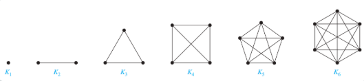
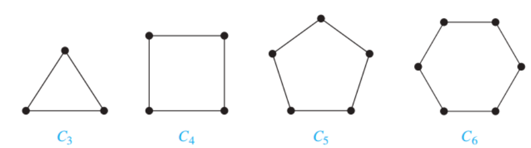
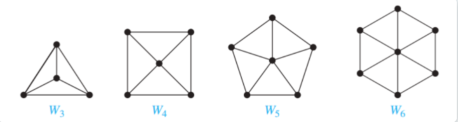
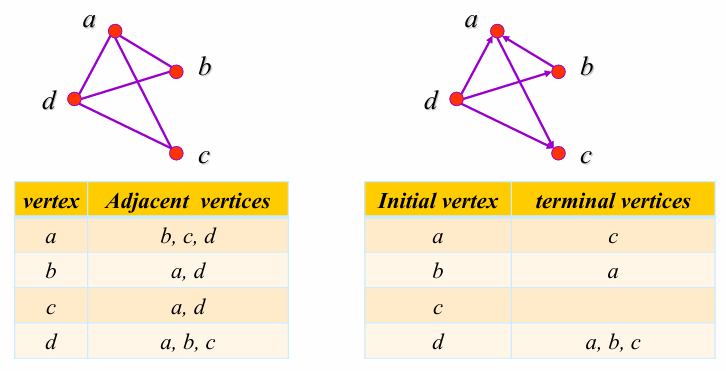
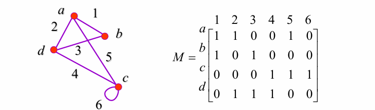
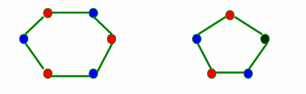
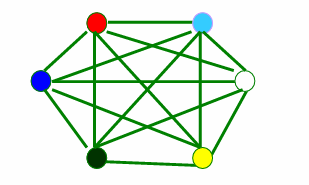
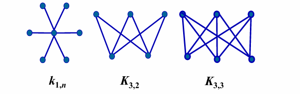

# Ch10 Graphs
## 10.1 Graphs and Graph Models
### 1. The Concept of Graph
* **【Definition 1】**A ***graph图*** $G=(V,E)$ consists of $V$, a nonempty set of ***vertices顶点*** and $E$, a set of ***edges 边***. Each edge has either one or two vertices associated with it, called its ***endpoints端点***. An edge is said to connect its endpoints.
  * **Infinite graph无限图**: a graph with an infinite vertex set or an infinite number of edges
  * **Finite graph有限图**: a graph with an finite vertex set and a finite number of edges
* **【Definition 2】**A ***directed graph有向图*** (or ***digraph***) $(V, E)$ consists of a nonempty set of vertices $V$ and a set of **directed edges** (or **arcs**) $E$.  
  Each directed edge is associated with an ordered pair of vertices. The directed edge associated with the ordered pair $(u,v)$ is said to start at $u$ and end at $v$.

#### **Types of Graphs**

* **Undirected graph无向图** : a graph with **undirected** edges. 
  * ***Simple graph简单图*** : A graph in which each edge connects two different vertices and where **no two edges connect the same pair of vertices**. 
  * ***Multigraph多重图*** : Graphs that may have **multiple edges** connecting the same vertices.
  * ***Pseudograph伪图*** : Graphs that may include **loops**, and possibly multiple edges connecting the same pair of vertices

* **Directed graph有向图** : a graph with **directed** edges. 
  * ***Simple directed graph简单有向图*** : a directed graph has **no loops** and has **no multiple directed edges**.

  * ***Directed multigraph有向多重图*** : a directed graphs that may have **multiple directed edges**  from a vertex to a second (possibly the same)  vertex.

* ***Mixed graph混合图*** : a graph with **both** directed and undirected edges.    

### 2. Graph Models

> Omitted

## 10.2 Graph Terminology and Special Types of Graphs

### 1. Basic Terminology

#### Undirected Graphs

*  Two vertices, u and v in an undirected graph G are called ***adjacent相邻*** (or **neighbors**) in $G$, if $\{u, v\}$ is an edge of $G$. 

* An edge $e$ connecting $u$ and $v$ is called ***incident*** with vertices $u$ and $v$, or is said to **connect $u$ and $v$**. 

* The vertices $u$ and $v$ are called **endpoints** of edge $\{u, v\}$. 

* **Loop**: an edge connects a vertex to itself. 

* The **neighborhood** of $v (N(v))$: the set of **all neighbors** of a vertex $v$ 

* The ***degree度数*** of a vertex in an undirected graph is the number of edges incident with it, except that a loop at a vertex contributes twice to the degree of that vertex     

  Notation: $deg(v)$         

  * If $deg(v) = 0$, $v$ is called **isolated孤立的**.    
  * If $deg(v) = 1$, $v$ is called **pendant下垂的**.

**【Theorem 1】** ==**The Handshaking Theorem握手定理**== : Let $G = (V, E)$ be an undirected graph $G$ with $e$ edges. Then $\sum_{v\in V}deg(v)=2e$

**【Theorem 2】** An undirected graph has an **even number** of vertices of odd degree. 在无向图中，度为*奇数*的顶点个数为偶数

#### Directed Graphs 

Let $(u, v)$ be an edge in $G$. Then $u$ is an **initial vertex起点** and is adjacent to $v$ and $v$ is a **terminal vertex终点** and is adjacent from $u$. The **in degree入度** of a vertex $v$, denoted $deg⁻(v)$, is the number of edges which terminate at $v$. Similarly, the **out degree出度** of v, denoted $deg⁺(v)$, is the number of edges which initiate at $v$. 

**【Theorem 3】**Let $G = (V, E)$ be a graph with direct edges. Then $\sum_{v\in V}d^+(v)=\sum_{v\in V}d^-(v)=|E|$

### 2. Some Special Simple Graphs

* ***Complete Graphs完全图*** - ==$K_n$==

  exactly **one edge** between **every pair** of distinct vertices

  

* ***Cycles环*** - ==$C_n (n>2)$==

  $C_n=(V,E),where \space V=\{v_1,v_2,\dots , v_n\},E=\{(v_1,v_2),(v_2,v_3),\dots , (v_{n-1},v_n),(v_n,v_1)\},n \geq 3$

  

* ***Wheels轮*** - ==$W_n(n>2)$==

  Add one additional vertex to the cycle $C_n$ and add an edge from each vertex to the new vertex to produce $W_n$.

  

* ***n-Cubes*** - ==$Q_n (n>0)$==

  $$Q_n = \langle V, E \rangle$$ is a graph with $$2^n$$ vertices representing bit strings of length n, where $V = \{ v | v = a_1a_2...a_n, a_i = 0, 1, i = 1, 2, ..., n \}$ and $E = \{ (u, v) | u, v \in V \land u \text{ and } v \text{ differ in exactly one bit position }\}.$

  

  > * Construct $Q_{n+1}$ from $Q_n$
  >
  >   1. making two copies of $Q_n$ , prefacing the labels on the vertices with a $0$ in one copy and with a $1$ in the other copy  
  >
  >   2. adding edges connecting two vertices that have labels differing only in the first bit 
  >
  >       
  >
  > * The number of edges: $a_n=2a_{n-1}+2^{n-1}$

### 3. Bipartite Graphs

* A simple graph $ G $ is ***==bipartite二分的==*** if $ V $ can be partitioned into two disjoint subsets $ V_1 $ and $ V_2 $ such that every edge connects a vertex in $ V_1 $ and a vertex in $ V_2 $. 

* The pair $ \{V_1, V_2\} $ is called a ***bipartition二分*** of the vertex $ V $ of $ G $.

  

* **【Theorem 4】** A simple graph is **bipartite** if and only if it is possible to assign one of **two different colors** to each vertex of the graph so that no two adjacent vertices are assigned the same color. 

* The **complete bipartite graph完全二分图** is the simple graph that has its vertex set partitioned into two subsets $ V_1 $ and $ V_2 $ with $ m $ and $ n $ vertices, respectively, and every vertex in $ V_1 $ is connected to every vertex in $ V_2 $, denoted by ==$ K_{m,n} $==, where $ m = |V_1| $ and $ n = |V_2| $.

  

### 4. Regular graph Regular graph 

* A simply graph is called ==**regular**== if every vertex of this graph has the **same degree**. 
* A regular graph is called **n-regular** if every vertex in this graph has degree $n$

### 5. New Graphs From Old

#### **Subgraph**  

$ G = (V, E) $, $ H = (W, F) $    

* $ H $ is a **subgraph子图** of $ G $ if $ W\subseteq V$, $F \subseteq E$.     

* subgraph $ H $ is a **proper subgraph真子图** of $ G $ if $ H \neq G $.    

* $ H $ is a **spanning subgraph生成子图** of $G$ if $W = V$, $F \subseteq E$

* **Subgraph induced点诱导子图** by a subset of $V$

   Let $G=(V,E)$ be a simple graph. The subgraph induced by <u>a subset ***W*** of the vertex set ***V***</u> is the graph $(W,F)$, where the edge set $F$ contains an edge in $E$ iff both endpoints of this edge are in $W$

  > 定一个图 $G=(V,E)$，其中 $V$ 是顶点集合，$E$ 是边集合，对于 $V$ 的任意非空子集 $S$，由 $S$ 中的顶点以及 $G$ 中连接这些顶点的**所有边**组成的子图称为**<u>由 S 点诱导的子图</u>**。

**得到新图的方式**

  * **Removing edges of a graph** : $G-e=(V,E-\{e\})$
  * **Adding edges to a graph** : $G+e=(V,E+\{e\})$
  * **Edge contration 边压缩** : 
    1.  Remove an edge $e$ with endpoints $u$ and $v$, 
    2.  merge $u$ and $v$ into a new single vertex $w$, 
    3.  and for each edge with $u$ or $v$ as an endpoint replaces the edge with one with $w$ as endpoint in place of $u$ and $v$ and with the same second endpoint. 
  * **Removing vertices from a graph** : $G-v =(V-v, E’)$, where $E’$ is the set of edges of $G$ not incident to $v$

### 6. Graph Union

The union of two simple graphs $G1 = ( V1 , E1 )$ and $G2 = ( V2 , E2 )$ is the simple graph with vertex set $V = V1 ∪ V2$ and edge set $E = E1 ∪ E2$. 

* Notation:  $G1 ∪ G2$

## 10.3 Representing Graphs and Graph Isomorphism

### 1. Adjacency lists

* lists that specify the vertices that are adjacent to each vertex

  

### 2. Adjacency Matrices

* A simple graph $G = (V, E)$ with $n$ vertices $(v_1,v_2,\dots,v_n)$ can  be represented by its ***adjacency matrix邻接矩阵***, $A$, where $a_{ij} = 1$ if $\{v_i, v_j \}$ is an edge of $G$, $a_{ij} = 0$ otherwise.

  

* The adjacency matrix of a **multigraph** or **pseudograph**

  The $(i, j)th$ entry of such a matrix equals the number of edges that  are associated to $\{v_i, v_j\}$.

  

* The adjacency matrix of a **directed graph**

  For directed graph $G = (V, E)$ with $|V| = n$, suppose that the vertices of $G$ are listed in arbitrary order as $v_1, v_2, …, v_n$, the adjacency matrix $A = [a_{ij}]$, where $a_{ij} = 1$ if $(v_i, v_j)$ is an edge of $G$, $a_{ij} = 0$ otherwise.

  

### 3. Incidence matrices 

$G = (V, E)$, $V = \{v_1, v_2, ..., v_n\}$, $E = \{e_1, e_2, ..., e_m\}$. The ***incidence matrix关联矩阵*** with respect to this ordering of $V$ and $E$ is an $n \times m$ matrix $M = [m_{ij}]_{n \times m}$, where $m_{ij} = \begin{cases} 1 & \text{when edge } e_j \text{ is incident with } v_i \\ 0 & \text{otherwise} \end{cases}$

### 4. Isomorphism Of Graphs

* Two simple graphs $ G_1 = (V_1, E_1) $ and $ G_2 = (V_2, E_2) $ are **isomorphic同构的** if there is a $1-1$ and onto function $ f $ ($ f $ is called an **isomorphism**) from $ V_1 $ to $ V_2 $ such that for all $ a $ and $ b $ in $ V_1 $, $ a $ and $ b $ are adjacent in $ G_1 $ iff $ f(a) $ and $ f(b) $ are adjacent in $ G_2 $. 
* In other words, when two simple graphs are isomorphic, there is a **one-to-one correspondence** between vertices of the two graphs that preserves the adjacency relationship.

#### How to determine?

* It is usually difficult to find an isomorphism $f$ since there are $n!$ possible $1-1$ correspondence between the two vertex sets with $n$ vertices.  

* some properties (called **invariants不变量**) in the graphs may be used to show that they are not **isomorphic**

  **Important invariants in isomorphic graphs**: 

  * the number of vertices 
  * the number of edges 
  * the degrees of corresponding vertices  
  * if one is bipartite, the other must be 
  * if one is complete, the other must be  
  * if one is a wheel, the other must be etc.

## 10.4 Connectivity

### 1. Paths

**The concept of path** : In $G = (V, E)$, it is usually considered that starting from one vertex and terminating at another vertex by passing along some edges. 

#### Definition of path in undirected graph 

* **Path of length $n$ from $u$ to $v$ in an undirected graph**  
* a sequence of $n$ edges $e_1, ..., e_n$ for which there exists a sequence $x_0=u, x_1, ..., x_{n-1}, x_n=v$ such that $e_i$ has endpoints $x_{i-1}$ and $ x_{i}$  
  
* When the graph is simple, we denote this path by its vertex sequence $x_0, x_1, ..., x_{n-1}, x_n$ 
* **Circuit** : if the path begins and ends with the same vertex 
* The path or circuit is said to **pass through** the vertices $x_0, x_1, ..., x_{n-1}, x_n$  or **traverse** the edges $e_1, ..., e_n$ 
* **Simple path/circuit** : if it does not contain the same edge more than once

#### Definition of path in directed graph   

* **path of length $n$ from $u$ to $v$ in a directed graph**  
  * a sequence of edges $e_1, ..., e_n$ such that $e_1$ is associated with $(x_0,x_1),e_2,\dots$
  
  * When there are no multiple edges in the directed graph, this path is denoted by its vertex sequence $x_0, x_1, ..., x_{n-1}, x_n$ 
  
* **circuit or cycle**  
  * if the path begins and ends with the same vertex 

* **simple path/circuit**  
  * if it does not contain the same edge more than once

### 2. Connectedness in undirected graphs

**Definition**

* An undirected graph is **connected联通的** : if there is a path between **every pair** of distinct vertices 
* An undirected graph is **disconnected不连通的** : the graph is not connected 
* **Disconnect** a graph: remove vertices or edges, or both, to produce a disconnected subgraph. 

**【Theorem 1】**There is a simple path between every pair of distinct vertices of a connected undirected graph. 

**Connected Components连通分量** : The maximally connected subgraphs of $G$ are called the **connected components** or just the **components**. 

### 3. How connected is a graph?

* **cut vertex割点** (or articulation point) 
  * if removing a vertex and all edges incident with it results in **more connected components** than in the original graph. 
* **cut edge割边** or bridge 
  * if removing a edge creates **more components**
* **nonseparable graphs不可分割图**
  * Connected graphs without cut vertices
  * Nonseparable graphs can be thought of as more connected than those with a cut vertex.

### 4. Vertex connectivity

>  How to measure graph connectivity?
>
> * based on the minimum number of vertices that can be removed to disconnect a graph

**Vertex cut, or separating set 点割集**: a subset $V’$ of the vertex set $V$ of $G=(V,E)$ such that $G-V’$ is disconnected.

* Every connected graph except a complete graph has a vertex cut.

**Vertex connectivity点连通度** $κ(G)$ : the minimum number of vertices in a vertex cut. 

* $0\leq κ(G) \leq n-1$

* $ κ(G) =0$ iff $G$ is disconnected or $G=K_1$

* $ κ(G) =1$ iff $G$ is connected with cut vertices or $G=K_2$

* $ κ(G) =n-1$ iff $G$ is complete

  > $K_n$ denotes a complete graph which has $n$ nodes

A graph is **K-connected** (or k-vertex-connected ), if $κ(G)≥K$

### 5. Edge connectivity

**edge cut边割集**: a set of edges $E’$  is called an edge cut of $G$ if the subgraph $G-E’$ is disconnected.

**edge connectivity边连通度** $λ(G)$ : the minimum number of edges in an edge cut of $G$.

* $0\leq λ(G) \leq n-1$ if $G$ has $n$ vertices
* $λ(G)=0$ if $G$ is disconnected or $G$ is a graph consisting of a single vertice
* $λ(G)=n-1$ iff $G=K_n$

**关于点连通度和边连通度的不等式**

* When $G=(V,E)$ is a noncomplete connected graph with at least three vertices $κ(G)≤λ(G)≤min_{v \in V}deg(v)$

### 6. Connectedness in directed graphs

* **strongly connected** 
  * if there is a path from $a$ to $b$ and from $b$ to $a$ for **all** vertices $a$ and $b$ in the graph.   

* **weakly connected** 
  * if the underlying undirected graph is connected
* **strong components of a directed graph**
  * For directed graph, the maximal strongly connected subgraphs are called **the strongly connected components强连通分量** or just **the strong components**

> A weakly connected directed graph with $deg^+(v)=deg^-(v)$ for all vertices $v$ is strongly connected.

### 7. Paths and Isomorphism

* Some other graph invariants involving path  
  * Two graphs are **isomorphic** only if they have <u>simple circuits of the same length</u>.  
  * Two graphs are **isomorphic** only if they contain paths that go through vertices so that the corresponding vertices in the two graphs have the same degree.  

* We can also use paths to find mapping that are potential isomorphisms

### 8. Counting paths between vertices 

**【 Theorem 2】** The number of different paths of length $r$ from $v_i$ to $v_j$ is equal to the $(i, j)th$ entry of $A^r$, where $A$ is the adjacency matrix representing the graph consisting of vertices $v_1, v_2, . . . v_n$.

## 10.5 Euler and Hamilton Paths

### 1. Euler Paths and Circuits

* ==**Euler Path 欧拉路**==: a simple path containing every edge of $G$ 
* ==**Euler Circuit 欧拉环**==: a simple circuit containing every edge of $G$ 
* ==**Euler Graph 欧拉图**==: A graph contains an Euler circuit

**【Theorem 1】** A connected multigraph has an Euler circuit if and only if each of its vertices has ==**even** degree==.

**【Theorem 2】** A connected multigraph has an Euler path but not an Euler circuit if and only if it has ==exactly **two** vertices of odd degree==.

#### Euler circuits and paths in directed graphs

 A directed multigraph having no isolated vertices has an **Euler circuit** if and only if 

* the graph is **weakly connected** 
* the <u>in-degree and out-degree</u> of each vertex are **equal**.

A directed multigraph having no isolated vertices has an **Euler path** but not an Euler circuit if and only if 

* the graph is **weakly connected** 
* the <u>in-degree and out-degree</u> of each vertex are **equal** for all but two vertices, one that has in-degree $1$ larger than its out degree and the other that has out-degree $1$ larger than its in-degree.

### 2. Hamilton’s paths and Circuits

* ==**Hamilton path 哈密顿路**==: a path which visits every vertex in $G$ **exactly once** 
* ==**Hamilton circuit 哈密顿环 (or Hamilton cycle)**==: a cycle which visits every vertex **exactly once**, except for the first vertex, which is also visited at the end of the cycle. 
* ==**Hamilton graph 哈密顿图**==: a connected graph $G$ has a Hamilton circuit

**【 Theorem 3】** ==**DIRAC' THEOREM 狄拉克定理**==: If $G$ is a <u>simple graph</u> with $n$ vertices $n \geq 3$ such that the degree of every vertex in $G$ is at least $n/2$, then $G$ has a Hamilton circuit.  

**【 Theorem 4】** ==**ORE' THEOREM 奥尔定理**==: If $G$ is a simple graph with $n$ vertices with $n\geq3$ such that $deg(u)+deg(v) \geq n$ for every pair of **nonadjacent vertices** $u$ and $v$ in $G$, then $G$ has a Hamilton circuit.

**Another important necessary condition**:

* For any nonempty subset $S$ of set $V$, the number of connected components in $G-S$ $\leq|S|$

## 10.6 Shortest Path Problems

* Weighted graph 带权图:  $G = (V,E,W)$ 
* the length of a path in a weighted graph: The **sum** of the weights of the edges of this path

### A Shortest path Algorithm

$G=(V,E,W)$ is a weighted graph, where $w(x,y)$ is the weight of edge associated vertices $x$ and $y$  (if $(x,y)\notin E,w(x,y)=\infty$ ), $a,z\in V$ , find the shortest path between $a$ and $z$.

#### **Dijkstra’s Algorithm**

 Let $S_k$ denote the set of vertices after $k$ iterations of **labeling procedure**. 

1.  Initialization. Label $a$ with $0$ and other with $∞$, i.e. $L_0(a)=0$, and $L_0(v)= ∞$ and $S_0=φ$
2.  Form $S_k$. The set $S_k$ is formed from $S_{k-1}$ by adding a vertex $u$ not in $S_{k-1}$ with the smallest label.  
3.  Update the labels of all vertices not in $S_k$ , so that $L_k(v)$, the label of the vertex $v$ at the $k_{th}$ stage, is the length of the shortest path from $a$ to $v$ that containing vertices only in $S_k$
4.  Step $2$ and $3$ is iterated by successively adding vertices to the distinguished set the until $z$ is added.

* Update the labels of all vertices not in $S_k$ : $L_k(v)=min\{L_{k-1}(v), L_{k-1}(u)+w(u,v)\}$

**【Theorem 1】**Dijkstra’s algorithm finds the length of a shortest path between two vertices in a connected simple undirected weighted graph.

**【Theorem 2】**Dijkstra’s algorithm uses $O(n^2 )$ operations (additions and comparisons) to find the length of the shortest path between two vertices in a connected simple undirected weighted graph.

#### The Traveling Salesperson Problem

**Solving TSP**

The most straightforward one:  

* Examine all possible Hamilton circuits and select one of  minimum total length. How many are there different length of Hamilton circuits in a complete graph with n vertices?
* $(n-1)!/2$

Approximation algorithm:

* do not necessary produce the exact solution 
* to produce a solution that is close to an exact solution

## 10.7 Planar Graphs

【Definition】A graph is called **planar平面的** if it can be drawn in the plane without any edges crossing. 

* Such a drawing is called a **planar representation平面表示法** of the graph.

### 1. Some terminologies: 

* **Region**: a part of the plane completely disconnected off from other parts of the plane by the edges of the graph. 

  * Bounded region  
  * Unbounded region 

  Note: There is **one unbounded region** in a planar graph. 

* **the boundary of region** 

* **the Degree of Region** $R$ ($Deg(R)$): the number of the edges which surround $R$, suppose $R$ is a region of a connected planar simple graph 

* **adjacent regions**: two regions with a common border  

* If $e$ is not a cut edge, then it must be the **common border** of two regions

### 2. Euler’s Formula

#### **【Theorem 1】** **==Euler’s formula==** 

* Let $G$ be a **connected planar simple graph** with $e$ edges and $v$ vertices. Let $r$ be the number of regions in a planar representation of $G$. Then ==$r=e-v+2$==.

* For **Unconnected simple planar graph**: Suppose that a planar graph $G$ has $k$ connected components, $e$ edges, and $v$ vertices. Let $r$ be the number of regions in a planar representation of $G$. Then ==$r=e-v+k+1$==.

**【Corollary 1】**If $G$ is a **connected** planar simple graph with $e$ edges and $v$ vertices where $v≥3$, then $e≤3v-6$. 

> 显然 $deg(R) ≥ 3$, 并且 $2e=\sum_{all \space regions \space R}degR \geq 3r$, 结合欧拉公式可证明

**【Corollary 2】**If a **connected** planar simple graph has $e$ edges and $v$ vertices with $v≥3$ and no circuits of length $3$, then $e ≤2v-4$.

> 显然 $deg(R) ≥ 4$, 并且 $2e=\sum_{all \space regions \space R}degR \geq 4r$, 结合欧拉公式可证明

**【Corollary 3】**If $G$ is a **connected** planar simple graph, then $G$ has a vertex of degree not exceeding **five**.

> By Corollary 1 , we know that $e≤3v-6$ , so $2e≤6v-12$. If the degree of every vertex were at least six, then $2e≥6v$, there is no solution

### 3. Kuratowski's Theorem

**Elementary subdivision初等细分**: If a graph is planar, so will be any graph obtained by removing an edge $\{u, v\}$ and adding a new vertex $w$ together with edges $\{u,w\}$ and $\{w,v\}$.

**homeomorphic同胚的** : the graph $G_1=(V_1,E_1)$ and $G_2=(V_2,E_2)$ are called **homeomorphic** if they can be obtained from the same graph by a sequence of elementary subdivision.

**【Theorem 2】** ==A graph is nonplanar if and only if it contains a subgraph **homeomorphic** to $K_{3,3}\space or\space K_5$.==

## 10.8 Graph Coloring

the **dual graph对偶图** of the map 

* Each region of the map is represented by a vertex.  
* Edge connect two vertices if the regions represented by these vertices have a common border.  
* Two regions that touch at only one point are not considered  adjacent.

### The chromatic numbers of a graph

Terminologies: 

* **Coloring**: the assignment of a color to each vertex of the graph so that no two adjacent vertices  are assigned the same color. 
* **chromatic number $χ(G)$**: the least number of colors needed for a coloring of this graph

**The chromatic numbers of some simple graphs**

1. The graph $G$ contains only some isolated vertices. $χ(G)=1$

2. The graph $G$ is a path containing no circuit. $χ(G)=2$

3. $C_n(n \geq 3)$ , $$\begin{cases} \chi(C_n) = 2 & \text{if } n \text{ is even} \\ \chi(G) = 3 & \text{if } n \text{ is odd} \end{cases}$$

   

   

4. $K_n$

   $χ(K_n)=n$  $χ(K_n-e)=n-1$ 

5. $K_{m,n}$

   $χ(K_{m,n})=2$ 

### Algorithm for coloring simple graphs

**【 Theorem 1】** **==The Four Color Theorem==** 
The chromatic number of a **planar graph** is **no greater than four**.
