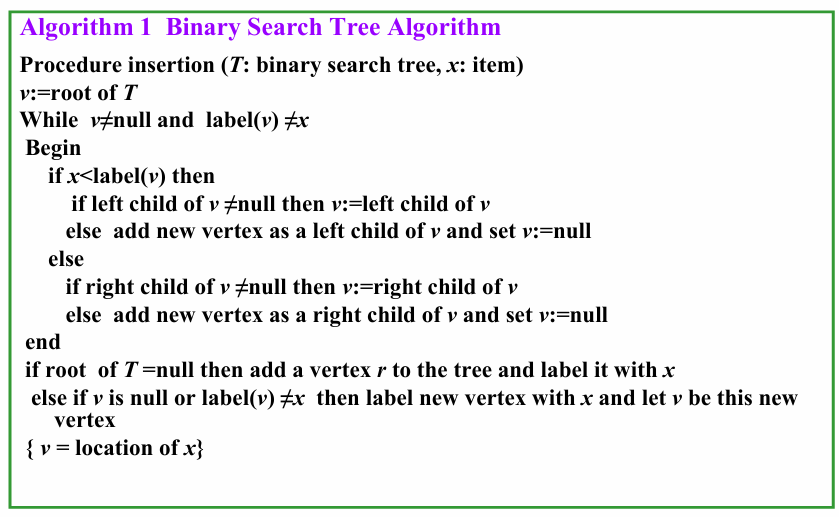
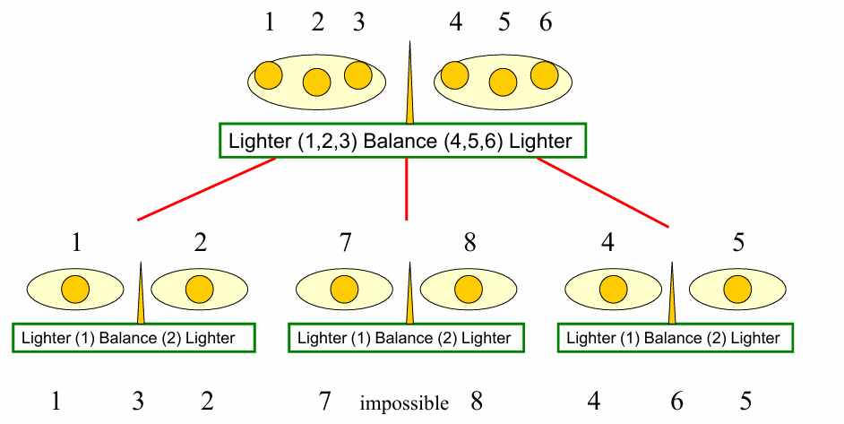
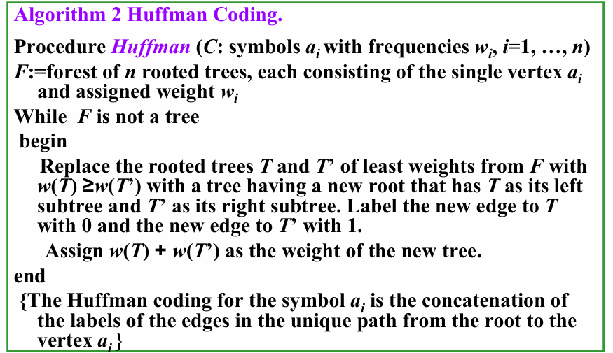

# Ch11 Trees

## 11.1 Introduction to Trees

### 1. Tree

**【Definition】**: A tree is a **<u>connected undirected</u>** graph with **<u>no simple circuits</u>**.

* **Note**: Any tree must be a simple graph. 

**【Definition】**:  A **forest** is a graph that has no simple circuit, but is not connected. Each of the connected components in a forest is a tree. 

**【Theorem 1】**: An undirected graph is a tree if and only if there is a **unique simple** path between any two of its vertices.

#### Root tree

**【Definition】**: A **rooted tree有根树** is a tree in which one vertex has been designated as the root and every edge is directed away from the  root.

**【Definition】**: A rooted tree is called a **m-ary tree m叉树** if every internal vertex has **no more than** $m$ children. 

**【Definition】**: A rooted tree is called a **full m-ary tree 满m叉树** if every internal vertex has **exactly** $m$ children. 

**【Definition】**: An **ordered rooted tree** is a rooted tree where the children of each internal vertex are ordered.

* In an ordered binary tree, the two possible children of a vertex are called the **left child** and the **right child**, if they exist. 
* The tree rooted at the left child is called the **left subtree**, and that rooted at the right child is called the **right subtree**.

#### Rooted Tree Terminology

* **Parent & Child**

  The parent of a non-root vertex $v$ is the unique vertex $u$ with a directed edge from $u$ to $v$.

* **Sibling**

  Vertices with the same parent are called **siblings**.

* **Ancestors & Descendants** 

  * The **ancestors of a non-root vertex** are all the vertices in the path from root to this vertex.   
  * The **descendants of vertex $v$** are all the vertices that have $v$ as an ancestor.  

* **Leaf**

  A vertex is called a **leaf** if it has no children.

* **Internal Vertex** 

  A vertex that have children is called an **internal vertex**.

* **Subtree** 

  The **subtree** at vertex $v$ is the subgraph of the tree consisting of vertex $v$ and its descendants and all edges incident to those descendants. 

### 2. Properties of Trees

**【Theorem 2】** A tree with $n$ vertices has $n-1$ edges.

**【Theorem 3】** A full $m-ary$ tree with $i$ internal vertices contains $n=mi+1$ vertices.

**【Theorem 4】** A full $m-ary$ tree with 

* $n$ vertices has $i=\frac{n-1}{m}$ internal vertices and $l=\frac{(m-1)n+1}{m}$  leaves 
* $i$ internal vertices has $n=mi+1$ vertices and $l=(m-1)i+1$ leaves  
* $l$ leaves has $n=\frac{ml-1}{m-1}$ vertices and $i=\frac{l-1}{m-1}$ internal vertices

The **level层级** of vertex $v$ in a rooted tree is the **length** of the unique path <u>from the root to $v$</u>.     

The **height高度** of a rooted tree is the <u>maximum of the levels</u> of its vertices. ($\text{the height of root}=0$)

* A rooted $m-ary$ tree of height $h$ is called **balanced平衡的** if all its leaves are at levels $h$ or $h-1$.

**【Theorem 5】**There are at most $m^h$ leaves in an $m-ary$ tree of height $h$.

**【Corallary】**

* If an $m-ary$ tree of height $h $ has $l$ leaves, then $h ≥ ⌈ log_m l ⌉$.
* If the $m-ary$ tree is **full and balanced**, then $h = ⌈ log_m l ⌉$.

## 11.2 Applications of Trees

### 1. Binary Search Trees

* A binary search tree can be used to **store item**s in its vertices. It enables efficient searches.
* **Binary search tree**  
  * An ordered rooted binary tree 
  * Each vertex contains a distinct **key value** 
  * The key values in the tree can be compared using “greater than” and “less than”, and
  * The key value of each vertex in the tree is **less than every key value in its right subtree**, and **greater than every key value in its left subtree**.



### 2. Decision Trees 

* Rooted trees can be used to model problems in which a series of decisions leads to a solution.  
* A rooted tree in which each internal vertex corresponds to a decision, with a subtree at these vertices for each possible outcome of the decision, is called a **decision tree决策树**.



### 3. Prefix Codes

* To ensure that no bit string corresponds to more than one sequence  of letters, the bit string for a letter must never occur as the first  part of the bit string for another letter. Codes with this property are called **prefix codes前缀码**.

#### Huffman Coding



* **Huffman Tree 哈夫曼树**

  > 流程：
  >
  > - 初始状态下，有一片森林，其中每棵树只有一个表示不同字符的节点
  >
  > - 每一步中，我们挑选权重 ( 频率 ) 最小的两棵树，组成新的树：
  >
  >   - 引入一个新的根
  >   - 将**权重较大**的树作为**左子树**
  >   - 将权重较小的树作为**右子树**
  >   - 新的树的权重为 2 棵树的权重和
  >
  >   然后将新的树放回原来的森林中
  >
  > - 直到只剩下一棵树时为止


## 11.3 Tree Traversal

* A traversal algorithm is a procedure for **systematically visiting every vertex** of an ordered rooted tree.   
* Tree traversals are defined recursively.  

### 1. Preorder Traversal

```pseudocode
procedure  preorder (T: ordered rooted tree)
r := root of T
list r
for each child c of r from left to 
right
 T(c) := subtree with c as root
 preorder(T(c))
```

### 2. Inorder Traversal

```pseudocode
procedure  inorder (T: ordered rooted tree)
r := root of T
if r is a leaf then list r
else
    l := first child of r from left to right
    T(l) := subtree with l as its root
    inorder(T(l))
    list(r)
    for each child c of r from left to right
       T(c) := subtree with c as root
       inorder(T(c))
```

### 3. Postorder Traversal

```pseudocode
procedure  postordered (T: ordered rooted tree)
r := root of T
for each child c of r from left to right
   T(c) := subtree with c as root
   postorder(T(c))
list r
```

### Expression Trees

A Binary Expression Tree is a special kind of binary tree in which: 

* Each **leaf node** contains a single operand, 
* Each **nonleaf node** contains a single operator, and 
* The left and right subtrees of an operator node represent **subexpressions** that must be evaluated **before** applying the operator at the root of the subtree.


* **Infix Form中缀式**: An **inorder traversal** of the tree representing an expression produces the original expression when parentheses are included except for unary operations, which now immediately follow their operands. 
  * infix form: $3*ln(x+1)+a/x \uparrow 2$
* **Prefix Form前缀式**: The expression obtained by an preorder traversal of the binary tree is said to be in prefix form ( **Polish notation波兰表示法** ).
  * prefix form: $+*3ln+x1/a\uparrow x2$
* **Postfix Form后缀式**: The expression obtained by an postorder traversal of the binary tree is said to be in postfix form ( **reverse Polish notation逆波兰表示法** ).
  * postfix form: $3x1+ln*ax2\uparrow /+$

## 11.4 Spanning Trees 

【Definition1】Let $G$ be a simple graph. A **spanning tree生成树** of $G$ is a subgraph of $G$ that is **a tree containing every vertex of $G$**.

【Theorem 1】A simple graph is connected if and only if it has a spanning tree.

### Depth-first search

* **Depth-first search深度优先算法** (also called **backtracking回溯**) -- this procedure forms a rooted tree, and the underlying undirected graph is a spanning tree. 

1.  先在图中任意选取一个顶点作为根节点
2.  从根节点出发，连续添加顶点和边，其中新增的边一定与最后添加的顶点相关联，且新添的顶点尚不在路径中，尽可能地往下这样做
3.  当访问完所有顶点时，我们可以得到一棵生成树
4.  否则 ( 遇到“死胡同”)，返回到路径中倒数第二个顶点，若有可能，从该顶点出发，按照上面的步骤重新寻找新的路径 ( 要找未被访问过的顶点 )。如果找完所有可能，再返回上一个顶点，再寻找新的路径，直至所有顶点均被访问过

```pseudocode
procedure DFS(G: connected graph with vertices v1, v2, …, vn)
T := tree consisting only of the vertex v1   
visit(v1)

procedure visit(v: vertex of G)
for each vertex w adjacent to v and not yet in T
  add vertex w and edge {v,w} to T
  visit(w)
```

### Breadth-first search

* **Breadth-first search宽度优先算法**

1.  先在图中任意选取一个顶点作为根节点
2.  将所有与根节点相邻的顶点添加至树内，对它们任意排序，这些顶点因而成为生成树中层级为 1 的节点，
3.  对于层级为 1 的所有节点，按顺序依次访问所有与这些顶点关联的边上的另一个顶点，且保证不会产生简单环，对得到的顶点进行任意排序
4.  这样，我们得到层级为 1 的节点的所有孩子，它们构成层级为 2 的节点
5.  如此往复，直至所有顶点被添加至树内

```pseudocode
procedure BFS(G: connected graph with vertices v1, v2, …, vn)
T := tree consisting only of the vertex v1   
L := empty list visit(v1)
put v1 in the list L of unprocessed vertices
while L is not empty
  remove the first vertex, v, from L
  for each neighbor w of v 
    if w is not in L and not in T then
       add w to the end of the list L
       add w and edge {v,w} to T
```

### Backtracking scheme


## 11.5 Minimum Spanning Trees

【Definition1】A minimum spanning tree in a connected weighted graph is a spanning tree that has the smallest possible sum of weights of its edges.

### Prim's algorithm

* 思想：在图中剩余的边里，将与树中节点有关联的权重最小的边加到树中

```pseudocode
Procedure Prim (G: weighted connected undirected graph with n vertices)
T:= a minimum-weight edge
for i:= 1 to n-2
begin
  e:= an edge of minimum weight incident to a vertex in   
      T and not forming a simple circuit in T if added to T.
  T:= T with e added
end {T is a minimum spanning tree of G}
```

### Kruskal's algorithm

* 挑选当前图中剩余的边里权重最小的边，且不会产生环

```pseudocode
procedure Kruskal (G: weighted connected undirected graph with n vertices)
T:= empty graph
for i:= 1 to n-1
begin
  e:= any edge in G with smallest weight that does not 
      form a simple circuit when added to T
  T:= T with e added
end {T is a minimum spanning tree of G}
```

