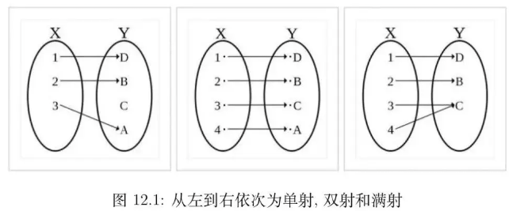

# Ch2.Basic Structures

## 2.1 Sets

【Definition】A **set** is an unordered collection of objects. The objects in a set are called the elements, or members, of the set. A set is said to contain its elements.

### 1. The descriptions of a set

- <u>Roster method 花名册方法</u> : listing all its members between braces, e.g. $S=\{1,3,5,7,9\}$
- <u>Brace notation with ellipses</u> : e.g. $S=\{1,2,…,99\}$
- <u>Use set builder notation 集合构造器 (specification by predicates)</u> : $S=\{{x∣P(x)}\}$, which means $S$ contains all the elements from $U$ (**全集 universal set**) which have the property $P$.
- **维恩图(Venn diagrams)**

### 2. Relations between Sets

#### Subset

$A\subseteq B$: $A$ is a 子集(subset) of the set $B$,  every element of $A$ is also an element of $B$.

$A\subseteq B\Leftrightarrow  \forall x(x\in A\rightarrow x\in B)$

#### Equal

$A=B$: $A$ is **等于(equal)** to $B$.

$A=B\Leftrightarrow A\subseteq B\land B\subseteq A\Leftrightarrow  \forall x[(x \in A\rightarrow  x \in B) \land  (x \in B\rightarrow  x \in A)]$

#### Proper Subset

$A\subset B$: $A$ is a **真子集(proper subset)** of the set $B$.

$A\subset B\Leftrightarrow A\subseteq B\land A\ne B\Leftrightarrow  \forall x(x\in A\rightarrow x\in B)\land \exists (x\in B\land x\in A)$

#### The Size of a Set 

【Definition】Let S be a set. If there are exactly **n** distinct elements in $S$ where $n$ is a nonnegative integer, we say that $S$ is a finite set and that **n** is the **cardinality（基数）**of $S$.

*  Notation:  $∣S∣$—— S的**基数** the **cardinality** of $S$

#### Power Sets

Given a set $S$, the **幂集(power set)** of $S$ is the set of **all subsets** of the set $S$. **$P(x) $** denotes the power set of $S$.

Example : If $S=\{a,b,c\}$, then $P(S)=\{\emptyset,\{a\},\{b\},\{c\},\{a,b\},\{a,c\},\{b,c\},\{a,b,c\}\}$

#### Cartesian Products

**[Definition]** The **有序 n 元组(ordered $n-tuple$)** ($a_{1},a_{2},\dots,a_{n}$) is the ordered collection that has $a_{1}$ as its first element,  as its second $a_{2}$ element, … , and $a_{n}$ as its $n_{th}$ element. In particular, $2-tuples$ are called **ordered pairs**.

 The Cartesian product of $A$ and $B$: $A \times B = \{(a, b)| a \in A, b \in B\}$

The Cartesian product of $A_1 , A_2 , … , A_n$ : $A_{1}×A_{2}×\dots A_{n}$={$(a_{1},a_{2},\dots,a_{n})∣a_{i}\in A_{i}$, for $i = 1,2,\dots ,n$}

#### Using Set Notation with Quantifiers 

Restrict the domain of a quantified statement explicitly by making use of a particular notation. 

* $\forall x\in S(P (x)):    \forall x(x\in S \rightarrow  p(x))$
* $\exists x\in S(P (x)):    \exists  x(x\in S \land  p(x))$

#### Truth Sets of Quantifiers

Given a predicate P and a domain $D$. 

The **真集(truth set)** of $P$ is the set of elements $x$ in $D$ for which $P(x)$ is true. Namely, the power set of $P$ is {$x\in D∣P(x)$}

## 2.2  Set Operations

#### Union

$A∪B=${$x∣x\in A \lor x\in B$}

#### Intersection

$A∩B=${$x∣x\in A\land x\in B$}

Note : Two sets are called disjoint if their intersection is the empty set,namely $A∩B = Ø$

#### Complement

$\overline A=\{{x∣x\in A, x\in U}\}$ is the **补集(complement)** of the set A.

Let $U$ be universal set. The complement of the set $A$  denoted by $\overline A$, is **the complement of $A$with respect to $U$**, namely, $U – A$. (The complement of $A$ is sometimes denoted by $A^{c}$ .)

#### Difference

$A−B=\{{x∣x\in A \land x \in B}\}$ 

the set containing those elements that are <u>in A but not in B</u>.

#### Symmetric difference

$A⊕B=(A∪B)−(A∩B)$

the set containing those elements that are in <u>A but not in B</u> or <u>in B but not in A</u>.

#### The Cardinality of a Union of Two Sets

The principle of Inclusion - exclusion **容斥原理**：$|A \cup B| = |A| + |B| - |A \cap B|$

#### 集合恒等式 Set Identities

| Identity                                                 | Name                |
| :------------------------------------------------------- | ------------------- |
| $A \cup \emptyset = A, A \cap U = A$                   | Identity laws       |
| $A\cup U = U, A \cap \emptyset = \emptyset$            | Domination laws     |
| $A \cup A = A, A \cap A = A$                           | Idempotent laws     |
| $\overline{\overline{A}} = A$                          | Complementation law |
| $A \cup B = B \cup A, A \cap B = B \cap A$             | Commutative laws    |
| $A \cup (B \cup C) = (A \cup B) \cup C$                | Associative laws    |
| $A \cap (B \cap C) = (A \cap B) \cap C$                 |                     |
| $A \cap (B \cup C) = (A \cap B) \cup (A \cap C)$        | Distributive laws   |
| $A \cup (B \cap C) = (A \cup B) \cap (A \cup C)$       |                     |
| $\overline{A \cup B} = \overline{A} \cap \overline{B}$ | De Morgan’s laws    |
| $\overline{A \cap B} = \overline{A} \cup \overline{B} $ |                     |

## 2.3 Functions

### Introduction

**[Definition]** : Let A and B be nonempty sets. A function $f$ from $A$ to $B$ is an assignment of each element of $A$ to exactly one element of $B$.

**Denode**: $f:A\rightarrow B$   or   $ \forall a(a\in A\rightarrow \exists !b(b\in B\land f(a)=b))$

* We write $f(a) = b$ if b is the unique element of B assigned by the  function f to the element a of A.  Functions are sometimes called **mappings（映射）** or **transformations（变换）**.

**Given a function $f: A \rightarrow  B$:** 

$f$ maps $A$ to $B$ or $f$ is a mapping from $A$ to $B$.

* A is called the domain of $f$, B is called the codomain of $f$.
* If $f(a) = b$, then b is called the **image(像)** of a under $f$, a is called the **preimage(原像)** of b.T
* The range of $f$ is the set of <u>all images of points in $A$ under $f$</u>. We denote it by $f(A)$.
*  Two functions are **equal** when they have the same domain, the same codomain and map each element of the domain to the same element of the codomain.

【Definition】Let  $f_{1}$ and $f_{2}$ be functions from $A$ to $R$. Then $(f_{1} + f_{2})(x) = f_{1}(x)+ f_{2}(x),\quad(f_{1}f_{2})(x) = f_{1}(x) f_{2}(x)$ 

【Definition】 Let $f$ be a function from A to B and let $S$ be a subset of A. The  image of $S$  is the subset of B that consists of the images of the elements of S. We denote the image of $S$ by $f(S)$, so that $f (S) = \{{ f(s) | s\in S }\}$

### One-to-one Functions

A function f is **单射函数(one-to-one function / injection)** , or **单射的(injective)** if

$$\forall a \forall b(f(a)=f(b)\rightarrow a=b)$$

### Onto Functions

A function f from A to B is called **满射函数(onto function / surjection)**, or **满射的(surjective)** if

$$\forall b\in B\exists a\in A(f(a)=b)$$

### One-to-one Correspondence Functions

The function f is a **one-to-one correspondence**, or a **bijection**(双射), if it is both **one-to-one** and **onto**.

> 

### Inverse Functions

Let $f$ be a bijection from A to B. Then the inverse function of $f$, denoted $f ^{-1}$,  is the function from B to A defined as $f  ^{-1} ( b ) = a$ iff $f ( a ) = b$

### Floor and Ceiling Function

The ceiling function $f (x)$ is the smallest integer greater than or equal to x

The floor function $f (x)$ is the biggest integer smaller than or equal to x

## 2.4 Sequences and Summations

### 1. Introduction

[Definiton] A **数列(sequence)** is a function from a subset of the set of integers (usually either the set {0,1,2,…} or the set {1,2,3,…} ) to a set S. We use the notation $a_{n}$ to denote the image of the integer n. We call $a_{n}$ a **term(项)** of the sequence.

### 2. Some Familiar Sequences

A **等比数列(geometric progression)** is a sequence of the form$a, ar, ar^{2}, …, ar^{n}$

where the initial term a and the **公比(common ratio)** r are real numbers.

An **等差数列(arithmetic progression)** is a sequence of the form$a, a+d, a+2d …, a+nd$

where the initial term a and the **公差(common difference)** d are real numbers.

### 3. Strings

[Definition] A string is a finite sequence of characters from a finite set (an  alphabet).

### 4. Recurrence Relations

[Definition] A **recurrence relation(迭代关系)** for the sequence $\{a_{n}\}$ is an equation that expresses an in terms of one or more of the previous terms of the  sequence, namely, $a_{0}, a_{1}, …, a_{n-1}$, for all integers n with $n ≥ n_{0}$, where $n_{0}$  is a nonnegative integer.  

* A sequence is called a solution of a recurrence relation if its terms  satisfy the recurrence relation. 
* The initial conditions for a sequence specify the terms that precede the  first term where the recurrence relation takes effect. 

## 2.5 Cardinality of Sets

* 【Definition】: The sets $A$ and $B$ have the same cardinality (denoted by $| A | = | B |$) iff there exists a <u>one-to-one correspondence (bijection双射)</u> from $A$ to $B$

    * This provides a **relative measure** of the sizes of two sets, rather than a measure of the size of one particular set.

* 【Definition】: If there is a <u>one-to-one function单射</u> form $A$ to $B$, the cardinality of $A$ is less than or the same as cardinality of B ($|A|≤|B|$). When $|A|≤|B|$ and $A$ and $B$ have different cardinality, we say that the cardinality of $A$ is less than the cardinality of B and we write $|A|<|B|$

### 1. Countable Sets

* 【Definition】: A set that is either finite or has the same cardinality as <u>the set of positive integers</u> is called **countable可数**

* When an infinite set is countable (countably infinite) , its cardinality is **$ℵ_{0}$** (where $ℵ$ is aleph, the 1st letter of the Hebrew alphabet). We write *$|S| = ℵ_{0}$* and say that S has cardinality ***"aleph null 阿列夫零"***

* An infinite set is **countable** if and only if it is possible to **list the elements of the set in a sequence** (indexed by the positive integers, be expressed in terms of a sequence $a_{1},a_{2},\dots, a_{n} ,\dots $where $a_{1}=f(1),a_{2}=f(2),\dots, a_{n} =f(n),\dots$

---

* 正有理数集$Q_{+}$是可数的
* 0 到 1 之间的实数集不可数
* $[1,2]$和$(1,2)$等势
* $N$的有限子集都可数

### 2. Uncountable Sets

> * If set $A$ and $B$ is countable, then $A\cup B$ is countable.
> * **有限个**可数集合的交集是可数的

【Theorem】The set of real numbers between $0$ and $1$ is **uncountable**.

* use an important proof method known as the **Cantor diagonalization argument**（Cantor 对角化论证）

【Theorem】The set of real numbers is **uncountable**.

* Any set with an uncountable subset is uncountable.
*  $|R|= ℵ$
* It is said to have the cardinality of the continuum, c.

### 3. Results about cardinality

1) No infinite set has a smaller cardinality than a countable set.
   
2) If A and B are countable, $A\cup B$ is countable.

3) The union of finite number of countable sets is countable.

4) The union of a countable number of countable sets is countable

### 4. Uncomputable Function

【Definition】A function is **computable** if there is a computer program in some programming language that finds the values of this function. If a function is not computable, we say it is **uncomputable**.

### 5. The Continum Hypothesis

* 康托定理（Cantor's Theorem）The cardinality of the power set of an arbitrary set has a greater cardinality than the original arbitrary set. ( $∣P(ℵ_{k})∣=∣ℵ_{k+1}∣$ )
* The power set of $Z^{+}$ and the set of real numbers $R$ have the  same cardinality. $|P(Z^{+})|=|R|= c$
* The continuum hypothesis asserts that there is **no cardinal number** a such that  $ℵ_{0} < a <  c$.