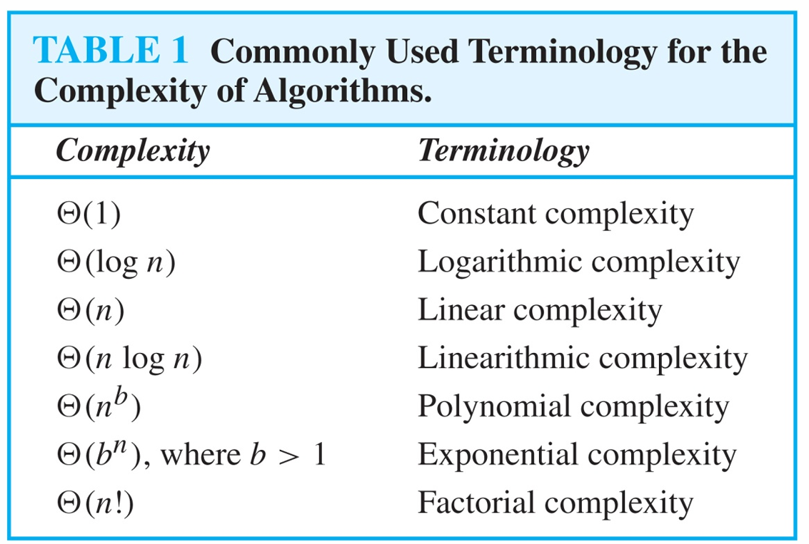

# Ch3.Algorithm

## 3.1 算法 Algorithms

【Definition】: An **algorithm** is a finite set of precise instructions for  performing a computation or for solving a problem.

### 算法的性质 Properties of Algorithms

- **输入(input)**：An algorithm has input values from a specified set.
- **输出(output)**：From each set of input values, an algorithm produces output values from a specified set.
- **确定性(definiteness)**：算法的每一步都应该被精确定义。The steps of an algorithm must be defined precisely.
- **正确性(correctness)**：算法应该给出正确的输出结果。An algorithm should produce the correct output values for each set of input values.
- **有限性(finiteness)**：算法应当在有限步内结束。An algorithm should produce the desired output after a finite number of steps for any input in the set.
- **有效性(effectiveness)**：算法的每一步都可以被有效执行。Each step of an algorithm must be executed exactly and in a finite amount of time.
- **通用性(generality)**：我们的算法应该对于任意符合条件的输入都应用，而不是只适用某些特定的输入。The procedure should be applicable for all problems of the desired form, not just for a particular set of input values.

## 3.2 函数的增长 The Growth of Functions

#### 记号 Notations

**大 O 记号(==Big-O notation==)**：

- Let $f$ and $g$ be functions from $Z$ (or $R$) to $R$. We say that “$f(x)$ is $O(g(x))$” if there are constants $C$ and $k$ such that $∣f(x)∣≤C∣g(x)∣$ whenever $x>k$.

**大Ω记号(==Big-Omega notation==)**：

- Let $f$ and $g$ be functions from $Z$ (or $R$) to $R$. We say that “$f(x)$ is $\Omega(g(x))$” if there are constants $C$ and $k$ such that $∣f(x)∣\geq C∣g(x)∣$ whenever $x>k$.

**大Θ记号(==Big-Theta notation==)**：

- Let $f$ and $g$ be functions from $Z$ (or $R$) to $R$. We say that “$f(x)$ is $\Theta(g(x))$” if “$f(x)$ is $\Omega(g(x))$” and “$f(x)$ is $\Omega(g(x))$” , i.e., there are constants $C_1,C_2$ and $k$ such that $0≤C_1g(x)≤f(x)≤C_2g(x)$ whenever $x>k$.

### The Growth of Combinations of Functions

* If $f_1(x)$ is $O(g_1(x))$ and  $f_2(x)$ is $O(g_2(x))$, then $(f_1 + f_2)(x)$ is $O(max(g_1(x),g_2(x)))$. 
* If  $f_1 (x)$ and $f_2 (x)$ are both $O(g(x))$, then $( f_1 + f_2 )(x)$ is $O(g(x))$.
* If  $f_1(x)$ is $O(g_1(x))$ and $f_2(x)$ is $O(g_2(x))$, then $(f_1f_2)(x)$ is $O(g_1(x)g_2(x))$.

## 3.3 算法的复杂度 Complexity of Algorithms

