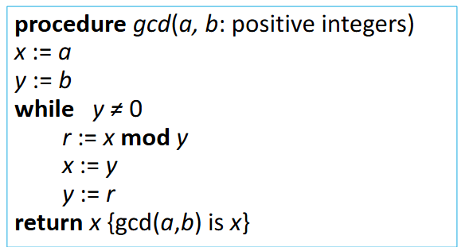

# Ch4.The Number Theory and Cryptography

## 4.1 Divisibility and Modular Arithmetic
### 1. Division

**[Definition]**: If $a$ and $b$ are integers with $a \neq 0$, then $a$ divides $b$ if there exists an integer $c$ such that $b=ac$

* When $a$ divides $b$ we say that $a$ is a factor or divisor of $b$ and that $b$ is a multiple of $a$.
*  The notation $a \mid b$ denotes that $a$ divides $b$.
*  If $a \mid b$ , then **$b/a$**  is an integer.
*  If $a$ does not divide $b$, we write $a ∤ b$

#### Properties of Divisibility

**Theorem**: Let a, b, and c be integers, where $a ≠ 𝟎$.

* If $𝑎 \mid 𝑏$ and $𝑎 \mid 𝑐$ , then $𝑎 \mid (𝑏 + 𝑐)$
*  If $𝑎 \mid 𝑏$ , then $𝑎 \mid 𝑏𝑐$ for all integers $c$
*  If $𝑎 \mid 𝑏$ and $𝑏 \mid 𝑐$, then $𝑎 \mid 𝑐$

**Corollary**: If a, b, and c be integers, where $a \neq 0$, such that $𝑎 \mid 𝑏$ and $𝑎 \mid c$, then $𝑎 \mid m𝑏+nc$ whenever m and n are integers.

### 2. Division Algorithm

If $a$ is an integer and $d$ a positive integer, then there are unique integers $q$ and $r$, with $0 \leq r < d$, such that $a = dq + r$

* d is called the **divisor 除数** 
* a is called the **dividend 被除数** 
* q is called the **quotient 商**  **<u>q = a div d</u>**
* r is called the **remainder 余数(非负)** **<u>r = a mod d</u>**

### 3. Congruence Relation

**[Definition]** : 若 $a$ 和 $b$ 为整数，$m$ 为正整数，当 m 能整除 $a − b$ 时，称 $a$ 与 $b$ 对模 $m$ 同余。

* The notation $a \equiv b \pmod{m}$ says that a is congruent to b modulo m.
* If a is not congruent to b modulo m, we write $a ≢ b \pmod{m}$

**Theorem**: Let $m$ be a positive integer. The integers $a$ and $b$ are congruent modulo $m$ if and only if there is an integer $k$ such that $a = b+km$

#### 3.1 Congruences of Sums and Products

**Theorem**: Let m be a positive integer. If $a \equiv b\pmod{m}$ and $c \equiv d \pmod{m}$, then $a+c \equiv b+d\pmod{m}$ and $ac \equiv bd\pmod{m}$

#### 3.2 Algebraic Manipulation of Congruences

- **在同余式两边同时乘以一个整数后仍然同余**
    - If  $a \equiv b \pmod{m}$ holds then  ==$c \cdot a \equiv c \cdot b \pmod{m}$== , where $c$ is any integer

- **在同余式两边同时加上一个整数后仍然同余**
    - If  $a \equiv b \pmod{m}$ holds then  ==$a+c \equiv b+c \pmod{m}$== , where $c$ is any integer

- **在同余式两边同时除以一个整数后同余无法确定**

**[Corollary]** :

* ==$(a + b) \mod {m} = [(a \mod {m}) + (b \mod {m})] \mod {m}$==
* ==$ab \mod {m} = [(a \mod {m})(b \mod {m})] \mod {m}$.==

### 4. Arithmetic Modulo m

**[Definitions]** : Let $Z_m$ be the set of nonnegative integers less than $m$: { $0,1, \dots , m − 1$ }

* The operation **+m** is defined as $a+ _mb = (a+b)\mod m$. This is **addition modulo m**.
* The operation **∙m** is defined as $a ⋅ _mb = (a\cdot b)\mod m$. This is **multiplication modulo m**.
* Using these operations is said to be doing <u>***arithmetic modulo m算术模 m***</u>

The operations **+m** and **·m** satisfy many of the same properties as ordinary addition and multiplication.

**Closure 封闭性**

- If $a$ and $b$ belong to $Z_m$ , then $a +_m b \in Z_m$ and $a ·_m b \in Z_m$ .

**Associativity 结合律**

- If $a$, $b$, and $c$ belong to $Z_m$ , then $(a +_mb) + _m c = a +_m (b +_m c)$ and $(a ·_m b) ·_m c = a ·_m (b ·_m c)$.

**Commutativity 交换律**

- If a and b belong to $Z_m$ , then $a +_m b = b +_m a$ and $a ·_m b = b ·_m a$.

**Identity elements 单位元**

- The elements $0$ and $1$ are identity elements for addition and multiplication modulo $m$, respectively. 

    If a belongs to $Z_m$ , then $a +_m 0 = a$ and $a ·_m 1 = a$.

**Additive inverses 加法逆元**

- If $a ≠ 0$ belongs to $Z_m$ , then $m − a$ is the additive inverse of **a modulo m** and 0 is its own additive inverse. 

- $𝑎 + _𝑚 (𝑚 − 𝑎 ) = 0$ and $0 +_𝑚 0 = 0$

Distributivity 分配律

- If a, b, and c belong to $𝑍_𝑚$ , then $𝑎 ·_𝑚 (𝑏 +_𝑚 𝑐) = (𝑎· _𝑚 𝑏) + _𝑚 (𝑎 +_𝑚 𝑐)$ and $(𝑎 +_𝑚 𝑏) ·_𝑚 𝑐 = (𝑎 ·_𝑚 𝑐) +_𝑚 (𝑏·_𝑚 𝑐)$

## 4.3 Primes and Greatest Common Divisors

### 1. Primes

**[Definition]** : A positive integer p greater than $1$ is called prime if the only positive factors of $p$ are $1$ and $p$. A positive integer that is greater than $1$ and is not **prime素数** is called **composite合数**

**Theorem**: There are infinitely many primes. (Euclid) 素数的无限性

**[Definition]** : Prime numbers of the form $2^p − 1$, where $p$ is prime, are called **Mersenne primes梅森数**

### 2. The Fundamental Theorem of Arithmetic

**Theorem 1**: Every positive integer greater than 1 can be written uniquely as a prime or as the product of two or more primes where the prime factors are written in order of nondecreasing size. 

**Theorem 2**: If n is a composite integer, then n has a prime divisor less than or equal to $\sqrt n$

若 n 为合数，则 n 必有一个质因数小于或等于$\sqrt n$

### 3. The Sieve of Eratosthenes

***The Sieve of Eratosthenes*** can be used to find all primes not  exceeding a specified positive integer n.  

> 方法：找出所有不超过 n 的质数，然后从小到大依次将它们的倍数 ( 不超过 n ) 删去，剩下的数就是不超过 n 的质数。

* For example, $n=100$ Begin with the list of integers between 1 and 100. 

     ① Delete all  the integers, other than 2, divisible by 2. 
     
     ② Delete all the integers, other than 3, divisible by 3. 

     ③ Next, delete all the integers, other than 5, divisible by 5. 

     ④ Next, delete all the integers, other than 7, divisible by 7. 

     ⑤ Since all the remaining integers  are not divisible by any of the previous integers, other than 1, the primes are: $\{2,3,5,7,11,15,17,19,23,29,31,37,41,43,47,53,59,61,67,71,73,79,83,89,97\}$

### 4. 素数的分布

**Prime Number Theorem**: 

- The ratio of the number of primes not exceeding $x$ and $x/lnx$ approaches $1$ as $x$ grows without bound.

$$
\lim_{x\rightarrow \infty}\frac{\pi(x)}{x/lnx}=1
$$

### 5. Greatest Common Divisor 

**[Definition]** : Let $a$ and $b$ be integers, not both zero. The largest integer $d$ such that $d \mid a$ and also $d \mid b$ is called the greatest common divisor of $a$ and $b$. The greatest common divisor of a and b is denoted by $\gcd{(a,b)}$

**[Definition]** : The integers $a$ and $b$ are **relatively prime** if their greatest common divisor is $1$

### 6. Least Common Multiple 

**[Definition]** : The least common multiple of the positive integers $a$ and $b$ is the smallest positive integer that is divisible by both a and b. It is denoted by $\text{lcm}(a,b)$

**[Theorem]** : Let a and b be positive integers. Then $ab = \gcd{(a, b)} \cdot \text{lcm}(a, b)$

### 7. Euclidean Algorithm

The Euclidian algorithm is an efficient method for computing the greatest common divisor of two integers.

* let $a=bq+r$, then $\gcd(a,b) = \gcd(b,r)$

### 8. gcds as Linear Combinations 

**裴蜀定理 Bézout’s Theorem** : If a and b are positive integers, then there exist integers s and t such that ==$\gcd{(a,b)} = sa+tb$==

**[Definition]** : If a and b are positive integers, then integers $s$ and $t$ such that $\gcd{(a,b)} = sa+tb$ are called **Bézout coefficients 裴蜀系数** of a and b. The equation  $gcd(a,b) =sa+tb$ is called **Bézout’s identity 裴蜀恒等式**

* Lemma : If a, b, and c are positive integers such that $\gcd{(a,b)}=1$ and $a \mid bc$, then $a \mid c$
* Lemma : If p is prime and $p \mid a_1 a_2 \dots a_n$, then $p \mid a_i$ for some $i$

### 9. Dividing Congruences by an Integer 

**[Theorem]** : Let m be a positive integer and let a, b, and c be integers.

If $ac \equiv bc \pmod m$ and $\gcd(c, m) = 𝟏$, then $a \equiv b \pmod m$

## 4.4 Solving Congruences

### 1. Linear Congruences

**[Definition]** : A congruence of the form $ax \equiv b \pmod m$, where m is $a$ positive integer, $a$ and $b$ are integers, and $x$ is a variable, is called a linear congruence.

* *The solutions to a linear congruence* $ax \equiv b \pmod m$ are all integers x that satisfy the congruence

### 2. Inverse of a modulo m

**[Definition]**: An integer $\overline{a}$ such that $\overline a a \equiv 1 \pmod m$ is said to be **an inverse of a modulo m**.

**Theorem** : 若 $a,m$ 互质并且 $m\geq1$，则 $a模m$ 的逆存在，且对模$m$的逆是唯一的。

* The Euclidean algorithm and Bézout coefficients gives us a **systematic approaches** to finding inverses

  if $sa+tm=1$, then ==$s a \equiv 1 \pmod m$==, ==$s=\overline{a}$==

### 3. The Chinese Remainder Theorem

$$
\begin{align}
x &\equiv a_1 \pmod {m_1} \\
x &\equiv a_2 \pmod {m_2} \\
&\dots \\
x &\equiv a_n \pmod {m_n}
\end{align}
$$

$$
\gcd(m_i,m_j)=1(i \neq j) \text{ and } m_i > 1
$$

To construct a solution

* First let $M_k = {m}/{m_k}$ for $k = 1, 2, ..., n$, where $m = m_1 m_2 \dots m_n$ .
  
    Since $\gcd{m_k, M_k} = 1$, there is an integer $y_k$, an inverse of $M_k$ modulo $m_k$, such that $M_k y_k \equiv 1 \ (\text{mod} \ m_k)$

* Form the sum

  ==$x = a_1 M_1 y_1 + a_2 M_2 y_2 + \cdots + a_n M_n y_n$==

* Note that because $M_j \equiv 0 \ (\text{mod} \ m_k)$ whenever $j \neq k$, all terms except the $k$th term in this sum are congruent to $0$ modulo $m_k$.

* Because $M_k y_k \equiv 1  \pmod {m_k}$, we see that $x \equiv a_k M_k y_k \equiv a_k \pmod{m_k}$, for $k = 1, 2, ..., n$.
    Hence, $x$ is a simultaneous solution to the $n$ congruences.

#### 反向替换 Back Substitution

- The first congruence can be rewritten as $x = 5t +1$, where $t$ is an integer
- Substituting into the second congruence yields  $5t +1 \equiv 2 (mod 6).$ 
- Solving this tells us that $t \equiv 5 (mod 6)$
- $t = 6u + 5$ where $u$ is an integer.  
- Substituting this back into $x = 5t +1$,  gives $ x = 5(6u + 5) +1 = 30u + 26$
- Inserting this into the third equation gives $30u + 26 \equiv 3 (mod 7)$
- Solving this congruence tells us that $u \equiv 6 (mod 7)$
- $u = 7v + 6$, where $v$ is an integer
- Substituting this expression for $u$ into $x  =  30u + 26$, tells us that $x  =  30(7v + 6) + 26 = 210v + 206$
- Translating this back into a congruence we find the solution $x \equiv 206 (mod 210)$

### 4. Computer Arithmetic with Large Integers

Suppose that $m_1, m_2, \dots, m_n$ are pairwise relatively prime moduli and let $m$ be their product.  By the Chinese remainder theorem, we can show that an integer $a$ with $0 ≤ a < m$ can be  uniquely represented by the n-tuple consisting of its remainders upon division by $m_i , i = 1,  2, … , n$ That is, we can uniquely represent $a$ by ==$(a \mod {m_1}, a \mod {m_2}, \dots , a \mod {m_n})$==

### 5. Fermat's Little Theorem

> 如果 $p$ 是质数，$a$ 为整数，且 $p∤a$，那么 $a^p \equiv a \pmod p$

**[Theorem]** : If $p$ is prime and $a$ is an integer not divisible by $p$, then $a^{p-1} \equiv 1 \pmod p$. Furthermore, for every integer $a$ we have ==$a^p \equiv a \pmod p$==

* **Note**：To find an mod $p$, we only need to compute $a^r$ mod $p$, where $n = q(p − 1) + r, 0 \leq r \leq p − 1$

### 6. Pseudoprimes

* By Fermat's little theorem $n > 2$ is prime, where $2^{n-1} \equiv 1 \pmod n$  
* But if this congruence holds, $n$ may not be prime.

Given a positive integer $n$, such that  $2^{n-1} \equiv 1 \pmod n$: 

* If $n$ does not satisfy the congruence, it is **composite合数**.  
* If $n$ does satisfy the congruence, it is either **prime** or **pseudoprime**

### 7. Carmichael  Numbers

**[Definition]** : A composite integer $n$ that satisfies the congruence $bn-1 \equiv 1 \pmod n$ for all positive integers $b$ with $\gcd(b,n) = 1$ is called a ==Carmichael number==