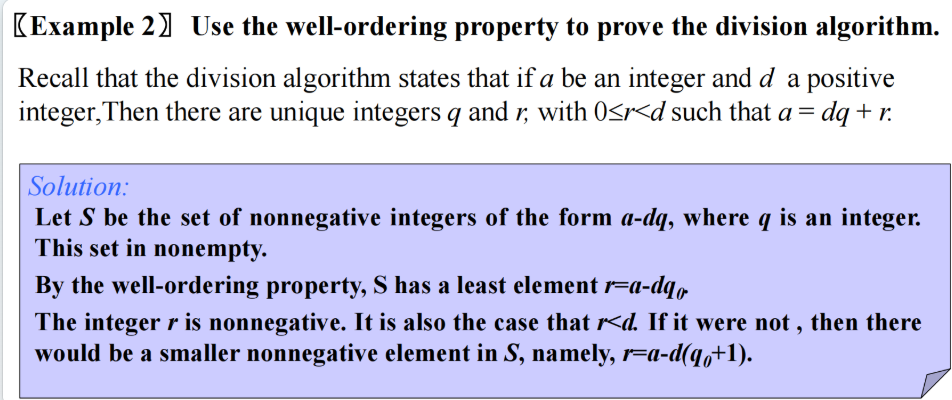
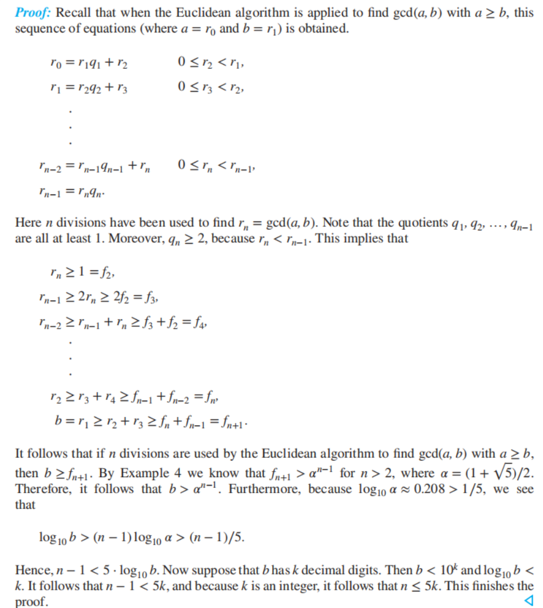
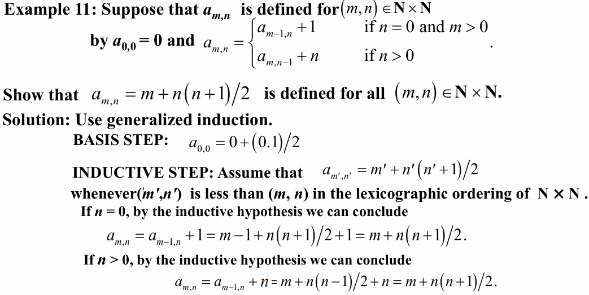

# Ch5.Induction and Recursion

## 5.1 Mathematical Induction 

### 1. Principle of Mathematical Induction

* **The (first) principle of Mathematical Induction** 

  $(P(1) \land  \forall  k(P(k) \rightarrow  P(k+1))) \rightarrow \forall  n P(n)$ where the domain is the set of positive integers

### 2. The procedure

1. Inductive base: Establish $P(k)$

2. Inductive step: Prove that $P(n) \rightarrow  P(n+1)$ for $n\geq  k$

Conclusion: The inductive base and the inductive step together imply $P(n) \forall  n \geq  k$

## 5.2 Strong Induction and Well-ordering

### 1. Strong Induction

* The Second Principle of Mathematical Induction*数学归纳法第二原理*  (==Strong Induction==,  complete induction) 

$$
(P(n_0 )\land \forall k ( k\geq n_0 \land P(n_0 )\land P(n_0 +1)\land \dots \land P(k) \rightarrow   P(k+1)))\rightarrow  \forall n P(n)
$$

**The procedure** : 

1. *BASIS STEP* : Establish $P(n_0 )$
2. *INDUCTIVE STEP* : Prove $P(n_0 )\land P(n_0 +1)\land  \dots \land P(k) \rightarrow  P(k+1)$ 
3. *CONCLUSION*: The inductive base and the inductive step allow one to conclude that $P(n)\forall n\geq n_0$

### 2. Using Strong Induction in Computational Geometry

**Some terms** :

- **多边形 (polygon)**：由一系列线段 $s_1,s_2,\dots ,s_n$( 它们被称为**边 (sides)**) 构成的封闭几何图形
- **顶点 (vertex)**：多边形中每对连续的边 $s_i,s_{i+1}(i=1,2,\dots ,n−1)$上的公共端点
- 每个简单多边形将平面划分成 2 个区域：
    - **内部 (interior)**：曲线内的所有点
    - **外部 (exterior)**：曲线外的所有点
- **凸 (convex)**多边形：任意两个顶点间的线段位于多边形的内部或边界上。否则被称为**凹 (nonconvex)**多边形
- 对角线 (diagonal)：在简单多边形中，连接两个非连续顶点的线段
    - **内部对角线 (internal diagonal)**：如果除了端点外完全在内部的对角线

### 3. Well-ordering property 

* 假设 $r\geq d$，因为 $a=dq_0+r$，所以 $a−d(q_0+1)=r−d\geq 0$，因此存在 $q$ 和 $r$，使得 $0\leq \r<d$ 成立（且 $q$ 和 $r$ 是唯一的）

## 5.3 Recursive Definition and Structural Induction

### 1. Recursively defined functions

*Recursively defined functions*, with <u>the set of nonnegative integers as its domain</u> :  

* **Basis Step**: Specify the value of the function at zero.
* **Recursive Step**: Give the rules for finding its value at an integer from its value at smaller integers

### 2. The Complexity of Euclidean algorithm

**LAME'S Theorem** 

- Let $a , b$ be positive integers with $a\geq b$. Then the number of divisions used by the Euclidean algorithm to find $\gcd (a, b)$ is less than or equal to <u>five times the number of decimal digits in b</u>.

因为 b 的十进制位数为 $⌊\log⁡_{10}{b}⌋+1\leq \log⁡_{10}b+1$，由定理 1 知除法次数小于等于 $5(\log⁡_{10}b+1)$。又因为 $5(\log_{⁡10}b+1)$ 是 $O(\log ⁡b)$，因此可以得到上述结论。

### 3. Recursively Defined Sets and Structures

**Sets can be defined recursively.** 

* ***BASIS STEP***: Specify an initial collection of elements. 
* ***RECURSIVE STEP***: Give the rules for constructing elements of the set from other  elements already in the set.

**Strings can be defined recursively.** 

- 来自字母表 $\sum$ 的字符串，是一个由来自 $\sum$ 的符号构成的有限序列。

- 来自字母表 $\sum$ 的字符串集合 $\sum^{*}$，按照下面步骤递归定义：

    - ***BASIS STEP***：$\lambda\in \sum^{*}$，$\lambda$ 是不包含符号的空字符串

    - ***RECURSIVE STEP***：如果$w\in \sum^{*}$ 且 $x\in \sum$，那么$wx\in \sum^{*}$

    > 在递归步骤中，通过在原有字符串的末尾添加一个字符来形成新的字符串。

**String Concatenation**

**[Definition]**: Two strings can be combined via the operation of concatenation. Let $\sum$ be a set of symbols and $\sum^{*}$ be the set of strings formed from the symbols in $\sum$. We can define the  concatenation of two strings, denoted by **∙**, recursively as follows. 

* ***BASIS STEP***: If $w \in  \sum^*$, then $w \cdot \lambda= w$
* **RECURSIVE STEP**: If  $w_1 \in  \sum^*$ and $w_2 \in  \sum$ and $x \in  \sum$, then $w_1 ∙ (w_2 x)= (w_1 ∙w_2)x$.

Another important use of recursive definitions is to define well-formed formulae of various types.

**Well-formed formulae for compound propositions**

**[Definition]:**  The set of well-formed formulae in propositional logic involving **T**, **F**, propositional variables and operators from the set {$¬, \land , \lor, \rightarrow , ↔$}

**Solution:**  

* **Basis Step:**  **T**, **F**, and **p** where p is a propositional variable, are well-formed formulae.
* **Recursive Step:**  $(¬p)，(p \lor q)，(p \land  q)，(p \rightarrow  q)，(p ↔ q)$, are well-formed formulae if $p$ and $q$ are well-formed formulae

### 4. Structural Induction

**A proof by structural induction 结构归纳法:**  

* **Basis Step:** Show that the result holds for all elements specified in the basis step of the recursive definition to be in the set.  

- <u>证明结果对于递归定义中基础步骤所指定的所有元素都成立，这些元素属于该集合。</u>

* **Recursive Step:** Show that if the statement is true for each of the elements used to construct new elements in the recursive step of the definition, the result holds for these new elements.

- <u>证明如果该命题对于递归定义中用于构造新元素的每个元素都成立，那么结果对于这些新元素也成立。</u>

**The validity of structural induction**

令 $P(n)$ 表示：对于所有由 $n$ 次或更少次来自递归定义中递归步骤的规则应用而产生的元素，结果为真

- ***BASIS STEP***：证明 $P(0)$ 为真
- ***RECURSIVE STEP***：假设 $P(k)$ 为真，那么 $P(k+1)$ 为真

### 5. Generalized Induction

* **Generalized induction 广义归纳法** is used to prove results about sets other than the integers that  have the **well-ordering property**.

* Consider an ordering on $N ⨉ N$, ordered pairs of nonnegative integers.  Specify that $(x_1 ,y_1)$ is less than or equal to $(x_2 ,y_2)$ if either $x_1 < x_2$, or $x_1 = x_2$  and $y_1<y_2$ .  
    * This is called the ***lexicographic ordering*** ***词典序***

## 5.4 Recursive Algorithms

* An algorithm is called **recursive** if it solves a problem by <u>reducing it to an instance of the same problem with smaller input</u>.

### Recursion and Iteration 

* ***Recursion 递归*** : Successively reducing the computation to the evaluation of the function an  smaller integers 
* ***Iteration 迭代*** : Start with the value of the function at one or more integers, the base cases, and successively apply the recursive definition to find the value of the  function at successive large integers

- 对于每个递归算法，总有等价的迭代算法
- **递归算法**相比迭代算法，通常*更小、更优雅、更易于理解*
- 然而，**迭代算法**在空间和时间上的效率往往高于递归算法
