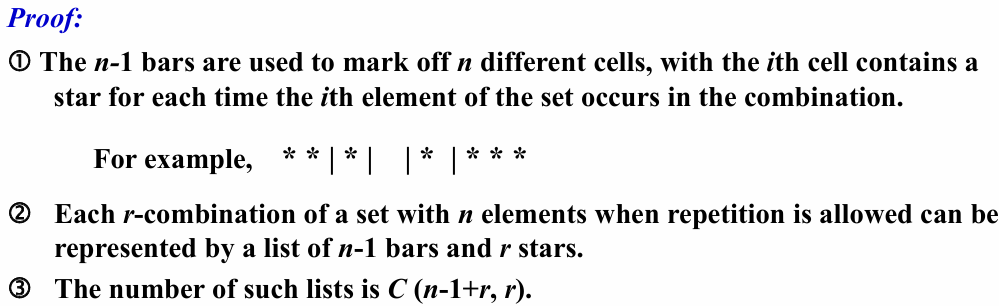
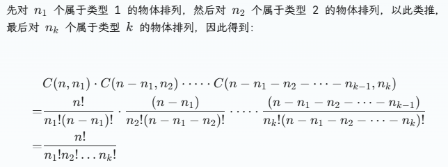

# Ch6.Counting

## 6.1 The Basics of Counting

**The Product Rule 乘积法则** 

- Suppose that a procedure can be broken down into two tasks. If there are $n_1$ ways to do the first task and $n_2$ ways to do the second after the first task has been done, then there are $n_1 n_2$ ways to complete the procedure. 

***Product Rule in Terms of Sets*** 

- If $A_1, A_2, … , A_m$ ainite sets, then the number of elements in the Cartesian product of these sets is the product of the number of elements of each set
- $|A_1 \times A_2 \times \dots \times A_m |= |A_1| \times |A_2| \times \dots\times|A_m|$

**The Sum Rule 加法法则** : 

- $|A_1 \cup  A_2 \cup  \dots \cup  A_m |= |A_1| + |A_2| + \dots + |A_m| , when \space A_i \cap  A_j  = \emptyset \space for \space all \space i,\space j$

**The Subtraction Rule 减法法则** 

- 容斥原理(the inclusion-exclusion principle)：If S and T are finite sets, then $∣S\cup T∣=∣S∣+∣T∣−∣S\cap T∣$

**The Division Rule 除法法则** 

- There are $n/d$ ways to do a task if it can be done using a procedure that can be carried out in $n$ ways, and for every way $w$, exactly $d$ of the $n$ ways correspond to way $w$. 

**Tree Diagrams** 

- We can solve many counting problems through the use of tree diagrams, where a branch represents a possible choice and the leaves represent possible outcomes. 

## 6.2 The Pigeonhole Principle

[Theorem1] ***The Pigeonhole Principle*** 

- If $k$ is a positive integer and $k+1$ or more objects are placed into $k$ boxes, then there is at least one box containing two or more of the objects. 

> 鸽巢原理又被称为狄利克雷抽屉原理 (*Dirchlet drawer principle*)

[Theorem2] ***The Generalized Pigeonhole Principle*** 

- If $N$ objects are placed into $k$ boxes, then there is at least one box containing at least $⌈N/k⌉$ objects.

## 6.3 Permutations and Combinations
### 1. Permutation 排列

* ***permutation*** : an **ordered** arrangement of the elements of a set
* ***r-permutation*** : an **ordered** arrangement of $r$ elements of a set

【Theorem1】The number of **r-permutations** of a set with $n$ distinct elements is $P(n, r)=n(n-1)(n-2)…(n-r+1)= n!/(n-r)!$

### 2. Combination 组合

* **r-combination**: an **unordered** selection of $r$ elements of a set 

> Note: An $r$-combination is simply a subset of a set with $r$ elements.

$C(n, r)$: the number of $r$-combination of a set with $n$ element 

【Theorem2】The number of $r$-combination of a set with $n$ elements, where $n$ is a positive integer and $r$ is an integer with $0≤r≤n$, equals $n(n-1)(n-2)…(n-r+1)/r! = n!/r!(n-r)!$

【Corollary】Combination Corollary: Let $n$ and $r$ be nonnegative integers with $r ≤ n$. Then $C(n，r)= C(n，n-r)$

A combinatorial proof of an identity:

* **double counting proofs** : uses counting arguments to prove that both sides of the identity count the same objects but in different ways.

* **bijective proofs** : show that there is a bijection between the sets of objects counted by the two sides of the identity.

##  6.4 Binomial Coefficients

[Definition]: A ***binomial expression 二项表达式*** is the sum of two terms, such as $x + y$. (More generally, these terms can be products of constants and variables)

【Theorem1】***The Binomial Theorem 二项式定理*** : Let $x$ and $y$ be varaibles, and let $n$ be a nonnegative integer. Then $(x+y)^n = \sum_{j = 0}^{n} \binom{n}{j}x^{n-j}y^{j}$

$$
\begin{align}
(x + y)^n&=\sum_{j = 0}^{n} \binom{n}{j}x^{n - j}y^{j}\\
&=\binom{n}{0}x^{n}+\binom{n}{1}x^{n - 1}y+\cdots+\binom{n}{n - 1}xy^{n - 1}+\binom{n}{n}y^{n}
\end{align}
$$

【Theorem 2】 ***PASCAL’S Identity 帕斯卡恒等式*** : Let $n$ and $k$ be positive integers with $k ≤ n$. Then 

$$
\binom{n+1}{k}=\binom{n}{k-1} + \binom{n}{k}
$$
  
【Theorem 3】 ***Vandermonde’s Identity 范德蒙德恒等式*** : Let $m$, $n$ and $r$ be nonnegative integer with $r$ not exceeding either $m$ or $n$. Then 

$$
\binom{n+m}{r}=\sum_{k=0}^r\binom{n}{k}  \binom{m}{r-k}
$$
  

【Corollary】If $n$ is a nonnegative integer. Then 

$$
\binom{2n}{n}=\sum_{k=0}^n\binom{n}{k}^2
$$
    

【Theorem 4】Let $n$ and $r$ be nonnegative integer with $r≤n$. Then 

$$
\binom{n+1}{r+1}=\sum_{j=r}^n\binom{r}{j}
$$
  

## 6.5 Generalized Permutations and Combinations
### 1. Permutations With Repetition
【Theorem1】The number of r-permutations of a set of n objects with repetition allowed is $n^r$.
  
- 对包含 $n$ 类对象的集合进行 $r$ 排列，如果允许重复，则总数为 $n^r$

### 2. Combination With Repetition

【Theorem2】There are ==$C (n-1+r, r)$== r-combination from a set with $n$ elements when repetition of elements is allowed.
  
- 对包含 $n$ 类对象的集合进行 $r$ 组合，如果允许重复，则总数$C(n−1+r,r)=C(n−1+r,n−1)$，记作 ==$H_{n}^{r}$==
  
> 即 $r$ 个不可区分的物体放入 $n$ 个可区分的箱子中, 共 $H_n^r=C_{n-1+r}^r$ 种情况

### Permutations of Sets With Indistinguishable Objects
n-Permutation with limited repetition $A = { n_{1\cdot} a_1 ,n_{2 \cdot} a_2 ,…,n_{k \cdot} a_k },\text{where } n_1 +n_2 +\dots +n_k = n$

【Theorem3】 The number of different permutations of $n$ objects, where there are $n_1$ indistinguishable objects of type1,…,and $n_k$ indistinguishable objects of type k, is  ==$\dfrac{n!}{n_1! n_2! \ldots n_k!}$==
  
- 对 $n$ 个物体进行排列，其中有 $n_i$ 个属于类型 $i$ 的物体$(i=1,2,\dots,n)$，则排列种数为$\dfrac{n!}{n_1! n_2! \ldots n_k!}$

  

### 3. Distributing objects into boxes
#### 3.1 Distinguishable Objects and Distinguishable Boxes
【Theorem4】The number of ways to distribute $n$ distinguishable objects into $k$ distinguishable boxes so that $n_i$ objects are place into box $i$, $i=1,2,…,k$, equals ==$\dfrac{n!}{n_1 !n_2 !…n_k!}$==

- 将 $n$ 个可区别的物体放入 $k$ 个可区分的箱子中，$n_i$ 表示第 $i$个箱子中物体的数量

#### 3.2 Indistinguishable Objects and Distinguishable Boxes
There are ==$C(n  − 1+k, k)$== ways to place $k$ indistinguishable objects into $n$ distinguishable boxes.

- 将  $r$ 个不可区分的物体放入 $n$ 个可区分的箱子

#### 3.3 Distinguishable Objects and Indistinguishable Boxes 
counting the ways to place $n$ distinguishable objects into $k$ indistinguishable boxes

- 将 $n$ 个可区分物体放入 $j$ 个不可区分的箱子

**Stirling numbers of the second kind 第二类斯特林数**

* the number of ways to distribute $n$ **distinguishable objects** into $j$ **indistinguishable boxes** so that no boxes is emptyset. 

* **Notation:  ==$S(n,j)$==** ——<u>将 $n$ 个可区分物体放入 $j$ 个不可区分的箱子，且每个箱子**非空**的方法数</u>
  
    * $S(r,1)=S(r,r) = 1$
    * $S(r,2) = 2^{r-1}-1$
    * $S(r,r-1)=S(r,2)$
    * $S(r+1,n) = S(r,n-1)+nS(r,n)$
  
* 利用容斥原理，可得
  
$$S(n,j) =  \frac{1}{j!} \sum ^{j} _{i=0}(-1)^i \binom{j}{i}(j-i)^n$$
  

  因此，将 $n$ 个可区分物体放入 $k$ 个不可区分的箱子的方法数为

$$\sum ^k _{j=1} S(n,j) = \sum ^k _{j=1} \frac{1}{j!} \sum ^{j} _{i=0}(-1)^i \binom{j}{i}(j-i)^n$$
  

#### 3.4 Indistinguishable Objects and Indistinguishable Boxes

>注：没有闭合公式能够求解这类问题

#### Note:
1. $S(n, j)$ is the number of ways to partition the set with $n$ elements into $j$ nonemptyset and disjoint subsets.
2. $S(n, j)j!$ is the number of ways to distribute $n$ distinguishable objects into $j$ distinguishable boxes so that no boxes is emptyset 
3. the number of onto functions from a set with $n$ elements to a set with $j$ elements

  $$S(n, j)j! = \left(\sum_{i = 0}^{j - 1} (-1)^i C_j^i (j - i)^n\right)$$

4. the number of ways to place $n$ distinguishable objects into $k$ indistinguishable boxes

  $$\sum_{j = 1}^{k} S(n, j)=\sum_{j = 1}^{k} \left(\left(\sum_{i = 0}^{j - 1} (-1)^i C_j^i (j - i)^n\right)/j!\right)$$
