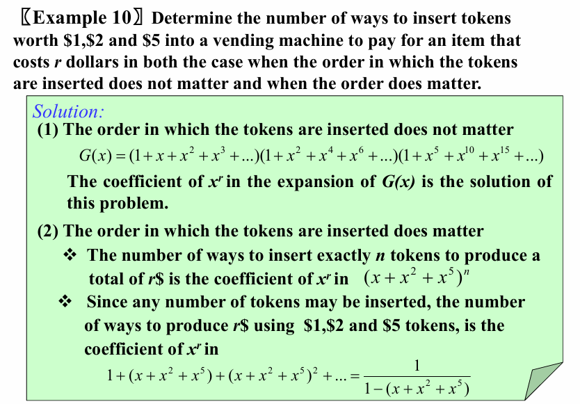
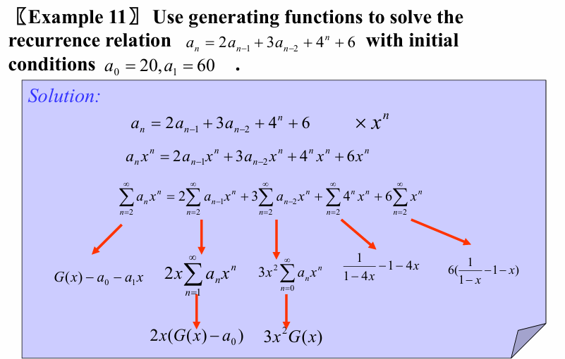

# Ch8.Advanced Counting Techniques

## 8.1 Applications of Recurrence Relations

### Recurrence Relations

**[Definition]** A recurrence relation for the sequence $\{a_n \}$ is an equation that express $a_n$ in terms of one or more of the previous terms of the sequence, namely, $a_0,a_1,\dots,a_{n-1}$, for all integers $ n$ with $n≥n_0$, where $n_0$ is a nonnegative integers. $a_n  = f  (  a_0  ,  a_1  ,  a_2  ,  … , a_{n-1}  )   \space n≥n_0$

* **A solution of a recurrence relation** is a **sequence** if its terms satisfy the recurrence relation.

* The **degree** of a recurrence relation  
  
    * $a_n = a_{n-1}  + a_{n-8}$   — a recurrence relation of degree $8$

### Algorithm and Recurrence relations

* Dynamic programming algorithm
* Divide-and-conquer algorithm

## 8.2 Solving Linear Recurrence Relations

### 1. Linear Homogeneous Recurrence Relations 

> 线性齐次递推关系

***k 阶常系数线性齐次递推关系 (linear homogeneous recurrence relation of degree k with constant coefficient)***
$a_n=c_1a_{n−1}+c_2a_{n−2}+\dots+c_ka_{n−k}$ where $c_1 , c_2 ,\dots, c_k$  are real numbers, and $c_k  ≠0$

- **linear 线性**：等号右边是序列中前几项与常系数之积的和
- **homogeneous 齐次**：每项次数不超过 1
- **constant 常数**：序列中的每一项系数都是常数，而非关于 $n$ 的函数
- **degree k阶**：$a_n$ 是由序列中的前$k$项表达的

### 2. Solving Linear Homogeneous Recurrence Relation With Constant Coefficients 

> 求解常系数线性齐次递推关系

#### 2.1 **Two key ideas to find all their solutions:**

1. **These recurrence relations have solutions of the form $a_n = r_n$, where $r$ is a constant**  
   这种递推关系有形如 ==$a_n=r^n$== 的解，$r$ 为常数。 
    
    $$\begin{align}r^n-c_1r^{n-1}-c_2r^{n-2}-\dots--c_kr^{n-k}=0\\r^{n-k}(r^k-c_1r^{k-1}-c_2r^{k-2}-\dots--c_k)=0\\r^k-c_1r^{k-1}-c_2r^{k-2}-\dots--c_k=0\end{align}$$

    - The sequence $\{a_n\}$ with $a_n = r_n$ where $r ≠ 0$ is a solution if and only if $r$ is a solution of this last equation.  

    > 我们称上述方程为**特征方程 (characteristic equation)**，称这个方程的解为**特征根 (characteristic roots)**

2. **A linear combination of two solutions of a linear homogeneous recurrence relation is also a solution.**  
   suppose that $s_n$ and $t_n$ are both solutions of this recurrence relation.  
   Then, 线性齐次递推关系的两个解的**线性组合**也是它的解
   
    $$s_n=c_1s_{n-1}+c_2s_{n-2}+\dots+c_ks_{n-k}\\t_n=c_1t_{n-1}+c_2t_{n-2}+\dots+c_kt_{n-k}\\$$  
   
    - Now suppose that $b_1$ and $b_2$ are real numbers, Then   
    
    $$b_1s_n+b_2t_n=c_1(b_1s_{n-1}+b_2t_{n-1})+c_2(b_1s_{n-2}+b_2t_{n-2})+\dots+c_k(b_1s_{n-k}+b_2t_{n-k})$$  

    - This means that ==$b_1 s_n + b_2 t_n$== is also a **solution** of the same linear homogeneous recurrence relation. 

#### 2.2 The Degree Two Case

* **[ Theorem 1 ]** 
  Let $c_1,c_2$ be real numbers. Suppose that $r^2-c_1r-c_2=0$ has ***<u>two distinct roots</u>*** $r_1,r_2$. Then the sequence $\{a_n\}$ is a solution of the recurrence relation $a_n=c_1a_{n-1}+c_2a_{n-2}$ if and only if ==$a_n=\alpha_1r_1^n+\alpha_2r_2^n$==$ for $n=0,1,2,\dots$ where $\alpha_1,\alpha_2$ are constants. 

* **[ Theorem 2 ]**
   Let $c_1, c_2$ be real numbers with $c_2 \neq 0$. Suppose that $ r^2 - c_1 r - c_2 = 0$ has **<u>only one root</u>** $r_0$. A sequence $\{a_n\}$ is a solution of the recurrence relation $a_n = c_1 a_{n-1} + c_2 a_{n-2}$ if and only if ==$a_n = (\alpha_1 + \alpha_2 n )r_0^n$==$\text{ for } n = 0, 1, 2, \ldots,$ where $\alpha_1, \alpha_2$ are constants.

#### 2.The General Case

* **[ Theorem 3 ]**
  Let $c_1, c_2, \ldots, c_k$ be real numbers. Suppose that the characteristic equation $r^k - c_1 r^{k-1} - \ldots - c_k = 0$ has $k$ ***<u>distinct roots</u>*** $r_1, r_2, \ldots, r_k$. Then a sequence $\{a_n\}$ is a solution of the recurrence relation
  $a_n = c_1 a_{n-1} + c_2 a_{n-2} + \ldots + c_k a_{n-k}$ if and only if ==$a_n = \alpha_1 r_1^n + \alpha_2 r_2^n + \ldots + \alpha_k r_k^n$== for $n = 0, 1, 2, \ldots$, where $\alpha_1, \alpha_2, \ldots, \alpha_k$ are constants.

* **[ Theorem 4 ]**
  Let $c_1, c_2, \ldots, c_k$ be real numbers. Suppose that the characteristic equation $r^k - c_1 r^{k-1} - \ldots - c_k = 0$ has ***<u>t distinct roots t个不同的根</u>*** $r_1, r_2, \ldots, r_t$ with ***<u>multiplicities重数</u>*** $m_1, m_2, \ldots, m_t$, respectively, so that $m_i \geq 1$ for $i = 1, 2, \ldots, t$ and $m_1 + m_2 + \ldots + m_t = k$. Then a sequence $\{a_n\}$ is a solution of the recurrence relation $a_n = c_1 a_{n-1} + c_2 a_{n-2} + \ldots + c_k a_{n-k}$ if and only if

    \[
    \begin{aligned}
  a_n = & \left( \alpha_{1,0} + \alpha_{1,1} n + \cdots + \alpha_{1,m_1-1} n^{m_1-1} \right) r_1^n \\
  & + \left( \alpha_{2,0} + \alpha_{2,1} n + \cdots + \alpha_{2,m_2-1} n^{m_2-1} \right) r_2^n \\
  & + \cdots + \left( \alpha_{t,0} + \alpha_{t,1} n + \cdots + \alpha_{t,m_t-1} n^{m_t-1} \right) r_t^n
  \end{aligned}
    \]
    
    for $n = 0, 1, 2, \ldots$ where $\alpha_{i,j}$ are constants for $1 \leq i \leq t, 0 \leq j \leq m_i - 1$.

### 3. Linear Nonhomogeneous Recurrence Relation With Constant Coefficients 

> 常系数线性非齐次递推关系

***k 阶常系数线性非齐次递推关系 (linear nonhomogeneous recurrence relation of degree k with constant coefficient)***：
$a_n=c_1a_{n−1}+c_2a_{n−2}+\dots+c_ka_{n−k}+F(n)$ where $c_1 , c_2 ,\dots, c_k$  are real numbers, $F(n)$ is a **function** not  identically zero depending only on $n$
$a_n=c_1a_{n−1}+c_2a_{n−2}+\dots+c_ka_{n−k}$ is called ***关联齐次递推关系 (associated homogeneous recurrence relation)***

**[ Theorem 5 ]**

* Let $\{a_n^{(p)}\}$ be ***a particular solution 特殊解*** of <u>the nonhomogeneous linear</u> recurrence relation with constant coefficients

    $$
a_n = c_1 a_{n-1} + c_2 a_{n-2} + \ldots + c_k a_{n-k} + F(n)
    $$

    Then every solution is of the form ==$\{a_n^{(p)} + a_n^{(h)}\}$==, where $\{a_n^{(h)}\}$ is **a solution** of <u>the associated homogeneous recurrence relation</u>.

    > 虽然没有通法来找到关于任意函数 $F(n)$ 的解，但是对于某些类型的函数，比如多项式或者常数幂，是有办法可以解决的，如<u>定理6</u>

**[ Theorem 6 ]**

* Assume ***a linear nonhomogeneous recurrence equation with constant coefficients*** with the nonlinear part $F(n)$ of the form
    * The solution is ==$F(n) = (b_t n^t + b_{t-1} n^{t-1} + \ldots + b_1 n + b_0) s^n$==

Cases:

1. If $s$ is **not** a root of the characteristic equation of the associated homogeneous recurrence equation, there is a particular solution of the form
   ( $s$不是关联齐次递推关系的特征方程的根 )

    * The solution is ==$(p_t n^t + p_{t-1} n^{t-1} + \dots + p_1 n + p_0) s^n$==

2. If $s$ is **<u>a root of multiplicity $m$</u>**, a particular solution is of the form
   ( $s$是关联齐次递推关系的特征方程的根，重数为$m$ )

    * The solution is ==$n^m (p_t n^t + p_{t-1} n^{t-1} + \dots + p_1 n + p_0) s^n$==

## 8.4 Generating Functions

**[ Definition ]** The ***generating function生成函数*** for the sequence $a_1,a_2,\dots,a_k,\dots$ of real numbers is the ***infinite series无限级数***.

$$
G(x)=a_0+a_1x+a_2x^2+\dots+a_kx^k+\dots=\sum_{k=0}^{\infty}a_kx^k
$$

* The generating function for ***finite*** sequence of real numbers $a_0,a_1,a_2,\dots,a_n$ is 

$$
G(x)=a_0+a_1x+a_2x^2+\dots+a_nx^n
$$

### Useful Facts About Power Series

**[ Theorem 1 ]** Let $f(x)=\sum_{k=0}^{\infty}a_k x^k, g(x)=\sum_{k=0}^{\infty}b_k x^k$. Then

1.  
$$
f(x)+g(x)=\sum_{k = 0}^{\infty}(a_{k}+b_{k})x^{k} 
$$
2. 
$$
\alpha\cdot f(x)=\sum_{k = 0}^{\infty}\alpha\cdot a_{k}x^{k}\quad \alpha\in R
$$
3.  
$$
x\cdot f^{\prime}(x)=\sum_{k = 0}^{\infty}k\cdot a_{k}x^{k}
$$
4. 
$$
f(\alpha x)=\sum_{k = 0}^{\infty}\alpha^{k}\cdot a_{k}x^{k}
$$ 
5. 
$$
f(x)g(x)=\sum_{k = 0}^{\infty}(\sum_{j = 0}^{k}a_{j}b_{k - j})x^{k} 
$$ 

#### **The extended binomial coefficient**

Recall $\binom{m}{k}=C(m,k)= \dfrac{m!}{k!(m-k)!}$

**[ Definition ]** Let $u$ be a real number and $k$ a nonnegative integer. Then the ***extended binomial coefficient扩展二项式系数*** is defined by 

$$ 
\begin{pmatrix} u \\ k \end{pmatrix}= \begin{cases} u(u - 1)\cdots(u - k + 1)/k! &\text{if } k > 0 \\ 1 &\text{if } k = 0 \end{cases} 
$$ 

* If $n > 0$, then $\binom{-n}{r}=(-1)^r\binom{n+r-1}{r}=(-1)^rC(n+r-1,r)$

#### **The extended Binomial Theorem**

**[ Theorem 2 ]** Let $x$ be a real number with $|x|<1$ and let $u$ be a real number. Then 

$$
(1+x)^u=\sum_{k=0}^{\infty}\binom{u}{k}x^k
$$

### Counting Problems and Generating Functions

### Use Generating Function To Solve Recurrence Relations

### Proving Identities Via Generating Functions

>  略

## 8.5 Inclusion-Exclusion and Its Application

### The Principle of inclusion-exclusion

> 容斥原理

The formula for the number of elements in the union of $n$ finite sets:

$$
\left|A_1\cup A_2\cup\cdots\cup A_n\right| = \sum_{i = 1}^{n}\left|A_i\right| - \sum_{1\leq i < j\leq n}\left|A_i\cap A_j\right| + \sum_{1\leq i < j < k\leq n}\left|A_i\cap A_j\cap A_k\right|+\cdots+(- 1)^{n - 1}\left|A_1\cap A_2\cap\cdots\cap A_n\right|
$$

*  There are $2^n − 1$ terms in this formula

## 8.6 Applications of Inclusion-Exclusion

### An alternative form of inclusion-exclusion

* To solve problems that ask for the number of elements in a set that have none of n properties.

$$P_1,P_2,\dots,P_n$$

  Let $A_i$ be the subset containing the elements that have property $P_i$.

  $N(P_1,P_2,\dots,P_k)$ : The number of elements with all properties $P_1,P_2,\dots,P_k$

  It follows that $N(P_1,P_2,\dots,P_k)= \left|A_1\cap A_2\cap\cdots\cap A_k\right|$

  $N(P_1^{'},P_2^{'},\dots,P_k^{'})$ : The number of elements with none properties $P_1,P_2,\dots,P_k$

  From the inclusion-exclusion principle, we see that

$$
N(P_1^{'},P_2^{'},\dots,P_n^{'})=N-\sum_{1 \leq i \leq n}N(P_i)+\sum_{1 \leq i < j \leq n}N(P_i P_j)+\dots+(-1)^n N(P_1P_2\dots P_n)
$$

### The number of onto functions

**Theorem**: Let $m$ and $n$ be positive integers with $m\geq n$. Then, there are  $n^m - C(n, 1)(n - 1)^m + C(n, 2)(n - 2)^m-\cdots+(-1)^{n - 1}C(n, n - 1)\cdot1^m$ **onto functions** from a set with $m$ elements to a set with $n$ elements. 

### Derangements

> 全错位排列

*  A derangement is a permutation of objects that leaves no object in the original position.

**Theorem**: The number of derangements of a set with $n$ elements is

$$
D_n=n![1-\frac{1}{1!}+\frac{1}{2!}+\dots+(-1)^n\frac{1}{n!}]
\\(NOTE:D_n=D_{n-1}+D_{n-2})
$$
