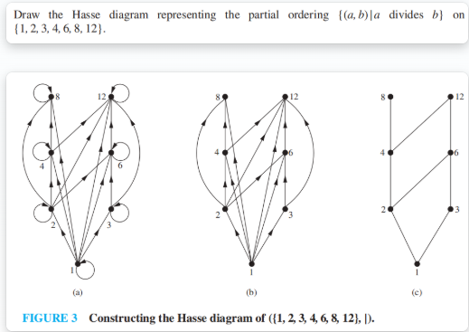

# Ch9 Relations

## 9.1 Relations and Their Properties

### 1. Functions as Relations

* **Binary relation**

  **[Definition] ** A **binary relation二元关系** $R$ from a set $A$ to a set $B$ is a subset of $A×B$.

  **Note** :

  * A binary relation $R$ is a set
  * $R \subseteq A\times B$
  * $R = \{(a,b)|a \in A,b \in B, aRb \}$

 Relations are a ***generalization泛化*** of function.

### 2. Relations On A Set

**[Definition]** A relation on the set $A$ is a **relation** form $A$ to $A$

* $R \subseteq A\times A$

* A set $A$ with $n$ elements has $2^{n^2}$ binary relations

### 3. Properties of Binary Relations

#### 3.1 Reflexive Relations

**【Definition】**A relation $R$ on a set $A$ is ***reflexive自反性*** if $(x,x)\in R,\text{for every element }x\in A $, $\forall x (x\in A\rightarrow (x, x)\in R)$

* All the elements on the ***main diagonal主对角线*** of a matrices must be **1s**
* There is a ***loop环*** at every vertex of the directed graph

**【Definition】** A relation $R$ on a set $A$ is ***irreflexive非自反性*** if $\forall x (x\in A\rightarrow (x, x)\notin R)$

* All the elements on the ***main diagonal主对角线*** of a matrices must be **0s**

#### 3.2 Symmetric Relations

**【Definition】**A relation $R$ on a set $A$ is ***symmetric对称性*** if $\forall x \forall y ((x,y)\in R\rightarrow (y, x)\in R)$

> $(a,b)=(b,a)$ 恒成立

**【Definition】**A relation $R$ on a set $A$ is ***antisymmetric 反对称性*** if $\forall x \forall y ((x,y)\in R \and (y,x)\in R\rightarrow x=y)$

**【Definition】**A relation $R$ on a set $A$ is ***asymmetric 不对称性*** if $\forall x \forall y ((x,y)\in R \rightarrow (y,x)\notin R)$

> - 对称性和反对称性不是对立的，一个关系可能同时具有对称性和反对称性

#### 3.3 Transitive Relations

**【Definition】**A relation $R$ on a set $A$ is ***transitive传递性*** if  $\forall x \forall y \forall z (  (x,y)\in R \and (y,z)\in R \rightarrow (x,z) \in R  )$

* $\overline{(m_{ij} \and m_{jk})} \or m_{ik} = 1$
* If there is an arc from $x$ to $y$ and one from $y$ to $z$ then there  must be one from $x$ to $z$.  

### 4. Combining Relations

Since relations form $A$ to $B$ are subsets of $A×B$, two relations form $A$ to $B$ can be combined in any way two sets can be combined (Set operation $\cup, \cap, -,⊕$).  

#### Composition复合 

Let $R=\{(a,b)|a \in A, b \in B, aRb\}$ , $ S=\{ (b,c)|b\in B, c \in C,bSc \}$,

Then $S∘R=\{ (a,c)|a \in A \and c \in C \and \exist b (b \in B \and aRb \and bSc) \}$

* Note : $S∘R \neq R∘S$

#### Inverse relation

$R=\{(a,b)|a\in A,b \in B, aRb\}$

 The inverse relation form B to A : $R^{-1}(R^c)=\{ (b,a)|(a,b)\in R,a \in A, b \in B \}$

#### The properties of relation operations 

Suppose that $R, S$ are the relations from $A$ to $B$, $T$ is the relation from $B$ to $C$, $P$ is the relation from $C$ to $D$, then

1.  $(R\cup S)^{-1} = R^{-1}\cup S^{-1}$
2.  $(R\cap S)^{-1} = R^{-1}\cap S^{-1}$
3.  $(\overline{R})^{-1}=\overline{R^{-1}}$
4.  $(R- S)^{-1} = R^{-1}- S^{-1}$
5.  $(A\times B)^{-1} = B \times A$
6.  $\overline{R}=A\times B-R$
7.  $(S∘T)^{-1}=T^{-1}∘S^{-1}$
8.  $(R∘T)∘P=R∘(T∘P)$
9.  $(R\cup S)∘T=R∘T\cup S∘T$

#### The Power of a relation R

【Definition】Let $R$ be a relation on the set $A$. The powers $R^n , n=1,2,3, \dots$  are defined inductively by $R^1=R$ and $R^{n+1}=R^n∘R$

【Theorem】The relation $R$ on a set $A$ is **transitive** if and only if $R^n \subseteq R, for\space n=1,2,\dots$

* If $R$ is reflexive, then $R^n$ is reflexive
* If $R$ is symmetric, then $R^n$ is symmetric

## 9.2 **n-ary Relations**

**[ Definition ] ** Let $A_1,A_2,\dots,A_n$ be sets, An ***n-ary relation*** on these sets is a subset of $A_1×A_2×\dots ×A_n$.

## 9.3 Representing Relations 

**The methods of representing relation**:  

* list its all ordered pairs 
* using a set build notation/specification by predicates  
* 2D table 
* Connection matrix /zero-one matrix 
* Directed graph/Digraph

### 1. Connection Matrices

**[ Definition ]** : Let $R$ be a relation from $A = \{a_1,a_2,\dots,a_m\}$, to $B=\{b_1, b_2, \dots b_n\}$, 
An $m \times n$ ***connection matrix连接矩阵*** $M_R=[m_{ij}]$ for $R$ is defined by
$$
m_{ij}= \begin{cases} 1 & \text{if } (a_i, b_j)\in R, \\ 0 & \text{if } (a_i, b_j)\notin R. \end{cases}
$$

### 2. Directed graph/Digraph

**[ Definition ]** A ***directed graph*** or a ***digraph***, consists of a set $V$ of vertices together with a set $E$ of ordered pairs of elements of $V$ called ***edges(or arcs)***. The ***vertices*** $a,b$ is called the **initial** and **terminal** vertices of the edge $(a,b)$.

## 9.4 Closures of Relations 

**【Definition】**The ***closure闭包*** of a relation $R$ with respect to property $P$ is the relation $S$ with property $P$
containing $R$ such that $S$ is a subset of every relation with property $P$ containing $R$.

如果 $R$ 是在集合 $A$上的关系，那么 $R$ 关于性质 $P$ 的**闭包 (closure)**，它满足性质 $P$ 且包括 $R$，而且是所有包含 $R$ 且满足 $P$ 的 $A×A$ 的子集

> The smallest relation with property $P$ containing $R $

### 1. Reflexive Closure

**【Theorem】**Let $R$ be a relation on $A$. The ***reflexive closure自反闭包*** of $R$, denoted by $r(R)$, is $R\cup I_A$(The ***diagonal relation对角关系*** on A, $I_A=\{ (x,x)|x\in A\}$).

**【Corollary】**$R=R\cup I_A$ ⇔ $R$ is a reflexive relation

### 2. Symmetric Closure

**【Theorem】**Let $R$ be a relation on $A$. The ***symmetric closure对称闭包*** of $R$, denoted by $r(R)$, is $R\cup R^{-1}$

**【Corollary】**$R=R\cup R^{-1}$ ⇔ $R$ is a symmetric relation

### 3. Transitive closure

* $t(R)$ : the smallest transitive relation containing $R$

**Terminologies术语**:

*  <u>***A path of length n in a digraph G***</u> 
  * A sequence of edges $(x_0,x_1),\dots,(x_{n-1},x_n)$
  * Notation: $x_0,x_1,\dots,x_n$
* ***<u>Cycle or circuit</u>*** 
  * If there is a sequence of edges $(x_0,x_1),\dots,(x_{n-1},x_n)$, and $x_0 = x_n$​

 The term path also applies to relation.  

**【Theorem1】** ==Let $R$ be a relation on $A$. There is a path of length $n$ from $a$ to $b$ if and only if $(a,b)\in R^n$==

#### Connectivity Relation

**【Definition】** The ***connectivity relation联通关系*** denote by $R^*$, is the set of ordered pairs $(a,b)$ such that there is a path (in $R$) from $a$ to $b$, 

* then is easy to get the equation: $R^*=\cup^{\infty}_{n=1}R^n$

**【Theorem2】** $R$ 的传递闭包 $t(R)$ $=$ 连通关系$R^*$

* $R=t(R) ⇔\text{R is transitive}$ 
* In fact, we need only consider paths of length $n$ or less.  

**【Theorem】** If $|A | = n$, then any <u>path of length > n</u> must contain a cycle. 

**【Theorem】**If $|A|=n$, $R$ is a relation on $A$, then $\exist k,k\leq n,R^*=R\cup R^2\cup \dots\cup R^k$

* **【Corollary】** If $|A|=n$, then $t(R)=R^*=R\cup R^2 \cup \dots \cup R^n$
* **【Corollary】** Let $M_R$ be the zero-one matrix of the relation $R$ on a set with $n$ elements. The zero-one matrix of the transitive closure is $M_{t(R)}=M_R \or M_R^{[2]}]  \or \dots\or M_R ^{[n]}$

### 4. Warshall's Algorithm

The interior vertices of a path: $x_0, x_1, x_2, \ldots, x_{n - 1}, x_n$

**Warshall's algorithm** is based on the construction of a sequence of **zero-one matrices**, such as $W_0, W_1, W_2, \ldots, W_n$

*  $ W_0 = M_R $ and $W_k = [w_{ij}^{(k)}] $

$$
w_{ij}^{(k)}= \begin{cases} 1 & \text{If there is a path from } V_i \text{ to } V_j \text{ such that all the interior vertices of this path }\\ &\text{are in the set } \{V_1, V_2, \ldots, V_k\}\\ 0 & \text{otherwise} \end{cases}
$$

*  $ W_n = M_{t(R)} $
*  $ w_{ij}^{(k)}=w_{ij}^{(k - 1)}\vee(w_{ik}^{(k - 1)}\wedge w_{kj}^{(k - 1)})$

## 9.5 Equivalence Relations

### 1. Equivalence Relations

**【Definition】**A relation $R$ on a set $A$ is an ***equivalence relation等价关系*** if $R$ is <u>**reflexive, symmetric , transitive**</u>.

* a and b are ***equivalent相关*** ($a$~$b$) : $a$ and $b$ are related by an equivalence relation $R$

### 2. Equivalence Classes

* ***the equivalence class等价类*** of $x$:
  The set of all elements that are related to an element $x$ of $A$
* Notation : $[a]_R$,   $[a]_R=\{s ∣ (a,s)∈R\}$
* a representative of the equivalence class $[a]_{R}$ : $b\in [a]_R$

### 3. Partition of a Set

**【Definition】**Let be a collection of subsets of $A$. Then the collection forms a ***partition分区*** of $A$ if and only if

* $A_i \neq \empty \text{ for }i \in Z$
* $A_i \cap A_j = \empty, when \space i \neq j$
* $\forall a \in A,\exist i\text{ such that }a \in A_i(i=1,2,\dots)$  [ $\cup_{i\in Z}A_i=A$ ]

> 贝尔数 $B_n=\sum_{k=1}^{n}S(n,k)$ , 满足$B_{n+1}=\sum_{k=0}^{n}\binom{n}{k}B_k$,
>
> 贝尔数代表集合有多少种划分方式，也代表集合具有的equivalence relation的数量

### 4. Equivalence Classes and Partitions

**【Theorem 1】**Let $R$ be an ***equivalence relation*** on a set $A$. The following statements are equivalent :

* $aRb$
* $[a]=[b]$
* $[a]\cap [b]=\empty$

**【Theorem 2】** Let $R$ be an equivalence relation on a set $A$. Then the equivalence classes of $R$ form a partition of $A$. Conversely, given a partition, $\{A_i|i\in I\}$ of the set $A$, there is an equivalence relation $R$ that has the sets $A_i,i\in I$, as its equivalence classes.

### 5. The operations of equivalence relations

**【Theorem 3】** If $R_1,R_2$ are equivalence relations on $A$, then $R_1\cap R_2$ is equivalence relations on $A$.

**【Theorem 4】** If $R_1,R_2$ are equivalence relations on $A$, then $R_1\cup R_2$ is reflexive and symmetric relation on $A$.

**【Theorem 5】** If $R_1,R_2$ are equivalence relations on $A$, then $(R_1\cup R_2)^*$ is an equivalence relation on $A$.

## 9.6 Partial Orderings

### 1. Basic Concepts

* 【Definition】Let $R$ be a relation on $S$. Then $R$ is a ***==partial ordering== or partial order偏序*** if $R$ is 
  * **reflexive** 
  * **antisymmetric** - $\forall x \forall y ((x,y)\in R \and (y,x)\in R\rightarrow x=y)$
  * **transitive** 
* Notation : $(S,R)$--- partially ordered set or a ***poset偏序集***

#### **Comparable/ Incomparable**

**【Definition】**The elements $a$ and $b$ of a poset $(S,⪯)$ are called ***comparable可比*** if either $a⪯b$ or $b⪯a$. When $a$ and $b $ are elements of $S$ such that neither $a⪯b$ or $b⪯a$ are called ***incomparable不可比***.   

#### **Total order/Linear order**

**【Definition】** If $(S,⪯)$ is a poset and every two elements of $S$ are comparable, $S$ is called a ***totally  ordered or linearly ordered set全序集***,  $⪯$ is called a ***==total order== or linear order全序***. In this case is called a ***chain链***. 

#### Well-ordered

**【Definition】** $(S, ≼)$ is a ***well-ordered set良序集*** if it is a poset such that $≼$ is a **total ordering** and every nonempty subset of $S$ has **a least element**. 

**【Theorem】The principle of well-ordered induction良序归纳法原则** 
Suppose that $S$ is a well-ordered set. 
Then $P(x)$ is true for all $x∈S$ ,if :
For every $y∈S$, if $P(x)$ is true for all $x∈S$ with $x<y$,  then $P(y)$ is true.

### 2. Lexicographic Order

The lexicographic order $≼$ on $A_1\times A_2$

* Given two posets $(A_1,≼_1)$ and $(A_2,≼_2)$, we construct an induced partial order $R$ on $A_1\times A_2$: $(x_1,y_1)≼ (x_2,y_2)$ if $x_1 ≼ x_2$ or $x_1=x_2 \and y_1≼ y_2$       

* A lexicographic ordering is a partial ordering defined on a Cartesian product of two posets.

   词典序是两个偏序集的笛卡尔积的偏序

* The definition of lexicographic order extends naturally to multiple Cartesian products of partially ordered sets

### 3. Hasse Diagrams 

To construct a ***Hasse diagram哈斯图*** :

1)  画出偏序的有向图
2)  因为偏序是*自反的*，所以每个顶点都会有一个***环***$(a,a)$，将这些环全部移除
3)  由于其他边的存在和传递性，我们需要移除所有多余的边，即当存在元素 $z∈S$ 使得 $x≺z$ 且 $z≺y$时，移除边 $(x,y)$
4)  对所有边重新排序，使得***起点在终点的下面***，并且移除所有箭头 ( 因为现在所有的边都是向上指的，方向已知 )

#### Chain and Antichain

【Definition】$(A,≼ )$ is a poset. $B\subset A$, if $(B,≼)$ is a totally ordered set, the $B$ is called a ***chain*** of $(A,≼)$        

【Definition】$(A,≼ )$ is a poset. $B\subset A$, if $\forall a,b \in B(a\neq b),(a,b)\notin R,(b,a)\notin R$, the $B$ is called a ***antichain*** of $(A,≼)$  

* The length of chain: $|B|$, $B$ is a definite set

### 4. Maximal and Minimal Elements

**【Definition】** Let $(A,≼ )$ be a poset. $a\in A$, then $a$ is a ***maximal element极大元素*** if there does not exist an element $b$ in $A$ such that $a≺b$. Similarly for a ***minimal element极小元素***. 

**Note**: 

1.  Maximal and minimal elements are the <u>**“top” and “bottom”**</u> elements in the Hasse diagram. 
2.  There can be <u>**more than one**</u> minimal and maximal element in a poset.

#### Greatest and Least Element 

**【Definition】**Let $(A,≼ )$ be a poset. Then an element $ a$ in $A$ is a ***greatest element最大元素*** of $A$ if $b⪯a$ for every $b$ in $A$, and $a$ is a ***least element最小元素*** of $A$ if $a⪯b$ for every $b$ in $ A$.

**【Theorem】** The greatest and least element are **unique** when they exist.

#### Upper and Lower Bounds

**【Definition】**Let $A$ be a subset of $S$ in the poset $(S,≼ )$.  If there exists an element $u$ in $S$ such that $a≼ u$ for all $a$ in $A$, then $u$ is called an ***upper bound上界*** of $A$. Similarly for lower bounds.

**【Definition】**If $a$ is an upper bound for $P$ which is less than every other upper bounds then it is the least upper bound, denoted by $lub(S)$. Similarly for the greatest lower bound, denoted by $glb(S)$.

### 5. Lattices 

**【Definition】**A poset is called a ***lattice格*** if every pair of elements has a $lub$ and a $glb$. 

### 6. Topological Sorting 

We can impose a **total ordering** $≼$ on a poset ***compatible兼容*** with the **partial order** $R$ if $a≼b$ whenever $aRb$.

> 对于某个全序 $⪯$ 和偏序 $R$，如果当 $a R b$ 时，$a⪯b$，则称 $⪯$ 与 $R$ 是**兼容的**

* Constructing a compatible total ordering from a partial ordering is called ***topological sorting拓扑序***.

**【Lemma 1】**Every finite nonempty poset $(S,  ≼)$ has a minimal element

**Algorithm**:  To sort a poset $(S, R)$. 

* Select the **minimal element** $s_1$ form $S$ and put it in the list.
* Select the **minimal element** $s_2$ form $S-\{a_1\}$ and put it in the list.
* Select the **minimal element** $s_3$ form $S-\{a_1,a_2\}$ and put it in the list.
* ......
* Continue until all elements appear in the list  (and $S$ is void).
