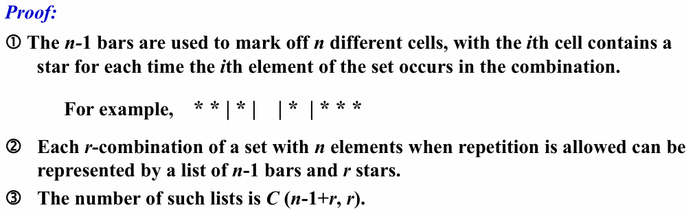
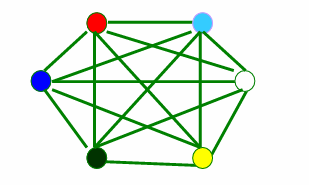
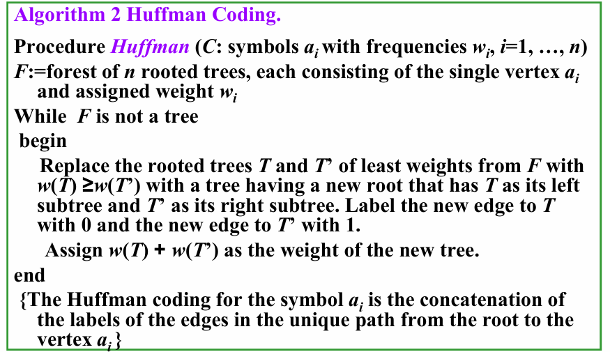

# Discrete Mathematics and Application

# Ch1 Logic & Proofs

## 1.1 Propositional Logic

### 1. Propositions

<u>A proposition is a **declarative sentence** (that is, a sentence that declares a fact) that is either `true` or `false`, but not both.</u>

- **Paradox (悖论)** 不属于命题（e.g. *This statement is false.* or *I'm lying.*）

**Propositional variable / Sentential variables (命题变量)**：Small letters such as $p,q,r,s,\dots$ used to present propositions.

**Propositional logic / Propositional calculus (命题逻辑)**：The area of logic that deals with propositions.

**Truth value(真值)**：T (true proposition), or F (false proposition)

We call a series of propositions **==consistent== (一致的)** if they can possibly be satisfied at the same time.

### 2. Connectives

#### Logical Operators

**Logical operator** or **Logical Connective**: be used to form **compound propositions** from existing propositions.

| Connectives                           | Expression |               Note               |
| :------------------------------------ | :--------: | :------------------------------: |
| negation (NOT)                        |    $¬p$    | $~p, -p, p', Np, \text{and } !p$ |
| 和取 conjunction (AND)                |   $p∧q$    |          "but" = "and"           |
| 析取 disjunction (OR)                 |   $p∨q$    |         an inclusive or          |
| 亦或 Exclusive Or (XOR)               |   $p⊕q$    |         an exclusive or          |
| 条件 Conditional (IF-THEN)            |   $p→q$    |                                  |
| 双条件 Biconditional (IF AND ONLY IF) |   $p↔q$    |           参见下节介绍           |

- 英语中的单词 or 既可以表示 **inclusive or** 也可以表示 **exclusive or**（e.g. *George was born in 1956 or 1957.*），取决于具体语境。

逻辑运算符的**优先级(precedence)** 如下：

|  ¬   | ∧ |∨ | → | ↔ |
| :--: | :--: | :--: | :--: | :--: |
|  1   |   2   |   3   |   4   |   5   |

####  Conditional Statements

==**Implication** or **Conditional statement**== ：$p→q$ is false when $p$ is true and $q$ is false, and true otherwise.

- **p :** **假设(hypothesis / antecedent / premise)**
- **q :** **结论(conclusion / consequence)**


对于推断 p→q可定义以下条件语句：

- **Converse (逆命题)**：$q→p$
- **Inverse (否命题)**：$¬p→¬q$
- **Contrapositive (逆否命题)**：$¬q→¬p$


When two compound propositions always have the same truth values, regardless of the truth values of its propositional variables, we call them **==equivalent==（等价的）**.

* The ***contrapositive*** has the **same** truth values as the original implication.

* The ***converse*** and the ***inverse*** of a conditional statement are also **equivalent**.

**==Biconditional statement (双条件语句)==**：The biconditional statement p↔q is the propostion “p if and only if q.” 

### 3. Truth Table

要学会画**真值表(truth table)**。

- n个不同的布尔变量所画的真值表应有 $2^{n}$ 行。

### 4. Logic and Bit Operatons

**Bit**: a symbol with two possible values , namely, 0 and 1.

**Boolean variable**: one whose value is either true or false.

## 1.2 Applications of Propositional Logic

* Translating English to Propositional Logic

* System Specifications
  * System specifications should be **consistent**.

* Logic Puzzles

## 1.3 Propositional Equivalences

### 1. Introduction

* A **tautology (永真)** is a proposition which is always true.  Example: $p ∨¬p $
* A **contradiction (永假)** is a proposition which is always false.  Example: $p ∧¬p $
* A **contingency (可能式)** is a proposition which is neither a tautology nor a  contradiction, such as $ p$

**Propositional Satisfiability**

* A compound proposition is **==satisfiable==** if there is an assignment of truth values to its  variables that makes it true. 
* A compound proposition is **==unsatisfiable==** when it is false for all assignments of truth  values to its variables.

**Equivalent**

* The propositions $p$ and $q$ are called ==**logically equivalent（逻辑等值）**== if $p ↔ q$ is a  tautology.

* Notation: $p ⇔ q$ or $p ≡ q$

**Other logical operators**

* <u>Sheffer stroke</u> |:  $p|q ≡ ¬(p ∧ q) $ NAND 
* <u>Peirce arrow</u> ↓:  $p ↓ q ≡ ¬(p ∨ q) $ NOR

### 2. Logical Laws

- 可以用真值表来证明一些基本的逻辑定律：对于涉及到$n$个变量的两个命题，画出 $2^n$ 种可能的变量取值下的真值表，若两个命题的值都相同，则说明这两个命题是逻辑等值的。

  | Name                           |                     Expression                     | Note                   |
  | :----------------------------- | :------------------------------------------------: | :--------------------- |
  | 统一律 Identity Laws           |               $p∧T ≡ p$   $p∨F ≡ p$                |                        |
  | 零一律 Domination Laws         |               $p∨T ≡ T$   $p∧F ≡ F$                |                        |
  | 幂等律 Idempotent Laws         |               $p∧p ≡ p$   $p∨p ≡ p$                |                        |
  | 对合律 Double Negation Law     |                     $¬¬p ≡ p$                      |                        |
  | 交换律 Commutative Laws        |             $p∨q ≡ q∨p$   $p∧q ≡ q∧p$              |                        |
  | 结合律 Associative Laws        |     $(p∨q)∨r ≡ p∨(q∨r)$    $(p∧q)∧r ≡ p∧(q∧r)$     |                        |
  | 分配律 Distributive Laws       | $p∨(q∧r) ≡ (p∨q)∧(p∨r)$   $ p∧(q∨r) ≡ (p∧q)∨(p∧r)$ |                        |
  | **德·摩根律 De Morgan's Laws** |        $¬(p∨q) ≡ ¬p∧¬q$    $¬(p∧q) = ¬p∨¬q$        | **重要**               |
  | 否定律 Negation Laws           |              $p∨¬p ≡ T$   $p∧¬p ≡ F$               |                        |
  | 吸收律 Absorption Laws         |           $p∨(p∧q) ≡ p$   $p∧(p∨q) ≡ p$            |                        |
  | 逆否律 Contrapositive Laws     |                   $p→q ≡ ¬q→¬p$                    | 命题与它的逆否命题等价 |
  | **导出律 Exportation Laws**    |                $(p∧q)→r ≡ p→(q→r)$                 |                        |
  | Absurdity Laws                 |                $(p→q)∧(p→¬q) ≡ ¬p$                 |                        |
  | **蕴含律 Implication Laws**    |                    $p→q ≡ ¬p∨q$                    | 用于去掉箭头           |
  | Equivalence Laws               |                $p↔q ≡ (p→q)∧(q→p)$                 |                        |
### 3. The Dual of a Compound Proposition 

The **dual对偶** of compound proposition that contains only the logical operators  $∨$ , $∧$ and $¬$ is the proposition obtained by replacing each $∨$ by $∧$,each $∧$ by $∨$,each $T$ by $F$ and each $F$ by $T$. The dual of $S$ is denoted by $S^{*}$.  

*  $S = (p ∨ ¬q) ∧ r ∨ T$      $S^{*} = (p ∧ ¬q) ∨ r ∧ F$

* $S = (p ∧ q) → (p ∨ q) ≡ ¬(p ∧ q) ∨ (p ∨ q)$     $S^{*} = ¬(p ∨ q) ∧ (p ∧ q)$ 

【Theorem】 let $s$ and $t$ are two compound propositions, **$s$ ≡ $t$ if and  only if $s^*$ ≡ $t^*$** .

### 4. Functionally Complete Collection of Logical Operators 

只需要部分运算符就可以表示出所有可能的运算，

称这样的一个运算符集合为**全功能集(Functionally Complete Collection)**

**极小全功能集**：$\{¬,∨,∧,→,↔ \}\{¬,∨,∧\}, \{¬,∧\}\{¬,∨\}, \{∣\}, \{↓\}$ 等。

> * $p∨q≡¬(¬p∧¬q)$
> * $¬p≡p∣p$
> * $p∧q≡¬(p∣q)≡(p∣q)∣(p∣q)$
> * $p∨q≡¬(¬p∧¬q)≡¬p∣¬q≡(p∣p)∣(q∣q)$

### 5. Propositional Normal Forms

####  5.1 DNF/CNF

- A **字面量(literal)** is a variable or its negation.
- Conjunctions with literals as conjuncts are called **合取子句(conjunctive clauses)** (clauses). <u>通过 AND 连接起来的一组字面量</u>。

**Propositional Normal Forms**：

- **析取范式(Disjunctive Normal Form, DNF)**

  A formula is said to be in **disjunctive normal form** if it is written as a disjunction, in which all the terms are conjunctions of literals. 

  > e.g.  $(p∧q)∨(p∧¬q)$

  - 最外面一层的运算符都是析取 $∨$
  - 括号内的运算符都是合取 $∧$

- **合取范式(Conjunctive Normal Form, CNF)**

  > e.g. $(p ∨ q)∧(p∨¬q)$
  
  和 DNF 的定义相反；把 $∧$ 和 $∨$ 互换。

#### 5.2 Full DNF & Full CNF

- **Minterm(极小项)** : a conjunctive of literals in which each variable is represented <u>exactly once</u>.
- **Maxterm(极大项)** : a disjunctive of literals in which each variable is represented <u>exactly once</u>.

**Full Disjunctive Normal Form(主析取范式)**：

> e.g. $(p\and \neg q \and r)\or(\neg p \and q \and r)\or (p \and q \and r)=\sum m(3,5,7)$

If a formula is expressed as a disjunction of minterms, it is said to be in **full disjunctive normal form**.

- 每个最小项对应真值表中 $T$ 的恰好一行。

**Full Conjuctive Normal Form(主合取范式)**：

> e.g. $(p\or \neg q \or r)\and(\neg p \or q \or r)\and (p \or q \or r)=\sum M(0,2,4)$

- 取出所有真值表为中为 F 的位置，写出 $¬f$。
- 对 $¬f$ 应用 De Morgan's Laws，可以将式子中的合取析取互换，从而求得 FCNF。

## 1.4 Predicates and Quantifiers

###  1. Predicates

- **Propositional functions命题函数** become propositions (and have truth values) when <u>their variables are each replaced by a value from the domain</u> or <u>bound by a quantifier</u>. 

- The statement $P(x_{1}, x_{2}, x_{3})$ is said to be the value of the propositional function $P$ at $x_{1}, x_{2}, x_{3}$. 

-  A statement of the form  $P(x_{1}, x_{2}, x_{3})$ is the value of the propositional function $P$ at the $n-tuple \space (x_1,x_2,…, x_n)$ and $P$ is called **a n-ary predicate n位谓词**.

  Predicates are also used to establish the correctness of computer programs. 

  * **preconditions前置条件** : the statements that describe **valid input** 
  * **postconditions后置条件** : the conditions that the **output** should satisfy when the  program has run

### 2. Quantifiers

- **全称量词(universal quantifier)** $∀$ ：都是真才为真，存在一个为假就为假。可以转化为合取。
- **存在量词(existential quantifier)** $∃$ ：都是假才为假，存在一个为真就为真。可以转化为析取。
- **唯一量词(uniqueless quantifier)** $∃!$ ：有且仅有一个为真时才为真。

我们在使用量词时，可能只要求对于某一范围内的 $x$ 成立，我们把此时 $x$ 的取值范围称为 **讨论域** (domain of discourse / universe of discourse)，一般简写为 **domain**。

* **量词的优先级(precedence of quantifiers)**
  * The quantifiers ∀ and ∃ have higher precedence(优先级) than **all** the logical operators.
* If t**he domain is finite**, <u>**a universally quantified proposition**</u> is  equivalent to a **conjunction** of propositions without quantifiers and <u>**an existentially quantified proposition**</u> is equivalent to a **disjunction** of  propositions without quantifiers.

### 3. Equivalences in Predicate Logic

Statements involving predicates and quantifiers are logically **equivalent** if and only if they **have the same truth value** no matter

- 代入了什么谓词选择 which predicates are substituted into these statements and
- 使用了什么讨论域 which domain of discourse is used for the variables in these propositional functions

同样使用 $≡$ 符号来表示谓词逻辑中的等值。

**德摩根定律(De Morgan’s laws)** 在谓词逻辑中也适用：

* $¬∀xP(x)≡∃x¬P(x)$

* $¬∃xP(x)≡∀x¬P(x)$

只有在 $A(x)$ 和 $B(x)$ 都输出真时，$A(x)∧B(x)$ 才为真，此时第一个等式的两侧都为真，否则两侧都为假。类似的可以证明第二个等式。

* $∀x(A(x)∧B(x))≡∀xA(x)∧∀xB(x)$ , $∃x(A(x)∨B(x))≡∃xA(x)∨∃xB(x)$

但是如果把上面的等式的 $∧$ 和 $∨$ 互换则不成立。容易举出反例。

* $∀x(A(x)∨B(x))≢∀xA(x)∨∀xB(x)$ , $∃x(A(x)∧B(x))≢∃xA(x)∧∃xB(x)$

<u>For example, $U$：the set of real numbers，$Q(x)$：$x$ is a rational number，$F(x)$：$x$ is an irrational  number</u>

但这两个命题在其中一个方向上是正确的。

* $∀xA(x)∨∀xB(x)⇒∀x(A(x)∨B(x))$ , $∃x(A(x)∧B(x))⇒∃xA(x)∧∃xB(x)$

此外，还有：

($x$ is not occurring in $P$.)

$∀xA(x)∨P≡∀x(A(x)∨P)$ , $∀xA(x)∧P≡∀x(A(x)∧P)$

$∃xA(x)∨P≡∃x(A(x)∨P)$ , $∃xA(x)∧P≡∃x(A(x)∧P)$

(x is not occurring in $B$.)

$∀x(B→A(x))≡B→∀xA(x)$ , $∃x(B→A(x))≡B→∃xA(x)$

$∀x(A(x)→B)≡∃xA(x)→B$ , $∃x(A(x)→B)≡∀xA(x)→B$

## 1.5 Nested Quantifiers

**嵌套量词**：Nest quantifiers are quantfiers that occur within <u>the scope of other quantifiers</u>.

### 1. Order of Quantifiers

除非所有量词都是 $∀$ 或所有量词都是 $∃$，否则量词的顺序是有意义的。

The order of nested quantifiers is **important** unless all the quantifiers are universal quantifiers or all the quantifiers are existential quantifiers.

### 2. Prenex Normal Form

* $Q_{1}x_{1}Q_{2}x_{2}...Q_{n}x_{n}B$, where $Q_{i}(i = 1,2,...n)$ is $∀$ or $∃$, $B$ is quantifier free(不含量词的公式).

得到 **PNF**（**前束范式**）的步骤：

1. 消除所有的 $→ $和$ ↔$。
2. 向内移动否定符号，注意应用德摩根定律。
3. 对变量进行重命名，确定不同部分的变量不会冲突。
4. 最后，将所有量词移动到最前面。

## 1.6 Rules of Inference

### 1. Arguments

* An **argument（论据）** in propositional logic is a sequence of propositions.  All but the final proposition are called **premises（前提）**. The last statement is the **conclusion（结论）**.

- An **论据(argument)** is a sequence of statements that end with a conclusion

### 2. Valid Arguments & Argument Form

* An **argument（论据）** is **valid**(有效) if the truth of all its **premises（前提）** implies that the <u>conclusion</u> is true.   
* An **argument form** is **valid** if no matter which particular propositions are substituted for the propositional variables in its premises, the conclusion is true if the premises are all true.
  * If the premises are $p_{1}, p_{2}, ...p_{n}$ and the conclusion is $q$ , then $p_{1}∧p_{2}∧...∧p_{n}→q$ is a **tautology**.

### 3. Rules of Inference

#### 1)Modus Ponens 假言推理

Corresponding Tautology :  $(p∧(p→q))→q$

#### 2)Modus Tollens 取拒式

Corresponding Tautology :  $(¬ q ∧(p →q))→¬p$

#### 3)Hypothetical Syllogism 假言三段论

 Corresponding Tautology :  $((p →q) ∧ (q→r))→(p→ r)$

#### 4)Disjunctive Syllogism 析取三段论

 Corresponding Tautology :  $(¬p∧(p ∨q))→q$

#### 5)Addition 附加律

Corresponding Tautology :  $p →(p ∨q)$

#### 6)Simplification 化简律

Corresponding Tautology :  $(p∧q) → p$

#### 7)Conjunction 合取律

Corresponding Tautology : $(（p） ∧ （q）) →(p ∧ q)$

#### 8)Resolution 消解律

Corresponding Tautology :  $( (p ∨ q)∧(\neg p ∨ r ) ) \rightarrow(q ∨ r)$

- We use **推理准则(rules of inference)** to construct valid arguments

### 4. Build Valid Arguments 

To prove an argument is valid or the conclusion follows logically from the hypotheses（假设）: 

1. Assume the hypotheses are true. 假定所有假设是对的
2. Use **the rules of inference** and **logical equivalences** to  determine that the conclusion is true.

### 5. Fallacies

#### 1）The Fallacy of affirming the conclusion 肯定结论的谬误

Method: Reasoning based on $((p→q) ∧ q) → p$

#### 2) The Fallacy of denying the hypothesis 否定假设的谬误

Method: Reasoning based on $((p→q) ∧¬ p) → ¬ q$

### 6. Handling Quantified Statements 

**Valid arguments for quantified statements** are a sequence of statements. Each statement is either a premise or follows from previous statements by rules of inference.

#### Universal Instantiation (UI) 全称实例

$$
\frac{\forall x P(x)}{\therefore P(c)}
$$

#### Universal Generalization (UG) 全称引入

$$
\frac{P(c) \text{ for an arbitrary } c}{\therefore \forall x P(x)}
$$

#### Existential Instantiation (EI) 存在实例

$$
\frac{\exist x P(x)}{\therefore P(c)\text{ for some element}}
$$

#### Existential Generalization (EG) 存在引入

$$
\frac{P(c)\text{ for some element}}{\therefore \exist xP(x)}
$$

### 7. The mixed use of propositional and quantitative propositional reasoning rules

#### Universal Modus Ponens 全称假言推理

$$
\forall x (P(x) \rightarrow Q(x))\\
\frac{
  
  P(a), \text{ where } a \text{ is a particular element in the domain}
}{
  \therefore Q(a)
}
$$

#### Universal Modus Tollens 全称取拒式

$$
  \forall x (P(x) \rightarrow Q(x)) \\
\frac{
  \neg Q(a), \text{ where } a \text{ is a particular element in the domain}
}{
  \therefore \neg P(a)
}
$$

## 1.7 Introduction to Proofs

### 1. Some Terminology

-  **Theorem**（定理）: A statement that can be shown to be true
   * **Proposition**（命题）: Less important theorem (also called result / fact)
-  **Proof**（证明）: A valid argument that establishes the truth of a theorem
   * **Axioms**（公理）: The underlying assumptions about mathematical structures,  or hypotheses of the theorem to be proved, or previously proved theorems. 
   * **Lemma**（引理） : A ‘helping theorem’ or a result which is needed to prove a theorem. 
   * **Corollary**（推论） :A result which follows directly from a theorem.
   * **Conjecture**（猜想）:  A statement whose truth value is unknown.

### 2. Formal Proofs

**形式化证明(formal proof)** v.s. **非形式化证明(informal proof)**：

- Formal Proofs：
  - All steps were supplied
  - The rules for each step in the  argument were given
- Informal Proofs:
  - More than one rule of inference may be used in each step
  - Steps may be skipped
  - The axioms being assumed and the  rules of inference used are not explicity stated

### 3. Proof Methods

#### 3.1 Direct Proof

**直接证明法(direct proof)** 证明 $p→q$：

- 通过**推理规则(rules of inference)**、公理、**逻辑恒等式(logical equivalences)** 等推出$q$也为真。

其余的证明方法都是**间接证明法(indirect proof)**。

#### 3.2 Proof by Contraposition

反证法可以看做对原命题的逆否命题的直接证明，根据逻辑恒等式：$p→q≡¬q→¬p$

- 假设 $¬q$ 为真，推出 $¬p$ 也为真（or 推出 $p$ 为假），从而证明原命题。

#### 3.4 Vacuous and Trivial Proof

- **空证明(vacuous proof)**：可通过证明 $p$ 为假来证明 $ p→q$ 为真。
- **平凡证明(trivial proof)**：可以通过证明 $q$ 为真来证明 $p→q$ 为真。

#### 3.5 Proof by Contradiciton

**归谬证明法**的步骤

- assumes $p$ is false.
-  derives a contradiction, usually of the form $q ∧¬ q$ which  establishes $¬ p →F$.

#### 3.6 Proof of Equivalence 

**等价证明法**

(1)To prove the proposition “$p$ if and only if $q$” 

(2)To prove that several propositions $p_{1}, p_{2} ,...,p_{n}$ are equivalent  

* establish the implications $p_{1}→ p_{2}, p_{2}→p_{3},...,p_{n}→p_{1}$  
* $ p_{1}↔p_{2}↔...↔p_{n}≡(p_{1}→p_{2})∧(p_{2}→p_{3} )∧... ∧(p_{n}→p_{1})$

## 1.8 Proof Method and Strategy

### 1. Proof Method

#### 穷举和分情况证明法 Exhaustive Proof and Proof by Cases

Using the method of proof by cases to show that $(p_{1} ∨ p_{2} ∨…∨ p_{n}  ) → q$ (穷举证明法)

$ (p_{1} ∨ p_{2} ∨...∨p_{n} ) → q ≡ (p_{1} →q) ∧(p_{2} →q) ∧...∧ (p_{n} →q)$ (分情况证明法)

#### 存在性证明 Existence Proofs

Using **constructive existence proof 构造存在性证明** to establish the truth of $∃xP( x)$. 

* Establish $P(c) $is true for some $c$ in the domain.
* Then $∃xP( x)$ is true by Existential Generalization (EG)

Using **nonconstructive existence proof 非构造存在性证明** to establish the truth of  $∃xP( x)$.  

* Assume no $c$ exists which makes $P(c)$ true and derive a  contradiction 

#### 唯一性证明 Uniqueness Proofs  

To show that a theorem assert the existence of a unique element with  a particular property. 

$∃x( P(x) ∧ ∀ y ( y≠ x→¬P(y) ) )$ 

* Existence（存在性）: We show that an element x with the desired  property exists. 
* Uniqueness（唯一性） : We show that if $y≠x$, then y does not have the  desired property. Or, we can show that if $x$ and $y$ both have the  desired property ,then $x=y$.

#### 反例证明 Disproof by Counterexample

Using the method of **disproof by counterexample** to establish that $¬∀xP(x)$ is true.  

* To construct a $c$ such that $P(c)$ is false. 
* Recall:    $¬∀xP(x ) ⇔ ∃x¬ P(x)$

#### Nonexistence Proofs 

To establish that $¬∃xP( x)$ is true .  

* Use a proof by contradiction by assuming there is a $c$ which makes $P(c)$ true . 
* Recall: $¬ ∃x P(x) ⇔ ∀ x ¬ P(x )$

### 2. Proof Strategy

* **Forward reasoning**: Using premises, together with axioms and known theorems to lead to the conclusion.  
* **Backward reasoning**: To reason backward to prove a statement q, we find a statement p that we can prove with the property that $p→q$.

# Ch2 Basic Structures

## 2.1 Sets

【Definition】A **set** is an unordered collection of objects. The objects in a set are called the elements, or members, of the set. A set is said to contain its elements.

### 1. The descriptions of a set

- <u>Roster method 花名册方法</u> : listing all its members between braces, e.g. $S=\{1,3,5,7,9\}$
- <u>Brace notation with ellipses</u> : e.g. $S=\{1,2,…,99\}$
- <u>Use set builder notation 集合构造器 (specification by predicates)</u> : $S=\{{x∣P(x)}\}$, which means $S$ contains all the elements from $U$ (**全集 universal set**) which have the property $P$.
- **维恩图(Venn diagrams)**

### 2. Relations between Sets

#### Subset

$A⊆B$: $A$ is a 子集(subset) of the set $B$,  every element of $A$ is also an element of $B$.

$A⊆B⇔∀x(x∈A→x∈B)$

#### Equal

$A=B$: $A$ is **等于(equal)** to $B$.

$A=B⇔A⊆B∧B⊆A⇔∀x[(x ∈A→ x ∈B) ∧ (x ∈B→ x ∈A)] $

#### Proper Subset

$A⊂B$: $A$ is a **真子集(proper subset)** of the set $B$.

$A⊂B⇔A⊆B∧A≠B⇔∀x(x∈A→x∈B)∧∃(x∈B∧x∉A)$

#### The Size of a Set 

【Definition】Let S be a set. If there are exactly **n** distinct elements in $S$ where $n$ is a nonnegative integer, we say that $S$ is a finite set and that **n** is the **cardinality（基数）**of $S$.

*  Notation:  $∣S∣$—— S的**基数** the **cardinality** of $S$

#### Power Sets

Given a set $S$, the **幂集(power set)** of $S$ is the set of **all subsets** of the set $S$. **$P(x) $** denotes the power set of $S$.

Example : If $S=\{a,b,c\}$, then $P(S)=\{\empty,\{a\},\{b\},\{c\},\{a,b\},\{a,c\},\{b,c\},\{a,b,c\}\}$

#### Cartesian Products

**[Definition]** The **有序 n 元组(ordered $n-tuple$)** ($a_{1},a_{2},\dots,a_{n}$) is the ordered collection that has $a_{1}$ as its first element,  as its second $a_{2}$ element, … , and $a_{n}$ as its $n_{th}$ element. In particular, $2-tuples$ are called **ordered pairs**.

 The Cartesian product of $A$ and $B$: $A \times B = \{(a, b)| a \in A, b \in B\}$

The Cartesian product of $A_1 , A_2 , … , A_n$ : $A_{1}×A_{2}×\dots A_{n}$={$(a_{1},a_{2},\dots,a_{n})∣a_{i}∈A_{i}$, for $i = 1,2,\dots ,n$}

#### Using Set Notation with Quantifiers 

Restrict the domain of a quantified statement explicitly by making use of a particular notation. 

* $∀x∈S(P (x)):   ∀x(x∈S → p(x))   $     
* $∃x∈S(P (x)):    ∃ x(x∈S ∧ p(x)) $

#### Truth Sets of Quantifiers

Given a predicate P and a domain $D$. 

The **真集(truth set)** of $P$ is the set of elements $x$ in $D$ for which $P(x)$ is true. Namely, the power set of $P$ is {$x∈D∣P(x)$}

## 2.2  Set Operations

#### Union

$A∪B=${$x∣x∈A∨x∈B$}

#### Intersection

$A∩B=${$x∣x∈A∧x∈B$}

Note : Two sets are called disjoint if their intersection is the empty set,namely $A∩B = Ø $

#### Complement

$\overline A=\{{x∣x∉A, x∈U}\}$ is the **补集(complement)** of the set A.

Let $U$ be universal set. The complement of the set $A$  denoted by $\overline A$, is **the complement of $A$with respect to $U$**, namely, $U – A$. (The complement of $A$ is sometimes denoted by $A^{c}$ .)

#### Difference

$A−B=\{{x∣x∈A∧x∉B}\}$ 

the set containing those elements that are <u>in A but not in B</u>.

#### Symmetric difference

$A⊕B=(A∪B)−(A∩B)$

the set containing those elements that are in <u>A but not in B</u> or <u>in B but not in A</u>.

#### The Cardinality of a Union of Two Sets

The principle of Inclusion - exclusion **容斥原理**：$\ |A \cup B| = |A| + |B| - |A \cap B| \ $

#### 集合恒等式 Set Identities

| Identity                                                 | Name                |
| :------------------------------------------------------- | ------------------- |
| $ A \cup \emptyset = A, A \cap U = A $                   | Identity laws       |
| $A \cup U = U, A \cap \emptyset = \emptyset $            | Domination laws     |
| $ A \cup A = A, A \cap A = A $                           | Idempotent laws     |
| $ \overline{\overline{A}} = A $                          | Complementation law |
| $ A \cup B = B \cup A, A \cap B = B \cap A $             | Commutative laws    |
| $ A \cup (B \cup C) = (A \cup B) \cup C $                | Associative laws    |
| $A \cap (B \cap C) = (A \cap B) \cap C $                 |                     |
| $ A \cap (B \cup C) = (A \cap B) \cup (A \cap C)$        | Distributive laws   |
| $ A \cup (B \cap C) = (A \cup B) \cap (A \cup C) $       |                     |
| $ \overline{A \cup B} = \overline{A} \cap \overline{B} $ | De Morgan’s laws    |
| $ \overline{A \cap B} = \overline{A} \cup \overline{B} $ |                     |

## 2.3 Functions

### Introduction

**[Definition]** : Let A and B be nonempty sets. A function $f$ from $A$ to $B$ is an assignment of each element of $A$ to exactly one element of $B$.

**Denode**: $f:A→B$   or   $∀a(a∈A→∃!b(b∈B∧f(a)=b))$

* We write $f(a) = b$ if b is the unique element of B assigned by the  function f to the element a of A.  Functions are sometimes called **mappings（映射）** or **transformations（变换）**.

**Given a function $f: A → B$:** 

 $f$ maps $A$ to $B$ or $f$ is a mapping from $A$ to $B$.

* A is called the domain of $f$, B is called the codomain of $f$.
* If $f(a) = b$, then b is called the **image(像)** of a under $f$, a is called the **preimage(原像)** of b.T
* The range of $f$ is the set of <u>all images of points in $A$ under $f$</u>. We denote it by $f(A)$.
*  Two functions are **equal** when they have the same domain, the same codomain and map each element of the domain to the same element of the codomain.

【Definition】Let  $f_{1}$ and $f_{2}$ be functions from $A$ to $R$. Then $ (f_{1} + f_{2})(x) = f_{1}(x)+ f_{2}(x)$   $ (f_{1}f_{2})(x) = f_{1}(x) f_{2}(x)$ 

【Definition】 Let $f$ be a function from A to B and let $S$ be a subset of A. The  image of $S$  is the subset of B that consists of the images of the elements of S. We denote the image of $S$ by $f(S)$, so that $f (S) = \{{ f(s) | s∈S }\}$

### One-to-one Functions

A function f is **单射函数(one-to-one function / injection)** , or **单射的(injective)** if

$∀a∀b(f(a)=f(b)→a=b)$ 

### Onto Functions

A function f from A to B is called **满射函数(onto function / surjection)**, or **满射的(surjective)** if

$∀b∈B∃a∈A(f(a)=b)$

### One-to-one Correspondence Functions

The function f is a **one-to-one correspondence**, or a **bijection**(双射), if it is both **one-to-one** and **onto**.

> 

### Inverse Functions

Let $f$ be a bijection from A to B. Then the inverse function of $f$, denoted $f ^{-1}$,  is the function from B to A defined as $f  ^{-1} ( b ) = a$ iff $f ( a ) = b$

### Floor and Ceiling Function

The ceiling function $f (x)$ is the smallest integer greater than or equal to x

The floor function $f (x)$ is the biggest integer smaller than or equal to x

## 2.4 Sequences and Summations

### 1. Introduction

[Definiton] A **数列(sequence)** is a function from a subset of the set of integers (usually either the set {0,1,2,…} or the set {1,2,3,…} ) to a set S. We use the notation $a_{n}$ to denote the image of the integer n. We call $a_{n}$ a **term(项)** of the sequence.

### 2. Some Familiar Sequences

A **等比数列(geometric progression)** is a sequence of the form$a, ar, ar^{2}, …, ar^{n}$

where the initial term a and the **公比(common ratio)** r are real numbers.

An **等差数列(arithmetic progression)** is a sequence of the form$a, a+d, a+2d …, a+nd$

where the initial term a and the **公差(common difference)** d are real numbers.

### 3. Strings

[Definition] A string is a finite sequence of characters from a finite set (an  alphabet).

### 4. Recurrence Relations

 [Definition] A **recurrence relation(迭代关系)** for the sequence $\{a_{n}\}$ is an equation that expresses an in terms of one or more of the previous terms of the  sequence, namely, $a_{0}, a_{1}, …, a_{n-1}$, for all integers n with $n ≥ n_{0}$, where $n_{0}$  is a nonnegative integer.  

* A sequence is called a solution of a recurrence relation if its terms  satisfy the recurrence relation. 
* The initial conditions for a sequence specify the terms that precede the  first term where the recurrence relation takes effect. 

## 2.5 Cardinality of Sets

* 【Definition】: The sets $A$ and $B$ have the same cardinality (denoted by $| A |
  = | B |$) iff there exists a <u>one-to-one correspondence (bijection双射)</u> from $A$ to $B$
  * This provides a **relative measure** of the sizes of two sets, rather than a measure of the size of one particular set.

* 【Definition】: If there is a <u>one-to-one function单射</u> form $A$ to $B$, the cardinality of $A$ is less than or the same as cardinality of B ($|A|≤|B|$). When $|A|≤|B|$ and $A$ and $B$ have different cardinality, we say that the cardinality of $A$ is less than the cardinality of B and we write $|A|<|B|$


### 1. Countable Sets

* 【Definition】: A set that is either finite or has the same cardinality as <u>the set of positive integers</u> is called **countable可数**

* When an infinite set is countable (countably infinite) , its cardinality is **$ℵ_{0}$** (where $ℵ$ is aleph, the 1st letter of the Hebrew alphabet). We write *$|S| = ℵ_{0}$* and say that S has cardinality ***“ aleph null 阿列夫零 ”***

* An infinite set is **countable** if and only if it is possible to **list the elements of the set in a sequence** (indexed by the positive integers, be expressed in terms of a sequence $a_{1},a_{2},\dots, a_{n} ,\dots $where $a_{1}=f(1),a_{2}=f(2),\dots, a_{n} =f(n),\dots $
* 正有理数集$Q_{+}$是可数的

* 0 到 1 之间的实数集不可数
* $[1,2]$和$(1,2)$等势
* $N$的有限子集都可数

### 2. Uncountable Sets

> * If set $A$ and $B$ is countable, then $A\cup B$ is countable.
> * **有限个**可数集合的交集是可数的

【Theorem】The set of real numbers between $0$ and $1$ is **uncountable**.

* use an important proof method known as the **Cantor diagonalization argument**（Cantor 对角化论证）

【Theorem】The set of real numbers is **uncountable**.

* Any set with an uncountable subset is uncountable.
*  $|R|= ℵ$
* It is said to have the cardinality of the continuum, c.

### 3. Results about cardinality

1) No infinite set has a smaller cardinality than a countable set.
2) If A and B are countable, $A\cup B$ is countable.
3) The union of finite number of countable sets is countable.
4) The union of a countable number of countable sets is countable

### 4. Uncomputable Function

【Definition】A function is **computable** if there is a computer program in some programming language that finds the values of this function. If a function is not computable, we say it is **uncomputable**.

### 5. The Continum Hypothesis

* 康托定理（Cantor's Theorem）The cardinality of the power set of an arbitrary set has a greater cardinality than the original arbitrary set. ( $∣P(ℵ_{k})∣=∣ℵ_{k+1}∣$ )
* The power set of $Z^{+}$ and the set of real numbers $R$ have the  same cardinality. $|P(Z^{+})|=|R|= c$
* The continuum hypothesis asserts that there is **no cardinal number** a such that  $ℵ_{0} < a <  c$.

# Ch3 Algorithm

## 3.1 算法 Algorithms

[Definition] : An **algorithm** is a finite set of precise instructions for  performing a computation or for solving a problem.

### 算法的性质 Properties of Algorithms

- **输入(input)**：An algorithm has input values from a specified set.
- **输出(output)**：From each set of input values, an algorithm produces output values from a specified set.
- **确定性(definiteness)**：算法的每一步都应该被精确定义。The steps of an algorithm must be defined precisely.
- **正确性(correctness)**：算法应该给出正确的输出结果。An algorithm should produce the correct output values for each set of input values.
- **有限性(finiteness)**：算法应当在有限步内结束。An algorithm should produce the desired output after a finite number of steps for any input in the set.
- **有效性(effectiveness)**：算法的每一步都可以被有效执行。Each step of an algorithm must be executed exactly and in a finite amount of time.
- **通用性(generality)**：我们的算法应该对于任意符合条件的输入都应用，而不是只适用某些特定的输入。The procedure should be applicable for all problems of the desired form, not just for a particular set of input values.

## 3.2 函数的增长 The Growth of Functions

#### 记号 Notations

**大 O 记号(==Big-O notation==)**：Let $f$ and $g$ be functions from $Z$ (or $R$) to $R$. We say that “$f(x)$ is $O(g(x))$” if there are constants $C$ and $k$ such that $∣f(x)∣≤C∣g(x)∣$ whenever $x>k$.

**大Ω记号(==Big-Omega notation==)**：Let $f$ and $g$ be functions from $Z$ (or $R$) to $R$. We say that “$f(x)$ is $\Omega(g(x))$” if there are constants $C$ and $k$ such that $∣f(x)∣\geq C∣g(x)∣$ whenever $x>k$.

**大Θ记号(==Big-Theta notation==)**：Let $f$ and $g$ be functions from $Z$ (or $R$) to $R$. We say that “$f(x)$ is $\Theta(g(x))$” if “f$f(x)$ is $\Omega(g(x))$” and “$f(x)$ is $\Omega(g(x))$” , i.e., there are constants $C_1,C_2$ and $k$ such that $0≤C_1g(x)≤f(x)≤C_2g(x)$ whenever $x>k$.

### The Growth of Combinations of Functions

* If $f_1(x)$ is $O(g_1(x))$ and  $f_2(x)$ is $O(g_2(x))$, then $(f_1 + f_2)(x)$ is $O(max(g_1(x),g_2(x)))$. 
* If  $f_1 (x)$ and $f_2 (x)$ are both $O(g(x))$, then $( f_1 + f_2 )(x)$ is $O(g(x))$.
* If  $f_1(x)$ is $O(g_1(x))$ and $f_2(x)$ is $O(g_2(x))$, then $(f_1f_2)(x)$ is $O(g_1(x)g_2(x))$.

## 3.3 算法的复杂度 Complexity of Algorithms


# Ch4 The Number Theory and Cryptography

## 4.1 Divisibility and Modular Arithmetic
### 1. Division

**[Definition]** ：If $a$ and $b$ are integers with $a \neq 0$, then $a$ divides $b$ if there exists an integer $c$ such that $b=ac$

* When $a$ divides $b$ we say that $a$ is a factor or divisor of $b$ and that $b$ is a multiple of $a$.
*  The notation $a | b$ denotes that $a$ divides $b$.
*  If $a | b$ , then **$b/a$**  is an integer.
*  If $a$ does not divide $b$, we write $a ∤ b$

#### Properties of Divisibility

**Theorem**: Let a, b, and c be integers, where $𝒂 ≠ 𝟎$.

* If $𝑎 | 𝑏$ and $𝑎 | 𝑐$ , then $𝑎 | (𝑏 + 𝑐)$
*  If $𝑎 | 𝑏$ , then $𝑎 | 𝑏𝑐$ for all integers $c$
*  If $𝑎 | 𝑏$ and $𝑏 | 𝑐$, then $𝑎 | 𝑐$

**Corollary**: If a, b, and c be integers, where $a \neq 0$, such that $𝑎 | 𝑏$ and $𝑎 | c$, then $𝑎 | m𝑏+nc$ whenever m and n are integers.

### 2. Division Algorithm

If $a$ is an integer and $d$ a positive integer, then there are unique integers $q$ and $r$, with $0 \leq r < d$, such that $a = dq + r$

* d is called the **divisor 除数** 
* a is called the **dividend 被除数** 
* q is called the **quotient 商**  **<u>q = a div d</u>**
* r is called the **remainder 余数(非负)** **<u>r = a mod d</u>**

### 3. Congruence Relation

**[Definition]** : 若 $a$ 和 $b$ 为整数，$m$ 为正整数，当 m 能整除 $a − b$ 时，称 $a$ 与 $b$ 对模 $m$ 同余。

* The notation $a ≡ b (mod$  $m)$ says that a is congruent to b modulo m.
* If a is not congruent to b modulo m, we write $a ≢ b (mod$  $m)$

**Theorem**: Let m be a positive integer. The integers a and b are congruent modulo m if and only if there is an integer k such that $a = b+km$

#### 3.1 Congruences of Sums and Products

**Theorem**: Let m be a positive integer. If $a ≡ b\pmod m$ and $c ≡ d \pmod m$, then $a+c ≡ b+d\pmod m$ and $ac ≡ bd\pmod m$

#### 3.2 Algebraic Manipulation of Congruences

- **在同余式两边同时乘以一个整数后仍然同余**
  - If  $a \equiv b \pmod{m} $ holds then  ==$c \cdot a \equiv c \cdot b \pmod{m}$== , where $c $ is any integer

- **在同余式两边同时加上一个整数后仍然同余**
  - If  $a \equiv b \pmod{m} $ holds then  ==$a+c \equiv b+c \pmod{m}$== , where $c $ is any integer

- **在同余式两边同时除以一个整数后同余无法确定**

**[Corollary]** :

* ==$(a + b) \mod m = ((a \mod m) + (b \mod m)) \mod m$==
* ==$ab \mod m = \left((a \mod m)(b \mod m)\right) \mod m$.==

### 4. Arithmetic Modulo m

**[Definitions]** : Let $Z_m$ be the set of nonnegative integers less than $m$: { $0,1, \dots , m − 1$ }

* The operation **+m** is defined as $a+ _mb = (a+b)\mod m $. This is **addition modulo m**.
* The operation **∙m** is defined as $a ⋅ _mb = (a\cdot b)\mod m $. This is **multiplication modulo m**.
* Using these operations is said to be doing <u>***arithmetic modulo m算术模 m***</u>

The operations **+m** and **·m** satisfy many of the same properties as ordinary addition and multiplication.

* **Closure 封闭性**

  If $a$ and $b$ belong to $Z_m$, then $a +_m b \in Z_m$ and $a ·_m b \in Z_m$ .

* **Associativity 结合律**

  If $a$, $b$, and $c $ belong to $Z_m$, 

  then $(a +_mb) + _m c = a +_m (b +_m c)$ and $(a ·_m b) ·_m c = a ·_m (b ·_m c)$.

* **Commutativity 交换律**

  If a and b belong to $Z_m$, 

  then $a +_m b = b +_m a$ and $a ·_m b = b ·_m a$.

* **Identity elements 单位元**

  The elements 0 and 1 are identity elements for addition and multiplication modulo m, respectively. 

  If a belongs to $Z_m$, 

  then $a +_m 0 = a$ and $a ·_m 1 = a$.

* **Additive inverses 加法逆元**

  If $𝑎 ≠ 0$ belongs to $𝑍_𝑚$ ,

  then $𝑚 − 𝑎$ is the additive inverse of **a modulo m** and 0 is its own additive inverse. 

  * $𝑎 + _𝑚 (𝑚 − 𝑎 ) = 0$ and $0 +_𝑚 0 = 0$

* Distributivity 分配律

  If a, b, and c belong to $𝑍_𝑚$ , 
  
  then $𝑎 ·_𝑚 (𝑏 +_𝑚 𝑐) = (𝑎· _𝑚 𝑏) + _𝑚 (𝑎 +_𝑚 𝑐)$ and $(𝑎 +_𝑚 𝑏) ·_𝑚 𝑐 = (𝑎 ·_𝑚 𝑐) +_𝑚 (𝑏·_𝑚 𝑐)$

## 4.3 Primes and Greatest Common Divisors

### 1. Primes

**[Definition]** : A positive integer p greater than 1 is called prime if the only positive factors of p are 1 and p. A positive integer that is greater than 1 and is not **prime素数** is called **composite合数**

**Theorem**: There are infinitely many primes. (Euclid) 素数的无限性

**[Definition]** : Prime numbers of the form $2^p − 1$, where $p$ is prime, are called **Mersenne primes梅森数**

### 2. The Fundamental Theorem of Arithmetic

**Theorem 1**: Every positive integer greater than 1 can be written uniquely as a prime or as the product of two or more primes where the prime factors are written in order of nondecreasing size. 

**Theorem 2**: If n is a composite integer, then n has a prime divisor less than or equal to $\sqrt n$

若 n 为合数，则 n 必有一个质因数小于或等于$\sqrt n$

### 3. The Sieve of Eratosthenes

***The Sieve of Eratosthenes*** can be used to find all primes not  exceeding a specified positive integer n.  

> 方法：找出所有不超过 n 的质数，然后从小到大依次将它们的倍数 ( 不超过 n ) 删去，剩下的数就是不超过 n 的质数。

* For example, $n=100$ Begin with the list of integers between 1 and 100. 
  * ① Delete all  the integers, other than 2, divisible by 2. 
  * ② Delete all the integers, other than 3, divisible by 3. 
  * ③ Next, delete all the integers, other than 5, divisible by 5. 
  * ④ Next, delete all the integers, other than 7, divisible by 7. 
  * ⑤ Since all the remaining integers  are not divisible by any of the previous integers, other than 1, the primes are: $\{2,3,5,7,11,15,17,19,23,29,31,37,41,43,47,53,59,61,67,71,73,79,83,89,97\}$

### 4. 素数的分布

**Prime Number Theorem**: The ratio of the number of primes not exceeding $x$ and $x/lnx$ approaches $1$ as $x$ grows without bound. 
$$
\lim_{x\rightarrow \infty}\frac{\pi(x)}{x/lnx}=1
$$


### 5. Greatest Common Divisor 

**[Definition]** : Let $a$ and $ b$ be integers, not both zero. The largest integer d such that 𝒅 | 𝒂 and also 𝒅 | 𝒃 is called the greatest common divisor of $a$ and $b$. The greatest common divisor of a and b is denoted by $gcd(a,b)$

**[Definition]** : The integers $a$ and $b$ are **relatively prime** if their greatest common divisor is 1

### 6. Least Common Multiple 

**[Definition]** : The least common multiple of the positive integers $a$ and $b$ is the smallest positive integer that is divisible by both a and b. It is denoted by $lcm(a,b)$

**[Theorem]** : Let a and b be positive integers. Then $𝑎𝑏 = gcd(𝑎, 𝑏) · 𝑙𝑐𝑚(𝑎, 𝑏)$

### 7. Euclidean Algorithm

The Euclidian algorithm is an efficient method for computing the greatest common divisor of two integers.

* let $a=bq+r$, then $gcd(a,b) = gcd(b,r)$


### 8. gcds as Linear Combinations 

**裴蜀定理 Bézout’s Theorem** : If a and b are positive integers, then there exist integers s and t such that ==$𝒈𝒄𝒅(𝒂, 𝒃) = 𝒔𝒂 + 𝒕𝒃$==

**[Definition]** : If a and b are positive integers, then integers $s$ and $t$ such that $gcd(a,b) =sa+tb$ are called **Bézout coefficients 裴蜀系数** of a and b. The equation  $gcd(a,b) =sa+tb$ is called **Bézout’s identity 裴蜀恒等式**

* Lemma : If a, b, and c are positive integers such that $gcd(a,b)=1$ and 𝒂 |𝒃𝒄, then 𝒂 | 𝒄
* Lemma : If p is prime and $p | a_1 a_2 \dots a_n$, then $p | a_i$ for some i

### 9. Dividing Congruences by an Integer 

**[Theorem]** : Let m be a positive integer and let a, b, and c be integers.

If $𝒂𝒄 ≡ 𝒃𝒄 \pmod 𝒎$ and $𝒈𝒄𝒅(𝒄, 𝒎) = 𝟏$, then $𝒂 ≡ 𝒃 \pmod 𝒎$

## 4.4 Solving Congruences

### 1. Linear Congruences

**[Definition]** : A congruence of the form $ax ≡ b \pmod m$, where m is $a$ positive integer, $a$ and $b$ are integers, and $x$ is a variable, is called a linear congruence.

* *The solutions to a linear congruence* $ax ≡ b \pmod m$ are all integers x that satisfy the congruence

### 2. Inverse of a modulo m

**[Definition]**: An integer $\overline{a}$ such that $\overline a a ≡ 1 \pmod m$ is said to be **an inverse of a modulo m**.

**Theorem** : 若$a,m$互质并且$m\geq1$，则$a模m$的逆存在，且对模$m$的逆是唯一的。

* The Euclidean algorithm and Bézout coefficients gives us a **systematic approaches** to finding inverses

  if $sa+tm=1$, then ==$s a ≡ 1 \pmod m$==, ==$s=\overline{a}$==

### 3. The Chinese Remainder Theorem

$$
x \equiv a_1 \pmod {m_1} \\
x \equiv a_2 \pmod {m_2} \\
\dots \\
x \equiv a_n \pmod {m_n}
$$

$gcd(m_i,m_j)=1(i \neq j)$ and $m_i > 1$

To construct a solution

* First let $M_k = {m}/{m_k}$ for $ k = 1, 2, ..., n$, where $m = m_1 m_2 \dots m_n $ .
  Since $\text{gcd}(m_k, M_k) = 1 $, there is an integer $ y_k $, an inverse of $M_k $ modulo $ m_k $, such that $M_k y_k \equiv 1 \ (\text{mod} \ m_k)$

* Form the sum

  ==$ x = a_1 M_1 y_1 + a_2 M_2 y_2 + \cdots + a_n M_n y_n$==

* Note that because $M_j \equiv 0 \ (\text{mod} \ m_k) $ whenever $ j \neq k $, all terms except the $k$th term in this sum are congruent to $0$ modulo $m_k $.

* Because $M_k y_k \equiv 1 \ (\text{mod} \ m_k) $, we see that $ x \equiv a_k M_k y_k \equiv a_k (\text{mod} \ m_k) $, for $k = 1, 2, ..., n $.
  Hence, $x$  is a simultaneous solution to the $n$ congruences.

#### 反向替换 Back Substitution

1. The first congruence can be rewritten as $x = 5t +1$, where t is an integer
2. Substituting into the second congruence yields  $5t +1 ≡ 2 (mod 6).$ 
3. Solving this tells us that  $t ≡ 5 (mod 6)$
4.  $t = 6u + 5$ where $u$ is an integer.  
5.  Substituting this back into $x = 5t +1$,  gives $ x = 5(6u + 5) +1 = 30u + 26$
6. Inserting this into the third equation gives $30u + 26 ≡ 3 (mod 7)$
7. Solving this congruence tells us that $u ≡ 6 (mod 7)$
8. $u = 7v + 6$, where $v$ is an integer
9. Substituting this expression for $u$ into $x  =  30u + 26$, tells us that $x  =  30(7v + 6) + 26 = 210v + 206$
10. Translating this back into a congruence we find the solution $x ≡ 206 (mod 210)$

### 4. Computer Arithmetic with Large Integers

Suppose that $m_1, m_2, \dots, m_n$ are pairwise relatively prime moduli and let $m$ be their product.  By the Chinese remainder theorem, we can show that an integer $a$ with $0 ≤ a < m$ can be  uniquely represented by the n-tuple consisting of its remainders upon division by $m_i , i = 1,  2, … , n$ That is, we can uniquely represent $a$ by ==$(a \mod m_1, a \mod m_2, \dots , a \mod m_n)$==

### 5. Fermat’s Little Theorem

> 如果 $p$ 是质数，$a$ 为整数，且 $p∤a$，那么 $a^p ≡ a \pmod p$

**[Theorem]** : If $p$ is prime and $a$ is an integer not divisible by $p$, then $a^{p-1} ≡ 1 \pmod p$ Furthermore, for every integer $a$ we have ==$a^p ≡ a \pmod p$==

* **Note**：To find an mod $p$, we only need to compute $a^r$ mod $p$, where $n = q(p − 1) + r, 0 \leq r \leq p − 1$

### 6. Pseudoprimes

* By Fermat’s little theorem $n > 2$ is prime, where $2^{n-1} ≡ 1 \pmod n$  
* But if this congruence holds, $n$ may not be prime.

Given a positive integer $n$, such that  $2^{n-1} ≡ 1 \pmod n$: 

* If $n$ does not satisfy the congruence, it is **composite合数**.  
* If $n$ does satisfy the congruence, it is either **prime** or **pseudoprime**

### 7. Carmichael  Numbers

**[Definition]** : A composite integer $n$ that satisfies the congruence $bn-1 ≡ 1 \pmod n$ for all positive integers $b$ with $gcd(b,n) = 1$ is called a ==Carmichael number==

# Ch5 Induction and Recursion

## 5.1 Mathematical Induction 

### 1. Principle of Mathematical Induction

* **The (first) principle of Mathematical Induction** 

  $ (P(1) ∧∀ k(P(k) → P(k+1))) →∀ n P(n)$ where the domain is the set of positive integers

### 2. The procedure

1. Inductive base: Establish $P(k) $

2. Inductive step: Prove that $P(n) → P(n+1)$ for $n≥ k $

   Conclusion: The inductive base and the inductive step together imply $P(n) ∀ n ≥ k$

## 5.2 Strong Induction and Well-ordering

### 1. Strong Induction

* The Second Principle of Mathematical Induction*数学归纳法第二原理*  (==Strong Induction==,  complete induction) 

$(P(n_0 )∧∀k ( k\geq n_0 ∧P(n_0 )∧P(n_0 +1)∧…∧P(k) →  P(k+1)))→ ∀n P(n)$

**The procedure** : 

1. *BASIS STEP* : Establish $P(n_0 )$
2. *INDUCTIVE STEP* : Prove $P(n_0 )∧P(n_0 +1)∧ . . . ∧P(k) → P(k+1)$ 
3. *CONCLUSION*: The inductive base and the inductive step allow one to conclude that $P(n) \space ∀n≥n_0$

### 2. Using Strong Induction in Computational Geometry

**Some terms** :

- **多边形 (polygon)**：由一系列线段 $s_1,s_2,…,s_n$( 它们被称为**边 (sides)**) 构成的封闭几何图形
- **顶点 (vertex)**：多边形中每对连续的边 $s_i,s_{i+1}(i=1,2,…,n−1)$上的公共端点
- 每个简单多边形将平面划分成 2 个区域：
  - **内部 (interior)**：曲线内的所有点
  - **外部 (exterior)**：曲线外的所有点
- **凸 (convex)**多边形：任意两个顶点间的线段位于多边形的内部或边界上。否则被称为**凹 (nonconvex)**多边形
- 对角线 (diagonal)：在简单多边形中，连接两个非连续顶点的线段
  - **内部对角线 (internal diagonal)**：如果除了端点外完全在内部的对角线

### 3. Well-ordering property 

* 假设 $r≥d$，因为 $a=dq_0+r$，所以 $a−d(q_0+1)=r−d≥0$，因此存在 $q$ 和 $r$，使得 $0≤r<d$ 成立（且 $q$ 和 $r$ 是唯一的）


## 5.3 Recursive Definition and Structural Induction

### 1. Recursively defined functions

*Recursively defined functions*, with <u>the set of nonnegative integers as its domain</u> :  

* **Basis Step**: Specify the value of the function at zero.
* **Recursive Step**: Give the rules for finding its value at an integer from its value at smaller integers

### 2. The Complexity of Euclidean algorithm

**LAME’S Theorem** Let $a , b$ be positive integers with $a≥b$. Then the number of divisions used by the Euclidean algorithm to find $gcd (a, b)$ is less than or equal to <u>five times the number of decimal digits in b</u>.


因为 b 的十进制位数为 $⌊log⁡_{10}b⌋+1≤log⁡_{10}b+1$，由定理 1 知除法次数小于等于 $5(log⁡_{10}b+1)$。又因为 $5(log_{⁡10}b+1)$ 是 $O(log⁡b)$，因此可以得到上述结论。

### 3. Recursively Defined Sets and Structures

**Sets can be defined recursively.** 

* ***BASIS STEP***: Specify an initial collection of elements. 
* ***RECURSIVE STEP***: Give the rules for constructing elements of the set from other  elements already in the set.

**Strings can be defined recursively.** 

- 来自字母表 $Σ$ 的字符串，是一个由来自 $Σ$ 的符号构成的有限序列。

- 来自字母表 $Σ$ 的字符串集合 $Σ^∗$，按照下面步骤递归定义：

  - ***BASIS STEP***：$λ∈Σ^∗$，$λ$ 是不包含符号的空字符串

  - ***RECURSIVE STEP***：如果$w∈Σ^∗$ 且 $x∈Σ$，那么$wx∈Σ^∗$

    > 在递归步骤中，通过在原有字符串的末尾添加一个字符来形成新的字符串。

**String Concatenation**

>  **[Definition]**: Two strings can be combined via the operation of concatenation. Let $Σ$ be a set of symbols and $Σ^*$ be the set of strings formed from the symbols in $Σ$. We can define the  concatenation of two strings, denoted by **∙**, recursively as follows. 

* ***BASIS STEP***: If $w ∈ Σ^*$, then $w ∙ λ= w$
* **RECURSIVE STEP**: If  $w_1 ∈ Σ^*$ and $w_2 ∈ Σ$ and $x ∈ Σ$, then $w_1 ∙ (w_2 x)= (w_1 ∙w_2)x$.

Another important use of recursive definitions is to define well-formed formulae of various types.

**Well-formed formulae for compound propositions**

>  **[Definition]:**  The set of well-formed formulae in propositional logic involving **T**, **F**, propositional variables and operators from the set {$¬, ∧, ∨, →, ↔$}

**Solution:**  

* **Basis Step:**  ***T**, **F***, and ***p*** where p is a propositional variable, are well-formed formulae.
* **Recursive Step:**  $(¬p)，(p ∨ q)，(p ∧ q)，(p → q)，(p ↔ q)$, are well-formed formulae if p and q are well-formed formulae

### 4. Structural Induction

**A proof by structural induction 结构归纳法:**  

* **Basis Step:** Show that the result holds for all elements specified in the basis step of the recursive definition to be in the set.  
  <u>证明结果对于递归定义中基础步骤所指定的所有元素都成立，这些元素属于该集合。</u>
* **Recursive Step:** Show that if the statement is true for each of the elements used to construct new elements in the recursive step of the definition, the result holds for these new elements.
  <u>证明如果该命题对于递归定义中用于构造新元素的每个元素都成立，那么结果对于这些新元素也成立。</u>

**The validity of structural induction**

令 $P(n)$ 表示：对于所有由 $n$ 次或更少次来自递归定义中递归步骤的规则应用而产生的元素，结果为真

- ***BASIS STEP***：证明 $P(0)$ 为真
- ***RECURSIVE STEP***：假设 $P(k)$ 为真，那么 $P(k+1)$ 为真

### 5. Generalized Induction

* **Generalized induction 广义归纳法** is used to prove results about sets other than the integers that  have the **well-ordering property**.

* Consider an ordering on $N ⨉ N$, ordered pairs of nonnegative integers.  Specify that $(x_1 ,y_1)$ is less than or equal to $(x_2 ,y_2)$ if either $x_1 < x_2$, or $x_1 = x_2$  and $y_1<y_2$ .  This is called the ***lexicographic ordering*** ***词典序***

  

## 5.4 Recursive Algorithms

* An algorithm is called **recursive** if it solves a problem by <u>reducing it to an instance of the same problem with smaller input</u>.

### Recursion and Iteration 

* ***Recursion 递归*** : Successively reducing the computation to the evaluation of the function an  smaller integers 
* ***Iteration 迭代*** : Start with the value of the function at one or more integers, the base cases, and successively apply the recursive definition to find the value of the  function at successive large integers

- 对于每个递归算法，总有等价的迭代算法
- **递归算法**相比迭代算法，通常*更小、更优雅、更易于理解*
- 然而，**迭代算法**在空间和时间上的效率往往高于递归算法

# Ch6 Counting

## 6.1 The Basics of Counting

* **The Product Rule 乘积法则** : Suppose that a procedure can be broken down into two tasks. If there are $n_1$ ways to do the first task and $n_2$ ways to do the second after the first task has been done, then there are $n_1 n_2$ ways to complete the procedure. 

  ***Product Rule in Terms of Sets*** : If $A_1, A_2, … , A_m$ ainite sets, then the number of elements in the Cartesian product of these sets is the product of the number of elements of each set

  * $|A_1 ⨉ A_2 ⨉ \dots ⨉ A_m |= |A_1| \times |A_2| \times \dots\times|A_m|$

* **The Sum Rule 加法法则** :  $|A_1 ∪ A_2 ∪ \dots ∪ A_m |= |A_1| + |A_2| + \dots + |A_m| , when \space A_i ∩ A_j  = \empty \space for \space all \space i,\space j$

* **The Subtraction Rule 减法法则** : 容斥原理(the inclusion-exclusion principle)If S and T are finite sets, then $∣S∪T∣=∣S∣+∣T∣−∣S∩T∣$

* **The Division Rule 除法法则** : There are $n/d$ ways to do a task if it can be done using a procedure that can be carried out in $n$ ways, and for every way $w$, exactly $d$ of the $n$ ways correspond to way $w$. 

* **Tree Diagrams** : We can solve many counting problems through the use of tree diagrams, where a branch represents a possible choice and the leaves represent possible outcomes. 

## 6.2 The Pigeonhole Principle

[ Theorem 1 ] ***The Pigeonhole Principle*** 
If $k$ is a positive integer and $k+1$ or more objects are placed into $k$ boxes, then there is at least one box containing two or more of the objects. 

> 鸽巢原理又被称为狄利克雷抽屉原理 (*Dirchlet drawer principle*)


[Theorem 2] ***The Generalized Pigeonhole Principle*** 
If $N$ objects are placed into $k$ boxes, then there is at least one box containing at least $⌈N/k⌉$ objects.

## 6.3 Permutations and Combinations
### 1. Permutation 排列
* ***permutation*** : an **ordered** arrangement of the elements of a set
* ***r-permutation*** : an **ordered** arrangement of $r$ elements of a set

【Theorem 1】 The number of **r-permutations** of a set with $n$ distinct elements is $P(n, r)=n(n-1)(n-2)…(n-r+1)= n!/(n-r)!$
### 2. Combination 组合
* **r-combination**: an **unordered** selection of $r$ elements of a set 

Note: An $r$-combination is simply a subset of a set with $r$ elements.

$C(n, r)$: the number of $r$-combination of a set with $n$ element 

【Theorem 2】 The number of $r$-combination of a set with $n$ elements, where $n$ is a positive integer and $r$ is an integer with $0≤r≤n$, equals $n(n-1)(n-2)…(n-r+1)/r! = n!/r!(n-r)!$

【Corollary】Combination Corollary: Let $n$ and $r$ be nonnegative integers with $r ≤ n$. Then $C(n，r)= C(n，n-r)$

* A combinatorial proof of an identity:
  * **double counting proofs** : uses counting arguments to prove that both sides of the identity count the same objects but in different ways.
  * **bijective proofs** : show that there is a bijection between the sets of objects counted by the two sides of the identity.

##  6.4 Binomial Coefficients

[ Definition ] : A ***binomial expression 二项表达式*** is the sum of two terms, such as $x + y$. (More generally, these terms can be products of constants and variables)

* 【Theorem 1】***The Binomial Theorem 二项式定理*** : Let $x$ and $y$ be varaibles, and let $n$ be a nonnegative integer. Then $(x+y)^n = \sum_{j = 0}^{n} \binom{n}{j}x^{n-j}y^{j}$
$$
\begin{align*}
(x + y)^n&=\sum_{j = 0}^{n} \binom{n}{j}x^{n - j}y^{j}\\
&=\binom{n}{0}x^{n}+\binom{n}{1}x^{n - 1}y+\cdots+\binom{n}{n - 1}xy^{n - 1}+\binom{n}{n}y^{n}
\end{align*}
$$

* 【Theorem 2】 ***PASCAL’S Identity 帕斯卡恒等式*** : Let $n$ and $k$ be positive integers with $k ≤ n$. Then 
  $$
  \binom{n+1}{k}=\binom{n}{k-1} + \binom{n}{k}
  $$
  
* 【Theorem 3】 ***Vandermonde’s Identity 范德蒙德恒等式*** : Let $m$, $n$ and $r$ be nonnegative integer with $r$ not exceeding either $m$ or $n$. Then 
  $$
  \binom{n+m}{r}=\sum_{k=0}^r\binom{n}{k}  \binom{m}{r-k}
  $$
  

  * 【Corollary】If $n$ is a nonnegative integer. Then 
    $$
    \binom{2n}{n}=\sum_{k=0}^n\binom{n}{k}^2
    $$
    

* 【Theorem 4】Let $n$ and $r$ be nonnegative integer with $r≤n$. Then 
  $$
  \binom{n+1}{r+1}=\sum_{j=r}^n\binom{r}{j}
  $$
  

## 6.5 Generalized Permutations and Combinations
### 1. Permutations With Repetition
* ##### 【Theorem 1】The number of r-permutations of a set of n objects with repetition allowed is $n^r$.
  
   对包含 $n$ 类对象的集合进行 $r$ 排列，如果允许重复，则总数为 $n^r$

### 2. Combination With Repetition

* ##### 【Theorem 2】There are ==$C (n-1+r, r)$== r-combination from a set with $n$ elements when repetition of elements is allowed.
  
  对包含 $n$ 类对象的集合进行 $r$ 组合，如果允许重复，则总数$C(n−1+r,r)=C(n−1+r,n−1)$，记作 ==$H_{n}^{r}$==
  
  > 即 $r$ 个不可区分的物体放入 $n$ 个可区分的箱子中, 共 $H_n^r=C_{n-1+r}^r$ 种情况



### Permutations of Sets With Indistinguishable Objects
n-Permutation with limited repetition $A = { n_{1•} a_1 ,n_{2 •} a_2 ,…,n_{k •} a_k } ，where n_1 +n_2 +…+n_k = n$

* ##### 【Theorem 3】 The number of different permutations of $n$ objects, where there are $n_1$ indistinguishable objects of type1,…,and $n_k$ indistinguishable objects of type k, is  ==$\frac{n!}{n_1! n_2! \ldots n_k!}$==
  
  对 $n$ 个物体进行排列，其中有 $n_i$ 个属于类型 $i$ 的物体$(i=1,2,\dots,n)$，则排列种数为$\frac{n!}{n_1! n_2! \ldots n_k!}$
  
  

### 3. Distributing objects into boxes
#### 3.1 Distinguishable Objects and Distinguishable Boxes
【Theorem 4】The number of ways to distribute $n$ distinguishable objects into $k$ distinguishable boxes so that $n_i$ objects are place into box $i$, $i=1,2,…,k$, equals ==$\frac{n!}{n_1 !n_2 !…n_k!}$==
*将 $n$ 个可区别的物体放入 $k$ 个可区分的箱子中，$n_i$ 表示第 $i$个箱子中物体的数量*

#### 3.2 Indistinguishable Objects and Distinguishable Boxes
There are ==$C(n  − 1+k, k)$== ways to place $k$ indistinguishable objects into $n$ distinguishable boxes.
*将  $r$ 个不可区分的物体放入 $n$ 个可区分的箱子*

#### 3.3 Distinguishable Objects and Indistinguishable Boxes 
counting the ways to place $n$ distinguishable objects into $k$ indistinguishable boxes
 *将 $n$ 个可区分物体放入 $j$ 个不可区分的箱子*

***Stirling numbers of the second kind 第二类斯特林数***

* the number of ways to distribute $n$ **distinguishable objects** into $j$ **indistinguishable boxes** so that no boxes is empty. 

* **Notation:  ==$S(n,j)$==** ——<u>将 $n$ 个可区分物体放入 $j$ 个不可区分的箱子，且每个箱子**非空**的方法数</u>
  
  * $S(r,1)=S(r,r) = 1$
  * $S(r,2) = 2^{r-1}-1$
  * $S(r,r-1)=S(r,2)$
  * $S(r+1,n) = S(r,n-1)+nS(r,n)$
  
* 利用容斥原理，可得
  $$
  S(n,j) =  \frac{1}{j!} \sum ^{j} _{i=0}(-1)^i \binom{j}{i}(j-i)^n
  $$
  

  因此，将 $n$ 个可区分物体放入 $k$ 个不可区分的箱子的方法数为
  $$
  \sum ^k _{j=1} S(n,j) = \sum ^k _{j=1} \frac{1}{j!} \sum ^{j} _{i=0}(-1)^i \binom{j}{i}(j-i)^n
  $$
  

#### 3.4 Indistinguishable Objects and Indistinguishable Boxes

>注：没有闭合公式能够求解这类问题

#### Note:
1. $S(n, j)$ is the number of ways to partition the set with $n$ elements into $j$ nonempty and disjoint subsets.
2. $S(n, j)j!$ is the number of ways to distribute $n$ distinguishable objects into $j$ distinguishable boxes so that no boxes is empty 
  *  the number of onto functions from a set with $n$ elements to a set with $j$ elements
    $S(n, j)j! = \left(\sum_{i = 0}^{j - 1} (-1)^i C_j^i (j - i)^n\right)$
3. the number of ways to place $n$ distinguishable objects into $k$ indistinguishable boxes
    $\sum_{j = 1}^{k} S(n, j)=\sum_{j = 1}^{k} \left(\left(\sum_{i = 0}^{j - 1} (-1)^i C_j^i (j - i)^n\right)/j!\right)$

# Ch8 Advanced Counting Techniques

## 8.1 Applications of Recurrence Relations

### Recurrence Relations

**[Definition]** A recurrence relation for the sequence $\{a_n \}$ is an equation that express $a_n$ in terms of one or more of the previous terms of the sequence, namely, $a_0,a_1,\dots,a_{n-1}$, for all integers $ n$ with $n≥n_0$, where $n_0$ is a nonnegative integers. $a_n  = f  (  a_0  ,  a_1  ,  a_2  ,  … , a_{n-1}  )   \space n≥n_0$

* **A solution of a recurrence relation** is a **sequence** if its terms satisfy the recurrence relation.

* The **degree** of a recurrence relation  
  * $a_n = a_{n-1}  + a_{n-8}$   — a recurrence relation of degree $8$

### Algorithm and Recurrence relations

* Dynamic programming algorithm
* Divide-and-conquer algorithm

## 8.2 Solving Linear Recurrence Relations

### 1. Linear Homogeneous Recurrence Relations 

> 线性齐次递推关系

***k 阶常系数线性齐次递推关系 (linear homogeneous recurrence relation of degree k with constant coefficient)***
$a_n=c_1a_{n−1}+c_2a_{n−2}+\dots+c_ka_{n−k}$ where $c_1 , c_2 ,\dots, c_k$  are real numbers, and $c_k  ≠0$

- ***linear 线性***：等号右边是序列中前几项与常系数之积的和
- ***homogeneous 齐次***：每项次数不超过 1
- ***constant 常数***：序列中的每一项系数都是常数，而非关于 $n$ 的函数
- ***degree k阶***：$a_n$ 是由序列中的前$k$项表达的

### 2. Solving Linear Homogeneous Recurrence Relation With Constant Coefficients 

> 求解常系数线性齐次递推关系

#### 2.1 **Two key ideas to find all their solutions:**

1. **These recurrence relations have solutions of the form $a_n = r_n$, where $r$ is a constant**
   这种递推关系有形如 ==$a_n=r^n$== 的解，$r$ 为常数。

$$
\begin{align}
    r^n-c_1r^{n-1}-c_2r^{n-2}-\dots--c_kr^{n-k}=0\\
    r^{n-k}(r^k-c_1r^{k-1}-c_2r^{k-2}-\dots--c_k)=0\\
    r^k-c_1r^{k-1}-c_2r^{k-2}-\dots--c_k=0
    \end{align}
$$
* The sequence $\{a_n\}$ with $a_n = r_n$ where $r ≠ 0$ is a solution if and only if $r$ is a solution of this last equation.

  > 我们称上述方程为**特征方程 (characteristic equation)**，称这个方程的解为**特征根 (characteristic roots)**

2. **A linear combination of two solutions of a linear homogeneous recurrence relation is also a solution.** 

* suppose that $s_n$ and $t_n$ are both solutions of this recurrence relation. Then
  线性齐次递推关系的两个解的**线性组合**也是它的解
$$
  s_n=c_1s_{n-1}+c_2s_{n-2}+\dots+c_ks_{n-k}\\
  t_n=c_1t_{n-1}+c_2t_{n-2}+\dots+c_kt_{n-k}\\
$$
   Now suppose that $b_1$ and $b_2$ are real numbers. Then
$$
  b_1s_n+b_2t_n=c_1(b_1s_{n-1}+b_2t_{n-1})+c_2(b_1s_{n-2}+b_2t_{n-2})+\dots+c_k(b_1s_{n-k}+b_2t_{n-k})
$$
This means that ==$b_1 s_n + b_2 t_n$== is also a **solution** of the same linear homogeneous recurrence relation. 

#### 2.2 The Degree Two Case

* **[ Theorem 1 ]** 
  Let $c_,c_2$ be real numbers. Suppose that $r^2-c_1r-c_2=0$ has ***<u>two distinct roots</u>*** $r_1,r_2$. Then the sequence $\{a_n\}$ is a solution of the recurrence relation $a_n=c_1a_{n-1}+c_2a_{n-2}$ if and only if ==$a_n=\alpha_1r_1^n+\alpha_2r_2^n $==$\space for \space n=0,1,2,\dots$ where $\alpha_1,\alpha_2$ are constants. 

* **[ Theorem 2 ]**
   Let $ c_1, c_2 $ be real numbers with $ c_2 \neq 0 $. Suppose that $ r^2 - c_1 r - c_2 = 0 $ has ***<u>only one root</u>*** $r_0 $. A sequence $\{a_n\} $ is a solution of the recurrence relation $a_n = c_1 a_{n-1} + c_2 a_{n-2} $ if and only if ==$a_n = (\alpha_1 + \alpha_2 n )r_0^n $==$\text{ for } n = 0, 1, 2, \ldots, $ where $\alpha_1, \alpha_2 $ are constants.

#### 2.The General Case

* **[ Theorem 3 ]**
  Let $c_1, c_2, \ldots, c_k$ be real numbers. Suppose that the characteristic equation $r^k - c_1 r^{k-1} - \ldots - c_k = 0$ has $k$ ***<u>distinct roots</u>*** $r_1, r_2, \ldots, r_k$. Then a sequence $\{a_n\}$ is a solution of the recurrence relation
  $a_n = c_1 a_{n-1} + c_2 a_{n-2} + \ldots + c_k a_{n-k}$ if and only if ==$a_n = \alpha_1 r_1^n + \alpha_2 r_2^n + \ldots + \alpha_k r_k^n$== for $n = 0, 1, 2, \ldots$, where $\alpha_1, \alpha_2, \ldots, \alpha_k$ are constants.

* **[ Theorem 4 ]**
  Let $c_1, c_2, \ldots, c_k$ be real numbers. Suppose that the characteristic equation $r^k - c_1 r^{k-1} - \ldots - c_k = 0$ has ***<u>t distinct roots t个不同的根</u>*** $r_1, r_2, \ldots, r_t$ with ***<u>multiplicities重数</u>*** $m_1, m_2, \ldots, m_t$, respectively, so that $m_i \geq 1$ for $i = 1, 2, \ldots, t$ and $m_1 + m_2 + \ldots + m_t = k$. Then a sequence $\{a_n\}$ is a solution of the recurrence relation $a_n = c_1 a_{n-1} + c_2 a_{n-2} + \ldots + c_k a_{n-k}$ if and only if
$$
\begin{aligned}
a_n = & \left( \alpha_{1,0} + \alpha_{1,1} n + \cdots + \alpha_{1,m_1-1} n^{m_1-1} \right) r_1^n \\
& + \left( \alpha_{2,0} + \alpha_{2,1} n + \cdots + \alpha_{2,m_2-1} n^{m_2-1} \right) r_2^n \\
& + \cdots + \left( \alpha_{t,0} + \alpha_{t,1} n + \cdots + \alpha_{t,m_t-1} n^{m_t-1} \right) r_t^n
\end{aligned}
$$
​       for $n = 0, 1, 2, \ldots$ where $\alpha_{i,j}$ are constants for $1 \leq i \leq t, 0 \leq j \leq m_i - 1$.

### 3. Linear Nonhomogeneous Recurrence Relation With Constant Coefficients 

> 常系数线性非齐次递推关系

***k 阶常系数线性非齐次递推关系 (linear nonhomogeneous recurrence relation of degree k with constant coefficient)***：
$a_n=c_1a_{n−1}+c_2a_{n−2}+\dots+c_ka_{n−k}+F(n)$ where $c_1 , c_2 ,\dots, c_k$  are real numbers, $F(n)$ is a **function** not  identically zero depending only on $n$
$a_n=c_1a_{n−1}+c_2a_{n−2}+\dots+c_ka_{n−k}$ is called ***关联齐次递推关系 (associated homogeneous recurrence relation)***

**[ Theorem 5 ]**

* Let $\{a_n^{(p)}\}$ be ***a particular solution 特殊解*** of <u>the nonhomogeneous linear</u> recurrence relation with constant coefficients

$$
a_n = c_1 a_{n-1} + c_2 a_{n-2} + \ldots + c_k a_{n-k} + F(n)
$$
Then every solution is of the form ==$\{a_n^{(p)} + a_n^{(h)}\}$==, where $\{a_n^{(h)}\}$ is **a solution** of <u>the associated homogeneous recurrence relation</u>.

> 虽然没有通法来找到关于任意函数 $F(n)$ 的解，但是对于某些类型的函数，比如多项式或者常数幂，是有办法可以解决的，如<u>定理6</u>

**[ Theorem 6 ]**

* Assume ***a linear nonhomogeneous recurrence equation with constant coefficients*** with the nonlinear part $F(n)$ of the form
  * The solution is ==$F(n) = (b_t n^t + b_{t-1} n^{t-1} + \ldots + b_1 n + b_0) s^n$==

1. If $s$ is **not** a root of the characteristic equation of the associated homogeneous recurrence equation, there is a particular solution of the form
   ( $s$不是关联齐次递推关系的特征方程的根 )
   * The solution is ==$(p_t n^t + p_{t-1} n^{t-1} + \dots + p_1 n + p_0) s^n$==

2. If $s$ is **<u>a root of multiplicity $m$</u>**, a particular solution is of the form
   ( $s$是关联齐次递推关系的特征方程的根，重数为$m$ )
   * The solution is ==$n^m (p_t n^t + p_{t-1} n^{t-1} + \dots + p_1 n + p_0) s^n$==

## 8.4 Generating Functions

**[ Definition ]** The ***generating function生成函数*** for the sequence $a_1,a_2,\dots,a_k,\dots$ of real numbers is the ***infinite series无限级数***.
$$
G(x)=a_0+a_1x+a_2x^2+\dots+a_kx^k+\dots=\sum_{k=0}^{\infty}a_kx^k
$$

* The generating function for ***finite*** sequence of real numbers $a_0,a_1,a_2,\dots,a_n$ is 
  $$
  G(x)=a_0+a_1x+a_2x^2+\dots+a_nx^n
  $$

### Useful Facts About Power Series

* **[ Theorem 1 ]** Let $f(x)=\sum_{k=0}^{\infty}a_k x^k, g(x)=\sum_{k=0}^{\infty}b_k x^k$. Then
  1.  $$ f(x)+g(x)=\sum_{k = 0}^{\infty}(a_{k}+b_{k})x^{k}  $$
  2. $$ \alpha\cdot f(x)=\sum_{k = 0}^{\infty}\alpha\cdot a_{k}x^{k}\quad \alpha\in R $$
  3.  $$ x\cdot f^{\prime}(x)=\sum_{k = 0}^{\infty}k\cdot a_{k}x^{k} $$
  4. $$ f(\alpha x)=\sum_{k = 0}^{\infty}\alpha^{k}\cdot a_{k}x^{k} $$ 
  5. $$ f(x)g(x)=\sum_{k = 0}^{\infty}(\sum_{j = 0}^{k}a_{j}b_{k - j})x^{k} $$ 

#### **The extended binomial coefficient**

Recall $\binom{m}{k}=C(m,k)= \frac{m!}{k!(m-k)!}$

**[ Definition ]** Let $u$ be a real number and $k$ a nonnegative integer. Then the ***extended binomial coefficient扩展二项式系数*** is defined by $$ \begin{pmatrix} u \\ k \end{pmatrix}= \begin{cases} u(u - 1)\cdots(u - k + 1)/k! &\text{if } k > 0 \\ 1 &\text{if } k = 0 \end{cases} $$ 

* If $n > 0$, then $\binom{-n}{r}=(-1)^r\binom{n+r-1}{r}=(-1)^rC(n+r-1,r)$

#### **The extended Binomial Theorem**

**[ Theorem 2 ]** Let $x$ be a real number with $|x|<1$ and let $u$ be a real number. Then 
$$
(1+x)^u=\sum_{k=0}^{\infty}\binom{u}{k}x^k
$$


### Counting Problems and Generating Functions


### Use Generating Function To Solve Recurrence Relations


### Proving Identities Via Generating Functions

>  略

## 8.5 Inclusion-Exclusion and Its Application

### The Principle of inclusion-exclusion

> 容斥原理

The formula for the number of elements in the union of $n$ finite sets:
$$
\left|A_1\cup A_2\cup\cdots\cup A_n\right| = \sum_{i = 1}^{n}\left|A_i\right| - \sum_{1\leq i < j\leq n}\left|A_i\cap A_j\right| + \sum_{1\leq i < j < k\leq n}\left|A_i\cap A_j\cap A_k\right|+\cdots+(- 1)^{n - 1}\left|A_1\cap A_2\cap\cdots\cap A_n\right|
$$


*  There are $2^n − 1$ terms in this formula

## 8.6 Applications of Inclusion-Exclusion

### An alternative form of inclusion-exclusion

* To solve problems that ask for the number of elements in a set that have none of n properties.

  $$P_1,P_2,\dots,P_n$$

  Let $A_i$ be the subset containing the elements that have property $P_i$.

  $N(P_1,P_2,\dots,P_k)$ : The number of elements with all properties $P_1,P_2,\dots,P_k$

  It follows that $N(P_1,P_2,\dots,P_k)= \left|A_1\cap A_2\cap\cdots\cap A_k\right|$

  $N(P_1^{'},P_2^{'},\dots,P_k^{'})$ : The number of elements with none properties $P_1,P_2,\dots,P_k$

  From the inclusion-exclusion principle, we see that
  $$
  N(P_1^{'},P_2^{'},\dots,P_n^{'})=N-\sum_{1 \leq i \leq n}N(P_i)+\sum_{1 \leq i < j \leq n}N(P_i P_j)+\dots+(-1)^n N(P_1P_2\dots P_n)
  $$

### The number of onto functions

**Theorem**: Let $m$ and $n$ be positive integers with $m\geq n$. Then, there are  $n^m - C(n, 1)(n - 1)^m + C(n, 2)(n - 2)^m-\cdots+(-1)^{n - 1}C(n, n - 1)\cdot1^m$ **onto functions** from a set with $m$ elements to a set with $n$ elements. 

### Derangements

> 全错位排列

*  A derangement is a permutation of objects that leaves no object in the original position.

**Theorem**: The number of derangements of a set with $n$ elements is
$$
D_n=n![1-\frac{1}{1!}+\frac{1}{2!}+\dots+(-1)^n\frac{1}{n!}]
\\(NOTE:D_n=D_{n-1}+D_{n-2})
$$

# Ch9 Relations

## 9.1 Relations and Their Properties

### 1. Functions as Relations

* **Binary relation**

  **[Definition] ** A **binary relation二元关系** $R$ from a set $A$ to a set $B$ is a subset of $A×B$.

  **Note** :

  * A binary relation $R$ is a set
  * $R \subseteq A\times B$
  * $R = \{(a,b)|a \in A,b \in B, aRb \}$

 Relations are a ***generalization泛化*** of function.

### 2. Relations On A Set

**[Definition]** A relation on the set $A$ is a **relation** form $A$ to $A$

* $R \subseteq A\times A$

* A set $A$ with $n$ elements has $2^{n^2}$ binary relations

### 3. Properties of Binary Relations

#### 3.1 Reflexive Relations

**【Definition】**A relation $R$ on a set $A$ is ***reflexive自反性*** if $(x,x)\in R,\text{for every element }x\in A $, $\forall x (x\in A\rightarrow (x, x)\in R)$

* All the elements on the ***main diagonal主对角线*** of a matrices must be **1s**
* There is a ***loop环*** at every vertex of the directed graph

**【Definition】** A relation $R$ on a set $A$ is ***irreflexive非自反性*** if $\forall x (x\in A\rightarrow (x, x)\notin R)$

* All the elements on the ***main diagonal主对角线*** of a matrices must be **0s**

#### 3.2 Symmetric Relations

**【Definition】**A relation $R$ on a set $A$ is ***symmetric对称性*** if $\forall x \forall y ((x,y)\in R\rightarrow (y, x)\in R)$

> $(a,b)=(b,a)$ 恒成立

**【Definition】**A relation $R$ on a set $A$ is ***antisymmetric 反对称性*** if $\forall x \forall y ((x,y)\in R \and (y,x)\in R\rightarrow x=y)$

**【Definition】**A relation $R$ on a set $A$ is ***asymmetric 不对称性*** if $\forall x \forall y ((x,y)\in R \rightarrow (y,x)\notin R)$

> - 对称性和反对称性不是对立的，一个关系可能同时具有对称性和反对称性

#### 3.3 Transitive Relations

**【Definition】**A relation $R$ on a set $A$ is ***transitive传递性*** if  $\forall x \forall y \forall z (  (x,y)\in R \and (y,z)\in R \rightarrow (x,z) \in R  )$

* $\overline{(m_{ij} \and m_{jk})} \or m_{ik} = 1$
* If there is an arc from $x$ to $y$ and one from $y$ to $z$ then there  must be one from $x$ to $z$.  

### 4. Combining Relations

Since relations form $A$ to $B$ are subsets of $A×B$, two relations form $A$ to $B$ can be combined in any way two sets can be combined (Set operation $\cup, \cap, -,⊕$).  

#### Composition复合 

Let $R=\{(a,b)|a \in A, b \in B, aRb\}$ , $ S=\{ (b,c)|b\in B, c \in C,bSc \}$,

Then $S∘R=\{ (a,c)|a \in A \and c \in C \and \exist b (b \in B \and aRb \and bSc) \}$

* Note : $S∘R \neq R∘S$

#### Inverse relation

$R=\{(a,b)|a\in A,b \in B, aRb\}$

 The inverse relation form B to A : $R^{-1}(R^c)=\{ (b,a)|(a,b)\in R,a \in A, b \in B \}$

#### The properties of relation operations 

Suppose that $R, S$ are the relations from $A$ to $B$, $T$ is the relation from $B$ to $C$, $P$ is the relation from $C$ to $D$, then

1.  $(R\cup S)^{-1} = R^{-1}\cup S^{-1}$
2.  $(R\cap S)^{-1} = R^{-1}\cap S^{-1}$
3.  $(\overline{R})^{-1}=\overline{R^{-1}}$
4.  $(R- S)^{-1} = R^{-1}- S^{-1}$
5.  $(A\times B)^{-1} = B \times A$
6.  $\overline{R}=A\times B-R$
7.  $(S∘T)^{-1}=T^{-1}∘S^{-1}$
8.  $(R∘T)∘P=R∘(T∘P)$
9.  $(R\cup S)∘T=R∘T\cup S∘T$

#### The Power of a relation R

【Definition】Let $R$ be a relation on the set $A$. The powers $R^n , n=1,2,3, \dots$  are defined inductively by $R^1=R$ and $R^{n+1}=R^n∘R$

【Theorem】The relation $R$ on a set $A$ is **transitive** if and only if $R^n \subseteq R, for\space n=1,2,\dots$

* If $R$ is reflexive, then $R^n$ is reflexive
* If $R$ is symmetric, then $R^n$ is symmetric

## 9.2 **n-ary Relations**

**[ Definition ] ** Let $A_1,A_2,\dots,A_n$ be sets, An ***n-ary relation*** on these sets is a subset of $A_1×A_2×\dots ×A_n$.

## 9.3 Representing Relations 

**The methods of representing relation**:  

* list its all ordered pairs 
* using a set build notation/specification by predicates  
* 2D table 
* Connection matrix /zero-one matrix 
* Directed graph/Digraph

### 1. Connection Matrices

**[ Definition ]** : Let $R$ be a relation from $A = \{a_1,a_2,\dots,a_m\}$, to $B=\{b_1, b_2, \dots b_n\}$, 
An $m \times n$ ***connection matrix连接矩阵*** $M_R=[m_{ij}]$ for $R$ is defined by
$$
m_{ij}= \begin{cases} 1 & \text{if } (a_i, b_j)\in R, \\ 0 & \text{if } (a_i, b_j)\notin R. \end{cases}
$$

### 2. Directed graph/Digraph

**[ Definition ]** A ***directed graph*** or a ***digraph***, consists of a set $V$ of vertices together with a set $E$ of ordered pairs of elements of $V$ called ***edges(or arcs)***. The ***vertices*** $a,b$ is called the **initial** and **terminal** vertices of the edge $(a,b)$.

## 9.4 Closures of Relations 

**【Definition】**The ***closure闭包*** of a relation $R$ with respect to property $P$ is the relation $S$ with property $P$
containing $R$ such that $S$ is a subset of every relation with property $P$ containing $R$.

如果 $R$ 是在集合 $A$上的关系，那么 $R$ 关于性质 $P$ 的**闭包 (closure)**，它满足性质 $P$ 且包括 $R$，而且是所有包含 $R$ 且满足 $P$ 的 $A×A$ 的子集

> The smallest relation with property $P$ containing $R $

### 1. Reflexive Closure

**【Theorem】**Let $R$ be a relation on $A$. The ***reflexive closure自反闭包*** of $R$, denoted by $r(R)$, is $R\cup I_A$(The ***diagonal relation对角关系*** on A, $I_A=\{ (x,x)|x\in A\}$).

**【Corollary】**$R=R\cup I_A$ ⇔ $R$ is a reflexive relation

### 2. Symmetric Closure

**【Theorem】**Let $R$ be a relation on $A$. The ***symmetric closure对称闭包*** of $R$, denoted by $r(R)$, is $R\cup R^{-1}$

**【Corollary】**$R=R\cup R^{-1}$ ⇔ $R$ is a symmetric relation

### 3. Transitive closure

* $t(R)$ : the smallest transitive relation containing $R$

**Terminologies术语**:

*  <u>***A path of length n in a digraph G***</u> 
  * A sequence of edges $(x_0,x_1),\dots,(x_{n-1},x_n)$
  * Notation: $x_0,x_1,\dots,x_n$
* ***<u>Cycle or circuit</u>*** 
  * If there is a sequence of edges $(x_0,x_1),\dots,(x_{n-1},x_n)$, and $x_0 = x_n$​

 The term path also applies to relation.  

**【Theorem1】** ==Let $R$ be a relation on $A$. There is a path of length $n$ from $a$ to $b$ if and only if $(a,b)\in R^n$==

#### Connectivity Relation

**【Definition】** The ***connectivity relation联通关系*** denote by $R^*$, is the set of ordered pairs $(a,b)$ such that there is a path (in $R$) from $a$ to $b$, 

* then is easy to get the equation: $R^*=\cup^{\infty}_{n=1}R^n$

**【Theorem2】** $R$ 的传递闭包 $t(R)$ $=$ 连通关系$R^*$

* $R=t(R) ⇔\text{R is transitive}$ 
* In fact, we need only consider paths of length $n$ or less.  

**【Theorem】** If $|A | = n$, then any <u>path of length > n</u> must contain a cycle. 

**【Theorem】**If $|A|=n$, $R$ is a relation on $A$, then $\exist k,k\leq n,R^*=R\cup R^2\cup \dots\cup R^k$

* **【Corollary】** If $|A|=n$, then $t(R)=R^*=R\cup R^2 \cup \dots \cup R^n$
* **【Corollary】** Let $M_R$ be the zero-one matrix of the relation $R$ on a set with $n$ elements. The zero-one matrix of the transitive closure is $M_{t(R)}=M_R \or M_R^{[2]}]  \or \dots\or M_R ^{[n]}$

### 4. Warshall's Algorithm

The interior vertices of a path: $x_0, x_1, x_2, \ldots, x_{n - 1}, x_n$

**Warshall's algorithm** is based on the construction of a sequence of **zero-one matrices**, such as $W_0, W_1, W_2, \ldots, W_n$

*  $ W_0 = M_R $ and $W_k = [w_{ij}^{(k)}] $

$$
w_{ij}^{(k)}= \begin{cases} 1 & \text{If there is a path from } V_i \text{ to } V_j \text{ such that all the interior vertices of this path }\\ &\text{are in the set } \{V_1, V_2, \ldots, V_k\}\\ 0 & \text{otherwise} \end{cases}
$$


*  $ W_n = M_{t(R)} $
*  $ w_{ij}^{(k)}=w_{ij}^{(k - 1)}\vee(w_{ik}^{(k - 1)}\wedge w_{kj}^{(k - 1)})$

## 9.5 Equivalence Relations

### 1. Equivalence Relations

**【Definition】**A relation $R$ on a set $A$ is an ***equivalence relation等价关系*** if $R$ is <u>**reflexive, symmetric , transitive**</u>.

* a and b are ***equivalent相关*** ($a$~$b$) : $a$ and $b$ are related by an equivalence relation $R$

### 2. Equivalence Classes

* ***the equivalence class等价类*** of $x$:
  The set of all elements that are related to an element $x$ of $A$
* Notation : $[a]_R$,   $[a]_R=\{s ∣ (a,s)∈R\}$
* a representative of the equivalence class $[a]_{R}$ : $b\in [a]_R$

### 3. Partition of a Set

**【Definition】**Let be a collection of subsets of $A$. Then the collection forms a ***partition分区*** of $A$ if and only if

* $A_i \neq \empty \text{ for }i \in Z$
* $A_i \cap A_j = \empty, when \space i \neq j$
* $\forall a \in A,\exist i\text{ such that }a \in A_i(i=1,2,\dots)$  [ $\cup_{i\in Z}A_i=A$ ]


> 贝尔数 $B_n=\sum_{k=1}^{n}S(n,k)$ , 满足$B_{n+1}=\sum_{k=0}^{n}\binom{n}{k}B_k$,
>
> 贝尔数代表集合有多少种划分方式，也代表集合具有的equivalence relation的数量

### 4. Equivalence Classes and Partitions

**【Theorem 1】**Let $R$ be an ***equivalence relation*** on a set $A$. The following statements are equivalent :

* $aRb$
* $[a]=[b]$
* $[a]\cap [b]=\empty$

**【Theorem 2】** Let $R$ be an equivalence relation on a set $A$. Then the equivalence classes of $R$ form a partition of $A$. Conversely, given a partition, $\{A_i|i\in I\}$ of the set $A$, there is an equivalence relation $R$ that has the sets $A_i,i\in I$, as its equivalence classes.

### 5. The operations of equivalence relations

**【Theorem 3】** If $R_1,R_2$ are equivalence relations on $A$, then $R_1\cap R_2$ is equivalence relations on $A$.

**【Theorem 4】** If $R_1,R_2$ are equivalence relations on $A$, then $R_1\cup R_2$ is reflexive and symmetric relation on $A$.

**【Theorem 5】** If $R_1,R_2$ are equivalence relations on $A$, then $(R_1\cup R_2)^*$ is an equivalence relation on $A$.

## 9.6 Partial Orderings

### 1. Basic Concepts

* 【Definition】Let $R$ be a relation on $S$. Then $R$ is a ***==partial ordering== or partial order偏序*** if $R$ is 
  * **reflexive** 
  * **antisymmetric** - $\forall x \forall y ((x,y)\in R \and (y,x)\in R\rightarrow x=y)$
  * **transitive** 
* Notation : $(S,R)$--- partially ordered set or a ***poset偏序集***

#### **Comparable/ Incomparable**

**【Definition】**The elements $a$ and $b$ of a poset $(S,⪯)$ are called ***comparable可比*** if either $a⪯b$ or $b⪯a$. When $a$ and $b $ are elements of $S$ such that neither $a⪯b$ or $b⪯a$ are called ***incomparable不可比***.   

#### **Total order/Linear order**

**【Definition】** If $(S,⪯)$ is a poset and every two elements of $S$ are comparable, $S$ is called a ***totally  ordered or linearly ordered set全序集***,  $⪯$ is called a ***==total order== or linear order全序***. In this case is called a ***chain链***. 

#### Well-ordered

**【Definition】** $(S, ≼)$ is a ***well-ordered set良序集*** if it is a poset such that $≼$ is a **total ordering** and every nonempty subset of $S$ has **a least element**. 

**【Theorem】The principle of well-ordered induction良序归纳法原则** 
Suppose that $S$ is a well-ordered set. 
Then $P(x)$ is true for all $x∈S$ ,if :
For every $y∈S$, if $P(x)$ is true for all $x∈S$ with $x<y$,  then $P(y)$ is true.

### 2. Lexicographic Order

The lexicographic order $≼$ on $A_1\times A_2$

* Given two posets $(A_1,≼_1)$ and $(A_2,≼_2)$, we construct an induced partial order $R$ on $A_1\times A_2$: $(x_1,y_1)≼ (x_2,y_2)$ if $x_1 ≼ x_2$ or $x_1=x_2 \and y_1≼ y_2$       

* A lexicographic ordering is a partial ordering defined on a Cartesian product of two posets.

   词典序是两个偏序集的笛卡尔积的偏序

* The definition of lexicographic order extends naturally to multiple Cartesian products of partially ordered sets

### 3. Hasse Diagrams 

To construct a ***Hasse diagram哈斯图*** :

1)  画出偏序的有向图
2)  因为偏序是*自反的*，所以每个顶点都会有一个***环***$(a,a)$，将这些环全部移除
3)  由于其他边的存在和传递性，我们需要移除所有多余的边，即当存在元素 $z∈S$ 使得 $x≺z$ 且 $z≺y$时，移除边 $(x,y)$
4)  对所有边重新排序，使得***起点在终点的下面***，并且移除所有箭头 ( 因为现在所有的边都是向上指的，方向已知 )


#### Chain and Antichain

【Definition】$(A,≼ )$ is a poset. $B\subset A$, if $(B,≼)$ is a totally ordered set, the $B$ is called a ***chain*** of $(A,≼)$        

【Definition】$(A,≼ )$ is a poset. $B\subset A$, if $\forall a,b \in B(a\neq b),(a,b)\notin R,(b,a)\notin R$, the $B$ is called a ***antichain*** of $(A,≼)$  

* The length of chain: $|B|$, $B$ is a definite set

### 4. Maximal and Minimal Elements

**【Definition】** Let $(A,≼ )$ be a poset. $a\in A$, then $a$ is a ***maximal element极大元素*** if there does not exist an element $b$ in $A$ such that $a≺b$. Similarly for a ***minimal element极小元素***. 

**Note**: 

1.  Maximal and minimal elements are the <u>**“top” and “bottom”**</u> elements in the Hasse diagram. 
2.  There can be <u>**more than one**</u> minimal and maximal element in a poset.

#### Greatest and Least Element 

**【Definition】**Let $(A,≼ )$ be a poset. Then an element $ a$ in $A$ is a ***greatest element最大元素*** of $A$ if $b⪯a$ for every $b$ in $A$, and $a$ is a ***least element最小元素*** of $A$ if $a⪯b$ for every $b$ in $ A$.

**【Theorem】** The greatest and least element are **unique** when they exist.

#### Upper and Lower Bounds

**【Definition】**Let $A$ be a subset of $S$ in the poset $(S,≼ )$.  If there exists an element $u$ in $S$ such that $a≼ u$ for all $a$ in $A$, then $u$ is called an ***upper bound上界*** of $A$. Similarly for lower bounds.

**【Definition】**If $a$ is an upper bound for $P$ which is less than every other upper bounds then it is the least upper bound, denoted by $lub(S)$. Similarly for the greatest lower bound, denoted by $glb(S)$.

### 5. Lattices 

**【Definition】**A poset is called a ***lattice格*** if every pair of elements has a $lub$ and a $glb$. 

### 6. Topological Sorting 

We can impose a **total ordering** $≼$ on a poset ***compatible兼容*** with the **partial order** $R$ if $a≼b$ whenever $aRb$.

> 对于某个全序 $⪯$ 和偏序 $R$，如果当 $a R b$ 时，$a⪯b$，则称 $⪯$ 与 $R$ 是**兼容的**

* Constructing a compatible total ordering from a partial ordering is called ***topological sorting拓扑序***.

**【Lemma 1】**Every finite nonempty poset $(S,  ≼)$ has a minimal element

**Algorithm**:  To sort a poset $(S, R)$. 

* Select the **minimal element** $s_1$ form $S$ and put it in the list.
* Select the **minimal element** $s_2$ form $S-\{a_1\}$ and put it in the list.
* Select the **minimal element** $s_3$ form $S-\{a_1,a_2\}$ and put it in the list.
* ......
* Continue until all elements appear in the list  (and $S$ is void).

# Ch10 Graphs
## 10.1 Graphs and Graph Models
### 1. The Concept of Graph
* **【Definition 1】**A ***graph图*** $G=(V,E)$ consists of $V$, a nonempty set of ***vertices顶点*** and $E$, a set of ***edges 边***. Each edge has either one or two vertices associated with it, called its ***endpoints端点***. An edge is said to connect its endpoints.
  * **Infinite graph无限图**: a graph with an infinite vertex set or an infinite number of edges
  * **Finite graph有限图**: a graph with an finite vertex set and a finite number of edges
* **【Definition 2】**A ***directed graph有向图*** (or ***digraph***) $(V, E)$ consists of a nonempty set of vertices $V$ and a set of **directed edges** (or **arcs**) $E$.  
  Each directed edge is associated with an ordered pair of vertices. The directed edge associated with the ordered pair $(u,v)$ is said to start at $u$ and end at $v$.

#### **Types of Graphs**

* **Undirected graph无向图** : a graph with **undirected** edges. 
  * ***Simple graph简单图*** : A graph in which each edge connects two different vertices and where **no two edges connect the same pair of vertices**. 
  * ***Multigraph多重图*** : Graphs that may have **multiple edges** connecting the same vertices.
  * ***Pseudograph伪图*** : Graphs that may include **loops**, and possibly multiple edges connecting the same pair of vertices

* **Directed graph有向图** : a graph with **directed** edges. 
  * ***Simple directed graph简单有向图*** : a directed graph has **no loops** and has **no multiple directed edges**.

  * ***Directed multigraph有向多重图*** : a directed graphs that may have **multiple directed edges**  from a vertex to a second (possibly the same)  vertex.

* ***Mixed graph混合图*** : a graph with **both** directed and undirected edges.    

### 2. Graph Models

> Omitted

## 10.2 Graph Terminology and Special Types of Graphs

### 1. Basic Terminology

#### Undirected Graphs

*  Two vertices, u and v in an undirected graph G are called ***adjacent相邻*** (or **neighbors**) in $G$, if $\{u, v\}$ is an edge of $G$. 

* An edge $e$ connecting $u$ and $v$ is called ***incident*** with vertices $u$ and $v$, or is said to **connect $u$ and $v$**. 

* The vertices $u$ and $v$ are called **endpoints** of edge $\{u, v\}$. 

* **Loop**: an edge connects a vertex to itself. 

* The **neighborhood** of $v (N(v))$: the set of **all neighbors** of a vertex $v$ 

* The ***degree度数*** of a vertex in an undirected graph is the number of edges incident with it, except that a loop at a vertex contributes twice to the degree of that vertex     

  Notation: $deg(v)$         

  * If $deg(v) = 0$, $v$ is called **isolated孤立的**.    
  * If $deg(v) = 1$, $v$ is called **pendant下垂的**.

**【Theorem 1】** ==**The Handshaking Theorem握手定理**== : Let $G = (V, E)$ be an undirected graph $G$ with $e$ edges. Then $\sum_{v\in V}deg(v)=2e$

**【Theorem 2】** An undirected graph has an **even number** of vertices of odd degree. 在无向图中，度为*奇数*的顶点个数为偶数

#### Directed Graphs 

Let $(u, v)$ be an edge in $G$. Then $u$ is an **initial vertex起点** and is adjacent to $v$ and $v$ is a **terminal vertex终点** and is adjacent from $u$. The **in degree入度** of a vertex $v$, denoted $deg⁻(v)$, is the number of edges which terminate at $v$. Similarly, the **out degree出度** of v, denoted $deg⁺(v)$, is the number of edges which initiate at $v$. 

**【Theorem 3】**Let $G = (V, E)$ be a graph with direct edges. Then $\sum_{v\in V}d^+(v)=\sum_{v\in V}d^-(v)=|E|$

### 2. Some Special Simple Graphs

* ***Complete Graphs完全图*** - ==$K_n$==

  exactly **one edge** between **every pair** of distinct vertices

  

* ***Cycles环*** - ==$C_n (n>2)$==

  $C_n=(V,E),where \space V=\{v_1,v_2,\dots , v_n\},E=\{(v_1,v_2),(v_2,v_3),\dots , (v_{n-1},v_n),(v_n,v_1)\},n \geq 3$

  

* ***Wheels轮*** - ==$W_n(n>2)$==

  Add one additional vertex to the cycle $C_n$ and add an edge from each vertex to the new vertex to produce $W_n$.

  

* ***n-Cubes*** - ==$Q_n (n>0)$==

  $$Q_n = \langle V, E \rangle$$ is a graph with $$2^n$$ vertices representing bit strings of length n, where $V = \{ v | v = a_1a_2...a_n, a_i = 0, 1, i = 1, 2, ..., n \}$ and $E = \{ (u, v) | u, v \in V \land u \text{ and } v \text{ differ in exactly one bit position }\}.$

  

  > * Construct $Q_{n+1}$ from $Q_n$
  >
  >   1. making two copies of $Q_n$ , prefacing the labels on the vertices with a $0$ in one copy and with a $1$ in the other copy  
  >
  >   2. adding edges connecting two vertices that have labels differing only in the first bit 
  >
  >       
  >
  > * The number of edges: $a_n=2a_{n-1}+2^{n-1}$

### 3. Bipartite Graphs

* A simple graph $ G $ is ***==bipartite二分的==*** if $ V $ can be partitioned into two disjoint subsets $ V_1 $ and $ V_2 $ such that every edge connects a vertex in $ V_1 $ and a vertex in $ V_2 $. 

* The pair $ \{V_1, V_2\} $ is called a ***bipartition二分*** of the vertex $ V $ of $ G $.

  

* **【Theorem 4】** A simple graph is **bipartite** if and only if it is possible to assign one of **two different colors** to each vertex of the graph so that no two adjacent vertices are assigned the same color. 

* The **complete bipartite graph完全二分图** is the simple graph that has its vertex set partitioned into two subsets $ V_1 $ and $ V_2 $ with $ m $ and $ n $ vertices, respectively, and every vertex in $ V_1 $ is connected to every vertex in $ V_2 $, denoted by ==$ K_{m,n} $==, where $ m = |V_1| $ and $ n = |V_2| $.

  

### 4. Regular graph Regular graph 

* A simply graph is called ==**regular**== if every vertex of this graph has the **same degree**. 
* A regular graph is called **n-regular** if every vertex in this graph has degree $n$

### 5. New Graphs From Old

#### **Subgraph**  

$ G = (V, E) $, $ H = (W, F) $    

* $ H $ is a **subgraph子图** of $ G $ if $ W\subseteq V$, $F \subseteq E$.     

* subgraph $ H $ is a **proper subgraph真子图** of $ G $ if $ H \neq G $.    

* $ H $ is a **spanning subgraph生成子图** of $G$ if $W = V$, $F \subseteq E$

* **Subgraph induced点诱导子图** by a subset of $V$

   Let $G=(V,E)$ be a simple graph. The subgraph induced by <u>a subset ***W*** of the vertex set ***V***</u> is the graph $(W,F)$, where the edge set $F$ contains an edge in $E$ iff both endpoints of this edge are in $W$

  > 定一个图 $G=(V,E)$，其中 $V$ 是顶点集合，$E$ 是边集合，对于 $V$ 的任意非空子集 $S$，由 $S$ 中的顶点以及 $G$ 中连接这些顶点的**所有边**组成的子图称为**<u>由 S 点诱导的子图</u>**。

**得到新图的方式**

  * **Removing edges of a graph** : $G-e=(V,E-\{e\})$
  * **Adding edges to a graph** : $G+e=(V,E+\{e\})$
  * **Edge contration 边压缩** : 
    1.  Remove an edge $e$ with endpoints $u$ and $v$, 
    2.  merge $u$ and $v$ into a new single vertex $w$, 
    3.  and for each edge with $u$ or $v$ as an endpoint replaces the edge with one with $w$ as endpoint in place of $u$ and $v$ and with the same second endpoint. 
  * **Removing vertices from a graph** : $G-v =(V-v, E’)$, where $E’$ is the set of edges of $G$ not incident to $v$

### 6. Graph Union

The union of two simple graphs $G1 = ( V1 , E1 )$ and $G2 = ( V2 , E2 )$ is the simple graph with vertex set $V = V1 ∪ V2$ and edge set $E = E1 ∪ E2$. 

* Notation:  $G1 ∪ G2$

## 10.3 Representing Graphs and Graph Isomorphism

### 1. Adjacency lists

* lists that specify the vertices that are adjacent to each vertex

  

### 2. Adjacency Matrices

* A simple graph $G = (V, E)$ with $n$ vertices $(v_1,v_2,\dots,v_n)$ can  be represented by its ***adjacency matrix邻接矩阵***, $A$, where $a_{ij} = 1$ if $\{v_i, v_j \}$ is an edge of $G$, $a_{ij} = 0$ otherwise.

  

* The adjacency matrix of a **multigraph** or **pseudograph**

  The $(i, j)th$ entry of such a matrix equals the number of edges that  are associated to $\{v_i, v_j\}$.

  

* The adjacency matrix of a **directed graph**

  For directed graph $G = (V, E)$ with $|V| = n$, suppose that the vertices of $G$ are listed in arbitrary order as $v_1, v_2, …, v_n$, the adjacency matrix $A = [a_{ij}]$, where $a_{ij} = 1$ if $(v_i, v_j)$ is an edge of $G$, $a_{ij} = 0$ otherwise.

  

### 3. Incidence matrices 

$G = (V, E)$, $V = \{v_1, v_2, ..., v_n\}$, $E = \{e_1, e_2, ..., e_m\}$. The ***incidence matrix关联矩阵*** with respect to this ordering of $V$ and $E$ is an $n \times m$ matrix $M = [m_{ij}]_{n \times m}$, where $m_{ij} = \begin{cases} 1 & \text{when edge } e_j \text{ is incident with } v_i \\ 0 & \text{otherwise} \end{cases}$


### 4. Isomorphism Of Graphs

* Two simple graphs $ G_1 = (V_1, E_1) $ and $ G_2 = (V_2, E_2) $ are **isomorphic同构的** if there is a $1-1$ and onto function $ f $ ($ f $ is called an **isomorphism**) from $ V_1 $ to $ V_2 $ such that for all $ a $ and $ b $ in $ V_1 $, $ a $ and $ b $ are adjacent in $ G_1 $ iff $ f(a) $ and $ f(b) $ are adjacent in $ G_2 $. 
* In other words, when two simple graphs are isomorphic, there is a **one-to-one correspondence** between vertices of the two graphs that preserves the adjacency relationship.

#### How to determine?

* It is usually difficult to find an isomorphism $f$ since there are $n!$ possible $1-1$ correspondence between the two vertex sets with $n$ vertices.  

* some properties (called **invariants不变量**) in the graphs may be used to show that they are not **isomorphic**

  **Important invariants in isomorphic graphs**: 

  * the number of vertices 
  * the number of edges 
  * the degrees of corresponding vertices  
  * if one is bipartite, the other must be 
  * if one is complete, the other must be  
  * if one is a wheel, the other must be etc.

## 10.4 Connectivity

### 1. Paths

**The concept of path** : In $G = (V, E)$, it is usually considered that starting from one vertex and terminating at another vertex by passing along some edges. 

#### Definition of path in undirected graph 

* **Path of length $n$ from $u$ to $v$ in an undirected graph**  
* a sequence of $n$ edges $e_1, ..., e_n$ for which there exists a sequence $x_0=u, x_1, ..., x_{n-1}, x_n=v$ such that $e_i$ has endpoints $x_{i-1}$ and $ x_{i}$  
  
* When the graph is simple, we denote this path by its vertex sequence $x_0, x_1, ..., x_{n-1}, x_n$ 
* **Circuit** : if the path begins and ends with the same vertex 
* The path or circuit is said to **pass through** the vertices $x_0, x_1, ..., x_{n-1}, x_n$  or **traverse** the edges $e_1, ..., e_n$ 
* **Simple path/circuit** : if it does not contain the same edge more than once

#### Definition of path in directed graph   

* **path of length $n$ from $u$ to $v$ in a directed graph**  
  * a sequence of edges $e_1, ..., e_n$ such that $e_1$ is associated with $(x_0,x_1),e_2,\dots$
  
  * When there are no multiple edges in the directed graph, this path is denoted by its vertex sequence $x_0, x_1, ..., x_{n-1}, x_n$ 
  
* **circuit or cycle**  
  * if the path begins and ends with the same vertex 

* **simple path/circuit**  
  * if it does not contain the same edge more than once

### 2. Connectedness in undirected graphs

**Definition**

* An undirected graph is **connected联通的** : if there is a path between **every pair** of distinct vertices 
* An undirected graph is **disconnected不连通的** : the graph is not connected 
* **Disconnect** a graph: remove vertices or edges, or both, to produce a disconnected subgraph. 

**【Theorem 1】**There is a simple path between every pair of distinct vertices of a connected undirected graph. 

**Connected Components连通分量** : The maximally connected subgraphs of $G$ are called the **connected components** or just the **components**. 

### 3. How connected is a graph?

* **cut vertex割点** (or articulation point) 
  * if removing a vertex and all edges incident with it results in **more connected components** than in the original graph. 
* **cut edge割边** or bridge 
  * if removing a edge creates **more components**
* **nonseparable graphs不可分割图**
  * Connected graphs without cut vertices
  * Nonseparable graphs can be thought of as more connected than those with a cut vertex.

### 4. Vertex connectivity

>  How to measure graph connectivity?
>
> * based on the minimum number of vertices that can be removed to disconnect a graph

**Vertex cut, or separating set 点割集**: a subset $V’$ of the vertex set $V$ of $G=(V,E)$ such that $G-V’$ is disconnected.

* Every connected graph except a complete graph has a vertex cut.

**Vertex connectivity点连通度** $κ(G)$ : the minimum number of vertices in a vertex cut. 

* $0\leq κ(G) \leq n-1$

* $ κ(G) =0$ iff $G$ is disconnected or $G=K_1$

* $ κ(G) =1$ iff $G$ is connected with cut vertices or $G=K_2$

* $ κ(G) =n-1$ iff $G$ is complete

  > $K_n$ denotes a complete graph which has $n$ nodes

A graph is **K-connected** (or k-vertex-connected ), if $κ(G)≥K$

### 5. Edge connectivity

**edge cut边割集**: a set of edges $E’$  is called an edge cut of $G$ if the subgraph $G-E’$ is disconnected.

**edge connectivity边连通度** $λ(G)$ : the minimum number of edges in an edge cut of $G$.

* $0\leq λ(G) \leq n-1$ if $G$ has $n$ vertices
* $λ(G)=0$ if $G$ is disconnected or $G$ is a graph consisting of a single vertice
* $λ(G)=n-1$ iff $G=K_n$

**关于点连通度和边连通度的不等式**

* When $G=(V,E)$ is a noncomplete connected graph with at least three vertices $κ(G)≤λ(G)≤min_{v \in V}deg(v)$

### 6. Connectedness in directed graphs

* **strongly connected** 
  * if there is a path from $a$ to $b$ and from $b$ to $a$ for **all** vertices $a$ and $b$ in the graph.   

* **weakly connected** 
  * if the underlying undirected graph is connected
* **strong components of a directed graph**
  * For directed graph, the maximal strongly connected subgraphs are called **the strongly connected components强连通分量** or just **the strong components**

> A weakly connected directed graph with $deg^+(v)=deg^-(v)$ for all vertices $v$ is strongly connected.

### 7. Paths and Isomorphism

* Some other graph invariants involving path  
  * Two graphs are **isomorphic** only if they have <u>simple circuits of the same length</u>.  
  * Two graphs are **isomorphic** only if they contain paths that go through vertices so that the corresponding vertices in the two graphs have the same degree.  

* We can also use paths to find mapping that are potential isomorphisms

### 8. Counting paths between vertices 

**【 Theorem 2】** The number of different paths of length $r$ from $v_i$ to $v_j$ is equal to the $(i, j)th$ entry of $A^r$, where $A$ is the adjacency matrix representing the graph consisting of vertices $v_1, v_2, . . . v_n$.

## 10.5 Euler and Hamilton Paths

### 1. Euler Paths and Circuits

* ==**Euler Path 欧拉路**==: a simple path containing every edge of $G$ 
* ==**Euler Circuit 欧拉环**==: a simple circuit containing every edge of $G$ 
* ==**Euler Graph 欧拉图**==: A graph contains an Euler circuit

**【Theorem 1】** A connected multigraph has an Euler circuit if and only if each of its vertices has ==**even** degree==.

**【Theorem 2】** A connected multigraph has an Euler path but not an Euler circuit if and only if it has ==exactly **two** vertices of odd degree==.

#### Euler circuits and paths in directed graphs

 A directed multigraph having no isolated vertices has an **Euler circuit** if and only if 

* the graph is **weakly connected** 
* the <u>in-degree and out-degree</u> of each vertex are **equal**.

A directed multigraph having no isolated vertices has an **Euler path** but not an Euler circuit if and only if 

* the graph is **weakly connected** 
* the <u>in-degree and out-degree</u> of each vertex are **equal** for all but two vertices, one that has in-degree $1$ larger than its out degree and the other that has out-degree $1$ larger than its in-degree.

### 2. Hamilton’s paths and Circuits

* ==**Hamilton path 哈密顿路**==: a path which visits every vertex in $G$ **exactly once** 
* ==**Hamilton circuit 哈密顿环 (or Hamilton cycle)**==: a cycle which visits every vertex **exactly once**, except for the first vertex, which is also visited at the end of the cycle. 
* ==**Hamilton graph 哈密顿图**==: a connected graph $G$ has a Hamilton circuit

**【 Theorem 3】** ==**DIRAC' THEOREM 狄拉克定理**==: If $G$ is a <u>simple graph</u> with $n$ vertices $n \geq 3$ such that the degree of every vertex in $G$ is at least $n/2$, then $G$ has a Hamilton circuit.  

**【 Theorem 4】** ==**ORE' THEOREM 奥尔定理**==: If $G$ is a simple graph with $n$ vertices with $n\geq3$ such that $deg(u)+deg(v) \geq n$ for every pair of **nonadjacent vertices** $u$ and $v$ in $G$, then $G$ has a Hamilton circuit.

**Another important necessary condition**:

* For any nonempty subset $S$ of set $V$, the number of connected components in $G-S$ $\leq|S|$

## 10.6 Shortest Path Problems

* Weighted graph 带权图:  $G = (V,E,W)$ 
* the length of a path in a weighted graph: The **sum** of the weights of the edges of this path

### A Shortest path Algorithm

$G=(V,E,W)$ is a weighted graph, where $w(x,y)$ is the weight of edge associated vertices $x$ and $y$  (if $(x,y)\notin E,w(x,y)=\infty$ ), $a,z\in V$ , find the shortest path between $a$ and $z$.

#### **Dijkstra’s Algorithm**

 Let $S_k$ denote the set of vertices after $k$ iterations of **labeling procedure**. 

1.  Initialization. Label $a$ with $0$ and other with $∞$, i.e. $L_0(a)=0$, and $L_0(v)= ∞$ and $S_0=φ$
2.  Form $S_k$. The set $S_k$ is formed from $S_{k-1}$ by adding a vertex $u$ not in $S_{k-1}$ with the smallest label.  
3.  Update the labels of all vertices not in $S_k$ , so that $L_k(v)$, the label of the vertex $v$ at the $k_{th}$ stage, is the length of the shortest path from $a$ to $v$ that containing vertices only in $S_k$
4.  Step $2$ and $3$ is iterated by successively adding vertices to the distinguished set the until $z$ is added.

* Update the labels of all vertices not in $S_k$ : $L_k(v)=min\{L_{k-1}(v), L_{k-1}(u)+w(u,v)\}$

**【Theorem 1】**Dijkstra’s algorithm finds the length of a shortest path between two vertices in a connected simple undirected weighted graph.

**【Theorem 2】**Dijkstra’s algorithm uses $O(n^2 )$ operations (additions and comparisons) to find the length of the shortest path between two vertices in a connected simple undirected weighted graph.

#### The Traveling Salesperson Problem

**Solving TSP**

The most straightforward one:  

* Examine all possible Hamilton circuits and select one of  minimum total length. How many are there different length of Hamilton circuits in a complete graph with n vertices?
* $(n-1)!/2$

Approximation algorithm:

* do not necessary produce the exact solution 
* to produce a solution that is close to an exact solution

## 10.7 Planar Graphs

【Definition】A graph is called **planar平面的** if it can be drawn in the plane without any edges crossing. 

* Such a drawing is called a **planar representation平面表示法** of the graph.

### 1. Some terminologies: 

* **Region**: a part of the plane completely disconnected off from other parts of the plane by the edges of the graph. 

  * Bounded region  
  * Unbounded region 

  Note: There is **one unbounded region** in a planar graph. 

* **the boundary of region** 

* **the Degree of Region** $R$ ($Deg(R)$): the number of the edges which surround $R$, suppose $R$ is a region of a connected planar simple graph 

* **adjacent regions**: two regions with a common border  

* If $e$ is not a cut edge, then it must be the **common border** of two regions

### 2. Euler’s Formula

#### **【Theorem 1】** **==Euler’s formula==** 

* Let $G$ be a **connected planar simple graph** with $e$ edges and $v$ vertices. Let $r$ be the number of regions in a planar representation of $G$. Then ==$r=e-v+2$==.

* For **Unconnected simple planar graph**: Suppose that a planar graph $G$ has $k$ connected components, $e$ edges, and $v$ vertices. Let $r$ be the number of regions in a planar representation of $G$. Then ==$r=e-v+k+1$==.

**【Corollary 1】**If $G$ is a **connected** planar simple graph with $e$ edges and $v$ vertices where $v≥3$, then $e≤3v-6$. 

> 显然 $deg(R) ≥ 3$, 并且 $2e=\sum_{all \space regions \space R}degR \geq 3r$, 结合欧拉公式可证明

**【Corollary 2】**If a **connected** planar simple graph has $e$ edges and $v$ vertices with $v≥3$ and no circuits of length $3$, then $e ≤2v-4$.

> 显然 $deg(R) ≥ 4$, 并且 $2e=\sum_{all \space regions \space R}degR \geq 4r$, 结合欧拉公式可证明

**【Corollary 3】**If $G$ is a **connected** planar simple graph, then $G$ has a vertex of degree not exceeding **five**.

> By Corollary 1 , we know that $e≤3v-6$ , so $2e≤6v-12$. If the degree of every vertex were at least six, then $2e≥6v$, there is no solution

### 3. Kuratowski's Theorem

**Elementary subdivision初等细分**: If a graph is planar, so will be any graph obtained by removing an edge $\{u, v\}$ and adding a new vertex $w$ together with edges $\{u,w\}$ and $\{w,v\}$.


**homeomorphic同胚的** : the graph $G_1=(V_1,E_1)$ and $G_2=(V_2,E_2)$ are called **homeomorphic** if they can be obtained from the same graph by a sequence of elementary subdivision.

**【Theorem 2】** ==A graph is nonplanar if and only if it contains a subgraph **homeomorphic** to $K_{3,3}\space or\space K_5$.==

## 10.8 Graph Coloring

the **dual graph对偶图** of the map 

* Each region of the map is represented by a vertex.  
* Edge connect two vertices if the regions represented by these vertices have a common border.  
* Two regions that touch at only one point are not considered  adjacent.


### The chromatic numbers of a graph

Terminologies: 

* **Coloring**: the assignment of a color to each vertex of the graph so that no two adjacent vertices  are assigned the same color. 
* **chromatic number $χ(G)$**: the least number of colors needed for a coloring of this graph

**The chromatic numbers of some simple graphs**

1. The graph $G$ contains only some isolated vertices. $χ(G)=1$

2. The graph $G$ is a path containing no circuit. $χ(G)=2$

3. $C_n(n \geq 3)$ , $$\begin{cases} \chi(C_n) = 2 & \text{if } n \text{ is even} \\ \chi(G) = 3 & \text{if } n \text{ is odd} \end{cases}$$

   

   

4. $K_n$

   $χ(K_n)=n$  $χ(K_n-e)=n-1$ 

5. $K_{m,n}$

   $χ(K_{m,n})=2$ 

### Algorithm for coloring simple graphs


**【 Theorem 1】** **==The Four Color Theorem==** 
The chromatic number of a **planar graph** is **no greater than four**.

# Ch11 Trees

## 11.1 Introduction to Trees

### 1. Tree

**【Definition】**: A tree is a **<u>connected undirected</u>** graph with **<u>no simple circuits</u>**.

* **Note**: Any tree must be a simple graph. 

**【Definition】**:  A **forest** is a graph that has no simple circuit, but is not connected. Each of the connected components in a forest is a tree. 

**【Theorem 1】**: An undirected graph is a tree if and only if there is a **unique simple** path between any two of its vertices.

#### Root tree

**【Definition】**: A **rooted tree有根树** is a tree in which one vertex has been designated as the root and every edge is directed away from the  root.

**【Definition】**: A rooted tree is called a **m-ary tree m叉树** if every internal vertex has **no more than** $m$ children. 

**【Definition】**: A rooted tree is called a **full m-ary tree 满m叉树** if every internal vertex has **exactly** $m$ children. 

**【Definition】**: An **ordered rooted tree** is a rooted tree where the children of each internal vertex are ordered.

* In an ordered binary tree, the two possible children of a vertex are called the **left child** and the **right child**, if they exist. 
* The tree rooted at the left child is called the **left subtree**, and that rooted at the right child is called the **right subtree**.

#### Rooted Tree Terminology

* **Parent & Child**

  The parent of a non-root vertex $v$ is the unique vertex $u$ with a directed edge from $u$ to $v$.

* **Sibling**

  Vertices with the same parent are called **siblings**.

* **Ancestors & Descendants** 

  * The **ancestors of a non-root vertex** are all the vertices in the path from root to this vertex.   
  * The **descendants of vertex $v$** are all the vertices that have $v$ as an ancestor.  

* **Leaf**

  A vertex is called a **leaf** if it has no children.

* **Internal Vertex** 

  A vertex that have children is called an **internal vertex**.

* **Subtree** 

  The **subtree** at vertex $v$ is the subgraph of the tree consisting of vertex $v$ and its descendants and all edges incident to those descendants. 

### 2. Properties of Trees

**【Theorem 2】** A tree with $n$ vertices has $n-1$ edges.

**【Theorem 3】** A full $m-ary$ tree with $i$ internal vertices contains $n=mi+1$ vertices.

**【Theorem 4】** A full $m-ary$ tree with 

* $n$ vertices has $i=\frac{n-1}{m}$ internal vertices and $l=\frac{(m-1)n+1}{m}$  leaves 
* $i$ internal vertices has $n=mi+1$ vertices and $l=(m-1)i+1$ leaves  
* $l$ leaves has $n=\frac{ml-1}{m-1}$ vertices and $i=\frac{l-1}{m-1}$ internal vertices

The **level层级** of vertex $v$ in a rooted tree is the **length** of the unique path <u>from the root to $v$</u>.     

The **height高度** of a rooted tree is the <u>maximum of the levels</u> of its vertices. ($\text{the height of root}=0$)

* A rooted $m-ary$ tree of height $h$ is called **balanced平衡的** if all its leaves are at levels $h$ or $h-1$.

**【Theorem 5】**There are at most $m^h$ leaves in an $m-ary$ tree of height $h$.

**【Corallary】**

* If an $m-ary$ tree of height $h $ has $l$ leaves, then $h ≥ ⌈ log_m l ⌉$.
* If the $m-ary$ tree is **full and balanced**, then $h = ⌈ log_m l ⌉$.

## 11.2 Applications of Trees

### 1. Binary Search Trees

* A binary search tree can be used to **store item**s in its vertices. It enables efficient searches.
* **Binary search tree**  
  * An ordered rooted binary tree 
  * Each vertex contains a distinct **key value** 
  * The key values in the tree can be compared using “greater than” and “less than”, and
  * The key value of each vertex in the tree is **less than every key value in its right subtree**, and **greater than every key value in its left subtree**.


### 2. Decision Trees 

* Rooted trees can be used to model problems in which a series of decisions leads to a solution.  
* A rooted tree in which each internal vertex corresponds to a decision, with a subtree at these vertices for each possible outcome of the decision, is called a **decision tree决策树**.


### 3. Prefix Codes

* To ensure that no bit string corresponds to more than one sequence  of letters, the bit string for a letter must never occur as the first  part of the bit string for another letter. Codes with this property are called **prefix codes前缀码**.

#### Huffman Coding



* **Huffman Tree 哈夫曼树**

  > 流程：
  >
  > - 初始状态下，有一片森林，其中每棵树只有一个表示不同字符的节点
  >
  > - 每一步中，我们挑选权重 ( 频率 ) 最小的两棵树，组成新的树：
  >
  >   - 引入一个新的根
  >   - 将**权重较大**的树作为**左子树**
  >   - 将权重较小的树作为**右子树**
  >   - 新的树的权重为 2 棵树的权重和
  >
  >   然后将新的树放回原来的森林中
  >
  > - 直到只剩下一棵树时为止


## 11.3 Tree Traversal

* A traversal algorithm is a procedure for **systematically visiting every vertex** of an ordered rooted tree.   
* Tree traversals are defined recursively.  

### 1. Preorder Traversal

```pseudocode
procedure  preorder (T: ordered rooted tree)
r := root of T
list r
for each child c of r from left to 
right
 T(c) := subtree with c as root
 preorder(T(c))
```

### 2. Inorder Traversal

```pseudocode
procedure  inorder (T: ordered rooted tree)
r := root of T
if r is a leaf then list r
else
    l := first child of r from left to right
    T(l) := subtree with l as its root
    inorder(T(l))
    list(r)
    for each child c of r from left to right
       T(c) := subtree with c as root
       inorder(T(c))
```

### 3. Postorder Traversal

```pseudocode
procedure  postordered (T: ordered rooted tree)
r := root of T
for each child c of r from left to right
   T(c) := subtree with c as root
   postorder(T(c))
list r
```

### Expression Trees

A Binary Expression Tree is a special kind of binary tree in which: 

* Each **leaf node** contains a single operand, 
* Each **nonleaf node** contains a single operator, and 
* The left and right subtrees of an operator node represent **subexpressions** that must be evaluated **before** applying the operator at the root of the subtree.


* **Infix Form中缀式**: An **inorder traversal** of the tree representing an expression produces the original expression when parentheses are included except for unary operations, which now immediately follow their operands. 
  * infix form: $3*ln(x+1)+a/x \uparrow 2$
* **Prefix Form前缀式**: The expression obtained by an preorder traversal of the binary tree is said to be in prefix form ( **Polish notation波兰表示法** ).
  * prefix form: $+*3ln+x1/a\uparrow x2$
* **Postfix Form后缀式**: The expression obtained by an postorder traversal of the binary tree is said to be in postfix form ( **reverse Polish notation逆波兰表示法** ).
  * postfix form: $3x1+ln*ax2\uparrow /+$

## 11.4 Spanning Trees 

【Definition1】Let $G$ be a simple graph. A **spanning tree生成树** of $G$ is a subgraph of $G$ that is **a tree containing every vertex of $G$**.

【Theorem 1】A simple graph is connected if and only if it has a spanning tree.

### Depth-first search

* **Depth-first search深度优先算法** (also called **backtracking回溯**) -- this procedure forms a rooted tree, and the underlying undirected graph is a spanning tree. 

1.  先在图中任意选取一个顶点作为根节点
2.  从根节点出发，连续添加顶点和边，其中新增的边一定与最后添加的顶点相关联，且新添的顶点尚不在路径中，尽可能地往下这样做
3.  当访问完所有顶点时，我们可以得到一棵生成树
4.  否则 ( 遇到“死胡同”)，返回到路径中倒数第二个顶点，若有可能，从该顶点出发，按照上面的步骤重新寻找新的路径 ( 要找未被访问过的顶点 )。如果找完所有可能，再返回上一个顶点，再寻找新的路径，直至所有顶点均被访问过

```pseudocode
procedure DFS(G: connected graph with vertices v1, v2, …, vn)
T := tree consisting only of the vertex v1   
visit(v1)

procedure visit(v: vertex of G)
for each vertex w adjacent to v and not yet in T
  add vertex w and edge {v,w} to T
  visit(w)
```

### Breadth-first search

* **Breadth-first search宽度优先算法**

1.  先在图中任意选取一个顶点作为根节点
2.  将所有与根节点相邻的顶点添加至树内，对它们任意排序，这些顶点因而成为生成树中层级为 1 的节点，
3.  对于层级为 1 的所有节点，按顺序依次访问所有与这些顶点关联的边上的另一个顶点，且保证不会产生简单环，对得到的顶点进行任意排序
4.  这样，我们得到层级为 1 的节点的所有孩子，它们构成层级为 2 的节点
5.  如此往复，直至所有顶点被添加至树内

```pseudocode
procedure BFS(G: connected graph with vertices v1, v2, …, vn)
T := tree consisting only of the vertex v1   
L := empty list visit(v1)
put v1 in the list L of unprocessed vertices
while L is not empty
  remove the first vertex, v, from L
  for each neighbor w of v 
    if w is not in L and not in T then
       add w to the end of the list L
       add w and edge {v,w} to T
```

### Backtracking scheme


## 11.5 Minimum Spanning Trees

【Definition1】A minimum spanning tree in a connected weighted graph is a spanning tree that has the smallest possible sum of weights of its edges.

### Prim's algorithm

* 思想：在图中剩余的边里，将与树中节点有关联的权重最小的边加到树中

```pseudocode
Procedure Prim (G: weighted connected undirected graph with n vertices)
T:= a minimum-weight edge
for i:= 1 to n-2
begin
  e:= an edge of minimum weight incident to a vertex in   
      T and not forming a simple circuit in T if added to T.
  T:= T with e added
end {T is a minimum spanning tree of G}
```

### Kruskal's algorithm

* 挑选当前图中剩余的边里权重最小的边，且不会产生环

```pseudocode
procedure Kruskal (G: weighted connected undirected graph with n vertices)
T:= empty graph
for i:= 1 to n-1
begin
  e:= any edge in G with smallest weight that does not 
      form a simple circuit when added to T
  T:= T with e added
end {T is a minimum spanning tree of G}
```

