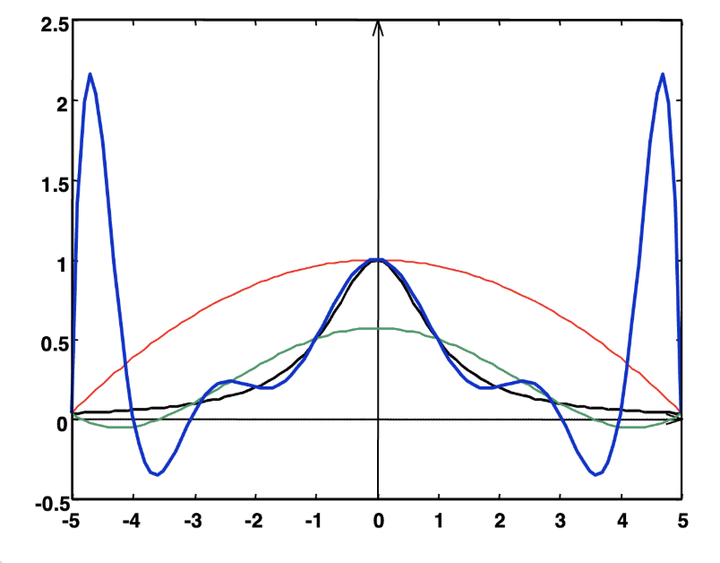
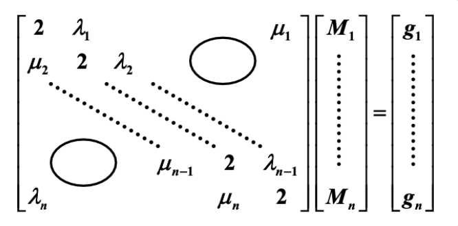

# Chapter 3: Interpolation and Polynomial Approximation
如果函数 $y = f(x)$ 的计算过于复杂，一种近似求解的办法是：首先在一组点序列 $x_0, \dots, x_n$ 上获取一组函数值 $y_0 = f(x_0), \dots, y_n = f(x_n)$，然后根据这些值构造一个相对简单的近似函数 $g(x) \approx f(x)$。

如果 $g(x)$ 满足 $\forall\ i = 0, \dots, n, g(x_i) = f(x_i)$，我们称 $g(x)$ 为 $f(x)$ 的**插值函数**(interpolating function),最常见的插值函数形式是**代数多项式**(algebraic polynomials)

## 3.1 Interpolation and the Lagrange Polynomial
> 找到 $n$ 阶多项式 $P_n(x) = a_0 + a_1 x + \dots + a_n x^n$，使得 $\forall\ i = 0, \dots, n, P_n(x_i) = y_i$ (对任何 $i \ne j$，必须满足 $x_i \ne x_j$)

当 $n = 1$ 时：给定 $x_0, x_1, y_0, y_1$，找到 $P_1(x) = a_0 + a_1 x$，使得 $P_1(x_0) = y_0, P_1(x_1) = y_1$
- 此时 $P_1(x)$ 是一个经过给定两点 $(x_0, y_0), (x_1, y_1)$ 的**线函数**(line function)，即：
$$
\begin{align}
P_1(x) & = y_0 + \dfrac{y_1 - y_0}{x_1 - x_0}(x - x_0) \notag \\
& = \underbrace{\Big(\dfrac{x - x_1}{x_0 - x_1}\Big)}_{\textcolor{red}{L_{1, 0}}(x)} y_0 + \underbrace{\Big(\dfrac{x - x_0}{x_1 - x_0}\Big)}_{\textcolor{red}{L_{1, 1}}(x)} y_1 = \sum\limits_{i=0}^1 \textcolor{red}{L_{1, i}}(x)y_i \notag
\end{align}
$$
标红的项被称为**拉格朗日基**(Lagrange Basis)，满足：$L_{1, i}(x_j) = \delta_{ij} = \begin{cases}1 & \text{if } i = j \\ 0 & \text{if } i \ne j\end{cases}$（称为 **Kronecker 符号**）

---
当 $n \ge 1$ 时：寻找 $L_{n, i}(x)\ (i = 0, \dots, n)$，使得 $L_{n, i} (x_j) = \delta_{ij}$；然后令 $P_n(x) = \sum\limits_{i=0}^n L_{n, i}(x) y_i$，因此 $P_n(x_i) = y_i$

每个 $L_{n, i}$ 都有 $n$ 个根 $x_0 \dots \widehat{x_i} \dots x_n$，可得：
$$
L_{n, i}(x) = C_i (x - x_0) \dots (\widehat{x - x_i}) \dots (x - x_n) = C_i \prod\limits_{\substack{j \ne i \\ j = 0}}^n (x - x_j)
$$
当 $L_{n, i}(x_i) = 1$ 时，$C_i = \prod\limits_{j \ne i} \dfrac{1}{x_i - x_j}$
$$
L_{n, i}(x) = \prod\limits_{\substack{j \ne i \\ j = 0}}^n \dfrac{(x - x_j)}{(x_i - x_j)} \Rightarrow P_n(x) = \sum\limits_{i=0}^n L_{n, i}(x) y_i
$$
这里的 $P_n(x)$ 就是**n 阶拉格朗日插值多项式**(n-th Lagrange interpolating polynomial)。

> [!theorem] 定理
> 如果 $x_0, x_1, \dots, x_n$ 是 $n + 1$ 个不同的数，且用函数 $f$ 得到这 $n + 1$ 个数对应的函数值，那么最终得到的 n 阶多项式就是**唯一的**（和具体的构造方法无关）
>> [!proof] 证明
>> （反证法）如果不是唯一的，那么存在两个多项式 $P_n(x)$ 和 $Q_n(x)$，它们都满足插值条件。可以得到一个多项式 $D(x) = P_n(x) - Q_n(x)$，阶数 $\le n$。但 $D(x)$ 有 $n + 1$ 个不同的根 $x_0, x_1, \dots, x_n$，这和阶数条件矛盾。因此假设不成立。

---
分析**余项**(remainder)
- 假如 $a \le x_0 < x_1 < \dots < x_n \le b$ 且 $f \in C^{n+1} [a, b]$。考虑截断误差 $R_n(x) = f(x) - P_n(x)$

> [!theorem] 罗尔定理
> 如果 $\varphi(x)$ 足够平滑，且 $\varphi(x_0) = \varphi(x_1) = 0$，那么 $\exists \xi \in (x_0, x_1)$，使得 $\varphi'(\xi) = 0$。
> 
>   一般来说，如果 $\varphi(x_0) = \varphi(x_1) = \varphi(x_2) = 0$，那么 $\exists \xi_0 \in (x_0, x_1), \xi_1 \in (x_1, x_2)$，使得 $\varphi'(\xi_0) = \varphi'(\xi_1) = 0$，那么 $\exists \xi \in (\xi_0, \xi_1)$，使得 $\varphi''(\xi) = 0$
> 
>   同理，$\varphi(x_0) = \dots = \varphi(x_n) = 0 \Rightarrow \exists \xi \in (a, b)$，使得 $\xi^{(n)}(\xi) = 0$

$R_n(x)$ 至少有 $n + 1$ 个根 $\Rightarrow R_n(x) = K(x) \prod\limits_{i=0}^n (x - x_i)$ 
接下来计算 $K (x$):
1. 对任意一个 $x \ne x_i\ (i = 0, \dots, n)$，引入修正函数为 $g(t)$, $t \in [a, b]$：
$$
g(t) = R_n(t) - K(x) \prod\limits_{i=0}^n (t - x_i)
$$
2. $g(x)$ 有 $n + 2$ 个不同的根 $x_0, \dots, x_n, x\ \Rightarrow g^{(n+1)}(\xi_x) = 0, \xi_x \in (a, b)$
$$
\begin{align}
& f^{(n+1)}(\xi_x) - \cancel{P_n^{(n+1)}(\xi_x)} - K(x)(n+1)! = R_n^{(n+1)}(\xi_x) - K(x)(n+1)! \notag \\
& \Rightarrow K(x) = \dfrac{f^{(n+1)}(\xi_x)}{(n+1)!} \notag
\end{align}
$$
因此 $R(x) = \dfrac{f^{(n+1)}(\xi_x)}{(n+1)!} \prod\limits_{i=0}^n (x - x_i)$

> [!note] 注
> - 大多数情况下 $\xi_x$ 无法确定，因此会计算 $f^{(n+1)}$ 的上界, 即一个估计值 $M_{n+1}$，满足 $\forall\ x \in (a, b),\ |f^{(n+1)}(x)| \le M_{n+1}$，并且取 $\dfrac{M_{n+1}}{(n+1)!} \prod\limits_{i=0}^n |x - x_i|$ 为总误差的上界。
>  - 对于任意阶数 $\le n$ 的多项式函数 $f$，插值多项式是精确的，因为 $f^{(n+1)}(x) \equiv 0$

### Neville's Method
> [!bug]
> 如果当前拉格朗日多项式的精度不够，则需要更多的插值点。但这样需要从头开始计算拉格朗日基；而 Neville 法能利用之前算好的插值多项式继续计算，无需重复计算。

> [!definition] 定义
>  $f$ 是关于 $x_0, x_1, \dots, x_n$ 的函数，并假设 $m_1, \dots, m_k$ 是 $k$ 个不同的整数且满足 $\forall i, 0 \le m_i \le n$。拉格朗日多项式在 $k$ 个点 $x_{m_1}, \dots, x_{m_k}$ 上与 $f(x)$ 具有相同值时，记作 $P_{m_1, \dots, m_k}(x)$

> [!theorem] 定理
> 令 $f$ 是关于 $x_0, x_1, \dots, x_k$ 的函数，并令 $x_i, x_j$ 为其中两个不相等的数，那么：
> $$    P(x) = \dfrac{(x - x_j)P_{0, 1, \dots, j-1, j+1, \dots, k}(x) - (x - x_i)P_{0, 1, \dots, i-1, i+1, \dots, k}(x)}{x_i - x_j} $$
> 描述了在 $k+1$ 个点 $x_0, x_1, \dots, x_k$ 上向 $f$ 插值的 $k$ 次拉格朗日多项式。
> > [! proof] 证明
> > - 对任意 $0 \le r \le k$ 且 $r \ne i \text{ and } j$，两个在分子上插值多项式等于 $f(x_r)$，因此 $P(x_r) = f(x_r)$
>>  - 第一个在分子上的多项式等于 $f(x_i)$，且第二项为0，所以 $P(x_i) = f(x_i)$。同理，$P(x_j) = f(x_j)$
>>  - 因此，在 $k+1$ 个点 $x_0, x_1, \dots, x_k$ 上向 $f$ 插值的第 $k$ 个拉格朗日多项式是唯一的

上述定理表明插值多项式可以**递归**生成，如下表所示：
$$
\begin{matrix}
x_0 & P_0 & & & & \\
x_1 & P_1 & P_{0, 1} & & & \\
x_2 & P_2 & P_{1, 2} & P_{0, 1, 2} & & \\
x_3 & P_3 & P_{2, 3} & P_{1, 2, 3} & P_{0, 1, 2, 3} \\
x_4 & P_4 & P_{3, 4} & P_{2, 3, 4} & P_{1, 2, 3, 4} & P_{0, 1, 2, 3, 4}
\end{matrix}
$$
上述过程被称为 ==Neville 法==
- 用新的记号 $Q_{i, j}(x)\ (0 \le j \le i)$ 来表示阶数为 $j$ 的，在 $(j+1)$ 个数 $x_{i-j}, x_{i-j+1}, \dots, x_{i-1}, x_i$ 上的插值多项式，即：$Q_{i, j} = P_{i-j, i-j+1, \dots, i-1, i}$。那么上面的表格就可以转化为：
$$
\begin{matrix}
x_0 & Q_{0, 0} & & & & \\
x_1 & Q_{1, 0} & Q_{1, 1} & & & \\
x_2 & Q_{2, 0} & Q_{2, 1} & Q_{2, 2} & & \\
x_3 & Q_{3, 0} & Q_{3, 1} & Q_{3, 2} & Q_{3, 3} \\
x_4 & Q_{4, 0} & Q_{4, 1} & Q_{4, 2} & Q_{4, 3} & Q_{4, 4}
\end{matrix}
$$
则递推公式可以转化为：
$$
Q_{i, j}(x) = \dfrac{(x - x_{i - j})Q_{i, j-1}(x) - (x - x_i)Q_{i-1, j-1}(x)}{x_i - x_{i - j}}
$$
观察发现，求表格中某一项的值时，会用到其**左侧**和**左上角**的两个项

> [!code] 算法：Neville 迭代插值
> 求解对于数 $x$，在 $n+1$ 个不同的数 $x_0, \dots, x_n$ 上的函数 $f$ 的插值多项式 $P$。
> 
>    - 输入：数 $x_0, x_1, \dots, x_n$ 和值 $f(x_0), f(x_1), \dots, f(x_n)$
> 	   - 分别作为 $Q$ 的第1列 $Q_{0, 0}, Q_{1, 0}, \dots, Q_{n, 0}$ 上的值
>    - 输出：表 $Q$，其中 $P(x) = Q_{n, n}$
> 
>    ```c
>    Step 1  for i = 1, 2, ..., n:
>                for j = 1, 2, ..., i:
>                  set Q[i][j] = ((x - x[i-j]) * Q[i][j-1] - (x - x[i]) * Q[i-1][j-1]) / (x[i] - x[i-j]);
>    Step 2  Output(Q);
>            STOP;
>    ```
> 

---

## 3.2 Divided Difference
- **$1$ 阶差商**：$f[x_i, x_j] = \dfrac{f(x_i) - f(x_j)}{x_i - x_j} (i \ne j, x_i \ne x_j)$
- **$2$ 阶差商**：$f[x_i, x_j, x_k] = \dfrac{f[x_i, x_j] - f[x_j, x_k]}{x_i - x_k} (i \ne k, x_i \ne x_k)$
- **$k+1$阶差商**：
$$
    \begin{align}
    f[x_0, \dots, x_{k+1}] & = \dfrac{f[\textcolor{cornflowerblue}{x_0}, x_1, \dots, x_k] - f[x_1, \dots, x_k, \textcolor{cornflowerblue}{x_{k+1}}]}{\textcolor{cornflowerblue}{x_0 - x_{k+1}}} \notag \\
    & = \dfrac{f[x_0, \dots, x_{k-1}, \textcolor{cornflowerblue}{x_k}] - f[x_0, \dots, x_{k-1}, \textcolor{cornflowerblue}{x_{k+1}}]}{\textcolor{cornflowerblue}{x_k - x_{k+1}}} \notag
    \end{align}
    $$
差商的**对称性**：无论怎么排列节点 $x_0,x_1,\dots,x_k$ ​，结果不变

**差商的显式表达式**：
$$f[x_0, \dots, x_k] = \sum\limits_{i=0}^k \dfrac{f(x_i)}{\omega_{k+1}' (x_i)}$$
 - 其中 $\omega_{k+1}(x) = \prod\limits_{i=0}^k (x - x_i)$，$\omega_{k+1}'(x_i) = \prod\limits_{\substack{j = 0 \\ j \ne i}}^k (x_i - x_j)$
 - **由于右边只涉及所有节点和函数值，且是对称求和，因此差商与节点顺序无关**
### 1. Newton's Interpolation
目标：得到 $N_n(x) = a_0 + a_1(x - x_0) + a_2(x - x_0)(x - x_1) + \dots + a_n(x - x_0) \dots (x - x_{n-1})$

将1阶差商、2阶差商、...、$k+1$阶差商展开，得到：
$$
\begin{cases}
f(x) = f(x_0) + (x - x_0)f[x, x_0] & (1)\\
f[x, x_0] = f[x_0, x_1] + (x - x_1)f[x, x_0, x_1] & (2)\\
\dots\ \dots\ \dots\\
f[x, x_0, \dots, x_{n-1}] = f[x_0, \dots, x_n] + (x - x_n) f[x, x_0, \dots, x_n] & (n-1)
\end{cases}
$$
计算 $(1) + (x - x_0) \times (2) + \dots + (x - x_0) \dots (x - x_{n-1}) \times (n-1)$，得到：
$$
\begin{align}
f(x) = & \textcolor{red}{f(x_0) + f[x_0, x_1](x - x_0) + f[x_0, x_1, x_2](x - x_0)(x - x_1) + \dots} \notag \\
& \textcolor{red}{+ f[x_0, \dots, x_n](x - x_0) \dots (x - x_{n-1})} \notag \\
& \textcolor{green}{+ f[x, x_0, \dots, x_n](x - x_0) \dots (x - x_{n-1})(x - x_n)} \notag
\end{align}
$$
其中红色部分即为 $N_n(x)$，被称为**差商型 Newton 插值多项式**(Newton's Interpolatory Divided-Difference formula)，绿色部分是 $R_n(x)$，因此 $a_i = f[x_0, \dots, x_i]$

> [! code] 算法：牛顿插值差商公式
> 求得对于数 $x$，在 $n+1$ 个不同的数 $x_0, \dots, x_n$ 上的函数 $f$ 的插值多项式 $P$ 的差商系数。
> 
>   - 输入：数 $x_0, x_1, \dots, x_n$；值 $f(x_0), f(x_1), \dots, f(x_n)$，分别记作 $F_{0, 0}, F_{1, 0}, \dots, F_{n,0}$。
>   - 输出：数 $F_{0, 0}, F_{1, 1}, F_{n, n}$，其中 $P(x) = \sum\limits_{i=0}^n F_{i, i} \prod_{j=0}^{i-1} (x - x_j)$
> 
>   ```c
>   Step 1  for i = 1, 2, ..., n:
>             for j = 1, 2, ..., i:
>                 set F[i][j] = (F[i][j-1] - F[i-1][j-1]) / (x[i] - x[i-j]);
>    Step 2  Output(F[0][0], F[1][1], ..., F[n][n]);  // F[i][i] is f[x[0], x[1], ..., x[i]]
>           STOP;
>    ```

> [!note]  注
> - 因为第 n 个插值多项式是唯一的，所以 $N_n(x) \equiv P_n(x)$
> - 它们必须有相同的截断误差，即：
> 
>     $$
>     \begin{align}
>     & f[x, x_0, \dots, x_n] \omega_{k+1} (x) = \dfrac{f^{(n+1)}(\xi_x)}{(n+1)!} \omega_{k+1}(x) \notag \\
>     & \Rightarrow f[x_0, \dots, x_k] = \dfrac{f^{(k)}(\xi)}{k!}, \xi \in (x_{\text{min}}, x_{\text{max}}) \notag
>     \end{align}
>     $$
> 
> - 牛顿插值法的求解过程和 Neville 法类似：
> 
>     $$
>     \begin{matrix}
>     f(x_0) & & & & & \notag \\
>     f(x_1) & f[x_0, x_1] & & & & \notag \\
>     f(x_2) & f[x_1, x_2] & f[x_0, x_1, x_2] & & & \notag \\
>     \dots & \dots & \dots & & & \notag \\
>     f(x_{n-1}) & \dots & \dots & & & \notag \\
>     f(x_n) & f[x_{n-1}, x_n] & f[x_{n-2}, x_{n-1}, x_n] & & f[x_0, \dots, x_n] \notag \\
>     f(x_{n+1}) & f[x_n, x_{n+1}] & f[x_{n-1}, x_n ,x_{n+1}] & \dots & f[x_1, \dots, x_{n+1}] & f[x_0, \dots, x_{n+1}] \notag 
>     \end{matrix}
>     $$
> 

### 2. Formulae with Equal Spacing
如果每个点都连续等步长排列，记步长为 $h$, 则 $x_i = x_0 + ih\ (i = 0, \dots, n)$，那么：
- **前向差分**(forward difference)：$$\begin{align}\Delta f_i &= f_{i+1} - f_i\\  \Delta^2f_i&=\Delta f_{i+1}-\Delta f_i \\ &\dots \\ \Delta^k f_i  &= \Delta^{k-1} f_{i+1} - \Delta^{k-1} f_i\end{align}$$**后向差分**(backward difference): $$\begin{align}\nabla f_i &= f_{i} - f_{i-1}\\  \nabla^2f_i&=\nabla f_{i}-\nabla f_{i-1} \\ &\dots \\ \nabla^k f_i  &= \nabla^{k-1} f_{i} - \nabla^{k-1} f_{i-1}\end{align}$$
- **中心差分**(centered difference)：$$\delta^k f_i = \delta^{k-1} f_{i+\frac{1}{2}} - \delta^{k-1} f_{i - \frac{1}{2}}$$其中 $$f_{i \pm \frac{1}{2}} = f(x_i \pm \dfrac{h}{2})$$
### 3. Some Important Properties
- 如果 $f(x)$ 是一个 $m$ 阶多项式，那么 $\Delta^k f(x)\ (0 \le k \le m)$ 是一个 $m - k$ 阶多项式且 $\Delta^k f(x) = 0\ (k > m)$
- 差值还能从以下函数中得到：
    - $\Delta^n f_k = \sum\limits_{j=0}^n (-1)^j \left( \begin{array}{cccc}n \\ j\end{array}\right) f_{n+k-j}$
    - $\nabla^n f_k = \sum\limits_{j=0}^n (-1)^{n-j} \left( \begin{array}{cccc}n \\ j\end{array}\right) f_{k+j-n}$
- 反之亦然：$f_{n+k} = \sum\limits_{j=0}^n \left( \begin{array}{cccc}n \\ j\end{array}\right) \Delta^j f_k$
- $f[x_0, \dots, x_k] = \dfrac{\Delta^k f_0}{k! h^k}, f[x_n, x_{n-1}, \dots, x_{n-k}] = \dfrac{\nabla^k f_n}{k!h^k}$。从 $R_n$ 可以得到：$f^{(k)}(\xi) = \dfrac{\Delta^k f_0}{h^k}$

**牛顿前向差公式**(Newton forward-difference formula)：
- 令 $x_t = x_0 + th$，那么容易得出 $f[x_0, \dots, x_k] = \dfrac{\Delta^k f_0}{k! h^k}$，
- 因此可以计算 $P_n$：
$$
        \begin{align}
        P_n(x_t)  &= P_n(x_0 + th) \\&=f[x_0]+f[x_0,x_1]th+\dots f[x_0,x_1,\dots,x_n]t(t-1)\dots(t-n+1)h^n\\
        &=\sum\limits_{k=0}^n\left( \begin{array}{cccc}t \\ k\end{array}\right)k!h^kf[x_0,x_1,\dots,x_k]
        \\&= \sum\limits_{k=0}^n \left( \begin{array}{cccc}t \\ k\end{array}\right) \Delta^k f(x_0), \notag  \notag \\
        R_n(x_t) & = \dfrac{f^{(n+1)} (\xi)}{(n+1)!} t(t-1) \dots (t-n)h^{n+1}, \xi \in (x_0, x_n) \notag
        \end{align}
$$

**牛顿后向差公式**(Newton backward-difference formula)：
- 重排插值节点，有 $P_n(x) = f(x_n) + f[x_n, x_{n-1}](x - x_n) + \dots + f[x_n, \dots, x_0](x - x_n) \dots (x - x_1)$
- 令 $x_t = x_n + th$，易得 $f[x_n, x_{n-1}, \dots, x_{n-k}] = \dfrac{\nabla^k f_n}{k!h^k}$， 
- 因此可以计算 $P_n$： $$
        \begin{align}
        P_n(x_t) & = P_n(x_n + th) 
        \\&=f[x_n]+thf[x_n,x_{n-1}]+t(t+1)h^2f[x_n,x_{n-1},x_{n-2}]+\dots+t(t+1)\dots(t+n-1)h^n f[x_n,\dots,x_0]
        \\&=\sum\limits_{k=0}^n (-1)^k \left( \begin{array}{cccc}-t \\ k\end{array}\right) k!h^k f[x_n,\dots,x_0] \notag 
        \\&= \sum\limits_{k=0}^n \underbrace{(-1)^k \left( \begin{array}{cccc}-t \\ k\end{array}\right)}_{C_{t+k-1}^k} \nabla^k f(x_n) \notag \\
        \end{align}
        $$
---
## 3.3 Hermite Interpolation
> [!note] 密切多项式
> 令 $x_0, x_1, \dots, x_n$ 为在 $[a, b]$ 上的 $n+1$ 个不同的数，$m_0,m_1,\dots,m_n$ 是 $n+1$ 个非负整数，假设 $f \in C^m[a, b]$，其中 $m = \max\limits_{0 \le i \le n}m_i$，那么逼近 $f$ 的**密切多项式**(osculating polynomial) $P_n(x)$ 为满足以下条件的阶数最小的多项式 ：
> $$\dfrac{d^k }{dx^k} P_n(x_i)= \dfrac{d^k }{dx^k}f(x_i),\ \text{for each } i = 0, \dots, n \text{ and } k = 0, \dots, m $$
> - 相比前面的插值多项式，密切多项式还要求**k阶导数相等**，因而得到了更准确、更光滑的插值曲线

目标：找到一个**密切多项式** $P(x)$，使得 $\forall i = 0, 1, \dots, n, P(x_i) = f(x_i), P'(x_i) = f'(x_i), \dots, P^{(m_i)}(x_i) = f^{(m_i)}(x_i)$。

> [!note] 注
> - 给定 $N$ 个条件（即有 $N$ 个方程），$N - 1$ 阶多项式就能确定下来
> - 与 $f$ 以及所有在**一个点** $x_0$ 上的 $\le m_0$ 阶的导数吻合的密切多项式是**泰勒多项式**：
> $$P(x) = f(x_0) + f'(x_0)(x - x_0) + \dots + \dfrac{f^{(m_0)}(x_0)}{m_0!}(x - x_0)^{m_0}      $$
> 且余项 $R(x) = f(x) - \varphi(x) = \dfrac{f^{(m_0 + 1)}(\xi)}{(m_0 + 1)!}(x - x_0)^{(m_0 + 1)}$
> - 当 $\forall i = 0, 1, \dots, n,\ m_i = 1$ 时，此时的多项式为**Hermite多项式**，也就是说，多项式 $P(n)$ 和它的一阶导数 $P'(n)$ 在 $x_i$ 处分别与 $f$ 和 $f'$ 相同。

一般情况下，给定 $x_0, \dots, x_n; y_0, \dots, y_n$ 以及 $y_0', \dots, y_n'$，Hermite 多项式 $H_{2n+1}(x)$ 满足对于所有的 $i$，$H_{2n+1}(x_i) = y_i$ 且 $H_{2n+1}'(x_i) = y_i'$

> [!note] 用待定系数法求解 Hermite 多项式
> 令 $H_{2n+1}(x) = \sum\limits_{i=0}^n y_i h_i(x) + \sum\limits_{i=0}^n y_i' \widehat{h_i}(x)$，其中 $h_i(x_j) = \delta_{ij}, h_i'(x_j) = 0, \widehat{h_i}(x_j) = 0, \widehat{h_i}'(x_j) = \delta_{ij}$
> - $h_i(x)$：对应**函数值** $y_i$
> 	- $x_0, \dots, \widehat{x_i}, \dots, x_n$ 是重数为 2 的根 $\Rightarrow\ h_i(x) = (A_i x + B_i) L_{n, i}^2(x)$
> 	- $A_i, B_i$ 能通过 $h_i(x_i) = 1, h_i'(x_i) = 0$ 求解
> 	- $h_i(x) = [1 - 2L_{n, i}'(x_i)(x - x_i)]L_{n, i}^2(x)$
> - $\widehat{h_i}(x)$：对应**导数值** $y_i'$
> 	- 除了 $x_i$ 外，所有的根 $x_0, \dots, x_n$ 的重数均为 2，得到：
> 	- $\begin{cases}\widehat{h_i}(x) = C_i(x - x_i) L_{n, i}^2(x) \\ \widehat{h_i}'(x_i) = 1 \Rightarrow C_i = 1\end{cases} \quad \Rightarrow \quad \widehat{h_i}(x) = (x - x_i) L_{n, i}^2(x)$
> 	
> 如果 $a = x_0 < x_1 < \dots < x_n = b, f \in C^{2n}[a, b]$，那么 $R_n(x) = \dfrac{f^{(2n+2)}(\xi_x)}{(2n+2)!}\Big[\prod\limits_{i=0}^n (x - x_i) \Big]^2$ 

> [!example]
> 假设 $x_0\neq x_1 \neq x_2$，给定 $f(x_0),f(x_1),f(x_2),f'(x_1)$，找到多项式使得 $P(x_i)=f(x_i)$，$P'(x_1)=f'(x_1)$ 并分析误差。
> 
> - 首先，其次数为3次，猜想其形式为
> $$P(x)=\sum\limits_{i=0}^2f(x_i)h_i(x)+f'(x_1)\hat{h}_1(x)$$
> 其中$h_i(x_j)=\delta_i(x_j),h'_i(x_1)=0,\hat{h}_1(x_i)=0,\hat{h}'_1(x_1)=1$。
> 
> 根据猜想构造出 $h_i(x)$ 和 $\hat{h}_1(x)$
> 
> - 首先，可以用拉格朗日同样的方法构造出三次多项式 $h_i(x)$，使得 $h_i(x_j)=\delta_i(x_j)$，$h'_i(x_1)=0$，$i=0,1,2$。
> 
>   对于 $h_0(x)$，有根 $x_1,x_2$，且因为 $h'_0(x_1)=0$ 所以 $x_1$ 是 $h_0(x)$ 的二重根，所以其形式为
> $$h_0(x)=C_0(x-x_1)^2(x-x_2)$$
>   又因为 $h'_0(x_0)=1$，所以
> $$h_0(x)=\frac{(x-x_1)^2(x-x_2)}{(x_0-x_1)^2(x_0-x_2)}$$
> - 类似地，可以得到
> $$h_2(x)=\frac{(x-x_0)(x-x_1)^2}{(x_2-x_0)(x_2-x_1)^2}$$
> 对于$h_1(x)$，有根$x_0,x_2$，都是单根。所以其形式为
> $$h_1(x)=(Ax+B)(x-x_0)(x-x_2)$$
> 通过计算 $h_1(x_1)=1$，$h'_1(x_1)=0$，可以得到 $A$ 和 $B$ 的值。此处略。
> 
> - 然后构造 $\hat{h}_1(x)$，使得 $\hat{h}_1(x_i)=0$，$\hat{h}'_1(x_1)=1$。对于 $\hat{h}_1(x)$，有根 $x_0,x_1,x_2$，所以
> $$\hat{h}_1(x)=C(x-x_0)(x-x_1)(x-x_2)$$
> - 又因为 $\hat{h}'_1(x_1)=1$，所以可以通过计算得到 $C$ 的值。此处略。

---

## 3.4 Cubic Spline Interpolation

> [!example]
> 考虑关于函数 $f(x) = \dfrac{1}{1 + x^2}$ 在点 $x_i = -5 + \dfrac{10}{n}i \in [-5, 5] \ (i = 0, \dots, n)$ 的拉格朗日多项式 $P_n(x)$
> <div style="text-align: center"></div>
> 
> 无法用多项式（这些彩色曲线）准确地近似函数（黑色曲线）。增加多项式的阶数不一定能保证更好的近似结果，因为高阶多项式更容易发生**振荡**(oscillation)，反而会加大误差（即**龙格现象(Runge's phenomenon)**）。


> [!info] 一些尝试
> **按段线性插值**(piecewise linear interpolation)
> 思路：在每个子区间 $[x_i, x_{i+1}]$ 上，通过线性多项式近似表示 $f(x)$，即：
> $$f(x) \approx P_1(x) = \dfrac{x - x_{i+1}}{x_i - x_{i+1}}y_i + \dfrac{x - x_i}{x_{i+1} - x_i} y_{i+1} \text{ for } x \in [x_i, x_{i+1}]$$
> 令 $h = \max |x_{i+1} - x_i|$，那么 $P_1^h(x) \xrightarrow{\text{uniform}} f(x), h \rightarrow 0$
>> [!bug] 缺点：不够平滑
>
> 
> **埃尔米特按段多项式**(Hermite Piecewise Polynomials)
> 思路：给定 $x_0, \dots, x_n;\ y_0, \dots, y_n;\ y_0', \dots, y_n'$，在区间 $[x_i, x_{i+1}]$ 的两个端点上构造一个关于 $y, y'$ 的3阶埃尔米特多项式
> 
>>[!bug] 缺点：计算导数不太容易

这里采用==三次样条插值(cubic spline interpolation)==

> [!definition] 定义
> 给定一个定义在 $[a, b]$ 上的函数 $f$，以及一组节点 $a = x_0 < x_1 \dots < x_n = b$，关于 $f$ 的**三次样条插值器**(cubic spline interpolant) $S$ 是一个满足下面条件的函数：
> <div style="text-align: center"></div>
> 
> $S(x)$ 是一个分段函数，满足以下条件：
> 1. $S(x)$ 在每个子区间 $[x_i, x_{i+1}]$ 上是一个三次多项式 $S_i(x)$（$i = 0, 1, \dots, n - 1$）
> 2. $S(x_i) = f(x_i),\ i = 0, 1, \dots, n$
> 3. $S_{i+1}(x_{i+1}) = S_i(x_{i+1}),\ i = 0, 1, \dots, n - 2$
> 4. $S_{i+1}'(x_{i+1}) = S_i'(x_{i+1}),\ i = 0, 1, \dots, n - 2$
> 5. $S_{i+1}''(x_{i+1}) = S_i''(x_{i+1}),\ i = 0, 1, \dots, n - 2$
> 6. 下列的边界条件之一成立：
> 	1. $S''(x_0)=s''(x_n)=0$，称为**自由或自然边界(free or natural boundary)**
> 	2. $S'(x_0)=f'(x_0),S'(x_n)=f'(x_n)$，称为**固支边界(clamped boundary)**
> 	3. 其他边界条件（上面两个条件其实已经足以满足目的了）

### Method of Bending Moment
> 一种构造三次样条插值的方法，此处 $M$ 被称为**弯矩**(bending moment)

令 $h_j = x_j - x_{j-1}$ 且在 $x \in [x_{j-1}, x_j]$ 上, $S(x) = S_j(x),S'(x)=S_j '(x),S''(x)=S_j ''(x)$
- 由于 $S(x)$ 是一个三次多项式，那么 $S_j''(x)$ 是一个一阶多项式，并能由 $f$ 上的2个节点值确定
假设 $S_j''(x_{j-1}) = M_{j-1}, S_j''(x_j) = M_j$，那么 $\forall x \in [x_{j-1}, x_j]$，有
$$S_j''(x) = M_{j-1} \dfrac{x_j - x}{h_j} + M_j \dfrac{x - x_{j-1}}{h_j}$$
对 $S_j''$ 做两次积分，可以得到：
- $S_j'(x) = -M_{j-1} \dfrac{(x_j - x)^2}{2h_j} + M_{j} \dfrac{(x - x_{j-1})^2}{2h_j} + A_j$
- $S_j(x) = M_{j-1} \dfrac{(x_j - x)^3}{6h_j} + M_{j} \dfrac{(x - x_{j-1})^3}{6h_j} + A_jx + B_j$

其中 $A_j, B_j$ 能通过方程 $S_j(x_{j-1}) = y_{j-1}, S_j(x_j) = y_j$ 求解，可以得到：
- $A_j = \dfrac{y_j - y_{j-1}}{h_j} - \dfrac{M_j - M_{j-1}}{6}h_j$
- $A_j x + B_j = (y_{j-1} - \dfrac{M_{j-1}}{6} h_j^2) \dfrac{x_j - x}{h_j} + (y_j - \dfrac{M_j}{6}h_j^2)\dfrac{x - x_{j-1}}{h_j}$

现在来求解 $M_j$：因为 $S'$ 在 $x_j$ 上是连续的，所以：
- $[x_{j-1}, x_j]$: $S_j'(x) = -M_{j-1} \dfrac{(x_j - x)^2}{2h_j} + M_j \dfrac{(x - x_{j-1})^2}{2h_j} + f[x_{j-1}, x_j] - \dfrac{M_j - M_{j-1}}{6}h_j$
- $[x_j, x_{j+1}]$: $S_{j+1}'(x) = -M_j \dfrac{(x_{j+1} - x)^2}{2h_{j+1}} + M_{j+1} \dfrac{(x - x_j)^2}{2h_{j+1}} + f[x_j, x_{j+1}] - \dfrac{M_{j+1} - M_j}{6}h_{j+1}$

根据 $S_j'(x_j) = S_{j+1}'(x_j)$，我们可以结合 $M_{j-1}, M_j, M_{j+1}$ 的系数：
定义 $\lambda_j = \dfrac{h_{j+1}}{h_j + h_{j+1}}, \mu_j = 1 - \lambda_j, g_j = \dfrac{6}{h_j + h_{j+1}} (f[x_j, x_{j+1}] - f[x_{j-1}, x_j])$，可以得到：
$$\mu_j M_{j-1} + 2M_j + \lambda_j M_{j+1} = g_j\ (1 \le j \le n - 1)$$
 下图就是这个递推式的矩阵表示（一个三对角矩阵）
<div style="text-align: center">
    
</div>
也就是说，我们有 $n+1$ 个未知数，但只有 $n-1$ 个方程，所以还需要 2 个额外的边界条件。

- **固定边界**(clamped boundary)：$S'(a) = y_0', S'(b) = y_n'$
    - $[a, x_1]$: $S_1'(x) = -M_0 \dfrac{(x_1 - x)^2}{2h_1} + M_1 \dfrac{(x - a)^2}{2h_1} + f[x_0, x_1] - \dfrac{M_1 - M_0}{6}h_1$
    - 在 $[x_{n-1}, b]$ 上 $S_n'$ 也是类似的：$\begin{cases}2M_0 + M_1 = \dfrac{6}{h_1} (f[x_0, x_1] - y_0') = g_0 \\ M_{n-1} + 2M_n = \dfrac{6}{h_n} (y_n' - f[x_{n-1}, x_n]) = g_n\end{cases}$

- **自由边界**(free boundary)：$S''(a) = y_0'' = M_0, S''(b) = y_n'' = M_n$，且 $M_0 = M_n = 0$ 时
    - 那么 $\lambda_0 = 0, g_0 = 2y_0'';\ \mu_n = 0, g_n = 2y_n''$
    - 此时的样条称为**自然样条**(natural spline)

- **周期边界**(periodic boundary)：如果 $f$ 是周期函数，即 $y_n = y_0$ 且 $S'(a^+) = S'(b^-) \Rightarrow M_0 = M_n$

    <div style="text-align: center">
        
    </div>

> [!note] 注
> - 只要系数矩阵是严格对角占优的，那么三次样条能通过边界被**唯一**确定
> - 如果 $f \in C[a, b]$ 且 $\dfrac{\max h_i}{\min h_i} \le C < \infty$，那么当 $h_i \rightarrow 0$ 时，$S(x) \xrightarrow{\text{uniform}} f(x)$。也就是说，在保证不增加样条阶数的情况下，可通过增加节点个数来提升近似精度
> 

    
> [! code] 算法概述：三次样条插值法
> 1. 计算 $\mu_j, \lambda_j, g_j$
> 2. 求解 $M_j$
> 3. 找到包含 $x$ 的子区间，即找到相应的 $j$
> 4. 通过 $S_j(x)$ 得到 $f(x)$ 的近似值

    
