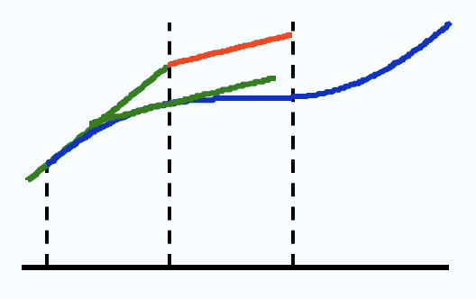
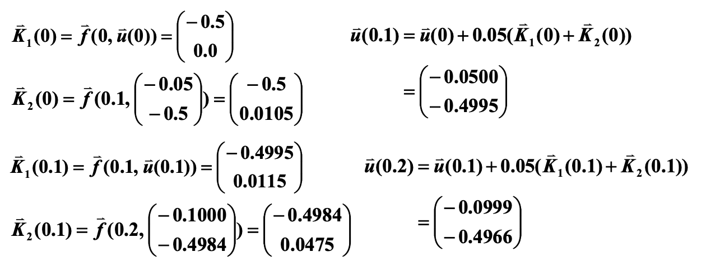
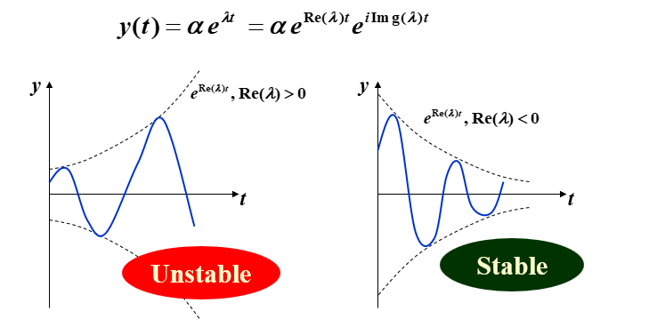
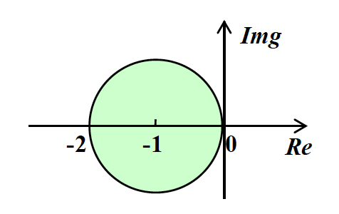

# Chapter 5: Initial-Value Problems for Ordinary Differential Equations
## 5.1 The Elementary Theory of Initial-Value Problems
> [!info]
> Initial-Value Problems for the $1^{\text{st}}$ order Ordinary Differential Equations
> $$ \begin{cases} \dfrac{dy}{dt} = f(t, y), & t \in [a, b] \\ y(a) = \alpha \end{cases} $$
> 在一组网格点 (mesh points) $a=t_0<t_1<⋯<t_n=b$ 上（通常是等间距的）计算 $y(t)$ 的近似值。也就是说，计算 $w_i \approx y(t_i)=y_i(i=1,\dots,n)$

**Definition**
对于函数 $f(t,y)$，若存在常数 $L>0$，满足：
$$∣f(t,y_1)−f(t,y_2)∣\leq L∣y_1−y_2∣$$
 我们称该函数满足在变量 $y\in D⊂R^2$ 上的 **Lipschitz 条件**

**Theorem**
假设 $D = \{(t, y)\ |\ a \le t \le b, -\infty < y < \infty\}$，且 $f(t, y)$ 在 $D$ 上连续。若 $f$ 满足在变量 $y \in D$ 上的 Lipschitz 条件，那么初值问题
$$
    y'(t) = f(t, y), a \le t \le b,  y(a) = \alpha
    $$
有**唯一解** $$y(t)，a \le t \le b$$
**Definition**
若初值问题
$$
    y'(t) = f(t, y), a \le t \le b, y(a) = \alpha
    $$
满足以下条件，我们称之为**适定性问题**(well-posed problem)：
1. 问题存在**唯一解** $y(t)$
2. $\forall \varepsilon > 0$，存在正常数 $k(\varepsilon)$，使得当 $|\varepsilon_0| < \varepsilon$，并且 $\delta(t)$ 在 $[a, b]$ 上连续且 $|\delta(t)| < \varepsilon$ 时，对于
$$
        z'(t) = f(t, z) + \delta(t), a \le t \le b, z(a) = \alpha + \varepsilon_0
        $$
上述式子称为**扰动问题** perturbed problem，存在唯一解 $z(t)$，满足 $|z(t) - y(t)| < k(\varepsilon) \cdot  \varepsilon\ (a \le t \le b)$

**Theorem**
假设 $D = \{(t, y)\ |\ a \le t \le b, -\infty < y < \infty\}$，且 $f(t, y)$ 在 $D$ 上连续。若 $f$ 满足在变量 $y \in D$ 上的 Lipschitz 条件，那么初值问题
$$
    y'(t) = f(t, y), a \le t \le b, y(a) = \alpha
    $$
具有**适定性**(well-posed)。

---
## 5.2 Euler's Method
令 $h$ 为步长，
$y'(t_0) \approx \dfrac{y(t_0 + h) - y(t_0)}{h}\ \Rightarrow\ y(t_1) \approx y(t_0) + hy'(t_0) = \alpha + hf(t_0, \alpha)$

**欧拉法**(Euler's method)的核心是<u>用切线近似曲线</u>，它通过**差分方程**(difference equations)来计算近似值：$\begin{cases}w_0 = \alpha \\ w_{i+1} = w_i + hf(t_i, w_i)\end{cases}\ (i = 0, \dots, n - 1)$

### Error Bound
> [!Theorem]
> 假设 $f$ 在 $D = \{(t, y)\ |\ a \le t \le b, -\infty < y < \infty \}$ 上是连续的，且满足 Lipschitz 条件（对应常数 $L$）；且存在常数 $M, \forall\ a \le t \le b$，满足 $|y''(t)| \le M$。
> 
> 令 $y(t)$ 为初值问题 $y'(t) = f(t, y), a \le t \le b, y(a) = \alpha$ 的唯一解，且 $w_0, w_1, \dots, w_n$ 为通过欧拉法（对于某些正整数 $n$）得到的近似值，那么：
> $$|y_i - w_i| \le \dfrac{hM}{2L}[e^{L(t_i - a)} - 1] \quad (i = 0, 1, \dots, n) $$

> [!note]
> $y''(t)$ 可在不知道 $y(t)$ 的情况下被计算出来：
> $$y''(t) = \dfrac{d}{dt}y'(t) = \dfrac{d}{dt}f(t, y(t)) = \dfrac{\partial}{\partial t}f(t, y(t)) + \dfrac{\partial}{\partial y}f(t, y(t)) \cdot f(t, y(t))$$

代入舍入误差后，差分方程为：$\begin{cases}w_0 = \alpha \textcolor{red}{+ \delta_0} \\ w_{i+1} = w_i + hf(t_i, w_i) \textcolor{red}{+ \delta_{i+1}}\end{cases}(i = 0, \dots, n - 1)$

**Theorem**
令 $y(t)$ 为初值问题 $y'(t) = f(t, y), a \le t \le b, y(a) = \alpha$ 的唯一解，且 $w_0, w_1, \dots, w_n$ 为使用上述差分方程得到的近似值。若 $|\delta_i| < \delta\ (i = 0, \dots, n)$，那么对每一个 $i$，有
$$
    |y_i - w_i| \le \dfrac{1}{L} \Big(\dfrac{hM}{2} + \dfrac{\delta}{h}\Big)[e^{L(t_i - a)} - 1] + |\delta_0|e^{L(t_i - a)}
    $$
其中 $h \ge \sqrt{2 \delta / M}$，所以随着 $h$ 的减小，误差会越来越小。

### Other Euler's Methods
- **隐式欧拉法**(implicit Euler's method)
	隐式公式不能直接求解，一般需要用欧拉显式公式得到初值，然后用欧拉隐式公式进行迭代求解。因此，隐式公式比显式公式计算复杂，但稳定性好。
    - $y'(t_0) \approx \dfrac{y(t_0) - y(t_0 - h)}{h}$ 
	    $\Rightarrow\ \textcolor{red}{y(t_1)} \approx y(t_0) + hy'(t_1) = \alpha + hf(t_1, \textcolor{red}{y(t_1)})$
    - 差分方程为 $\begin{cases}w_0 = \alpha \\ \textcolor{red}{w_{i+1}} = w_i + hf(t_{i+1}, \textcolor{red}{w_{i+1}})\end{cases} \quad(i = 0, \dots, n - 1)$
        - 由于方程左右两边都有 $w_{i+1}$，需要通过解方程得到 $w_{i+1}$，而无法像一般的欧拉法那样直接计算
	    - 通常以迭代形式求解 $w_{i+1}$，其初始值 $w_{0}$ 通过显式法给出
    - 局部截断误差: $\tau_{i+1} = \dfrac{y_{i+1} - w_{i+1}}{h} = -\dfrac{h}{2}y''(\xi_i) = O(h)$

- **梯形法**(trapezoidal method)
    - 差分方程为 $\begin{cases}w_0 = \alpha \\ \textcolor{red}{w_{i+1}} = w_i + \dfrac{h}{2}[f(t_i, w_i) + f(t_{i+1}, \textcolor{red}{w_{i+1}})]\end{cases} (i = 0, \dots, n - 1)$
    - 注：局部截断误差为 $O(h^2)$；但必须以迭代方式求解隐式方程

- **两步法**(double-step method)
	双步法相较于之前的方法，需要两个初始值，即 $w_0$ ​和 $w_1$，然后用这两个初始值来计算 $w_2$ ​，再用 $w_1$ ​和 $w_2$ ​来计算 $w_3$，以此类推。由于两步法用到了更多点的信息，因此能得到**更精确**的近似结果。
    - $y'(t_0) = \dfrac{1}{2h}[y(t_0 + h) - y(t_0 - h)] - \dfrac{h^2}{6}y^{(3)}(\xi_1)$ 
	    $\Rightarrow\ y(t_2) \approx y(t_0) + 2hf(t_1, y(t_1))$
    - 差分方程为 $\begin{cases}w_0 = \alpha \\ w_{i+1} = w_{i-1} + 2hf(t_i, w_i)\end{cases} \quad (i = 1, \dots, n - 1)$
	    - 若假设 $w_{i-1} = y_{i-1}, w_i = y_i$，那么局部截断误差为 $O(h^2)$

---
## 5.3 High Order Taylor Methods
> [!definition]
> 差分法 $w_0 = \alpha ;\quad w_{i+1} = w_i + h\varphi(t_i, w_i), \text{ for each }i = 0, \dots, n - 1$ 
> 具有以下**局部截断误差**(local truncation error)：
> $$\tau_{i+1}(h) = \dfrac{y_{i+1} - (y_i + h\varphi(t_i, y_i))}{h} = \dfrac{y_{i+1} - y_i}{h} - \varphi(t_i, y_i) \quad (i = 0, \dots, n - 1) $$
>> Note: 局部截断误差就是 $\dfrac{y_{i+1} - w_{i+1}}{h}$（基于假设 $w_i = y_i$）

欧拉法的局部截断误差：
$$
\begin{align}
\tau_{i+1} & = \dfrac{y_{i+1} - w_{i+1}}{h} = \dfrac{[y_i + hy'(t_i) + \frac{h^2}{2}y''(\xi_i)] - [y_i + hf(t_i, y_i)]}{h} \notag \\
& = \dfrac{h}{2} y''(\xi_i) = O(h) \notag
\end{align}
$$
- 其中 $y_{i+1}  = y (t_{i+1}) = y (t_i + h) = y (t_i) + y' (t_i) h + y'' (\xi_i) \dfrac{h^2}{2}$
欧拉法本质上是**泰勒展开式的1阶形式**，可通过 $n = 1$ 时泰勒展开式得到的欧拉法近似表示 $y(t)$

**高阶泰勒法公式**为：
$$
y_{i+1} = y_i + hf(t_i, y_i) + \dfrac{h^2}{2} f'(t_i, y_i) + \dots + \dfrac{h^n}{n!}f^{(n-1)}(t_i, y_i) + \dfrac{h^{(n+1)}}{(n+1)!}f^{(n)}(\xi_i, y(\xi_i))
$$
对于阶数为 $n$ 的泰勒法，其对应的差分方程为：
$$
\begin{cases}w_0 = \alpha \\ w_{i+1} = w_i + hT^{(n)}(t_i, w_i)\end{cases} \quad(i = 0, \dots, n - 1)
$$
其中 $T^{(n)}(t_i, w_i) = f(t_i, w_i) + \dfrac{h}{2}f'(t_i, w_i) + \dots + \dfrac{h^{n-1}}{n!} f^{(n-1)}(t_i, w_i)$
- 若 $y \in C^{n+1}[a, b]$，那么局部截断误差是 $O(h^n)$。

> [!question]
> 应用 $n = 10$ 的 3 阶泰勒法，解决初值问题 $y' = y - t^2 + 1, 0 \le t \le 2, y(0) = 0.5$
> >这里的 $n$ 是区间分段数，不是题目前面讲的阶数。
> 
>找到 $f$ 的前两个导数：
> - $f(t, y(t)) = y(t) - t^2 + 1$
> - $f'(t, y(t)) = y'(t) - 2t = y(t) - t^2 + 1 - 2t$
> - $f''(t, y(t)) = y'(t) - 2t - 2 = y(t) - t^2 - 2t - 1$
> 
> 得到：$$\begin{align}
> T^{(3)}(t_i, w_i) & = f(t_i, w_i) + \dfrac{h}{2} f'(t_i, w_i) + \dfrac{h^2}{6}f''(t_i, w_i) \notag \\
> & = \Big(1 + \dfrac{h}{2} + \dfrac{h^2}{6} \Big)(w_i - t_i^2 + 1) - \Big(1 + \dfrac{h}{3}\Big)ht_i - \dfrac{h^2}{3} \notag
> \end{align}$$
> 通过3阶泰勒法，得到差分方程：$\begin{cases}w_0 = 0.5 \\ w_{i+1} = w_i + h\Big[\Big(1 + \dfrac{h}{2} + \dfrac{h^2}{6}\Big)(w_i - t_i^2 + 1) - \Big(1 + \dfrac{h}{3}ht_i + \dfrac{h^2}{3}\Big)\Big]\end{cases}$
> 
> 因为 $n = 10$，那么 $h = 0.2, t_i = 0.2i, w_{i+1} = 1.22133w_i - 0.00855i^2 - 0.00853i + 0.21867$

---
## 5.4 Runge-Kutta Methods
**Runge-Kutta 法**是一种具有 Taylor 方法的高阶局部截断误差，而且无需计算 $f$ 的导数
> 思路：在单步法中，某个线段从 $(t_i, w_i)$ 出发，以某个斜率延伸至下一个点 $(t_{i+1}, w_{i+1})$。我们可以通过**找到更好的斜率**来改善结果

观察以下修改过的欧拉法：
$$
\begin{cases}
w_{i+1} = w_i + h\Big[ \dfrac{1}{2} K_1 + \dfrac{1}{2} K_2 \Big] \\
K_1 = f(t_i, w_i) \\
K_2 = f(t_i + h, w_i + hK_1)
\end{cases}
$$
- 斜率是否必须是 $K_1, K_2$ 的平均值？
- 步幅是否必须为 $h$？

将其进一步泛化（一般的平均值 -> 加权平均值）：
$$
\begin{cases}
w_{i+1} & = w_i + h[\textcolor{red}{\lambda_1} K_1 + \textcolor{red}{\lambda_2} K_2 ] \\
K_1 & = f(t_i, w_i) \\
K_2 & = f(t_i + \textcolor{red}{p}h, w_i + \textcolor{red}{p}hK_1)
\end{cases}
$$

要找到 $\lambda_1, \lambda_2, p$，使得该方法的局部阶段<u>误差的阶数为2</u>

1. 写出 $K_2$ 在 $(t_i, y_i)$ 上的泰勒展开式：$$
    \begin{align}
    K_2 & = f(t_i + ph, y_i + phK_1) \notag \\
    & = f(t_i, y_i) + phf_t(t_i, y_i) + phK_1f_y(t_i, y_i) + O(h^2) \notag \\
    & = y'(t_i) + phy''(t_i) + O(h^2) \notag 
    \end{align}
    $$其中$$
        y''(t)  = \dfrac{d}{dt}f(t, y) 
         = f_t(t, y) + f_y(t, y) \dfrac{dy}{dt} 
         = f_t(t, y) + f_y(t, y)f(t, y) 
        $$
2. 将 $K_2$ 代入到第一个式子中：$$
    \begin{align}
    w_{i+1} & = y_i + h\{\lambda_1 y'(t_i) + \lambda_2[y'(t_i) + phy''(t_i) + O(h^2)]\} \notag \\
    & = y_i + (\lambda_1 + \lambda_2) hy'(t_i) + \lambda_2 ph^2 y''(t_i) + O(h^3) \notag
    \end{align}
    $$
3. 找到 $\lambda_1, \lambda_2, p$，使得 $\tau_{i+1} = (y_{i+1} - w_{i+1}) / h = O(h^2)$
$$
\begin{cases}
w_{i+1} & = y_i + (\lambda_1 + \lambda_2) hy'(t_i) + \lambda_2 ph^2 y''(t_i) + O(h^3) \\
y_{i+1} & = y_i + hy'(t_i) + \dfrac{h^2}{2} y''(t_i) + O(h^3) 
\end{cases}
$$
比对上面两个方程，可以得到：
$$\lambda_1 + \lambda_2 = 1, \lambda_2 p = \dfrac{1}{2}$$
有无穷多个解，被称为**2阶龙格-库塔法**(Runge-Kutta method of order 2)

> [! note] 2阶 Runge-Kutta 法的多种形式
> - **中点法**(midpoint method)：将从二阶泰勒法中的 $T^{(2)}(t, y)$ 用 $f(t + h / 2, y + (h / 2)f(t, y))$ 替换得到的差分方程法。
>   $$
>        \begin{cases}
>        w_0 = \alpha \\
>        w_{i+1} = w_i + hf(t_i + \dfrac{h}{2}, w_i + \dfrac{h}{2}f(t_i, w_i))
>        \end{cases}
>        \quad (i = 0, \dots, N - 1)
>        $$
> - **改进欧拉法**(modified Euler method)：
> $$
>         \begin{cases}
>         w_0 = \alpha \\
>         w_{i+1} = w_i + \dfrac{h}{2}[f(t_i, w_i) + f(t_{i+1}, w_i + hf(t_i, w_i))]
>         \end{cases}
>         \quad (i = 0, \dots, N - 1)
>         $$
>  - **Heun 法**：
>    $$
>         \begin{cases}
>         w_0 = \alpha \\
>         w_{i+1} = w_i + \dfrac{h}{4}[f(t_i, w_i) + 3f(t_i + \dfrac{2}{3}h, w_i + \dfrac{2}{3}hf(t_i, w_i))]
>         \end{cases}
>         \quad (i = 0, \dots, N - 1)
>         $$

---
### 高阶 Runge-Kutta 法
$$
\begin{cases}
w_0=\alpha \\
w_{i+1} = y_i + h[\textcolor{red}{\lambda_1} K_1 + \textcolor{red}{\lambda_2} K_2 + \dots + \textcolor{red}{\lambda_m} K_m] \\
K_1 = f(t_i, w_i) \\
K_2 = f(t_i + \textcolor{red}{\alpha_2} h, w_i + \textcolor{red}{\beta_{21}} hK_1) \\
K_3 = f(t_i + \textcolor{red}{\alpha_3} h, w_i + \textcolor{red}{\beta_{31}} hK_1 + \textcolor{red}{\beta_{32}} hK_2) \\
\vdots \\
K_m = f(t_i + \textcolor{red}{\alpha_m} h, w_i + \textcolor{red}{\beta_{m1}} hK_1 + \textcolor{red}{\beta_{m2}} hK_2 + \dots + \textcolor{red}{\beta_{m, m-1}} hK_{m-1}) \\
\end{cases}
$$
最流行的是经典 **4 阶龙格-库塔法**：
$$
\begin{cases}
w_0=\alpha \\
w_{i+1} = w_i + \dfrac{h}{6}(K_1 + 2K_2 + 2K_3 + K_4) \\
K_1 = f(t_i, w_i) \\
K_2 = f(t_i + \dfrac{h}{2}, w_i + \dfrac{h}{2} K_1) \\
K_3 = f(t_i + \dfrac{h}{2}, w_i + \dfrac{h}{2} K_2) \\
K_4 = f(t_i + h, w_i + hK_3)
\end{cases}
$$
> [!note]
> 在使用龙格-库塔法时，主要的计算量在于求解 $f$。Butcher 已经帮我们建立好了每步求值次数与局部截断误差阶数之间的关系：
> 

> 
> - 这说明了为什么人们更喜欢使用具有较小步长的小于 5 阶的 Runge-Kutta 方法
> - 因为 Runge-Kutta 法是基于泰勒展开式的，所以 $y$ 必须足够平滑，以获取在高阶方法下的更高的精度。通常低阶方法相比高阶方法会采用更小的步幅。

---
## 5.6 Multistep Methods
> [!target]
> 使用 $y, y'$ 在多个网格点(mesh points)上的线性组合，来更好地近似 $y(t_{i+1})$

求解初值问题
$$
y'=f(t,y),\quad a\leq t \leq b, \quad y(a)=\alpha
$$
的 m 步**多步法**(multistep method)的一般形式如下：
$$
\begin{align}
w_{i+1} &= \textcolor{red}{a_{m-1}} w_i + \textcolor{red}{a_{m-2}} w_{i-1} + \dots + \textcolor{red}{a_0} w_{i+1-m} \\&+ h[\textcolor{red}{b_m} f(t_{i+1},w_{i+1}) + \textcolor{red}{b_{m-1}} f(t_i,w_i) + \dots + \textcolor{red}{b_0} f(t_{i+1-m},w_{i+1-m})]
\end{align}
$$
其中 $h=(b−a)/N$，给定 $m$ 个初始值 $w_0​,w_1​,\dots ,w_{m−1}$，$a_0​,a_1​,\dots ,a_{m−1}$ ​和 $b_0​,b_1​,\dots,b_m$​是常数。
- 在隐式(implicit)法中，$b_m \ne 0$；在显式(explicit)法中，$b_m = 0$

具体方法：从积分中获取。在 $[t_i, t_{i+1}]$ 上对 $y'(t) = f(t, y)$ 进行积分，得到：
$$
y(t_{i+1}) - y(t_i) = \int_{t_i}^{t_{i+1}} f(t, y(t)) dt
$$
关键是**近似计算积分**。不同的近似方法会得到不同的差分方程。

### 1. Adams-Bashforth explicit $m$-step Technique
使用**牛顿后向差分**公式，在 $(t_i, f_i), (t_{i-1}, f_{i-1}), \dots, (t_{i+1-m}, f_{i+1-m})$ 上对 $f$ 进行插值，并得到 $P_{m-1}(t)$。或者令 $t = t_i + sh, s \in [0, 1]$，我们有：
$$
\int_{t_i}^{t_{i+1}} f(t, y(t)) dt = h \int_0^1 P_{m-1}(t_i + sh) ds + h \int_0^1 \underbrace{R_{m-1}}_{\substack{\text{local} \\ \text{truncation} \\ \text{error}}}(t_i + sh) ds
$$
最后得到显式公式： $$w_{i+1} = w_i + h\int_0^1 P_{m-1}(t_i + sh)ds$$
**Definition**
多步法的局部截断误差为：$$
\begin{align}
\tau_{i+1}(h) &= \dfrac{y_{i+1} - (a_{m-1}y_i + \dots + a_0 y_{i+1-m})}{h} - [b_m f_{i+1} + \dots + b_0 f_{i+1-m}] \\
&=\frac{1}{h} \int_{t_i}^{t_{i+1}}R_{m-1}(t)dt\\
&=h^m f^{(m)}(\mu_i,y(\mu_i))(-1)^m \int_0^1 \binom{-s}{m} ds
\end{align}
    $$其中 $i = m-1, m, \dots, n - 1$

> [!example]
> Q: 请求出 Adams-Bashforth 2步显式法
> A: 使用牛顿后向差分公式，在 $(t_i, f_i), (t_{i-1}, f_{i-1})$ 上对 $f$ 插值：
> $$P_1(t_i + sh) = f_i + s \nabla f_i = f_i + s(f_i - f_{i-1})$$
> 得到 $w_{i+1} = w_i + h \int_0^1 [f_i + s(f_i - f_{i-1})] ds = w_i + \dfrac{h}{2} (3f_i - f_{i-1})$
> 
> 局部截断误差为：
> $$
>         \begin{align}
>         \tau_{i+1} & = \dfrac{y(t_{i+1}) - w_{i+1}}{h} = \int_0^1 R_1 (t_i + sh) ds \notag \\
>         & = \int_0^1 \dfrac{d^2 f(\xi_i, t(\xi_i))}{dt^2} \dfrac{1}{2!} sh(s+1)h ds = \dfrac{5}{12} h^2 y'''(\widetilde{\xi_i}) \notag
>         \end{align}
>         $$

一般来说，对于 $\tau = A_mh^my^{(m+1)}(\xi_i)$，$A_m$ 和系数 $f_i, f_{i-1}, f_{i+1-m}$ 能从表格中找到。
![[image-27.png|378x211]]

Adams-Bashforth 4 步显式法：$w_{i+1} = w_i + \dfrac{5}{24} (55f_i - 59 f_{i-1} + 37 f_{i-2} - 9f_{i-3})$

### 2. Adams-Moulton Implicit $m$ -step Technique
使用牛顿前向差分公式，在 $(t_{i+1}, \textcolor{red}{f_{i+1}}), (t_i, f_i), \dots, (t_{i+1-m}, f_{i+1-m})$ 上对 $f$ 进行插值，并得到 $P_m(t)$。类似的，我们可以得到一组 $\tau_{i+1} = B_m h^{m+1} y^{(m+2)} (\xi_i)$ 的隐式公式。

    

Adams-Moulton 3 步隐式法：$w_{i+1} = w_i + \dfrac{h}{24} (9 f_{i+1} + 19 f_i - 5 f_{i-1} + f_{i-2})$

### 3. Adams Predictor-Corrector System
1. 用 **Runge-Kutta 法**计算前 $m$ 个初始值（为多步法（$m$ 步）的启动做准备）
2. 用 **Adams-Bashforth 显式法**进行预测（效率高）
3. 用 **Adams-Moulton 隐式法**进行校正（提高精度，更稳定）

> [!note]
> - 对于上述步骤用到的三个公式，它们的局部截断误差必须有**相同的阶数**。
> - 最受欢迎的系统是将 4 阶 Adams-Bashforth 法作为预测器，将 1 次迭代下的 Adams-Moulton 法作为校正器，而起始值通过 4 阶 Runge-Kutta 法获得。

### 4. Derive from Taylor Expansion
扩展在关于 $t_i$ 的泰勒级数里的 $y_{i-1}, \dots, y_{i+1-m}$ 和 $f_{i+1}, f_{i-1}, \dots, f_{i+1-m}$，并让 $h^k$ 的系数相等，以获得 $a_0, \dots, a_{m-1}$ 和 $b_0, \dots, b_m$

> [!example]
> 请求出形如以下形式的 4 阶公式：
> $$
> w_{i+1} = \textcolor{red}{a_2}w_i + \textcolor{red}{a_1}w_{i-1} + \textcolor{red}{a_0}w_{i-2} + h[\textcolor{red}{b_3}f_i + \textcolor{red}{b_2}f_{i-1} + \textcolor{red}{b_1}f_{i-2} + \textcolor{red}{b_0}f_{i-3}]
> $$
> Solution:
> - 在 $t_i$ 处扩展 $y_{i-1}, y_{i-2}, f_{i-1}, f_{i-2}, f_{i-3}$ 和 $y(t_{i+1})$
> 假设 $w_i = y_i$ 的情况下，$\tau_{i+1} = \dfrac{y_{i+1} - w_{i+1}}{h} = O(h^4)$
> $$
> \begin{align}
> y_{i-1} = & y_i - hy_i' + \dfrac{1}{2} h^2 y_i'' - \dfrac{1}{6}h^3 y_i''' + \dfrac{1}{24}h^4 y_i^{(4)} + O(h^5) \notag \\
> y_{i-2} = & y_i - 2hy_i' + 2 h^2 y_i'' - \dfrac{4}{3}h^3 y_i''' + \dfrac{2}{3}h^4 y_i^{(4)} + O(h^5) \notag \\
> f_{i-1} = & y_i' - hy_i'' + \dfrac{1}{2}h^2 y_i''' - \dfrac{1}{6}h^3y_i^{(4)} + O(h^4) \notag \\
> f_{i-2} = & y_i' - 2hy_i'' + 2h^2 y_i''' - \dfrac{4}{3}h^3y_i^{(4)} + O(h^4) \notag \\
> f_{i-3} = & y_i' - 3hy_i'' + \dfrac{9}{2}h^2 y_i''' - \dfrac{9}{2}h^3y_i^{(4)} + O(h^4) \notag \\
> \end{align}
> $$
> $$y(t_{i+1}) = y_i + hy_i' + \dfrac{1}{2}h^2y_i'' + \dfrac{1}{6}h^3 y_i''' + \dfrac{1}{24}h^4 y_i^{(4)} + O(h^5)$$
> 
> 有 5 个方程，7 个未知量。
> - 令 $a_0 = a_1 = 0$ -> **Adams-Bashforth 显式法**
> - 用 $f_{i+1}$ 替换 $f_{i-1}$，并令 $a_0 = a_1 = 0$ -> **Adams-Moulton 隐式法**
> - 用 $w_{i-3}$ 替换 $f_{i-3}$，我们能得到另一组阶数为 4 的方法，包括了显式 **Milne 法**：
>   $$w_{i+1} = w_{i-3} + \dfrac{4h}{3}(2f_i - f_{i-1} + 2f_{i-2})$$
>   
> 	其截断误差为 $\dfrac{14}{45}h^4y^{(5)}(\xi_i), \xi_i \in (t_{i-3}, t_{i+1})$
> - 令 $a_0 = 0, a_1 = 1$ -> **Simpson 隐式法**
> $$w_{i+1} = w_{i-1} + \dfrac{h}{3}(f_{i+1} + 4f_i + f_{i-1})$$
> 其截断误差为 $-\dfrac{h^4}{90}y^{(5)}(\xi_i), \xi_i \in (t_{i-1}, t_{i+1})$

## 5.9 Higher-Order Equations and Systems of Differential Equations
### 1. m-th Order System of 1st-Order IVP
$$
\begin{cases}
u_1'(t) = f_1(t, u_1(t), \dots, u_m(t)) \\
\dots \\
u_m'(t) = f_m(t, u_1(t), \dots, u_m(t))
\end{cases}
$$
初始条件为：$u_1(a) = \alpha_1, u_2(a) = \alpha_2, \dots, u_m(a) = \alpha_m$

令 $y = \begin{bmatrix}u_1 \\ \vdots \\ u_m\end{bmatrix}, f = \begin{bmatrix}f_1 \\ \vdots \\ f_m\end{bmatrix}, \alpha = \begin{bmatrix}\alpha_1 \\ \vdots \\ \alpha_m\end{bmatrix}$，可以得到：$\begin{cases}y'(t) = f(t, y) \\ y(a) = \alpha \end{cases}$

### 2. Higher-Order Differential Equation
$$
\begin{cases}
y^{(m)}(t) = f(t, y, y', \dots, y^{(m-1)}), a \le t \le b \\
y(a) = \alpha_1, y'(a) = \alpha_2, \dots, y^{(m-1)}(a) = \alpha_m
\end{cases}
$$
思路：将高阶的微分方程归约到一个 1 阶的微分方程组。

令 $u_1(t) = y(t), u_2(t) = y'(t), \dots, u_m(t) = y^{(m-1)}(t)$，得到：

$$
\begin{cases}
u_1' = y' = u_2 \\
u_2' = y'' = u_3 \\
\vdots \\
u_{m-1}' = y^{(m-1)} = u_m \\
u_m' = y^{(m)} = f(x, u_1, \dots, u_m)
\end{cases}
$$

初始条件为 $u_1(a) = \alpha_1, u_2(a) = \alpha_2, \dots, u_m(a) = \alpha_m$。

> [!example]
> 使用欧拉法求解以下 IVP（$h = 0.1$）
> $$
>         \begin{align}
>         & y'' - 2y' + y = te^t - 1.5t + 1 \quad \text{for } 0 \le t \le 0.2 \notag \\
>         & y(0) = 0, y'(0) = -0.5 \notag
>         \end{align}
>         $$
> **解答**
> - 令 $u_1(t) = y(t), u_2(t) = y'(t)$，得到：
>   $$
>         \begin{cases}
>         u_1'(t) = u_2(t) \\
>         u_2'(t) = te^t - 1.5t + 1 - u_1(t) + 2u_2(t)
>         \end{cases}
>         $$
> 初始条件为 $u_1(0) = 0, u_2(0) = -0.5$
> 
> 根据$$
>         \begin{align}
>         w_{i+1} & = w_1 + h\Big[\dfrac{1}{2}K_1 + \dfrac{1}{2}K_2\Big] \notag \\
>         K_1 & = f(t_i, w_i) \notag \\
>         K_2 & = f(t_i + h, w_i + hK_1) \notag
>         \end{align}
>         $$
> 计算：
> 

> 
> 精确解为：$y(t) = \dfrac{t^3 e^t}{6} - te^t + 2e^t - 1.5t - 2$

## 5.10 Stability
> [!definition]
> - 当局部截断误差为 $\tau_i(h)$ 的单微分方程法满足下面的条件时，我们认为它和近似得到的微分方程是**一致的**(consistent)：
>   $$
>         \lim\limits_{h \rightarrow 0} \max\limits_{1 \le i \le n} |\tau_i(h)| = 0
>         $$
> 对于多步法，还要求对于 $i = 1, 2, \dots, m-1$，有 $\lim\limits_{h \rightarrow 0}|w_i - y_i| = 0$
> - 当满足下面的条件时，我们认为一步微分方程法关于近似得到的微分方程**收敛**(convergent)：
> $$\lim\limits_{h \rightarrow 0} \max\limits_{1 \le i \le n} |w_i - y_i| = 0$$ 
> 多步法和上面的一样。
> - 若在初始条件中的小改变或小扰动产生对应较小的近似值变化，那么称该方法是**稳定的**(stable)。

**特征方程与稳定性**
- 已知方程
$$
\begin{align}
w_0&=\alpha,w_1=\alpha_1,\dots,w_{m-1}=\alpha_{m-1}\\
w_{i+1}&=a_{m-1}w_i+a_{m-2}w_{i-1}+\dots+a_0w_{i+1-m}+hF(t_i,h,w_{i+1},w_i,\dots,w_{i+1-m})
\end{align}
$$
- 有**特征多项式（characteristic polynomial）**
$$
P(\lambda)=\lambda^m-a_{m-1}\lambda^{m-1}-a_{m-2}\lambda^{m-2}-\dots-a_0
$$
	- 如果 $P(\lambda)$ 的所有根的模都小于等于 1，且取等时为单根，则称该方法满足**根条件**（root condition）
	- 如果有且仅有一个根的模等于 1，则该方法是**强稳定**（strongly stable）的
	- 如果有多个根的模等于 1，则该方法是**弱稳定**（weakly stable）的
	- 如果方法不满足**根条件**，则该方法是不稳定的

**【Definition】**
- 将某个方法用在一个简单的**测试方程**(test equation)上：$$y' = \lambda y, y(0) = \alpha,\text{where }\text{Re}(\lambda) < 0$$ 假设舍入误差仅在初始点被引入。如果这个初始误差在特定步幅 $h$ 上被缩小的话，那么该方法关于 $H = \lambda h$ 是**绝对稳定的**(absolutely stable)。所有 $H$ 构成的集合称为**绝对稳定性区域**(the region of absolute stability)。	
- 注：$\lambda$ 为复数

当 $A$ 的绝对稳定性区域大于 $B$ 时，称法 $A$ 比法 $B$ **更稳定**。

            
        

> [!example] Example 1
> 考虑显式欧拉法 
> $$w_{i+1} = w_i + hf(t_i,w_i)$$
> 在测试方程中，令 $H = h \lambda$， 有
> $$
> w_{i+1} = w_i + h\lambda w_i = (1+H)w_i= \alpha(1 + H)^{i+1}
> $$
> 给初值加上扰动项 $\varepsilon$，即 $\alpha^{*}=\alpha+\varepsilon$，则
> $$
>         \alpha^* = \alpha + \varepsilon \Rightarrow w_{i+1}^* = \alpha^* (1 + H)^{i+1} \Rightarrow \varepsilon_{i+1} = w_{i+1}^* - w_{i+1} = (1 + H)^{i + 1}\varepsilon
>         $$
> 因此要想保证误差减小，必须满足 $|1 + H| < 1$，对应的稳定性区域（绿色部分）如右图所示。
> 

> [!example] Example 2
> 考虑隐式欧拉法 
> $$w_{i+1} = w_i + hf(t_{i+1},w_{i+1})$$
> 在测试方程中，令 $H = h \lambda$， 有
> $$
> w_{i+1} = w_i + h\lambda w_{i+1}
> $$
> 所以有
> $$w_{i+1} = \Big(\dfrac{1}{1 - H}\Big)w_i=(\frac{1}{1-H})^{i+1}\alpha$$
> 加入扰动项，即 $\alpha^{*}=\alpha+\varepsilon$，则
> $$
> w_{i+1}^{*}=(\frac{1}{1-H})^{i+1}(\alpha+\varepsilon)\Rightarrow \varepsilon_{i+1}=(\frac{1}{1-H})^{i+1}\varepsilon
> $$
> 因此要想保证稳定性，必须满足 $|1 - H| > 1$，对应的稳定性区域（绿色部分）如图所示。
> 

