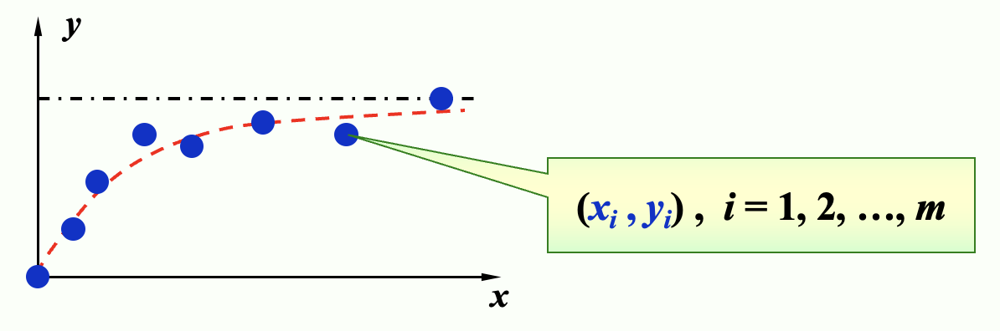

# Chap 8: Approximation Theory
> 逼近和插值的区别在于，插值是要求通过所有的数据点，而逼近没有这个限制，而是要求逼近的函数和原函数的误差尽可能小——尽可能接近每个点。

 **误差表达**：
1. Minimax problem：
$$max_{1\leq i \leq m } |P(x_i)-y_i|$$
      - 这用初等技术无法解决
2. Absolute problem：
	$$\sum_{i=1}^{m}|P(x_i)-y_i|$$
	- 绝对值函数在零点不可微，可能无法求解多元函数的最小值
3. Least-Squares method
    $$\sum_{i=1}^{m}|P(x_i)-y_i|^2$$
    - 此即为**最小二乘**的误差表达，也是最常用的逼近方法

## 8.1 Discrete Least Square Approximation
> [!info] 目标
> 确定一个多项式 $P_n(x) = a_0 + a_1 x + \dots a_n x^n$，用于近似表示一组数据 $\{(x_i, y_i)\ |\ i = 1, 2, \dots, m\}$，使得最小二乘误差 $E_2 = \sum\limits_{i=1}^m [P_N(x_i) - y_i]^2$ 最小化，其中 $n \ll m$

-  $E_2$ 实际上是一个关于 $a_0, a_1, \dots, a_n$ 的函数，即 $E_2(a_0, a_1, \dots, a_n) = \sum\limits_{i=1}^m [a_0 + a_1 x_i + \dots + a_n x_i^n - y_i]^2$。要想让 $E_2$ 最小化，必要条件是 $\dfrac{\partial E_2}{\partial a_k} = 0, k = 0, \dots, n$

- 因此可以得到如下的方程：
$$
\begin{align}
\dfrac{\partial E_2}{\partial a_k} &= 2\sum\limits_{i=1}^m (P_N(x_i) - y_i) \dfrac{\partial P_n(x_i)}{\partial a_k} \\&= 2 \sum\limits_{i=1}^m \Big(\sum\limits_{j=0}^n a_j x_i^j - y_i \Big)x_i^k \notag \\
& = 2\Big(\sum\limits_{j=0}^n a_j \Big(\sum\limits_{i=1}^m x_i^{j+k}\Big) - \sum\limits_{j=1}^m y_i x_i^k\Big) \notag = 0
\end{align}
$$
即
$$
\sum\limits_{j=0}^n a_j \Big(\sum\limits_{i=1}^m x_i^{j+k}\Big) = \sum\limits_{j=1}^m y_i x_i^k
$$
令 $b_k = \sum\limits_{i=1}^m x_i^k, c_k = \sum\limits_{i=1}^m y_i x_i^k$，可以得到如下矩阵：
$$
\begin{bmatrix}b_{0+0} & \dots & b_{0+n} \\ \vdots & \vdots & \vdots \\ b_{n+0} & \dots & b_{n+n}\end{bmatrix} \begin{bmatrix}a_0 \\ \vdots \\ a_n\end{bmatrix} = \begin{bmatrix}c_0 \\ \vdots \\ c_n\end{bmatrix}
$$

> [!note] 注
> - $P_n(x)$ 的顺序由用户给出，且必须不得超过 $m-1$。若 $n=m-1$，那么 $P_n(x)$ 就是 $E_2 = 0$ 的拉格朗日插值多项式
> - 不强制要求 $P_n(x)$ 是一个多项式
> - 如果要考虑权重 $w_i$ 的话，LSA 的公式就变成：$E_2 = \sum\limits_{i=1}^m w_i [P_N(x_i) - y_i]^2$

当 $n=1$ 时，$P_1(x)=a_0+a_1x$，有
$$
\begin{bmatrix}
m & \sum\limits_{i=1}^{m}x_i\\
\sum\limits_{i=1}^{m}x_i & \sum\limits_{i=1}^{m}x_i^2
\end{bmatrix}
\begin{bmatrix}
a_0\\
a_1
\end{bmatrix}
=
\begin{bmatrix}
\sum\limits_{i=1}^{m}y_i\\
\sum\limits_{i=1}^{m}y_ix_i
\end{bmatrix}
$$
所以有
$$
\begin{cases}
a_0 = \frac{\sum\limits_{i=1}^{m} x_{i}^{2} \sum\limits_{i=1}^{m} y_{i}-\sum\limits_{i=1}^{m} x_{i} \sum\limits_{i=1}^{m} x_{i} y_{i}}{m \sum\limits_{i=1}^{m} x_{i}^{2}-\left(\sum\limits_{i=1}^{m} x_{i}\right)^{2}}\\
a_1 = \frac{m \sum\limits_{i=1}^{m} x_{i} y_{i}-\sum\limits_{i=1}^{m} x_{i} \sum\limits_{i=1}^{m} y_{i}}{m \sum\limits_{i=1}^{m} x_{i}^{2}-\left(\sum\limits_{i=1}^{m} x_{i}\right)^{2}}
\end{cases}
$$
> [!example]
> <div style="text-align: center"></div>
> 
> **Method 1**:
> 令 $y \approx P(x) = \dfrac{x}{ax + b}$，寻找 $a, b$，使得 $E_2(a, b) = \sum\limits_{i=1}^m \Big(\dfrac{x_i}{ax_i + b} - y_i\Big)^2$ 最小化。
> - **线性化**(linearization)：令 $Y = \dfrac{1}{y}, X = \dfrac{1}{x}$，那么 $Y \approx a + b X$ 就是个线性问题
> 将 $(x_i, y_i)$ 转换为 $(X_i, Y_i)$，$a, b$ 就能可以被解出来
> ---
> **Method 2**:
> $y \approx P(x) = ae^{-\frac{b}{x}}$，不难发现 $\ln y \approx \ln a - \dfrac{b}{x}$
> **- 线性化**：令 $Y = \ln y, X = \dfrac{1}{x}, A = \ln a, B = -b$，得到 $Y \approx A + BX$ 这样一个线性问题。
>  $(x_i, y_i)$ 转换为 $(X_i, Y_i)$，$a, b$ 就能被解出来了（$a = e^A, b = -B, P(x) = ae^{-\frac{b}{x}}$）

## 8.2 Orthorgonal Polynomials and Least Squares Approximation
> [!info]
> - 离散版本：给定 $x_1, \dots, x_m;\ y_1, \dots, y_m$，找到更简单的函数 $P(x) \approx f(x)$，使得 $E = \sum\limits_{i=1}^m |P(x_i) - y_i|^2$ 最小化。
> - 连续版本：给定在 $[a, b]$ 上的函数 $f(x)$，找到更简单的函数 $P(x) \approx f(x)$，使得 $E = \int_a^b [P(x) - f(x)]^2 dx$ 最小化。

> [!definition]
> 对于一组在区间 $[a, b]$ 上的函数 $\{\varphi_0(x), \varphi_1(x), \dots, \varphi_n(x)\}$，当 $\forall x \in [a, b]$，$a_0 \varphi_0(x) + a_1 \varphi_1(x) + \dots + a_n \varphi_n(x) = 0$ 时，有 $a_0 = a_1 \dots = a_n = 0$，那么称这组函数是**线性独立**(linearly independent)的，否则称它们是**线性相关**(linearly dependent)的。

> [!theorem]
> 如果 $\varphi_j(x)$ 是一个 $j$ 次多项式（$j = 0, \dots, n$），那么 $\{\varphi_0(x), \varphi_1(x), \dots, \varphi_n(x)\}$ 在任意区间 $[a, b]$ 上都是**线性独立的**(linear independent)。
>> [!proof]
>> 假设结论不成立，根据定义，$\exists a_0, a_1, \dots, a_n, \forall x \in [a, b]$ 使得 $P(x) = a_0 \varphi_0(x) + a_1 \varphi_1(x) + \dots + a_n \varphi_n(x) = 0$。
>> - 此时 $P(x)$ 是一个零多项式，$x^n$ 的系数为0，即 $a_n = 0$，那么 $P(x) = a_0 \varphi_0(x) + a_1 \varphi_1(x) + \dots + a_{n-1} \varphi_{n-1}(x) = 0$。同理可以推出 $a_{n-1} = 0$，以此类推，最终发现所有系数均为0。所以假设不成立，得证。

> [!theorem]
> 令 $\Pi_n$ 为一组次数至多为 $n$ 的多项式，如果 $\{\varphi_0(x), \varphi_1(x), \dots, \varphi_n(x)\}$ 是 $\Pi_n$ 内一组线性独立的多项式，那么 $\Pi_n$ 内的任意多项式均可被唯一写做 $\varphi_0(x), \varphi_1(x), \dots, \varphi_n(x)$ 的一个线性组合。

> [!definition]
> 对于一般的一组线性独立的函数 $\{\varphi_0(x), \varphi_1(x), \dots, \varphi_n(x)\}$，关于它们的**线性组合** $P(x) = \sum\limits_{j=0}^n a_j \varphi_j(x)$ 被称为**广义多项式**(generalized polynomial)。
> 
> 一些特殊的多项式：
> - $\{\varphi_j(x) = \cos jx\}, \{\psi_j(x) = \sin jx\} \Rightarrow \{\varphi_j(x), \psi_j(x)\}$ 得到的是**三角多项式**(trigonometric polynomial)
> - $\{\varphi_j(x) = e^{kjx}, k_i \ne k_j\}$ 得到的是**指数多项式**(exponential polynomial)

### 权重函数 (weight function)
- **离散**的情况下，为了在某些点上分配不同程度的重要性，我们在计算离散最小二乘逼近的误差表达式时附上权重： 
 $$E = \sum w_i (P(x_i) - y_i)^2$$
- **连续**版本：一个在区间 $I$ 上的可积分的函数 $w$ 被称为==权重函数==，它满足 $\forall x \in I, w(x) \ge 0$，但 $w(x)$ 不会在 $I$ 的任意子区间上消失。
$$E = \int_a^b w(x) [P(x) - f(x)]^2 dx$$
### 内积与范数
**内积**的定义：
$$(f, g) = \begin{cases}\sum\limits_{i=1}^m w_i f(x_i) g(x_i) & \text{discrete version} \\ \int_a^b w(x) f(x) g(x) dx & \text{continuous version} \end{cases}$$
我们定义**范数**为 
$$\|f\| = \sqrt{(f, f)}$$
- 并且当 $(f, g) = 0$ 时，我们称 $f, g$ 是**正交的**(orthogonal)

误差表达式可以写为
$$E = (P - y, P - y) = \| P - y \|^2$$
令 $P(x) = a_0 \varphi_0(x) + a_1 \varphi_1(x) + \dots + a_n \varphi_n(x)$，然后与求解离散问题类似：$\dfrac{\partial E}{\partial a_k} = 0$，即对于所有 $a_k$ 偏导数为0时误差取最小值。化简可得：$\sum\limits_{j=0}^n (\varphi_k, \varphi_j) a_j = (\varphi_k, f), k = 0, \dots, n$
- 矩阵形式如下：
$$
\begin{bmatrix}(\varphi_0, \varphi_0) & (\varphi_0, \varphi_1) & \dots &(\varphi_0, \varphi_n)\\(\varphi_1, \varphi_0) & (\varphi_1, \varphi_1) & \dots &(\varphi_1, \varphi_n) \\ \vdots& \vdots &  \ddots &  \vdots \\ (\varphi_n, \varphi_0) & (\varphi_n, \varphi_1) & \dots& (\varphi_n, \varphi_n)\end{bmatrix} \begin{bmatrix}a_0 \\ \vdots \\ a_n\end{bmatrix} = \begin{bmatrix}(\varphi_0, f) \\  \vdots \\ (\varphi_n, f)\end{bmatrix} = \varepsilon
$$

> [!Example]
> 使用 $y = a_0 + a_1 x + a_2 x^2\ (w \equiv 1)$ 近似点集 $\{(1, 4), (2, 10), (3, 18), (4, 26)\}$
> - Solution
> <div style="text-align: center"></div>

### 构造式
当使用 $\varphi_j(x) = x^j$ 和 $w(x) \equiv 1$ 近似 $f(x) \in C[0, 1]$ 时，$(\varphi_i, \varphi_j) = \int_0^1 x^i x^j dx = \dfrac{1}{i + j +1}$（[**希尔伯特矩阵**](https://en.wikipedia.org/wiki/Hilbert_matrix) (Hilbert matrix)）。Hilbert 矩阵是一个病态矩阵，在求解中往往因为舍入误差而导致结果不准确。

改进：通过正交化来构建**正交多项式**(orthogonal polynomials)，也就是让范数矩阵变为**对角矩阵**。此时有 $a_k = \dfrac{(\varphi_k, f)}{(\varphi_k, \varphi_k)}$

> [!theorem]
> 对于一组在 $[a, b]$ 的多项式函数 $\{\varphi_0(x), \varphi_1(x), \dots, \varphi_n(x)\}$ 以及一个权重函数 $w$，当满足以下条件时，我们认为这些函数是正交的：   
>  $$\varphi_0 (x) = 1, \varphi_1(x) = x - B_1, \varphi_k(x) = (x - B_k)\varphi_{k-1}(x) - C_k \varphi_{k-2}(x)$$
>  其中 $B_k = \dfrac{(x \varphi_{k-1}, \varphi_{k-1})}{(\varphi_{k-1}, \varphi_{k-1})}, C_k = \dfrac{(x \varphi_{k-1}, \varphi_{k-2})}{( \varphi_{k-2}, \varphi_{k-2})}$

> [!example]
> （和之前基本一样）使用 $y = c_0 + c_1 x + c_2 x^2, w \equiv 1$ 近似点集 $\{(1, 4), (2, 10), (3, 18), (4, 26)\}$
> <div style="text-align: center"></div>

### 正交多项式近似
用一个有被容忍值约束的误差的多项式，近似一个给定的函数。
- 输入：数据个数 $m$；$x[m];\ y[m]$；权重 $w[m]$；容忍值 $TOL$；多项式最大阶数 $Max_n$
- 输出：近似多项式的系数
```c
Step 1  Set phi_0(x) ≡ 1; 
            a_0 = iprod(phi_0, y) / iprod(phi_0, phi_0); 
            P(x) = a_0 * phi_0(x); 
            err = iprod(y, y) - a_0 * iprod(phi_0, y);
Step 2  Set B_1 = iprod(x * phi_0, phi_0) / iprod(phi_0, phi_0); 
            phi_1(x) = x - B_1;
            a_1 = iprod(phi_1, y) / iprod(phi_1, phi_1); 
            P(x) += a_1 * phi_1(x); 
            err -= a_1 * iprod(phi_1, y);
Step 3  Set k = 1;
Step 4  while ((k < Max_n) && (|err| >= TOL)) do steps 5-7:
    Step 5  k++;
    Step 6  B_k = iprod(x * phi_1, phi_1) / iprod(phi_1, phi_1); 
            C_k = iprod(x * phi_1, phi_0) / iprod(phi_0, phi_0);
            phi_2(x) = (x - B_k) * phi_1(x) - C_k * phi_0(x); 
            a_k = iprod(phi_2, y) / iprod(phi_2, phi_2);
    Step 7  Set phi_0(x) = phi_1(x); phi_1(x) = phi_2(x);
Step 8  Output(); STOP.
```

### 误差分析
$$
\begin{align}
err & = \| P - y \|^2 = (P - y, P - y) = (\sum\limits_{k=0}^n a_k \varphi_k - y, \sum\limits_{i=0}^n a_i \varphi_i - y) \notag \\ & = \sum\limits_{k=0}^n a_k^2 (\varphi_k, \varphi_k) - 2 \sum\limits_{k=0}^n a_k (\varphi_k, y) + (y, y) = (y, y) - \sum\limits_{k=0}^n a_k (\varphi_k, y) \notag
\end{align}
$$
## 8.3 Chebyshev Polynomials and Economization of Power Series
### 1. Targets
目标 1.0：找到 $n$ 阶多项式使得 $||P_n-f||_{\infty}$ 最小化。
> [! definition]
> 如果 $P(x_0) - f(x_0) = \pm \|P - f\|_{\infty}$，那么此时 $x_0$ 被称为 $(\pm)$ **偏差点**(deviation point)（也就是正好在误差边界上的点）。

多项式 $P_n$ 有以下特征：
- 如果 $f \in C[a, b]$ 且 $f$ **不是**一个 $n$ 阶多项式，那么存在一个唯一的多项式 $P_n(x)$，使得 $\|P_n - f\|_{\infty}$ 最小化
- $P_n(x)$ 存在，且必须同时有正负偏差点（否则有更小的误差）
- **切比雪夫定理**(Chebyshev Theorem)
	- $P_n(x)$ 最小化  $\|P_n - f\|_{\infty}\ \Leftrightarrow P_n(x)$ 至少有 $n+2$ 个关于 $f$ 的正负偏差点。也就是说，存在一组点 $a \le t_1 < \dots < t_{n+2} \le b$ ，使得 
$$P_n(t_k) - f(t_k) = \pm(-1)^k \|P_n - f\|_{\infty}$$
	- 集合 $\{t_k\}$ 被称为**切比雪夫交替序列**(Chebyshev alternating sequence)。
    >$P_n(x) - f(x)$ 至少有 $n+1$ 个根。

<div style="text-align: center"></div>

---
目标 2.0：确定插值点 $\{x_0, \dots, x_n\}$ 使得 $P_n(x)$ 最小化余项 $|P_n(x) - f(x)| = |R_n(x)| = \Big|\dfrac{f^{(n+1)}(\xi)}{(n+1)!} \prod\limits_{i=0}^n (x - x_i)\Big|$

目标 2.1：找到 $\{x_1, \dots, x_n\}$ 使得 $\|w_n\|_{\infty}$ 在 $[-1, 1]$ 最小化，其中 $w_n(x) = \prod\limits_{i=1}^n (x - x_i)$

---
注意到 （此处的 $P_{n-1}$ 是指 $n-1$ 阶的多项式）
$$w_n(x) = x^n - P_{n-1}(x)$$ 问题就变成了：

目标 3.0：找到多项式 $P_{n-1}(x)$，使得 $\|x^n - P_{n-1}(x)\|_{\infty}$ 在 $[-1, 1]$ 上最小。

根据切比雪夫定理，我们知道 $P_{n-1}(x)$ 有 $n+1$ 个关于 $x^n$ 的偏差点，也就是说 $w_n(x)$ 在 $n+1$ 个点上交替获得最大值和最小值。

### 2. Chebyshev Polynomials
为了实现上面的目标，我们先想到三角函数，考虑 $\cos (n \theta)$ 在 $[0, \pi]$ 上有 $n+1$ 个交替的最大值和最小值。但是 $\cos(n \theta)$ 不是多项式。又由于 $\cos(n \theta)$ 可以表示为 $\sum\limits_{k=0}^n a_k(\cos\theta)^k$，这就是我们想要的多项式形式。

令 $x = \cos (\theta)$，那么 $x \in [-1, 1]$。我们称 $T_n(x) = \cos (n\theta) = \cos (n \cdot \text{arc} \cos x)$ 为**切比雪夫多项式**(Chebyshev polonomial)。

切比雪夫多项式的性质：
- $T_n(x)$ 假设在 $t_k = \cos \Big(\dfrac{k}{n} \pi\Big) (k = 0, 1, \dots, n)$ 上，在最大值1和最小值-1之间交替变换
	- 也就是说 $T_n(t_k) = (-1)^k \|T_n(x)\|_{\infty}$
- $T_n(x)$ 有 $n$ 个根 $x_k = \cos \Big(\dfrac{2k - 1}{2n} \pi \Big)(k = 1, \dots, n)$
- $T_n(x)$ 有递推关系式：
$$\begin{align}T_0(x) &= 1,\\ T_1(x) &= x, \\T_{n+1}(x) &= 2xT_n(x) - T_{n-1}(x),\quad n=2,3,\dots\end{align}$$
    - $T_n(x)$ 是一个最高阶系数为 $2^{n-1}$ 的 $n$ 阶多项式
- $\{T_0(x), T_1(x), \dots\}$ 在 $[-1, 1]$ 上关于权重函数 $w(x) = \dfrac{1}{\sqrt{1 - x^2}}$ 上正交，也就是说 $$(T_n, T_m) = \int_{-1}^1 \dfrac{T_n(x) T_m(x)}{\sqrt{1-x^2}} dx = \begin{cases}0 & n \ne m \\ \pi & n = m = 0 \\ \dfrac{\pi}{2} & n = m \ne 0\end{cases}$$
回到之前提到的目标：
- 目标 3.0：找到多项式 $P_{n-1}(x)$，使得 $\|x^n - P_{n-1}(x)\|_{\infty}$ 在 $[-1, 1]$ 上最小。
    - 此时 $w_n(x) = x^n - P_{n-1}(x) = \dfrac{T_n(x)}{2^{n-1}}$
- 目标 2.1：找到 $\{x_1, \dots, x_n\}$ 使得 $\|w_n\|_{\infty}$ 在 $[-1, 1]$ 最小化，其中 $w_n(x) = \prod\limits_{i=1}^n (x - x_i)$
    - 此时 $\min\limits_{w_n \in \widetilde{\Pi}_n} \|w_n\|_{\infty} = \Big\|\dfrac{T_n(x)}{2^{n-1}} \Big\|_{\infty} = \dfrac{1}{2^{n-1}}$。
    - 其中：$\widetilde{\Pi}_n$ 是 $n$ 阶的**首一多项式**，所以差值点 $\{x_1, \dots, x_n\}$ 是 $T_n(x)$ 的 $n$ 个根
- 目标 2.0：确定插值点 $\{x_0, \dots, x_n\}$ 使得 $P_n(x)$ 最小化余项 $|P_n(x) - f(x)| = |R_n(x)| = \Big|\dfrac{f^{(n+1)}(\xi)}{(n+1)!} \prod\limits_{i=0}^n (x - x_i)\Big|$
    - 取 $T_{n+1}(x)$ 上的 $n+1$ 个根作为插值点 $\{x_0, \dots, x_n\}$ 能够使得余项最小，即
$$
\max_{x\in[-1,1]}|f(x)-P_n(x)|\leq \frac{1}{2^n(n+1)!}\max_{x\in [-1,1]}|f^{(n+1)}(x)|
$$
- 使用线性变换 $x=\frac{b-a}{2}t+\frac{b+a}{2}$，我们可以将其推广到闭区间 $[a,b]$ 上。

> [!example]
> 找到在 $[0, 1]$ 上关于 $f(x) = e^x$ 的最佳近似多项式，使得绝对误差不超过 $0.5 \times 10^{-4}$。
> <div style="text-align: center"></div>

### 3. Economization of Power Series
> 目标：给定 $P_n(x) \approx f(x)$，幂级数**经济化**(economization)的目标是在确保精度损失最小的情况下，降低多项式的次数。

考虑一个任意的 $n$ 阶多项式 $P_n(x) = a_n x^n + a_{n-1} x^{n-1} + \dots + a_1 x + a_0$，对应的多项式 $P_{n-1}(x)$ 通过移除 $n$ 阶多项式 $Q_n(x)$（$x^n$ 项的系数为 $a_n$）得到。那么 $\max\limits_{[-1, 1]} |f(x) - P_{n-1}(x)| \le \max\limits_{[-1, 1]} |f(x) - P_n(x)| + \max\limits_{[-1, 1]} |Q_n(x)|$，而 $Q_n(x)$ 能够反映精度的损失。

为了最小化精度损失，$Q_n(x)$ 必须为 $a_n \times \dfrac{T_n(x)}{2^{n-1}}$

> [!note]
> - 对于一般区间 $[a, b]$，需要改变变量。也就是说，令 $x = [(b - a) t + (a + b)] / 2$，然后寻找对于 $f(t)$ 在 $[-1, 1]$ 上的（近似）多项式 $P_n(t)$，最终得到 $P_n(x)$。
> - 另一种方法是用 $T_0(x), \dots, T_k(x)$ 的线性组合来表示每一项 $x^k$。比如，$x = T_1(x)$，且 $x^3 = [T_3(x) + 3T_1(x)] / 4$。然后只要从原始多项式中移除切比雪夫函数就行了。

> [!example]
> <div style="text-align: center"></div>