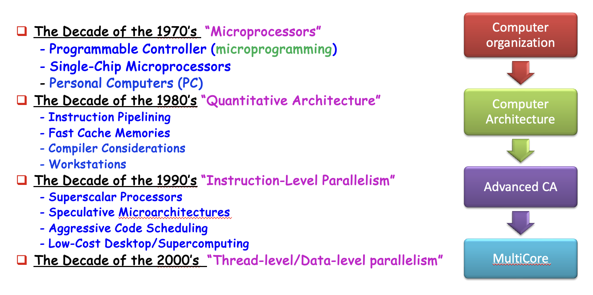
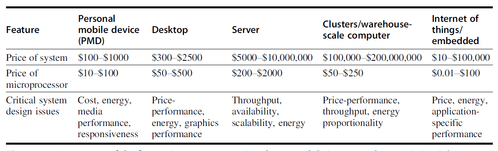
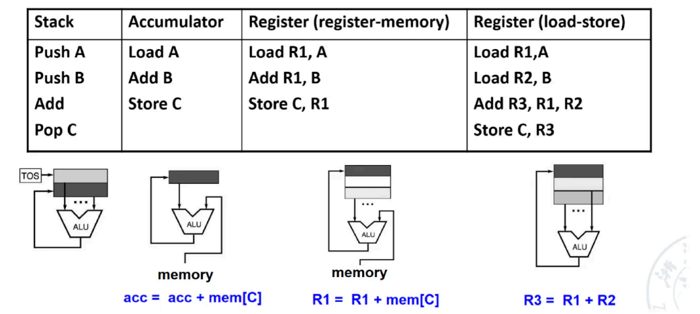
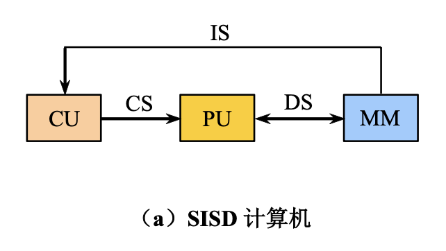
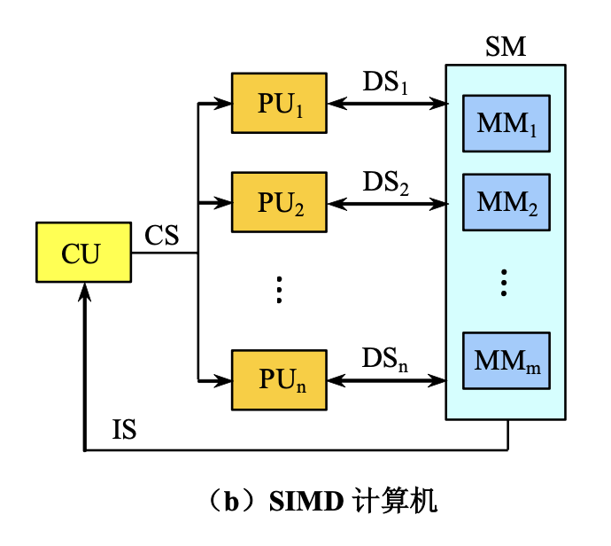
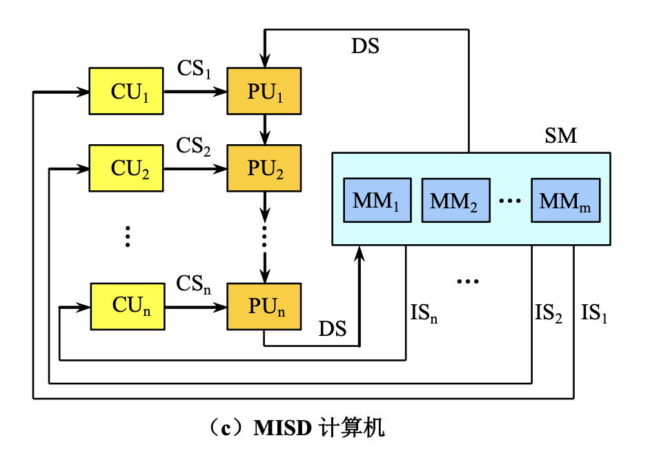
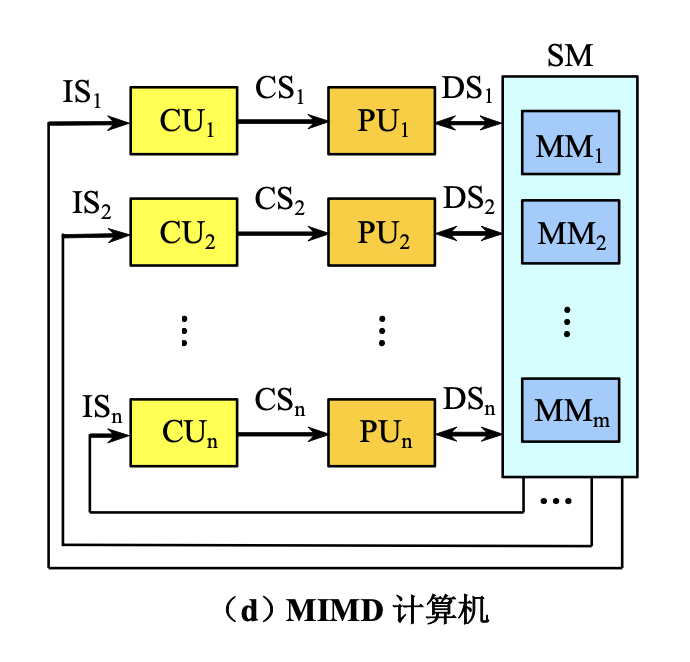
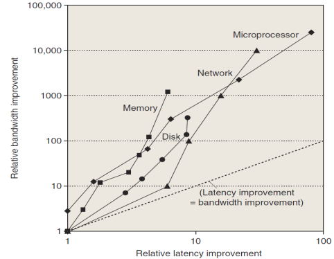
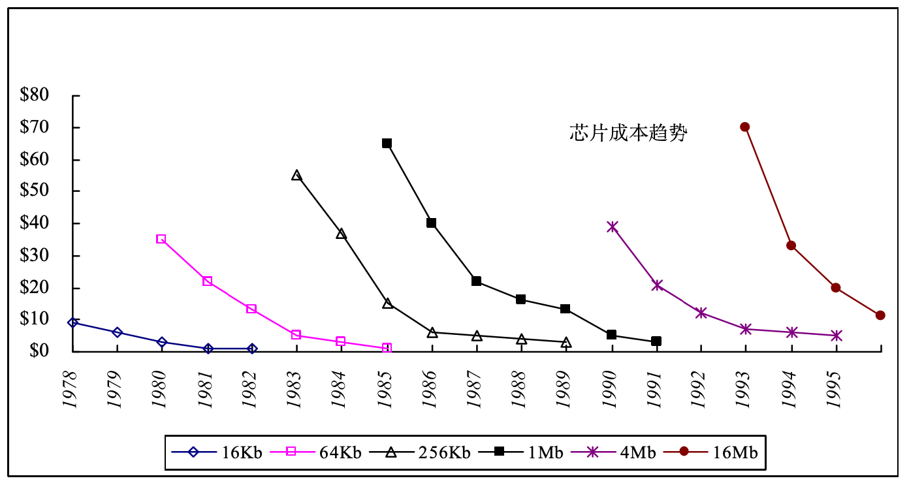
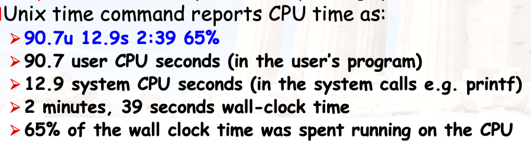

# Fundamentals of Quantitative Design and Analysis

## 1.1 Introduction

!!! note "计算机组成 & 计算机体系结构"

    体系结构从程序员的角度出发

    - 优化程序性能
    - 了解计算机硬件如何执行程序
    - 处于较高的抽象层次，多从逻辑和功能出发

    组成课从硬件工程师的角度出发

    - 实现体系结构的技术手段
    - 系统的物理实现
    - 处于较低的抽象层次，多从电路和器件出发

!!! info "计算机架构发展时期"

    

==Computer architecture== comprises at least three main subcategories:

- **指令集架构** Instruction set architecture
    - 规定了软件如何控制硬件
    - 包括：指令集、寄存器类型、内存寻址方式等
    - ISA 设计的七个维度
        1. Class of ISA
        2. Memory addressing
        3. Addressing modes
        4. Types and sizes of operands
        5. Operations
        6. Control flow instructions
        7. Encoding an ISA
- **微架构** Microarchitecture (computer organization)
    - 涉及硬件部件如何互连以实现 ISA
- **系统设计** System Design
  涉及计算系统内所有其他的硬件组件，侧重于具体的物理实现
    - Logic Implementation：逻辑门电路的设计
    - Circuit Implementation：晶体管级别的电路设计
    - Physical Implementation：芯片的实际布线和封装

**Challenges of "three walls"**

- ILP Wall
    - 寻找更多指令级并行（ILP）硬件带来的收益正在递减
    - 必须开发显式的线程级并行（TLP）和数据级并行（DLP）
- Memory Wall
    - CPU 速度与芯片外内存速度之间的差距日益扩大
    - 内存延迟将成为计算机性能的压倒性瓶颈
- Power Wall：运行频率每翻一倍，功耗往往会翻一两倍的趋势

## 1.2 Classes of computers

**Servers（服务器）**

- The role of servers to provide larger scale and more reliable file and computing services grew.
- 需要考虑的因素：可用性 (availability)、可扩展性 (scalability)、吞吐量 (throughput)

**Clusters（集群）/ Warehouse-scale computer（仓库规模计算机）**

- SaaS (Search,social networking, video sharing, multiplayergames, online-shopping) 
- WSC—tens of thousands of servers act as one

**Embedded (嵌入式系统)**

- The fastest growing portion of the computer market with widest spread of processing power and cost.

---

### Other classification

- Quantum computer & Chemical computer
- Scalar processor & Vector processor 
    - 标量处理器每一条指令只处理**一对数据**
    - 向量处理器同时处理**一组数据线（数组）**
- NUMA & UMA
    - **NUMA（Non-Uniform Memory Access）**：每个 CPU 节点有自己的本地内存。访问本地内存极快，但访问其他节点的内存需要跨越互联总线，延迟明显增加。
    - **UMA（Uniform Memory Access）**：所有 CPU 核心共享同一个内存控制器，访问任何内存地址的延迟是均衡的
- Register machine vs Stack machine vs Accumulater machine 
- Harvard architecture vs Von Neumann architecture vs Non Von Neumann architecture （类脑芯片：达尔文2）
    - 冯诺伊曼：指令和数据存储在**同一个内存空间**，共享同一条总线
    - 哈佛：指令和数据拥有**独立的存储器和总线**。现代 CPU 内部的 L1 Cache 通常采用这种设计
    - 类脑芯片：模仿神经元和突触，每个“神经元”既是处理器也是存储器
- RISC vs. CISC 
- Cellular architecture（蜂窝架构）
    - 将计算平面划分为大量重复的、简单的计算单元
    - 每个单元只与其相邻的单元通信。

!!! info "Class of ISA"

    

    - General-Purpose Register Architecture (GPR)
        - 显式操作数，位于通用寄存器，灵活且速度快，但指令编码较长  
        - 分类
            - 寄存器-内存型（x86）：任何指令都能访问内存  
            - 寄存器-寄存器型（MIPS）：仅 load/store 指令可以访问内存
        - 目前**最主流**，因为<u>寄存器比内存更快，而且更适合存储变量</u>
    - Stack Architecture
        - 隐式操作数，位于栈顶
        - 指令长度极短（零地址指令）；操作数从栈中弹出，结果压入栈中
    - Accumulator Architecture
        - 一个隐含的累加器寄存器
        - 极省硬件，指令短，但编程繁琐

---

### Classes of Parallelism and Parallel Architecture

**应用层面的两种并行**：

- 数据级并行(data-level parallelism, DLP)
- 任务级并行(task-level parallelism, TLP)

**硬件层面的四种并行**：

- 指令级并行(instruction-level parallelism, ILP)
- 向量架构、GPUs、多媒体指令集
- 线程级并行(threaad-level parallelism, TLP)
- 请求级并行(request-level parallelism, RLP)

### Flynn Taxonomy 

A classification of computer architectures based on **the number of streams of instructions and data** 

!!! tip "图上标注的符号"

    CU: Control Unit
    PU: Processing Unit
    MM: Main Memory
    IS: Instruction Stream
    DS: Data Stream
    CS: Control Stream

==SISD==：Single Instruction, Single Data 
最传统的冯·诺依曼架构，处理器一次只能执行一条指令，且该指令只能处理一个数据

- **原理**：串行执行，指令寄存器发出指令，ALU对单个内存地址中的数据进行操作
- **代表**：早期的单核 CPU、单片机
- **特点**：结构简单，但处理速度受限于硬件的时钟频率

==SIMD==：Single Instruction, Multiple Data

- **原理**：数据级并行，适用于对大量相同类型的数据进行相同操作的场景
- **代表**：GPU（用于大规模矩阵运算和图像处理）、现代 CPU 的指令集扩展
- **特点**：在处理视频编解码、3D 渲染和深度学习（如矩阵加法）时效率极高

==MISD==：Multiple Instruction, Single Data 

- 多个处理单元同时对同一个数据流执行不同的指令，**没有实际应用**

==MIMD==：Multiple Instruction, Multiple Data

- 目前高性能计算和服务器领域最主流的架构，多个处理器独立执行不同的指令序列，并处理不同的数据集

## 1.4 Trends in Technology

计算机的技术实现：

- 集成电路
- DRAM
- 闪存
- 磁盘
- 网络

上述技术实现性能体现在以下两个因素：

- **带宽**(bandwidth)/ 吞吐量 (throughput)：一定时间内的工作总量
- **时延**(latency)/ 响应时间 (response time)：从开始到完成事件所经过的时间
虽然这两个因素的提升在不同技术上有不同的表现，但是总的来说带宽的提升量高于时延。相关的一个经验法则是：<u>带宽的提升量至少是时延提升量的平方倍。</u>

## 1.5 Trends in power and energy in Integrated circuits

计算微处理器的能耗和功率：

- **Dynamic power**: 开关晶体管消耗的能量

$$
\begin{align}
&\text{功率：Power}_{\text{dynamic}}= \frac{1}{2} \times \text{Capacitive load} \times \text{Voltage}^2 \times \text{Frequency switched}\\
&\text{能耗：Energy}_{\text{dynamic}}= \text{Capacitive load} *\times\text{Voltage}^2 
\end{align}
$$

- **Static power**：晶体管由于电流泄露消耗的能量

$$
\text{Power}_{\text{static}}= \text{current static} \times \text{Voltage}
$$

可以看到：

- 减小时钟频率可以降低功率，但无法降低能耗
- 减小电压可以显著降低功率和能耗
    - Rule of Thumb：**小幅降压可大幅省电，而性能损失相对较小**
- 晶体管数量的增加会导致更高的功率以及更严重的电流泄露，因为 SRAM 缓存需要耗电来维持存储在内部的值

## 1.6 Trends in Cost

影响计算机成本的几个主要因素：

- **时间**(time)：
    - Component prices drop over time without major improvements in manufacturing technology
    - Twice the yield will have half the cost.(for chip, board, or a system)
- **产量**(volume)：
    - Volume decreases cost due to increases in manufacturing efficiency.
- **商品化**(commoditization)：
    - The competition among the suppliers of the components will decrease overall product cost.

!!! info "Learning Curve"

    - 随时间流逝，制造成本不断降低

    

### Cost of an Integreted Circuit

集成电路的成本计算公式为：

- 一颗芯片的最终成本 = 制造成本 + 测试成本 + 封装成本，再除以最终良品率

$$
\text{Cost of integrated circuit} = \dfrac{\text{Cost of die + Cost of testing die + Cost of packaging and final test}}{\text{Final test yield}}
$$

其中晶片 (die) 的成本为：

- 单颗晶片的成本 = 一片晶圆的价格，除以一片晶圆能切除的芯片数量以及芯片的良品率

$$
\text{Cost of die} = \dfrac{\text{Cost of wafer}}{\text{Dies per wafer} \times \text{Die yield}}
$$

而每个晶圆 (wafer) 上的晶片数量为：

- 理论最大数减去一个修正参数

$$
\text{Dies per wafer} = \dfrac{\pi \times (\text{Wafer diameter} / 2)^2}{\text{Die area}} - \dfrac{\pi \times \text{Wafer diameter}}{\sqrt{2 \times \text{Die area}}}
$$

晶片产出 (die yield)：

$$
\text{Die yield} = \text{Wafer yield} \times \dfrac{1}{(1 + \text{Defects per unit area} \times \text{Die area})^N}
$$

- 简洁起见，假定晶圆产出 (wafer yield) 为 100%
- 每单位面积上的瑕疵 (defects per unit area) 较为随机，取值会在一定范围内变化
- $N$ 表示加工-复杂度因子 (process-complexity factor)，用于测量制造难度

## 1.7 Dependability

**Service Level Agreements (SLA) / Service Level Objectives (SLO)**：

- **SLA（服务水平协议）**：
  供应商与客户之间签订的正式合同，规定服务的质量指标（如99.9%可用性）、违约责任等
- **SLO（服务水平目标）**：
  内部设定的具体性能目标，通常是 SLA 的量化基础（例如：“每月宕机时间不超过43分钟”）

**可以用 SLA 来判断系统处于运行还是停机状态，将服务状态分为：**

- Service accomplishment：系统正在按 SLO/SLA 要求正常提供服务。
- Service interruption：系统未能满足 SLO/SLA，出现故障、延迟、不可用等情况
- Failures: 

$$
\text{S}_{\text{accomplishment}}\rightarrow \text{S}_{\text{interruption}}
$$

- Restorations:   

$$
\text{S}_{\text{interruption}}\rightarrow \text{S}_{\text{accomplishment}}
$$

### Measurements of Dependability

**模块可靠性**（Module reliability）: continuous service accomplishment of the time to failure

- **平均故障时间**（MTTF）: Mean Time To Failure  
    - **故障率**（FIT）: Failure In Time = 1/MTTF
- **平均修复时间**（MTTR）: Mean Time To Repair  (service interruption)
- **平均故障间隔时间**（MTBF）: Mean Time Between Failure = MTTF+MTTR

**模块可用性** (Module availability)：

$$
\text{Module availability}=\dfrac{\text{MTTF}}{\text{MTTF}+\text{MTTR}}=\dfrac{\text{MTTF}}{\text{MTBF}}
$$

Way to cope with failure: *Redundancy 冗余*

- Time redundancy: repeat the operation again to see if it is still in erroneous.
- Resource redundancy: repeat the operation again to see if it is still in erroneous.

!!! example

    A system consists of the following components: 10 disks, 1000000 hour MTTF 1 SCSI controller, 500000 hour MTTF 1 power supply, 1 fan, both 200000 hour MTTF 1 SCSI cable, 1000000 hour MTTF. What is the MTTF of the system?

    $$
    \begin{align}
    &\text{Failure rate of the system}=\frac{1}{\text{MTTF}}=10\times \frac{1}{1000000}+\frac{1}{500000}+2\times \frac{1}{200000}+\frac{1}{1000000}\\
    &\text{MTTF}=43500\text{hours}
    \end{align}
    $$

## 1.8 Measuring, Reporting and Summarizing Performance

衡量计算机性能的指标有：

- **执行时间**（Execution time / latency）
- **吞吐量**（Throughput）
- MIPS: millions of instructions per second，每秒百万条指令
    - $\text{MIPS}=\dfrac{\frac{\text{\# of instructions}}{\text{benchmark}}\times\frac{\text{benchmark}}{\text{total run time}}}{1000000}$
    - 通过 MIPS 比较性能时要采用相同的 ISA

!!! tip "三种计算执行时间的方式："

    - 总执行时间
        - **算术平均数(Arithmetic Mean)**：$\text{AM}=\frac{1}{n}\sum_{i=1}^n \text{Time}_i$
        - **调和平均数(Harmonic Mean)**：$\text{HM}=\dfrac{1}{\sum_{i=1}^n \frac{1}{\text{Rate}_i}}$
        - 前者只能表示时间的平均值，后者只能表示速度的平均值
        - 但是测试的程序在实际应用中的 workload 不一定是真实的
    - 带有权重的执行时间（Weighted Execution Time）
        - $\text{WET}=\sum_{i=1}^n \text{Weight}_i \times \text{Time}_i$
        - Weighted Harmonic Mean: $\text{WHM}=\dfrac{1}{\sum_{i=1}^n \frac{\text{Weight}_i}{\text{Rate}_i}}$
    - 几何平均值
        - **几何平均数(Geometric Mean)**：$\text{GM}=\sqrt{\Pi_{i=1}^n \text{Relative\_Rate}_i}$
        - Normalized Geometric Mean 具有统一的结果，无论参考机器是什么

### 1. Benchmarks

测试程序需要避免的三种"陷阱"：

1. **核 (kernel)**：真实应用中小而关键的片段；太片面，不能反映整体
2. **玩具程序**：百行左右的入门代码；太简单，与实际差距大
3. **综合基准测试**：人造的假程序，模拟真实应用轮廓；模拟≠真实，可能误导

关于**编译器优化**问题

- 允许使用**针对该基准测试优化的编译器标志**（ benchmark-specific compiler flag）：可以针对测试特供优化，但在很多程序中的性能反而变差
- 源代码修改限制：
    1. 不允许修改
    2. 允许修改，但实际不太会改
    3. 允许修改，只要输出结果相同（领域专用架构常用）

==基准测试套件 (Suites)==：

- **单个基准测试**容易存在缺陷/偏见，**测试套件**包含多个不同的基准测试，**互相弥补缺陷**
- **SPEC**（Standard Performance Evaluation Corporation）是目前最权威的基准测试组织。

### 2. Measuring Performance Results

==Wall-clock time==：指从启动一个程序开始，到它完全结束为止，墙上挂钟所经过的总时间，也叫 **response time**响应时间或 **elapsed time**流逝时间

- 包含所有等待时间，反应**用户**对系统速度的感知
- 多程序并发运行时干扰大，依赖用户交互

==CPU time==：指程序运行时，CPU 实际用于执行该程序指令的时间，不包括等待 I/O、睡眠或被其他进程抢占的时间

- User time（用户态时间）：程序在用户模式（user mode）下执行所花费的 CPU 时间
- System time（系统态时间）：程序在内核模式（kernel mode）下执行所花费的 CPU 时间

!!! example

    |字段|含义|
|---|---|
|`90.7u`|User CPU seconds = 90.7 秒 → 用户态代码占用 CPU 的时间|
|`12.9s`|System CPU seconds = 12.9 秒 → 系统调用占用 CPU 的时间|
|`2:39`|Wall-clock time = 2 分 39 秒 = 159 秒 → 总 elapsed time|
|`65%`|CPU utilization = (90.7 + 12.9) / 159 ≈ 65% → CPU 实际忙碌比例|

> 

### 3. Reporting Performance Results

- 报告性能测量的指导原则应该是具备**可重复性**(reproducibility)：列出其他实验者能够复现结果的一切条件。
- SPEC 基准测试报告需要计算机和编译器标志的详细描述、基本和优化的结果、以表格或图的形式展示实际的性能计时

### 4. Summarizing Performance Results

- 性能测试结果的方法：比较在基准测试组件的各项程序中执行时间的算术/加权平均值
- SPECRatio：参考计算机的执行时间 / 被测计算机的执行时间，有以下等式成立：

$$
\dfrac{\text{SPECRatio}_{\text{A}}}{\text{SPECRatio}_{\text{B}}} = \dfrac{\frac{\text{Execution time}_{\text{reference}}}{\text{Execution time}_{\text{A}}}}{\frac{\text{Execution time}_{\text{reference}}}{\text{Execution time}_{\text{B}}}} = \dfrac{\text{Execution time}_{\text{B}}}{\text{Execution time}_{\text{A}}} = \dfrac{\text{Performance}_{\text{A}}}{\text{Performance}_{\text{B}}}
$$

- 由于 SPECRatio 是比率而非绝对执行时间，因此计算平均值时应采用几何平均值，即 $\text{Geometric mean} = \sqrt[n]{\prod\limits_{i=1}^n \text{sample}_i}$。使用几何平均值时确保两条重要的性质：
    - （时间）比率的几何平均值 = 几何平均值的比率
    - 几何平均值的比率 = 性能比率的集合平均值，因此与参考计算机的选择无关

---

## 1.9 Quantitative Principles of Computer Design

- 利用**并行**
    - 系统级别：多处理器
    - 指令级别：流水线等
    - 操作单元级别：组关联缓存、流水化功能器件等
- **局部性原则**(principle of locality)
    - **时间局部性**(temporal locality)：最近被访问过的项很有可能在不久之后会被再次访问
    - **空间局部性**(spatial locality)：地址相邻的项被引用的时间比较相近
    经验法则：90-10 法则：程序的 90% 的执行时间花费在 10% 的代码上
- 专注于**一般情况**(common case)
    - 有助于计算机在能耗、资源分配、性能、可靠性等方面的改善
    - 通常而言，一般情况比不常见的情况更简单，执行速度更快
- **阿姆达尔定律**(Amdahl's Law)：<u>simple is fast</u>

$$
\text{Speedup}=\frac{1}{(1-f)+\dfrac{f}{s}}
$$

    - 其中 $f$ 为性能提升的部分占比，$s$ 为提升的比例。
- **CPU 性能计算公式**
    - CPU 时间的计算公式：

$$
\text{CPU time}  = \text{CPU clock cycles} \times \text{Clock cycle time} = \dfrac{\text{CPU clock cycles}}{\text{Clock rate}} 
$$

    - CPI (clock cycles per instruction)，以及它的倒数 IPC

        $$
        \text{CPI} = \dfrac{\text{CPU clock cycles for a program}}{\text{Instruction count}}
        $$

    - 因此 CPU 时间计算公式可以改写为：

      $$
      \dfrac{\text{Instructions}}{\text{Program}} \times\dfrac{\text{Clock cycles}}{\text{Instruction}} \times\dfrac{\text{Seconds}}{\text{Clock cycle}} =\dfrac{\text{Seconds}}{\text{Program}} = \text{CPU time}
      $$

    - 性能取决于：
        - 算法：影响指令数 (IC)，也可能影响 CPI
        - 编程语言、编译器：影响 IC 和 CPI
        - 指令集架构：影响 IC、CPI 和周期时间
    - 对于多条指令
        - CPU 时钟周期数：$\text{CPU clock cycles} = \sum\limits_{i=1}^n \text{IC}_i \times \text{CPI}_i$
        - CPU 时间：$\text{CPU time} = \Big(\sum\limits_{i=1}^n \text{IC}_i \times \text{CPI}_i \Big) \times \text{Clock cycle time}$
        - CPI：$\text{CPI} = \dfrac{\sum\limits_{i=1}^n \text{IC}_i \times \text{CPI}_i}{\text{Instruction count}} = \sum\limits_{i=1}^n \dfrac{\text{IC}_i}{\text{Instruction count}} \times \text{CPI}_i$
