# Memory Hierarchy Design 

## Part 1.Memory Basics

!!! info "不同计算机类型的存储器层级"

    <div style="text-align: center">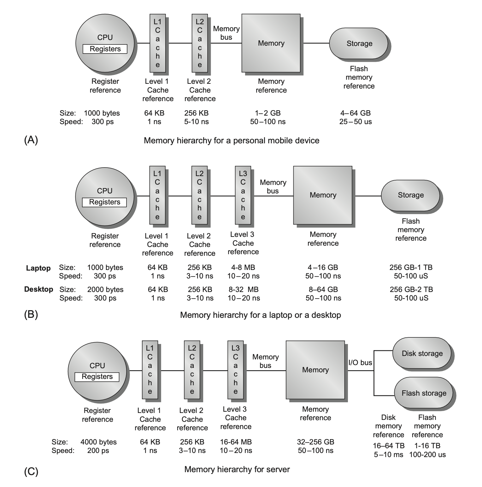</div>

## 2.1 Memory Hierarchy

### 2.1.1 Main Memory

- Main memory: <u>I/O interfac</u>e between caches and servers
- Destination of input & source of output (所有I/O操作都必须经过主内存)
- 使用 SRAM 作为 cache & DRAM 作为主内存

<div style="text-align: center">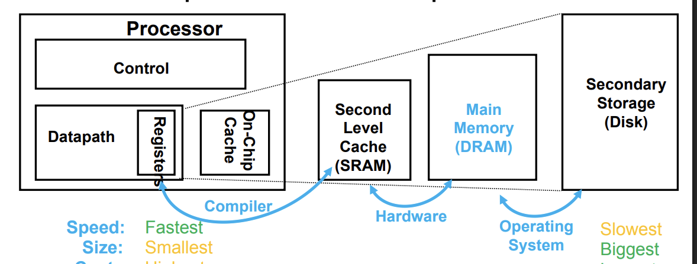</div>

!!! info "Performance Measures"

    - Latency（延迟）：获取数据块中**第一个字**所需的时间
        - Access Time：从发出读取请求，到**目标数据字真正到达**所花费的时间
        - Cycle Time：两次**无关内存请求之间**的最小间隔时间；或一次访问开始到下一次访问开始的最低等待时间
    - Bandwidth（带宽）：获取数据块中**剩余部分**所需的时间（即单位时间内能传输多少数据）
    - 所以获取一个完整数据块的总时间大致为：

    $$
    T_{\text{total}}\approx \text{Latency} + \frac{\text{Block Size}-\text{Word Size}}{\text{Bandwidth}}
    $$

#### 1. SRAM

**Static Random Access Memory**

- 6 个晶体管/bit，保证**读取时不破坏数据**
- **无需刷新、访问时间≈周期时间**，主要用于构建**高速缓存**（L1、L2、L3）
- 挑战：随着高速缓存容量的增加，SRAM 的访问时间、功耗和芯片面积都会增加
- 优化：组相联高速缓存通过增加块数和动态功耗来减少访问时间

#### 2. DRAM

**Dynamic Random Access Memory**

- Single transistor per bit
    - 每个比特只用**一个晶体管 + 一个电容**来存储
    - 代价是：电容会漏电 → 数据不能长期保存 → 必须刷新
- Reading destorys the information
    - 每次读取后，必须**立即把数据写回去**（restore / rewrite）
- Refresh periodically
- Cycle time > access time

##### DRAM Organization

<div style="text-align: center">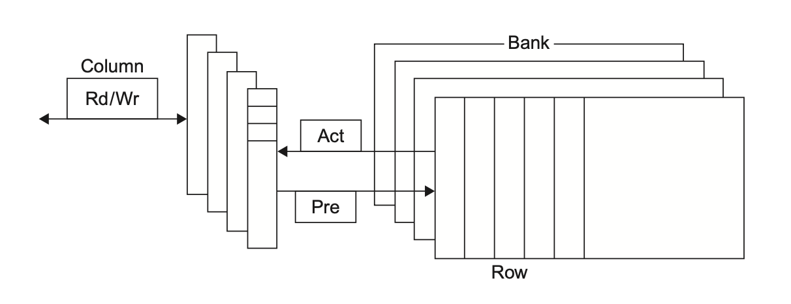</div>

DRAM 内部是一个分成架构：

- 芯片被划分为多个独立的 **Bank**，Bank 是由 Row 和 Column 组成的二维矩阵
- 每个 Bank 是一个独立的存储阵列，可以**并行操作**
- 访问数据需要两步：

| 步骤         | 信号           | 操作                                                |
| ---------- | ------------ | ------------------------------------------------- |
| Activation | RAS（行地址选通）   | 打开指定 Bank 的某一行，整行数据被加载到**感应放大器**（Sense Amplifier） |
| Rd/Wr      | CAS（列地址选通）   | 从感应放大器中选出**特定列**的数据读出或写入                          |
| Precharge  | Precharge 信号 | **重置 Bank 状态**，使其准备好接受下一次 Activate                |

!!! info "Row buffer"

    Row buffer 可以加快 DRAM 的访问速度

    - Act 指令传递了 row address，随后该行就被传入 row buffer 中
    - 使用 Multiplexer 来选取 column 的内容
    - 如果一直访问同一个 row 的内容，可以大幅提升访问速度

    <div style="text-align: center">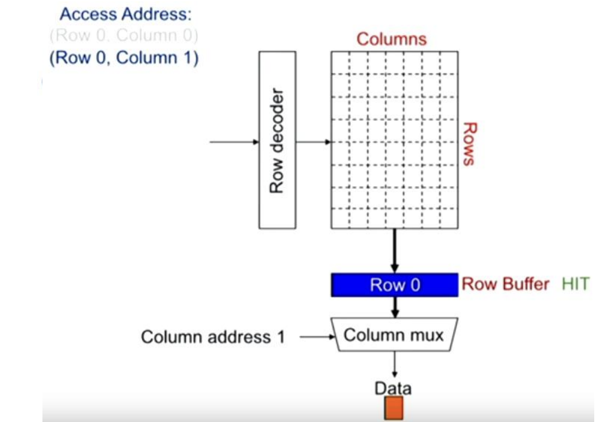</div>

##### DRAM Improvement

1. **利用时序信号优化重复访问**
    - 通过特定的时序控制，允许 CPU 对同一个“行缓冲区”进行连续多次的数据读写，避免了每次访问都重新执行耗时的“行激活”操作。
2. **利用空间局部性原理**
    - DRAM 在每次访问时，会将整行的大量数据（通常为 1024 到 4096 位）一次性缓冲出来，如果后续需要访问相邻数据，就可以直接从缓冲区快速获取。

- 关于==性能==的提升：
    - **SDRAM（Synchronous DRAM）**：
      引入时钟信号，支持**突发传输**(burst transfer)；
      允许在一次行激活后连续传输多个数据，利用了 spatial locality
    - **DDR SDRAM: double data rate**：
      在 DRAM 时钟的上升沿和下降沿都传输数据；
      把数据传输通道**一分为二**，从而使得 data rate 的带宽翻倍
    - **Wider DRAM**：
      加宽内存总线，一次传输更多 bit
      Eg. 4-bit transfer mode up to 16-bit buses
    - **Multiple Banks**：
      把单条 SDRAM 分成 2~8 个独立 Bank
      本质是**并行隐藏延迟**：在等一个 Bank 时，另一个 Bank 可以同时做别的事
- 关于==功耗==的提升：
    - Reducing power consumption in SDRAMs
    - **Power down mode**：通过指令让 DRAM 忽略时钟信号。在此模式下，SDRAM 的大部分功能被禁用，仅保留内部自动刷新电路以维持数据不丢失，从而大幅降低能耗。
- **Graphics Data RAM**（GDRAMs）：
  专门为 GPU 设计，具有更宽的接口、更高的最大时钟频率和直接连接 GPU 的特性，提供比 DDR DRAM 高 2 到 5 倍的带宽

#### 3. Stacked or embedded DRAMs

- HBM(High Bandwidth Memory)：通过 3D 堆叠多个 DRAM 芯片并与处理器（或中介层）紧密连接，大大缩短了 DRAM 与处理器之间的延迟，并提供极高的带宽
- 2.5D 和 3D 堆叠：2.5D（通过中介层连接）已商用，3D（直接垂直堆叠）仍在开发中，面临散热挑战

<div style="text-align: center">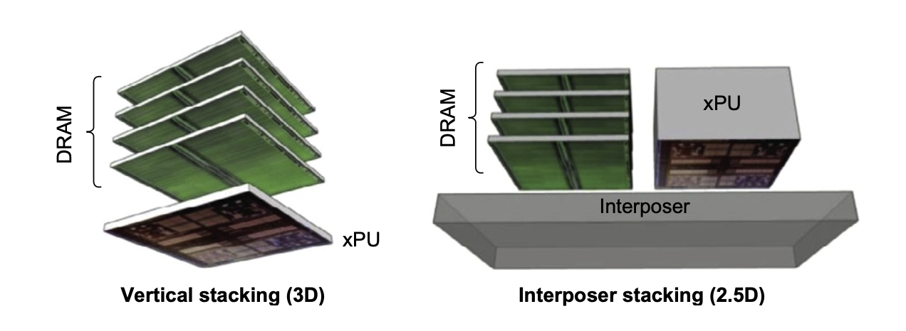</div>

#### 4. Flash Memory

- 特性：
    - EEPROM (electronically erasable programmable read-only memory) 的一种
    - 正常操作时时 Read-only，但如果需要更新数据，可以被擦除并重新写入
    - Nonvotile（非易失性）: 断电后数据不会丢失
- 和 DRAM 对比：访问速度更慢，但是价格更便宜
- 挑战：每一个 block 的写入次数是有限的，而且需要先擦除再写入
- 用处：广泛用于 PMD（个人移动设备）和笔记本电脑，作为 SSD 替代传统硬盘

#### 5. Phase-Change Memory, PCM

- 一种新兴的非易失性内存技术，通过改变材料的电阻状态来存储数据
    - Eliminate the need to erase a page before writing
- 读写耐久性优于 NAND 闪存，读延迟也低于 NAND 闪存

### 2.1.2 Memory Dependability

**Soft errors = Transient faults**  

- 数据内容被意外改变，但硬件电路本身无损坏
- 可通过重写或刷新恢复

**Hard errors = Permanent faults**

- 某存储单元晶体管烧毁，永远无法正确存储数据

!!! tip "Error detection and fix"

    - Parity: 加 1 bit 校验位，使整组 bit 中 1 的个数为奇数或偶数
    - ECC: 用 8 bit 校验位对 64 bit 数据进行编码，形成 **SEC-DED**（Single Error Correct, Double Error Detect）
    - Chipkill: 把数据和 ECC 码**分散到多个内存芯片**上，即使**一整片芯片完全失效**，也能恢复数据。

### 2.1.3 Four Memory Hierarchy Questions

#### Block Placement

组相联高速缓存通过增加块数和动态功耗来减少访问时间

1. Direct Mapped Cache：每个数据块在存储器中只有一块确定的位置

$$
\text{(Block address)MOD(Numbers of blocks in memory)}
$$

<div style="text-align: center">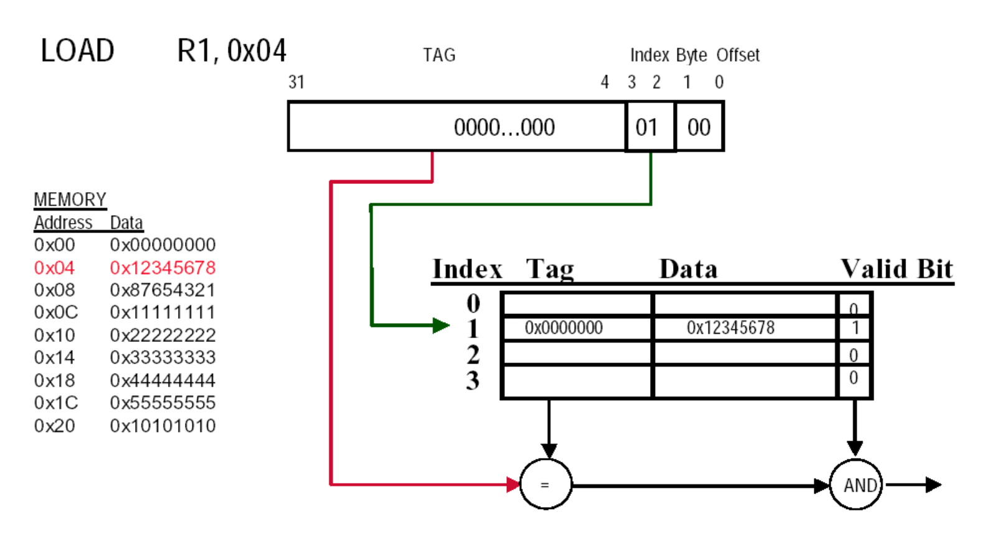</div>

2. Fully Associative Cache：数据块可以放在存储器中的任意位置上

 <div style="text-align: center">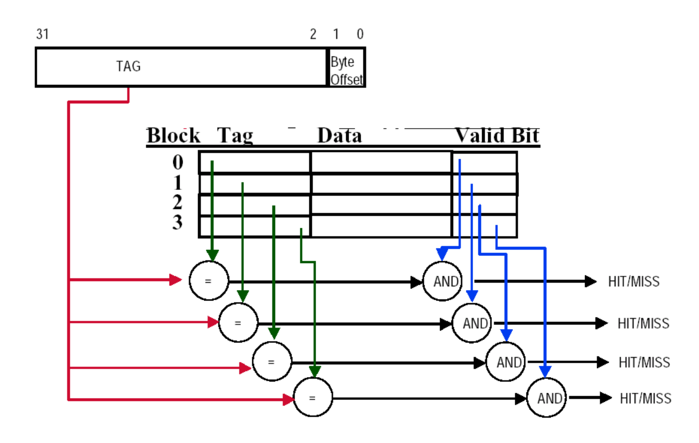</div>

3. Set Associative Cache：每个数据块被限制在存储器的某个**组**(set) 中，而每个组包含了 $n$ 个可放数据块的地方，数据块可以在组内的 $n$ 个地方任意挑选

$$
\text{(Block address)MOD(Numbers of sets in memory)}
$$

<div style="text-align: center">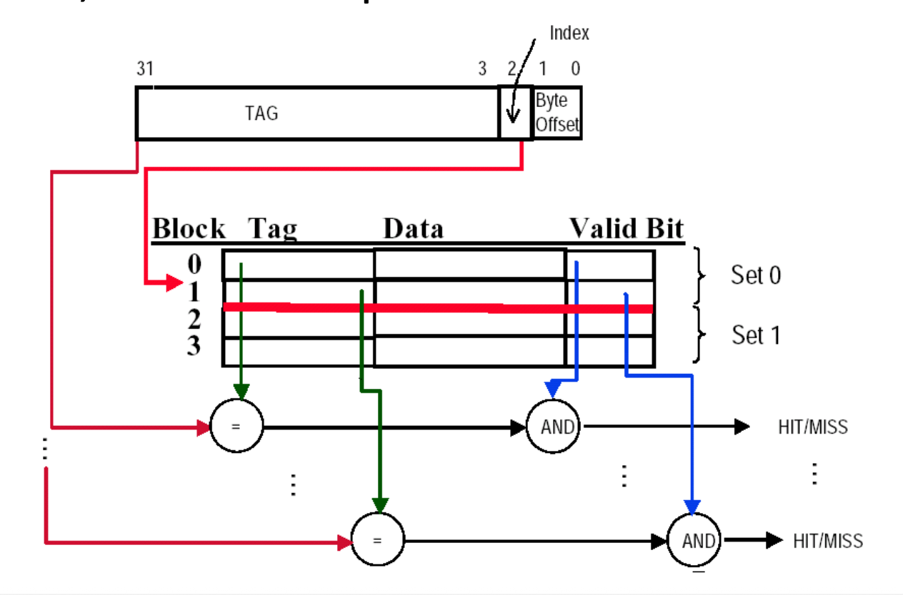</div>

#### Block Identification

每个 cache都有一个唯一的地址，而这个地址被分为多个字段，用于实现数据块的识别

<div style="text-align: center">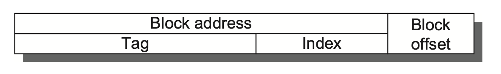</div>

#### Block Replacement

当失效发生时，控制器必须决定将哪个数据块作为被替换的块：

- **直接映射**：直接替换某个确定的数据块
- **组相联**和**全相联**：
    - **随机**(random)：在某个组中随机挑选一个块
        - 实现简单，但可能会驱逐那些最近被访问的块
    - **最近最少使用**(least recently used, LRU)：替换最久没使用过的数据块
        - 借助了时间局部性，缺点是实现复杂
        - 可以使用 LRU 的近似实现，比如用一组 bit 来记录某个组内的数据块的访问情况
    - **先进先出**(first in, first out)：也是一种 LRU 的近似实现，替换最早存在的数据块

#### Write Strategy

如果==写入命中==的话，通常会采取以下两种策略之一：

- **写穿**(write through)：将信息写入 cache，以及下一级的内存里    
    - 实现简单，确保了**数据一致性**(data coherency) 
    - 处理器必须等 write through完成才能执行下一步，这种情况称为**写停顿**(write stall)。为了解决这个问题，可以增加一个**写缓冲区**(write buffer)，允许处理器在数据写入 buffer 的同时继续执行后续任务。
        - 但如果处理器的频率太高，且有很多的存储指令，可能导致 buffer **饱和**(saturation)
        - 解决方法是在写缓冲区和主存之间再加一级（L2）高速缓存，buffer 往 L2 写数据更快

<div style="text-align: center">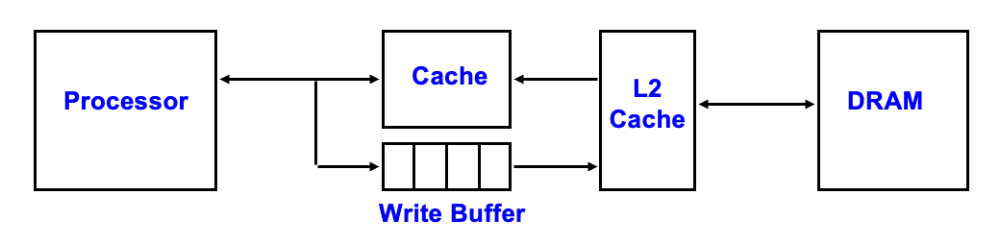</div>

- **写回**(write back)：信息只写入 cache，如果 cache 中被**修改过的**数据块（脏块）要被替代，那么要先将这个数据块写入到下一级内存中，再发生替换。
    - 引入一个**脏位**(dirty bit)，记录某个数据块的修改情况的状态位。
    - 优点：速度快（多次写入 cache，可能只需写一次主存），使用更少的内存带宽（更适用于多核处理器），省电

如果==写入失效==的话，则会采取以下两种策略之一：

- **写分配**(write allocate)：对应**写回**(write back)
    - 将目标地址所在的整个数据块从主存（或下一级缓存）加载到高速缓存中，然后再对这个新加载的高速缓存块执行写入操作。
- **非写分配**(no-write allocate/write around)：对应**写穿**(write through)
    - 数据直接写入主存（或下一级高速缓存），而不将该数据块加载到当前高速缓存中。

---

## 2.2 Cache

??? info "补充知识：统一缓存 vs. 分离缓存"

    - **统一缓存**(unified cache)：指令和数据共享同一个缓存空间
        - 处理器在需要指令时从该缓存中获取，在需要数据时也从该缓存中获取
        - 理论上，这类缓存可以更好地利用缓存空间，且硬件得以简化；但存在指令和数据访问会相互**竞争**缓存端口和带宽的问题
    - **分离缓存**(split cache)：指令和数据拥有各自独立的缓存空间
        - 通常，**指令缓存**(I-cache) 用于存储指令，**数据缓存**(D-cache) 用于存储数据
        - 优点是允许处理器在同一周期内获取指令和数据（流水线 CPU 就是这么做的），且指令流和数据流是独立的，互不干扰

    <div style="text-align: center">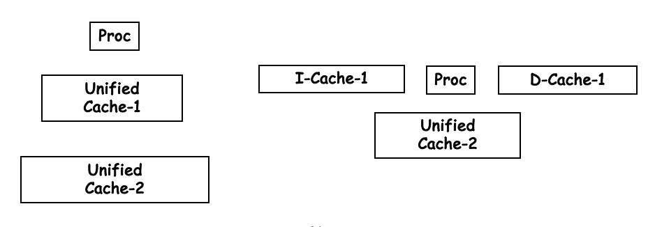</div>

### 2.2.1 Cache Performance

!!! info "公式汇总"

    <div style="text-align: center">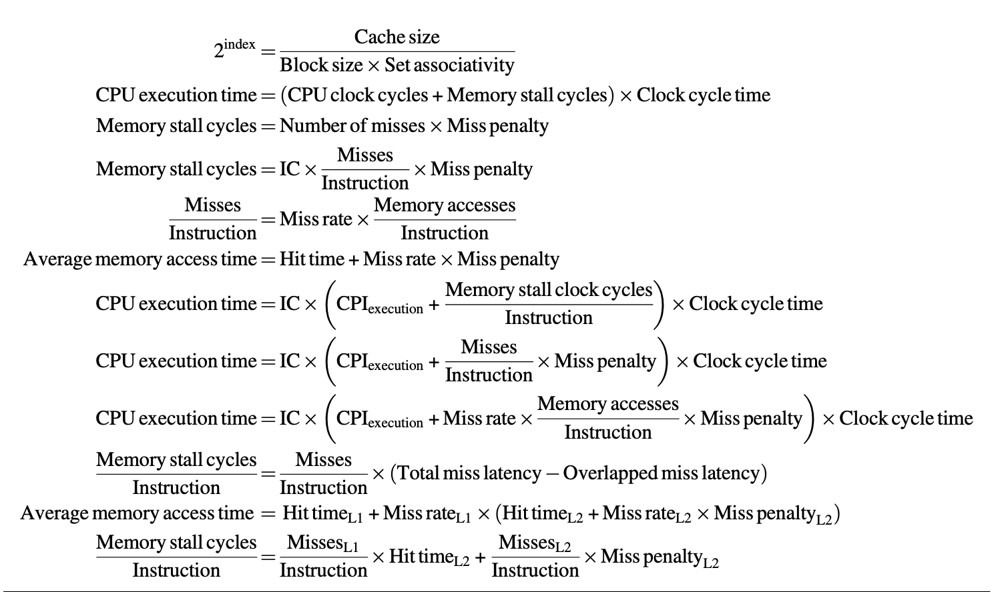</div>

使用 ==CPU 执行时间==来用于评估高速缓存的性能：

$$
\text{CPU execution time}=(\text{CPU clock cycles}+\text{Memory stall cycles})\times \text{Clock cycle time}
$$

存储器停顿周期数由失效数和**失效损失**(miss penalty) 共同决定：

$$
\begin{align}
\text{Memory stall cycles}​&=\text{Numbers of misses}\times \text{Miss penalty}\\&=\text{IC}\times \frac{\text{Misses}​}{\text{Instruction}}\times \text{Miss penalty}\\&=\text{IC}\times \frac{\text{Memory accesses}}{\text{Instruction}}\times \text{Miss rate}\times \text{Miss penalty}
\end{align}​
$$

- **失效率**(miss rate)：导致失效的高速缓存访问的比重
- 失效损失和失效率在读和写的情况下会有所不同，所以可能需要分开讨论

实际上无论是直接拿指令数，还是拿失效率作为衡量指标，都是存在一定缺陷，更好的测量方法是使用==平均存储器访问时间(average memory access time, AMAT) ==：

$$
\begin{align}
\text{Average Memory Access Time}&= (1-\text{Miss Rate}) \times \text{Hit Time} + \text{Miss Rate} \times \text{Miss Time} \\
&= (1-\text{Miss Rate}) \times \text{Hit Time} + \text{Miss Rate} \times (\text{Hit Time} + \text{Miss Penalty}) \\
&=   \text{Hit Time} + \text{Miss Rate} \times \text{Miss Penalty}
\end{align}
$$

!!! bug

    memory access 包含 ==instruction access 以及 data access==，因此在计算 AMAT 的时候，要按权相加两种不同 access 所需要的时钟周期。而 miss rate 是针对 **memory access** 的比率。CPI 按之前的方式正常计算即可。

    <div style="text-align: center">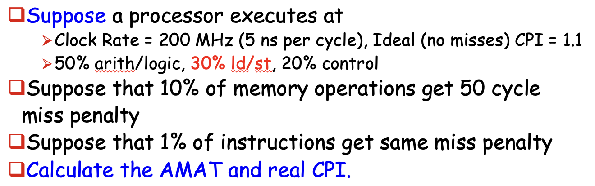</div>

    - Memory access: 1 instruction access + 0.3 data access
        - 此处的 instruction miss rate （1%）对应 instruction access
        - 另一个 10% 是指 data access 的 miss rate
    - 因此 AMAT 计算方式如下：

    $$
    \text{AMAT} = \frac{1}{1+0.3} \times (1.1+1\%\times 50) + \frac{0.3}{1+0.3}\times (1.1 + 10\% \times 50)= 2.64
    $$

    - CPI 正常计算：

    $$
    \begin{align}
    \text{CPI}&= \text{ideal CPI} + \text{average stalls per inst}\\
    &=\text{ideal CPI} + (\text{AMAT}-\text{HitTime})\times \text{AccessOp/ins}\\
    &= 1.1 +(2.64-1.1)\times (1+0.3)=3.1
    \end{align}
    $$

#### Impact of Caches on Processor Performance

高速缓存的 AMAT （cache miss）对处理器性能的影响：

- 假定只有存储器的停顿会导致处理器的停顿
- 对于有序处理器而言，AMAT 可以能预测处理器的性能；但是对于乱序处理器不够准确
- 对于低 CPI 和高时钟频率的处理器而言有双重影响（cache miss 的时钟周期固定）：
    - $\text{CPI}_{\text{execution}}$ 的值越低，miss 的影响越大
    - 时钟频率越高，每次失效的时钟周期数越多，因此存储器在 CPI 的占比会更高

??? example "例题"

    下面来看一下不同的高速缓存组织对处理器性能的影响：

    <div style="text-align: center">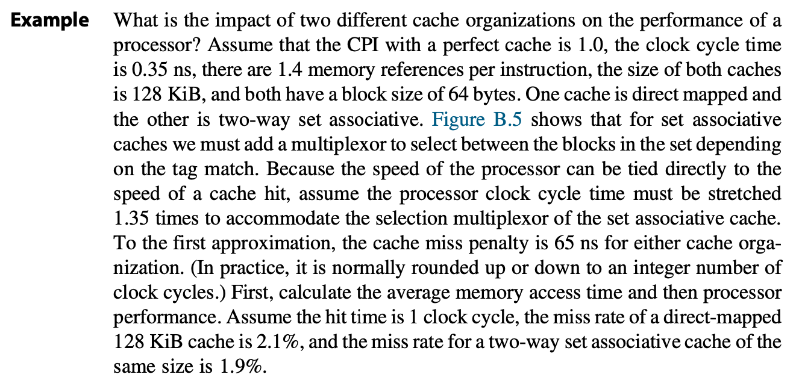</div>

    答案

    <div style="text-align: center">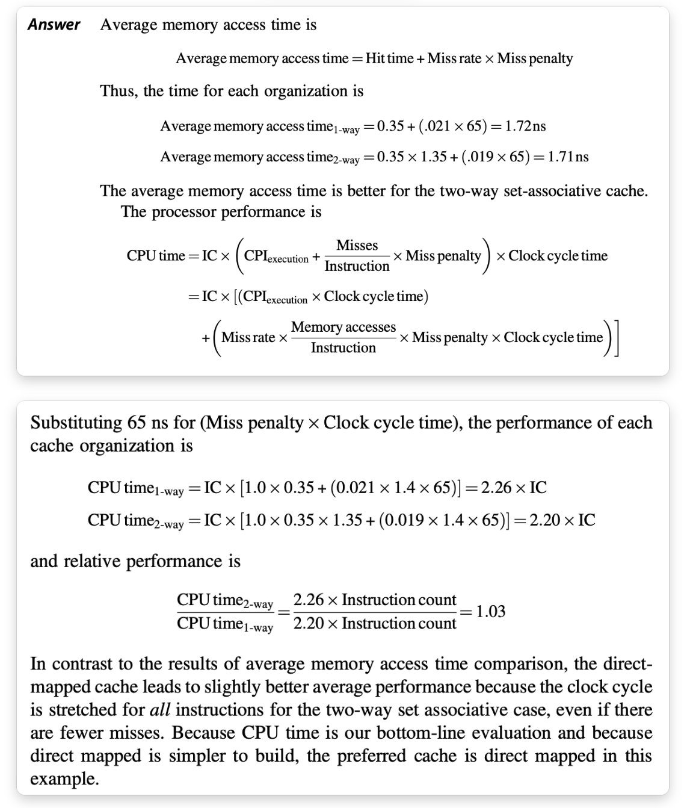</div>

### 2.2.2 Six Basic Cache Optimizations

!!! tip "Root Causes of Miss Rates (3C 模型)"

    1. Compulsory Misses
        - 第一次访问某个数据块时，它必然不在缓存中 → 对应的数据块必须先被带入缓存中
    2. Capacity Misses
        - 缓存装不下所有数据 → 当新数据进来时，必须淘汰旧数据
        - 如果被淘汰的数据之后又被访问 → capacity miss
    3. Conflict Misses
        - 多个不同地址的数据块争抢同一个缓存位置

如何解决这三类失效问题：

- **冲突失效**：采用全相联的置放方案，但成本较高，且会降低时钟频率
- **容量失效**：唯一能做的就是扩大高速缓存的容量
- **强制失效**：增大数据块容量来解决，但是这会导致其他失效的增加

3C 模型存在一些局限：

- 它只考虑了**平均情况**，而无法很好地解释个别的特殊情况
- 它同时忽视了**替代的策略**

!!! abstract "“+”表示优化；“-”表示负优化"

    <div style="text-align: center">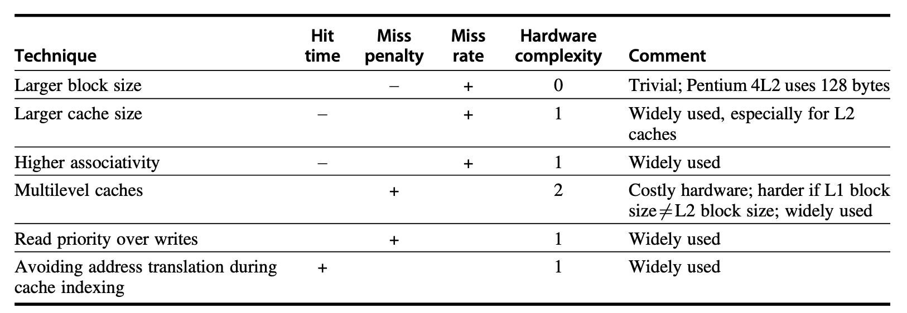</div>

#### Opt 1: Lager Block Size

- Reduce ==compulsory misses==
    - Leverage spatial locality (利用空间局部性)
    - 增大 block size → 每次从主存加载的数据更多 → 更可能包含后续会用到的相邻数据
- Increase conflict/capacity misses and miss penalty
    - Conflic miss：缓存总容量固定 → block size 增大 → 缓存中能容纳的 block 数量减少，不同的内存地址更容易被映射到同一个 Cache 组中
    - Capacity miss：如果程序只需要块中的极小一部分数据，Cache 却加载了整个巨大的块。这不仅浪费空间，还可能导致其他真正需要的数据因为空间不足而被过早地踢，从而加剧了**容量缺失**。
    - Miss penalty：缓存块越大，意味着每次 Miss 发生时，需要从主存或下一级 Cache 搬运的数据量就越多。

<div style="text-align: center">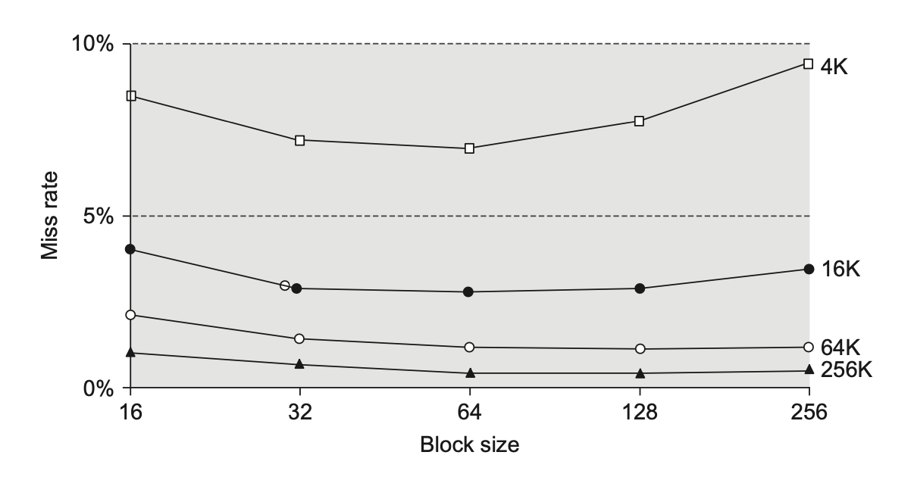</div>

#### Opt 2: Larger Cache

- 增大高速缓存可以**降低容量失效**。
- 缺点是可能会带来更长的命中时间，以及消耗更高的成本和功率
- 这种技术往往用于不在芯片上的高速缓存中。

#### Opt 3: Higher Associativity

- **降低失效率**，但代价是增大了命中时间
- 对于高时钟频率的处理器，不建议提升相联程度；失效损失较大的情况下，则鼓励提升相联程度

!!! tip "2:1 cache rule of thumb"

    （对于 128 KiB 以下的高速缓存）对于大小为 $N$ 的直接映射的高速缓存，它的失效率与大小为 $N/2$ 的二路组相联的高速缓存的失效率相等

#### Opt 4: Multilevel Caches

通过引入**多级高速缓存**(multilevel caches)，可以有效减少<u>失效损失</u>

先考虑最简单的**Two-level caches**:

- Average Memory Access Time (AMAT)

$$
\begin{aligned}
\text{Average memory access time} 
&= \text{Hit time}_{L1} + \text{Miss rate}_{L1} \times \text{Miss penalty}_{L1} \\
&= \text{Hit time}_{L1} + \text{Miss rate}_{L1} \\
&\quad \times \left( \text{Hit time}_{L2} + \text{Miss rate}_{L2} \times \text{Miss penalty}_{L2} \right)
\end{aligned}
$$

- Average Memory Stalls per Instruction

$$
\begin{aligned}
\text{Average mem stalls per instruction} 
&= \text{Misses per instruction}_{L1} \times \text{Hit time}_{L2} \\
&\quad + \text{Misses per instr}_{L2} \times \text{Miss penalty}_{L2}
\end{aligned}
$$

**Cache Performance: Equations**

$$
\begin{align}
\text{CPU execution time} &= (\text{CPU clock cycles} + \text{Memory stall cycles}) \times \text{Clock cycle time} \\ \\
\text{Memory stall cycles} &= \text{Number of misses}\times \text{Miss penalty}\\
&= \text{IC} \times \frac{\text{Misses}}{\text{Instruction}}\times \text{Miss penalty}\\
&= \text{IC} \times \frac{\text{Memory accesses}}{\text{Instruction}}\times \text{Miss rate}\times \text{Miss penalty}\\ \\
\text{Memory stall clock cycles} &= \text{IC} \times \text{Reads per instruction} \times \text{Read miss rate} \times \text{Read miss penalty} \\ &\quad + \text{IC} \times \text{Writes per instruction} \times \text{Write miss rate} \times \text{Write miss penalty} 
\end{align}
$$

!!! info "失效率（Miss rate）"

    - **局部失效率**（Local miss rate）= 在某个高速缓存的失效次数 / 在该高速缓存中总的存储器访问次数
        - L1 和 L2 的局部失效率分别为 $\text{Miss rate}_{L_1},\text{Miss rate}_{L_2}$
    - **全局失效率**（Global miss rate）= 在某个高速缓存的失效次数 / 来自处理器的总的存储器访问次数
        - L1 和 L2 的全局失效率分别为 $\text{Miss rate}_{L_1},\text{Miss rate}_{L_1}\times \text{Miss rate}_{L_2}$
    - 如果不想考虑失效率的话，可以用每条指令的失效数作为衡量指标，计算公式为：

    $$
    \begin{align}
    \text{Average memory stalls per instruction}&=\text{Misses per instruction}_{L_1} \times \text{Hit time}_{L_2} \\&+ \text{Misses per instruction}_{L_2}\times \text{Miss penalty}_{L_2}
    \end{align}
    $$

$L_1$ 内的数据是否需要出现在 $L_2$ 内？由此引出了两种策略：

- **多级包含**(multilevel inclusion)：$L_1$ 的数据永远都会在 $L_2$ 出现，确保数据的一致性
    - 对于数据块大小不同的多级高速缓存，需要做额外的处理工作，可能会提高 $L_1$ 的失效率
    - 因此为了方便起见，很多高速缓存设计中会让各级的高速缓存保持相同大小的数据块
- **多级排斥**(multilevel exclusion)：$L_1$ 的数据永远不会在 $L_2$ 出现
    - 这适用于 $L_2$ 仅比 $L_1$ 稍大一些的情况。
    - 当 $L_1$ 出现失效的情况时，交换 $L_1$ 和 $L_2$ 的数据，而非用 $L_2$ 的数据块替代 $L_1$，以避免 $L_2$ 额外的空间浪费

#### Opt 5: Prioritize Read Misses Over Writes

!!! warning "write through 时 write buffer 带来的问题"

    - 写缓冲区中可能包含了某个位置的最新更新值，而这个位置的数据可能在读失效时被请求。
    - 如果读操作直接从主存获取数据，而写缓冲区中的数据尚未写入主存，就会导致 **RAW 冒险**

**读缺失与写缓冲调度 (Read Miss & Write Buffer)**

- **Blocking**
    - Read Miss 必须**等待** Write Buffer 清空后才能发起
    - 串行执行，即使地址无冲突也阻塞
- **Read-Miss Priority / Non-blocking**
    - 若读地址与写缓冲地址**无冲突**，允许读缺失**提前启动**
    - 与写操作**并行**

#### Opt 6. Avoid Address Translation

高速缓存会用到虚拟地址，因为这样会提高命中率，被称为**虚拟高速缓存**(virtual caches)。

!!! abstract "关于三种 cache 的地址转换⽅式"

    1. **VIVT**（Virtually Indexed, Virtually Tagged）

        <div style="text-align: center">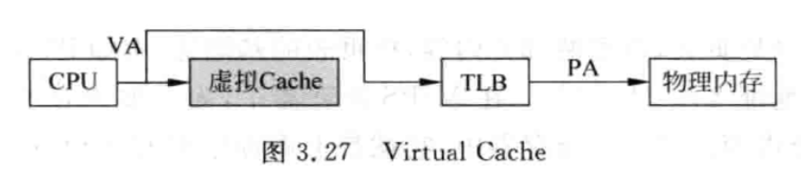</div>

        - CPU 发出虚拟地址后，**无需等待 MMU 转换**，直接使用虚拟地址的低位作为 Index，高位作为 Tag 去查找 Cache
        - 实现较为简单，但存在两大问题
            - **歧义 ambiguity**：两个进程使⽤相同的 virtual tag 对应到不同的 physical tag，可以通过 flush 解决 
            - **别名 aliasing**：两个进程使⽤不同的 virtual tag 对应到相同的 physical tag
    2. **PIPT**（Physically Indexed, Physically Tagged）

        <div style="text-align: center">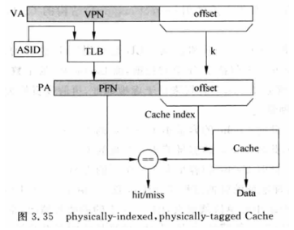</div>

        - 由于物理地址唯⼀，没有歧义与别名问题
        - ⽆论命中与否，都会经过 TLB 或者⻚表转换，增加了访问时间
    3. **VIPT**（Virtually Indexed, Physically Tagged）

        <div style="text-align: center">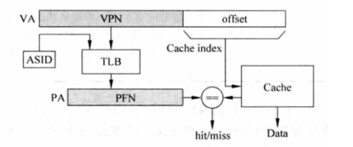</div>

        - 使⽤虚拟地址的⼀部分作为 index，使⽤物理地址的⼀部分作为 tag 
        - TLB 翻译得到 PFN 和 index 索引 Cache 是同时进⾏的

同时利用虚拟和物理缓存优势的方法：==Virtually indexed, physically tagged==

- 使用页偏移量（在虚拟地址和物理地址中**相同**）作为 L1 cache 的 index
- 同时把**虚拟页号**送到 TLB 得到**物理页号**，并将其和 L1 的 tag 匹配

<div style="text-align: center">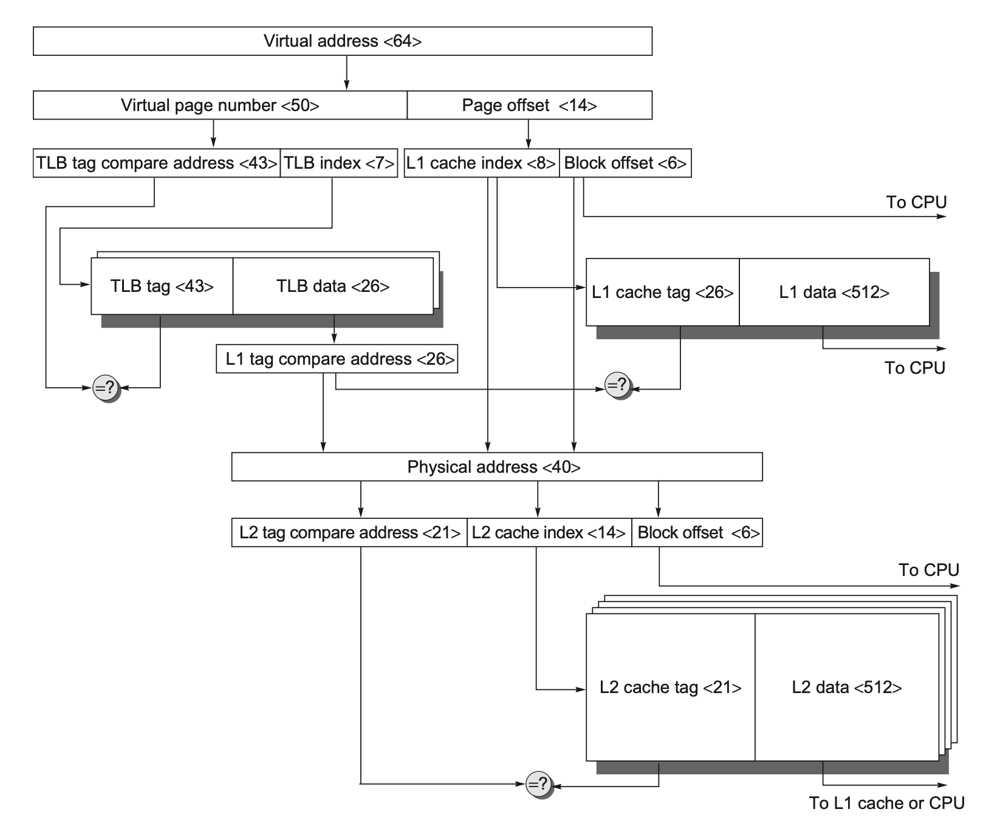</div>

---

## 2.3 Virtual Memory

### 1. Four Memory Hierarchy Questions Revisited

#### Q1. Where to place a block?

- 数据块放置：**全相联**（full associative strategy）
- 虚拟内存的失效损失相当相当大（数百万个时钟周期数），因此需要尽可能地降低失效率，而全相联的失效率最低。

#### Q2. How to find a block?

**Access memory twice**:

- 第一次访问: 查页表（取 PTE）→ 得到物理地址
- 第二次访问: 用物理地址取数据

<div style="text-align: center">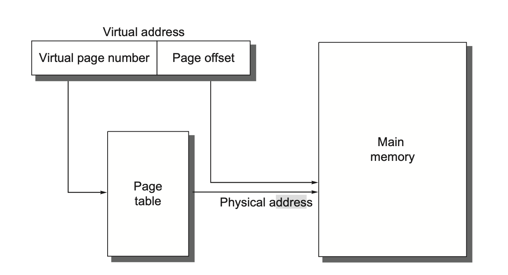</div>

**Processing a page fault**（该页不在内存中）

1. CPU 发出 VA → MMU
2. MMU 去内存查 PTE → 发现 Valid = 0（页不在内存）
3. MMU 向 CPU 抛出 Exception（缺页异常）
4. CPU 陷入操作系统 Page Fault Handler
5. OS 从磁盘把缺失的页加载到内存（如果内存满了，先找一个 Victim Page 写回磁盘）
6. OS 更新页表（Valid = 1，填入新的物理页号）
7. 重新执行之前失败的那条指令

<div style="text-align: center">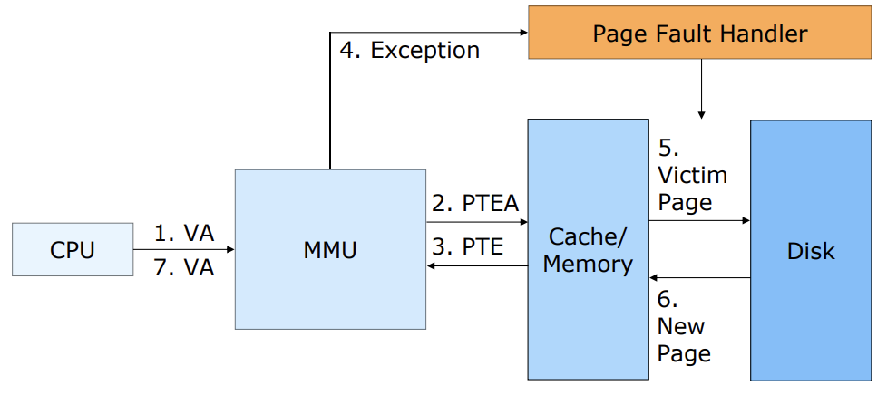</div>

#### Q3. Which block to replace upon a virtual memory miss?

- **LRU**，具体会用到一个使用位 / 引用位 (use/reference bit)。
- 操作系统会周期性地清除使用位，随后又添上去，这样便可以记录一段时间内页的访问情况。

#### Q4. What happens on a write?

- **Write-back strategy（写回）**
    - 内存和处理器访问时间的差异很大，所以不可能使用写穿策略
    - 使用 1 个**脏位**(dirty bit)，允许数据块在因从硬盘读取而被改变的时候写入到硬盘中

### 2. Page Table (Address Translation)

- **Page tables 太大，无法放进内存**
    - **E.g.** 32-bit virtual address, 4 KB pages, 4 bytes per page table entry
    - Page table size: $(2^{32}/2^{12})\times 2^2=2^{22} \text{bytes}=4\text{MB}$
- 操**作系统采用多级页表（页表的页表）来节省空间**:
    - one to obtain the physical address from page table
    - one to get the data from the physical address
    正常来说页表需要两次内存访问，访问效率低下，因此需要<u>页表缓存</u>，即 ==TLB==

**Translation lookaside buffer (TLB)**

- Tag: 保存虚拟地址 (VPN)
- Data: 保存物理页编号 (PPN), protection field, valid bit, use bit, dirty bit

!!! example "TLB example"

    CPU 发出虚拟地址：

    1. VPN 并行发送到所有标签
    2. 检查匹配 + 保护位检查
    3. 命中 → 输出 PPN
    4. PPN + Offset = 物理地址 

    <div style="text-align: center">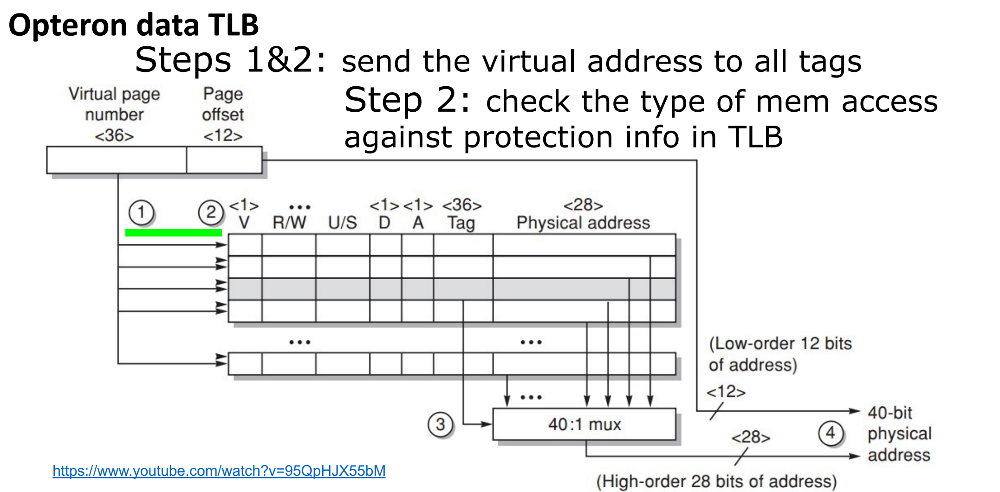</div>

    <div style="text-align: center">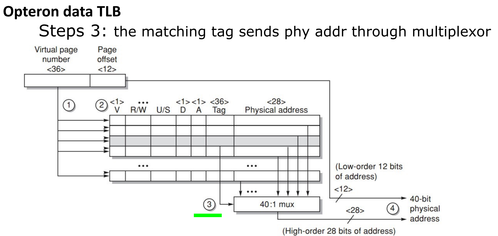</div>

    <div style="text-align: center">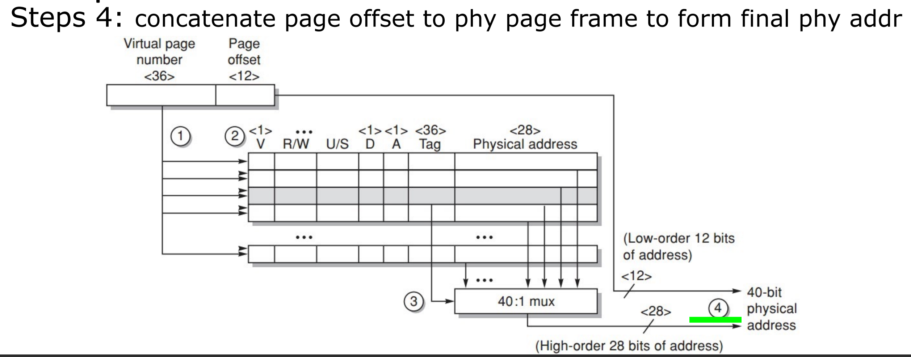</div>

### 3. Page Size Selection

- Pros of ==larger== page size
    - 页表的大小和页的大小成反比，因此内存可以通过增大页的大小来节省空间
    - 页更大，所以 cache 命中的时间更短（需要遍历的页更少）
    - 一次搬运更多的数据，所以更高效，小页可能需要搬运多次
    - 更多的内存能被有效映射，TLB miss 次数更少
- Pros of ==smaller== page size
    - Conserve storage
        When a contiguous region of virtual memory is not equal in size to a multiple of the page size, a small page size results in less wasted storage.
        减少对内存的使用，内部碎片更少
- Use both: **multiple page sizes**

!!! info "Address Translation"

    <div style="text-align: center">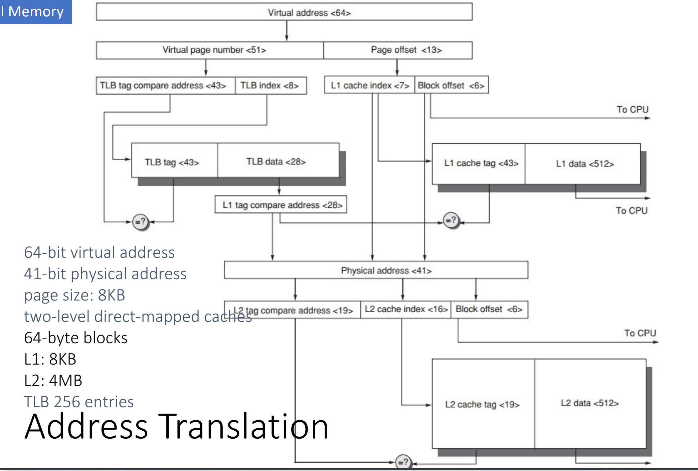</div>

---

## Part 2.Memory Advances

## 2.5 Ten advanced optimizations

核心目标：减小 average memory access time
需要优化的指标：<u>hit time, miss rate, miss penalty, cache bandwidth, power consumption</u>

!!! abstract

    - **减少命中时间**（Reduce hit time）
        - <u>small and simple first-level caches & way prediction</u>（also decrease power)
        - avoid address translation; trace cache
    - **增加高速缓存带宽**（Increase cache bandwidth）
        - <u>pipelined, multibanked and non-blocking cache; </u>
    - **减少失效损失**（Reduce miss penalty） 
        - <u>critical word first; merging write buffers;</u> victim caches
        - mutilevel caches, read miss prior to writes
    - **减少失效率**（Reduce miss rate）
        - <u>compiler optimizations</u>; decrease power; 
        - larger block size, large cache size, higher associativity
    - **通过并行减少失效损失或失效率**（Reduce miss penalty/rate via parallelism）
        - <u>hardware/compiler prefetching</u>; increase power;

??? example "补充：trace cache & victim cache"

    - Trace cache：根据 CPU 的实际执⾏情况来设计 cache，它存储**动态执行的指令序列**（即 trace）
        - 其工作原理如下：
            - 记录执行路径：当处理器执行程序时，追踪高速缓存会“观察”并记录实际执行过的指令序列，包括那些跨越了分支的指令。
            - 存储追踪：这些动态执行的指令序列（追踪）被存储在追踪高速缓存中。一个追踪可以包含来自不同内存地址的指令，但它们在逻辑上是连续执行的。
            - 预测与命中：当处理器需要获取指令时，它会尝试在追踪高速缓存中查找一个匹配的追踪。如果命中，处理器就可以一次性获取一个较长的、已经排好序的指令序列，而无需担心分支预测和指令获取的停顿。
            - 构建追踪：如果追踪高速缓存失效，处理器会从传统的指令缓存中获取指令，并同时在后台构建新的追踪，以便将来使用。
        - Victim Caches：牺牲缓存 
            - ⼀个容量较⼩的全相联缓存
            - 原缓存块被替换的时候，会把这个块放⼊ victim cache 
            - 如果下次访问的时候发现在 victim cache ⾥，就可以减少 miss penalty

### Opt #1: Small and Simple First-Level Caches

1. ==Small size==
    - **support a fast clock cycle:** 缓存的物理尺寸越小，地址解码、信号传输和数据读取所需的物理路径就越短，从而允许 CPU 保持极高的时钟频率。
    - **reduce power:** 容量小意味着存储单元少、连线短。在进行读写操作时，需要充放电的电容更小，从而显著降低了动态功耗。
2. ==Lower associativity==
    - **reduce both hit time and power:** 高相联度需要在读取时并行比较多个 Tag，并使用复杂的 Multiplexer 来挑出正确的数据，这会增加延迟和功耗。
    - **直接映射的特殊优势:**
        - 相联度为 1，硬件可以**将“Tag 检查”和“数据传输”重叠进行**。
        - **工作原理：** CPU 根据 Index 找到位置后，直接读出数据送往 CPU，同时比对 Tag。如果 hit，直接使用数据，速度极快；如果 miss，直接丢弃读出的数据即可。

### Opt #2 : Way Prediction

==Reduce conflict misses and hit time==
在普通的 $N$ 路组相联缓存中，需要并行读取 $N$ 个 Tag，比较后通过 MUX 挑出正确的数据。这很费时间。路预测引入了 **“预判”机制**：

- **Block Predictor Bits:** 在缓存块中额外存储一些位，用来记录上一次访问的特征，从而预测下一次访问该 Index 时，数据最可能在 $N$ 路中的哪一路
- **MUX set early:** 根据预测结果，硬件提前把 MUX 指向猜中的那一路
- **并行操作:**  
    - 读数据: 按照预测的路径直接读出数据
    - **比对 Tag:** 只进行**一次** Tag 比较（只比对猜的那一路）

!!! bug "Misprediction"

    路预测并不总是准确的。如果 Tag 比对发现猜错了（Miss）：

    - **补救措施:** 在**下一个时钟周期**，硬件会去检查该 Set 里的其他几路。
    - **代价:** 这种情况下会产生额外的延迟。但由于程序的局部性，预测准确率通常很高（常在 80%-90% 以上），所以平均下来的性能收益非常可观。

### Opt #3 : Pipelined Access & Multibanked Caches

==Pipelined Access==：将原本一个周期完成的缓存访问动作，拆分成多个小的流水线阶段

- **优点：Increase Bandwidth** 
  虽然完成一次完整的访问可能变慢了，但由于变成了流水线，每个时钟周期都可以送入一个新的访问请求，总体时间变快。（类比 CPU 流水线）
- **缺点：**
    - **Higher latency：** 之前 1 个周期能拿到的数据，现在可能需要 2 或 3 个周期
    - **分支预测失败代价变大：** 如果 CPU 猜错了指令跳转方向，由于缓存访问流水线变深了，清空并重新填充流水线的代价更高
    - **Load-Use 延迟增加：** CPU 发出 Load instruction 到 Use data 之间隔了更多的时钟周期，这给编译器调度代码增加了难度
    ==Multibanked Caches==：把一个大的缓存拆成几个互相独立的 Banks
- 缓存被分成多个 Bank，每个 Bank 都有自己独立的读写电路。
    - **顺序交叉编址 (Sequential interleaving)：** 为了让数据分布得更均匀，地址被交叉存放在不同的 Bank 中

<div style="text-align: center">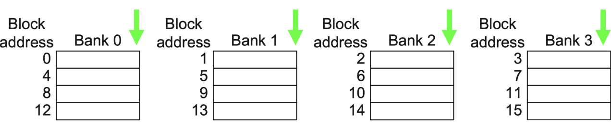</div>

- **优势：支持并发访问 (Simultaneous accesses)** 
  如果 CPU 同时发出两个请求，只要访问的是**不同的 Bank**，这两个请求就可以在同一个周期内**并行完成**。这极大地提高了缓存的带宽。
- **局限性：Bank Conflict** 
  如果两个请求不幸撞到了同一个 Bank，只能排队处理

### Opt #4 : Nonblocking Caches

- **Increase cache bandwidth**
在传统的“阻塞缓存”中，一旦发生 Cache Miss，整个缓存甚至 CPU 就会陷入停顿，直到数据从主存取回。非阻塞缓存利用了**乱序执行 (Out-of-order execution)** 的特性，允许缓存在等待缺失数据返回的同时，继续处理后续的请求。
- **Hit under miss (一失一中):** 
  当一个访问缺失正在处理时，允许后续的访问如果命中，则直接返回结果
- **Miss under miss (双失并发):** 
  允许在处理一个缺失的同时，开始处理另一个缺失
- **Hit under multiple misses (多失一中):** 
  即使有多个缺失正在排队处理，依然能给命中的请求提供数据

### Opt #5 : Critical Word First 

- **Reduce miss penalty**
==Critical Word First==
- **流程**：告诉内存控制器，“别按顺序从块头开始传，**先把我要的那个字传过来**”
    1. 内存首先发送被请求的那个字（Critical Word）
    2. 一旦这个字到达，立即送往 CPU，**CPU 马上恢复执行**
    3. 与此同时，内存继续把该块中剩余的字填满缓存
- **优点：** 理论上能最大程度减少 CPU 的等待时间

==Early Restart==：这是相对折中、实现起来更简单的一种方案

- **流程**：依然按照内存块的**正常顺序**（从头到尾）进行传输
    1. 内存按顺序传：Word 0, Word 1, Word 2...
    2. 一旦传输过程中，**正好传到了 CPU 请求的那个字**，硬件立刻把这个字递给 CPU
    3. **CPU 恢复执行**，而内存继续把剩下的部分传完
- **对比：** 如果 CPU 想要的恰好是 Word 0，那它和“关键字优先”一样快；如果 CPU 想要的是最后一个 Word，那它就起不到加速作用

### Opt #6 : Merging Write Buffer

!!! question "什么是写缓冲 (Write Buffer)？"

    当 CPU 执行写指令时，内存速度太慢。为了不让 CPU 等待，硬件会先将数据放入 **写缓冲 (Write Buffer)**。CPU 继续工作，由写缓冲负责在后台慢慢把数据写回下一级存储。

    - 如果 CPU 写入 buffer 的速度太快，其容量有限且处理得不够快，缓冲区就会被填满。Buffer 填满后，CPU 必须**停顿 (Stall)** 等待空间释放。这就产生了额外的“缺失惩罚”。

<div style="text-align: center">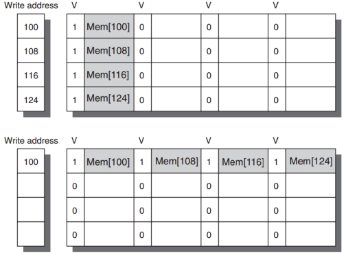</div>

- **未合并：** CPU 发出了四次连续的写操作，硬件给每个写操作都单独分配了一个缓冲条目 (Entry)。虽然这些地址在物理上是连续的（都在同一个 Cache Line 内），但它们**占用了 4 个槽位**。
- **合并后：** 硬件 b 把四个条目，全部塞进同一个条目中。现在，这四个数据只**占用 1 个槽位**。

### Opt #7 : Compiler Optimization

- **Reduce miss rates, w/o hw changes**

#### Tech 1: ==Loop interchange== 

- exchange the nesting of the loops to make the code access the data in the order in which they are stored

```c
/*Before*/
for(j = 0; j < 100; j++)
	for(i = 0; i < 5000; i++)
		x[i][j] = 2 * x[i][j];		
/*After*/
for(i = 0; i < 5000; i++)
	for(j = 0; j < 100; j++)
		x[i][j] = 2 * x[i][j];
```

`x[i][j]` and `x[i][j+1]` are **adjacent**

#### Tech 2: Blocking 

!!! example "Matrix Multiplication"

    `x = y*z;` both row&column accesses

    ```c
    /*Before*/
    for(i = 0; i < N; i++)
    	for(j = 0; j < N; j++){
    		r = 0;
    		for(k = 0; k < N; k++)
    			r = r + y[i][k] * z[k][j];
    		x[i][j] = r;
    	}
    ```

    - **矩阵 $y$：** 每一行被读取一次，具有较好的空间局部性
    - **矩阵 $z$：** 每一列被读取一次。由于内存通常是**按行存储**的（Row-major），按列读取意味着地址在内存中是“跳跃”的

     <div style="text-align: center">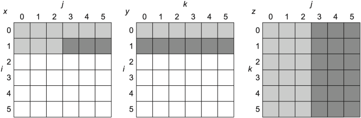</div>

    - **问题：** 如果矩阵非常大（超过了缓存容量），那么当程序完成一次内层循环、准备重用之前的数据时，那些数据可能已经被新的数据踢出缓存了。这种因为缓存容量不足导致的缺失称为**容量缺失（Capacity Miss）**

!!! note "solution"

    **Blocking**：不再一次处理整行或整列，而是把大矩阵切成**子矩阵（Submatrices / Blocks）**

    <div style="text-align: center">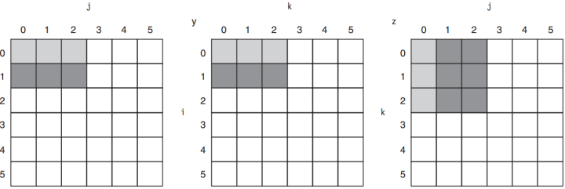</div>

    - **尺寸匹配**：这个“小块”的大小是经过精确计算的，确保这一块数据能完全放入缓存（比如 L1 或 L2）
    - 程序在这一小块数据上完成所有的计算逻辑后再移动到下一块（maximize accesses to loaded data before they are replaced）

### Opt #8 : Hardware Prefetching

- **Reduce miss penalty/rate**
- 将数据预先存入 **Cache** 或一个专门的**外部缓冲 (External Buffer)**

!!! tip "Instruction Prefetch"

    - **Fetch two blocks on a miss**： 
      当发生一次指令缓存缺失时，硬件不只取回请求的那个块，还会把**下一个物理块**也取回来
    - **Instruction Stream Buffer**：
        - 请求的块放进 Cache，预取的“下一块”放进一个专门的缓冲区（Stream Buffer）
        - 如果下一次取的块在 buffer 里，硬件会**直接**从 Stream Buffer 里读

    Similar **Data prefetch** approaches

### Opt #9 : Compiler Prefetching

**Reduce miss penalty/rate**

- **寄存器预取 (Register prefetch)**：
  将数据直接读入寄存器，相当于提前执行了一条 Load 指令
- **缓存预取 (Cache prefetch)**：
  将数据搬运到缓存（L1/L2）中，不占用寄存器。这是最常用的方式，因为它不会增加寄存器压力（Register Pressure）。
- **目的**：在 CPU 真正执行计算指令前，数据已经处于缓存中，从而将内存延迟“隐藏”在其他计算指令的执行时间里

!!! example

    ```c
    for(i = 0; i < 3; i++)
    	for(j = 0; j < 100; j++)
    		a[i][j] = b[j][0] * b[j+1][0];
    ```

    - 16-byte blocks; 
    - 8-byte elements for a and b; 
    - write-back strategy; 
    - a\[0\]\[0\] miss, copy both a\[0]\[0],a\[0]\[1] as one block contains 16/8 = 2;

!!! bug "缺失计算分解："

    1. **数组 `a[i][j]`：**
        - 总访问次数：$3 \times 100 = 300$ 次
        - 由于每 2 个相邻元素占用 1 个块，所以每 2 次访问发生 1 次缺失
        - **$a$ 的总缺失：** $300 / 2 = 150$ 次

    2. **数组 `b[j][0]` 和 `b[j+1][0]`：**
        - 注意这里访问的是 $b$ 的同一列的不同行。在行优先存储中，这意味着地址跨度非常大
        - 从 `b[0][0]` 到 `b[100][0]`，这 101 个元素由于分布在不同的行，几乎每个元素都会触发一次缺失
        - **$b$ 的总缺失：** $101$ 次
    3. **总计：** $150 + 101 = 251$ 次缺失

!!! tip "solution"

    ```c
    for (j = 0; j < 100; j++){
    	prefetch(b[j+7][0]);
    	prefetch(a[0][j+7]);
    	a[0][j] = b[j][0] * b[j+1][0];
    }
    for (i = 1; i < 3; i++)
    	for (j = 0; j < 100; j++){
    		prefetch(a[i][j+7]);
    		a[i][j] = b[j][0] * b[j+1][0];
    	}
    }
    ```

    在优化后的代码中，编译插入了 `prefetch(b[j+7][0])`

    - **逻辑：** 因为内存缺失代价（100 CC）远高于单次循环时间（约 7-9 CC）。我们需要提前足够多的迭代次数发出请求，确保数据在 $j+7$ 次循环开始时刚好送达。
    - **代价：冷启动缺失 (Cold Misses)**     
        - 对于 $b$：前 7 次循环（$j=0 \dots 6$）依然会缺失，因为预取还没完成。**共 7 次缺失**。

        - 对于 $a$：每一行（$i=0, 1, 2$）的前 7 个元素也会有初始缺失。由于每块存 2 个元素，前 7 个元素涉及 4 个块（$[0,1], [2,3], [4,5], [6]$）。

        - **每行缺失 4 次**，三行共 $4 \times 3 = 12$ 次

    - **优化后的总缺失：** $7 + 12 = 19$ 次

### Opt #10 : HBM

**HBM（High Bandwidth Memory）** 的特点：

- 比 DRAM 快，但比 SRAM 慢
- 比 DRAM 小，但比 SRAM 大得多
- 带宽极高（堆叠式设计）

<div style="text-align: center">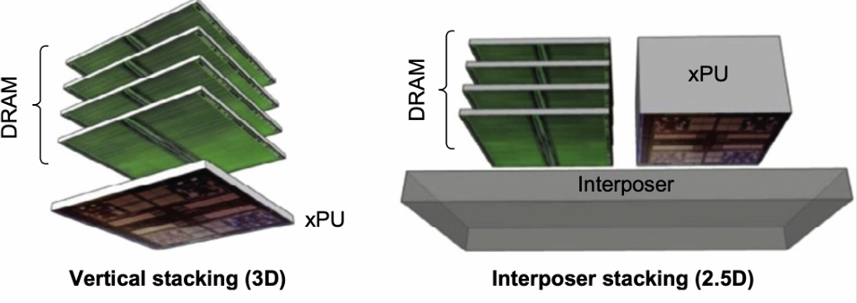</div>

!!! bug "HBM 作为 L4 的缺点"

    - Tag 的开销太大： 以 1 GiB L4 cache 为例
        - 64 B block size -> 96 MiB of tags，占用空间太大
        - 4 KiB block size -> 1 MiB of tags，内部碎片太大
    - 基本方案（两次访问 DRAM）
        - one for tags (address translation) 
        - one for data (tag comparison)

==Optimization 1==: **place tags and data in the same row** 

- 打开一行需要消耗很长的时间，但访问已经打开的行只需要 1/3 的时间 
- Tag 和 Data 在同一行，打开一次行就能同时获取两者
==Optimization 2==: **alloy cache**（合金缓存） 
- 直接把 tag 和 data 捆绑存储，并采用 direct mapped 的 cache 结构
- 利用 HBM 的**突发传输**特性，一次读取同时拿到 Tag 和 Data，把两次访问合并为一次

**Miss 的处理与加速**

- HBM miss requires two DRAM accesses 
    1. 读取主内存的 Tag（地址翻译）
    2. 读取主内存的数据
- **加速 Miss 检测的两种方法**：
    1. Map 追踪：维护一个映射表，记录哪些块在 Cache 中
    2. 预测器：根据历史访问模式预测 likely misses

### Summary

<div style="text-align: center">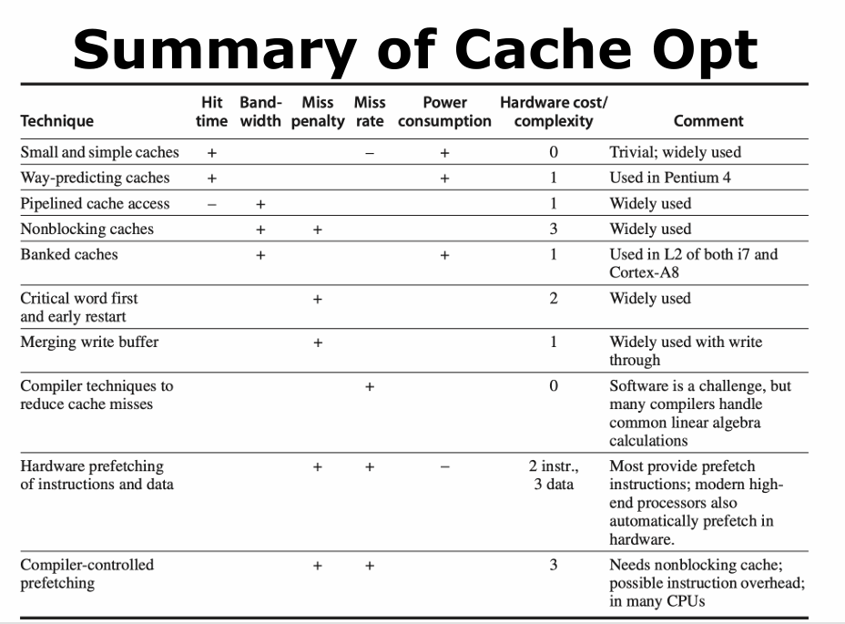</div>

---

## 2.6 Virtual Memory

虚拟内存的好处：

- Easier/flexible memory management
- Share a smaller amount of physical memory among many processes
- Physical memory allocations need not be contiguous
- memory protection; process isolation
- Introduces another level of secondary storage

<div style="text-align: center">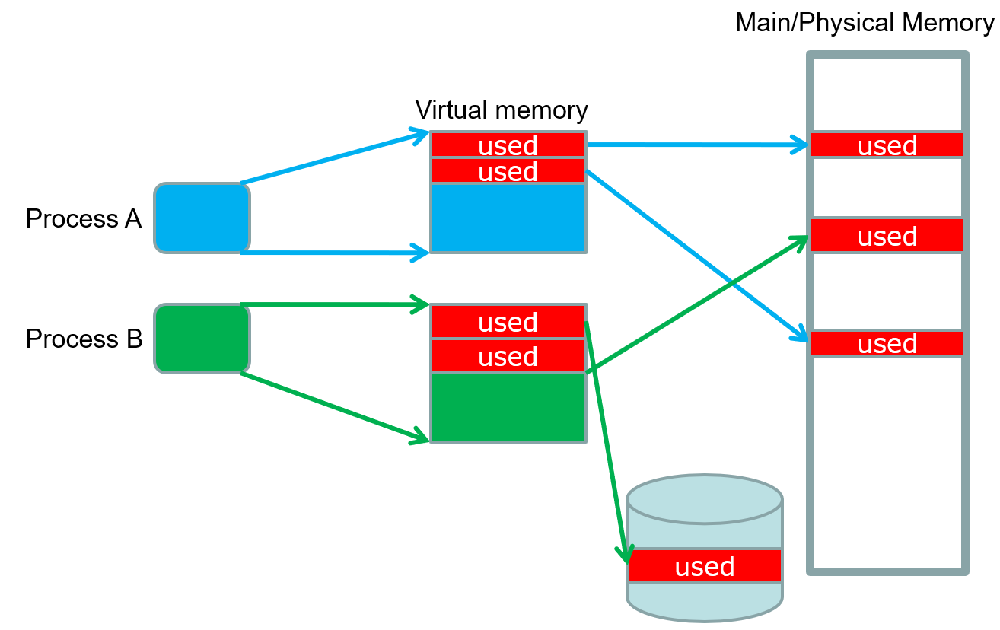</div>

### Four tasks for the architecture

该架构必须限制用户进程在运行期间可访问的资源，同时允许操作系统进程访问更多资源

#### Task 1 

硬件必须支持至少两种运行模式。  

- **用户模式（User Mode）**：普通应用程序运行在此模式下。在此模式下，程序的指令集受到限制，不能执行一些高风险的特权指令（如直接操作硬件、修改内存管理单元等）。
- **内核/监督者模式（Kernel/Supervisor Mode）**：操作系统内核运行在此模式下。拥有最高权限，可以执行所有指令，访问所有内存区域。

#### Task 2

提供一部分处理器状态，用户进程可以“读”但不能“写”。  

- 这通常指的是某些特殊的寄存器或状态位
- **读取（Read）**：用户程序可能需要读取某些系统状态信息（例如，获取当前时间戳或系统配置）
- **禁止写入（Not Write）**：用户程序绝对不能修改这些状态，否则可能改变系统的运行环境或绕过安全限制

#### Task 3

**提供在用户模式和监督者模式之间切换的机制  

- **用户态 → 内核态（System Call）**：这是最常见的情况。当用户程序需要操作系统提供服务时（例如读写文件、申请内存），它会通过**系统调用（System Call）** 触发一个特殊的中断或陷阱（Trap），强制 CPU 切换到内核模式，将控制权交给操作系统。
- **内核态 → 用户态**：操作系统完成请求的服务后，会执行返回指令，将 CPU 切换回用户模式，把控制权还给用户程序

#### Task 4

**提供机制限制内存访问，保护进程状态**，且无需在上下文切换时将进程换出到磁盘。  

- **内存访问限制**：硬件（如内存管理单元 MMU）会检查每一次内存访问请求。如果用户进程试图访问不属于它的内存区域，硬件会立即产生一个“段错误”或“访问违规”异常，由操作系统处理（通常是终止该进程）。
- **无需换盘（Swap to Disk）**：这是一个关键点。它强调这种保护是实时的、基于硬件的检查，而不是依靠软件定期将内存数据写入磁盘来保存状态。这意味着即使在内存中同时运行多个进程，它们也是互相隔离的，不需要为了切换进程就把前一个进程的数据先存到硬盘上。

---

## 2.7 Virtual Machines

- **Virtual Machine** 
    - a protection mode with a much smaller code base than the full OS 
- **VMM**: virtual machine monitor hypervisor
    - software that supports VMs 
- **Host** underlying hardware platform

### 2.7.1 Virtual Machines

Properties/Benefits 

1. A single computer runs **multiple** VMs and can support a number of **different** OSes 
2. Multiple OSes all share the hardware resources

### 2.7.2 VMM

**Three essential characteristics**: 

- Mainly for security and privacy sharing and protection among multiple processes
1. **环境一致性**：VMM provides an environment for programs which is essentially **identical** with the <u>original machine</u>; 
2. **性能高效性**：Programs run in this environment show at worst only minor decreases in speed; 
3. **资源控制权**：VMM is in **complete control** of system resources; 

**Privilege Requirements** 

1. At least two processor modes, <u>system</u> and <u>user</u> 
2. A privileged subset of instructions that is available <u>only in system mode</u>, resulting in a trap if executed in user mode; 
all system resources must be controllable only via these instructions

---

## 2.8 Examples

### 2.8.1 ARM Cortex-A 53

- ARMv8-A ISA 
- 32-bit / 64-bit mode 
- 2-instr/clock, clock rate up to 1.3 GHz 
- IP (intellectual property) core. 
    - Hard cores: optimized for a particular semiconductor vendor and cannot be modified
    - Soft cores: use a standard lib of logic elements and can be compiled/modified for different semiconductor vendors

#### Memory Hierarchy

- Two-level TLB 
- Two-level cache 
- LRU-approximation replacement policy

<div style="text-align: center">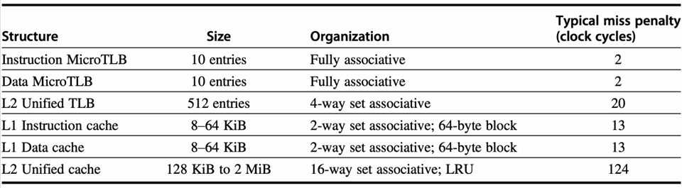</div>

#### Instruction Access Path

- 32 位虚拟地址系统如何映射到 64 KB 大页，并进一步映射到一个 32 KB、64 B 块大小、2 路组相联的 L1 缓存中
- 来源：取指单元（IFetch），只读不写
- 只有 L1 指令缓存和一级 TLB

<div style="text-align: center">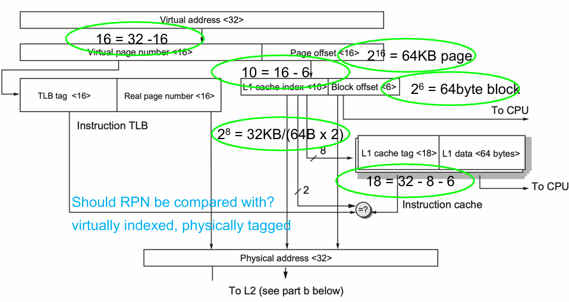</div>

!!! info "工作原理"

    TLB 的工作原理：负责“翻译”，把虚拟地址的高位转换成物理地址的高位。

    - **输入：** 虚拟地址的高 16 位（即 **虚拟页号**）
    - **动作：**
        - TLB 拿着这 16 位去和自己的标签阵列进行比对。
        - 如果找到了（TLB Hit），它就会输出对应的 **物理页号**（图中为 16 位）
    - **输出：** 物理页号。这个信号会传到 Cache 那里，准备进行最后的“身份核验”

    L1 Cache 的工作原理：负责“取货”，利用虚拟地址的低位（页内偏移）直接找数据

    - **输入：** 虚拟地址的中间 10 位（即 **Cache 索引**）和低位 6 位（块偏移）。
    - **动作（并行查找）：**
        - **索引定位：** Cache 利用那 **10 位索引**，直接定位某一个“组”。（因为是 2 路组相联，所以这个组里有 2 行数据）。
        - **读取数据与标记：** Cache 把这 2 行里的 data（64字节）和**Tag**（18位）都读出来。
            - _注意：这里的Tag是物理地址的高位部分，不是虚拟地址。_

    “握手”时刻：比较
    这是图中蓝色文字 `Should RPN be compared with?` 和下方比较器（那个半圆圈符号）的核心所在。

    - **问题：** Cache 刚才读出来的数据，真的是 CPU 想要的那个地址的数据吗？
    - **解决：**
        - Cache 里存的是**物理标记**（18位）。
        - TLB 刚刚翻译出来的是**物理页号**（16位）。
        - **拼接：** 系统会把 TLB 输出的 **16位物理页号** 加上虚拟地址中间的 **2位**（图中 18=16+2），拼成一个 18 位的物理标记。
        - **比对：** 将拼好的这个 18 位物理地址，与 Cache 里读出来的 18 位标记进行比对。

     TLB 负责算出“物理地址的前半部分”，Cache 负责根据“虚拟地址的后半部分”把货找出来，最后两者碰头确认“这货是不是你要的”。

#### Data Access Path

- 来源：加载/存储单元（Load/Store），既读又写
- 包含 L1 数据缓存 + L2 统一缓存
- 包含多级 TLB：L1 DTLB + L2 TLB（Unifield L2 TLB）

<div style="text-align: center">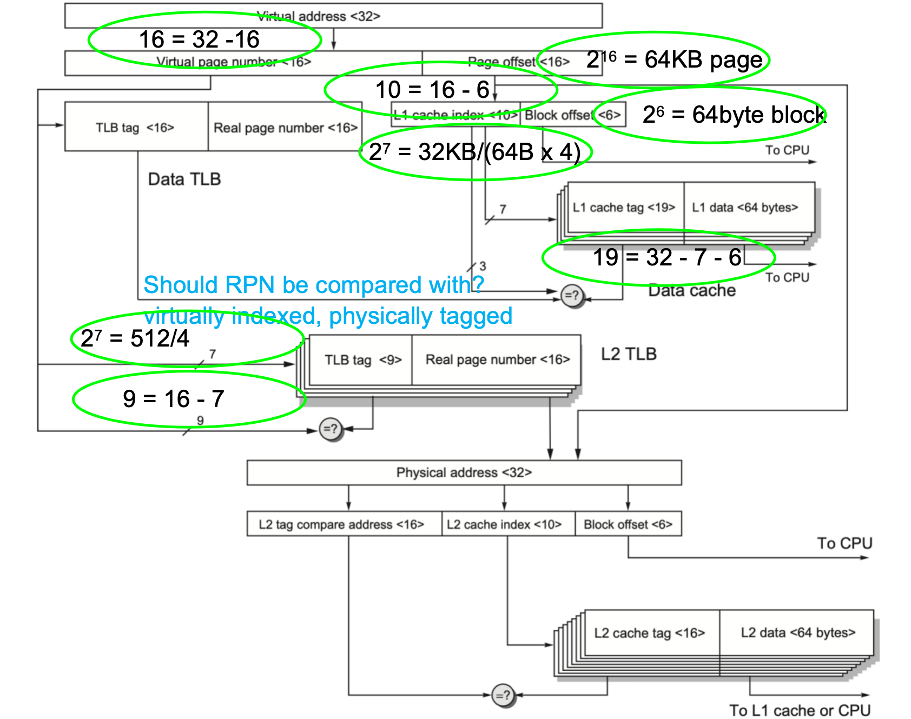</div>

!!! info "工作流程"

    这条“路径”包含以下几个关键步骤：

    1. 起点（虚拟地址）： CPU 发出一个虚拟地址（比如 0x00401234）。
    2. 分流（并行处理）：
        - 高位（页号）： 走向 TLB（快表），进行地址翻译，把虚拟页号变成物理页号。
        - 中低位（索引+偏移）： 走向 L1 Cache（一级缓存），直接定位到缓存的具体位置（这就是 VIPT 技术）。
    3. 汇合与验证： TLB 翻译出的物理页号与 Cache 里读出的标签（Tag）进行比对。
    4. 命中（Hit）或缺失（Miss）：
        - 命中： 数据直接从 L1 Cache 传给 CPU（路径结束，速度极快）。
        - 缺失： 路径延长，L2 Cache -> 还没找到 -> 主内存（RAM）-> 填入 Cache -> 传给 CPU

### 2.8.2 Intel Core i7-6700

- 64-bit x 86-64 ISA 
- out-of-order 4-core processor 
- multiple issue, dynamically scheduled, 16-stage pipeline 
- up to 4 instructions per cycle per core
- 4.0 GHz 
- peak rate of 16 billion instructions per second per core
- up to 3 parallel memory channels 
- DDR3-1066 
- peak memory bandwidth of 25+ GB/S 
- 48-bit virtual addresses 
- 36-bit physical addresses -> 36 GiB 
- two-level TLB

<div style="text-align: center">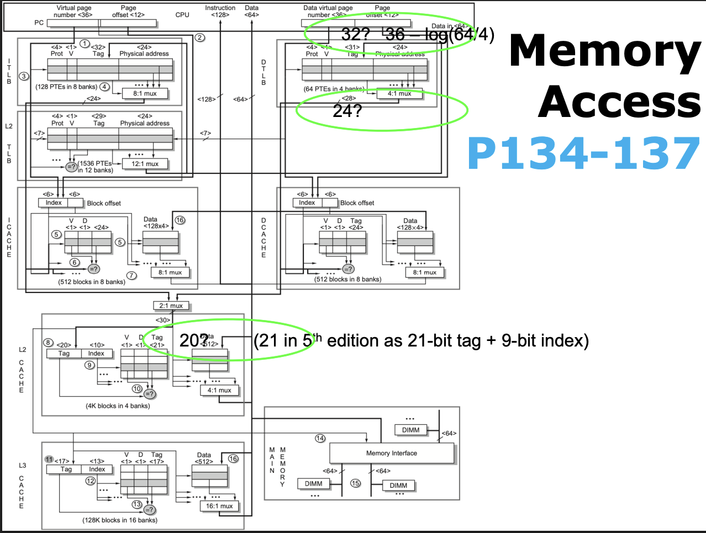</div>
