# Instruction-Level Parallelism

==指令级并行(intruction-level parallelism, ILP)==，它允许指令能够被并行计算

## Static Parallelism

## 3.1 Pipeling

(ideal) Balanced Pipeline: Equal-length pipe stages/segments

$$
\text{Time per insturction by pipeline} = \frac{\text{Time per instr on unpipelined machine}}{\text{Number of pipe stages}}
$$

$$
\text{Speed up by pipeline} = \text{Number of pipe stages}
$$

<div style="text-align: center">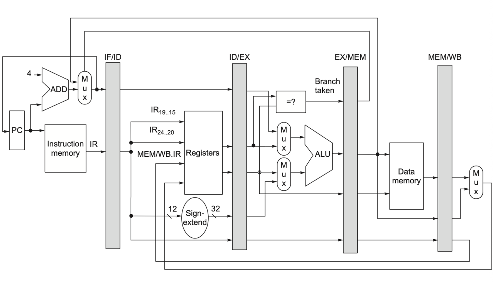</div>

| 流水线寄存器 | 存储内容                                                  |
| :----- | :---------------------------------------------------- |
| IF/ID  | 指令 (32 bit) + PC/NPC (32 bit)                         |
| ID/EX  | 指令 (32) + PC (32) + A (32) + B (32) + Imm (32) + 控制信号 |
| EX/MEM | 指令 (32) + ALU 结果 (32) + B (32) + cond (1) + 控制信号      |
| MEM/WB | 指令 (32) + ALU 结果 (32) + LMD (32) + 控制信号               |

## 3.2 Data Hazard & Forwarding

| Situation                         | Example code sequence &nbsp;&nbsp&nbsp;;&nbsp;&nbsp;                             | Action                                                                                                                                                      |
| :-------------------------------- | :------------------------------------------------------------------------------- | :---------------------------------------------------------------------------------------------------------------------------------------------------------- |
| No dependence                     | `ld x1, 45(x2)`  <br>`add x5, x6, x7`  <br>`sub x8, x6, x7`  <br>`or x9, x6, x7` | No hazard possible because no dependence exists on $x_1$ in the immediately following three instructions                                                    |
| Dependence requiring stall        | `ld x1, 45(x2)`  <br>`add x5, x1, x7`  <br>`sub x8, x6, x7`  <br>`or x9, x6, x7` | Comparators detect the use of $x_1$ in the add and stall the add (and sub and or) before the add begins EX                                                  |
| Dependence overcome by forwarding | `ld x1, 45(x2)`  <br>`add x5, x6, x7`  <br>`sub x8, x1, x7`  <br>`or x9, x6, x7` | Comparators detect use of $x_1$ in sub and forward result of load to ALU in time for sub to begin EX                                                        |
| Dependence with accesses in order | `ld x1, 45(x2)`  <br>`add x5, x6, x7`  <br>`sub x8, x6, x7`  <br>`or x9, x1, x7` | No action required because the read of $x_1$ by or occurs in the second half of the ID phase, while the write of the loaded data occurred in the first half |

<div style="text-align: center">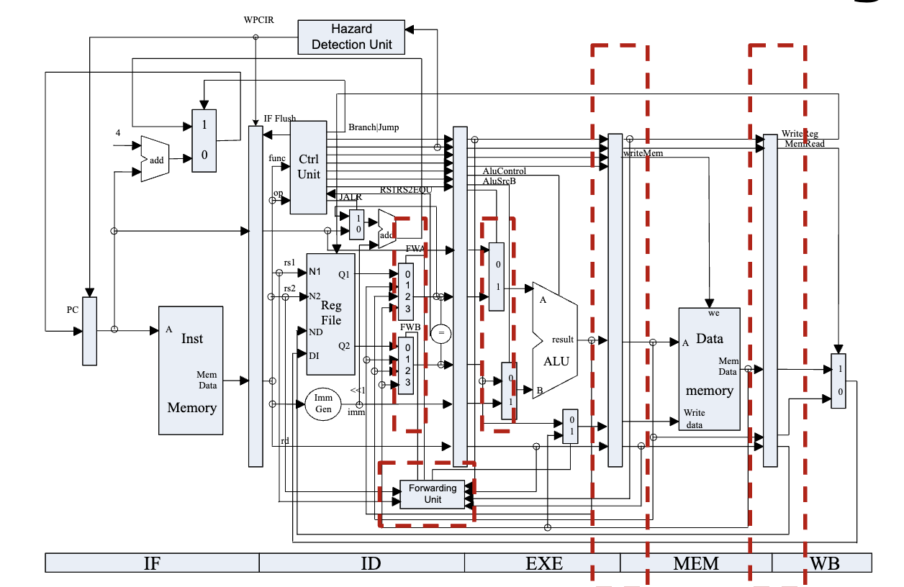</div>

---

## 3.3 FP Operation

**Floating-point (FP) operations** take more time than integer operations do

!!! question "How to complete an FP op in 1 cc?"

    方案1:降低时钟频率(a slow clock) 

    - 缺陷: slow down integer ops (整数运算性能被严重拖累) 
    - 整数运算占程序执行的绝大多数,为了少数浮点运算,让所有整数指令的时钟周期翻倍/数倍, 整体性能暴跌,完全得不偿失。 

    方案2:堆砌超大规模浮点逻辑(many logic in FP units) 

    - 用超大规模并行逻辑,把浮点运算的多步操作压缩到1个周期内完成。
    - 缺陷: manufacturing hardness & expensiveness 
    - 浮点运算的长逻辑深度无法通过简单并行消除,完全不具备工程可行性

具体解决方案如下；

### 3.3.1 Multicycle FP Operation 

- FP pipeline allow for <u>a longer latency</u> for op; 
    - 执行阶段（EXE）耗时超过 1 个时钟周期（take > 1 cc for EXE）
- two changes over integer pipeline: 
    - repeat EX; 
    - use multiple FP functional units; e.g., FP adder, FP divider

### 3.3.2 FP Pipeline

<div style="text-align: center">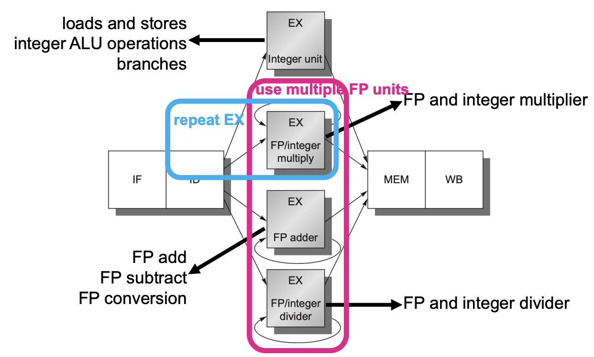</div>

- Repeat EX：这表示一条指令可以在执行阶段停留多个周期
- use multiple FP units：为了不让慢速指令阻塞快速指令，硬件被拆分成了并行的路径

**数据流向解析**

1. **指令分发**：指令经过 IF 和 ID 后，硬件会根据指令的类型，将其送到对应的 EX 单元
2. **并行执行**：
    - 假设此时有一条整数加法指令和一条浮点除法指令同时进入 EX 阶段
    - 整数加法去最上面的 Integer unit，1 个周期就做完走了
    - 浮点除法去最下面的 Divider，它在那里慢慢算，可能还要待很久
3. **汇聚写回**：指令执行完后会汇聚到一起，进入 MEM 和 WB 阶段，将结果写回寄存器

!!! info "EX is not pipelined"

    - Until the previous instruction leaves EX, **no other** instruction using that functional unit may issue 
    - If an instruction cannot proceed to EX, the entire pipeline behind that instruction will be **stalled**

### 3.3.3 Latency & Ini/Repeat Interval

==延迟（Latency）==：“the number of **intervening cycles** between an instruction that produces a result and an instruction that uses the result”

- **“数据依赖”的等待时间**，下一条指令为了拿到正确的数据，需要额外等多久
- 假设指令 1 是 `ADD F1, F2, F3`，指令 2 是 `ADD F4, F1, F5`，指令 1 在 EX 阶段一算出结果，硬件就可以利用 Forwarding 把数据送回 ALU 的输入端。指令 2 刚好在这个时候进入 EX 阶段。整个过程不需要任何额外等待，所以延迟是 0
==启动间隔 / 重复间隔（Initiation / Repeat Interval）==：“the number of cycles that must **elapse** between issuing two operations of a given type”
- **吞吐率的倒数**，即“多久能发射下一条同类指令”
- 衡量的是**硬件部件的吞吐能力和流水线化程度**
- 假设连续执行两条浮点除法指令
    - 如果EX is not pipelined，那么必须等前一条算完，下一条才能进入

关于两者的计算：

1. $\text{Latency} = \text{FU Time} - 1\text{cc}$
2. 如果 FU 完全流水化，initiation interval 为 $1$ 
   如果 FU 非流水化，那么 initiation interval 就是 $\text{latency} + 1$

| Functional unit                     | Latency | Initiation interval | Explain                    |
| :---------------------------------- | :------ | :------------------ | -------------------------- |
| Integer ALU                         | 0       | 1                   | 可以通过 forward 传输结果          |
| Data memory (integer and FP loads)  | 1       | 1                   | Load 指令需要等待 1 个周期          |
| FP add                              | 3       | 1                   | 内部是 pipelined              |
| FP multiply (also integer multiply) | 6       | 1                   | 内部是 pipelined              |
| FP divide (also integer divide)     | 24      | 25                  | 内部没有完全流水线化，必须等待指令完全执行并释放资源 |

- 流水线延迟通常比 EX 流水线的深度（即该阶段产生结果需要的周期）<u>少1个周期</u>

!!! example "Examples"

    - **Two (dependent) integer ALU instructions**:

        <div style="text-align: center"></div>

        - Latency: $0$ ,as no intervention to pipeline
        - Initiation interval: $1$ ,as 2nd ADD has to wait for 1 cc after 1st ADD
    - **Two (dependent) instructions: Load + ADD**

        <div style="text-align: center"></div>

        - Latency: $1$, pipeline is intervened at EX stage as ADD.EX has to wait for 1 cc until Load.MEM
    - **Two same-type dependent instructions: Load + Load**

        <div style="text-align: center"></div>

        - Latency: $1$ 
        - Initiation interval: $1$ ,as pipelined func unit & hazard detection till ID

### 3.3.4 Generalized FP Pipeline

- EX is pipelined (except for FP divider)
- Additional pipeline registers e.g., ID/A1, M6/M7

<div style="text-align: center">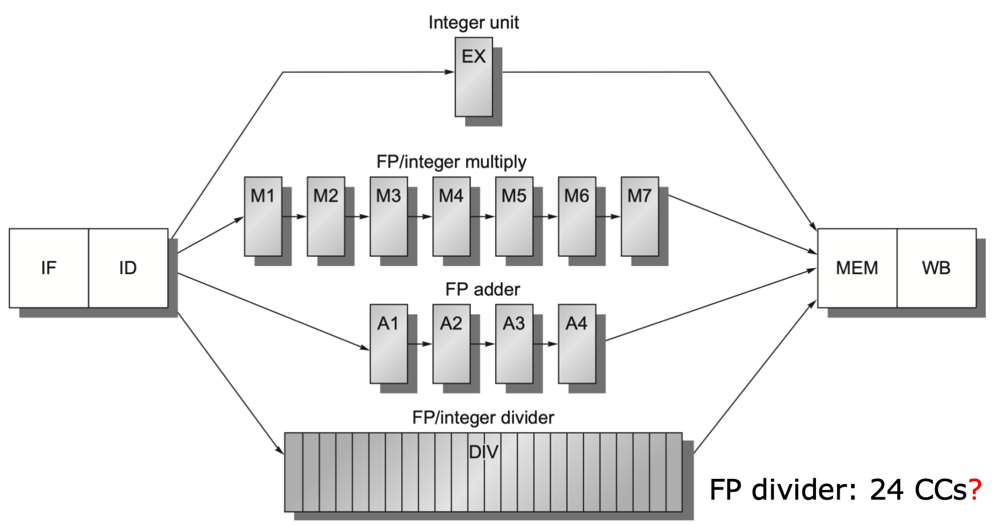</div>

<div style="text-align: center">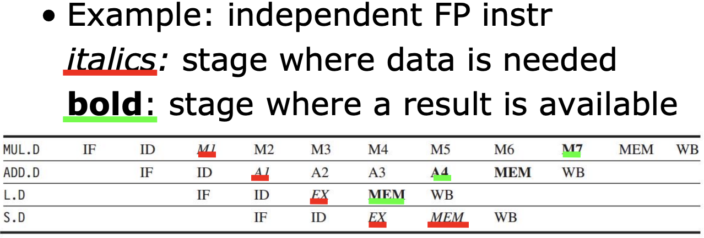</div>

---

## 3.4 FP Pipeline Hazards

Exceptions：Instructions may complete in a different order than they were issued
当处理器采用**多条不同长度的功能单元流水线**（导致指令乱序完成）时，**精确异常**的实现变得非常困难。必须引入复杂的机制来解决指令乱序执行。

### 3.4.1 Structural Hazard

- Divider is not fully pipelined
- Instructions have varying running times, maybe <u>more than one register</u> write in a cycle

<div style="text-align: center">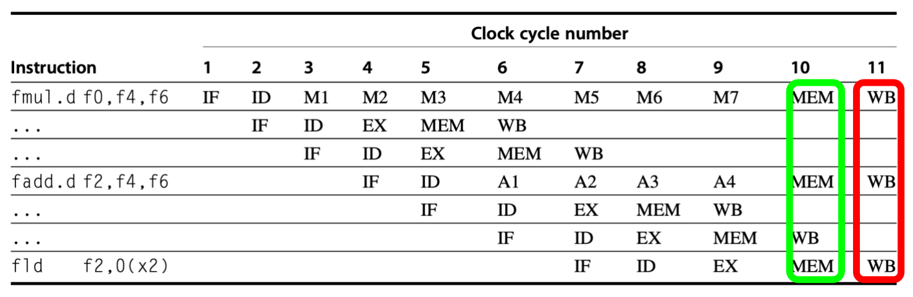</div>

==Interlock Detection（互锁检测）==

- Method 1: track the use of the write port in the **ID stage** and stall an instruction before it issues 
    - 使用一个**移位寄存器**来追踪那些已经发射的指令将在何时使用寄存器文件
    - 如果当前在**指令译码阶段**的指令需要在同一时间使用寄存器文件，那么就让这条新指令暂停，不要进入下一级流水线
- Method 2: stall a conflicting instruction when it **tries to enter MEM/WB**
    - 可以选择暂停正在发射的新指令，也可以暂停已经在流水线里的指令
    - 通常会给**延迟最长**的那个功能单元更高的优先级 (structural hazard, not data hazard)
    - 这种方法更复杂，因为暂停的信号可能来自两个不同的地方（MEM 或 WB）

### 3.4.2 WAW Hazard

- ==Write after write (WAW) hazard==：Instructions no longer reach WB in order

<div style="text-align: center">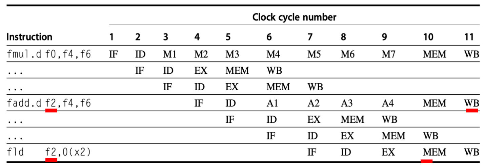</div>

- Solution 1: delay issuing fld
    - 直接在发射阶段（ID/Issue）拦住 `fld`，直到 `fadd.d` 过了 WB 阶段
- Solution 2: zero write control of fadd.d
    - 当 `fadd.d` 到达 WB 时，关闭它的“写使能信号”（置零），不允许指令写入
    - Make sure that fld decides F2 state

### 3.4.3 RAW Hazard

Longer latency of operations: more frequent stalls for ==read after write (RAW) hazards==

<div style="text-align: center">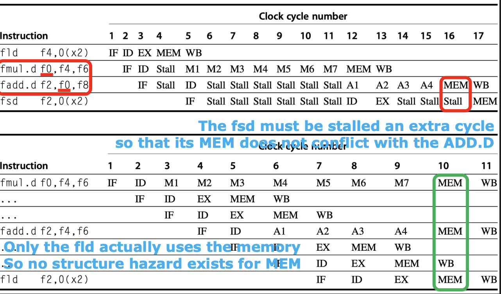</div>

- **数据冒险导致的停顿：**
    - `fmul.d` 需要 `f4`，但 `fld` 还没写回，所以 `fmul.d` 在 ID 阶段停顿
    - `fadd.d` 需要 `f0`，但 `fmul.d` 还没写完，所以 `fadd.d` 也被迫停顿
- **结构冒险导致的停顿：**
    - `fadd.d` 正在执行 MEM 阶段（写回前的内存访问或缓冲阶段）
    - `fsd` 也需要执行 MEM 阶段（写入数据到内存）
    - 如果硬件只有一个内存访问端口或写回总线，这两条指令就会发生冲突。
    - **结果：** "The fsd must be stalled an extra cycle"，以避免在 MEM 阶段发生冲突
- **下半部分**：
    - Only the fld actually uses the memory... So no structure hazard exists for MEM
    - 只有 `fld` 真正使用了内存，所以在 MEM 阶段不存在结构冒险

---

## 3.4 Detect and Solve Hazards

### 3.4.1 Hazard Detection in ID

1. Check for **structural hazards** 
    - **硬件资源冲突**：wait until the required functional unit is not busy (*only for divides*);
    - **写回端口冲突**：make sure the register write port is available when it will be needed
2. Check for **RAW data hazards** 
    - wait until source registers are available when needed --- when they are not pending destinations of issued instructions   
    - 在ID阶段，处理器会检查当前指令需要的源寄存器。它会通过查表（通常叫保留站或状态表）查看这些寄存器是否被之前的指令“预定”，但还没写完
3. Check for **WAW data hazards** 
    - determine if any instruction in A1-A4, D, M1-M7 has the <u>same register</u> destination as this instruction; 
    - if so, stall the issue of the instr in ID（**This is a simplified version;**）
    - **more complex**: detect instr in ID might finish before an issued instr, knowing pipeline length and its current position

### 3.4.2 Forwarding

所有可能产生前递数据的来源点：

- **EX/MEM**：来自整数运算单元。
- **A4/MEM**：来自浮点加法器（共4级，A4 是最后一级）
- **M7/MEM**：来自浮点/整数乘法器（共7级，M7 是最后一级）
- **D/MEM**：来自浮点/整数除法器（最后一级）
- **MEM/WB**：来自内存访问阶段（通常用于 Load 指令）

这些结果最终都要<u>“-> source registers of an FP instruction”（转发给一条浮点指令的源操作数）</u>

- 这意味着，无论数据是由加法、乘法、除法还是整数运算产生的，只要它已经计算完成，就可以通过前递网络，直接提供给正在执行（例如在 A1 或 M1 阶段）的浮点指令使用。

### 3.4.3 Out-of-Order Completion

==Out-of-order completion==: instructions are completing in a different order than they were issued

```nasm
fdiv.d f0,f2,f4
fadd.d f10,f10,f8
fsub.d f12,f12,f14
```

- ADD and SUB complete before DIV

!!! info "How to deal with out-of-order?"

    1. Ignore the problem
        - Absolutely wrong
    2. <u>Buffer the results of an operation until all the operations issued earlier complete</u>
        - **重排序缓冲区**（Reorder Buffer, ROB）技术：指令可以乱序执行，计算结果先暂存在缓冲区里。当该指令前面的所有指令都顺利执行完毕后，这条指令的结果才会被正式提交；如果前面的指令出错了，缓冲区里的后续结果直接丢弃。
    3. Track what operations were in the pipeline and their PCs for trap-handling
        - 硬件记录下哪些指令乱序，以及它们对应的地址（PC）。当异常发生时，硬件需要非常复杂的逻辑去判断需要进行哪些操作。
    4. Issue an instruction only if it is certain that all previous instructions will complete without exception
        - 把乱序执行退化成了**顺序执行**（In-Order Execution）

---

## 3.5 MIPS R4000 

### 3.5.1 Superpipelining

Superpipelining：采用 8 级流水线

- 指令获取阶段被拆分为 **IF（取指）** 和 **IS（指令译码/调度）**
- 数据访问阶段被拆分为 **DF（数据取指）、DS（数据调度）、TC（传输完成）**

<div style="text-align: center">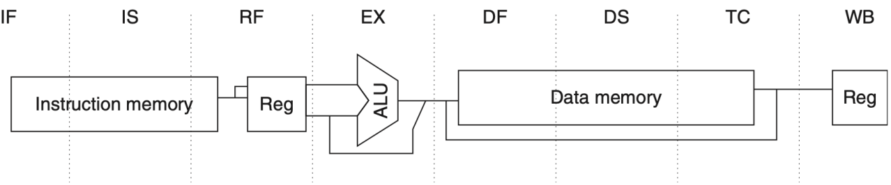</div>

1. **Instruction Fetch**
   将访存拆分为 IF 和 IS，是为了避免单个阶段延迟过长，限制了主频
    - **IF (Instruction Fetch - 前半部分)**：启动取指过程
        - PC Selection：确定下一条指令的地址（PC 值）
        - Initiation of I-Cache Access：向指令缓存发送请求，开始读取指令
    - **IS (Instruction Fetch - 后半部分)**：完成取指
        - Completion of I-Cache Access：等待缓存返回数据，正式拿到指令
2. **Decode & Register Fetch**
    - **RF (Register Fetch)**：准备工作
        - Instruction Decode：翻译指令，看懂要做什么
        - Register Fetch：从寄存器堆中读取源操作数
        - Hazard Checking：检测冒险，决定是否需要暂停流水线
        - I-Cache Hit Detection：检查 IF/IS 阶段取指令时，缓存是否命中（没命中就去内存拿）
3. **Execution**
    - ALU Operation：进行加减乘除或逻辑运算。
    - Effective Address Calculation：如果是 Load/Store 指令，计算内存地址
    - Branch Target & Condition：计算跳转地址，并判断跳转条件是否满足（决定是否跳转）
4. **Data Access**
   这是 R4000 最独特的地方，为了处理数据缓存（D-Cache）的延迟，将原本 5 级流水线中的 MEM 阶段拆分成了 **DF, DS, TC** 三个阶段
    - **DF (Data Fetch - 前半部分)**：启动访问
        - First half of data access：向数据缓存发起访问请求
    - **DS (Data Fetch - 后半部分)**：完成数据的获取
        - Second half of data access：继续访问过程
    - **TC (Tag Check)**：确认数据有效性
        - Completion of D-Cache Access：完成数据缓存的物理读取。
        - Determine whether D-Cache hit：检查标签（Tag），确认刚才访问的数据在缓存中是否存在（命中）
5. **Write Back**
    - For Loads：将从内存读到的数据写入寄存器
    - For Reg-Reg Ops：将 ALU 计算的结果写入寄存器

### 3.5.2 Delay

#### Load Delay

**2-cycle load delay** (per the subsequent pipeline diagram)

<div style="text-align: center">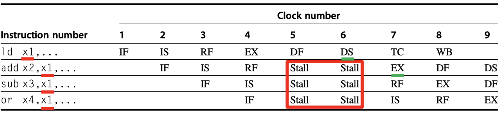</div>

- DS: second half of data fetch completion of data cache access;

!!! warning

    MEM 阶段的读数在该阶段末期才完成，因此需要 stall，不能直接 foward
    EXE 阶段由于 ALU 计算很快，前半阶段就能完成计算并前递

#### Branch Delay

**3-cycle branch delay**: condition test- EX

- 处理器采用 **预测不跳转（Predicted-Not-Taken）** 策略，即假设分支不会发生，继续顺序取指（在计算出结果即 EX 阶段时，读入三条指令：Instruction 1, 2, 3）
    - Instruction 1：称作**延迟槽（Delay Slot）**，无论是否跳转，这条指令**必须被执行**
    - Instruction 2,3：假设程序不跳转时需要执行的指令

<div style="text-align: center">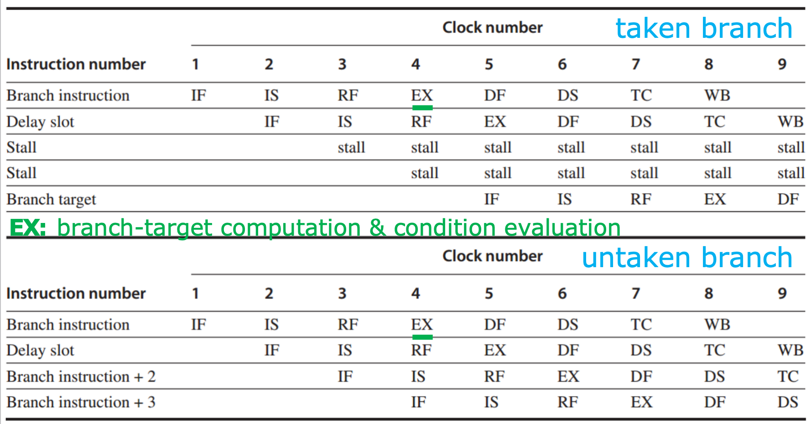</div>

- 3-cycle branch delay: for taken predicted-not-taken（预测错误）
    - 必须把 Instr 2 和 Instr 3 **清空（Flush）** 掉
    - 浪费了3个时钟周期，Target 指令直到 Clock 5 才开始进入 IF 阶段
- 1-cycle branch delay: for untaken predicted-not-taken（预测正确）
    - 只有 **1 个周期** 的延迟（即必须执行的 Delay Slot 指令 Instr 1）

### 3.5.3 Forwarding

ALU/MEM or MEM/WB 的结果可以前递到 EX/DF, DF/DS, DS/TC, TC/WB

### 3.5.4 FP Operations

#### FP unit with eight different stages 

| Stage | Functional unit | Description                              |
| :---- | :-------------- | :--------------------------------------- |
| U     |                 | Unpack FP numbers（将浮点数的符号位、指数位和尾数位分离）    |
| S     | FP adder        | Operand shift stage（对阶，使得两个浮点数指数一致）      |
| A     | FP adder        | Mantissa add stage（尾数相加）                 |
| M     | FP multiplier   | First stage of multiplier                |
| N     | FP multiplier   | Second stage of multiplier               |
| E     | FP multiplier   | Exception test stage（异常测试，如是否溢出、是否为 NaN） |
| R     | FP adder        | Rounding stage（舍入处理，确保结果符合 IEEE 754 标准）  |
| D     | FP divider      | Divide pipeline stage                    |

#### Latency & Initiation Interval

| FP instruction | Latency | Initiation interval | Pipe stages                                  |
| :------------- | :------ | :------------------ | :------------------------------------------- |
| Add, subtract  | 4       | 3                   | U, S+A, A+R, R+S                             |
| Multiply       | 8       | 4                   | U, E+M, M, M, M, N, N+A, R                   |
| Divide         | 36      | 35                  | U, A, R, $D^{28}$ , D+A, D+R, D+A, D+R, A, R |
| Square root    | 112     | 111                 | U, E, $(A+R)^{108}$ , A, R                   |
| Negate         | 2       | 1                   | U, S                                         |
| Absolute value | 2       | 1                   | U, S                                         |
| FP compare     | 3       | 2                   | U, A, R                                      |

#### FP Op Examples

FP multiply + FP add

<div style="text-align: center">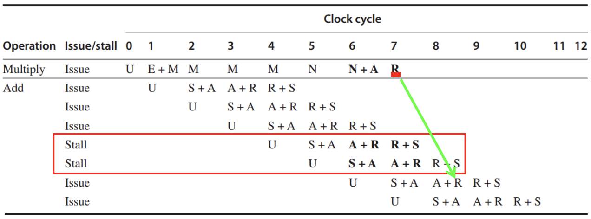</div>

FP add + FP multiply

<div style="text-align: center">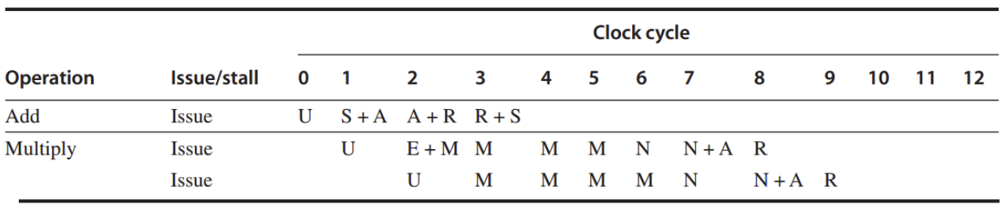</div>

Divide + add

<div style="text-align: center">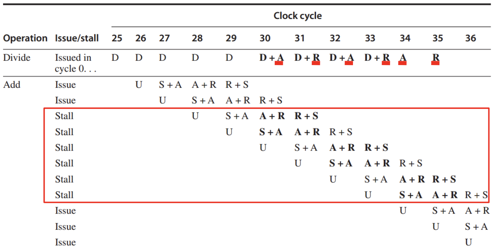</div>

FP add + FP divide

<div style="text-align: center">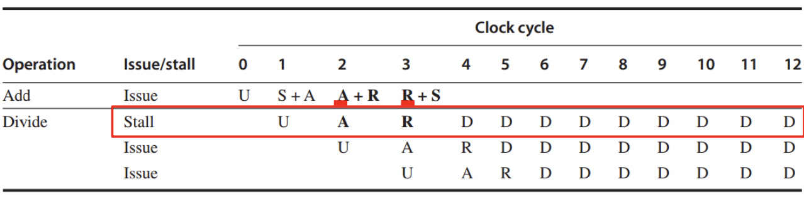</div>

---

## 3.6 ILP Exploitation

- **Compiler-based static parallelism** 
    - only in domain-specific environments or in well-structured scientific applications with significant data-level parallelism 
- **Hardware-based dynamic parallelism**

### 3.6.1 Dependence

- Two instructions that are not parallel 
- Must be executed in order 
- May often be partially overlapped

#### 1. Data Dependence

1. **直接依赖：** 后一条指令用到了前一条指令的结果
2. **间接依赖：** 通过中间指令传递下来的依赖关系
（在讨论的流水线调度或并行性时，只关心**不同指令之间**的关系，不考虑 `add x1, x1, x1`）

#### 2. Name Dependence

两条指令使用了同一个寄存器或内存地址，但它们之间**并没有真正传递数据**

- **True dependence**: Read $\rightarrow$ Write
    - 指令 $i$ 先读取某个位置，而指令 $j$ 后写入同一个位置
    - **约束**：指令 $j$ 不能在指令 $i$ 读取之前就把数据写进去，否则 $i$ 读到的就是新值（错误的数据）
- **Output dependence**：Write $\rightarrow$ Write
    - 指令 $i$ 和指令 $j$ 都要写入同一个位置
    - **约束**：必须保证写入的顺序正确。最终这个位置留下的值，必须是最后那条指令写入的值

!!! example

    <div style="text-align: center">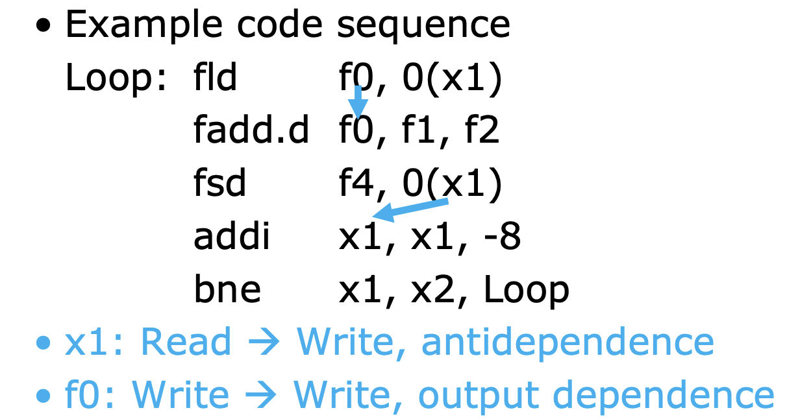</div>

    - **寄存器重命名**：改变那些存在“名相关”的指令所使用的名字（寄存器编号或内存位置）
    - **静态地由编译器完成**：在代码编译阶段，编译器提前把指令的目标寄存器换成不冲突的寄存器
    - **动态地由硬件完成**：现代处理器内部有专门的硬件电路，在指令执行过程中实时进行重命名

!!! bug "Data Hazard"

    Hazard exists whenever 

    1. there is a <u>name/data dependence</u> between instructions; 
    2. they are <u>close enough</u>; AND 
    3. the <u>overlap</u> during execution would **change the order of access** to the operand involved in the dependence

    |冒险类型|缩写|对应依赖类型|错误原因|常见程度|
    |:--|:--|:--|:--|:--|
    |写后读|RAW|True dependence|读太早，读到旧值|最常见，必须解决|
    |写后写|WAW|Output dependence|写乱序，最终值错了|较少见（需多条流水线）|
    |读后写|WAR|Antidependence|写太早，干扰了读|较少见（需乱序执行）|

#### 3. Control Dependence

假设 $s_1$ 需要在 $p_1$ 成立的条件下执行，那么 $s_1$ 控制依赖于 $p_1$

### 3.6.2 Property Constraints

#### Exception Behavior

无论如何改变指令的执行顺序（比如让指令 $i$ 和 $j$ 并行，或者 $j$ 先于 $i$ 执行），程序产生异常的方式必须和顺序执行时**完全一致**

- 如果按照原始代码顺序，第 10 行代码会发生除零错误，那么无论怎么优化，程序都必须表现为“在执行到第 10 行时报错”
- 不能因为把第 15 行的指令提到前面先执行了，导致第 15 行的错误先报出来，而掩盖了第 10 行的错误；或者第 10 行本该报错，结果因为乱序执行跳过了它，导致错误没被发现

#### Data Flow

必须保持**实际的数据值流向**正确。即，数据必须从产生它的指令流向消费它的指令

!!! example

    ```nasm
    	add x1, x2, x3
    	beq x4, x0, L
    	sub x1, x5, x6
    L:  ...
    	or  x7, x1, x8
    ```

    - $x_1$ of or instruction is data-dependent on both add and sub instructions
    - value of $x_1$ is control-dependent on beq

---

## 3.7 Static Scheduling

- Pipeline Scheduling：重新排列指令顺序，以避免流水线停顿
- Loop Unrolling：复制循环体多次，以增加相对于分支指令和开销指令的指令数量

### 3.7.1 Pipeline Scheduling

!!! example

    ```c
    for (int i = 999; i >=0; i--)
    	x[i] = x[i] + s;
    ```

    8 cycles per loop

    ```nasm
    Loop: fld    f0, 0(x1)
          fadd.d f4, f0, f2    // 1-CC stall
          fsd    f4, 0(x1)     // 2-CC stall
          addi   x1, x1, -8    
          bne    x1, x2, Loop
    ```

    调整代码执行循序，7 cycles per loop（只有 3 cycles 在真正处理数据）  

    <div style="text-align: center">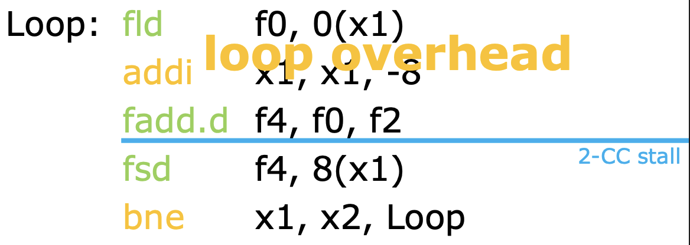</div>

### 3.7.2 Loop Unrolling

- Replicate loop body multiple times given the same amount of overhead instructions
RISC-V code: <u>6.5-CC per op</u>

```nasm
Loop: fld    f0, 0(x1)    # highest-address element of x[i] 
      fadd.d f4, f0, f2 
      fsd 	 f4, 0(x1)    # //drop addi & bne 
      fld  	 f6, -8(x1) 
      fadd.d f8, f6, f2 
      fsd 	 f8, -8(x1)   # //drop addi & bne 
      fld 	 f0, -16(x1) 
      fadd.d f12, f0, f2 
      fsd 	 f12, -16(x1) # //drop addi & bne 
      fld 	 f14, -24(x1) 
      fadd.d f16, f14, f2 
      fsd 	 f16, -24(x1) 
      addi 	 x1, x1, -32  # 一次性更新指针（4个元素 * 8字节 = 32） 
      bne 	 x1, x2, Loop # for lowest-address element
```

!!! tip "Loop Unrolling & Scheduling"

    - 可以进一步优化流水线，达到 3.5-CC per op

    ```nasm
    Loop: fld    f0, 0(x1)
          fld    f6, -8(x1) 
          fld 	  f0, -16(x1)
          fld 	 f14, -24(x1)
          fadd.d f4, f0, f2 
          fadd.d f8, f6, f2
          fadd.d f12, f0, f2
          fadd.d f16, f14, f2 
          fsd 	  f4, 0(x1) 
          fsd 	  f8, -8(x1)
          fsd 	  f12, -16(x1) 
          fsd 	  f16, -24(x1) 
          addi    x1, x1, -32
          bne 	  x1, x2, Loop 
    ```

---

## 3.8 Branch Handling

**How to handle branches? Often you don’t have to**

!!! tip "Frequent Critical Path"

    在优化时应该专注于**最频繁的关键路径**，就好像那个分支判断不存在一样

    - 可以该侧路径进行**指令重排**或**流水线调度**，不用太担心另一侧路径的干扰
    - 对于另一侧路径，可以使用**预测**或**补偿代码**来处理

### 3.8.1 Trace Scheduling

==Trace==：一系列**最可能被执行到的**基本块的序列

- 把这些基本块里的操作看作一个整体，然后压缩成更少、更宽的指令
- 即在一个时钟周期内并行执行更多指令
1. **Trace Selection**：找到那条**最频繁的路径**
2. **Trace Compaction**：把路径上的指令**压缩**进更少、更宽的指令包里
    - ==VLIW（Very long instruction word）== 处理器通过把可以并行的指令压缩在一起发射，每个时钟周期可以同时发射多条指令。Trace Compaction 就是把长路径上的指令**重新排列**，尽可能填满每个时钟周期的槽位，减少空闲（bubble）。

#### Trace Unrolling

1. **Unrolled Trace**
    - 对于**循环体**构成的 Trace，编译器会做**循环展开**
    - 通过展开，编译器可以在更大的范围内移动指令，从而填平流水线中的 bubble
2. **Trace Exit**, where control flow jumps off the frequent path
    - 这是预测失败的地方
    - 此时编译器需要生成修复代码（Fix-up code）来处理这个意外情况
3. **Trace Entrance**, where control flow returns to the trace
    - 这是重新加入优化的地方
    - 如果之前的循环预测失败（走向 Trace exit），或者循环刚开始，程序需要跳回到这条优化过的主路径上继续执行

#### Superblock & Fixup Code

!!! info "Optimize：Superblock"

    <div style="text-align: center">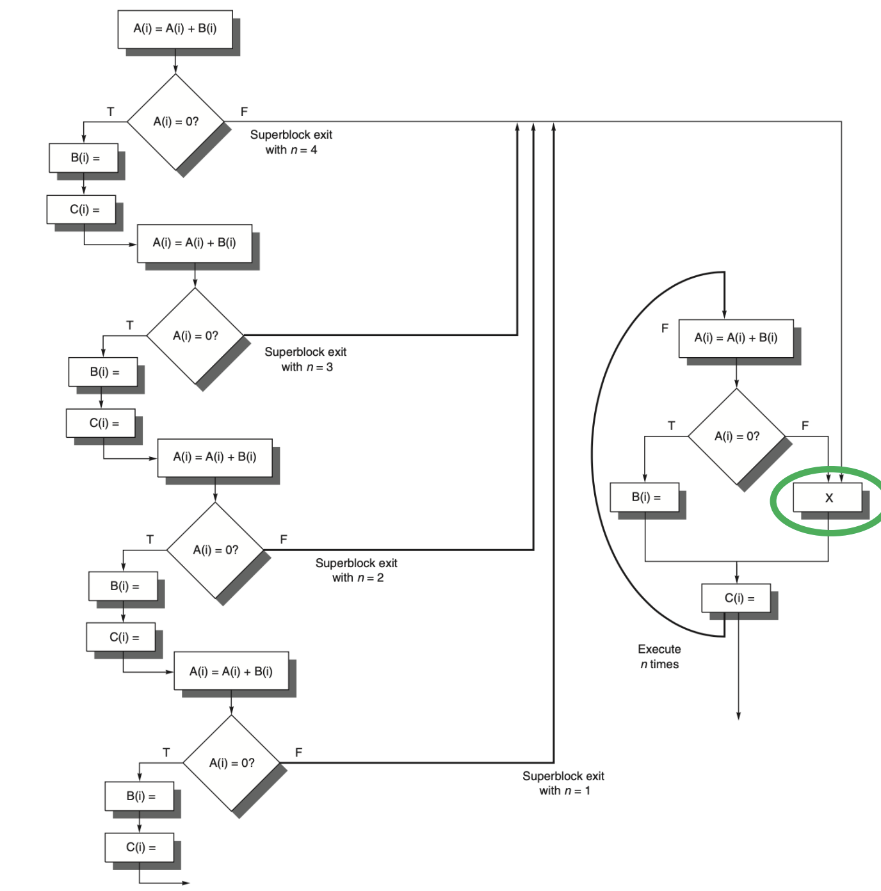</div>

    - **too many entrances and exits amidst the trace**
        - 编译器需要处理多个“跳入点”，这使得指令调度（Instruction Scheduling）变得非常复杂
    - ==Superblock==：**single entrance & multiple exits**
        - **单入口**：代码只能从 Superblock 的最顶端进入
            - 要执行这个 Superblock，就必须从第一条指令开始执行
            - 编译器不需要担心中途进入的代码会破坏寄存器状态
        - **多出口**：代码可以在 Superblock 内部的多个点跳出
            - 通常是因为遇到了分支指令，且预测失败，或者遇到了循环的结束条件
            - 当跳出发生时，控制流会转移到“修复代码”或下一个基本块

!!! tip "Fixup Code"

    **"copy instructions to ensure correctness of all paths"**
    （复制指令以确保所有路径的正确性）

    <div style="text-align: center">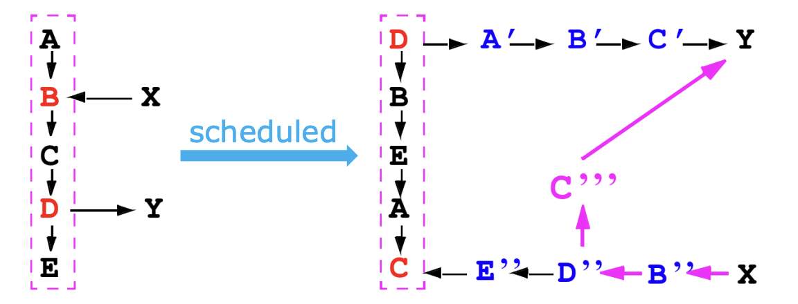</div>

    - 左侧：优化前的原始代码
        - 这是一个基本块，指令按顺序执行：A → B → C → D → E
    - 右侧：优化后的复杂局面与 Fixup Code
        - **针对侧向跳出的修补**：<u>A' -> B' -> C'</u>
          Y 后续代码可能依赖 A、B、C 的结果，因此先执行这些指令再跳出
        - **针对侧向进入的修补**：<u>B'' -> D'' -> E'' -> C</u>
          B 后续代码可能依赖 D，为保证逻辑正确，需要补上在 B 之后执行的指令

采用 fixup code 和 Subexpression elimination 实现优化

<div style="text-align: center">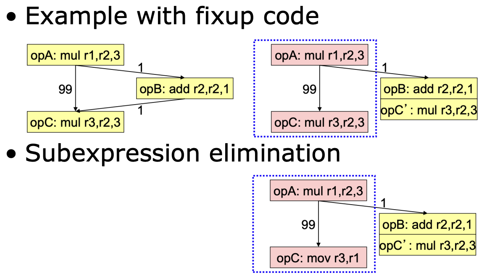</div>

---

**How to handle branches? When you have to**

### 3.8.2 Branch Hazard

!!! info "Control Hazard"

    - **branches** and jumps 

    <div style="text-align: center">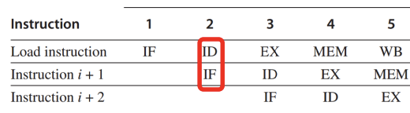</div>

    - **Branch hazard** 
        - a branch may or may not change PC to other values other than PC+4;
            - <u>taken branch</u>: changes PC to its target address; 
            - <u>untaken branch</u>: falls through to PC+4; 
        - PC is not changed till **the end of ID**;

#### Redo IF

- **重做取指**，等待 ID 结束后再进行取指
- If the branch is untaken, the stall is unnecessary.

<div style="text-align: center">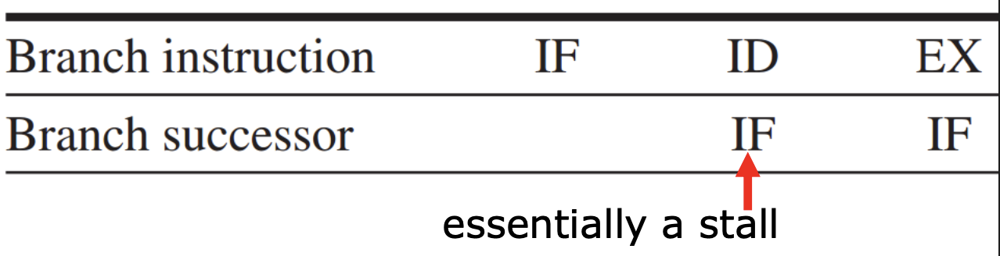</div>

#### 4 simple compile time schemes

1. **Freeze or flush the pipeline**：hold or delete any instructions after the branch till the branch dst is known;
2. **Predicted-untaken**: simply treat every branch as untaken;
    - 如果不跳转，则没有 penalty
    - 假设要跳转，需要把刚才取进来的那条指令变成“空指令”并重新取指
3. **Predicted-taken**: simply treat every branch as taken;
    - 硬性要求：CPU 必须在知道“是否跳转”之前，先知道“跳去哪里”
4. **Delayed branch**: delay the branch execution after the next instruction;
    - 使用<u>Branch delay slot（分支延迟槽）</u>
    - 该槽内的指令**无论分支是否跳转，都会被执行**

#### Fetch Stage with BTB & DP

<div style="text-align: center">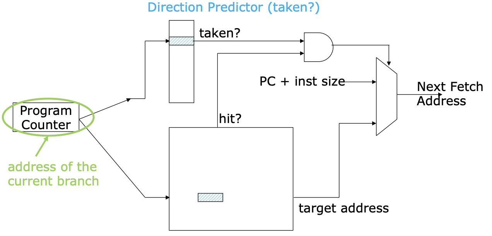</div>

- 只有当 **“预测跳转”且“BTB命中”** 时，才应该采用分支目标地址
- Branch Target Buffer 如果 hit，会返回该分支上次跳转的目标地址

---

## Dynamic Parallelism

## 3.9 Dynamic Branch Prediction

- 目标是解决 control hazard

### 3.9.1 N-bit predictor

**1-bit predictor / last-time predictor**：

- 使用**分支预测缓冲区**（Branch prediction buffer，或称 BHT：分支历史表，Branch History Table），通过分支地址的低位部分进行索引，并用一个比特位来标记追踪该分支的执行（taken）/ 不执行（untaken）状态
- bit 1 for taken; bit 0 for untaken

**状态机**如图：

<div style="text-align: center">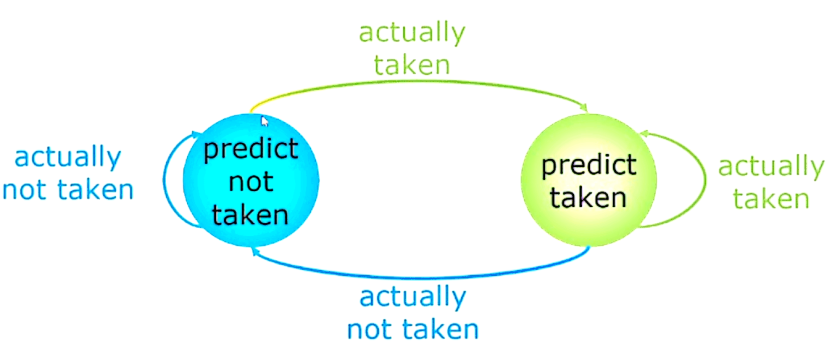</div>

!!! info "Basic structure"

    <div style="text-align: center">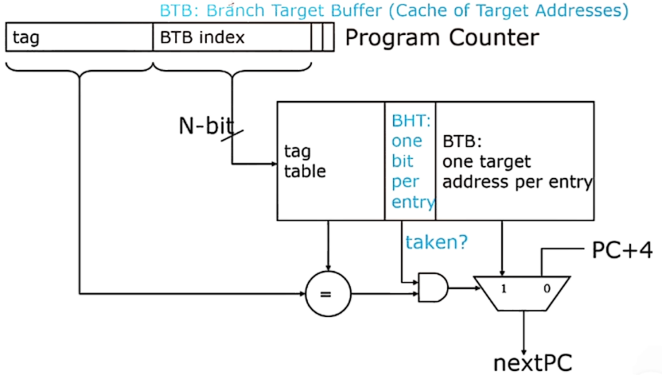</div>

    - **Program Counter**
        - BTB index：N 位，用于索引 BTB/BHT 表项（直接定位到对应 entry）
        - tag：用于和 tag table匹配验证（防止不同分支映射到同一 index 造成冲突）
    - **BHT：Branch History Table**
        - 每个entry存储1位，记录该分支上次的实际跳转结果
        - 输出信号：`taken?` —— 本次预测该分支是否跳转
    - **BTB：Branch Target Buffer**
        - 每个entry存储一个完整的目标地址
        - 如果命中且预测 taken，提供跳转目标地址

**2-bit predictor**

- 使用 2 bit 来预测跳转；预测错误两次后才会改变预测的结果
- 极端情况下也有 50 %的准确率
- 状态机如下图所示：

 <div style="text-align: center">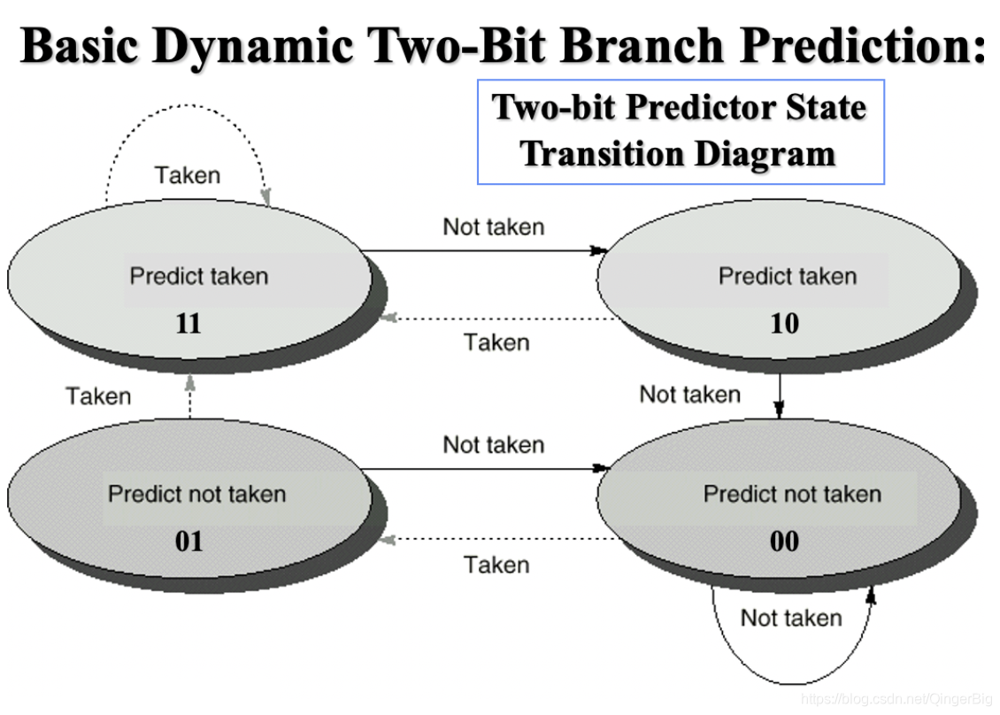</div>

**N-bit predictor**

- 为每个分支分配一个 $N$ 位计数器，取值范围从 $0$ 到 $2^N - 1$
- 计数器值越高（$\geq 2^{N-1}$），表明该分支**越倾向于跳转（taken）**
- 计数器值越低（$< 2^{N-1}$），表明该分支**越倾向于不跳转（untaken）**

### 3.9.2 Local Predictor

- **一个分支的当前结果，可能与该分支自身的历史执行模式相关**（而不仅仅是"上次执行的结果"）

!!! info "BHT（Branch History Table）结构"

     <div style="text-align: center">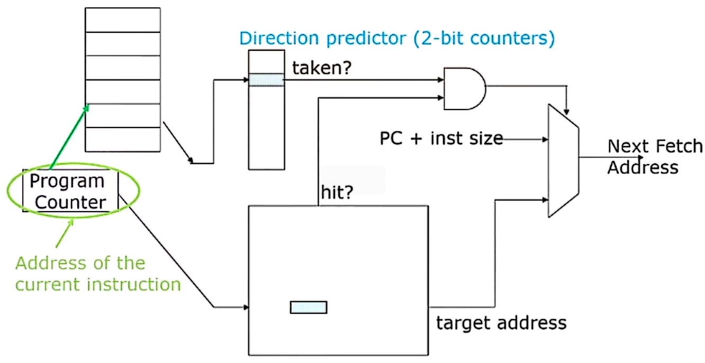</div>

    - 使用**PC索引**，映射到 BHT 中的一个特定的 entry
    - entry 是一个 $m$ 位的**移位寄存器（Branch History Register, BHR）**，记录这一条特定指令过去 $m$ 次的执行历史
    - 输出的**BHR值**（即执行历史），作为 Direction predictor 的**索引/地址**
    - **方向预测器**根据存储的值判断是否跳转
    （下方是从 BTB 中读取跳转指令的地址）

!!! example

    <div style="text-align: center">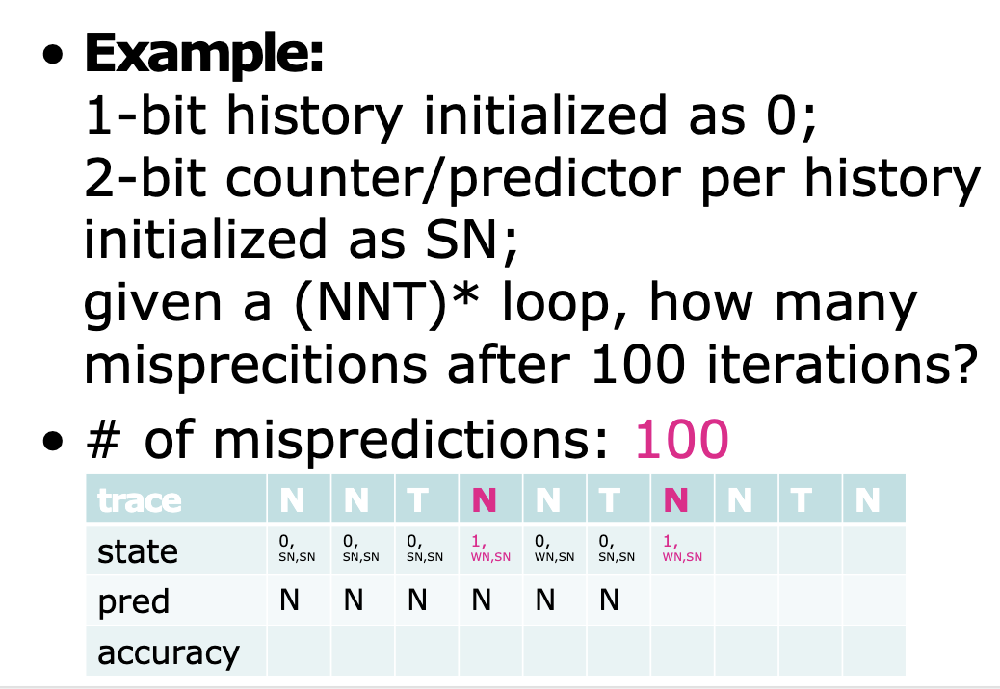</div>

### 3.9.3 Correlating Branch Prediction

- <u>利用其他分支的行为来做出预测</u>；基于"**上次遇到相同全局分支历史时**"该分支的结果进行预测

#### Two-Level Predictor

also called **correlating predictors**

!!! info "全局历史寄存器（GHR）"

    <div style="text-align: center">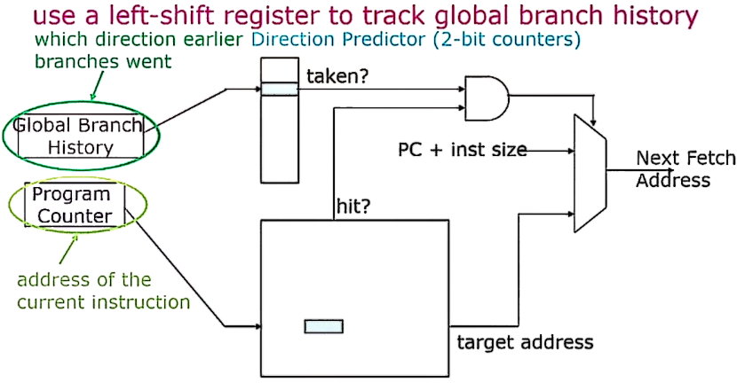</div>

    - 一个**全局共享**的 m 位移位寄存器（注意只有一个!！）
    - 每执行一个分支，将其结果（taken=1, untaken=0）**左移**进 GHR
    - 记录最近 m 个分支的**全局执行路径**

==(m, n) predictor==结构大致如下：

- **m（第一级）**：$m$ 位的移位寄存器，记录**最近发生的 m 次分支指令**的行为
- **n（第二级）**：针对每一种历史情况，使用一个 **$n$ 位预测器**（通常是 2-bit 状态机）来预测

##### PlanA: Global history + PC Concatenation

系统会维护一个**模式历史表（Pattern History Table, PHT）**

- 根据最近 $m$ 次分支的行为，会产生一个 $m$ 位的二进制数
    - 假设 $m=2$，最近两次是“T-NT”，那就是 `10`
- 将 $m$ 位历史和 PC 的低位拼接起来，去定位 PHT 中的某一个 $n$ 位计数器

!!! example

    如图，$m=2$, $n=2$, $\text{branch address}=4\text{-bit}$

    - 分支地址 4-bit 对应 16 行（16 entires），每行对应一条分支
    - $m$ 位的移位寄存器记录了最近 2 次的跳转情况，对应 4 列
    - PC + m 位历史对应了一个 predictor，预测是否跳转

    <div style="text-align: center">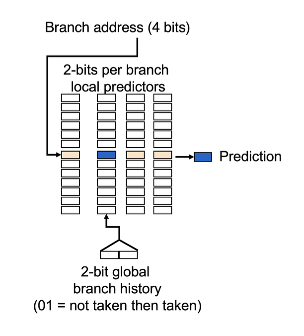</div>

**存储开销**：

- 每个分支的 PHT 存储成本 = $2^m × n$ bits
- 如果地址索引为 $b$ bit（对应 $2^b$ 个 entry），总存储成本 = $2^m × n × 2^b$ bits

##### PlanB: gshare predictor

Also called **Hybrid/Alloyed Predictor**

- 利用了哈希，所有分支共享一张表

<div style="text-align: center">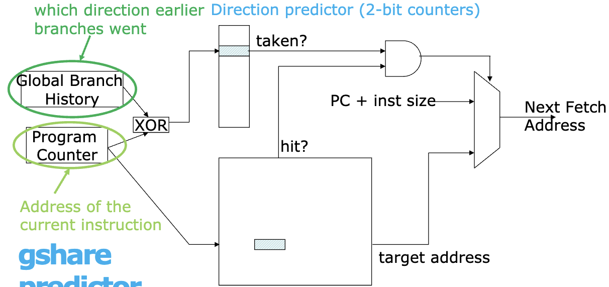</div>

利用**移位寄存器**追踪最近 $m$ 次分支，然后把<u>“全局历史”和 PC 的低几位</u>做 XOR 操作，用于查表预测

- 根据这个结果进行选择，从 $1024$ 个 2-bit predictors 中选择一个进行预测 
- 免去了 $1024\times 1024$ 个预测器的存储开销

<div style="text-align: center">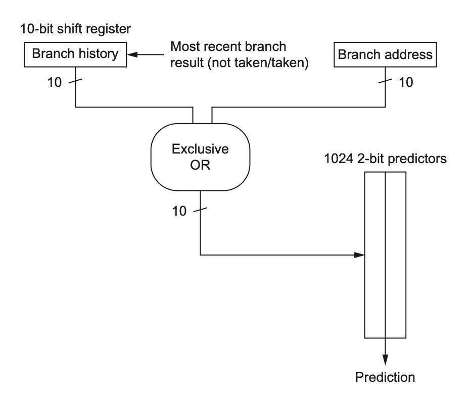</div>

### 3.9.4 Tournament Predictors

Also called **Hybrid Predictor**，使用多种预测器，并采取表现最好的那一个

- 主要结构：Global Predictors, Local Predictors 和 Selector

<div style="text-align: center">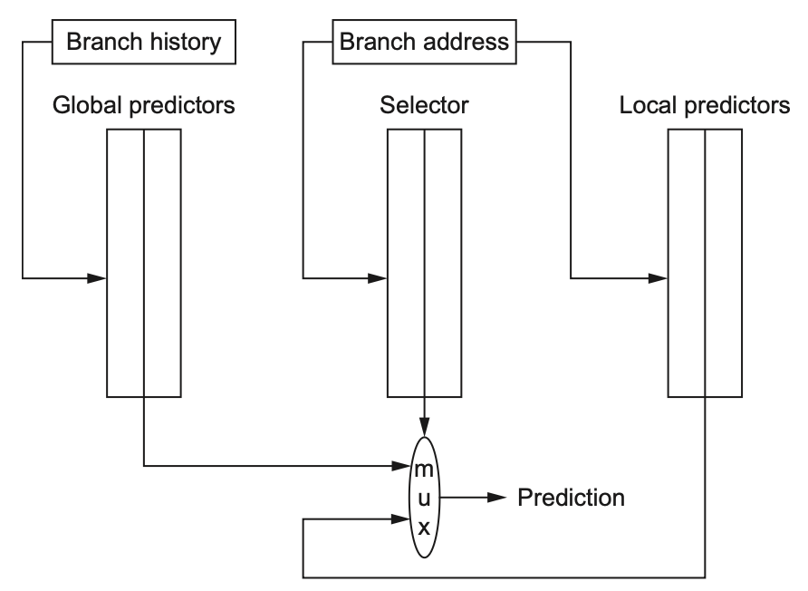</div>

**工作原理**：

1. 当一条分支指令进来时，全局预测器和局部预测器同时给出各自的预测结果
    - Branch history（全局历史）对应上文的 correlating predictor
    - Branch address 定位该指令的局部历史，对应 local predictor
2. 选择决策：**选择器内部维护着一张表（通常为一组 2-bit 计数器）**
   它会根据 PC 值查找：对于这一条特定的指令，过去是全局预测器更准，还是局部预测器更准
3. 多路选择 (Mux)：选择器控制 mux 选择最终的预测结果

### 3.9.5 Tagged Hybrid Predictors（TAGE）

TAGE = **多个带标签的全局历史表 + 几何级数的 history 长度 + 最长匹配优先**

<div style="text-align: center">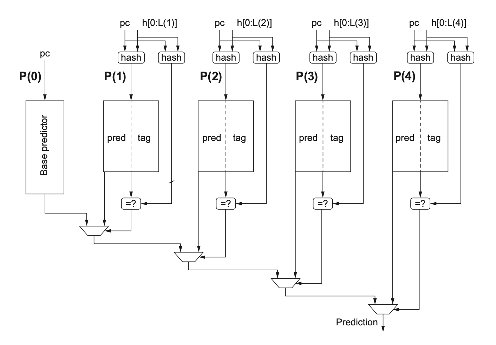</div>

1. **Multiple History Lengths**
   TAGE predictor 采用了一系列并行的全局预测表，每张表带各自的 Tag
    - **几何级数增长**：这些表使用的分支历史长度（History Length）构成一个**几何级数**（例如：2, 4, 8, 16, 32... 个比特）
2. **Tagged Entries**
   普通的预测表（如 BHT）通过哈希索引找到 2-bit 计数器，这容易产生**冲突（Aliasing）**，即两个不相关的分支映射到了同一个项。
    - **哈希索引**：对每个表使用 PC 和全局历史共同哈希计算得出索引
    - 检查表中对应项的 tag 是否匹配
3. **Choose the longest history**
   当 CPU 需要进行分支预测时，它会查询所有的表：
    - **多表匹配**：可能会有多个表（历史长短不一）同时产生了标签匹配
    - **最长优先**：系统会选择**匹配标签且历史最长**的那个预测器作为最终结果 

### 3.9.6 Summary of Dynamic Branch Prediction

**Dynamic Branch Prediction**：已经成为标量处理器（Scalar Processor）提高性能的重要组成部分，用于减少控制相关带来的流水线停顿。

| **技术**                         | **作用 / 核心思想**                                             |
| ------------------------------ | --------------------------------------------------------- |
| **Branch History Table (BHT)** | 使用 **2-bit 饱和计数器**记录分支历史，提高循环（Loop）分支的预测准确率。              |
| **Correlation Prediction**     | 利用最近执行过的分支结果预测当前分支。相关性可能来自：①不同分支之间；②同一分支的不同历史执行。          |
| **Tournament Predictor**       | 同时使用多种预测器（如局部预测器和全局预测器），再通过选择器（Chooser）动态决定采用哪个预测结果。      |
| **Tagged Hybrid Predictor**    | 为不同分支及不同历史模式维护专门的预测项，通过 Tag 区分，提高预测精度并减少别名冲突（Aliasing）。   |
| **Branch Target Buffer (BTB)** | 存储分支指令地址及其目标地址，在预测分支发生时直接提供跳转目标，减少取指延迟。                   |
| **Predicated Execution**       | 将部分条件分支转换为条件执行指令，从而减少分支数量和错误预测（Misprediction）次数。          |
| **Return Address Stack (RAS)** | 利用栈结构保存函数调用的返回地址，用于准确预测函数返回（Return）这种间接跳转（Indirect Jump）。 |

---

## 3.10 Dynamic Scheduling

目标是通过**乱序执行**（out-of-order execution）解决 data hazard

!!! abstract "Strategy"

    **执行阶段拆分为**：<u>IF->Issue->Read-Operands->EX->MEM->WB</u>

    1. Issue from IF: in order
        - 指令从取指阶段出来时，严格按照程序原本写的顺序进入流水线
    2. Read operands to EX: out of order
        - 当指令进入执行阶段（EX）准备读取操作数时，如果满足两个条件，就可以“插队”先执行：
        1. **Sufficient resources**：所需的硬件资源（如加法器、乘法器）是空闲的
        2. **No data dependences**：所需的数据已经准备好了，不依赖前面还没算完的结果
    3. Scheduling policy: 遇到停顿就跳过
        - 当遇到一条指令卡住了（stalling，通常是因为缺数据或资源冲突），调度器会去检查后面的指令。如果后面的指令不依赖这条卡住的指令，也不依赖其他正在运行但还没完的指令，那就把后面的指令提上来先执行。
    4. How to schedule: use a centralized Hazard Detection and Resolution Unit

### 3.10.1 Scoreboarding

记分板是一种**硬件机制**，用来解决指令在**乱序执行（Out-of-Order Execution）** 时的冲突问题

<div style="text-align: center">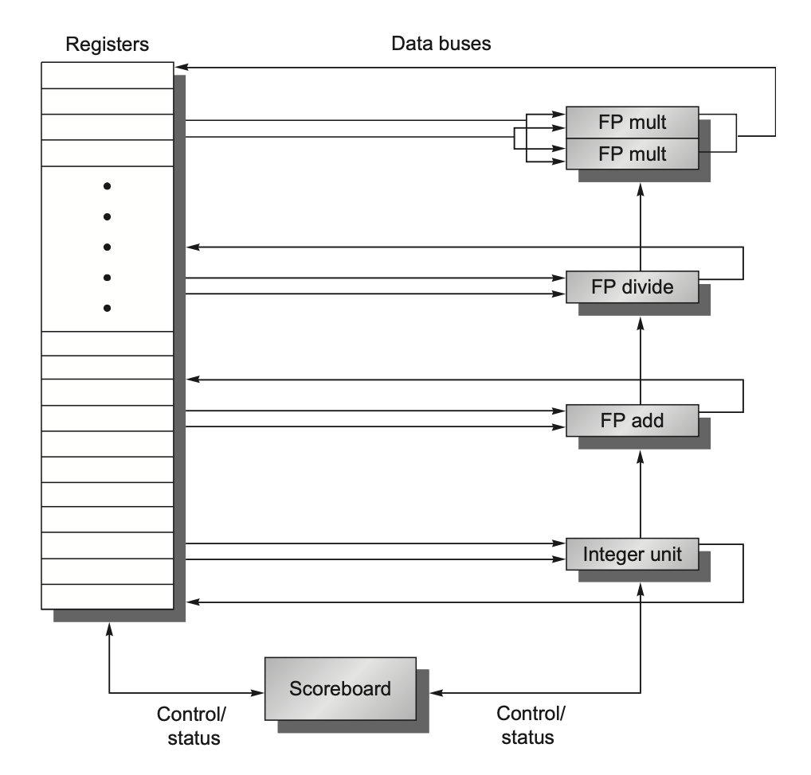</div>

!!! info "Three part of Scoreboarding"

    记分板维护了**三张表**来记录系统的实时状态：

    1. **Instruction status（指令状态表）**
        - 记录每一条正在流水线中执行的指令当前处于哪个阶段
    2. **Functional unit status（功能单元状态表）**
        - 记录所有的硬件资源（如浮点加法器、浮点乘法器、整数单元）是忙还是闲。
          如果忙，是被哪条指令占用的？操作数准备好了吗？
        - **作用**：防止资源冲突
    3. **Register result status（寄存器结果状态表）**
        - 记录每一个寄存器将来会被哪条指令写入结果。
        - **作用**：解决数据冒险（Data Hazard）
            - **RAW（写后读）**：如果指令 B 想读寄存器 $F_0$，但记分板查表发现 $F_0$ 正在被指令 A 计算（还没写完），记分板就会让指令 B 暂停，直到指令 A 写完
            - **WAW（写后写）**：防止两条指令乱序写回同一个寄存器导致结果错误

#### Instruction status

记分板将指令的处理过程标准化为四个阶段：

- **Issue（发射/ issuing）**：
    1. FU 空闲（避免结构冲突）
    2. 正在执行的指令不写回与本指令相同的 Rd（避免 WAW）
    - 满足上述两条规则就“发射”指令
- **Read operands（读取操作数）**：
    - 等待数据准备好（没有 RAW 冲突），然后读取源操作数
- **Execution（执行）**：
    - 功能单元开始干活（比如做加法）
- **Write back（写回）**：
    - 查看要写会的目的寄存器是否在某个 FU 的 ready list 中为 yes 
    - 如果是 yes，说明有指令正在读寄存器，等读完再写回（避免WAR）

> "Omit memory access because the out-of-order focuses more on FP operations"
>
> - 为了简化模型，这里**省略了“内存访问”阶段**

#### Functional unit status

- 这张表记录了 CPU 里每一个**功能单元**当前的详细工作状态。记分板通过查阅这张表，来决定能不能把新的指令派发给这个单元。
- 对于每一个功能单元，记分板都维护了以下 9 个信息位：
    1. **Busy**：该单元忙/闲标志
    2. **Op**（操作码）：记录当前单元要执行的具体操作
    3. **Fi**（目标寄存器）：记录这条指令计算完的结果要写到哪个寄存器去
    4. **Fj, Fk**（源寄存器编号）：记录这条指令需要的两个输入数据来自哪里
    5. **Qj, Qk**（生产源数据的单元）：这是最关键的两个字段，用来解决数据依赖
        - 如果为空（Null），说明数据已经准备好了（可能在寄存器堆里）
        - 如果存的是“加法器 1”，说明要等“加法器 1”算完，才能拿到数据
    6. **Rj, Rk**（就绪标志）：操作数是否就绪

#### Register result status

- 指示哪个功能单元将写入该寄存器（如果存在一条活跃指令以该寄存器为目的操作数）
- 只要没有待处理的指令将写入该寄存器，即置为空

!!! example

    <div style="text-align: center">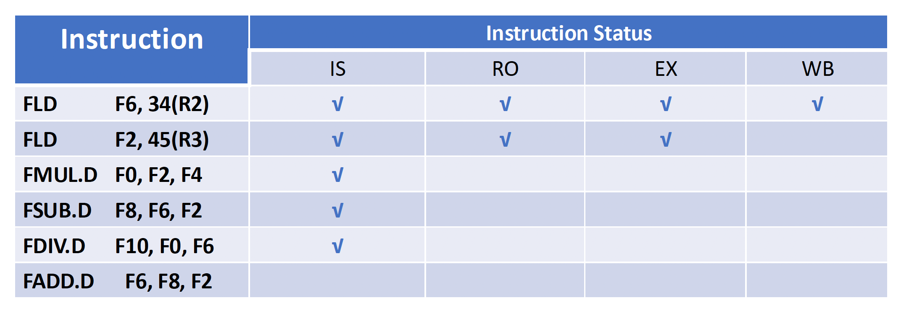</div>

    <div style="text-align: center">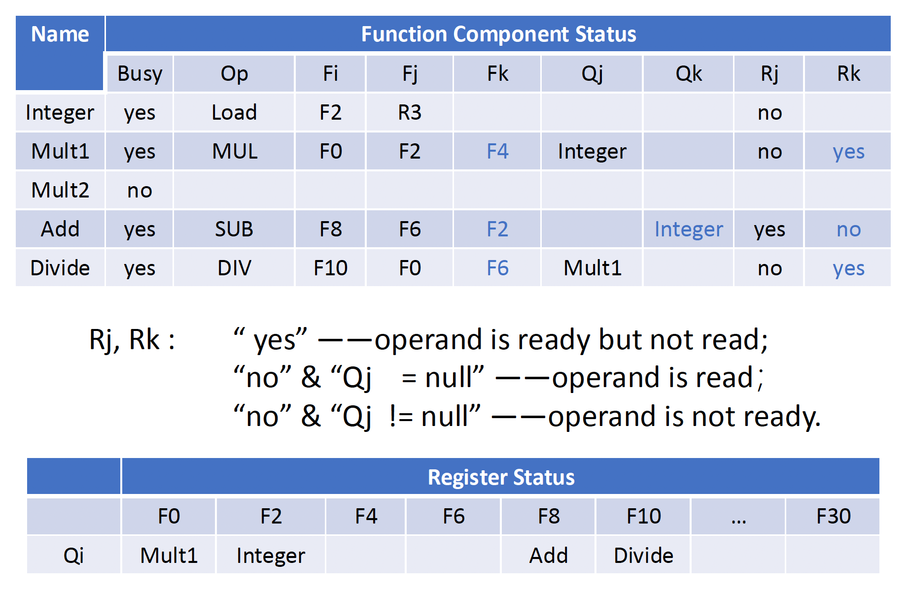</div>

### 3.10.2 Tomasulo

Tomasula 相较于 Scoreboard 的优势：

1. **分布式硬件逻辑**：
    - Scoreboard 采用集中的硬件单元记录指令状态，结构过于复杂；
    - Tomasula 把冒险检测逻辑分布在 load/store buffer 和 reservation station 中，硬件更容易拓展
2. 消除**假相关**（Register Renaming）：
    - 通过寄存器重命名消除 WAW 和 WAR 冒险导致的停顿

<div style="text-align: center">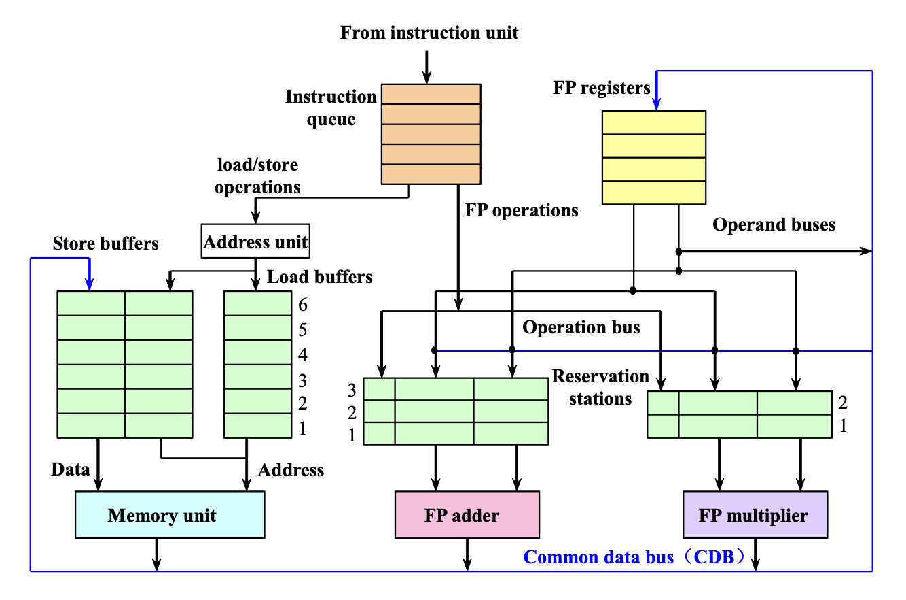</div>

#### Register Renaming

!!! question "硬件如何实现 Register Renaming？"

    - Tomasulo 通过隐式的重命名，避免了 WAW 和 WAR
    - 寄存器不再直接指向一个值，而是指向“哪个 Reservation Station 将产生这个值”。

在使用托马苏洛算法的动态调度处理器中，

- WAR 和 WAW 可通过**寄存器重命名**(register renaming) 来消除
    - 重命名所有的目标寄存器（包括等待先前指令读 / 写的寄存器），这样的话乱序写操作就不会影响到任何依赖于操作数先前值的指令
    - 如果有足够多可用的寄存器的话，编译器就会实现这种重命名
- RAW 可通过**在操作数空闲时就执行指令**来避免

Scoreboard 使用显式（explicit）的寄存器重命名，即真正为其分配了新的寄存器。

!!! example "How to rename registers?"

    原始代码如下：

    ```nasm
    fdiv.d	f0, f2, f4
    fadd.d	f6, f0, f8
    fsd	f6, 0(x1)
    fsub.d	f8, f10, f14
    fmul.d	f6, f10, f8
    ```

    - WAR Hazard: **rename latter/destination**
        - Instr 2&4; Instr 3&5
    - WAW Hazard: **rename former**
        - Instr 2&5
    - 在修改完 destination 后，重命名后续的 resource

    ```nasm
    fdiv.d	f0, f2, f4
    fadd.d	f6_old, f0, f8
    fsd	f6_old, 0(x1)
    fsub.d	f8_new, f10, f14
    fmul.d	f6, f10, f8_new
    ```

#### Tomasulo's Algorithm

1. **Issue / Dispatch**：
    1. **按顺序**从指令队列取下一条指令
    2. 为它找到一个**空闲的保留站**（相当于 *renaming*；如果没有 $\rightarrow$ 结构冒险 $\rightarrow$ 停顿）
    3. **读操作数**：
        - 源操作数已经算好 $\rightarrow$ 直接把值（$V_j$ / $V_k$）从寄存器拷进保留站
        - 源操作数还没算完 $\rightarrow$ 记录"谁在生产这个数"（$Q_j$ / $Q_k$）
    4. **记录目标**：
        - 把**目标寄存器**在寄存器状态表中指向"这条指令的保留站编号"
    这一步实现了*寄存器重命名*，消除了寄存器内的 **WAR 和 WAW 冒险**
2. **Execute**：
    1. 保留站**持续监听 CDB**：检查 $Q_j$ / $Q_k$ 标签是否匹配到广播的结果
    2. **操作数就绪**：把 $Q$ 清零、把值填入 $V$，准备执行
    3. **所有操作数都到齐** $\rightarrow$ 立即把操作数送进对应的功能单元开始计算
    4. 有多条指令争用同一单元时 $\rightarrow$ 浮点单元是**随机挑选**；Load/Store **按优先级处理**
        - **Load/Store 的两步执行**：
            1. 基寄存器可用时，计算有效地址（基寄存器 + 偏移）
            2. 将有效地址放到 Load/Store Buffer 等待内存单元
            - Load → 内存单元空闲就立刻执行；Store $\rightarrow$ 等到数据和内存单元都到位了再执行
    这一步解决了**RAW 冒险**：数据没到就等，到了立刻执行
3. **Write Result**：
    1. 功能单元把计算结果放到 **CDB（公共数据总线）** 上
    2. CDB 是**广播机制**：一次广播，所有监听者同时看到
    3. **谁在听 CDB？**
        - 寄存器堆 $\rightarrow$ 把结果写回对应寄存器
        - 所有保留站 $\rightarrow$ 如果自己的 $Q_j$ / $Q_k$ 匹配了广播的标签 $\rightarrow$ 立即把值填进去
        - Store Buffer $\rightarrow$ 接收要存的数据
    4. 对于 Store 操作：等值和地址都到位后，才真正写入内存

!!! info "Reservation Station Status"

    - **指令状态表**(instruction status table)：仅用于帮助我们理解算法，实际上并不属于硬件的一部分
    - **保留站表**(reservation stattion table)：保留每个已发射的运算的状态

      | 字段     | 全称        | 作用                                              |
    | ------ | --------- | ----------------------------------------------- |
    | $O_p$     | Operation | **操作码**：记录这条指令具体要做什么操作，发给功能单元（FU）               |
    | $O_j$, $O_k$ | —         | 源操作数产生者的保留站编号：一种**指针机制**，用来解决数据依赖；值为 0 表示数据已准备好 |
    | $V_j$, $V_k$ | Value     | 源操作数的实际数值：存放真实的数据                               |
    | $A$      | Address   | 地址信息或立即数，专门用于内存访问指令（Load/Store）                 |
    | $\text{Busy}$   |           | 这是一个布尔值，忙标志位                                    |

    - **寄存器状态表**(register status table)：包含结果需要被存储到寄存器的运算的保留站数量

      | 字段    | f0    | f2  | f4  | f6    | ... | ... |
        | ----- | ----- | --- | --- | ----- | --- | --- |
        | $O_i$ | Mult1 |     |     | Mult2 |     |     |

---

## 3.11 Hardware Speculation

- **out-of-order execution & in-order commit**
- **指令提交（Instruction Commit）**
  只有当 CPU 确认之前的猜测全部正确（比如分支预测正确，且前面没有发生除零错误等异常），指令变成“非推测性”时，才能修改寄存器或内存。这个过程就叫==“提交(commit)”==。
- **重排序缓冲区（ReOrder Buffer, ROB)**
    1. **暂存结果**：指令算出结果后，它不能直接写回寄存器，而是先把结果存在 ROB
    2. **维护顺序**：ROB 记录了所有正在执行中的指令的原始顺序
    3. **统一提交**：ROB 会检查队头的指令，如果队头指令算完了，ROB 就把它正式写入寄存器（提交），从而保证了“顺序提交”。
    4. **错误恢复**：如果发生分支预测错误，直接把 ROB 里相关的条目清空即可

<div style="text-align: center">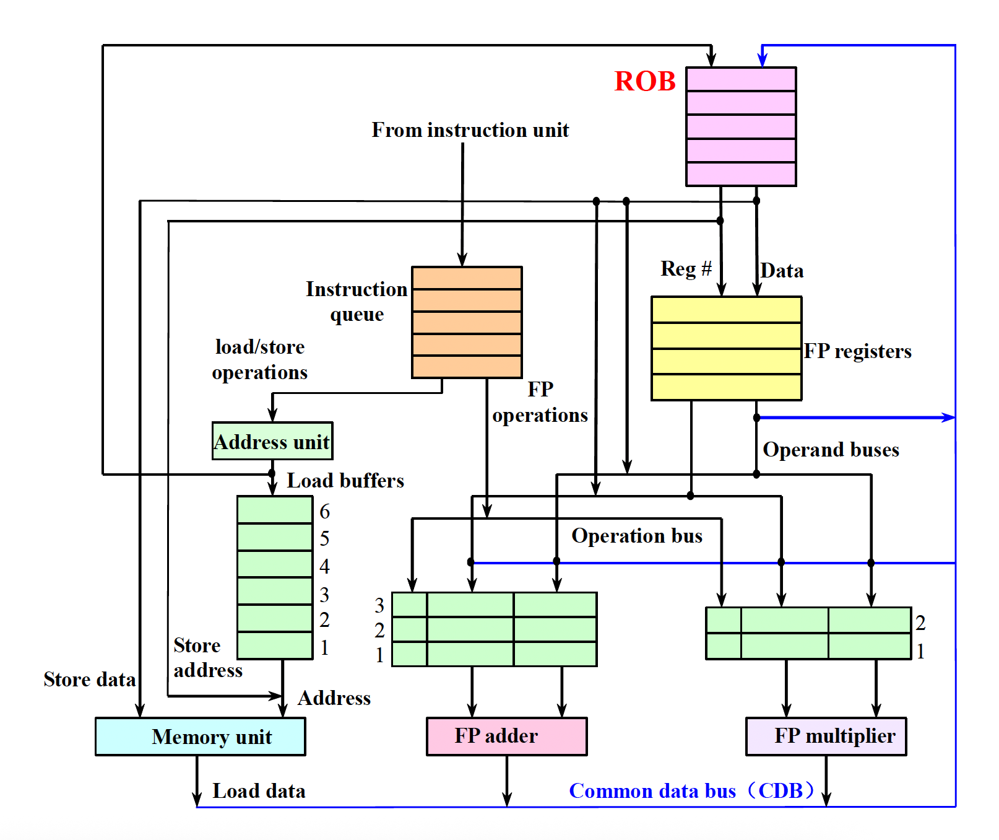</div>

!!! info "ROB 里的每一项包含了 4 个字段："

    - **Instruction Type**：表明该指令是分支指令，存储指令，还是寄存器操作
    - **Destination**：指令结果应该被写入的寄存器编号（ALU 和加载指令）或内存地址（存储指令）
    - **Value**：保留指令结果的值，直到指令提交
    - **Ready**：表明指令是否执行完毕，此时值已经准备好了

      <div style="text-align: center">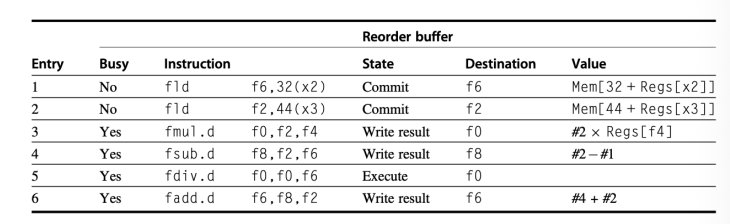</div>

指令的执行分为四步：

1. **发射（Issue）**：
    1. 从指令队列顺序获取指令
    2. 若存在空的**保留站**以及空的 **ROB enty**，则发射该指令；如果不存在，则停止发射
    3. 如果操作数在寄存器或 ROB 上可用的话，将操作数送到保留站内
    4. 为结果分配的 ROB 的项数也要送到保留站内，这样的话当结果被放在 CDB 上时，可以用这个数字来为该结果打标签
2. **执行（Execute）**：
    1. 如果存在操作数不可用，监控 CDB 直到操作数被计算出来
    2. 当某个操作的所有操作数都可用时，执行该操作
3. **写入结果（Write Result）**：
    - 当结果可用时，将**结果以及 ROB 标签**写入 CDB，CDB 会广播到 ROB 以及保留站内
4. **提交(commit)**：有以下三种情况
    1. **正常提交**（当指令到达 ROB 头，且对应值在缓冲区）：更新寄存器，并移除 ROB 内的指令
    2. **提交存储指令**：和前一种情况类似，只是更新的东西变成了内存
    3. **错误预测的分支指令**（即推测错误）：清除 ROB 里的内容，重新开始分支指令后的正确指令

下面展示了推测处理器的具体运行步骤：

<div style="text-align: center">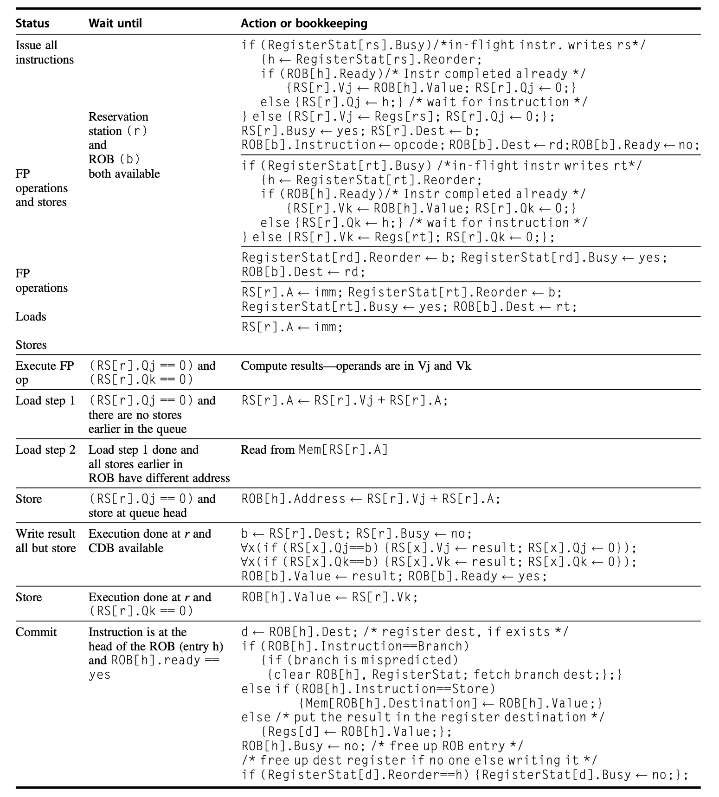</div>

!!! warning "Memory Disambiguation"

    和 register 一样，内存中的数据也可能发生 RAW 冲突

    ```nasm
    ST 0(R2), R5
    LD R6, 0(R3)
    ```

    编译时两个地址可能还无法确定，因此在 load 阶段需要在 ROB 中比对 store 相关的地址。

## 3.12 Multi-Issue

| 架构类型                           | 发射结构 | 冲突检测 | 调度方式     | 主要特点        | 代表处理器                               |
| ------------------------------ | ---- | ---- | -------- | ----------- | ----------------------------------- |
| 静态超标量（Superscalar Static）      | 动态发射 | 硬件检测 | 静态调度     | 顺序执行        | Sun UltraSPARC II                   |
| 动态超标量（Superscalar Dynamic）     | 动态发射 | 硬件检测 | 动态调度     | 部分乱序执行      | IBM Power2                          |
| 推测超标量（Superscalar Speculative） | 动态发射 | 硬件检测 | 带推测的动态调度 | 支持推测执行的乱序执行 | Pentium III/4、MIPS R10K、Alpha 21264 |
| VLIW / LIW                     | 静态发射 | 软件检测 | 静态调度     | 发射包内不存在冲突   | Trimedia、i860                       |
| EPIC                           | 主要静态 | 主要软件 | 主要静态     | 编译器显式标注依赖关系 | Itanium                             |

### Superscalar

超标量的核心目标是在**一个时钟周期内发射多条指令**，从而进一步挖掘 ILP。多发射处理器的性能提升来自更宽的 issue width，但硬件复杂度也会随 issue width 迅速上升。

#### Static Superscalar

编译器准备好一个可能并行的 instruction group，硬件再在 issue 阶段确认。

- 如果同一组指令之间没有依赖，也没有结构冲突，就可以在同一个周期内发射；
- 否则只能发射其中一部分，剩下的指令需要等待。

!!! info "Issue Packet"

    - 一组尝试在同一个 cycle 中发射的指令
        - packet 内部：需要检查指令之间是否互相依赖，是否争用同一资源；
        - packet 之间：需要检查当前 packet 是否依赖前面已经发射但尚未完成的指令。

静态超标量的主要问题是 **issue check 过于复杂**。即使只是 2-issue，硬件也要同时检查：

- 2 条指令的 opcode；
- 多个 register specifiers；
- 两条指令之间是否存在数据依赖；
- 两条指令是否使用同一个功能单元或同一个写回端口。

如果扩展到 $N$-issue，需要比较的指令对数大致随 $N^2$ 增长：

$$
\text{number of pairwise checks}\approx O(N^2)
$$

- 这会限制 clock cycle time，因为 issue stage 必须在一个周期内完成大量比较和控制决策。

#### Dynamic Superscalar

它不再完全依赖编译器把指令排好，而是让硬件在运行选择多条指令发射或执行。

1. **Pipeline**：把 issue check 拆成多个更短的阶段，即流水线化。
2. **Widen the issue logic**：增加 issue logic 的宽度，一次能检查更多候选指令。

!!! example "Loop Example"

    一个典型循环如下：

    ```nasm
    Loop:
        L.D     F0, 0(R1)        # load X[i]
        ADD.D   F4, F0, F2       # FP add
        S.D     F4, 0(R1)        # store result
        DADDIU  R1, R1, #-8      # update pointer
        BNE     R1, R2, Loop     # loop branch
    ```

    这段循环中的限制如下：

    - `L.D -> ADD.D` 存在 RAW dependence，`ADD.D` 必须等 load 的值可用；
    - `ADD.D -> S.D` 存在 RAW dependence，store 需要等待 `F4` 的结果；
    - `DADDIU -> BNE` 存在 RAW dependence，branch 依赖更新后的 `R1`；
    - load / store 都需要 memory unit；
    - 地址计算、整数加法、branch 判断可能都竞争 integer unit。

如果处理器只有：

- 1 个 memory unit；1 个 integer unit；1 个 FP unit；

<div style="text-align: center">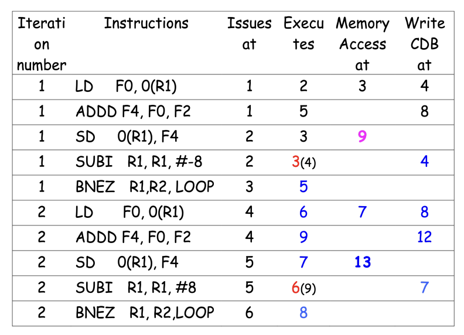</div>

- 可以看到即使 issue logic 很宽，实际执行时也可能被 functional unit 限制。图中 integer unit 就成为了瓶颈。（括号内是改进前的结果）
- 一个改进方向是把**地址计算**和**真正访存**拆开并流水化。
    - 但这种优化也会引入新的结构冲突，例如多条指令可能在同一周期准备写回结果。如果只有一条 write CDB / write-back port，就需要错开写回时间，或者增加多条 bus / CDB。

#### Speculative Superscalar

把前面的 hardware speculation 扩展到多发射处理器中，这种结构通常需要：

- **branch prediction**：预测下一批要取的指令；
- **register renaming**：消除 WAR / WAW；
- **reservation stations / issue queue**：保存等待执行的指令；
- **ROB**：保存推测执行结果，并保证 in-order commit；
- **multiple commit**：每个周期可能提交多条已经完成且非推测的指令。

!!! warning "多发射 + 推测执行的关键"

    在普通 speculation 处理器中，每次 commit 指令需要检查 ROB 队头是否 ready。在 Superscalar speculative processor，每个周期可能尝试 commit 多条指令，因此硬件还要处理：

    - ROB 队头连续多条指令是否都 ready；
    - 这些指令之间是否包含 branch、store 或 exception；
    - Store 是否可以真正更新 memory；
    - 如果其中一条 branch mispredict，后面的推测结果必须全部丢弃。

| 加入预测前                                                                 | 加入后                                                                   |
| --------------------------------------------------------------------- | --------------------------------------------------------------------- |
| <div style="text-align: center">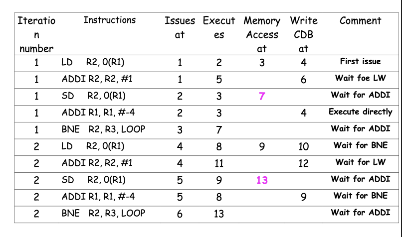</div> | <div style="text-align: center">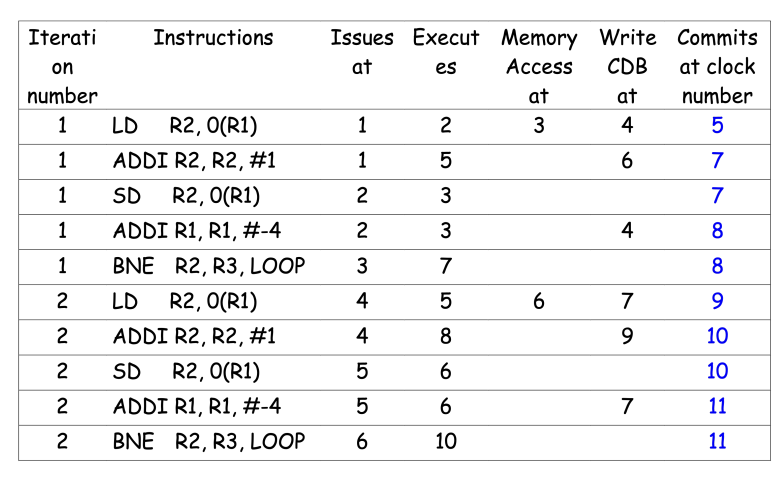</div> |

```cpp
A[0] = A[0] + B[0];
for(i=1;i<99;i++){
	B[i+1] = C[i] + D[i]
}
```
