# Data-Level Parallelism

本章主要介绍三部分内容，它们都是 ==SIMD (single instruction multiple data)== 的变体：

- **向量架构**(vector architecture)
- **多媒体 SIMD 指令集扩展**(multimedia SIMD instruction set extensions)
- **图形处理器**(graphic processing units, GPUs)

---

## 4.1 Vector Architecture

### 1. RV64V Extension

**向量架构**的原理：

- 获取分散在内存中的数据元素集，将它们放在一个较大的顺序寄存器堆内，在寄存器堆上对数据进行操作，最后将结果分散放回到内存中。
- *单条指令作用在向量数据上，导致在独立的数据元素上有多个寄存器 - 寄存器运算*

<div style="text-align: center">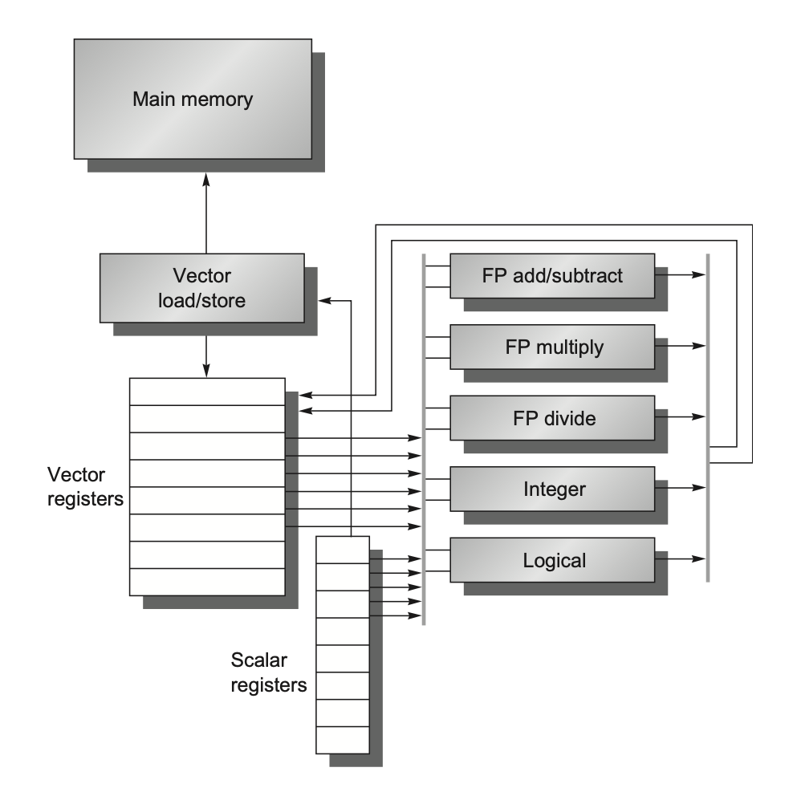</div>

- **向量寄存器**(vector registers)：
    - RV64V 有 $32$ 个向量寄存器，每个向量寄存器的大小为 $64$ 位，保存一个向量
        - 向量寄存器堆需要提供足够量的端口，以供给向量功能单元；
          这些端口允许不同向量寄存器的向量运算间的高度重叠
    - 至少有 $16$ 个读端口和 $8$ 个写端口，通过一堆纵横开关和功能单元相连
    - 提升寄存器堆带宽的一个方法是使用**多分区**(multiple banks)
- **向量功能单元**(vector functional units)：
    - 所有单元都是<u>完全流水线化</u>的，并且每个时钟周期都可以开始一条新的指令
        - 如果一条向量是 $n$ 位的，就需要 $n$ 个 cycle 的时间处理
    - 控制单元用于检测冒险，包括功能单元的结构冒险和寄存器访问的数据冒险
- **向量加载 / 存储单元**(vector load/store unit)：
    - 完全流水线化，这样能保证在初始时延后，每个时钟周期的带宽为一个字
    - 它们也能用于处理标量的加载和存储
- **标量寄存器组**(a set of scalar registers)：
    - 它们主要提供数据和计算好的地址
    - 在 RV64V 中，有 $31$ 个通用目的寄存器，以及 $32$ 个浮点数寄存器

??? abstract "RV64V 向量指令"

    <div style="text-align: center">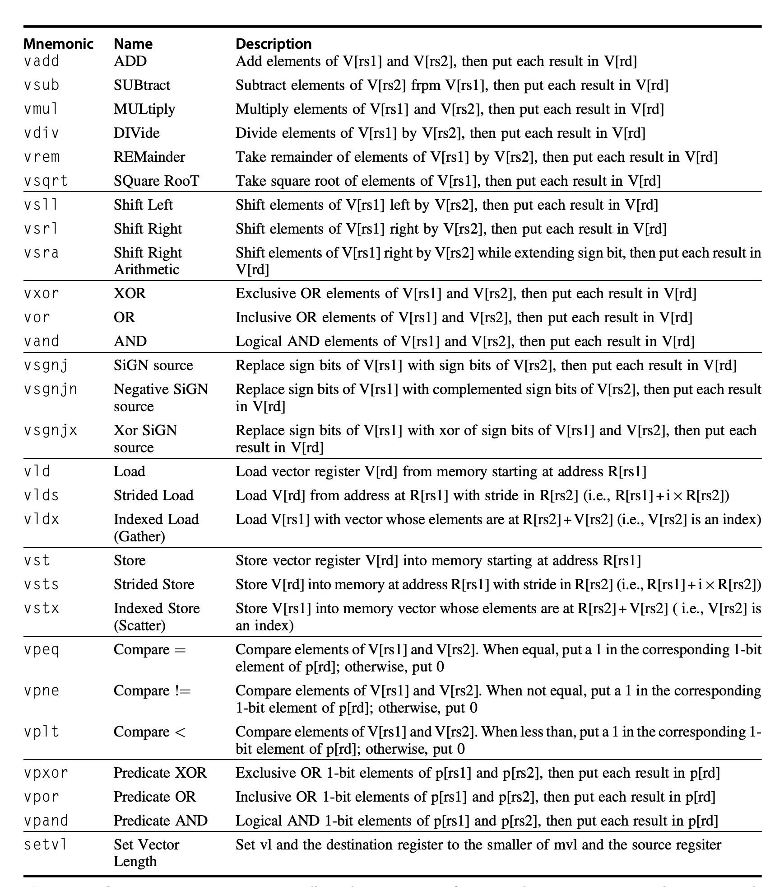</div>

#### Dynamic Register Typing

Dynamic Register Typing（动态寄存器类型）其核心是：

- **寄存器的数据类型和元素宽度不直接编码在指令中，而是在程序运行时动态配置。**

在执行向量指令之前，程序会先配置向量寄存器的：

- <u>数据类型</u>（整数 / 浮点数）；<u>元素宽度</u>（8/16/32/64 bit）；<u>向量长度</u>
- 随后，同一条向量指令即可适用于不同的数据格式：
    - 配置为 `int32` 时，`vadd` 表示整数加法
    - 配置为 `float64` 时，`vadd` 表示双精度浮点加法

向量处理器允许程序“关闭”未使用的向量寄存器，并将存储空间分配给正在使用的寄存器

- 例如：系统共有 $1024 \text{ bytes}$ 的向量寄存器存储空间
  如果程序只启用 $4$ 个向量寄存器，则每个寄存器可分配：$1024 / 4 = 256 \text{ bytes}$
- 这意味着使用的寄存器数量越少，每个寄存器能够容纳的**向量长度**（MVL, Maximum Vector Length）越大

#### Code Examples

!!! example "DAXPY Example"

    - Double precision:

        $$
        Y=aX+Y
        $$

        - $X$ and $Y$ have 32 elements
        - $x_5$ and $x_6$ hold the starting address of $X$ and $Y$, respectively
    - Here is the RISC-V code:
        - 标量代码需要显式循环，每次处理一个元素

    ```nasm
    	  fld     f0,a              # Load scalar a
        addi    x28,x5,#256       # Last address to load
    Loop:
        fld     f1,0(x5)          # Load X[i]
        fmul.d  f1,f1,f0          # a × X[i]
        fld     f2,0(x6)          # Load Y[i]
        fadd.d  f2,f2,f1          # a × X[i] + Y[i]
        fsd     f2,0(x6)          # Store into Y[i]
        addi    x5,x5,#8          # Increment index to X
        addi    x6,x6,#8          # Increment index to Y
        bne     x28,x5,Loop       # Check if done
    ```

    - Here is the RV64V code for DAXPY:
        - 
    向量版本一次处理整段 vector

    ```nasm
    vsetdcfg   4*FP64         # Enable 4 DP FP vector registers
    fld        f0,a           # Load scalar a
    vld        v0,x5          # Load vector X
    vmul       v1,v0,f0       # Vector-scalar multiply
    vld        v2,x6          # Load vector Y
    vadd       v3,v1,v2       # Vector-vector add
    vst        v3,x6          # Store the sum
    vdisable                  # Disable vector registers
    ```

!!! tip "为什么向量版本快"

    - 没有 loop-carried dependence
        - dependences between iterations of a loop
    - 循环控制开销大幅减少
    - 每条向量指令只需要为第一个元素承担 stall / startup
    - 后续元素可以沿着流水线连续流动

!!! info "Vector Chaining"

    当一个 vector operation 产生某个元素的结果后，依赖它的下一条 vector operation 可以**立刻使用**这个元素，而不用等整条向量全部计算完。

    > ==Flexible chaining== 允许一条 vector instruction 与几乎任意 active vector instruction 链接，而不只限于固定功能单元之间的 forwarding。

    ```nasm
    vmul v1, v0, f0
    vadd v3, v1, v2
    ```

    -  `vadd` 不必等 `vmul` 完成所有元素，只要 `v1[0]` 可用，就可以开始处理 `v3[0]`。
    - 这类似 forwarding，但粒度是 *vector element*。

### 2. Vector Execution Time

分析向量执行时间时，需要关注：

- operand vector length：向量寄存器中元素个数，决定了每条向量指令的执行周期数
- vector unit initiation rate：向量功能单元的启动频率（通常每周期接受一个新向量元素）
- structural hazards
- data hazards

#### Convoy and Chime

==Convoy==：一组可以**同时开始执行**的 vector instructions

- 把一段向量指令序列划分成若干 convoy，划分规则：
    - 同一个 convoy 内**不允许有 structural hazard**
    - **RAW 可以存在**，因为向量指令之间可以通过 **chaining** 处理
==Chime==：执行一个 convoy 所需的时间，记为 1 chime
- 如果一个 vector sequence 有 $m$ 个 convoys，则需要 $m$ 个 chimes。
- 若向量长度为 $n$，并忽略 issue overhead 和 startup time，则近似执行时间：

$$
\text{Time}\approx m\times n \text{ cycles}
$$

!!! warning

    **属于不同 convoy 的指令之间必须串行执行。** Cross-convoy instructions are serialized

#### Example: DAXPY Convoys

DAXPY 的向量指令序列：

```asm
vld   v0, x5                # Load vector X
vmul  v1, v0, f0            # Vector-scalar multiply
vld   v2, x6                # Load vector Y
vadd  v3, v1, v2            # Vector-vector add
vst   v3, x6                # Store the sum
```

假设每种 vector functional unit 只有一个，则存在如下结构冲突：

- `vld` 和 `vld` 不能放在同一个 convoy
- `vld` 和 `vst` 也不能同时使用同一个 load/store unit

因此上述指令可以分成 3 个 convoys：

1. `vld v0, x5` + `vmul v1, v0, f0` (v0 dependence)
2. `vld v2, x6` + `vadd v3, v1, v2` (v2 dependence)
3. `vst v3, x6`

假设向量长度为 32，时间开销如下：

$$
\text{cycles}=3\times 32=96
$$

DAXPY 中每个元素有 2 个 FLOPs（multiply 和 add），浮点运算数如下：

$$
32\times2=64\text{ FLOPs}
$$

Cycles per FLOP，用于衡量计算效率的指标如下：

$$
\frac{96}{64}=1.5 \text{ cycles/FLOP}
$$

### 3. Optimizing Vector Architecture

#### Multiple Lanes

通过使用多个功能单元来提升向量运算性能，每个周期处理多个元素

<div style="text-align: center">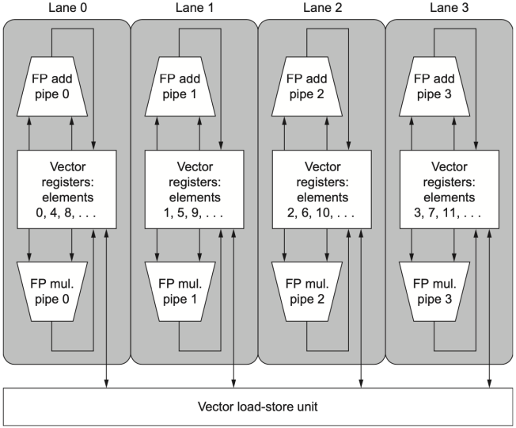</div>

如果有 $L$ 条 lanes，理想情况下：$\text{time per convoy}\approx \dfrac{n}{L}$
其核心做法是：

- vector register memory 被分散到多条 lanes
- 每条 lane 负责一部分 vector elements
- 多个功能单元并行处理不同元素

!!! note

    lane 数越多，吞吐率越高，但寄存器文件端口、交叉开关、内存带宽压力也更大。

#### Vector-Length Register

现实程序中，向量长度常常在编译时未知。
**Vector-length register (`vl`)** 用来控制当前 vector instruction 实际处理多少元素

- 约束：The value in `vl` cannot be greater than the maximum vector length (`mvl`)

<div style="text-align: center">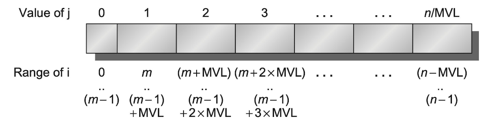</div>

**向量寄存器有**长度限制，当处理的向量长度超过了 MVL 时，采用==Strip Mining==（分条开采）

- 把循环拆成两层：
    - 外层循环：每次处理 $\min(\text{mvl, 剩余元素数})$ 个元素
    - 内层循环：处理剩下的这些元素

**RISC-V 指令 setvl**：

$$
vl=\min(mvl,n)
$$

- $n$：剩余待处理的元素数（循环变量）；$\text{mvl}$：硬件最大向量长度
- 这条指令会把实际设置的 $\text{vl}$ 值写入通用寄存器 $t_0$，方便后续指针移动和循环控制

!!! example

    任意长度 DAXPY 的 RV64V 代码框架：

    ```asm
    	 vsetdcfg 2*FP64       	# Enable 2 64-bit FP vector registers
    	 fld      f0, a        	# Load scalar a
    loop:
        setvl    t0, a0     	# vl = t0 = min(mvl, n)，a0 为向量的元素数量 n
        vld      v0, x5     	# Load vector X segment
        slli     t1, t0, 3  	# t1 = vl * 8 bytes， 每个元素 8 byte
        add      x5, x5, t1 	# Move X pointer
        vmul     v0, v0, f0 	# a * X
        vld      v1, x6     	# Load vector Y segment
        vadd     v1, v0, v1 	# a * X + Y
        sub      a0, a0, t0		# n -= vl
        vst      v1, x6     	# Store result to Y
        add      x6, x6, t1 	# Move Y pointer
        bnez     a0, loop   	# Continue if n != 0
    	 vdisable
    ```

#### Predicate Registers

循环中常常有 `if`，如果直接分支会破坏向量化，例如：

```c
for (i = 0; i < 64; i++)
	if (X[i] != 0)
		X[i] = X[i] - Y[i];
```

**解决方法**：用 **predicate register（谓词寄存器）** 实现**条件执行**，而不是分支

!!! info "Predicate Register"

    Predicate register 是一个**位向量（bit vector）**，每个 bit 对应向量中的一个元素位置

    - mask bit = 1：对应元素**参与**运算
    - mask bit = 0：对应元素**不参与**运算，目标寄存器中该元素**保持不变**

    ```text
    Predicate Register p0:  [1, 0, 1, 1, 0, 1, 0, 1]
                             ↑  ↑  ↑  ↑  ↑  ↑  ↑  ↑
    元素位置:                 0  1  2  3  4  5  6  7
    ```

    **三条核心规则**

    1. 设置 Predicate Register 后，后续向量指令只操作 mask = 1 的元素
    2. mask = 0 对应的目标元素**不受影响**
    3. 启用 Predicate Register 时，初始化为全 1

我们称这种扩展能力为**向量掩码控制**(vector-mask control)，而编译器设计者则将其称为 **IF- 转换**(IF-conversion)，也就是编译器把分支转换成**直线向量代码**。

!!! example

    原始形式：

    ```c
    for (i = 0; i < n; i++) {
        if (X[i] != 0) {
            Y[i] = a * X[i] + Y[i];
        }
    }
    ```

    向量化思想：

    ```asm
    vsetdcfg 2*FP64 	# 启用 2 个 64 位浮点向量寄存器 
    vsetpcfgi 1 		# 启用 1 个谓词寄存器 
    vld v0,x5 		 	# 将向量 X 加载到 v0 
    vld v1,x6			# 将向量 Y 加载到 v1 
    fmv.d.x f0,x0 		# 将（浮点）零放入 f0 
    vpne p0,v0,f0 		# 如果 v0(i) != f0，则将 p0(i) 设为 1 
    vsub v0,v0,v1 		# 在向量掩码下执行减法 
    vst v0,x5 			# 将结果存储到 X 
    vdisable 			# 禁用向量寄存器 
    vpdisable 			# 禁用谓词寄存器
    ```

    - 这里的 `vpne` 是进行比较，如果两个值相同就把目标寄存器的值赋为 1，反之为 0

#### Memory Banks

向量机的性能很大程度取决于内存系统。向量 load/store 需要连续、高带宽、可流水的内存访问
多个 memory banks 的作用：

- 支持多个 load/store 同时访问（**单个内存 bank 的周期时间通常是处理器周期时间的好几倍**）
- 支持非连续数据访问
- 让多个处理器共享内存系统时仍能提供高带宽

!!! example "向量处理器"

    - Cray T90
        - 32 个 processors，每个 processor 每周期 4 loads + 2 stores
        - processor cycle time = 2.167 ns（处理器一个时钟周期的时间）
        - SRAM cycle time = 15 ns（一次完整的内存读写的时间）
    - 所有 processors 每周期最多引用：$(4+2)\times32=192$
        - 每个时钟周期，系统中最多有**192 个**同时发出的内存访问请求
    - SRAM bank 忙碌时间按 processor cycles 计：

    $$
    \text{占用周期数}= \frac{\text{SRAM cycle time}}{\text{Processor cycle time}}=\frac{15}{2.167}\approx6.92\approx7
    $$

    - **要让每周期的 192 个请求都不被阻塞**，最少 banks：$192\times7=1344$

#### Stride

**Stride（步长）**= 向量中**相邻两个元素在内存中的地址间隔**

1. **Unit stride**：stride = 1，相邻元素连续存
2. **Nonunit stride**：stride > 1，相邻元素间隔访问

!!! info "很多在向量中相邻元素在内存中的地址不一定连续"

    ```c
    for (int i = 0; i < 100; i++)
    	for ( int j = 0; j < 100; j++) {
    		A[i][j] = 0.0;
    		for (int k = 0; k < 100; k++)
    			A[i][j] = A[i][j] + B[i][k] * D[k][j];
    	}
    ```

    - 假设按行优先存储（row-major order），
      访问 $D$ 数组中相邻元素时，地址间隔为：行大小 × 8（每个元素的字节数）

向量指令：

- `VLDS Vd, Rs, stride` (load vector with stride)：从内存中按指定步长读取向量到向量寄存器
    - Vd = 目标向量寄存器, Rs = 基地址, stride = 步长（字节）
- `VSTS Vs, Rs, stride` (store vector with stride)：从向量寄存器按指定步长写回内存

```asm
# 设 Rs = &D[0][3]（第 3 列首元素地址）, stride = 200 × 8 = 1600 字节（一行的字节数）
VLDS  V0, Rs, 1600    # 读取 D[0][3], D[1][3], D[2][3], ... 到 V0
VLTS  V1, Rs, 1600    # 写入 D[0][3], D[1][3], D[2][3], ... 到 V1
```

!!! example

    - 8 memory banks
    - bank busy time = 6 cycles
    - total memory latency = 12 cycles

    ** If vector length = 64, Stride = 1**

    - 8 个 bank 编号 0~7，连续访问依次命中，由于 bank 的数量大于 busy time ，因此**永远不会冲突**。流水线完全启动后，**每周期返回 1 个元素**。总时间：$12+64=76\text{ cycles}$

    **If Stride = 32**

    - 访问序列和 bank 的映射：
        - 元素地址:  0, 32, 64, 96, ...
        - bank = address % 8: $0\%8=0, 32\%8=0, 64\%8=0, 96\%8=0$，全部命中 bank 0！
    - 每次访问都落到 bank 0，从第二次访问开始冲突。总时间：$12+1+6\times63=391\text{ cycles}$

!!! warning "Bank Conflict"

    当连续访问落到同一个 busy bank 上，就会发生 ==bank conflict==

    $$
    \frac{\text{LCM}(\text{stride},\text{number of banks})}{\text{stride}}
    <\text{bank busy time}
    $$

    若上式成立，则会发生 bank conflict。

#### Gather-Scatter

稀疏矩阵或稀疏向量中，非零元素不连续，需要 index vector 指定元素位置。

- **Gather**：<u>把非零元素"收集"到连续寄存器</u>
  根据 base address 和 index vector 中的 offsets 计算地址，从内存中取出分散的元素，并将其放到 dense vector register 中
- **Scatter**：<u>把结果放回稀疏结构在内存中的正确位置</u>
  将 dense vector register 中的结果根据 index vector 分散写回内存
向量指令：
- `VLDX Vd, Rs, Vi`：indexed vector load / gather，instruction to load vector indexed or gather
- `VSTX Vs, Rs, Vi`：indexed vector store / scatter，instruction to store vector indexed or scatter

!!! example

    原始形式：

    ```c
    for (i = 0; i < n; i++)
    	A[K[i]] = A[K[i]] + C[M[i]];
    ```

    向量化思想：

    ```asm
    vsetdcfg 4*FP64         # 4 个 64 位浮点向量寄存器 
    vld v0, x7              # 加载 K[] 
    vldx v1, x5, v0         # 加载 A[K[]] 
    vld v2, x28             # 加载 M[] 
    vldx v3, x6, v2         # 加载 C[M[]] 
    vadd v1, v1, v3         # 将它们相加 
    vstx v1, x5, v0         # 存储 A[K[]] 
    vdisable                # 禁用向量寄存器
    ```

    - 这里的 x5, x6 对应 A, C；x7, x28 对应 K, M

---

## 4.2 Multimedia SIMD

Multimedia SIMD 可以看作“**固定宽度的小型向量处理**”，更适合**较短、固定长度的数据**并行操作。它的想法是把多个较小的数据元素打包进一个宽寄存器中，然后用一条指令对这些元素执行同一种操作。

和向量处理器相比，Multimedia SIMD 省略了以下机制：

- **vector length register**：不能像 `vl` 那样动态指定本次向量指令实际处理多少元素；
- **strided / gather-scatter transfer instructions**：对非连续访问和稀疏访问的支持较弱；
- **mask registers**：传统 multimedia SIMD 不能像向量架构那样自然地对每个元素做条件执行。

因此，在使用 Multimedia SIMD 时，程序员或编译器通常需要把循环拆成固定宽度的小块。例如 256-bit SIMD 每次处理 4 个 double，那么主循环每次前进 4 个元素；如果数组长度不是 4 的整数倍，尾部剩余元素需要单独处理。

!!! example "RISC-V SIMD code for DAXPY"

    ```nasm
    	   fld      f0, a          # Load scalar a 
    	   splat.4D f0, f0.        # Make 4 copies of a 
    	   addi     x28, x5, #256  # Last address to load 
    Loop: fld.4D   f1, 0(x5)      # Load X[i] ... X[i+3] 
    	   fmul.4D  f1, f1, f0     # a×X[i] ... a×X[i+3] 
    	   fld.4D   f2, 0(x6)      # Load Y[i] ... Y[i+3] 
    	   fadd.4D  f2, f2, f1     # a×X[i]+Y[i]... 
    						       # a×X[i+3]+Y[i+3] 
    	   fsd.4D   f2, 0(x6).     # Store Y[i]... Y[i+3] 
    	   addi     x5, x5, #32    # Increment index to X 
    	   addi     x6, x6, #32    # Increment index to Y 
    	   bne     x28, x5, Loop   # Check if done
    ```

    - $256$ -bit 宽的 SIMD 指令，如果操作数是 double precision，那么每个元素为 $64$ bit，一条指令一次可以处理 $4$ 个 double precision 元素。
    - `.4D` 的含义：一条 SIMD 指令同时作用在 $4$ 个 DP operands 上

### Roofline Visual Performance Model

一种的直观比较 SIMD 架构变体的潜在浮点性能的可视化方法是**屋顶线模型**(Roofline model)。它用二维图形表示 **浮点数性能（floating-point performance）**、**内存性能（memory performance）** 以及 **算术强度（arithmetic intensity）** 之间的关系。

!!! info "Arithmetic Intensity"

    ==算数强度（Arithmetic intensity）== 定义为：

    $$
    \text{Arithmetic Intensity}
    =
    \frac{\text{FP operations}}{\text{Bytes of memory accessed}}
    $$

    它表示每访问 $1$ byte 内存，程序平均能做多少次浮点运算。这个值越高，说明数据被读入后能被复用得越充分；这个值越低，说明程序大部分时间可能都花在搬数据上。

Roofline 的基本性能上界可以写成：

$$
\text{Attainable Performance}
\le
\min(\text{Peak FP Performance},\ \text{Memory Bandwidth}\times\text{Arithmetic Intensity})
$$

- 算数强度较低时，$\text{Memory Bandwidth}\times\text{Arithmetic Intensity}$ 是主要限制，程序是 *memory-bound*
- 算数强度足够高时，接近处理器的 peak FP performance，此时更偏 *compute-bound*

!!! tip "Roofline 的判断方法"

    - 如果程序落在斜线区域，说明内存带宽是主要瓶颈，应优先提高数据局部性、减少内存访问、增加数据复用。
    - 如果程序落在水平屋顶附近，说明计算单元已经成为主要瓶颈，应考虑提高 SIMD/GPU 利用率。
    - 还可以用 Stream benchmark 测量 peak memory performance

下图展示了 GFLOP/s 与 roofline 的关系

$$
\text{Attainable GFLOPs}/s=\text{Min(Peak Memory BW} \times \text{Arithmetic Intensity}, \text{Peak Floating}-\text{Point Perf.})
$$

<div style="text-align: center">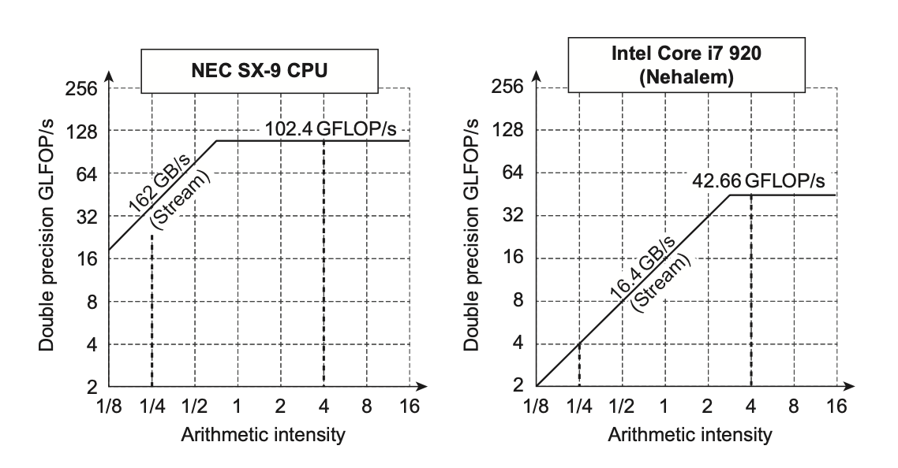</div>

考虑模型中斜线上升段和水平平台段的==汇聚点==：

- 如果在很右侧的位置上，那么只有少数具备高算术强度的内核才能达到计算机的最大性能
- 如果在很左侧的位置上，那么几乎所有内核都能达到最大性能
向量处理器相比其他 SIMD 处理器而言，同时具备**较高的内存带宽，以及靠左的汇聚点**。

---

## 4.3 GPU

GPU 支持**多种形式的并行**，包括 <u>multithreading、MIMD、SIMD 和 ILP</u>。

- GPU 不只是“很多 ALU”，而是一套围绕大量线程和 SIMD 化执行组织起来的并行系统。

GPU 编程的难点不仅在于让 GPU kernel 本身跑得快，还在于协调：

- system processor 和 GPU 之间的计算调度；
- system memory 和 GPU memory 之间的数据传输；
- 线程、线程块和硬件 SIMD 处理器之间的映射关系。

### 1. NVIDIA CUDA

CUDA（Compute Unified Device Architecture） 程序分为两侧：

- **host**：运行在 system processor 上，使用 C/C++
- **device**：运行在 GPU 上，使用 CUDA C/C++ 方言

CUDA 通过 CUDA Threads 实现并行性，其执行模型称为 ==SIMT（Single Instruction, Multiple Thread）==。程序员编写大量线程，硬件自动将线程按 **Warp（32 个线程）** 为单位分组，同一 Warp 内的所有线程同步执行同一条指令，本质上是 SIMD 操作。

!!! info "CUDA Function Declaration"

    | 关键字          | 含义                                |
    | :----------- | :-------------------------------- |
    | `__host__`   | host 端函数，在 CPU 上执行                |
    | `__device__` | device 端函数，在 GPU 上执行              |
    | `__global__` | GPU kernel，由 host 调用、在 device 上执行 |

    如果变量用 `__device__` 声明，它会被分配在 GPU memory 中，并且可以被所有 multithreaded SIMD processors 访问。

GPU function call 的形式为：

```cpp
name<<<dimGrid, dimBlock>>>(parameter_list);
```

其中：

- `dimGrid` 表示 grid 的维度，单位是 thread blocks；
- `dimBlock` 表示 block 的维度，单位是 threads；
- `blockIdx` 表示当前 block 的编号；
- `threadIdx` 表示当前 thread 在 block 内的编号；
- `blockDim` 表示每个 block 中的 thread 数量，来自 `dimBlock`
这些变量共同决定一个 thread 要处理哪一个数据元素。

!!! example "DAXPY in CUDA"

    假设使用每个 thread block 有 $256$ 个 threads

    Host 端代码先根据向量长度 $n$ 计算需要多少个 blocks：

    ```cpp
    // Invoke DAXPY with 256 threads per Thread Block
    __host__
    int nblocks = (n + 255) / 256;
    daxpy<<<nblocks, 256>>>(n, 2.0, x, y);
    ```

    GPU kernel 如下：

    ```cpp
    // DAXPY in CUDA
    __global__
    void daxpy(int n, double a, double *x, double *y) {
        int i = blockIdx.x * blockDim.x + threadIdx.x;
        if (i < n) y[i] = a * x[i] + y[i];
    }
    ```

    每个 thread 通过下面的式子计算自己负责的元素编号：

    $$
    i=\text{blockIdx.x}\times \text{blockDim.x}+\text{threadIdx.x}
    $$

!!! warning "Thread Block 的独立性"

    为简化硬件调度，CUDA 要求线程块能够**以任意顺序独立执行**。规定不同的线程块之间不得直接通信。因此，CUDA 程序不能依赖不同 blocks 的执行顺序，也不能假设 block 之间能直接同步。

### 2. GPU Micro-architectural Features

??? info "GPU 的一些术语"

    <div style="text-align: center">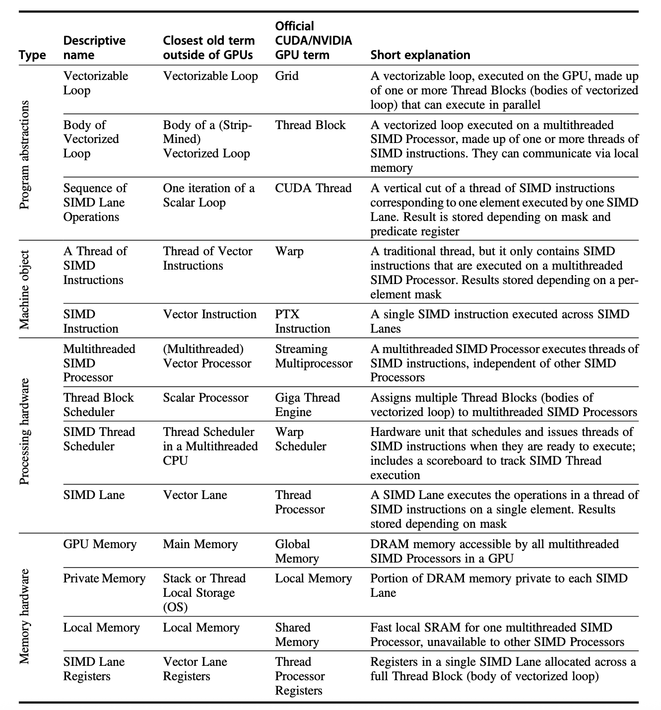</div>

下面用一个 $A=B\times C$ 的向量乘法例子说明 CUDA 的层级结构：

- vector multiply；
- $8192$ elements；
- 每个 thread 处理 $32$ 个 elements；
- 每个 block 有 $16$ 个 threads；
- 一共有 $16$ 个 blocks。

<div style="text-align: center">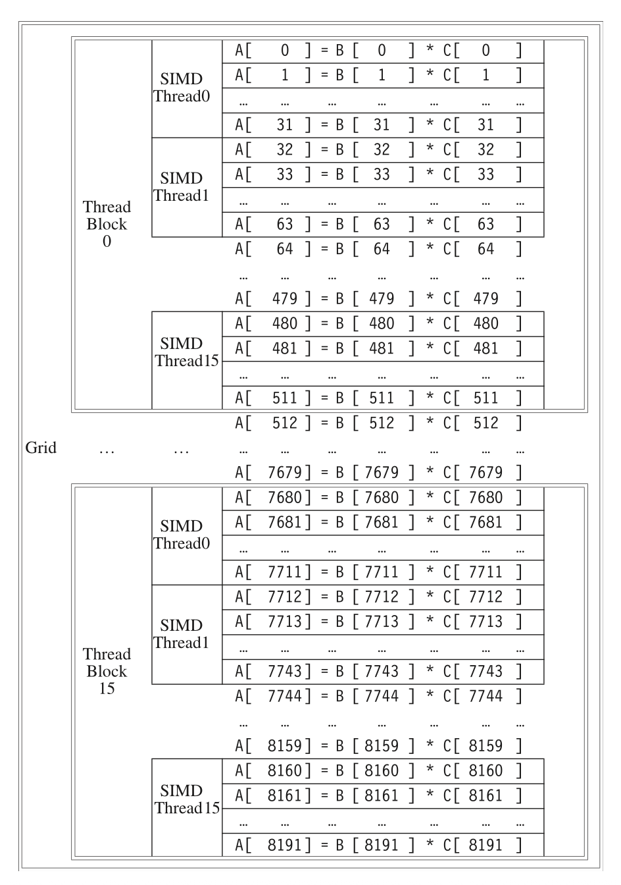</div>

总共处理的元素数为：

$$
16\text{ blocks}\times16\text{ threads/block}\times32\text{ elements/thread}=8192
$$

这个例子想表达的是：GPU 程序不是只把一个元素交给一个 thread，也可以让一个 thread 处理一小段连续元素；而 thread、block、grid 的层级决定了工作如何被组织和调度。

#### Multithreaded SIMD Processor

下图展示了一个简化的多线程 SIMD 处理器框图：

- 图中的例子包含 $16$ 条 SIMD lanes
- 而 Pascal P 100 GPU 有 $56$ 个 Multithreaded SIMD Processor

<div style="text-align: center">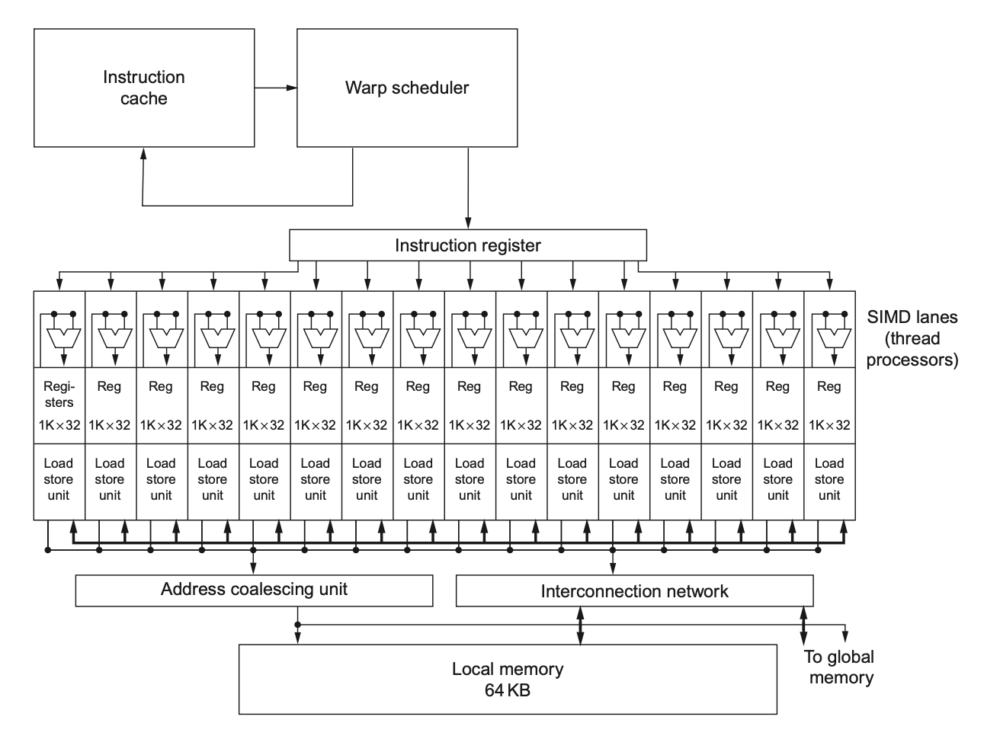</div>

可以这样理解：

- SIMD lanes 是真正执行 SIMD 指令的并行执行通道；
- Multithreaded SIMD Processor 负责管理和执行一组线程；
- GPU 通过大量这样的处理器来支持大规模数据并行。

#### SIMD Thread Scheduler

现代 GPU 通常采用两级调度机制：

- **线程块调度器**（Thread Block Scheduler）：把 thread blocks 分配给 multithreaded SIMD processors 执行
- **SIMD 线程调度器**（SIMD Thread Scheduler）：在一个 SIMD processor 内部，决定哪些 SIMD instructions 现在可以运行

### 3. NVIDIA GPU ISA: PTX

==PTX (Parallel Thread Execution)== 是 NVIDIA GPU 的一种稳定指令集接口

- 给编译器提供稳定目标；
- 在不同 GPU 代际之间保持兼容；
- 程序加载时PTX 会被翻译成GPU 的内部语言

PTX 指令格式为：

```asm
opcode.type d, a, b, c
```

- `d` 是 destination operand，对非 store 指令是 registers，对 store 指令是 memory address
- `a, b, c` 是 source operands，可以是 $32$ -bit / $64$ -bit registers 或 constant

??? info "PTX 指令集"

    <div style="text-align: center">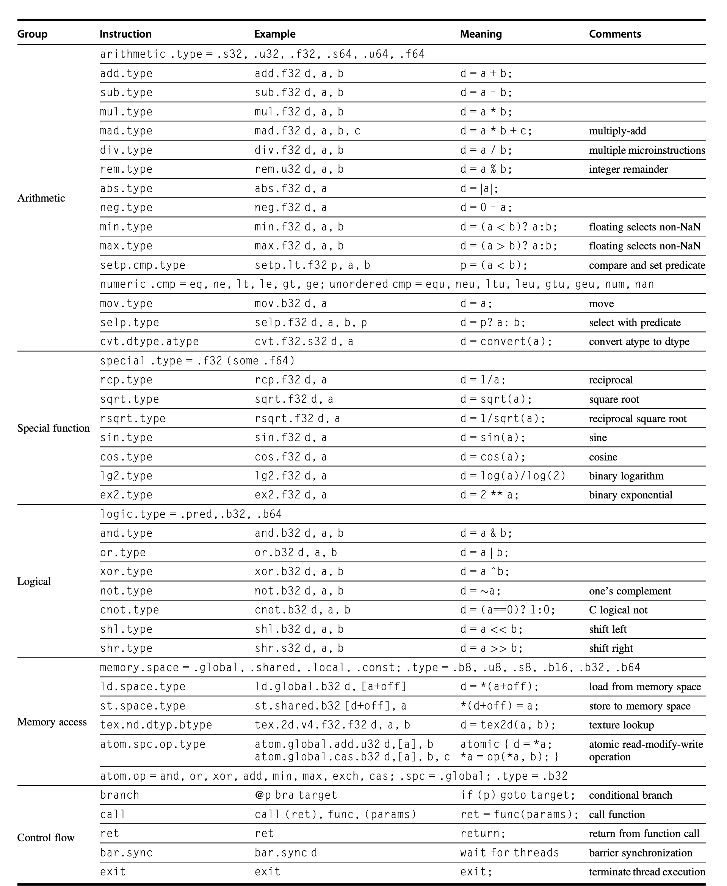</div>

!!! example "DAXPY in PTX"

    ```asm
    shl.u32        R8, blockIdx, 8       ; Thread Block ID * Block size
                                          ; 256 = 2^8
    add.u32        R8, R8, threadIdx     ; R8 = i = my CUDA Thread ID
    shl.u32        R8, R8, 3             ; byte offset
    ld.global.f64  RD0, [X + R8]         ; RD0 = X[i]
    ld.global.f64  RD2, [Y + R8]         ; RD2 = Y[i]
    mul.f64        RD0, RD0, RD4         ; RD0 = RD0 * RD4, scalar a in RD4
    add.f64        RD0, RD0, RD2         ; RD0 = RD0 + RD2
    st.global.f64  [Y + R8], RD0         ; Y[i] = a * X[i] + Y[i]
    ```

    这段代码和 CUDA kernel 的对应关系很直接：

    - 第一条 `shl.u32` 把 `blockIdx` 乘以 $256$，得到当前 block 起始 thread 编号；
    - `add.u32` 加上 `threadIdx`，得到全局线程编号 $i$；
    - 第二条 `shl.u32` 把 $i$ 乘以 $8$，因为 double precision 每个元素是 $8$ bytes；
    - 两条 `ld.global.f64` 从 global memory 中读取 `X[i]` 和 `Y[i]`；
    - `mul.f64` 和 `add.f64` 完成 DAXPY 的浮点计算；
    - `st.global.f64` 把结果写回 `Y[i]`。

### 4. Conditional Branch

GPU 的条件分支是 DLP 架构中的一个重要难点，GPU branch hardware 包括：

- predicate registers（谓词寄存器）
- internal masks（内部掩码）
- branch synchronization stack（分支同步栈）
- instruction markers（指令标记）

#### Predicate Register

- 在底层的 PTX 层面，程序员或编译器会**显式**使用 predicate register来控制指令执行
- **逐线程控制**：在一个 Warp（通常包含 32 个线程）中，每个线程都有独立的谓词状态
- 谓词寄存器非常小，只有**1-bit**
- 设置谓词的指令是：`setp`（"Set Predicate"）

```nasm
setp.gt.s32 p, a, b
```

这条指令的意思是：如果整数 $a$ 大于 $b$，则将谓词寄存器 $p$ 设为 1（True），否则设为 0（False）。这个 $p$ 随后会被后续的算术或逻辑指令引用，决定它们是否执行。

当代码中出现 `if-else` 结构时，GPU 利用谓词寄存器运行代码的过程如下：

1. **处理 THEN 分支**（即条件成立的部分）
    - GPU 是 SIMD 架构，控制器只会发出**一条指令**并广播发送给 Warp 中的**所有**通道
    - 虽然指令广播给了所有通道，但**只有谓词为1**的通道（Lane）才会工作
2. **处理 Else 分支**：逻辑正好相反
    - 之前在 `THEN` 部分活跃的线程（谓词=1），在 `ELSE` 部分会被屏蔽
    - 之前在 `THEN` 部分休眠的线程（谓词=0），在 `ELSE` 部分会被激活

!!! warning "分支发散的效率损失"

    如果 THEN 和 ELSE 路径长度相同，那么一次 IF-THEN-ELSE 的执行效率可能只有 $50\%$ 或更低。如果是两层嵌套 IF，并且路径长度相近，效率可能下降到 $25\%$。这是因为不同 lanes 走不同路径时，SIMD 硬件需要**分批执行**这些路径。

#### Branch Synchronization Stack

对于复杂控制流，仅靠 predicate register 不够，下面介绍==分支同步栈==。

- 在 GPU 的 SIMT 架构中，当线程组遇到分支时，硬件需要记住当前的执行状态，以便在处理完一个分支后能正确恢复并处理另一个分支。这就是分支同步栈的作用。

**每个 SIMD 线程组（Warp）都有自己独立的栈**，当这个 Warp 遇到分支语句时，硬件会为它分配一个专门的栈空间来记录当前的上下文。

- 当分支发生时，硬件会将 stack entry（包含三个关键信息）压入栈中：
    1. **identifier token**（标识符令牌）：用于**标记**这次分支操作的ID
    2. **target instruction address**（目标指令地址）：记录分支结束后的**汇合点**
    3. **target thread-active mask**（目标线程活跃掩码）：记录在进入分支**之前**活跃的线程
- 关于栈的具体操作
    - **Push**：GPU执行到分支指令时，会把当前的“活跃线程掩码”和“返回地址”作为一个 entry推入该Warp对应的分支同步栈中
    - **Pop / Unwind**：
        1. Pop a stack entry：取出栈顶信息
        2. Branch to the target instruction address：根据栈里存的地址，跳转到汇合点
        3. With the target thread-active mask：硬件会根据栈里保存的掩码，重新激活那些之前被“屏蔽”掉的线程
- 这种机制保证了 GPU 虽然采用单指令多线程（SIMT）模式，却能支持复杂的串行逻辑代码（如深层嵌套的 if-else），而不会导致线程死锁或状态丢失。

!!! example "Example of Conditional Statement"

    C 代码

    ```c
    if (X[i] != 0) 
    	X[i] = X[i] - Y[i]; 
    else 
    	X[i] = Z[i];
    ```

    PTX 指令实现 (PTX Instructions)

    ```nasm
    ld.global.f64 RD0, [X+R8]    ; RD0 = X[i] 
    setp.neq.s32 P1, RD0, #0     ; P1 is predicate reg 1 (结果存入谓词寄存器 P1) 
    @!P1, bra ELSE1, *Push       ; Push old mask, set new 
    							  ; mask bits if P1 false, go to ELSE1
    ld.global.f64 RD2, [Y+R8]    ; RD2 = Y[i] (加载 Y[i]) 
    sub.f64 RD0, RD0, RD2        ; Difference in RD0 (计算 RD0 - RD2]) 
    st.global.f64 [X+R8], RD0    ; X[i] = RD0 (将结果存回 X[i]) 
    @P1, bra ENDIF1, *Comp       ; complement mask bits  
                                 ; if P1 true, go to ENDIF1
    ELSE1: ld.global.f64 RD0, [Z+R8] ; RD0 = Z[i] (ELSE 分支开始：加载 Z[i]) 
    st.global.f64 [X+R8], RD0        ; X[i] = RD0 (将 Z[i] 的值赋给 X[i]) 
    ENDIF1: <next instruction>, *Pop ; pop to restore old mask 
    ```

### 5. GPU Memory

英伟达 GPU 的内存结构图如下：

<div style="text-align: center">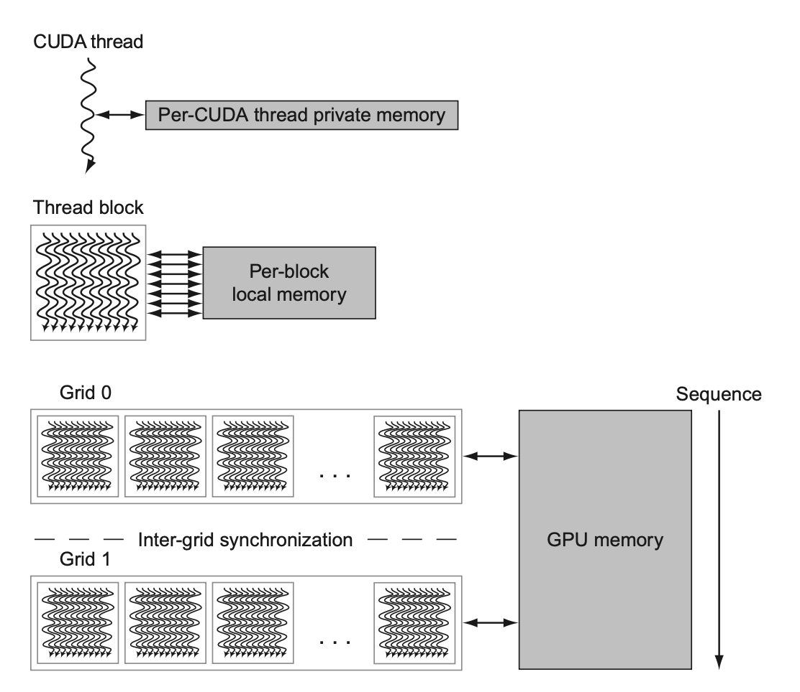</div>

**GPU 的内存可划分为三个层级**：

- **私有内存**(private memory)
    - 位于芯片外的 DRAM，**每个 SIMD 通道（即每个线程）独有**，不会共享私有内存
    - 用于存放栈帧 (stack frame)、溢出寄存器和无法被寄存器容纳的私有变量
    - 虽然 DRAM 速度很慢，但 GPU 会用 **L 1 和 L2 Cache** 对其进行缓存从而提升性能
- **局部内存**(local memory)
    - 芯片上，位于每个多线程 SIMD 处理器内部（通常指 Shared Memory）
    - 低时延，高带宽，容量不大（一般只有 48 KB）
    - **块内共享**：同一个线程块内的所有线程可以共享这块内存
    - **块间隔离**：不同的线程块之间无法访问对方的局部内存
    - **主机不可见**：CPU（主机）无法直接读写这部分内存
- **GPU 内存**(GPU Memory)
    - 芯片外的 DRAM（即全局显存）
    - **全局共享**，CPU 可以将数据写入这里供 GPU 读取，也可以读取 GPU 的计算结果

!!! abstract

    - CPU 使用巨大的 L2/L3 缓存来减少访问内存的次数，但这占据了大量的芯片面积。
    - GPU 不依赖大缓存，而是采用较小的**流式缓存**。
        - **利用大规模并行性隐藏延迟**：GPU 处理的数据量往往高达数百 MB，远超缓存容量，缓存命中率并不理想。当一组线程在等待 DRAM 数据时，GPU 会立即切换去执行另一组已经准备好数据的线程。只要线程数量足够多，计算单元就永远不会空闲。
        - **资源置换**：原本用作缓存的芯片面积，被用来制造 ALU 和寄存器

### 6. Compare GPU with Vector

??? info "GPU 和向量架构中对应的术语"

    <div style="text-align: center">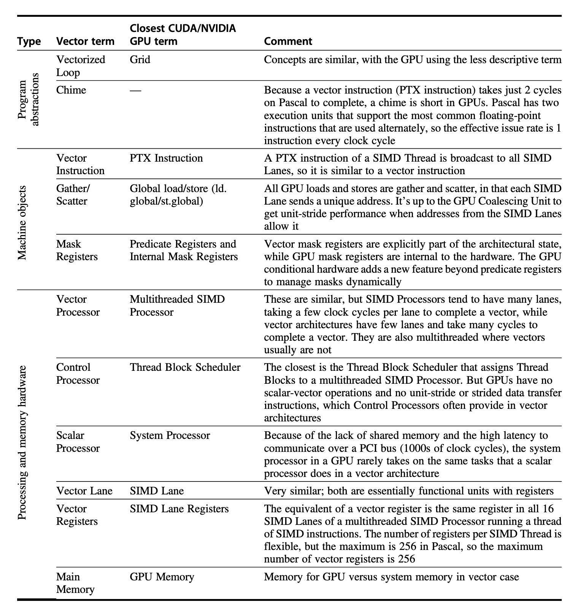</div>

下图为 4 通道的向量处理器和 GPU 上 4 SIMD 通道的多线程 SIMD 处理器：

<div style="text-align: center">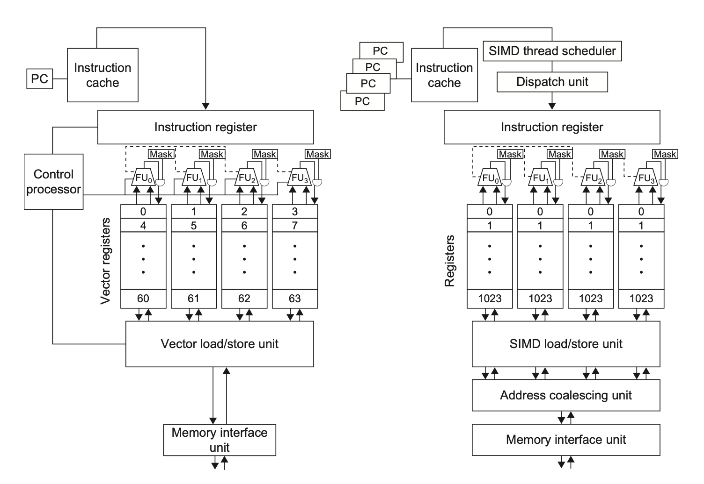</div>

### 7. Compared GPU with Multimedia SIMD

<div style="text-align: center">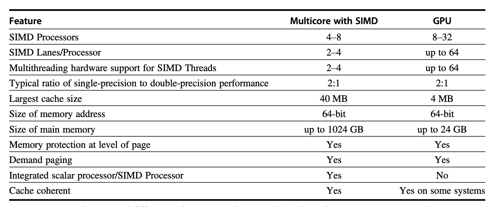</div>

| 架构                  | 程序员看到的抽象         | 适合的数据并行形式           | 特点                                              |
| :------------------ | :--------------- | :------------------ | :---------------------------------------------- |
| Vector Architecture | 一条指令操作一整个 vector | 长向量、可变长度、规则或部分不规则访问 | `vl`、predicate、stride、gather-scatter 等机制        |
| Multimedia SIMD     | 固定宽度 packed data | 短向量、固定长度数据块         | 适合 256-bit 这类短固定向量，省略很多向量机机制                    |
| GPU                 | 大量 CUDA threads  | 大规模线程并行和 SIMT 执行    | 需要协调 host/device、thread blocks、GPU memory 和分支发散 |

!!! abstract "三种 DLP 架构的核心区别"

    - Vector Architecture 把“向量”作为指令级对象，硬件负责连续处理整段向量。
    - Multimedia SIMD 把“固定宽寄存器”作为对象，一条指令处理少量 packed elements。
    - GPU 把“线程”作为程序员可见对象，硬件再把线程组织成 SIMT / SIMD 风格执行。

## 4.4 Loop-Level Parallelism

**Loop-Level Parallelism** 研究循环不同迭代之间能否并行。

- 判断标准是是否存在 **Loop-Carried Dependence（循环间数据依赖）**。

```cpp
for (int i = 999; i >= 0; i--)
	x[i] = x[i] + s;
```

将循环展开，可以看到

```cpp
x[999] = x[999] + s;
...
x[1] = x[1] + s;
x[0] = x[0] + s;
```

循环之间不存在数据依赖，因此容易并行化。

```cpp
for (int i = 0; i < 100; i++)
	A[i+1] = A[i] + C[i];
	B[i+1] = C[i] + D[i];
```

将循环展开，可以看到存在数据依赖

- $A[i+1]$ 的值需要通过 $A[i]$ 得到，但 $A[i]$ 是上一个循环计算得出的

```cpp
A[1] = A[0] + C[0]
B[1] = C[0] + D[1]

A[2] = A[1] + C[1]
B[2] = C[1] + D[1]
```

循环间依赖可以通过改写来解决

```cpp
A[0] = A[0] + B[0]; 
for (i = 0; i < 99; i++) { 
	B[i+1] = C[i] + D[i]; 
	A[i+1] = A[i+1] + B[i+1]; 
} 
B[100] = C[99] + D[99]; // 没有循环间依赖
```
