# Thread-Level Parallelism

本章主要介绍从 ==ILP (instruction-level parallelism)== 到 ==TLP (thread-level parallelism)== 的扩展，以及多处理器共享内存系统中最核心的问题：**cache coherence（缓存一致性）**

- 前面章节讨论单个处理器内部如何提升并行度；
- 本章开始关注多个处理器 / core 执行不同线程时，如何共享内存、通信，以及保证多个 cache 中同一份数据不会互相矛盾。
本章内容可以分成三部分：
- **多处理器架构**(multiprocessor architecture)
- **集中式共享内存**(centralized shared memory)
- **分布式共享内存**(distributed shared memory)

---

## 5.1 Introduction

### 1. From ILP to TLP

==ILP==：由硬件自动发现，是在单条指令流内部寻找并行性，
==TLP==：由软件或程序员显式识别，把并行性提升到**软件层级**

- 程序员、编译器或运行时系统把程序划分成多个 thread，它们各自包含了大量指令，可以在不同 processor / core 上**并行执行**
- Thread 的粒度（grain size）从几百条到几百万条指令不等，因此 TLP 更适合利用多个 processor 的长期并行资源。

多处理器的基本模型：M<font color="#00b0f0">I</font>M<font color="#00b050">D</font>（multiple <font color="#00b0f0">instruction</font> streams, multiple <font color="#00b050">data</font> streams）

- 每个 processor 都可以 fetch 自己的 instruction stream，也可以操作自己的 data stream。

### 2. Multiprocessors

Multiprocessors: computers consisting of **tightly coupled processors**

- 协调与使用通常由单个操作系统来控制；
- 它们通过 shared address space 共享内存。
按照处理器集成方式，可以分为：
- **multicore**：单个 chip 中集成多个 cores；
- **multi-chip computers**：系统中有多个 chips，每个 chip 本身也可能是 multicore

### 3. Exploiting TLP

两种利用 TLP 的软件模型：

1. ==Parallel processing==：一组 tightly coupled threads 协同完成同一个任务
2. ==Request-level parallelism==：多个相对独立的 processes 并行执行

---

## 5.2 Multiprocessor Architecture

| 类型 | 全称 | 主要特点 | 访问延迟 |
| :--- | :--- | :--- | :--- |
| SMP | symmetric / centralized shared-memory multiprocessor | 多个 processors 共享一个 centralized memory，通常规模较小 | UMA |
| DMP / DSM | distributed shared-memory multiprocessor | memory physically distributed 到不同 nodes，但仍提供 shared address space | NUMA |

### 5.2.1 Centralized Shared-Memory

在**集中式共享内存处理器**中，所有 processor 共享同一个 centralized memory，并且访问内存的延迟大致相同。因此它也叫 ==UMA (uniform memory access) multiprocessor==。

- 该结构适合较少数量的 cores，常见于 $32$ 个或更少 cores 的系统。
- 优点是编程模型简单，因为所有 processor 共享内存，且访问延迟比较一致。

<div style="text-align: center">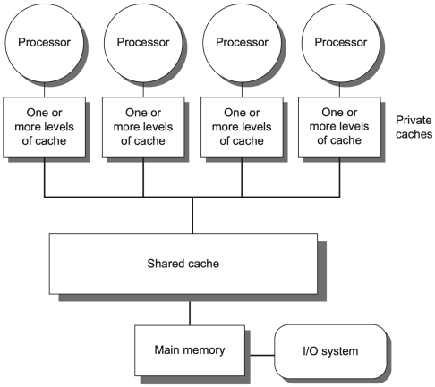</div>

- 每个 processor / core 可以有自己的 private cache，多个 private caches 再通过 shared cache 或 interconnection network 连接到同一份物理内存
- 对程序员来说，所有 cores 共享同一个地址空间；
  对硬件来说，关键问题为多个 private caches 中同一个地址的副本如何保持一致

### 5.2.2 Distributed Shared Memory

在**分布式共享内存**中，内存在物理上分布在多个**节点（nodes）**，这样做可以：

- 增加 memory bandwidth，因为多个 nodes 可以并行服务内存访问；
- 降低 local memory latency，因为 processor 访问自身节点的 memory 更快；
- 支持更多 processors，扩展性比单一 centralized memory 更好。
但是，分布式共享内存的访问时间取决于数据所在位置，因此也叫 ==NUMA (nonuniform memory access)==：<u>访问 local memory 快，访问 remote memory 慢。</u>

<div style="text-align: center">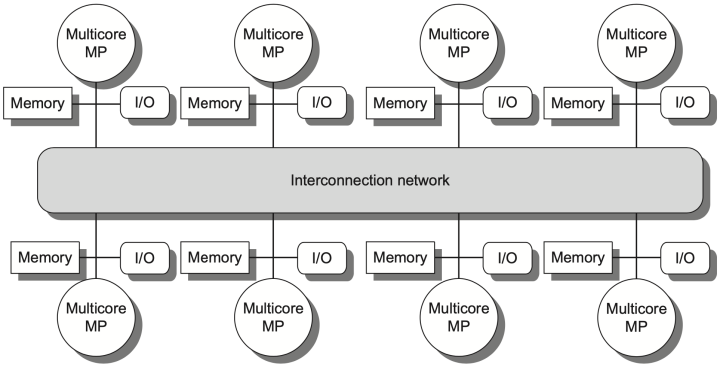</div>

每个 node 由 multicore chip、本地 memory、I/O、以及 network interface 构成

- 所有 nodes 通过 interconnection network 连接起来，并**共同提供一个 shared address space**
- 也就是说，软件仍然可以用“**共享内存**”的方式写程序，但硬件访问一个地址时，需要判断它是在 local node 还是 remote node

!!! warning "Distributed Shared Memory 的代价"

    DSM 能提升扩展性，但会带来更复杂的 inter-processor communication 和更复杂的软件 / 硬件机制。特别是当一个 cache block 被多个 nodes 共享时，系统必须知道谁有副本、谁有最新数据、什么时候需要 invalidation 或 write-back。

### 5.2.3 Hurdles of Parallel Processing

#### 1. Limited Program Parallelism

并行处理的第一个障碍是**程序本身并不一定有足够的并行性**。即使硬件资源充足，如果程序中有一部分必须串行执行，那么整体 speedup 也会受到 Amdahl's Law 限制。

!!! tip

    有些程序改写后能暴露更多并行性，有些依赖则会迫使指令串行执行。

    ```nasm
    # before: compute A + B + 2
    ld   x1, 0(x0)
    ld   x2, 4(x0)
    add  x3, x1, x2
    add  x4, x3, 2

    # after: expose more independent work
    ld   x1, 0(x0)
    ld   x2, 4(x0)
    add  x3, x1, 1
    add  x4, x2, 1
    add  x5, x3, x4
    ```

    如果程序依赖链很长，硬件只能持续等待；如果能被拆成独立的工作单元，TLP 才有发挥空间。

##### Amdahl 's Law

如果原程序中 $F_{seq}$ 的部分必须串行执行，剩余部分可以在 $N$ 个处理器上并行执行，则

$$
\text{Speedup}
=
\frac{1}{F_{seq}+\dfrac{1-F_{seq}}{N}}
$$

只要 $F_{seq}$ 不为 $0$，processor 数量继续增加时，speedup 最终都会被串行部分卡住。

!!! example "Example 1: 100 processors achieve speedup 80"

    题目：若使用 $100$ 个 processors，希望达到 $80$ 倍 speedup，原始计算中最多有多少比例可以是 sequential？

    根据 Amdahl's Law：

    $$
    80=\frac{1}{F_{seq}+\dfrac{1-F_{seq}}{100}}
    $$

    解方程得到：

    $$
    F_{seq}=\frac{0.0125-0.01}{0.99}\approx 0.0025=0.25\%
    $$

    这说明要用 $100$ 个 processors 达到 $80$ 倍加速，串行部分只能占原程序大约 $0.25\%$。这个比例非常小，所以实际程序很难无限接近线性加速。

!!! example "Example 2: 100 / 50 / 1 processors 三种模式"

    题目：某程序 $95\%$ 的时间可以使用全部 $100$ 个 processors；剩下 $5\%$ 中，有一部分可以使用 $50$ 个 processors，其余只能使用 $1$ 个 processor。若目标 speedup 仍为 $80$，剩余 $5\%$ 中有多少比例必须使用 $50$ 个 processors？

    设原程序中有 $x$ 的比例使用 $50$ 个 processors，则只能串行的比例为 $0.05-x$。并行后时间为：

    $$
    T_{new}
    =
    \frac{0.95}{100}
    +
    \frac{x}{50}
    +
    (0.05-x)
    $$

    目标 speedup 为 $80$，所以：

    $$
    T_{new}=\frac{1}{80}=0.0125, \quad x\approx0.048=4.8\%
    $$

    也就是说，原程序中约 $4.8\%$ 的部分必须能用 $50$ 个 processors 执行。换成剩余 $5\%$ 内部的比例，就是其中绝大部分都不能完全串行。

#### 2. High Communication Cost

并行处理的第二个障碍是**通信代价高**。多个 processors 之间经常需要访问 remote memory 或同步共享数据，而 remote access 的 latency 远高于本地计算。

!!! example "假设系统有 32 个 processors"

    - remote memory reference 的 latency 为 $100\text{ ns}$；
    - clock rate 为 $4.0\text{ GHz}$；
    - base CPI 为 $0.5$；
    - 若 $0.2\%$ 的 references 是 remote references，问没有通信时会快多少。 

    首先把 remote latency 换成 cycles：

    $$
    4.0\text{ GHz}
    \Rightarrow
    1\text{ cycle}=0.25\text{ ns}, \quad
    100\text{ ns}
    =
    400\text{ cycles}
    $$

    如果 $0.2\%$ 的 references 需要 remote access，则平均额外开销为：

    $$
    0.2\%\times400=0.002\times400=0.8
    $$

    因此有通信时的 CPI 为 $\text{CPI}=0.5+0.8=1.3$，无通信版本快$\dfrac{1.3}{0.5}=2.6$

!!! tip

    即使 remote reference 只占 $0.2\%$，也可能让 CPI 从 $0.5$ 增加到 $1.3$。这说明在多处理器中，少量高延迟通信就足以吞掉大量并行收益。

#### 3. Improving Parallel Processing

- **insufficient parallelism**：
    - 设计更好的并行算法
    - 让软件系统尽量让程序运行在使用完整 processor complement 的模式中；
- **long-latency remote communication**：
    - 可以从架构侧缓存 shared data，
    - 也可以由程序员通过 multithreading、prefetching 等方法隐藏或减少延迟

---

## 5.3 Centralized Shared Memory

!!! abstract "Centralized Shared Memory Structure"

    <div style="text-align: center"></div>

    Centralized shared-memory 系统通常在处理器和共享内存之间加入 **large, multilevel caches**，以降低 memory bandwidth 需求。缓存的数据可以分为两类：

    1. Private data：只被单个 processor 使用
    2. Shared data：多个 processor 使用

### Cache Coherence Problem

!!! question

    Shared data 可以复制到多个 caches 中，这样能降低访问延迟、降低 memory bandwidth 需求、减少对共享 memory 的 contention。<u>但是如果没有额外机制，不同 processors 的 caches 可能保存同一个 memory location 的不同值。</u>

    <div style="text-align: center">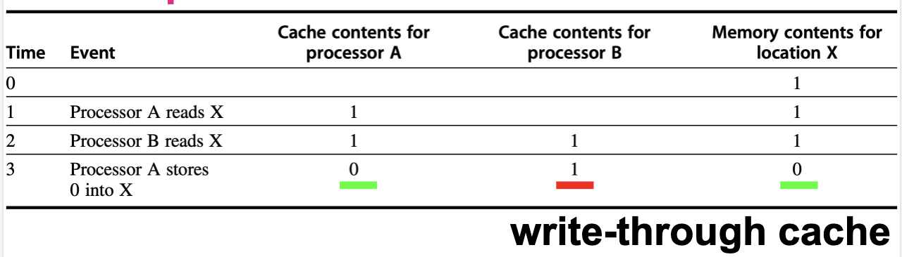</div>

    ==Cache coherence problem==：同一个 memory location 的多个 cached copies 是否保持一致。

    - **Global state**：由 main memory 定义；
    - **Local state**：由每个 processor core 私有的 cache 定义

A memory system is ==Coherent== if any read of a data item returns <u>the most recently written value</u> of that data item.

- **Coherence（缓存一致性）**：对于「同一个地址」，读操作能否拿到最新写的值
- **Consistency（内存一致性）**：一个处理器的写操作，什么时候对其他处理器可见

### Coherence Property

一个 memory system 如果是 coherent，至少需要满足下面三个性质：
**性质 1：同一 processor 的 write-read 顺序必须保持**

- <u>自己写的东西，自己一定能看到。</u>
- 如果 processor $P$ 对 location $X$ 写入一个值，随后 $P$ 自己再读 $X$，并且中间没有其他 processor 写 $X$，那么这次 read 必须返回 $P$ 自己写入的值。
- 这个性质是在保留 program order。即使在单处理器系统中，我们也期待它成立。

**性质 2：其他 processor 的写入最终必须可见**

- 如果一个 processor 写了 $X$，另一个 processor 在足够晚的时候读 $X$，并且中间没有其他 writes to $X$，那么这个 read 应该返回前面写入的值。
- 这里的关键是<u> “sufficiently separated in time”</u>。如果两个操作几乎同时发生，写入的数据可能还没有离开写方 processor，此时不能要求读方立刻看到新值。

**性质 3：Write serialization**

- 对于同一个 memory location，任意两个 processors 对它的 writes 必须被所有 processors 以相同顺序观察到。
- 例如，对 $X$ 先写入 $1$ 再写入 $2$，系统不能允许某些 processor 看到顺序是 $1\rightarrow2$，另一些 processor 看到顺序是 $2\rightarrow1$。否则各个 processor 对同一地址的历史就不一致了。

### Consistency Problem

When a written value will be seen is important

- 假设发生 RAW 问题，两个操作的间隔时间极小，可能无法确保上一个写入操作的数值能被下一个读取操作读出，因为写入的数值可能还存留在 CPU 中，没有写入 cache

!!! warning "Coherence 不等于“立即可见”"

    Coherence 规定 read 应该返回哪些值，以及同一地址的 writes 必须如何排序；但一个 write 什么时候必须被别的 processor 看到，是 ==memory consistency model== 负责定义的问题。

---

## 5.4 Cache Coherence Protocol

多个处理器各自有私有缓存，当它们缓存同一个内存地址时，必须有一套**协议**来保证数据一致性。这个协议的核心任务就是：**追踪每个 cache block 的共享状态**。

| 协议类型            | 基本思想                                                              | 适合场景                                  |
| :-------------- | :---------------------------------------------------------------- | :------------------------------------ |
| Directory based | 每个 physical memory block 的 sharing status 存在同一个地址（被称为 directory）中 | 更适合 distributed shared memory 和较大规模系统 |
| Snooping        | 每个 cache controller 监听共享总线 / broadcast medium，观察别人是否请求自己持有的 block | 适合 centralized shared-memory / SMP    |

### 5.4.1 Directory Based Coherence Protocol

**Directory 协议（目录协议）**

- 每个内存 block 对应一个 **directory entry**，记录：
    - 哪些缓存持有这个 block 的副本
    - 当前状态（独占/共享/未缓存等）
- 当处理器要访问某个 block 时，先查 directory，然后**通知相关处理器**，而不是广播

### 5.4.2 Snooping Coherence Protocol

!!! abstract "Snooping 协议（监听协议）"

    - 所有 cache controller **监听（snoop）** 共享总线上的每一个事务，一旦发现地址命中自己持有的 block，就根据协议执行状态转换。

    | 策略                       | 做法                            | 优点                        | 缺点                              |
    | :----------------------- | :---------------------------- | :------------------------ | :------------------------------ |
    | Write invalidate         | 写时让其他 cached copies invalid | 最常用，写者获得 exclusive access | 后续其他 processor 读同一 block 会 miss |
    | Write update / broadcast | 把新值广播给所有 cached copies      | 读取时可继续命中                   | 消耗更多 bandwidth                  |

#### Write Invalidate Protocol

- 当一个处理器要写入某个数据之前，先把所有其他缓存中的副本**全部作废（invalidate）**，让自己成为**唯一的持有者**，获得独占访问权。

!!! info "工作流程"

    <div style="text-align: center">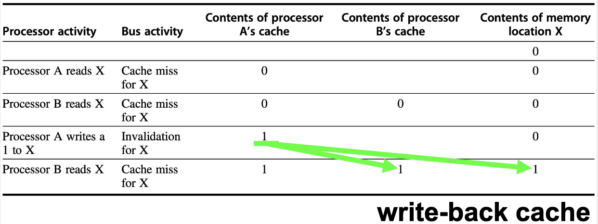</div>

    执行 invalidate 时，处理器会获得 bus access，并把需要 invalidated 的地址**广播**到 bus 上。其他 processors 会持续监听 bus 地址并检查地址：

    1. 如果该地址不在自己的 cache 中，则不需要任何操作；
    2. 如果该地址在自己的 cache 中，并且对应 block 是有效的，则把该 block 作废；
    3. 如果某个 processor 发现自己有**该 block 的 dirty copy（被自己改过）**，则它需要提供这个 cache block 给请求者，并**取消或延后 memory/L3 的相应**。

#### Write update / broadcast protocol

该协议的想法更加直接：<u>把新值推送给所有缓存了该数据的 caches</u>。

- 但是 bandwidth 消耗很大，尤其是写操作频繁而其他 processors 并不马上读取新值时。
- 因此，现代系统**更常用 invalidate**：只需要让别人失效，真正需要新值时通过 miss 再取。

### 5.4.3 MSI Protocol

**此处介绍 Write invalidate protocol 的具体实现。**

!!! tip "Finite-State Controller"

    - 每个 core 中会加入一个 finite-state controller，它需要响应两类请求：
        - 来自本 core processor 的 read/write 请求；
        - 来自 bus （或其他 broadcast medium）的 snoop 请求。
    - 这个 controller 根据请求类型和当前 cache block state，改变 block state，并在必要时使用 bus 获取数据或发送 invalidation 使得数据无效。

<font color="#0070c0">MSI protocol</font> 是 write invalidate protocol 的基本形式，包含三个 block states：

- <font color="#0070c0">I</font>nvalid：cache 中该 block 无效
- <font color="#0070c0">S</font>hared：cache 中该 block 有效，可能和其他 caches 共享；通常是 clean
- <font color="#0070c0">M</font>odified：cache 中该 block 已被修改；该状态意味着<u>该 block 是 exclusive（独占）</u>

#### Cache Action Table

表格把 coherence controller 需要处理的请求分成两类：

- 上半部分来自本地 processor，下半部分是处理器接听来自 bus 的广播。
- 这个表告诉我们：同一个 read miss / write miss，在不同 block state 下，可能只是普通 miss，也可能触发 replacement，或者触发 coherence action。

| Request    | Source    | block state | cache action  | 含义                                                                      |
| :--------- | :-------- | :---------- | :------------ | :---------------------------------------------------------------------- |
| Read hit   | Processor | S 或 M       | Normal hit    | 处理器要读 X，X 在本地缓存中（状态为 S 或 M）                                             |
| Read miss  | Processor | I           | Normal miss   | 处理器要读 X，X 不在本地缓存中（状态为 I）                                                |
| Read miss  | Processor | S           | Replacement   | 处理器要读 Y 但 cache set 已满，需要替换当前处于 S 状态的 X，再在总线上发 read miss                |
| Read miss  | Processor | M           | Replacement   | 地址冲突，需要先 write-back dirty block，再发 read miss                            |
| Write hit  | Processor | M           | Normal hit    | 处理器要写 X，X 在本地缓存中且状态为 M                                                  |
| Write hit  | Processor | S           | ==Coherence== | 处理器要写 X，X 在本地缓存中但状态为 S；发 invalidate 改变 ownership                        |
| Write miss | Processor | I           | Normal miss   | 处理器要写 X，X 不在本地缓存中；在 bus 上发 write miss，请求数据和写权限                          |
| Write miss | Processor | S           | Replacement   | 处理器要写 Y，需要替换当前处于 S 状态的 X，再在总线上发 read miss                               |
| Write miss | Processor | M           | Replacement   | 处理器要写 Y，需要先 write-back dirty block，再发 write miss                        |
| Read miss  | Bus       | S           | No action     | 其他 processor 读，local cache 保持 shared                                    |
| Read miss  | Bus       | M           | ==Coherence== | 其他处理器要读 X，而本地缓存中 X 是 M 状态，需要把 block X 放到 bus 上，并变成 shared               |
| Invalidate | Bus       | S           | ==Coherence== | 其他处理器发来 Invalidate 请求，本 cache invalidates                               |
| Write miss | Bus       | S           | ==Coherence== | 其他 processor 要写该 block，本 cache invalidates                              |
| Write miss | Bus       | M           | ==Coherence== | 其他 processor 要写本 cache 独占的 dirty block，本 cache write-back 并 invalidates |

!!! note "Normal miss / replacement / coherence 的区别"

    - Normal miss 是单处理器 cache 里也会出现的普通未命中。
    - Replacement 是因为当前 cache block 位置被别的地址占用，需要替换旧 block。
    - Coherence action 是为了维护多处理器一致性，即使本地地址命中，也可能因为别人要写而失效。

#### State Transition

??? abstract "Graphs of CPU and bus"

    - Request from CPU

    <div style="text-align: center">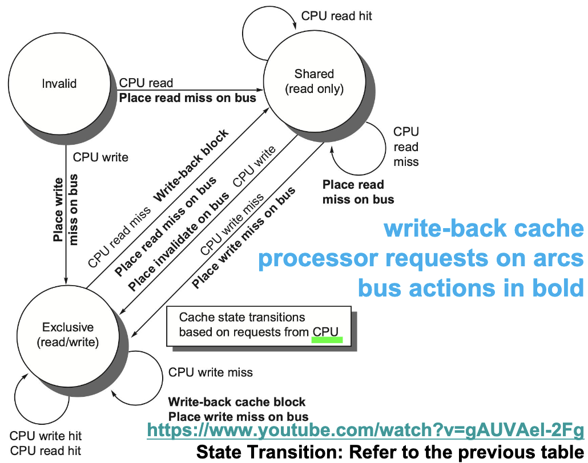</div>

    - Request from bus

    <div style="text-align: center">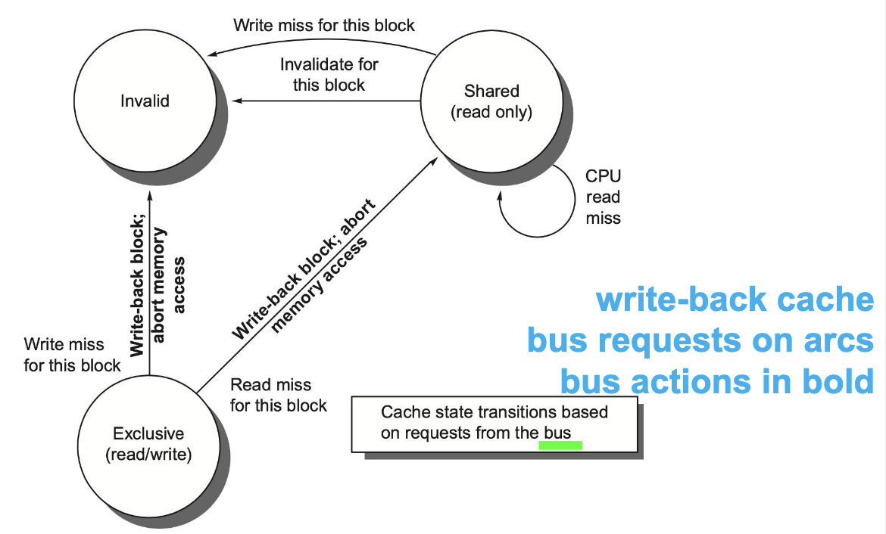</div>

- State Transition Graph

<div style="text-align: center">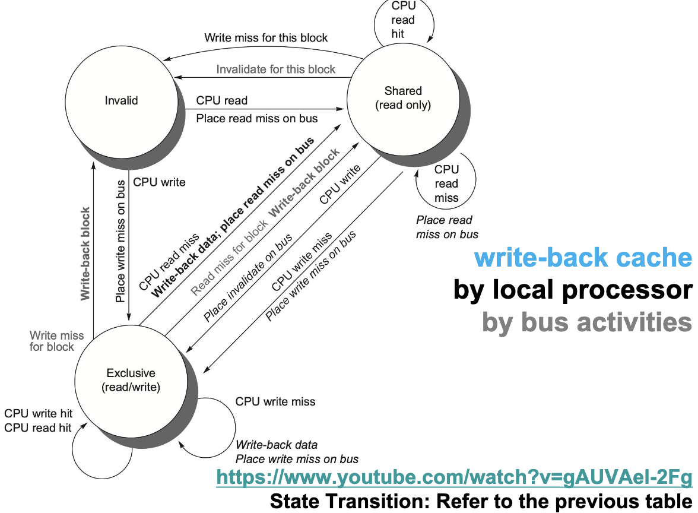</div>

| **当前状态** | **事件**                           | **新状态**     | **动作**                                     | **补充说明**                       |
| -------- | -------------------------------- | ----------- | ------------------------------------------ | ------------------------------ |
| I        | CPU read                         | S           | Place read miss on bus                     | 从内存或其他 cache 获取数据，获得共享副本       |
| I        | CPU write                        | M           | Place write miss on bus                    | 获取数据并获得独占写权限，同时使其他副本失效         |
| S        | CPU read hit                     | S           | 直接读取本地 cache                               | 无总线事务                          |
| S        | CPU write hit                    | M           | Place invalidate on bus                    | 发送 Invalidate，获得 ownership 后写入 |
| M        | CPU read hit                     | M           | 直接读取本地 cache                               | 无总线事务                          |
| M        | CPU write hit                    | M           | 直接写本地 cache                                | 无总线事务，cache line 仍为 dirty      |
| M        | CPU read miss for another block  | 新块状态（S 或 M） | Write-back block + Place read miss on bus  | 当前 dirty block 被替换，必须先写回       |
| M        | CPU write miss for another block | M           | Write-back block + Place write miss on bus | 当前 dirty block 被替换，必须先写回       |
| S        | Bus read miss                    | S           | 无需状态变化                                     | 其他处理器读取该块，大家继续共享               |
| S        | Bus invalidate                   | I           | Invalidate block                           | 其他处理器获得写权限                     |
| S        | Bus write miss                   | I           | Invalidate block                           | 其他处理器请求写入，需要独占                 |
| M        | Bus read miss                    | S           | Write-back data / Supply block             | 将最新数据提供给请求方，自己降级为 Shared       |
| M        | Bus write miss                   | I           | Write-back block + Invalidate              | 其他处理器获得写权限，本地副本失效              |

### 5.4.4 MSI Extensions

#### MESI

**M**<font color="#00b050">E</font>**SI** 在 MSI 基础上增加了 <font color="#00b050">Exclusive (E)</font> 状态：

- 该 cache block 只存在于一个 private cache 中；
- block 是 clean 的，即 memory / LLC 中的数据仍然是最新的；
- 由于没有其他 cached copies，本地 processor 后续写它时不需要在 bus 上发送 invalidate

!!! info "Improvement"

    - MESI 的关键优化是：

    $$
    E \xrightarrow{\text{local write}} M
    $$

        - 这个转换可以 silent 完成，不需要广播。

    - 如果其他 processor 对 E 状态的 block 发出 read miss，那么原来的 E 状态必须变成 S：

    $$
    E \xrightarrow{\text{read by others}} S
    $$

#### MOESI

**M**<font color="#00b050">O</font>**ESI** 在 MESI 基础上增加 <font color="#00b050">Owned (O)</font> 状态：

- 该 cache 是这个 block 的 owner；
- memory 中的数据已经 out-of-date；
- 其他 caches 可以有 shared copies，但owner 必须在其他 miss 时提供数据，并在 replacement 时 write back 到 memory。

!!! info "Improvement"

    在 MSI / MESI 中，如果一个 Modified block 被其他 processor read miss 请求，常见做法是把 M 变成 S，并把最新数据写回 memory。MOESI 则允许：

    $$
    M \xrightarrow{\text{read miss on bus}} O
    $$

    这样原 owner 不必立刻把 shared block 写回 memory。新请求方得到 shared copy，而原 cache 保持 O 状态，表示 memory 仍旧过期，后续需要由 owner 负责提供或写回数据。

!!! abstract

    <div style="text-align: center">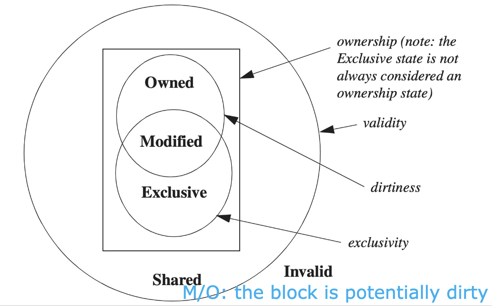</div>

    MOESI 各状态的集合关系：

    - 除 I 之外，其余状态都是 valid；
    - M、O、E 都是 ownership states；
    - M 和 E 表示 exclusivity，即没有其他 cache 拥有 valid copy；
    - M 和 O 表示 block 可能 dirty，memory copy 可能不是最新。

!!! example "MESI Example"

    <div style="text-align: center">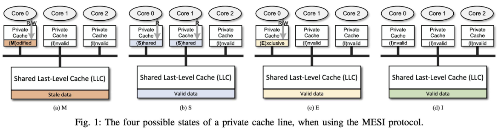</div>

    - 根据各个 core 中的数据状态，判断 shared last-level cache 是否有效

    <div style="text-align: center">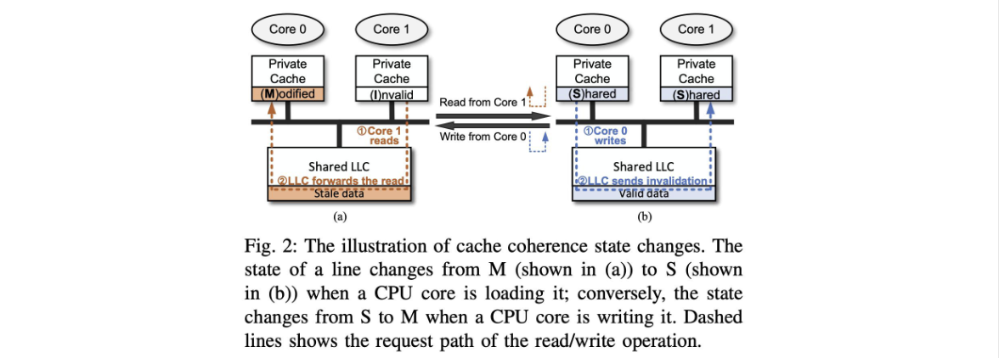</div>

    - 两种状态的转变

#### MESIF

**MESI**<font color="#00b050">F</font> 增加 <font color="#00b050">Forward (F)</font> 状态，用来指定多个 shared copies 中由哪个 processor 响应请求。

- 最近一次请求该 line 的 processor 会被赋予 F state
- F 状态的作用是减少多个 sharers 同时响应同一个请求的混乱，尤其适合 distributed memory organizations 中优化响应路径。

### 5.4.5 Increasing Snoop Bandwidth

!!! warning "Bottleneck"

    Snooping protocol 要求所有 cache 监听 bus 上的每一次一致性事务，这不仅会增加 cache tag 的查询开销，还会与处理器正常的 cache 访问竞争资源。<u>随着核心数增加，broadcast bandwidth 和 snoop bandwidth 成为系统扩展性的主要瓶颈。</u>

提升 snoop bandwidth 的方法：

1. **Duplicate tags**：
   复制一份 cache tags，snoop 请求查 duplicate tags，减少对普通 cache 访问的干扰
2. **Distribute outermost shared cache (L3)** ：
   把最外层 shared cache 分散到多个 slices，每个 processor 负责一部分 L3 / address space 的审查，这样可以扩展 L3 侧 snoop bandwidth
3. **Place a directory at outermost shared cache (L3)**：
   L3 作为 snoop filter，只向可能持有 block 的 caches 发送请求

**现代多核处理器和大型共享缓存系统中常见的设计思路**：<u>通过多 Bank 共享 Cache + 互连网络代替单一共享总线</u>，实现了更高的内存带宽和更好的多核扩展性。

<div style="text-align: center">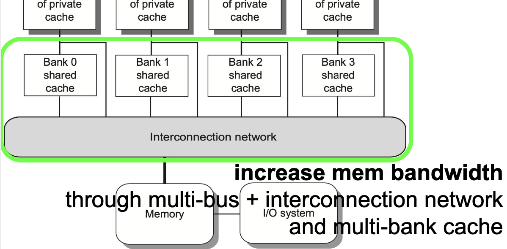</div>

### 5.4.6 Coherence Miss and False Sharing

多处理器中的 cache miss 除了普通的 miss，还会出现由 coherence 引起的 misses。

#### True Sharing Miss

多个处理器**读写同一个数据项**，一致性协议必须在它们之间传递数据或通知，从而产生的 miss：

1. 写 shared cache block，需要 invalidation 来获得 ownership；
    - 假设 P0 和 P1 缓存中都有 X，P0 要写 X
        - P0：X 为 share，不能直接写，需要发送 invalidate 到总线，这是一个 write miss
        - P1：接收到 write miss，X 变成 invalid 状态
2. 读 modified word，触发 block transfer
    - 假设 P0 缓存中都有 X（M 状态），P1 要读 X
        - P1：缓存中没有 X ，发生 read miss，需要发送信号到总线
        - P1：接收到 read miss，X 写回并变成 shared 状态

#### False Sharing Miss

False sharing miss 来自 <u>cache block 的粒度过大</u>。

- 一个 cache block 只有一个 valid bit / coherence state，即使两个 processors 操作的是 block 中不同 words，也会互相 invalidated。
- 如果 processor A 写了 block 中的 $x_1$ ，processor B 后续读的是同一个 block 中的 $x_2$，而 B 的 miss 只是因为整个 block 被 invalidated，并不是因为它真的需要 A 写入的 $x_1$，那么这就是 false sharing。

!!! example "True / False Sharing Miss 判断"

    假设 $x_1$ 和 $x_2$ 位于同一个 cache block，初始时该 block 在 P1 和 P2 的 caches 中都处于 Shared state。访问序列如下：

    | Time | P1 | P2 | 判断 | 原因 |
    | :--- | :---- | :--- | :--- | :--- |
    | 1 | Write $x_1$ |  | true sharing miss | P1 写 $x_1$ 要获得 ownership，并使 P2 中同 block 的副本失效 |
    | 2 |  | Read $x_2$ | false sharing miss | P2 读的是 $x_2$，miss 是被 P1 写 $x_2$ 连带 invalidated 造成的 |
    | 3 | Write $x_1$ |  | false sharing miss | block 因 P2 读 $x_2$ 回到 shared，P1 再写 $x_1$ 需要 invalidation，但 P2 实际共享的是 $x_2$ |
    | 4 |  | Write $x_2$ | false sharing miss | P2 写 $x_2$ 需要 invalidation，P1 写的是 $x_1$，二者是同 block 不同 word |
    | 5 | Read $x_2$ |  | true sharing miss | P1 读取的 $x_2$ 正是 P2 写过的值，需要获取真实共享数据 |

    判断方法：看 miss 是否传递了对方真正写过、自己真正要读/写的数据。如果只是因为同一个 cache block 中另一个 word 被写而被迫 miss，就是 false sharing。

---

## 5.5 Distributed Shared Memory

### 5.5.1 Why Directory-Based Protocol

> 在 distributed shared memory 中，如果仍然使用 snooping，每次 cache miss 都 broadcast 到所有 nodes，会带来巨大通信开销，因此引入 ==directory-based cache coherence protocol==。

<div style="text-align: center">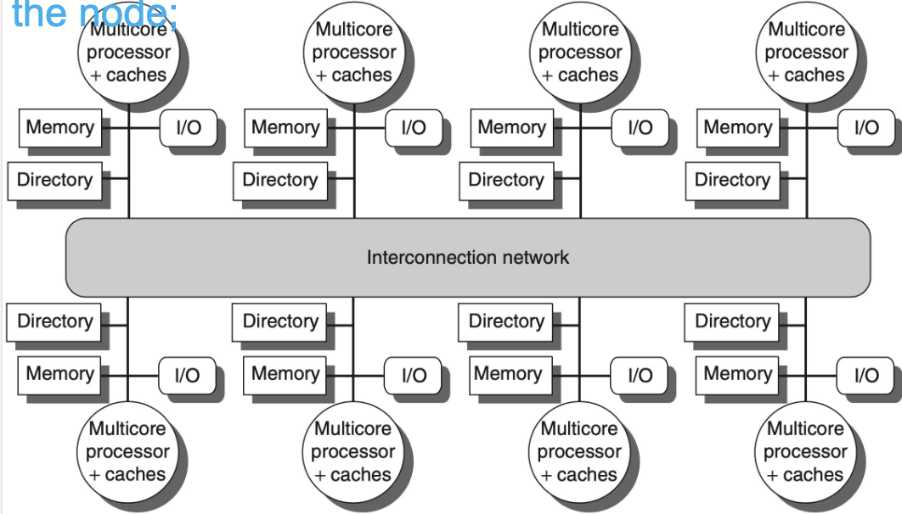</div>

Directory-based protocol 的基本思想是：

- 每个 node 增加一个 **directory**；
- 每个 directory 负责跟踪本 node 所拥有那部分 memory addresses 的 **sharing status**；
- 当某个 cache miss 发生时，不需要广播给所有 caches，而是**先询问对应的 home directory**；
- home directory 根据记录决定应该给谁发 invalidate、fetch 或 data reply。

### 5.5.2 Directory Messages

!!! info "Directory 的三种状态"

    | Directory state | 含义                                          | Memory |
    | :-------------- | :------------------------------------------ | :---------- |
    | ==Shared==      | 一个或多个 nodes cached 了该 block | up to date  |
    | ==Uncached==    | 没有 node 缓存该 cache block                     | up to date  |
    | ==Modified==    | 只有一个 node 有该 block，并且已经写过内容    | out of date |

常见 messages 可以整理如下：

- P: requesting node number 
- A: requested address 
- D: data contents

| Message type       | Source         | Destination    | Contents | 作用                                                  |
| :----------------- | :------------- | :------------- | :------- | :-------------------------------------------------- |
| Read miss          | Local cache    | Home directory | P, A     | P 在地址 A read miss，请求数据并把 P 加入 read sharers          |
| Write miss         | Local cache    | Home directory | P, A     | P 在地址 A write miss，请求数据并让 P 成为 exclusive owner      |
| Invalidate         | Local cache    | Home directory | A        | 请求 home directory 让其他 remote caches invalidated     |
| Invalidate         | Home directory | Remote cache   | A        | 使 remote cache 中地址 A 的 shared copy 失效               |
| Fetch              | Home directory | Remote cache   | A        | 从 remote cache 取回 block，并把 remote cache 状态改为 shared |
| Fetch / invalidate | Home directory | Remote cache   | A        | 从 remote cache 取回 block，并使 remote copy invalid      |
| Data value reply   | Home directory | Local cache    | D        | 从 home memory 返回数据给请求方                              |
| Data write-back    | Remote cache   | Home directory | A, D     | remote cache 把地址 A 的数据 D 写回 home                    |

这些消息可以分成三组理解：

- **local to home**：本地 cache 发生 read miss / write miss，先去问 home directory；
- **home to remote**：如果最新数据或已有副本在 remote cache 中，home directory 再向 remote cache 发 invalidate、fetch 或 fetch/invalidate；
- **data transfer**：最终通过 data value reply 或 data write-back 传递真正的数据。

### 5.5.2 Directory state transition

Directory-based 和 snooping 的状态结构相似，但区别是：

- 原来广播到 bus 的 write miss / read miss，现在<u>变成显式的 point-to-point messages</u>

#### Typical Diagrams

下面按照 home directory 当前状态来理解几个典型流程。

##### Read Miss to Uncached

没有任何节点缓存 $A$，地址 $A$ 的 home memory 有最新值 $D$：

```
Node P                    Home
  │                         │
  │   1.Read miss(P, A)     │
  │────────────────────────→│
  │                         │ 查询 Directory: Uncached, 直接从 Memory 取 D
  │  2.Data value reply(D)  │
  │←────────────────────────│
  │                         │ 3. 更新 Directory
  │                         │ State: Uncached → Shared, Sharers = {P}
```

##### Write Miss to Uncached

没有任何节点缓存 $A$，节点 $P$ 想写地址 $A$ 对应的值

```
Node P                    Home
  │                         │
  │  1. Write miss(P, A)    │
  │────────────────────────→│
  │                         │ 查询 Directory: Uncached，从 Memory 取 D
  │ 2. Data value reply(D)  │
  │←────────────────────────│
  │                         │ 3. 更新 Directory
  │                         │ 状态: Uncached → Modified, Owner = {P}
```

##### Read Miss to Shared

已经有其他节点在共享读 A，Memory 仍然有最新值。

- 更新 `Sharers` 后**不需要通知 Q 和 R** 
- 因为 P 只是读，多人共享读是合法的。只要 Memory 有最新值，home 直接回复即可。

```
Node P                    Home                    Node Q, R
  │                         │                       │
  │ 1. Read miss(P, A)      │                       │
  │────────────────────────→│                       │
  │                         │ 查 Directory:Shared    
  │                         │ Memory 有最新值，直接给  
  │ 2. Data value reply(D)  │                       │
  │←────────────────────────│                       │
  │                         │ 3. 更新 Directory      
  │                         │  Sharers = {Q, R, P}  │
  │                         │                       │ 
```

##### Write Miss to Shared

如果 block 是 Shared，而 $P$ 想写，就必须让其他 sharers 失效：

1. $P \rightarrow \text{home}$：发送 `Write miss(P, A)`
2. $\text{home} \rightarrow \text{old sharers}$：对旧 sharers 发送 `Invalidate(A)`
3. $\text{home} \rightarrow P$：返回数据或确认 ownership
4. directory 状态变成 Modified / Exclusive，记录 `Sharers = {P}` 或 `Owner = {P}`

##### Read Miss to Modified

如果 block 是 Modified，说明<u>最新数据在某个 remote owner cache 中，home memory 是旧的</u>
此时 $P$ read miss：

1. $P \rightarrow \text{home}$：发送 `Read miss(P, A)`；
2. $\text{home} \rightarrow \text{owner}$：发送 `Fetch(A)`；
3. $\text{owner} \rightarrow \text{home}$：发送 `Data write-back(A, D)`；
4. $\text{home} \rightarrow P$：返回 `Data value reply(D)`；
5. directory 状态变成 Shared，并把 owner 和 $P$ 都纳入 sharers。

##### Write Miss to Modified

如果 block 是 Modified / Exclusive，而另一个节点 $P$ 想写：

1. $P \rightarrow \text{home}$：发送 `Write miss(P, A)`；
2. $\text{home} \rightarrow  \text{old owner}$：发送 `Fetch/invalidate(A)`；
3. $\text{old owner} \rightarrow  \text{home}$：发送 `Data write-back(A, D)`，并使自己的 copy invalid；
4. $\text{home} \rightarrow P$：返回数据 / ownership；
5. directory 仍保持 Modified / Exclusive，但 owner 变成 $P$。

#### Individual Cache Block

<div style="text-align: center">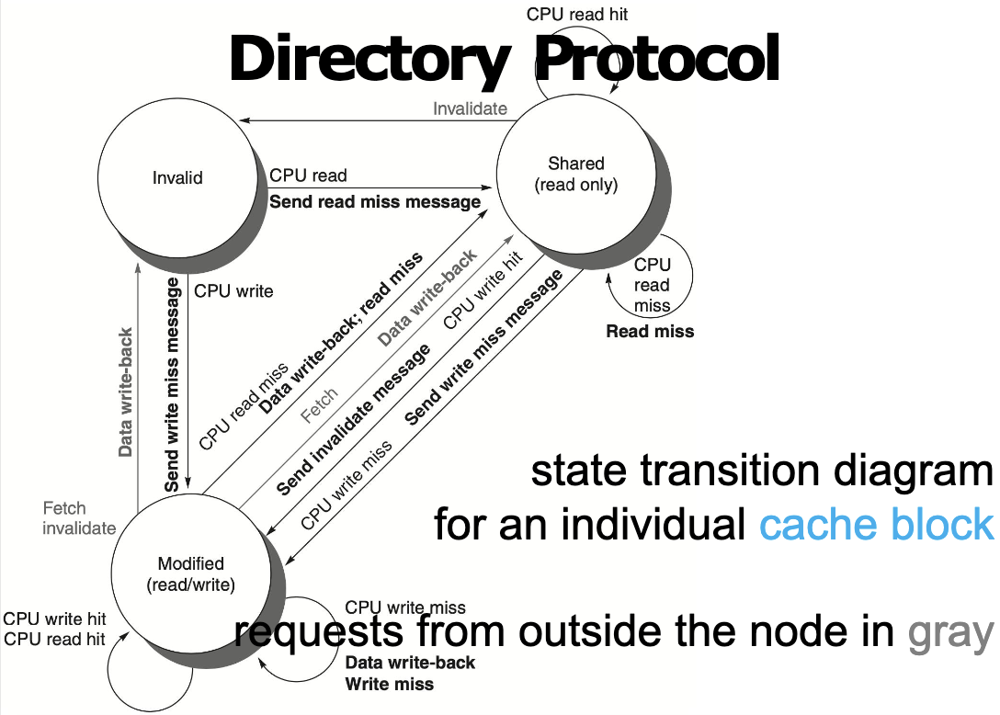</div>

对单个 cache block 来说：

- I 状态下 CPU read，需要向 home 发送 read miss message，收到数据后进入 S；
- I 状态下 CPU write，需要向 home 发送 write miss message，获得数据和 ownership 后进入 M；
- S 状态下 CPU read hit，直接命中；
- S 状态下 CPU write，需要向 home 发送 invalidate / ownership request，使其他 sharers 失效后进入 M；
- M 状态下 CPU read/write hit，直接在本地 cache 访问；
- 若 home directory 发来 fetch，说明其他 node 想读这个 modified block，本 cache 需要 data write-back，并通常退到 S；
- 若 home directory 发来 fetch/invalidate，说明其他 node 想获得写权限，本 cache 需要 data write-back，并进入 I。

!!! note

    PPT 中说明，在实际实现中，对 shared block 的写可以被看成 ownership request / upgrade request，不一定真的重新 fetch 数据；但为了讲清楚基本协议，图中把它作为 write miss 处理。

#### Directory Side

<div style="text-align: center">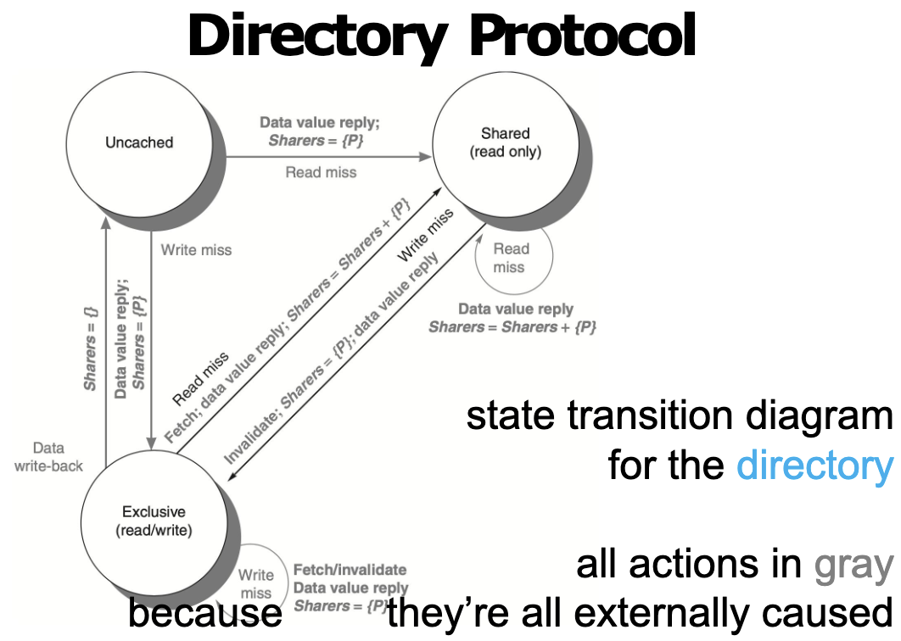</div>

从 directory 的角度看，它只响应外部请求，因此图中所有动作都是 externally caused。根据 PDF 中的状态图，可以整理成：

| Directory state | 请求 | 新状态 | Directory 动作 |
| :--- | :--- | :--- | :--- |
| Uncached | Read miss from P | Shared | 返回 data value，设置 `Sharers = {P}` |
| Uncached | Write miss from P | Modified / Exclusive | 返回 data value，设置 owner / sharer 为 `{P}` |
| Shared | Read miss from P | Shared | 返回 data value，更新 `Sharers = Sharers + {P}` |
| Shared | Write miss from P | Modified / Exclusive | 对其他 sharers 发送 invalidates，返回 data，设置 `Sharers = {P}` |
| Modified / Exclusive | Read miss from P | Shared | 向 owner 发送 fetch，owner write-back，返回 data，更新 sharers |
| Modified / Exclusive | Write miss from P | Modified / Exclusive | 向旧 owner 发送 fetch/invalidate，返回 data，设置 owner 为 P |
| Modified / Exclusive | Data write-back | Uncached | 写回 home memory，清空 sharers |

Directory protocol 的核心优势是减少 broadcast。Home directory 知道谁可能持有 cache block，因此可以只联系相关 nodes，而不是让所有 caches 都 snoop 每一次 miss。

!!! tip "Directory Protocol 的复习重点"

    - Directory 保存每个 block 的 state 和 sharers / owner 信息。
    - Read miss 通常增加 sharer；write miss 通常需要 invalidating other sharers。
    - Modified block 的最新数据不在 memory，而在 owner cache；home directory 需要 fetch 或 fetch/invalidate。
    - Directory-based protocol 用更多状态信息和消息交换，换取更好的扩展性。

## 5.6 Synchronization

如果有多个线程对同⼀块内存进⾏读写，需要保证他们对同⼀块内存的读写是有序的。

- **一般使用硬件原语来实现**

!!! info "硬件原语（Hardware Primitives）"

    - 这些操作都是原子性的，不能被打断。一旦开始执行这条指令，直到它执行完毕之前，不会有其他指令插入，也不会有其他核心干扰这块内存的状态。
    1. **Atomic Exchange (原子交换)**
        - 寄存器与内存交换，常用于实现简单的自旋锁（Spinlock）
        - 这条指令会将寄存器中的值写入内存地址，同时将内存地址原本的旧值读回到寄存器中。这两个动作是同时完成的。
    2. **Test-and-set (测试并设置)**
        - 测试某一位的值，并将其设置为 1。
        - 读取内存中的一个布尔值，如果它是 0，就把它改成 1，并返回旧值（0）；如果它已经是 1，就保持为 1，并返回旧值（1）。整个过程不可分割。
        - 实现互斥锁：如果返回 0，说明锁是开的；如果返回 1，说明锁被占了。
    3. **Fetch-and-increment (取出并加一 / 获取并增加)**
        - 读取内存中的数值返回给寄存器，同时将内存中的数值加 1。
        - 常用于生成唯一的序列号、ID 分配，保证排队的公平性。

### 5.6.1 Implementing Locks

```nasm
# 使⽤ Atomic Exchange 实现锁 
        DADDUI R2, R0, #1 
lockit: EXCH R2, 0(R1) 
        BNEZ R2, lockit 
```

- **代码逻辑分析：**
    - `DADDUI R2, R0, #1`：首先将寄存器 $R_2$ 的值设为 $1$（代表“想加锁”）
    - `lockit: EXCH R2, 0(R1)`：原子地交换 $R_2$ 和内存地址 $R_1$ 处的值
    - `BNEZ R2, lockit`：检查 $R_2$ 的值。
        - 如果不为 $0$，说明交换回来的值是 $1$，即锁之前就被占用了，则跳回 `lockit` 继续尝试。如果为 $0$，说明抢到了锁，继续向下执行。
- 通过“交换”，一次性完成了“检查锁状态”和“设置锁状态”两个步骤，保证了原子性。

```nasm
# 使⽤ Test-and-set 实现锁 
lockit: T&S R2, 0(R1) 
        BNEZ R2, lockit
```

- **代码逻辑分析：**
    - `lockit: T&S R2, 0(R1)`：将内存地址 $R_1$ 的值设为 $1$，并将该地址**旧的值** 存入 $R_2$
    - `BNEZ R2, lockit`：如果旧值不为 $0$（说明之前有人占了锁），则跳回重试。如果旧值是 $0$，说明刚才成功把锁从空闲变成了占用，获得锁。
- 这是一个专门用于实现锁的指令，逻辑比 Exchange 更直接。

### 5.6.2 LL/SC

> **为什么需要 LL/SC？**
> 有些操作比较复杂，比如“取出值 -> 加 1 -> 存回”。这很难用一条简单的硬件指令在一个周期内完成。如果分三步走，中间可能会被其他处理器打断。LL/SC 提供了一种**乐观锁**的机制来解决这个问题

1. **Load-Linked (LL) / Load-Reserved (LR)：**
    - 从内存读取数据到寄存器
    - 硬件会在后台“标记”或“保留”这个内存地址
2. **Store-Conditional (SC)：**
    - 尝试将新数据写入该内存地址。
    - 硬件会检查自上次 LL 以来，该内存地址是否被其他处理器修改过
        - **如果没有被修改**：写入成功，SC 指令返回“成功”信号
        - **如果被修改了**：写入失败，内存不变，SC 指令返回“失败”信号。

!!! example

    ```nasm
    # Atomic Exchange 
    try: mov x3,x4    ;mov exchange value
         lr x2, x1    ;load reserved from
         sc x3,0(x1)  ;store conditional
         bnez x3,try  ;branch store fails
         mov x4,x2    ;put load value in x4?
    ```

    这段代码的目标是：**将寄存器 $x_4$ 中的值与内存地址 $0(x_1)$ 中的值进行互换。**  

    1. `try: mov x3, x4`：把要写入内存的新值备份到 $x_3$
    2. `lr x2, x1`：从 $x_1$ 读取旧值存入 $x_2$。同时，硬件会给这个地址打上保留标记。
    3. `sc x3, 0(x1)`：尝试将 $x_3$ 写入内存地址 $0(x_1)$
        - 如果自上次 $lr$ 以来，该地址没有被其他核心修改过 -> 写入成功，并将 $x_3$ 设为 0。
        - 如果被修改过 -> 写入失败，内存不变，并将 $x_3$ 设为非 0 值
    4. `bnez x3, try`：检查的结果,如果 $x_3$ 不为 0，跳回 `try` 重新开始整个流程。
    5. `mov x4, x2`：如果代码能运行到这里，说明交换成功。此时 `x2` 里存的是从内存读出来的旧值。将其放入 `x4`，完成了“把旧值还给调用者”的动作。

    ```nasm
    # Fetch-and-increment 
    try: lr x2,x1      ;load reserved 0(x1)
         addi x3,x2,1  ;increment
         sc x3,0(x1)   ;store conditional 
         bnez x3,try   ;branch store fails
    ```

    6. `try: lr x2, x1`
        - **加载并监控**：读取内存地址 `x1` 的当前值到 `x2`。硬件开始监控该地址。
    7. `addi x3, x2, 1`
        - **本地计算**：在寄存器层面，将读取到的值 `x2` 加 1，结果存入 `x3`。这是 LL/SC 的优势所在——允许在 Load 和 Store 之间插入任意计算指令。
    8. `sc x3, 0(x1)`
        - **条件存储**：尝试将计算后的新值 `x3` 写回内存。
        - 同样，如果成功，`x3` 变为 0；如果失败（有人抢跑了），`x3` 变为非 0。
    9. `bnez x3, try`
        - **重试循环**：如果写入失败，说明在我们做加法的时候别人也改了数据，我们的计算基于旧数据，已经失效了。必须跳回 `try` 重新读取最新的数据，重新加 1，再次尝试写入。

### 5.6.3 Spinlock 

⽤户级别的同步⽅式。处理器不断地检查⼀个变量的值，直到它变成 0。这个变量叫做锁。

```nasm
	    addi x2, x0，#1 
lockit: EXCH x2,0(x1)    ;atomic exchange
        bnez x2, lockit  ;already locked?
```

- 可以看到每⼀次尝试 EXCH 都会导致总线的开销，性能较差。

优化： 

```nasm
try:    li x2, #1 ; 准备要写入的值 1 (Locked) 
lockit: lw x3, 0(x1) ; 【优化点】普通加载：先偷偷看一眼锁现在的状态 
        bnez x3, lockit ; 如果锁还是被占用的 (不为0)，直接跳回继续看，不要打扰总线 
        EXCH x2, 0(x1) ; 【关键动作】只有当上面看到锁是0时，才执行原子交换去抢锁 
        bnez x2, try ; 如果交换回来的旧值不为0 (说明被人抢先了)，跳回 try 重新开始
```

 也可以⽤ LL 与 SC 来实现：

 ```nasm
 lockit: LL x2, 0(x1)     ; 1. 链接加载：读取锁的值到 x2，并监控该地址 
         BNEZ x2, lockit  ; 2. 检查：如果读到的值是 1 (被占用)，直接重试 LL 
         Addui x2, x0, #1 ; 3. 准备：在寄存器里把值改为 1 (Locked) 
         SC x2, 0(x1)     ; 4. 条件存储：尝试把 1 写回内存 
         BEQZ x2, lockit  ; 5. 检查写入结果： 
                          ; 如果 x2 为 0 (写入失败，说明期间有人动了内存)，跳回 lockit 重试 
                        ; 如果 x2 不为 0 (写入成功)，则获得锁，继续向下执行
 ```
