# Chap4.The Processor

## 4.1 Introduction

!!!info An overview of Implementation

	- Send PC to the code memory.
	- Read one or two register.
	<div style="text-align: center"></div> 

	图中出现的 multiplexor：
	
	- 左上角：PC 的来源有两个：PC + 4（靠左的 Add）或者是由指令指定的地址（靠右的 Add）
	- 中间：写回寄存器的数据也有两个来源：ALU 的运算结果，或来自内存的值
	- 下面的 ALU：第二个输入也有两个来源：寄存器或立即数

## 4.2 Logic Design 

- Information encoded in binary
    - Low voltage = 0, High voltage = 1
    - One wire per bit
    
    - Multi-bit data encoded on multi-wire _buses_

- Combinational element
    
    - Operate on data
    
    - Output is a function of input

- State (sequential) elements  
    - Store information

## 4.3 Building a Datapath
> ==Datapath==：Elements that process data and addresses

<div style="text-align: center"></div>
同类指令的 opcode 是一样的（I 型指令的里逻辑运算、load 指令、jal 不同），具体功能由 Func 决定（因此不把所有操作编到 opcode 内）

### 1. Instruction execution in RISC-V

- Fetch

    - 从指令存储器（instruction memory）中取出当前要执行的指令

    - 将程序计数器（PC）更新为下一条指令的地址，通常是当前PC + 4

- Instruction decoding & Read Operand

    - 指令被译码成控制信号，用于指导后续各个功能单元的操作

    - 读取指令所需的寄存器操作数，判断是否需要使用 these 寄存器的内容

- Executive Control

    - 控制算术逻辑单元（ALU）执行相应的运算 

- Memory access（内存访问）

    - 对于需要访问内存的指令（如加载/存储），在此阶段进行内存读写。

    - 只有加载（load）和存储（store）指令才会进入这个阶段。其他指令（如R型、I型）不需要访问内存。

- Write results to register（结果写回寄存器）
	
    - 如果是R型指令（如 add, sub），将ALU计算的结果写入目标寄存器 `rd`
	
    - 如果是I型指令且为加载指令（如 lw），则从内存读取的数据写入 `rd` 寄存器

- Modify PC for branch instructions
	
    - 针对分支指令（如 beq, bne），根据条件判断是否跳转，然后更新PC指向新的目标地址

### 2. Instruction fetching
<div style="text-align: center"></div>

- R-format Instructions
    
    - Read 2 register operands
    
    - Perform arithmetic/logical operation
    
    - Write register result

- Load/Store Instructions
    
    - Read register operands
    
    - Calculate address using 12-bit offset  
        - Use ALU, but sign-extend offset
    
    - Load: Read memory and update register
    
    - Store: Write register value to memory

- Branch Instructions
    
    - Read 2 register operands
    
    - Compare operands  
        - use ALU, substract and check Zero output
    
    - Calculate target address
        
        - Sign-extend displacement
        
        - Shift left 1 place (halfword displacement)
        
        - Add to PC value

**Composing the Elements 组合元件**

First-cut data path does an instruction in one clock cycle

- Each datapath element can only do one function at a time

- Hence, we need separate instruction and data memories

Use multiplexers where alternate data sources are used for different instructions

### 3. Path Built using Multiplexer

- R-type instruction Datapath
<div style="text-align: center"></div>

- I-type instruction Datapath
	
    - For ALU
	
    - For load

<div style="text-align: center"></div>

- S type Instruction & Data stream
<div style="text-align: center"></div>

- SB type Instruction & Data stream
<div style="text-align: center"></div>

- Jal/J type Instruction & Data stream
<div style="text-align: center">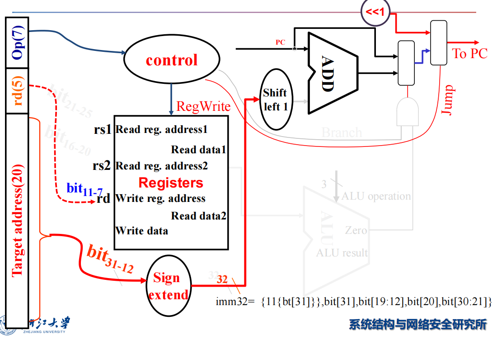</div>

- R-Type/Load/Store Datapath
<div style="text-align: center">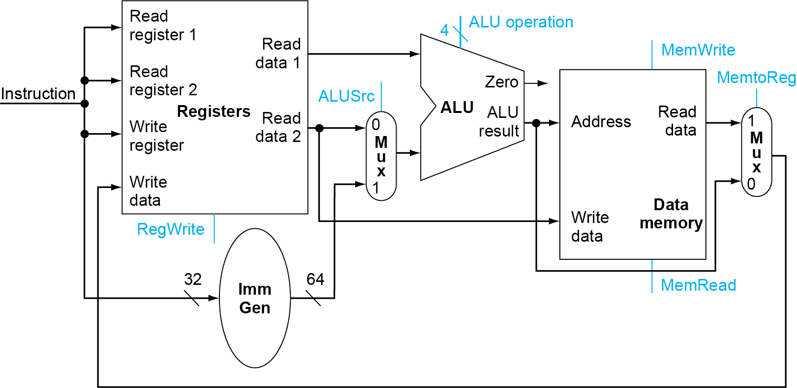</div>

- Full Datapath
<div style="text-align: center"></div>

## 4.4 A simple Implementation Scheme
Analyze for cause and effect

- Information comes from the 32 bits of the instruction

- Selecting the operations to perform (ALU, read/write, etc.)

- Controlling the flow of data (multiplexor inputs)

- ALU's operation based on instruction type and function code

<div style="text-align: center">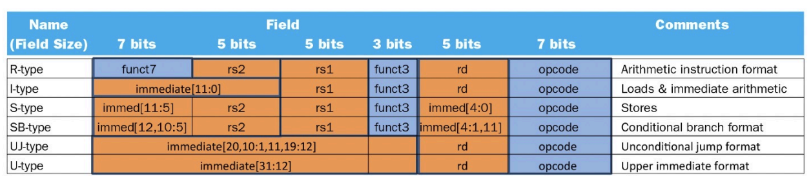</div>

**Building Controller**
<div style="text-align: center">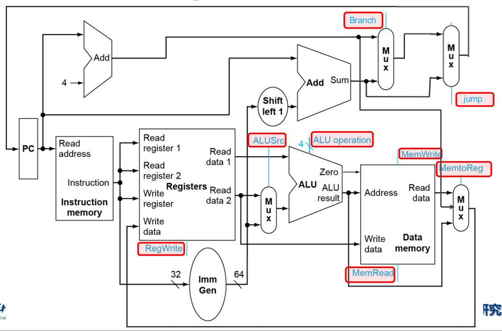</div>

- 7 个控制信号和一个 4 位的 `ALU_operation`

### 1. ALU symbol & Control
ALU used for

- Load/Store: F = add

- Branch: F = subtract

- R-type: F depends on opcode

**Scheme of Controller 控制器的方案**

- 因此进行两级解码 2-level decode.
<div style="text-align: center"></div>

#### First level

- 一级解码后，可以决定除了 `ALU_opration` 以外的控制信号

- 同时我们会解码出 2 位的 `ALU_op`.
<div style="text-align: center"></div>

#### Second level

- ALU operation is decided by **2-bit ALU-Op** derived from opcode, and funct7 & funct3 fields of the instruction
<div style="text-align: center"></div>

### 2. Datapath with Control
<div style="text-align: center"></div>

## 4.5 An overview of pipelining
### 1. Performance
| Instruction | Instr fetch | Register read | ALU op | Memory access | Register write | Total time |
| ----------- | ----------- | ------------- | ------ | ------------- | -------------- | ---------- |
| ld          | 200ps       | 100 ps        | 200ps  | 200ps         | 100 ps         | 800ps      |
| sd          | 200ps       | 100 ps        | 200ps  | 200ps         |                | 700ps      |
| R-format    | 200ps       | 100 ps        | 200ps  |               | 100 ps         | 600ps      |
| beq         | 200ps       | 100 ps        | 200ps  |               |                | 500ps      |

Longest delay determines clock period（针对单周期 CPU）

- Critical path: *load instruction* 

- ==Instruction memory -> register file -> ALU -> data memory -> register file==

### 2. Pipeline 
每条指令被划分为以下几步：

1. IF: Instruction fetch from memory
2. ID: Instruction decode & register read 
3. EX: Execute operation or calculate address 
4. MEM: Access memory operand 
5. WB: Write result back to register

利用流水线，可以有效地提高执行的效率
<div style="text-align: center">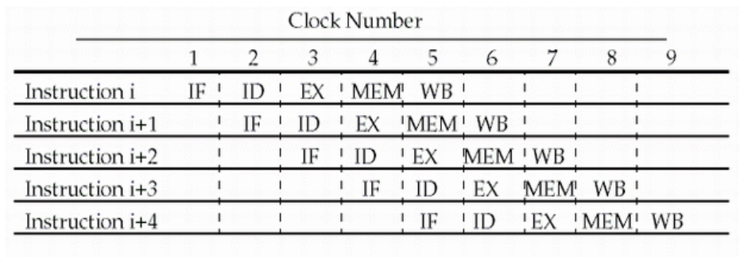</div>

- CPI is decreased to 1, since one instruction will be issued (or finished) each cycle. 

- During any cycle, one instruction is present in each stage.

- Ideally, performance is increased *five fold*
#### Pipeline performance
<div style="text-align: center"></div>

- 流水线 CPU 的时钟周期为最长的操作时间

- 流水线可以提高吞吐率（throughput）但没有改变每条指令的执行时间 (Latency)

- 如果各阶段均匀分布，那么可以得到：

$$
\text{Time between instructions}_{\text{pipelined}}=\frac{ \text{Time between instructions}_{\text{nonpipelined }}} {\text{Number of stages}}
$$

### 3. Hazards
> 此处讨论那些阻碍在下一个时针周期开始下一条指令的情况

#### Structure Hazards

- 硬件资源不足或共享导致多个指令在同一周期内竞争使用同一资源，从而引发的冲突

- 为解决 IF 和 MEM 阶段的冲突，使用**独立**的指令存储与数据存储

#### Data Hazards

- An instruction depends on completion of data access by a **previous** instruction

!!! example
	<div style="text-align: center"></div>

    - EX 在前半周期写入寄存器
    - ID 在后半周期从寄存器中取值

**Forwarding (aka Bypassing)**

Use result when it is computed 

- Don't wait for it to be stored in a register 

- Requires extra connections in the datapath

<div style="text-align: center"></div>

#### Load-Use Data Hazard

- Can't always avoid stalls by forwarding
<div style="text-align: center"></div>

- 此处 sub 指令的 EX 必须等待 ld 指令的 MEM 输出对应的数据，才能继续执行

!!! example
    - 可以通过乱序执行来加快执行
	 <div style="text-align: center"></div>

#### Control Hazards

- Branch determines flow of control 
	
    - Fetching next instruction depends on branch outcome 
	
    - Pipeline can't always fetch correct instruction 
		
        - Still working on ID stage of branch

##### Stall on Branch

- 在 fetch 下一条指令前等待，直到 branch 的结果已经确定

!!!example
	 <div style="text-align: center">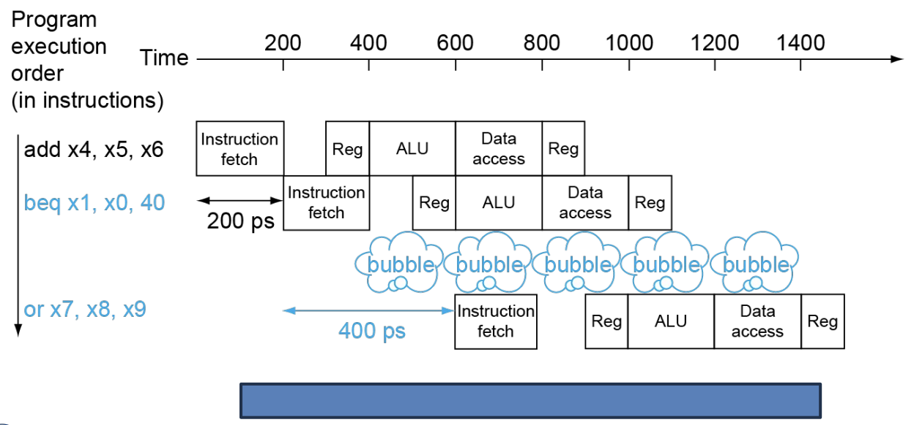</div>

    - 将比较放在 ID 级

##### Branch Prediction

- Longer pipelines can't readily determine branch outcome early

*Static* branch prediction 

- Based on typical branch（假设总是命中/不命中）

*Dynamic* branch prediction 

- Hardware measures actual branch behavior

- Assume future behavior will continue the trend（按之前的结果预测）
## 4.6 RISC-V Pipelined Datapath
竞争只会发生在**从右往左**的阶段
<div style="text-align: center"></div>

### 1. Pipeline registers
Need *registers* between stages 

- To hold information produced in previous cycle

- 不同运算单元里在执行不同的指令，防止前后两条指令之间发生冲突
<div style="text-align: center"></div>

### 2. Pipeline Operation
Cycle-by-cycle flow of instructions through the pipelined datapath 

- “Single-clock-cycle” pipeline diagram 
	
    - Shows pipeline usage in a single cycle 
	
    - Highlight resources used

- “multi-clock-cycle” diagram 
	
    - Graph of operation over time

#### Multi-Cycle Pipeline Diagram

- 展示资源占用的格式
<div style="text-align: center">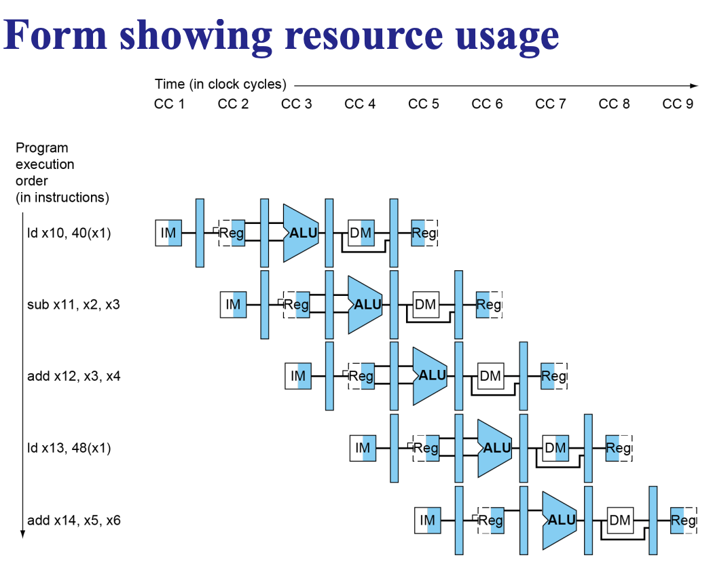</div>

- 传统格式
<div style="text-align: center"></div>

#### Single-Cycle Pipeline Diagram

- 只显示一个周期内发生的事件
<div style="text-align: center"></div>
Pipelined Control
<div style="text-align: center"></div>

## 4.7 Data Hazards
 考虑以下代码：
 ```c
 sub x2, x1, x3
 and x12, x2, x5
 or  x13, x6, x2
 add x14, x2, x2
 sd  x15, 100(x2)
 ```

We can resolve hazards with forwarding

- *How do we detect when to forward?*
### 1. Forwarding
<div style="text-align: center"></div>

- 左边两根蓝线的方向是错误的，`and` 和 `or` 得到的是之前的 `x2`（其值为 10）

- 右边的 `add` 和 `sd` 指令得到的 `x2` 是更新过的（其值为 -20）

### 2. Detecting

- **给流水线寄存器编号**  
    ▪ Eg. `ID/EX.RegisterRs1` 表示位于 ID/EX 流水线寄存器中的 Rs1 所对应的寄存器

- **在 EX 阶段，ALU 操作数的寄存器编号由以下给出**  
    ▪ `ID/EX.RegisterRs1`、`ID/EX.RegisterRs2`

#### Detecting the need to forward

!!! info Data
	**当出现以下情况时，存在数据冒险（Data Hazards）**

    - 1a. `EX/MEM.RegisterRd = ID/EX.RegisterRs1`  
    - 1b. `EX/MEM.RegisterRd = ID/EX.RegisterRs2`  
        - 前一条指令（在 EX/MEM 阶段）**即将写入的寄存器**（RegisterRd），正好是当前指令（在 EX 阶段）**第一/二个源操作数**（Rs1/Rs2）所要读的寄存器。
        - Eg: `add x5, x1, x2`，`sub x6, x5, x3`
    	→ 可从前一个指令的 **EX/MEM 流水线寄存器** 进行前推（Forward）

    - 2a. `MEM/WB.RegisterRd = ID/EX.RegisterRs1`  
    - 2b. `MEM/WB.RegisterRd = ID/EX.RegisterRs2`

        - 前一条指令（在 MEM/WB 阶段）即将写入的寄存器，等于当前指令的 **Rs1/Rs2**

        - Eg: `lw x9, 0(x10)`，`add x11, x9, x12`
        → 可从前一个指令的 **MEM/WB 流水线寄存器** 进行前推（Forward）

!!!info Control
	 当前面的指令会**写入寄存器**时才需要前向传递
	
	 - `EX/MEM.RegWrite`：表示在 EX 到 MEM 期间，该指令是否会写寄存器

	 - `MEM/WB.RegWrite`：表示在 MEM 到 WB 期间，该指令是否会写寄存器

	 - 两个信号中至少一个为真时，才有可能存在可前向传递的数据

	 当该指令的目标寄存器不是 `x0` 时才需要前向传递

	 - `EX/MEM.RegisterRd ≠ 0`：表示 EX/MEM 阶段的指令目标寄存器不是 `x0`

	 - `MEM/WB.RegisterRd ≠ 0`：表示 MEM/WB 阶段的指令目标寄存器也不是 `x0`

	 - 这两个条件确保我们只考虑 those 真正写入非零寄存器的操作

#### Forwarding Path
<div style="text-align: center">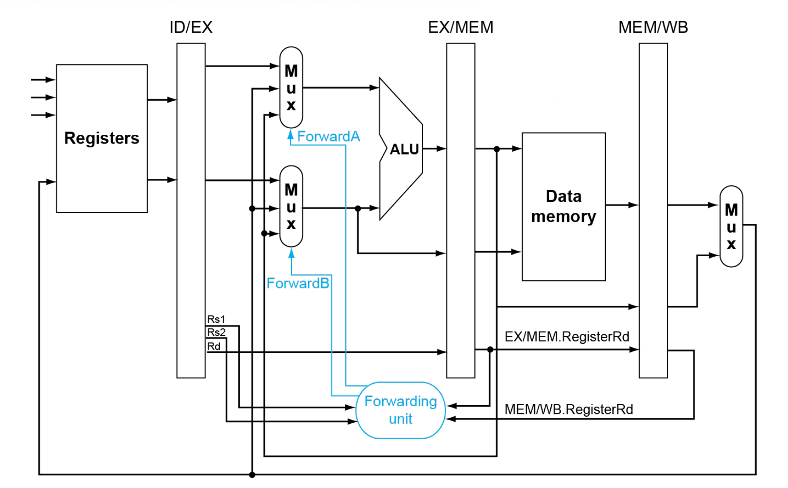</div>

| Mux control   | Source | Explanation                                                                    |
| ------------- | ------ | ------------------------------------------------------------------------------ |
| ForwardA = 00 | ID/EX  | The first ALU operand comes from the register file.                            |
| ForwardA = 10 | EX/MEM | The first ALU operand is forwarded from the prior ALU result.                  |
| ForwardA = 01 | MEM/WB | The first ALU operand is forwarded from data memory or an earlier ALU result.  |
| ForwardB = 00 | ID/EX  | The second ALU operand comes from the register file.                           |
| ForwardB = 10 | EX/MEM | The second ALU operand is forwarded from the prior ALU result.                 |
| ForwardB = 01 | MEM/WB | The second ALU operand is forwarded from data memory or an earlier ALU result. |

!!!bug Double Data Hazard
	 <div style="text-align: center">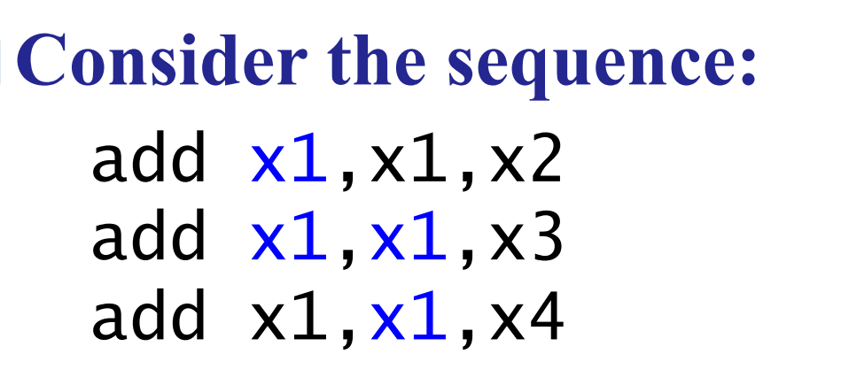</div>


	 - Only fwd if EX hazard condition isn't true

	 - 只有当 EX 阶段没有发生冒险时，才考虑从 MEM 阶段前向传递

#### Revised Forwarding Condition

- 精确判断是否需要从 MEM/WB 阶段进行数据前向传递，避免在存在 **EX 阶段冒险** 时错误地使用 MEM 阶段的数据，从而防止数据冲突或错误。

**MEM hazard**
```c
if (MEM/WB.RegWrite 
	and (MEM/WB.RegisterRd ≠ 0)
	and not (EX/MEM.RegWrite and (EX/MEM.RegisterRd ≠ 0)
		and (EX/MEM.RegisterRd = ID/EX.RegisterRs1))
	and (MEM/WB.RegisterRd = ID/EX.RegisterRs1)) 
then ForwardA = 01

if (MEM/WB.RegWrite
	and (MEM/WB.RegisterRd ≠ 0)
	and not(EX/MEM.RegWrite and (EX/MEM.RegisterRd ≠ 0)
		and (EX/MEM.RegisterRd = ID/EX.RegisterRs2))
	and (MEM/WB.RegisterRd = ID/EX.RegisterRs2)) 
then ForwardB = 01
```

**Datapath with Forwarding**
<div style="text-align: center"></div>

### 3. Load-Use Hazard Detection
如果在 ld 指令 EX/MEM 时暂停，此时 ld 后面有两条指令需要暂停，其实可以更早地发现这个问题

- 在 ID 阶段， ALU 的操作数来自于 `IF/ID.RegisterRs1`，`IF/ID.RegisterRs2`
**Load-use hazard** when:
```
ID/EX.MemRead and 
	((ID/EX.RegisterRd = IF/ID.RegisterRs1) or 
	 (ID/EX.RegisterRd = IF/ID.RegisterRs2))
```
If detected, <u>stall and insert bubble</u>

#### Stall

- 使得 ID/EX register 的控制信号为 0
	
    - EX, MEM 和 WB 不进行操作（保持原来的状态）

- 同时阻止 PC, IF/ID 寄存器的更新
	
    - 这相当于重复进行了一次 decode（下一条将被执行的指令被 fetch 了两次 ）
	
    - 1-cycle 的 stall 让 MEM 有时间去为 ld 指令读取数据
  
!!!info image

	 - 如图，一次 stall 后，Reg 中的数据可以拿来给 `or x8, x2, x6` 中的 x2 使用

	 - 在 Reg 处插入一个 bubble
	 <div style="text-align: center"></div>

	 - Datapath with Hazard Detection
	  <div style="text-align: center">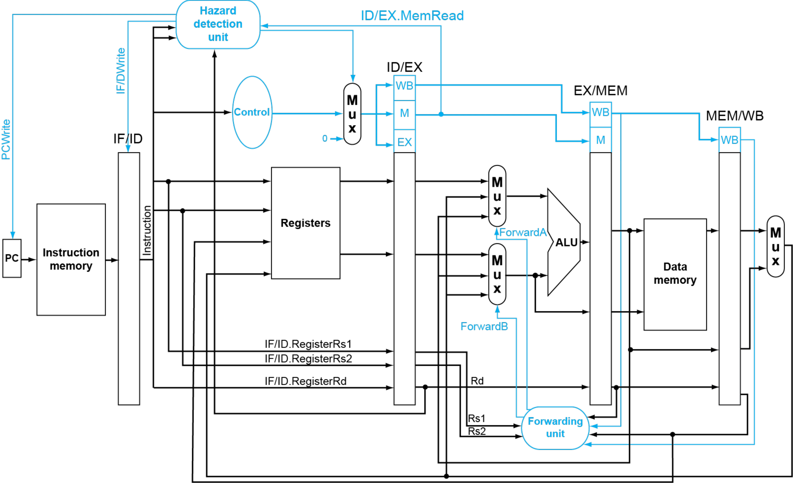</div>

## 4.8 Branch Hazards
**是否跳转**在 ALU 完成计算之后的 <u>MEM 阶段</u> 决定

- 如下图，如果发生转跳，需要清除之前的三条指令（此时恰好没有更新 DM 和 Reg，直接清除即可）
<div style="text-align: center"></div>

!!! tip
	 把原本在 EX 完成的分支判断提前到 ID 完成

	 - 在 ID 阶段已经读出两个寄存器的地址和一个立即数

	 - 可通过**Target address adder（目标地址加法器）** 或 **Register comparator（寄存器比较器）** 得出结果

	!!!example Branch Taken
		 在 ID 处完成结果的计算
		 <div style="text-align: center">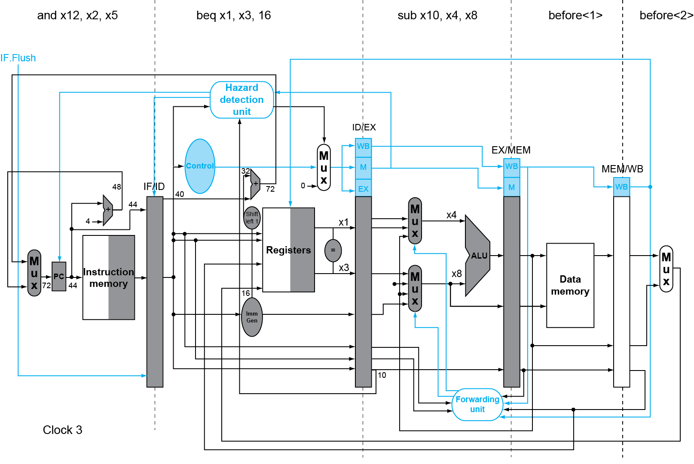</div>
		 下一个时钟周期在原来 beq 的位置插入一个 bubble（这样只可能多余一条指令）
		 <div style="text-align: center"></div>

### 1. Dynamic Branch Prediction
Branch prediction buffer (aka branch history table)

- 硬件存储结构，通常是一个小的 SRAM 表，用于记录每个分支指令在过去的行为
	
    - 每个表项对应一个分支指令地址。
	
    - 存储的是该分支最近几次是否被 taken 或 not taken

Indexed by recent branch instruction addresses (lower part)

- 为了节省空间，通常只用分支指令地址的 **低几位** 来作为表的索引
Stores outcome (taken/not taken)

- 每个表项保存一个状态，比如：
    
    - 1-bit：表示上一次是 taken 还是 not taken
    
    - 2-bit：更复杂的状态机（如 “strongly taken”, “weakly taken” 等）

!!!info To execute a branch

	 1. Check table, expect the same outcome

	 2. Start fetching from fall-through or target

	 3. If wrong, flush pipeline and flip prediction

#### 1-Bit Predictor
【缺点】对于双层循环，当内层循环要结束时会错两次（每次错误都会修改原有预测）

- Mispredict as taken on last iteration of inner loop

- Then mispredict as not taken on first iteration of inner loop next time around
<div style="text-align: center"></div>

#### 2-Bit Predictor

- 针对 1-bit 做出了改进：只有连续错误两次才会我们的预测
<div style="text-align: center"></div>

### 2. Calculating the Branch Target
Even with predictor, still need to calculate the target address

- 分支预测器只能预测“是否跳转”，但不能直接提供目标地址

- 1-cycle penalty for a **taken branch**

**Branch target buffer**

- Cache of target addresses

- Indexed by PC when instruction fetched
	
    - If hit and instruction is branch predicted taken, can fetch target immediately
	
    - 减少分支延迟，提升流水线效率，对频繁执行的循环或条件跳转非常有效

---
## 4.9 Exceptions and Interrupts
“Unexpected” events requiring change in flow of control

- ==Exception 异常==
	
    - Arises within the CPU
	
    - e.g., undefined opcode, syscall, hardware malfunction …

- ==Interrupt 中断==
	
    - From an external **I/O controller**

---
### 1. Handling Exceptions

- Save PC of offending (or interrupted) instruction 存储异常指令的 PC 值
	
    - In RISC-V: Supervisor Exception Program Counter (SEPC)

- Save indication of the problem
	
    - In RISC-V: Supervisor Exception Cause Register (SCAUSE)
	
    - 64 bits, but most bits unused
		
    - **Exception code field**（标识具体的异常类型）: 2 for undefined opcode, 12 for hardware malfunction, …

- Jump to handler
	
    - 完成上述两步处理后，CPU 会跳转到一个预定义的内存地址，开始执行异常处理代码
	
    - Assume at `0000 0000 1C09 0000hex `

#### An Alternate Mechanism
!!!info
	 传统方式中，所有异常都跳转到同一个固定地址，然后由软件判断类型并分发处理。而这里介绍的是**基于原因直接跳转到对应处理程序**的方式。
	
	 - Instructions either <u>Deal with the interrupt</u>, or <u>Jump to real handler</u>

Vectored Interrupts

- Handler address determined by the cause

- 根据异常或中断的原因（cause），直接确定处理程序的地址

Exception vector address to be added to a vector table base register:

- 系统有一个**向量表（vector table）**，存放各种异常类型的处理程序入口地址

- 每个异常类型对应一个偏移量（offset），处理器会把该偏移量 **加上一个基地址寄存器（vector table base register）**，得到最终的处理程序地址
	
    - Undefined opcode：00 0100 0000two
	
    - Hardware malfunction：01 1000 0000two
	
    - …
### 2. Handling Actions

- Read cause, and transfer to relevant handler

- Determine action required

- If restartable
	
    - Take corrective action
	
    - use SEPC to return to program

- Otherwise
	
    - Terminate program
	
    - Report error using SEPC, SCAUSE, …

### 3. Exceptions in a Pipeline
> Another form of control hazard

Consider malfunction（硬件故障）on add in EX stage `add x1, x2, x1`
处理步骤如下：
1. Prevent x1 from being clobbered
2. Complete previous instructions
3. Flush add and subsequent instructions
4. Set SEPC and SCAUSE register values

    - 由于异常发生，后续已经取指或译码的指令都是无效的
5. Transfer control to handler

    - 处理器跳转到预设的异常处理程序入口地址开始执行处理逻辑

!!!tip Pipeline with Exceptions
	 Similar to mispredicted branch
 
    - Use much of the same hardware
	 <div style="text-align: center"></div>

!!!info Properties
	Restartable exceptions
 
    - Pipeline can flush the instruction
	
    - Handler executes, then returns to the instruction

        - Refetched and executed from scratch

	PC saved in SEPC register

    - Identifies causing instruction

### 4. Multiple Exceptions
Pipelining overlaps multiple instructions

- 流水线重叠了多条指令可能同时触发异常

**Simple approach**: deal with exception from earliest instruction

- 只处理**最早进入流水线的那条异常指令**（即最早触发异常的指令）

- 忽略后续指令产生的异常，并清空后续所有指令

这样操作可以实现“**精确异常**（precise exceptions）”

- 所有在异常指令之前的指令都已完成；

- 所有在异常指令之后的指令都被清除；

- 程序状态与异常发生前一致，保证了语义正确性。

### 5. Imprecise Exceptions
> 当异常发生时，系统不能准确地确定是哪条指令引发了异常，也不能保证所有之前的指令都已正确完成

1. Just stop pipeline and save state

    - 当检测到异常时，处理器立即**暂停流水线运行**，同时保存当前状态

2. Let the handler work out

    - 让异常处理程序自行判断

3. Simplifies hardware, but more complex handler software

4. Not feasible for complex multiple-issue out-of-order pipelines

    - 对于复杂的多发射乱序流水线来说不可行

---
## 4.10 Instruction-Level Parallelism (ILP)
> Pipelining: executing multiple instructions in parallel

To increase ILP
- Deeper pipeline

    - 每个阶段的工作量减少 → 单个阶段延迟降低 → 使 clock cycle 减小

- Multiple issue
	
    - Replicate pipeline stages $\Rightarrow$ multiple pipelines
	
    - Start multiple instructions per clock cycle
	
    - CPI < 1, so use <u>Instructions Per Cycle (IPC)</u>
	
    - E.g., 4GHz 4-way multiple-issue
		
    - 16 BIPS, peak CPI = 0.25, peak IPC = 4
	
    - But dependencies reduce this in practice

### 1. Multiple Issue

**Static multiple issue 静态多发射**
编译器在程序运行前就决定哪些指令可以并行执行

- Compiler groups instructions into "issue packets"
	编译器分析代码，找出没有数据和控制依赖的指令，并将它们**打包成一组**
	
    - Group of instructions that can be issued on a single cycle
	
    - Determined by pipeline resources required

- Compiler detects and avoids hazards

**Dynamic multiple issue 动态多发射**
CPU 在运行时决定哪些指令可以并发执行

- CPU examines instruction stream and chooses instructions to issue each cycle

- Compiler can help by <u>reordering instructions</u>

- CPU resolves hazards using advanced techniques at runtime

#### Static Multiple Issue
Compiler groups instructions into ==“issue packets”==

- Group of instructions that can be issued on a single cycle

- Determined by pipeline resources required

Think of an issue packet as a very long instruction

- Specifies multiple concurrent operations

- $\Rightarrow$ Very Long Instruction Word (VLIW)

Compiler must remove some/all hazards

- Reorder instructions into issue packets

- No dependencies with a packet

- Possibly some dependencies between packets
	
    - Varies between ISAs; compiler must know!

- Pad with nop if necessary

##### RISC-V with Static Dual Issue

!!!example RISC-V with Static Dual Issue
	 **Two-issue packets** include：
	
	 - One <u>ALU/branch instruction</u> and <u>One load/store instruction</u>

	 - 64-bit aligned
 	
    	 - ALU/branch, then load/store
 	
    	 - Pad an unused instruction with nop 
	 	(如果某处没有 load/store 指令，则用 nop（空操作）填充，保持结构完整)
	 		<div style="text-align: center">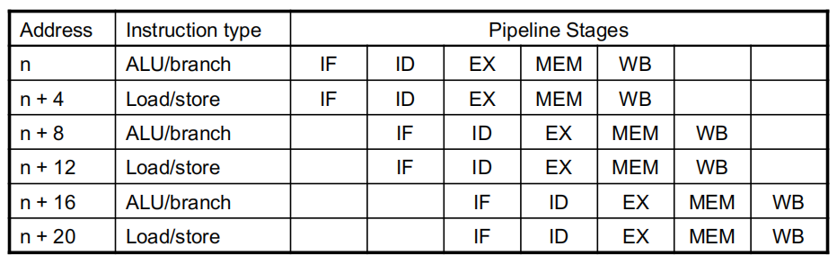</div>
 
	 **Pipeline**
	 <div style="text-align: center">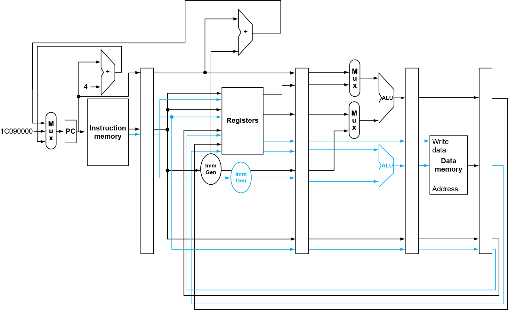</div>
 
	 **Hazards in the Dual-Issue RISC-V**

	 1. EX data hazard
    	 - Forwarding avoided stalls with single-issue
 	
      	 - Now can't use ALU result in load/store in same packet
 		
        	 - `add x10, x0, x1   ld x2, 0(x10) `
		
        	 - Split into two packets, effectively a stall

	 2. Load-use hazard
 	
      	 - Still one cycle use latency, but now two instructions

	 3. More aggressive scheduling required

		 !!! example
		 	Schedule this for dual-issue RISC-V
		 	<div style="text-align: center"></div>

##### Loop Unrolling
> **循环展开** 是指将循环体中的代码复制多次，从而减少循环控制的开销，并暴露出更多的并行性，使处理器能够更高效地执行

- Replicate loop body to expose more parallelism
	
    - Reduces loop-control overhead

- Use different registers per replication
	
    - Called “register renaming” 
	
    - Avoid loop-carried “anti-dependencies” 
		
        - **反依赖** 是一种**写后读（Write-after-Read, WAR）** 的依赖关系
		
        - Store followed by a load of the same register 
		
        - Aka “name dependence” 
			
            - Reuse of a register name
<div style="text-align: center"></div>

#### Dynamic Multiple Issue
“Superscalar” processors（一个时钟周期内执行多条指令的处理器）

- CPU decides whether to issue 0, 1, 2, … each cycle 
	
    - Avoiding structural and data hazards 

- Avoids the need for compiler scheduling 
	
    - Though it may still help, but **Code semantics（代码语义**）is ensured by the CPU

##### Dynamic Pipeline Scheduling

- Allow the CPU to execute instructions out of order to avoid stalls
	
    - **执行阶段可乱序**：只要没有数据依赖，CPU 可以提前执行后面的指令
	
    - **提交阶段必须按序**：最终结果写回寄存器时，必须按照原始程序顺序进行（in-order commit），确保程序语义不变

<div style="text-align: center"></div>

##### Register Renaming

- Reservation stations and reorder buffer effectively provide register renaming 

- On instruction issue to reservation station 
	
    - If operand is available in register file or reorder buffer 
		
    - Copied to reservation station 
		
    - No longer required in the register; can be overwritten 
	
- If operand is not yet available 
		
    - It will be provided to the reservation station by a function unit 
		
    - Register update may not be required

!!! example
	 ```nasm
	 add x1, x2, x3
	 ```

    - 若 `x2` 和 `x3` 已经在寄存器中，就直接将值拷贝到保留站

    - 此时原寄存器 `x2`, `x3` 不再需要保留这些值，可以用于后续指令
	 ```nasm
	 ld x1, 0(x2) # 加载数据到 x1 
	 add x3, x1, x4 # 等待 x1 的值
	 ```

    - `add` 发射时，`x1` 尚未就绪；保留站标记 `x1` 为“待定”；

    - 当 `ld` 完成后，结果会直接传给 `add` 的保留站；

    - 不需要先写回寄存器 `x1`，然后让 `add` 再读取 —— 这就是**数据前推（forwarding）** 和**寄存器重命名**结合的效果。

##### Speculation

- Predict branch and continue issuing 
	
    - Don't commit until branch outcome **determined** 

- Load speculation 
	
    - Avoid load and cache miss delay 
		内存访问可能需要几十甚至上百个时钟周期，CPU 在等待期间会空闲。因此，可以尝试“提前加载”数据。
		
    - Predict the effective address 
		
    - Predict loaded value 
		
    - Load before completing outstanding stores 
		
    - Bypass stored values to load unit 
	
    - Don't commit load until speculation **cleared**

##### Why Do Dynamic Scheduling?
选择动态调度而不是让编辑器调度的原因：

- Not all stalls are predicable n 
	
    - e.g., cache misses 

- Can't always schedule around branches 
	
    - Branch outcome is dynamically determined 

- Different implementations of an ISA have different latencies and hazards

### 2. Speculation
“Guess” what to do with an instruction

- Start operation as soon as possible

- Check whether guess was right
	
    - If so, complete the operation
	
    - If not, roll-back and do the right thing
Common to static and dynamic multiple issue

!!! example

    - Speculate on **branch outcome**
 	
        - Roll back if path taken is different

    - Speculate on **load**
 	
        - Roll back if location is updated

#### Compiler/Hardware Speculation
Compiler can reorder instructions
**静态推测**的一种形式，由编译器在程序运行前进行优化

- e.g., move load before branch

- Can include “fix-up” instructions to recover from incorrect guess

Hardware can look ahead for instructions to execute
**动态推测**的一种形式，CPU 在运行时自主决策

- Buffer results until it determines they are actually needed
	- 当处理器推测执行某条指令时，将结果**暂存到缓冲区**中

- Flush buffers on incorrect speculation

#### Speculation and Exceptions
当一条被推测执行的指令触发了异常时，系统该如何处理？

- e.g., speculative load before null-pointer check
```c
if (ptr != NULL) {
 x = *ptr; // 此处可能被推测执行 
}
```

- 处理器可能**在 `ptr != NULL` 判断完成前**，就提前执行 `*ptr` 操作

- 如果 `ptr` 为 `NULL`，那么这个加载就会导致 **段错误** 或 **非法内存访问异常**

Static speculation

- Can add ISA support for deferring exceptions

- 允许某些指令在推测执行时产生异常，但不立即中断程序，而是将异常“挂起”（deferred），等到确定该指令确实需要执行时再决定是否抛出

Dynamic speculation

- Can <u>buffer exceptions</u> until instruction completion (which may not occur)

---
## 4.14 Fallacies
!!!bug Fallacies

    - ~~流水线很简单~~
 	
        - 大致思路很简单（洗衣服的那个类比），但细节上的理解就困难了（比如处理各类冒险问题等）

    - 流水线思想的实现与工艺无关
 	
        - 实际上，更多的晶体管将会带来更高级的工艺
 	
        - 流水线相关的 ISA 设计需要考虑工艺的发展趋势

!!!bug Pitfalls

    - 不良的 ISA 设计将会对流水线运行产生不利影响
 	
    - 复杂的指令集、复杂的寻址模式、延迟分支都会影响流水线的运行效率